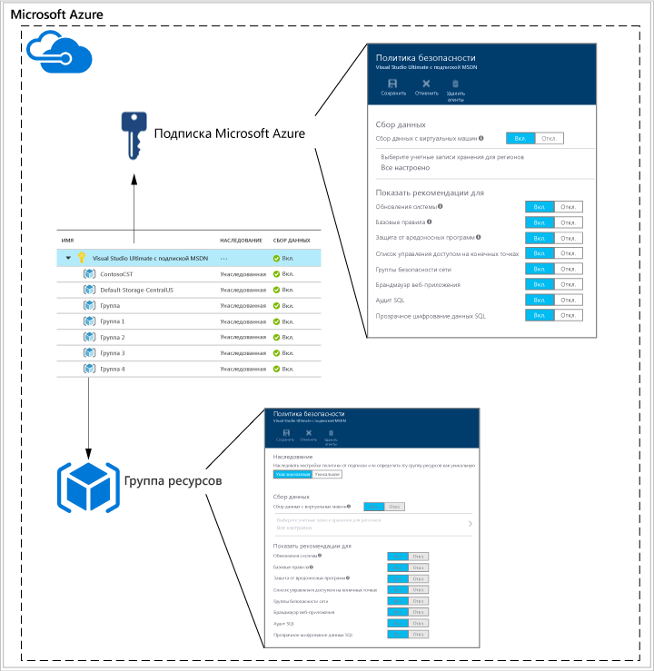
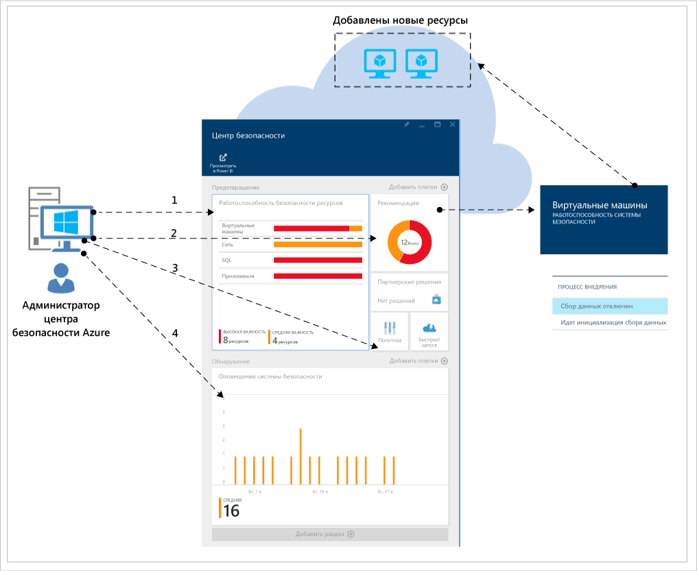
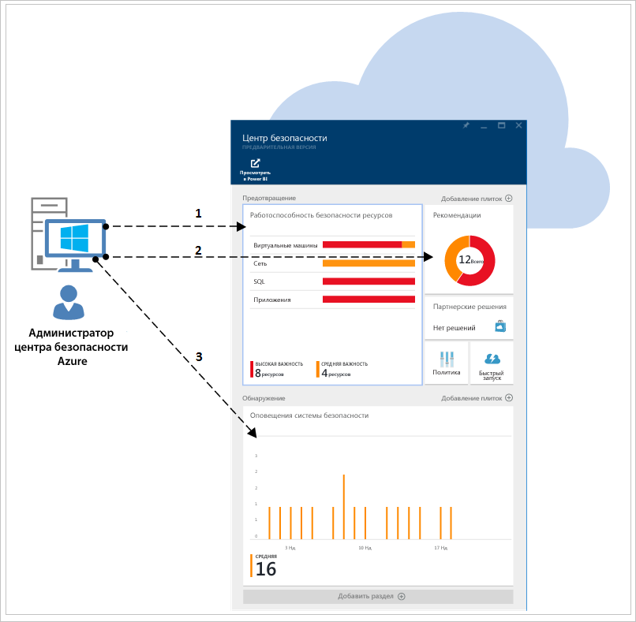

<properties
   pageTitle="Руководство по планированию использования центра безопасности Azure и работе в нем | Microsoft Azure"
   description="Этот документ поможет вам спланировать работу перед переходом на использование центра безопасности Azure. Кроме того, здесь содержатся рекомендации по ежедневно выполняемым операциям."
   services="security-center"
   documentationCenter="na"
   authors="YuriDio"
   manager="swadhwa"
   editor=""/>

<tags
   ms.service="security-center"
   ms.topic="hero-article"
   ms.devlang="na"
   ms.tgt_pltfrm="na"
   ms.workload="na"
   ms.date="09/22/2016"
   ms.author="yurid"/>

# Руководство по планированию использования центра безопасности Azure и работе в нем
Это руководство предназначено для ИТ-специалистов, ИТ-архитекторов, аналитиков в сфере информационной безопасности и администраторов облака, организации которых планируют использовать центр безопасности Azure.

## Руководство по планированию
В этом руководстве представлены шаги и задачи, которые помогут оптимизировать использование центра безопасности с учетом требований к безопасности и модели управления облаком в вашей организации. Чтобы воспользоваться всеми преимуществами центра безопасности, важно понять, каким образом разные люди или группы в организации используют эту службу. Это позволит обеспечить соответствие требованиям к безопасной разработке и эксплуатации, мониторингу, управлению и реагированию на инциденты. Планируя использование центра безопасности, следует учитывать такие ключевые области:

- роли безопасности и элементы контроля доступа;
- политики безопасности и рекомендации по ее обеспечению;
- сбор и хранение данных;
- текущий мониторинг безопасности;
- реагирование на инциденты.

В следующем разделе вы узнаете, как спланировать работу каждой из этих областей и применить эти рекомендации в соответствии со своими требованиями.

> [AZURE.NOTE] Список вопросов, который может пригодиться при разработке и планировании, см. в статье [Центр безопасности Azure: часто задаваемые вопросы](security-center-faq.md).

## Роли безопасности и элементы контроля доступа
В зависимости от размера и структуры организации центр безопасности могут использовать несколько пользователей и групп, чтобы выполнять различные задачи, связанные с безопасностью. На следующем рисунке представлен пример работы вымышленных пользователей, а также их ролей и обязанностей в сфере безопасности.

Центр безопасности позволяет этим пользователям выполнять различные обязанности. Например:

**Джефф (владелец облачной рабочей нагрузки)**

- Управляет облачной рабочей нагрузкой и связанными с нею ресурсами.
- Ответственный за внедрение и обслуживание средств защиты в соответствии с политикой безопасности компании.

**Лилия (руководитель по информационной безопасности, директор по информационным технологиям)**

- Ответственная за все аспекты безопасности компании.
- Хочет иметь представление о состоянии безопасности в облачных рабочих нагрузках.
- Должна получать уведомления о всех значительных атаках и рисках.

**Дэвид (специалист по ИТ-безопасности)**

- Задает политики безопасности компании, чтобы обеспечить должный уровень защиты.
- Отслеживает соответствие политикам.
- Создает отчеты для руководства или аудиторов.

**Марта (специалист по операциям безопасности)**

- Ответственная за круглосуточное отслеживание оповещений безопасности и реагирование на них.
- Передает обнаруженные оповещения на обработку владельцу облачной рабочей нагрузки или аналитику по системам ИТ-безопасности.

**Григорий (аналитик по системам безопасности)**

- Исследует атаки.
- Устраняет причины, вызвавшие оповещения, самостоятельно или совместно с владельцем облачной рабочей нагрузки.

Центр безопасности использует [управление доступом на основе ролей (RBAC)](../active-directory/role-based-access-control-configure.md), в котором предусмотрены [встроенные роли](../active-directory/role-based-access-built-in-roles.md). Эти роли можно назначать пользователям, группам и службам в Azure. В центре безопасности пользователь видит сведения, относящиеся только к тем ресурсам, к которым у него есть доступ, то есть для которых ему назначена роль владельца, участника или читателя подписки либо группы ресурсов, к которым относится ресурс. Таким образом, для описанных выше сотрудников понадобятся следующие роли RBAC:

**Джефф (владелец облачной рабочей нагрузки)**

- владелец или участник группы ресурсов.

**Дэвид (специалист по ИТ-безопасности)**

- владелец или участник подписки.

**Марта (специалист по операциям безопасности)**

- читатель подписки с возможностью просмотра оповещений;
- владелец или участник подписки (требуется для закрытия оповещений).

**Григорий (аналитик по системам безопасности)**

- читатель подписки с возможностью просмотра оповещений;
- владелец или участник подписки (требуется для исправления неполадок или закрытия оповещений);
- может потребоваться доступ к службе хранилища.

Нужно также учитывать следующее:

- Только владельцы и участники подписки могут изменить политику безопасности.
- Только владельцы и участники подписки и группы ресурсов могут применить рекомендации по безопасности для ресурса.

Если вы планируете контролировать доступ, используя RBAC для центра безопасности, определите, кто в организации будет пользоваться центром, а также какие типы задач будут выполнять эти пользователи.

> [AZURE.NOTE] Рекомендуется назначить пользователям роли с минимальными разрешениями, необходимыми для выполнения их задач. Например, пользователям, которым нужно только просматривать сведения о состоянии безопасности ресурсов и не нужно выполнять какие-либо действия (к примеру, применять рекомендации или изменять политики), следует назначить роль читателя.

## Политики безопасности и рекомендации по ее обеспечению
Политика безопасности определяет набор элементов управления, которые рекомендуются для ресурсов в указанной подписке или группе ресурсов. В центре безопасности вы можете настраивать политики в соответствии с требованиями безопасности вашей компании, типом приложений и конфиденциальностью данных.

Политики, включенные на уровне подписки, автоматически распространяются на все группы ресурсов в рамках подписки, как показано на следующей схеме.

Как показано на схеме выше, группы ресурсов могут наследовать политики безопасности с уровня подписки.

В некоторых сценариях, когда в группе ресурсов есть ресурсы, требующие другого набора политик, наследование можно отключить и применить настраиваемые политики к определенной группе ресурсов.

Если для определенных групп ресурсов нужно установить настраиваемые политики, следует отключить наследование в группе ресурсов и изменить политики безопасности. Например, при наличии рабочих нагрузок, которые не требуют политики прозрачного шифрования данных SQL, отключите политику на уровне подписки и включите ее только в тех группах ресурсов, которым нужно ее использовать.

Начав создавать настраиваемые политики для разных групп ресурсов, необходимо спланировать их развертывание с учетом того, что в случае конфликта политик (подписки и группы ресурсов) больший приоритет получает политика группы ресурсов.

> [AZURE.NOTE] Если нужно просмотреть, какие политики изменены, можно использовать [журналы аудита Azure](https://blogs.msdn.microsoft.com/cloud_solution_architect/2015/03/10/audit-logs-for-azure-events/). Изменения политик всегда регистрируются в журналах аудита Azure.

### Рекомендации по обеспечению безопасности

Перед настройкой политик безопасности следует ознакомиться со всеми [рекомендациями по обеспечению безопасности](security-center-recommendations.md) и определить, применимы ли они к различным подпискам и группам ресурсов, которые вы используете. Кроме того, важно понимать, какие действия нужно будет предпринять для реализации рекомендаций по обеспечению безопасности.

**Endpoint Protection**. Если для виртуальной машины не включено решение Endpoint Protection, центр безопасности порекомендует установить такое решение. Если вы уже установили предпочтительное решение Endpoint Protection локально в своей организации, необходимо решить, будет ли использоваться та же антивредоносная программа в виртуальных машинах Azure. В центре безопасности можно выбрать один из нескольких вариантов Endpoint Protection. Можно использовать антивредоносные программы Майкрософт или выбрать одно из множества интегрированных решений для защиты конечных точек от партнеров. Дополнительные сведения о развертывании антивредоносных программ с помощью центра безопасности Azure см. в статье [Установка Endpoint Protection в центре безопасности Azure](security-center-install-endpoint-protection.md).

**Обновления системы**. Центр безопасности определит виртуальные машины, в которых отсутствуют обновления безопасности или критически важные обновления операционной системы для IaaS и облачных служб (PaaS). При необходимости выберите ответственного за обновление, а также определите способ обновления. Во многих организациях используют службы WSUS, Центр обновления Windows или другие средства.

**Базовые конфигурации**. Если конфигурации операционной системы виртуальной машины не соответствуют рекомендуемым базовым показателям, предоставляются рекомендации. Просмотрите набор базовых показателей [здесь](https://gallery.technet.microsoft.com/Azure-Security-Center-a789e335) и определите, как применяются конфигурации операционной системы.

**Шифрование дисков**. Если у вас есть незашифрованные диски виртуальной машины, центр безопасности Azure порекомендует применить шифрование дисков Azure. Эти технологии обеспечивают шифрование томов для дисков операционной системы и данных с помощью BitLocker (для Windows) или DM-Crypt (для Linux). Выбрав рекомендацию, вы будете перенаправлены на [пошаговое руководство](security-center-disk-encryption.md) с инструкциями по шифрованию.

Обратите внимание, что существует несколько сценариев шифрования. Необходимо спланировать уникальные требования для каждого из этих сценариев:

- шифрование новых виртуальных машин Azure из VHD, зашифрованных с помощью собственных ключей шифрования;
- шифрование новых виртуальных машин Azure, созданных из коллекции Azure;
- шифрование виртуальных машин Azure, работающих в среде Azure.

Для каждого из этих сценариев будут разные требования к планированию. Дополнительные сведения о каждом из этих сценариев см. в [техническом документе о шифровании дисков Azure](https://gallery.technet.microsoft.com/Azure-Disk-Encryption-for-a0018eb0).

**Брандмауэр веб-приложения**. Центр безопасности определит виртуальные машины, на которых выполняются веб-приложения, и порекомендует установить брандмауэр веб-приложения (WAF). Оцените доступные партнерские решения, чтобы выбрать самое подходящее для своей организации, и определите способ лицензирования решения (решения партнеров могут поддерживать модели с использованием собственной лицензии и/или с оплатой по мере использования). Дополнительные сведения о развертывании брандмауэра веб-приложения на виртуальных машинах Azure с использованием центра безопасности см. в статье [Добавление брандмауэра веб-приложения в Центре безопасности Azure](security-center-add-web-application-firewall.md).

**Брандмауэр следующего поколения**. Позволяет подготовить виртуальное устройство от ведущих поставщиков, включая Check Point. В ближайшем будущем с помощью этого брандмауэра можно будет подготавливать устройства Cisco и Fortinet. Он расширяет защиту сети за пределы групп безопасности сети, встроенных в Azure. Центр обеспечения безопасности будет обнаруживать развертывания, для которых рекомендуется использовать брандмауэр следующего поколения, и позволит подготовить виртуальное устройство.

**Виртуальные сети**. Центр безопасности оценивает инфраструктуру и конфигурацию [виртуальной сети Azure](https://azure.microsoft.com/documentation/services/virtual-network/), чтобы убедиться, что [группы безопасности сети](../virtual-network/virtual-networks-nsg.md) применяются и настроены должным образом с помощью правил входящего трафика. Вам нужно решить, какие правила трафика следует определить, и сообщить об этом сотрудникам, которые будут применять соответствующие рекомендации по обеспечению безопасности.

Центр безопасности порекомендует вам указать сведения о контактных лицах по вопросам безопасности для подписки Azure. Корпорация Майкрософт будет использовать эту информацию для связи с вами, если центр Microsoft Security Response Center (MSRC) обнаружит, что к вашим пользовательским данным был получен незаконный или несанкционированный доступ. Дополнительные сведения о том, как включить эту рекомендацию, см. в статье [Предоставление сведений о контактных лицах по вопросам безопасности в центре безопасности Azure](security-center-provide-security-contact-details.md).

## Сбор и хранение данных

Настоятельно рекомендуем включить сбор данных для каждой подписки, так как это обеспечит доступность мониторинга безопасности для всех виртуальных машин. Сбор данных включается с помощью агента мониторинга Azure (ASMAgentLauncher.exe) и расширения "Мониторинг безопасности Azure" (ASMMonitoringAgent.exe).

Расширение "Мониторинг безопасности Azure" сканирует систему на наличие конфигураций, связанных с безопасностью, и собирает журналы данных безопасности на виртуальных машинах. Эти данные отправляются в указанную учетную запись хранения. На виртуальной машине также будет установлен диспетчер сканирования (ASMSoftwareScanner.exe), который будет служить сканером исправлений.

После включения сбора данных в политике безопасности на всех существующих и новых поддерживаемых виртуальных машинах, подготовленных к работе в Azure, будут автоматически установлены агент и расширения мониторинга. Агент не мешает работе и не влияет на производительность виртуальной машины.

> [AZURE.NOTE] Чтобы устранить неполадки, связанные с агентом мониторинга центра безопасности Azure, см. [руководство по устранению неполадок в центре безопасности Azure](security-center-troubleshooting-guide.md).

Если в будущем вы захотите отключить сбор данных, это можно сделать в политике безопасности. Чтобы удалить ранее развернутые агенты мониторинга, выберите пункт меню "Удалить агенты".

> [AZURE.NOTE] Список поддерживаемых виртуальных машин см. в статье [Центр безопасности Azure: часто задаваемые вопросы](security-center-faq.md).

Для каждого региона, в котором у вас есть виртуальные машины, выберите учетную запись хранения, где хранятся данные, собираемые с этих виртуальных машин. Если вы не выберете учетную запись хранения для каждого региона, она будет создана автоматически. Можно выбрать место хранения по регионам или хранить все данные в одном месте. Политики безопасности можно настроить на уровне подписки Azure и на уровне группы ресурсов, но выбрать регион для учетной записи хранения можно только на уровне подписки.

Если вы используете общую учетную запись хранения для работы с различными ресурсами Azure, обязательно прочитайте статью [Целевые показатели масштабируемости и производительности службы хранилища Azure](../storage/storage-scalability-targets.md), в которой содержатся дополнительные сведения об ограничениях размера. К подписке также применяются ограничения учетных записей хранения. Дополнительные сведения об этих ограничениях см. в статье [Подписка Azure, границы, квоты и ограничения службы](../azure-subscription-service-limits.md).

> [AZURE.NOTE] Оплата использования этого хранилища не входит в цену центра безопасности и взимается отдельно по обычным [тарифам для службы хранилища Azure](https://azure.microsoft.com/pricing/details/storage/).

При планировании производительности и масштабируемости следует также учитывать размер среды и ресурсов Azure, использующих учетную запись хранения. Дополнительные сведения см. в статье [Производительность хранилища Microsoft Azure и контрольный список масштабируемости](../storage/storage-performance-checklist.md).

## Текущий мониторинг безопасности

После первоначальной настройки и применения рекомендаций центра безопасности следует рассмотреть рабочие процессы центра безопасности.

Чтобы войти в центр безопасности через портал Azure, щелкните **Обзор** и введите **Центр безопасности** в поле **Фильтр**. Информация будет отображаться в соответствии с примененными фильтрами.

Центр безопасности не повлияет на выполнение обычных операций. Он будет выполнять пассивный мониторинг развертываний и предоставлять рекомендации в соответствии с включенными политиками безопасности.

Панель мониторинга центра безопасности состоит из двух основных частей:

- Предотвращение
- Обнаружение

При первом включении сбора данных в центре безопасности для текущей среды Azure обязательно просмотрите все рекомендации. Для этого щелкните колонку **Рекомендации** или просмотрите их для каждого ресурса (последовательно выберите **Виртуальная машина**, **Сети**, **SQL** и **Приложение**).

После выполнения всех рекомендаций все соответствующие ресурсы в разделе **Предотвращение** должны быть отмечены зеленым цветом. С этого момента постоянный мониторинг станет проще, так как вы будете принимать меры в зависимости от изменений на плитках работоспособности системы безопасности ресурсов и рекомендаций по обеспечению безопасности ресурсов.

В разделе **Обнаружение** выполняется больше действий. Здесь появляются оповещения о текущих проблемах или о проблемах, которые возникали в прошлом и были обнаружены элементами управления центра безопасности и сторонними системами. На плитке "Оповещения системы безопасности" будут отображаться гистограммы с данными о количестве ежедневно обнаруживаемых оповещений об угрозах, а также их распределение по различным категориям серьезности (низкая, средняя, высокая). Дополнительные сведения об оповещениях системы безопасности см. в статье [Управление оповещениями безопасности в Центре безопасности Azure и реагирование на них](security-center-managing-and-responding-alerts.md).

> [AZURE.NOTE] Кроме того, вы можете использовать Microsoft Power BI, чтобы визуализировать данные центра безопасности. Дополнительные сведения см. в статье [Анализ данных центра безопасности Azure с помощью Power BI](security-center-powerbi.md).

### Мониторинг новых и измененных ресурсов

Большинство сред Azure динамичны. В них регулярно развертываются новые ресурсы с учетом конфигураций или изменений. Центр безопасности предоставляет полные сведения о состоянии безопасности новых ресурсов.

При добавлении новых ресурсов (виртуальных машин, баз данных SQL) в среду Azure центр безопасности автоматически обнаружит их и начнет следить за их безопасностью. Это касается в том числе веб-ролей и рабочих ролей PaaS. Если в [политике безопасности](security-center-policies.md) включен сбор данных, дополнительные возможности мониторинга будут включены для виртуальных машин автоматически.

.

1.	Чтобы выполнить мониторинг виртуальных машин, откройте плитку **Работоспособность безопасности ресурсов** и щелкните **Виртуальные машины**. Все проблемы, связанные со сбором данных, или соответствующие рекомендации будут отображаться в разделе **Рекомендации по мониторингу**.
2.	Просмотрите раздел **Рекомендации**, чтобы проверить наличие угроз безопасности для нового ресурса.
3.	Зачастую при добавлении в среду новых виртуальных машин изначально устанавливается только операционная система. Владельцу ресурса может потребоваться некоторое время, чтобы развернуть другие приложения, которые будут использоваться в этих виртуальных машинах. В идеале следует знать, для чего предназначена эта рабочая нагрузка. Будет ли она служить в качестве сервера приложений? Исходя из предназначения этой новой рабочей нагрузки, можно включить соответствующую **политику безопасности**. Это третий шаг в рабочем процессе.
4.	По мере добавления новых ресурсов в среду Azure на плитке **Оповещения системы безопасности** могут появляться новые оповещения. Всегда проверяйте наличие новых оповещений на этой плитке и принимайте меры согласно рекомендациям центра безопасности.

Кроме того, необходимо регулярно отслеживать состояние существующих ресурсов, чтобы выявлять изменения конфигурации, которые привели к появлению угроз безопасности, несоответствию рекомендуемым базовым показателям и возникновению оповещений системы безопасности. Запустите панель мониторинга центра безопасности. Там нужно регулярно следить за тремя основными аспектами.

.

1.	Панель **Работоспособность безопасности ресурсов** обеспечивает быстрый доступ к ключевым ресурсам. Используйте ее для мониторинга виртуальных машин, сетей, SQL и приложений.
2.	На панели **Рекомендации** можно просмотреть рекомендации центра безопасности. Мониторинг может показать, что рекомендации не поступают ежедневно. Это обычная ситуация, если вы выполнили все рекомендации при первоначальной настройке центра безопасности. Именно поэтому новые сведения могут не появляться в этом разделе ежедневно. Достаточно просматривать его по мере необходимости.
3.	Сведения на панели **Обнаружение** могут меняться с разной периодичностью. Всегда просматривайте оповещения системы безопасности и принимайте меры в соответствии с рекомендациями центра безопасности.

## Реагирование на инциденты

Центр безопасности обнаруживает угрозы и оповещает о них по мере возникновения. Организациям необходимо отслеживать появление оповещений системы безопасности и принимать меры, необходимые для изучения атаки и устранения ее последствий. Дополнительные сведения о способах обнаружения угроз в центре безопасности см. в статье [Возможности обнаружения центра безопасности Azure](security-center-detection-capabilities.md).

Целью этой статьи не является помощь в создании плана реагирования на инциденты, поэтому в качестве основы для этапов реагирования мы будем использовать методы реагирования центра безопасности Microsoft Azure в жизненном цикле облака. Эти этапы показаны на схеме ниже.

.

> [AZURE.NOTE] См. публикацию [Computer Security Incident Handling Guide](http://nvlpubs.nist.gov/nistpubs/SpecialPublications/NIST.SP.800-61r2.pdf) (Руководство по реагированию на инциденты системы безопасности компьютера) Национального института стандартов и технологий. Этот документ можно использовать в качестве справочного руководства по созданию такого плана.

Вы можете использовать оповещения центра безопасности на следующих этапах.

- **Обнаружение** — определите подозрительную активность на одном или нескольких ресурсах.
- **Оценка** — выполните первоначальную оценку, чтобы получить дополнительные сведения о подозрительной активности.
- **Диагностика** — используйте действия по исправлению, чтобы выполнить технические процедуры для решения проблемы.

Каждое оповещение системы безопасности содержит сведения, которые позволяют лучше понять характер атаки и определить возможные способы устранения риска. Некоторые оповещения также содержат ссылки на дополнительные сведения или другие источники сведений в Azure. Этими сведениями можно воспользоваться для дальнейшего исследования и устранения рисков.

В следующем примере показаны подозрительные действия с протоколом удаленного рабочего стола.

Как видно, в этой колонке показаны сведения о времени атаки, имени узла источника, целевой виртуальной машине, а также указаны рекомендации. В некоторых случаях сведения об источнике атаки могут отсутствовать. Дополнительные сведения о таком поведении см. в статье блога [Missing Source Information in Azure Security Center Alerts](https://blogs.msdn.microsoft.com/azuresecurity/2016/03/25/missing-source-information-in-azure-security-center-alerts/) (Отсутствие сведений об источнике в оповещениях центра безопасности Azure).

См. видео [How to Leverage the Azure Security Center & Microsoft Operations Management Suite for an Incident Response](https://channel9.msdn.com/Blogs/Taste-of-Premier/ToP1703) (Использование центра безопасности Azure и Microsoft Operations Management Suite для реагирования на инциденты), чтобы понять, как можно использовать центр безопасности на каждом из этих этапов.

> [AZURE.NOTE] Дополнительные сведения об использовании возможностей центра безопасности для реагирования на инциденты см. в статье [Использование центра безопасности Azure для реагирования на инциденты](security-center-incident-response.md).

## См. также
В этом документе описывается, как спланировать переход к использованию центра безопасности. Дополнительные сведения о Центре безопасности см. в следующих статьях:

- [Управление оповещениями безопасности в Центре безопасности Azure и реагирование на них](security-center-managing-and-responding-alerts.md)
- [Наблюдение за работоспособностью системы безопасности в Центре безопасности Azure](security-center-monitoring.md) — узнайте, как отслеживать работоспособность ресурсов Azure.
- [Мониторинг решений партнеров с помощью центра безопасности Azure](security-center-partner-solutions.md) — узнайте, как отслеживать состояние работоспособности решений партнеров.
- [Центр безопасности Azure: часто задаваемые вопросы](security-center-faq.md). Часто задаваемые вопросы об использовании этой службы.
- [Блог по безопасности Azure](http://blogs.msdn.com/b/azuresecurity/). Записи блога, посвященные безопасности и соответствию требованиям в Azure.

<!---HONumber=AcomDC_0928_2016-->