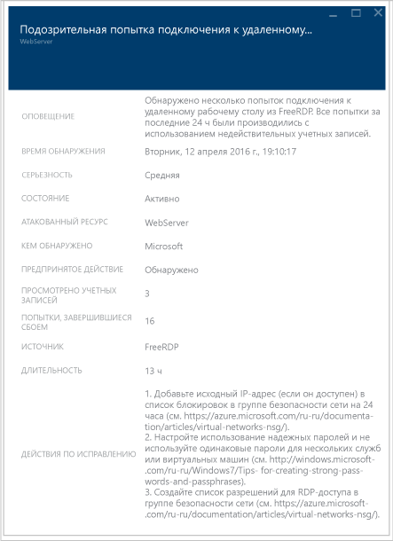

# Руководство по планированию использования центра безопасности Azure и работе в нем
Это руководство предназначено для ИТ-специалистов, ИТ-архитекторов, аналитиков в сфере информационной безопасности и администраторов облака, организации которых планируют использовать центр безопасности Azure.

    
## Руководство по планированию
В этом руководстве представлены шаги и задачи, которые помогут оптимизировать использование центра безопасности с учетом требований к безопасности и модели управления облаком в вашей организации. Чтобы воспользоваться всеми преимуществами центра безопасности, важно понять, каким образом разные люди или группы в организации используют эту службу. Это позволит обеспечить соответствие требованиям к безопасной разработке и эксплуатации, мониторингу, управлению и реагированию на инциденты. Планируя использование центра безопасности, следует учитывать такие ключевые области:

* роли безопасности и элементы контроля доступа;
* политики безопасности и рекомендации по ее обеспечению;
* сбор и хранение данных;
* Текущие ресурсы, не относящиеся к Azure
* текущий мониторинг безопасности;
* реагирование на инциденты.

В следующем разделе вы узнаете, как спланировать работу каждой из этих областей и применить эти рекомендации в соответствии со своими требованиями.

> [!NOTE]
> Список вопросов, который может пригодиться при разработке и планировании, см. в статье [Центр безопасности Azure: часто задаваемые вопросы](security-center-faq.md).
> 

## роли безопасности и элементы контроля доступа;
В зависимости от размера и структуры организации центр безопасности могут использовать несколько пользователей и групп, чтобы выполнять различные задачи, связанные с безопасностью. На следующем рисунке представлен пример работы вымышленных пользователей, а также их ролей и обязанностей в сфере безопасности.

Центр безопасности позволяет этим пользователям выполнять различные обязанности. Например: 

**Джефф (владелец рабочей нагрузки)**

* Управляет облачной рабочей нагрузкой и связанными с нею ресурсами.
* Ответственный за внедрение и обслуживание средств защиты в соответствии с политикой безопасности компании.

**Лилия (руководитель по информационной безопасности, директор по информационным технологиям)**

* Ответственная за все аспекты безопасности компании.
* Хочет иметь представление о состоянии безопасности в облачных рабочих нагрузках.
* Должна получать уведомления о всех значительных атаках и рисках.

**Дэвид (специалист по ИТ-безопасности)**

* Задает политики безопасности компании, чтобы обеспечить должный уровень защиты.
* Отслеживает соответствие политикам.
* Создает отчеты для руководства или аудиторов.

**Марта (специалист по операциям безопасности)**

* Ответственная за круглосуточное отслеживание оповещений безопасности и реагирование на них.
* Передает обнаруженные оповещения на обработку владельцу облачной рабочей нагрузки или аналитику по системам ИТ-безопасности.

**Григорий (аналитик по системам безопасности)**

* Исследует атаки.
* Работает с владельцем облачной рабочей нагрузки для применения исправления. 

Центр безопасности использует [управление доступом на основе ролей (RBAC)](../active-directory/role-based-access-control-configure.md), в котором предусмотрены [встроенные роли](../active-directory/role-based-access-built-in-roles.md). Эти роли можно назначать пользователям, группам и службам в Azure. Эти роли можно назначать пользователям, группам и службам в Azure. В центре безопасности пользователь видит сведения, относящиеся только к тем ресурсам, к которым у него есть доступ, то есть для которых ему назначена роль владельца, участника или читателя подписки либо группы ресурсов, к которым относится ресурс. Помимо этих ролей, существует две конкретные роли центра обеспечения безопасности:

- **Читатель безопасности.** Пользователь с этой ролью имеет право просматривать только конфигурации центра безопасности, включая рекомендации, оповещения, политики и состояние работоспособности, но не может вносить изменения.
- **Администратор безопасности.** Имеет те же права, что и читатель безопасности, но также может обновлять политику безопасности, отклонять рекомендации и оповещения.

Описанные выше роли центра безопасности не имеют доступа к другим областям службы Azure, например к службе хранилища, Интернету и мобильным устройствам или "Интернету вещей".  

> [!NOTE]
> Просматривать центр безопасности в Azure могут владельцы группы ресурсов, подписки или участники. 
> 
> 

Таким образом, для описанных выше сотрудников понадобятся следующие роли RBAC:

**Джефф (владелец рабочей нагрузки)**

* владелец или участник группы ресурсов.

**Дэвид (специалист по ИТ-безопасности)**

* владелец, участник подписки или администратор безопасности.

**Марта (специалист по операциям безопасности)**

* читатель подписки или читатель безопасности с возможностью просмотра оповещений;
* владелец, участник или администратор безопасности подписки (требуется для закрытия оповещений).

**Григорий (аналитик по системам безопасности)**

* читатель подписки с возможностью просмотра оповещений;
* владелец или участник подписки (требуется для закрытия оповещений).
* Может потребоваться доступ к рабочей области.

Нужно также учитывать следующее:

* Только владельцы, участники или администраторы безопасности подписки могут изменить политику безопасности.
* Только владельцы и участники подписки и группы ресурсов могут применить рекомендации по безопасности для ресурса.

Если вы планируете контролировать доступ, используя RBAC для центра безопасности, определите, кто в организации будет пользоваться центром, а также какие типы задач будут выполнять эти пользователи.

> [!NOTE]
> Рекомендуется назначить пользователям роли с минимальными разрешениями, необходимыми для выполнения их задач. Например, пользователям, которым нужно только просматривать сведения о состоянии безопасности ресурсов и не нужно выполнять какие-либо действия (к примеру, применять рекомендации или изменять политики), следует назначить роль читателя.
> 
> 

## политики безопасности и рекомендации по ее обеспечению;
Политика безопасности определяет требуемую конфигурацию для рабочих нагрузок, а также помогает обеспечить соответствие требованиям компании или нормативным требованиям к безопасности. В центре безопасности можно определить политики для ваших подписок Azure, которые можно адаптировать к типу рабочей нагрузки или к конфиденциальности данных.

Политики центра безопасности содержат следующие компоненты:
- [Сбор данных](https://docs.microsoft.com/azure/security-center/security-center-enable-data-collection): настройки подготовки агента и сбора данных.
- [Политика безопасности](https://docs.microsoft.com/azure/security-center/security-center-policies): [политика Azure](http://docs.microsoft.com/azure/azure-policy/azure-policy-introduction), которая определяет, какие элементы управления контролируются и рекомендуются центром безопасности, или использует политику Azure для создания определений, определения дополнительных политик и назначения политик в группах управления.
- [Уведомления по электронной почте](https://docs.microsoft.com/azure/security-center/security-center-provide-security-contact-details): контакты безопасности и параметры уведомлений.
- [Ценовая категория](https://docs.microsoft.com/azure/security-center/security-center-pricing): выбор бесплатной или стандартной ценовой категории, который определяет, какие функции центра безопасности доступны для ресурсов в области (может быть указана для подписки, групп ресурсов и рабочих областей).

> [!NOTE]
> Указание договора безопасности гарантирует, что Azure сможет связаться с нужным человеком в вашей организации, если произойдет инцидент с безопасностью. Дополнительные сведения о том, как включить эту рекомендацию, см. в статье [Предоставление сведений о контактных лицах по вопросам безопасности в центре безопасности Azure](https://docs.microsoft.com/azure/security-center/security-center-provide-security-contact-details).

### Определения политик безопасности и рекомендации
Центр безопасности автоматически создает политику безопасности по умолчанию для каждой из ваших подписок Azure. Вы можете изменить политику в центре безопасности или использовать политику Azure для создания определений, определения дополнительных политик и назначения политик в группах управления (которые могут представлять всю организацию, подразделение и т. д.), а также контролировать соответствие этим политикам в этих областях.

Перед настройкой политик безопасности следует ознакомиться со всеми [рекомендациями по обеспечению безопасности](https://docs.microsoft.com/azure/security-center/security-center-recommendations)и определить, применимы ли они к различным подпискам и группам ресурсов, которые вы используете. Кроме того, важно понимать, какие действия нужно будет предпринять для реализации рекомендаций по обеспечению безопасности и кто в вашей организации будет отслеживать новые рекомендации и предпринимать необходимые шаги.

## сбор и хранение данных;
Microsoft Monitoring Agent используется в центре безопасности Azure для сбора данных с виртуальных машин. Этот агент также используется службой Log Analytics. [Данные](https://docs.microsoft.com/azure/security-center/security-center-enable-data-collection), собранные этим агентом, будут храниться в рабочих областях службы Log Analytics.

### Агент

После включения автоматической подготовки в политике безопасности Microsoft Monitoring Agent (для [Windows](https://docs.microsoft.com/azure/log-analytics/log-analytics-windows-agents) или [Linux](https://docs.microsoft.com/azure/log-analytics/log-analytics-linux-agents)) будет установлен на всех имеющихся и создаваемых поддерживаемых виртуальных машинах Azure. Если на виртуальной машине или компьютере уже установлен Microsoft Monitoring Agent, центр безопасности Azure будет использовать текущий установленный агент. Агент не мешает работе и не влияет на производительность виртуальной машины.

Для использования Microsoft Monitoring Agent для Windows требуется TCP-порт 443. Дополнительные сведения см. в статье [Руководство по устранению неполадок в центре безопасности Azure](security-center-troubleshooting-guide.md).

Если в будущем вы захотите отключить сбор данных, это можно сделать в политике безопасности. Так как Microsoft Monitoring Agent может использоваться другими службами управления и мониторинга Azure, он не будет автоматически удаляться при отключении сбора данных в центре безопасности. При необходимости можно вручную удалить агент.

> [!NOTE]
> Список поддерживаемых виртуальных машин см. в статье [Центр безопасности Azure: часто задаваемые вопросы](security-center-faq.md).
> 

### Рабочая область

Рабочая область — это ресурс Azure, который выступает в качестве контейнера для данных. Вы или другие члены организации могут использовать несколько рабочих областей для управления различными наборами данных, собранными из всех частей ИТ-инфраструктуры.

Данные, собранные из Microsoft Monitoring Agent (от имени центра безопасности Azure), сохраняются в существующих рабочих областях Log Analytics, связанных с подпиской Azure, или новых рабочих областях с учетом географического расположения виртуальной машины. 

На портале Azure вы можете просмотреть список рабочих областей Log Analytics, включая все созданные центром безопасности Azure. Для новых рабочих областей будет создана соответствующая группа ресурсов. Они будут следовать этому соглашению об именовании: 

* Рабочая область: *DefaultWorkspace-[ИД_подписки]-[георасположение]*.
* Группа ресурсов: *DefaultResouceGroup-[георасположение]*.

В рабочих областях, созданных центром безопасности Azure, данные сохраняются в течение 30 дней. Для существующих рабочих областей период удержания основан на ценовой категории рабочей области. Если необходимо, также можно использовать существующую рабочую область.

> [!NOTE]
> Корпорация Майкрософт берет на себя ответственность по защите конфиденциальности и безопасности этих данных. Корпорация Майкрософт следует строгим нормативным требованиям и указаниям по безопасности — от создания кода до эксплуатации служб. Дополнительные сведения об обработке данных и их конфиденциальности см. в статье [Защита данных в центре безопасности Azure](security-center-data-security.md).
> 

## Перенос ресурсов, не относящихся к Azure

Центр безопасности может отслеживать состояние безопасности компьютеров, не относящихся к Azure. Однако сначала необходимо подключить эти ресурсы. Прочтите раздел [Подключение компьютеров, которые не относятся к Azure](https://docs.microsoft.com/azure/security-center/security-center-onboarding#onboard-non-azure-computers) для получения дополнительных сведений о том, как переносить ресурсы, не относящиеся к Azure.

## текущий мониторинг безопасности;
После первоначальной настройки и применения рекомендаций центра безопасности следует рассмотреть рабочие процессы центра безопасности.

Общие сведения о центре безопасности дают представление о безопасности во всех относящихся и не относящихся к Azure ресурсах, которые вы подключили. В приведенном ниже примере показана среда с множеством проблем, которые необходимо решить:

> [!NOTE]
> Центр безопасности не повлияет на выполнение обычных операций. Он будет выполнять пассивный мониторинг развертываний и предоставлять рекомендации в соответствии с включенными политиками безопасности.

Когда вы впервые включите сбор данных в центре безопасности для текущей среды Azure, обязательно просмотрите все рекомендации. Для этого щелкните плитку **Рекомендации** или просмотрите их для каждого ресурса (выберите **Вычисления**, **Сети**, **Хранилище и данные** и **Приложение**).

После выполнения всех рекомендаций все соответствующие ресурсы в разделе **Предотвращение** должны быть отмечены зеленым цветом. С этого момента постоянный мониторинг станет проще, так как вы будете принимать меры в зависимости от изменений на плитках работоспособности системы безопасности ресурсов и рекомендаций по обеспечению безопасности ресурсов.

В разделе **Обнаружение** выполняется больше действий. Здесь появляются оповещения о текущих проблемах или о проблемах, которые возникали в прошлом и были обнаружены элементами управления центра безопасности и сторонними системами. На плитке "Оповещения системы безопасности" будут отображаться гистограммы с данными о количестве ежедневно обнаруживаемых оповещений об угрозах, а также их распределение по различным категориям серьезности (низкая, средняя, высокая). Дополнительные сведения об оповещениях системы безопасности см. в статье [Управление оповещениями безопасности в центре безопасности Azure и реагирование на них](security-center-managing-and-responding-alerts.md).

Используйте возможность [аналитики угроз](https://docs.microsoft.com/azure/security-center/security-center-threat-intel) как часть ежедневных операций обеспечения безопасности. Так вы сможете определить угрозы безопасности для среды, например то, является ли конкретный компьютер частью ботнета.

### Мониторинг новых и измененных ресурсов
Большинство сред Azure динамичны. В них регулярно развертываются новые ресурсы с учетом конфигураций или изменений. Центр безопасности предоставляет полные сведения о состоянии безопасности новых ресурсов.

При добавлении новых ресурсов (виртуальных машин, баз данных SQL) в среду Azure центр безопасности автоматически обнаружит их и начнет следить за их безопасностью. Это касается в том числе веб-ролей и рабочих ролей PaaS. Если в [политике безопасности](security-center-policies.md)включен сбор данных, дополнительные возможности мониторинга будут включены для виртуальных машин автоматически.

1. Для виртуальных машин щелкните **Вычисления** в разделе **Защита**. Все проблемы, связанные с предоставлением данных, или соответствующие рекомендации будут отображаться на вкладке **Обзор** и в разделе **Рекомендации по мониторингу**.
2. Просмотрите раздел **Рекомендации** , чтобы проверить наличие угроз безопасности для нового ресурса.
3. Зачастую при добавлении в среду новых виртуальных машин изначально устанавливается только операционная система. Владельцу ресурса может потребоваться некоторое время, чтобы развернуть другие приложения, которые будут использоваться в этих виртуальных машинах.  В идеале следует знать, для чего предназначена эта рабочая нагрузка. Будет ли она служить в качестве сервера приложений? Исходя из предназначения этой новой рабочей нагрузки, можно включить соответствующую **политику безопасности**. Это третий шаг в рабочем процессе.
4. По мере добавления новых ресурсов в среду Azure на плитке **Оповещения системы безопасности** могут появляться новые оповещения. Всегда проверяйте наличие новых оповещений на этой плитке и принимайте меры согласно рекомендациям центра безопасности.

Кроме того, необходимо регулярно отслеживать состояние существующих ресурсов, чтобы выявлять изменения конфигурации, которые привели к появлению угроз безопасности, несоответствию рекомендуемым базовым показателям и возникновению оповещений системы безопасности. Запустите панель мониторинга центра безопасности. Там нужно регулярно следить за тремя основными аспектами.

1. Раздел **Защита** обеспечивает быстрый доступ к ключевым ресурсам. Используйте его для мониторинга вычислений, сетей, хранилища и данных, а также приложений.
2. Рекомендации центра безопасности можно посмотреть **здесь**. Мониторинг может показать, что рекомендации не поступают ежедневно. Это обычная ситуация, если вы выполнили все рекомендации при первоначальной настройке центра безопасности. Именно поэтому новые сведения могут не появляться в этом разделе ежедневно. Достаточно просматривать его по мере необходимости.
3. Сведения в разделе **Обнаружение** могут меняться с разной периодичностью. Всегда просматривайте оповещения системы безопасности и принимайте меры в соответствии с рекомендациями центра безопасности.

### Усиление защиты доступа и приложений

В рамках операций обеспечения безопасности вы также должны принять превентивные меры для ограничения доступа к виртуальным машинам и управлять приложениями, запущенными на виртуальных машинах. Блокируя входящий трафик на ваших виртуальных машинах Azure, вы уменьшаете подверженность атакам и в то же время предоставляете легкий доступ к подключению к виртуальным машинам, когда это необходимо. Используйте функцию [управления JIT-доступом к виртуальным машинам](https://docs.microsoft.com/azure/security-center/security-center-just-in-time) для усиления защиты доступа к вашим виртуальным машинам. 

[Адаптивные элементы управления приложениями](https://docs.microsoft.com/azure/security-center/security-center-adaptive-application) позволяют управлять выполнением приложений на виртуальных машинах, расположенных в Azure, что, в свою очередь, помимо других преимуществ помогает повысить уровень защиты виртуальных машин от вредоносных программ. Центр безопасности анализирует процессы, выполняющиеся на виртуальной машине, с помощью машинного обучения и на основе этой технологии аналитики помогает применять правила списка разрешений.

## реагирование на инциденты.
Центр безопасности обнаруживает угрозы и оповещает о них по мере возникновения. Организациям необходимо отслеживать появление оповещений системы безопасности и принимать меры, необходимые для изучения атаки и устранения ее последствий. Дополнительные сведения о способах обнаружения угроз в центре безопасности см. в [этой статье](security-center-detection-capabilities.md).

Целью этой статьи не является помощь в создании плана реагирования на инциденты, поэтому в качестве основы для этапов реагирования мы будем использовать методы реагирования центра безопасности Microsoft Azure в жизненном цикле облака. Эти этапы показаны на схеме ниже.

> [!NOTE]
> См. публикацию [Computer Security Incident Handling Guide](http://nvlpubs.nist.gov/nistpubs/SpecialPublications/NIST.SP.800-61r2.pdf) (Руководство по реагированию на инциденты системы безопасности компьютера) Национального института стандартов и технологий. Этот документ можно использовать в качестве справочного руководства по созданию такого плана.
> 

Вы можете использовать оповещения центра безопасности на следующих этапах.

* **Обнаружение**— определите подозрительную активность на одном или нескольких ресурсах. 
* **Оценка**— выполните первоначальную оценку, чтобы получить дополнительные сведения о подозрительной активности.
* **Диагностика**— используйте действия по исправлению, чтобы выполнить технические процедуры для решения проблемы.

Каждое оповещение системы безопасности содержит сведения, которые позволяют лучше понять характер атаки и определить возможные способы устранения риска. Некоторые оповещения также содержат ссылки на дополнительные сведения или другие источники сведений в Azure. Вы можете использовать эти сведения для дальнейшего исследования и устранения рисков, а также искать данные о безопасности, которые хранятся в рабочей области.

В следующем примере показаны подозрительные действия с протоколом удаленного рабочего стола.

На этой странице показаны сведения о времени атаки, имени узла источника, целевой виртуальной машине, а также указаны рекомендации. В некоторых случаях сведения об источнике атаки могут отсутствовать. Дополнительные сведения о таком поведении см. в записи блога [Missing Source Information in Azure Security Center Alerts](https://blogs.msdn.microsoft.com/azuresecurity/2016/03/25/missing-source-information-in-azure-security-center-alerts/) (Отсутствие сведений об источнике в оповещениях центра безопасности Azure).

На этой странице можно также начать [изучение](https://docs.microsoft.com/azure/security-center/security-center-investigation), чтобы лучше понять временную шкалу атаки, как произошла атака, какие системы были подвергнуты риску, какие учетные данные были использованы, и посмотреть графическое представление всей цепочки атаки.

Как только вы идентифицируете скомпрометированную систему, вы можете запустить [сборники тренировочных заданий](https://docs.microsoft.com/azure/security-center/security-center-playbooks) по обеспечению безопасности, которые были созданы ранее. Сборник тренировочных заданий по обеспечению безопасности представляет собой набор процедур, которые могут быть выполнены в центре безопасности, когда определенный сборник запускается с помощью выбранного оповещения.

См. видео [How to Leverage the Azure Security Center & Microsoft Operations Management Suite for an Incident Response](https://channel9.msdn.com/Blogs/Taste-of-Premier/ToP1703) (Использование центра безопасности Azure и Microsoft Operations Management Suite для реагирования на инциденты), чтобы понять, как можно использовать центр безопасности на каждом из этих этапов.

> [!NOTE]
> Дополнительные сведения об использовании возможностей центра безопасности для реагирования на инциденты см. в [этой статье](security-center-incident-response.md). 
> 
> 

## Дополнительная информация
В этом документе описывается, как спланировать переход к использованию центра безопасности. Дополнительные сведения о Центре безопасности см. в следующих статьях:

* [Управление оповещениями безопасности в Центре безопасности Azure и реагирование на них](security-center-managing-and-responding-alerts.md)
* [Наблюдение за работоспособностью системы безопасности в Центре безопасности Azure](security-center-monitoring.md) — узнайте, как отслеживать работоспособность ресурсов Azure.
* [Мониторинг решений партнеров с помощью центра безопасности Azure](security-center-partner-solutions.md) — узнайте, как отслеживать состояние работоспособности решений партнеров.
* [Центр безопасности Azure: часто задаваемые вопросы](security-center-faq.md) — часто задаваемые вопросы об использовании этой службы.
* [Блог по безопасности Azure](http://blogs.msdn.com/b/azuresecurity/) — публикации блога, посвященные безопасности и соответствию требованиям в Azure.

