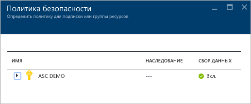
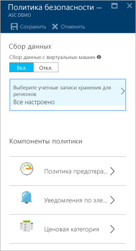
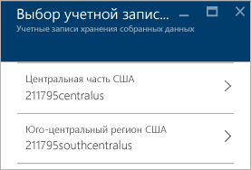
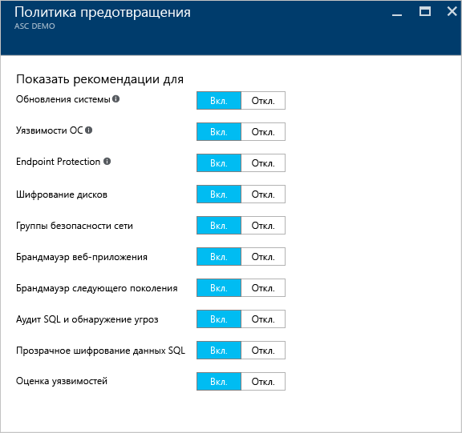
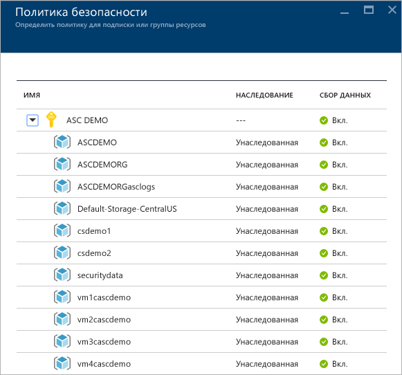
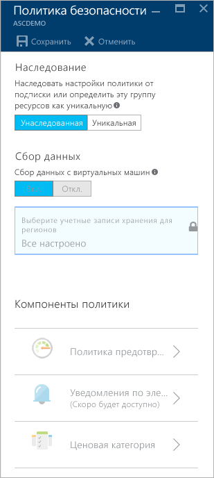

<properties
   pageTitle="Настройка политик безопасности в центре безопасности Azure | Microsoft Azure"
   description="В этом документе вы ознакомились с процедурой настройки политик безопасности в Центре безопасности Azure."
   services="security-center"
   documentationCenter="na"
   authors="YuriDio"
   manager="swadhwa"
   editor=""/>

<tags
   ms.service="security-center"
   ms.devlang="na"
   ms.topic="hero-article"
   ms.tgt_pltfrm="na"
   ms.workload="na"
   ms.date="09/22/2016"
   ms.author="yurid"/>

# Настройка политик безопасности в центре безопасности Azure
В этом пошаговом руководстве описывается, как настроить политики безопасности в центре безопасности.

## Что такое политики безопасности?
Политика безопасности определяет набор элементов управления, которые рекомендуются для ресурсов в указанной подписке или группе ресурсов. В центре безопасности можно настраивать политики для подписок или групп ресурсов Azure в соответствии с потребностями безопасности вашей компании, типом приложений и конфиденциальностью данных в каждой подписке.

Например, требования к безопасности ресурсов, используемых при разработке и тестировании, могут отличаться от требований, выдвигаемых к рабочим приложениям. Аналогично приложения с контролируемыми данными, такими как персональные данные, могут требовать более высокого уровня безопасности. Политики безопасности, включенные в центре безопасности Azure, обеспечивают рекомендации по безопасности и мониторинг, позволяя выявлять потенциальные уязвимости и бороться с угрозами. Дополнительные сведения об определении наиболее подходящего для вас варианта см. в статье [Руководство по планированию использования центра безопасности Azure и работе в нем](security-center-planning-and-operations-guide.md).

## Настройка политик безопасности для подписок

Политики безопасности можно настроить для каждой подписки или группы ресурсов. Изменить политику безопасности может пользователь с правами владельца или участника этой подписки. Чтобы настроить политики безопасности в центре безопасности, войдите на портал Azure и сделайте следующее:

1. Щелкните плитку **Политика** на панели мониторинга в центре безопасности.

2. В открывшейся колонке **Политика безопасности — Определить политику для подписки или группы ресурсов** выберите подписку, для которой требуется включить политику безопасности. Если политику безопасности требуется включить для группы ресурсов, а не для всей подписки, перейдите к следующему разделу, в котором рассказывается о настройке политик безопасности для групп ресурсов.

    

3. Для выбранной подписки откроется колонка **Политика безопасности** с набором параметров, как показано на следующем снимке экрана.

    

	В этой колонке доступны следующие параметры:
	- **Политика предотвращения** — этот параметр позволяет настроить политики для каждой подписки или группы ресурсов.
	- **Уведомление по электронной почте** — используйте этот параметр, чтобы настроить отправку уведомлений для первых за день оповещений и для оповещений с высоким уровнем серьезности. Параметры электронной почты можно настроить только для политик подписки. Дополнительные сведения о настройке получения уведомлений по электронной почте см. в статье [Предоставление сведений о контактных лицах по вопросам безопасности в центре безопасности Azure](security-center-provide-security-contact-details.md).
	- **Ценовая категория** — используйте этот параметр для обновления ценовой категории. Дополнительные сведения о вариантах оплаты см. на странице [центра безопасности](https://azure.microsoft.com/pricing/details/security-center/).

4.  Убедитесь, что для параметра **Сбор данных с виртуальных машин** задано значение **Вкл.**. Этот параметр включает автоматический сбор данных журнала для существующих и новых ресурсов.

    >[AZURE.NOTE] Мы советуем вам настроить сбор данных для каждой подписки, чтобы включить мониторинг безопасности для всех имеющихся и новых виртуальных машин. Включение сбора данных приводит к установке агента мониторинга. Если вы не хотите включать сбор данных прямо сейчас из этого расположения, это можно сделать позже из представлений **работоспособности** и **рекомендаций**. Сбор данных также можно включить только для подписки или только для выбранных виртуальных машин. Дополнительные сведения о поддерживаемых виртуальных машинах см. в разделе [Часто задаваемые вопросы о Центре безопасности Azure](security-center-faq.md).

5. Если учетная запись хранения еще не настроена, при открытии **политики безопасности** появится примерно такое сообщение, как показано на следующем снимке экрана.

    

6. Если вы увидите такое предупреждение, щелкните его и выберите регион, как показано на следующем снимке экрана.

    

7. Для каждого региона, в котором расположены ваши виртуальные машины, выберите учетную запись хранения, где хранятся данные, собираемые с этих виртуальных машин. Это позволяет хранить данные в одной географической области, чтобы обеспечить их конфиденциальность и независимость. Выберите нужный регион, а затем учетную запись хранения.

8. В колонке **Выберите учетные записи хранения** нажмите кнопку **ОК**.

    > [AZURE.NOTE] При желании можно объединить данные из виртуальных машин в разных регионах в рамках одной центральной учетной записи хранения. Дополнительные сведения см. в статье [Центр безопасности Azure: часто задаваемые вопросы](security-center-faq.md).

9. В колонке **Политика безопасности** щелкните **Вкл.**, чтобы включить для этой подписки необходимые рекомендации по безопасности. Щелкните **Политика предотвращения**, чтобы открыть окно с параметрами, как показано на следующем снимке экрана.

	

В следующей таблице содержатся справочные сведения о различных параметрах.

| Политика | Если включена |
|----- |-----|
| Обновление системы | Ежедневно получает список доступных критических обновлений и обновлений для системы безопасности из Центра обновления Windows или служб Windows Server Update Services. Полученный список зависит от настроенной для соответствующей виртуальной машины службы и рекомендаций по установлению отсутствующих обновлений. Эта политика определяет доступные для систем Linux пакеты обновлений с помощью предоставленной дистрибутивами системы управления пакетами. Кроме того, она проверяет наличие критических обновлений и обновлений системы безопасности на виртуальных машинах [облачных служб Azure](./cloud-services/cloud-services-how-to-configure.md). |
| Уязвимости ОС | Ежедневно анализирует конфигурации операционной системы, чтобы определить проблемы, делающие виртуальную машину более уязвимой к атакам. Политика также рекомендует изменения конфигурации для устранения таких уязвимостей. Дополнительные сведения о конкретных отслеживаемых конфигурациях см. в [списке рекомендуемых базовых шаблонов](https://gallery.technet.microsoft.com/Azure-Security-Center-a789e335). |
| Защита конечных точек | Рекомендует подготовить решения для защиты конечных точек для всех виртуальных машин Windows, чтобы обнаруживать и удалять вирусы, программы-шпионы и другие вредоносные программы.|
| Шифрование дисков | Рекомендует включить на всех виртуальных машинах шифрование дисков, чтобы усилить защиту хранящихся данных.
| Группы безопасности сети | Рекомендует настроить [группы безопасности сети](../virtual-network/virtual-networks-nsg.md) для контроля входящего и исходящего трафика виртуальных машин с общедоступными конечными точками. Группы безопасности сети, настроенные для подсети, будут наследоваться всеми сетевыми интерфейсами виртуальных машин, если не указано иначе. В дополнение к проверке настройки группы безопасности сети эта политика получает доступ к входящим правилам безопасности, чтобы выявить правила, разрешающие входящий трафик. |
| Брандмауэр веб-приложения | Рекомендует подготовить брандмауэр веб-приложения на виртуальных машинах, если выполнено одно из следующих требований.  Используется [общедоступный IP-адрес уровня экземпляра](../virtual-network/virtual-networks-instance-level-public-ip.md) (ILPIP), а в правилах безопасности для входящего трафика для связанной группы безопасности сети разрешен доступ к порту 80 или 443.  Используется IP-адрес с балансировкой нагрузки, а в связанных правилах балансировки нагрузки и преобразования сетевых адресов (NAT) для входящего трафика разрешен доступ к порту 80 или 443. Дополнительные сведения см. в статье [Поддержка Azure Resource Manager для подсистемы балансировки нагрузки](../load-balancer/load-balancer-arm.md). |
| Брандмауэр следующего поколения | Расширяет защиту сети за пределы групп безопасности сети, встроенных в Azure. Центр обеспечения безопасности обнаруживает развертывания, для которых рекомендуется использовать брандмауэр следующего поколения, и позволяет подготовить виртуальное устройство. |
| Аудит SQL и обнаружение угроз | Рекомендует включить аудит доступа к базам данных Azure для соответствия бизнес-требованиям и расширенное обнаружение угроз в целях контроля. |
| Прозрачное шифрование данных SQL | Рекомендует включить шифрование в неактивном состоянии для баз данных SQL Azure, связанных резервных копий и файлов журналов транзакций. Это позволит защитить данные от считывания, даже если безопасность будет нарушена. |
| Оценка уязвимостей | Рекомендует установить решение оценки уязвимости на виртуальную машину. |

Завершив настройку всех параметров, нажмите кнопку **ОК** в колонке **Политика безопасности**, где содержатся рекомендации, и **Сохранить** в колонке **Политика безопасности** с начальными настройками.

## Настройка политик безопасности для групп ресурсов

Действия для настройки политик безопасности для каждой группы ресурсов и политик безопасности для подписок аналогичны. Основное различие заключается в необходимости развернуть имя подписки и выбрать группу ресурсов, для которой необходимо настроить политику безопасности.

После выбора группы ресурсов откроется колонка **Политика безопасности**. По умолчанию параметр **Наследование** включен. Это означает, что все политики безопасности для этой группы ресурсов наследуются от уровня подписки. Если нужно создать пользовательскую политику безопасности для группы ресурсов, эту конфигурацию можно изменить. Для этого необходимо выбрать параметр **Уникальная** и внести необходимые изменения в параметр **Политика предотвращения**.

> [AZURE.NOTE] В случае конфликта между политикой уровня подписки и политикой уровня группы ресурсов приоритет получает политика уровня группы ресурсов.

## Дополнительные материалы

В этом документе вы ознакомились с подробными сведениями о настройке политик безопасности в Центре безопасности Azure. Дополнительные сведения о Центре безопасности Azure см. в следующих статьях:

- [Руководство по планированию использования центра безопасности Azure и работе в нем](security-center-planning-and-operations-guide.md). Узнайте, как спланировать работу в центре безопасности Azure, и получите рекомендации по переходу к его использованию.
- [Наблюдение за работоспособностью системы безопасности в Центре безопасности Azure](security-center-monitoring.md). Узнайте, как отслеживать работоспособность ресурсов Azure.
- [Управление оповещениями безопасности в Центре безопасности Azure и реагирование на них](security-center-managing-and-responding-alerts.md). Узнайте, как управлять оповещениями системы безопасности и реагировать на них.
- [Мониторинг решений партнеров с помощью центра безопасности Azure](security-center-partner-solutions.md). Узнайте, как отслеживать работоспособность партнерских решений.
- [Центр безопасности Azure: часто задаваемые вопросы](security-center-faq.md). Часто задаваемые вопросы об использовании этой службы.
- [Блог по безопасности Azure](http://blogs.msdn.com/b/azuresecurity/). Записи блога, посвященные безопасности и соответствию требованиям в Azure.

<!---HONumber=AcomDC_0928_2016-->