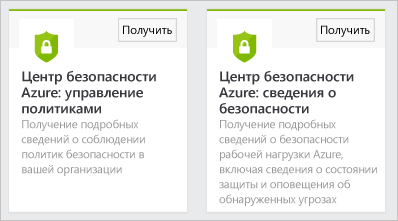

<properties
   pageTitle="Анализ данных центра безопасности Azure с помощью Power BI | Microsoft Azure"
   description="Пакет содержимого центра безопасности Azure для Power BI позволяет легко обнаруживать предупреждения и рекомендации системы безопасности, а также информацию об атакуемых ресурсах и тенденциях на основе набора данных, созданного для ваших отчетов."
   services="security-center"
   documentationCenter="na"
   authors="YuriDio"
   manager="swadhwa"
   editor=""/>

<tags
   ms.service="security-center"
   ms.devlang="na"
   ms.topic="hero-article"
   ms.tgt_pltfrm="na"
   ms.workload="na"
   ms.date="06/03/2016"
   ms.author="yurid"/>

# Анализ данных центра безопасности Azure с помощью Power BI
[Панель мониторинга Power BI](http://aka.ms/azure-security-center-power-bi) в центре безопасности Azure позволяет визуализировать, анализировать и фильтровать рекомендации и предупреждения безопасности из любого источника, включая ваше мобильное устройство. С помощью панели мониторинга Power BI можно выявлять тенденции и схемы атак, просматривая предупреждения безопасности по ресурсам или IP-адресам источников, а неустраненные угрозы безопасности — по ресурсам или времени возникновения. Вы можете также составлять эффективные комбинации, объединяя рекомендации и предупреждения центра безопасности с другими данными, включая данные [журналов аудита Azure](https://powerbi.microsoft.com/blog/monitor-azure-audit-logs-with-power-bi/) и [аудита базы данных SQL Azure](https://powerbi.microsoft.com/blog/monitor-your-azure-sql-database-auditing-activity-with-power-bi/) (эти сведения доступны на панелях мониторинга Power BI). Также эти данные можно экспортировать в Excel для быстрого создания отчетов о состоянии безопасности облачных ресурсов.

> [AZURE.NOTE] Сведения в этом документе относятся к предварительной версии Центра безопасности Azure.

##Доступ к Power BI с помощью панели мониторинга центра безопасности Azure
Для доступа к отчетам Power BI также можно использовать панель мониторинга центра безопасности Azure. Для этого выполните следующие действия.

1. На панели мониторинга **центра безопасности Azure** нажмите кнопку **Explore in Power BI** (Просмотреть в Power BI).

	

2. Справа откроется колонка **Explore in Power BI** (Просмотр в Power BI), как показано ниже.

	

3. При создании информационной панели Power BI впервые в колонке Explore in Power BI (Просмотр в Power BI) можно выбрать один из следующих вариантов.

	- **Информационная панель со сведениями о безопасности**. Это информационная панель, предоставляющая сведения о состоянии безопасности, потоках и событиях обнаружения. Этот вариант рекомендуется использовать при разработке и операциях, так как при этом требуется анализировать состояние безопасности и обнаруженные оповещения в рамках подписок.
	- **Информационная панель управления политикой**. Эта информационная панель используется для просмотра политик управления и принудительного применения. Этот вариант рекомендуется использовать для центральных ИТ-отделов, которые более сосредоточены на задачах управления. С помощью информационной панели управления политикой можно отслеживать соблюдение политики безопасности в рамках организации.
	- Если у вас уже есть информационная панель Power BI, выберите **Go to your current Power BI dashboard** (Перейти к текущей информационной панели Power BI).

4. Для примера выберите **информационную панель со сведениями о безопасности**, после чего откроется следующее окно.

	

5. Убедитесь, что для параметра **Метод проверки подлинности** выбрано значение **oAuth2** и нажмите кнопку **Войти**.
6. Откроется окно **Power BI** со структурой отчета, как показано ниже.
	
	

> [AZURE.NOTE] Запланировано ежедневное обновление отчетов. Если обновление завершилось сбоем, см. дополнительные сведения о способах устранения неполадок в статье [Potential Refresh Issues with the Azure Security Center Power BI](https://blogs.msdn.microsoft.com/azuresecurity/2016/04/07/azure-security-center-power-bi-refresh-fails/) (Возможные проблемы с обновлением Azure Security Center Power BI).

Здесь сразу можно увидеть количество предупреждений и рекомендаций системы безопасности, а также количество виртуальных машин, баз данных SQL Azure и сетевых ресурсов, которые отслеживаются в центре безопасности Azure.

Ссылка на центр безопасности Azure перенаправит вас на портал Azure. Диаграммы — это удобное средство для визуализации таких сведений о рекомендациях и предупреждениях системы безопасности:

- сведения о работоспособности системы безопасности ресурсов;
- ожидающие рекомендации (все);
- Рекомендации по виртуальным машинам
- предупреждения по времени;
- атакуемые ресурсы;
- атакуемые IP-адреса.

В диаграммах предусмотрены дополнительные возможности для анализа данных. Щелкните плитку, чтобы просмотреть более подробные сведения. Например, на плитке состояния работоспособности системы безопасности ресурсов отображаются дополнительные сведения об ожидающих рекомендациях по ресурсам, как показано ниже.

Если щелкнуть любую строку этого графика, остальные станут неактивными, что позволит вам сосредоточиться на интересующих вас данных. Чтобы вернуться на панель мониторинга, щелкните **Центр безопасности Azure** под элементом **Панели мониторинга** в левой части этой страницы.

> [AZURE.NOTE] Если вы хотите настроить отчет, добавив дополнительные поля или изменив существующие визуальные элементы, можно отредактировать имеющийся отчет. Дополнительные сведения см. в статье [Взаимодействие с отчетом в режиме редактирования в Power BI](https://powerbi.microsoft.com/documentation/powerbi-service-interact-with-a-report-in-editing-view/).

Если щелкнуть плитки **Alerts over Time** (Предупреждения по времени), Attacked Resources (Атакуемые ресурсы) и **Attacker IPs** (IP-адреса злоумышленников), отобразятся похожие данные. Это происходит, потому что в отчете **Resources under Attack** (Ресурсы, подвергающиеся атаке) собраны сведения об этих трех переменных, как показано ниже.

На этом этапе вы можете сохранить копию отчета, а также распечатать его или опубликовать в Интернете, используя параметры в меню **Файл**.

## Оценка данных центра безопасности Azure с помощью служб Power BI

Подключитесь к [пакету содержимого Power BI](https://msit.powerbi.com/groups/me/getdata/services) в Power BI и сделайте следующее:

1. В окне **Content Pack for Power BI** (Пакет содержимого для Power BI) будут отображаться два параметра, как показано ниже.

	

2. Для примера в элементе **Azure Security Center Policy Management** (Управление политикой центра безопасности Azure) нажмите кнопку **Получить**.

3. В окне **Connect to Azure Security Center Policy Management** (Подключиться к управлению политикой центра безопасности Azure) в раскрывающемся списке **Метод проверки подлинности** выберите **oAuth2**, как показано ниже, и нажмите кнопку **Войти**.

	

4. Вы перейдете на страницу проверки подлинности, где потребуется ввести учетные данные, используемые для подключения к центру безопасности Azure. Когда проверка подлинности будет завершена, Power BI начнет импорт данных для создания отчетов. В это время в правом углу окна браузера может появиться следующее сообщение:

	

	>[AZURE.NOTE] Первое создание информационной панели занимает больше времени, чем обычно, особенно в сценариях с несколькими подписками.

5. Когда процесс будет завершен, загрузится информационная панель Power BI центра безопасности Azure с отчетом **управления политиками**.

## Дальнейшие действия
В этом документе описывается, как использовать Power BI для анализа данных центра безопасности Azure. Дополнительные сведения о Центре безопасности Azure см. в следующих статьях:

- [Руководство по планированию использования центра безопасности Azure и работе в нем](security-center-planning-and-operations-guide.md) — узнайте, как спланировать переход на использование центра безопасности Azure.
- [Настройка политик безопасности в Центре безопасности Azure](security-center-policies.md) — узнайте, как настроить параметры безопасности в Центре безопасности Azure.
- [Управление оповещениями безопасности в Центре безопасности Azure и реагирование на них](security-center-managing-and-responding-alerts.md) — узнайте, как управлять оповещениями системы безопасности и реагировать на них.
- [Часто задаваемые вопросы о Центре безопасности Azure](security-center-faq.md) — часто задаваемые вопросы об использовании этой службы.
- [Блог по безопасности Azure](http://blogs.msdn.com/b/azuresecurity/) — публикации блога, посвященные безопасности Azure и соответствию требованиям.

<!---HONumber=AcomDC_0608_2016-->