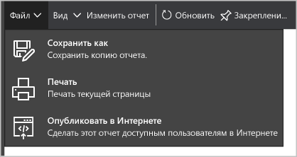

<properties
   pageTitle="Анализ данных центра безопасности Azure с помощью Power BI | Microsoft Azure"
   description="Пакет содержимого центра безопасности Azure для Power BI позволяет легко обнаруживать предупреждения и рекомендации системы безопасности, а также информацию об атакуемых ресурсах и тенденциях на основе набора данных, созданного для ваших отчетов."
   services="security-center"
   documentationCenter="na"
   authors="YuriDio"
   manager="swadhwa"
   editor=""/>

<tags
   ms.service="security-center"
   ms.devlang="na"
   ms.topic="hero-article"
   ms.tgt_pltfrm="na"
   ms.workload="na"
   ms.date="02/25/2016"
   ms.author="yurid"/>

# Анализ данных центра безопасности Azure с помощью Power BI
[Панель мониторинга Power BI](http://aka.ms/azure-security-center-power-bi) в центре безопасности Azure позволяет визуализировать, анализировать и фильтровать рекомендации и предупреждения безопасности из любого источника, включая ваше мобильное устройство. С помощью панели мониторинга Power BI можно выявлять тенденции и схемы атак, просматривая предупреждения безопасности по ресурсам или IP-адресам источников, а неустраненные угрозы безопасности — по ресурсам или времени возникновения. Вы можете также составлять эффективные комбинации, объединяя рекомендации и предупреждения центра безопасности с другими данными, включая данные [журналов аудита Azure](https://powerbi.microsoft.com/blog/monitor-azure-audit-logs-with-power-bi/) и [аудита базы данных SQL Azure](https://powerbi.microsoft.com/blog/monitor-your-azure-sql-database-auditing-activity-with-power-bi/) (эти сведения доступны на панелях мониторинга Power BI). Также эти данные можно экспортировать в Excel для быстрого создания отчетов о состоянии безопасности облачных ресурсов.

> [AZURE.NOTE] Сведения в этом документе относятся к предварительной версии Центра безопасности Azure.

## Оценка данных центра безопасности Azure с помощью служб Power BI
Подключитесь к [пакету содержимого центра безопасности Azure](https://app.powerbi.com/groups/me/getdata/services/azure-security-center) в Power BI и выполните следующие действия.

1\. Щелкните **Подключиться** на плитке центра безопасности Azure, чтобы продолжить.

2\. Откроется окно **Подключение к центру безопасности Azure**. В поле **Идентификатор подписки Azure** укажите подписку Azure и нажмите кнопку **Далее**.

3\. В раскрывающемся списке **Метод проверки подлинности** выберите **oAuth2** и щелкните **Вход**.

4\. Вы перейдете на страницу проверки подлинности, где потребуется ввести учетные данные, используемые для подключения к центру безопасности Azure. Когда проверка подлинности будет завершена, Power BI начнет импорт данных для создания отчетов. В это время в правом углу окна браузера может появиться следующее сообщение:

5\. Когда процесс будет завершен, загрузится панель мониторинга Power BI центра безопасности Azure с отчетами, как показано ниже.

Здесь сразу можно увидеть количество предупреждений и рекомендаций системы безопасности, а также количество виртуальных машин, баз данных Azure SQL и сетевых ресурсов, которые отслеживаются в центре безопасности Azure.

Ссылка на центр безопасности Azure перенаправит вас на портал Azure. Диаграммы — это удобное средство для визуализации таких сведений о рекомендациях и предупреждениях системы безопасности:

- сведения о работоспособности системы безопасности ресурсов;
- ожидающие рекомендации (все);
- Рекомендации по виртуальным машинам
- предупреждения по времени;
- атакуемые ресурсы;
- атакуемые IP-адреса.

В диаграммах предусмотрены дополнительные возможности для анализа данных. Выберите плитку, чтобы просмотреть более подробную информацию. Например, на плитке состояния работоспособности системы безопасности ресурсов отображаются дополнительные сведения об ожидающих рекомендациях по ресурсам, как показано ниже.

Если щелкнуть любую строку этого графика, остальные станут неактивными, что позволит вам сосредоточиться на интересующих вас данных. Чтобы вернуться на панель мониторинга, щелкните **Центр безопасности Azure** под элементом **Панели мониторинга** в левой части этой страницы.

> [AZURE.NOTE] Если вы хотите настроить отчет, добавив дополнительные поля или изменив существующие визуальные элементы, можно отредактировать существующий отчет. Дополнительные сведения см. в статье [Взаимодействие с отчетом в режиме редактирования в Power BI](https://powerbi.microsoft.com/documentation/powerbi-service-interact-with-a-report-in-editing-view/).

Щелкнув плитки **Предупреждения по времени**, **Атакуемые ресурсы** и **Атакуемые IP-адреса**, вы отобразите похожие данные. Это происходит, потому что в отчете **Ресурсы, подвергающиеся атаке** собраны сведения об этих трех переменных, как показано ниже:

На этом этапе вы можете сохранить копию отчета, а также распечатать его или опубликовать в Интернете, используя параметры в меню **Файл**.

##Доступ к Power BI с помощью панели мониторинга центра безопасности Azure
Для доступа к отчетам Power BI также можно использовать панель мониторинга центра безопасности Azure. Для этого выполните следующие действия.

1\. На панели мониторинга **центра безопасности Azure** нажмите кнопку **Просмотреть в Power BI**.

2\. Справа откроется колонка **Просмотр в Power BI**, как показано ниже.

3\. В раскрывающемся списке **Выберите подписку для просмотра в Power BI** выберите подписку, которую вы хотите использовать.

4\. В поле **Скопируйте идентификатор подписки** нажмите кнопку "Копировать". 5. Нажмите кнопку **Перейти к Power BI**. 6. Откроется окно **Подключение к центру безопасности Azure**. В поле **Идентификатор подписки Azure** укажите подписку Azure и нажмите кнопку **Далее**.

7\. В раскрывающемся списке **Метод проверки подлинности** выберите **oAuth2** и щелкните **Вход**.

8\. Вы перейдете на страницу проверки подлинности, где потребуется ввести учетные данные, используемые для подключения к центру безопасности Azure. Когда проверка подлинности будет завершена, Power BI начнет импорт данных для создания отчетов.

## Дальнейшие действия
В этом документе описывается, как использовать Power BI для анализа данных центра безопасности Azure. Дополнительные сведения о Центре безопасности Azure см. в следующих статьях:

- [Настройка политик безопасности в Центре безопасности Azure](security-center-policies.md) — узнайте, как настроить параметры безопасности в Центре безопасности Azure.
- [Управление оповещениями безопасности в Центре безопасности Azure и реагирование на них](security-center-managing-and-responding-alerts.md) — узнайте, как управлять оповещениями системы безопасности и реагировать на них.
- [Часто задаваемые вопросы о Центре безопасности Azure](security-center-faq.md) — часто задаваемые вопросы об использовании этой службы.
- [Блог по безопасности Azure](http://blogs.msdn.com/b/azuresecurity/) — публикации блога, посвященные безопасности Azure и соответствию требованиям.

<!---HONumber=AcomDC_0302_2016-->