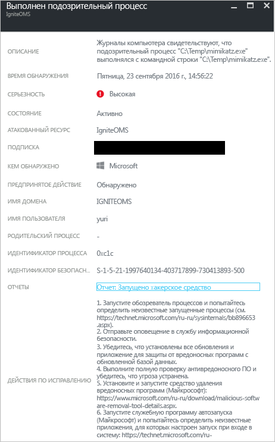

# Отчет об анализе угроз, предоставляемый центром безопасности Azure
Здесь содержатся сведения о том, как отчет центра безопасности Azure об анализе угроз позволяет получить подробные сведения касательно угрозы, из-за которой было создано оповещение системы безопасности.

## Отчет об анализе угроз
Функция обнаружения угроз в центре безопасности осуществляет мониторинг сведений о безопасности из ваших ресурсов Azure, сети и подключенных партнерских решений. Она анализирует эту информацию, часто сравнивая сведения из разных источников и определяя угрозы. Это часть [возможностей обнаружения](security-center-detection-capabilities.md) центра безопасности.

Когда центр безопасности выявляет угрозу, он активирует [оповещение системы безопасности](security-center-managing-and-responding-alerts.md), которое содержит подробные сведения о конкретном событии, включая рекомендации по исправлению. Чтобы упростить исследование и устранение угроз для групп реагирования на инциденты, в центре безопасности формируется отчет об анализе угроз, содержащий следующие сведения об обнаруженной угрозе:

* удостоверение злоумышленника или имеющиеся связи (если такая информация доступна);
* цели злоумышленника;
* текущие и исторические кампании атак (если такая информация доступна);
* тактики злоумышленника, применяемые инструменты и процедуры;
* связанные признаки компрометации, такие как URL-адреса и хэши файлов;
* сведения о ресурсах или пользователях, подвергшихся атаке, включая данные об отрасли и регионе, которые помогают определить, если ли риск для ваших ресурсов Azure;
* сведения по устранению и исправлению.

> [!NOTE]
> Объем сведений в любом конкретном отчете будет отличаться. Уровень детализации зависит от активности вредоносных программ и их распространенности.
>
>

Центр безопасности предусматривает три типа отчетов об угрозах, которые могут различаться в зависимости от атаки, а именно:

* **отчет о группе действий**, в котором предоставлен подробный анализ злоумышленников, их целей и примененных тактик;
* **отчет о кампании**, сосредоточенный на определенных кампаниях атак;
* **сводный отчет об угрозах**, который включает в себя все элементы двух предыдущих отчетов.

Эти сведения очень полезны в процессе [реагирования на инцидент](security-center-incident-response.md), когда ведется исследование, чтобы понять источник атаки, мотивацию злоумышленника и то, как избежать этой проблемы в дальнейшем.

## Получение доступа к отчету об анализе угроз
Текущие оповещения отображаются на плитке **Оповещения системы безопасности** . Чтобы просмотреть дополнительные сведения о каждом оповещении, откройте портал Azure и сделайте следующее:

1. На панели мониторинга в центре безопасности вы увидите плитку **Оповещения системы безопасности** .
2. Щелкните плитку, чтобы открыть колонку **Оповещения системы безопасности**, содержащую подробные сведения об оповещениях, и выберите оповещение, для которого нужно просмотреть сведения.

    
3. В этом случае мы выберем колонку **Suspicious process executed** (Выполнение подозрительных процессов), содержащую сведения об оповещении. как показано на рисунке ниже.

    
4. Объем сведений, доступных для каждого оповещения системы безопасности, отличается в зависимости от типа оповещения. В поле **Отчеты** будет содержаться ссылка на отчет об анализе угроз. Щелкните ее, после чего откроется новое окно браузера с PDF-файлом.

   

Здесь этот файл можно скачать, чтобы узнать больше об обнаруженной проблеме безопасности и предпринять действия на основе этих сведений.

## См. также
Из этой статьи вы узнали, как отчеты центра безопасности Azure об анализе угроз могут помочь при исследовании оповещений системы безопасности. Дополнительные сведения о Центре безопасности Azure см. в следующих статьях:

* [Центр безопасности Azure: часто задаваемые вопросы](security-center-faq.md). Часто задаваемые вопросы об использовании этой службы.
* [Использование центра безопасности Azure для реагирования на инциденты](security-center-incident-response.md)
* [Возможности обнаружения центра безопасности Azure](security-center-detection-capabilities.md)
* [Руководство по планированию использования центра безопасности Azure и работе в нем](security-center-planning-and-operations-guide.md). Узнайте, как спланировать работу в центре безопасности Azure, и получите рекомендации по переходу к его использованию.
* [Управление оповещениями безопасности в Центре безопасности Azure и реагирование на них](security-center-managing-and-responding-alerts.md). Узнайте, как управлять оповещениями системы безопасности и реагировать на них.
* [Обработка инцидентов в центре безопасности Azure](security-center-incident.md)
* [Блог по безопасности Azure](http://blogs.msdn.com/b/azuresecurity/). Записи блога, посвященные безопасности и соответствию требованиям в Azure.
