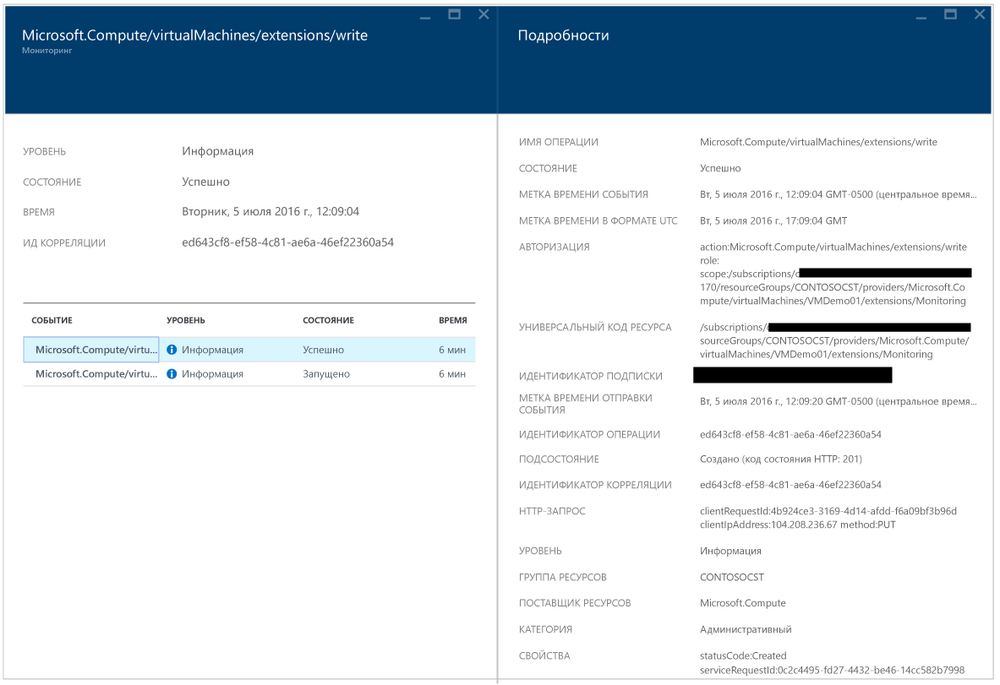

<properties
   pageTitle="Руководство по устранению неполадок в центре безопасности Azure | Microsoft Azure"
   description="В этом документе описаны способы устранения неполадок в центре безопасности Azure."
   services="security-center"
   documentationCenter="na"
   authors="YuriDio"
   manager="swadhwa"
   editor=""/>

<tags
   ms.service="security-center"
   ms.devlang="na"
   ms.topic="hero-article"
   ms.tgt_pltfrm="na"
   ms.workload="na"
   ms.date="07/21/2016"
   ms.author="yurid"/>

# Руководство по устранению неполадок в центре безопасности Azure
Это руководство предназначено для ИТ-специалистов, аналитиков в сфере информационной безопасности и администраторов облака, организации которых используют центр безопасности Azure и которым нужно устранять связанные с ним неполадки.

## Руководство по устранению неполадок
В этом руководстве описывается устранение неполадок, связанных с центром безопасности Azure. Большая часть работы по устранению неполадок в центре безопасности Azure выполняется при первом просмотре записей [журнала аудита](https://azure.microsoft.com/updates/audit-logs-in-azure-preview-portal/) для неисправных компонентов. С помощью журналов аудита можно определить:

- какие операции были выполнены;
- кто инициировал операцию;
- когда операция была выполнена;
- состояние операции;
- значения других свойств, которые могут помочь в анализе операции.

Журнал аудита содержит все операции записи (PUT, POST, DELETE), выполняемые с ресурсами, но не содержит операции чтения (GET).

## Устранение неполадок с установкой агента мониторинга в Windows

Агент мониторинга центра безопасности используется для сбора данных. После включения сбора данных и правильной установки агента на целевом компьютере будут запущены следующие процессы:

- ASMAgentLauncher.exe — агент мониторинга Azure;
- ASMMonitoringAgent.exe — расширение мониторинга безопасности Azure;
- ASMSoftwareScanner.exe — диспетчер сканирования Azure.

Расширение "Мониторинг безопасности Azure" сканирует систему на наличие конфигураций, связанных с безопасностью, и собирает журналы данных безопасности на виртуальных машинах. Диспетчер сканирования будет использоваться как сканер исправлений.

Если установка выполнена успешно, в журналах аудита для целевой виртуальной машины вы увидите запись, похожую на следующую:

Вы также можете получить дополнительные сведения о процессе установки, ознакомившись с журналами агента в расположении *%systemdrive%\\windowsazure\\logs* (например, C:\\WindowsAzure\\Logs).

> [AZURE.NOTE] Если агент центра безопасности Azure работает неправильно, перезапустите целевую виртуальную машину, так как специальной команды для остановки и запуска агента нет.

## Устранение неполадок с установкой агента мониторинга в Linux
При устранении неполадок, связанных с установкой агента виртуальной машины в Linux, проследите, чтобы модуль был загружен в папку /var/lib/waagent/. Это можно сделать с помощью следующей команды:

`cat /var/log/waagent.log`

Ниже перечислены другие файлы журналов, которые можно просматривать при устранении неполадок:

- /var/log/mdsd.err
- /var/log/azure/

В рабочей системе вы увидите подключение к процессу mdsd по TCP-порту 29130. Этот системный журнал взаимодействует с процессом mdsd. Это поведение можно проверить, выполнив следующую команду:

`netstat -plantu | grep 29130`

## Обращение в службу технической поддержки Майкрософт

Некоторые проблемы можно определить с помощью этого руководства. Другие доступны в материалах общедоступного [форума](https://social.msdn.microsoft.com/Forums/ru-RU/home?forum=AzureSecurityCenter), посвященного центру безопасности. Если требуется дальнейшее устранение неполадок, вы можете обратиться в службу поддержки на портале Azure, как показано ниже:

## См. также

В этом документе вы ознакомились с подробными сведениями о настройке политик безопасности в Центре безопасности Azure. Дополнительные сведения о Центре безопасности Azure см. в следующих статьях:

- [Руководство по планированию использования центра безопасности Azure и работе в нем](security-center-planning-and-operations-guide.md) — узнайте, как спланировать работу с центром безопасности Azure, и получите рекомендации по переходу к его использованию.
- [Наблюдение за работоспособностью системы безопасности в Центре безопасности Azure](security-center-monitoring.md) — узнайте, как отслеживать работоспособность ресурсов Azure.
- [Управление оповещениями безопасности в Центре безопасности Azure и реагирование на них](security-center-managing-and-responding-alerts.md) — узнайте, как управлять оповещениями системы безопасности и реагировать на них.
- [Мониторинг решений партнеров с помощью центра безопасности Azure](security-center-partner-solutions.md) — узнайте, как отслеживать состояние работоспособности решений партнеров.
- [Центр безопасности Azure: часто задаваемые вопросы](security-center-faq.md) — часто задаваемые вопросы об использовании этой службы.
- [Блог по безопасности Azure](http://blogs.msdn.com/b/azuresecurity/) — публикации блога, посвященные безопасности и соответствию требованиям в Azure.

<!---HONumber=AcomDC_0803_2016-->