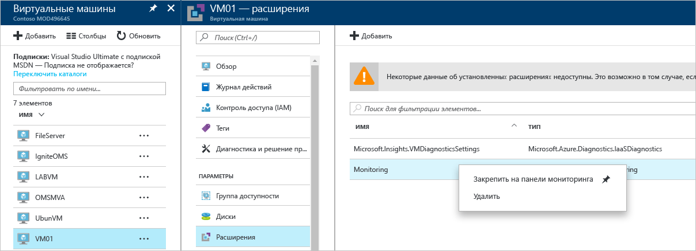

# Руководство по устранению неполадок в центре безопасности Azure
Это руководство предназначено для ИТ-специалистов, аналитиков в сфере информационной безопасности и администраторов облака, организации которых используют центр безопасности Azure и которым нужно устранять связанные с ним неполадки.

## Руководство по устранению неполадок
В этом руководстве описывается устранение неполадок, связанных с центром безопасности Azure. Большая часть работы по устранению неполадок в центре безопасности Azure выполняется при первом просмотре записей [журнала аудита](https://azure.microsoft.com/updates/audit-logs-in-azure-preview-portal/) для неисправных компонентов. С помощью журналов аудита можно определить:

* какие операции были выполнены;
* кто инициировал операцию;
* когда операция была выполнена;
* состояние операции;
* значения других свойств, которые могут помочь в анализе операции.

Журнал аудита содержит все операции записи (PUT, POST, DELETE), выполняемые с ресурсами, но не содержит операции чтения (GET).

## Устранение неполадок с установкой агента мониторинга в Windows
Агент мониторинга центра безопасности используется для сбора данных. После включения сбора данных и правильной установки агента на целевом компьютере будут запущены следующие процессы:

* ASMAgentLauncher.exe — агент мониторинга Azure; 
* ASMMonitoringAgent.exe — расширение мониторинга безопасности Azure;
* ASMSoftwareScanner.exe — диспетчер сканирования Azure.

Расширение "Мониторинг безопасности Azure" сканирует систему на наличие конфигураций, связанных с безопасностью, и собирает журналы данных безопасности на виртуальных машинах. Диспетчер сканирования будет использоваться как сканер исправлений.

Если установка выполнена успешно, в журналах аудита для целевой виртуальной машины вы увидите запись, похожую на следующую:

Вы также можете получить дополнительные сведения о процессе установки, ознакомившись с журналами агента в расположении *%systemdrive%\windowsazure\logs* (например, C:\WindowsAzure\Logs).

> [!NOTE]
> Если агент центра безопасности Azure работает неправильно, перезапустите целевую виртуальную машину, так как специальной команды для остановки и запуска агента нет.

Если по-прежнему возникают проблемы со сбором данных, вы можете удалить агент с помощью следующих действий.

1. На **портале Azure** выберите виртуальную машину с проблемами сбора данных и щелкните **Расширения**.
2. Щелкните правой кнопкой мыши **Microsoft.Azure.Security.Monitoring** и выберите пункт **Удалить**.

Расширение мониторинга безопасности Azure должно автоматически переустановиться в течение нескольких минут.

## Устранение неполадок с установкой агента мониторинга в Linux
При устранении неполадок, связанных с установкой агента виртуальной машины в Linux, проследите, чтобы модуль был загружен в папку /var/lib/waagent/. Это можно сделать с помощью следующей команды:

`cat /var/log/waagent.log` 

Ниже перечислены другие файлы журналов, которые можно просматривать при устранении неполадок: 

* /var/log/mdsd.err
* /var/log/azure/

В рабочей системе вы увидите подключение к процессу mdsd по TCP-порту 29130. Этот системный журнал взаимодействует с процессом mdsd. Это поведение можно проверить, выполнив следующую команду:

`netstat -plantu | grep 29130`

## Устранение неполадок, при которых Endpoint Protection не работает должным образом

Гостевой агент является родительским процессом для всех операций расширения [антивредоносной программы Майкрософт](../security/azure-security-antimalware.md). В случае сбоя процесса гостевого агента работа антивредоносной программы Майкрософт, которая выполняется как дочерний процесс гостевого агента, может завершиться сбоем.  В таких случаях рекомендуется проверить, не имеет ли место следующее.

- Целевая виртуальная машина основана на пользовательском образе, и создатель этой виртуальной машины не установил гостевой агент.
- Если целью является виртуальная машина Linux, а не виртуальная машина Windows, то установка расширения антивредоносной программы для Windows на виртуальной машине Linux завершится сбоем. Гостевой агент Linux имеет особые требования к версии ОС и необходимым пакетам, и если эти требования не выполнены, агент виртуальной машины не будет работать. 
- Виртуальная машина была создана с помощью устаревшей версии гостевого агента. Если это так, то следует помнить, что некоторые устаревшие агенты не могут автоматически обновлять себя до новой версии, и это может привести к описываемой проблеме. Всегда используйте последнюю версию гостевого агента при создании собственных образов.
- Некоторое стороннее программное обеспечение для администрирования может отключить гостевой агент или запретить ему доступ к определенным расположениям файлов. Если на виртуальной машине установлено стороннее программное обеспечение, убедитесь, что агент находится в его списке исключений.
- Некоторые параметры брандмауэра или группы безопасности сети (NSG) могут блокировать входящий и исходящий сетевой трафик гостевого агента.
- Некоторые списки управления доступом (ACL) могут запретить доступ к диску.
- Нехватка места на диске может препятствовать нормальной работе гостевого агента. 

По умолчанию пользовательский интерфейс антивредоносной программы Майкрософт отключен. Ознакомьтесь с разделом [Enabling Microsoft Antimalware User Interface on ARM VMs Post Deployment](https://blogs.msdn.microsoft.com/azuresecurity/2016/03/09/enabling-microsoft-antimalware-user-interface-post-deployment/) (Включение пользовательского интерфейса антивредоносной программы Майкрософт на виртуальных машинах Azure Resource Manager после развертывания), чтобы получить дополнительные сведения о том, как его включить при необходимости.

## Устранение неполадок с загрузкой панели мониторинга

Если при загрузке панели мониторинга центра безопасности возникают проблемы, убедитесь, что пользователь, который регистрирует подписку в центре безопасности (т. е. первый пользователь, открывший центр безопасности в рамках подписки), и пользователь, который хочет включить сбор данных, являются *владельцами* или *участниками* подписки. Начиная с этого момента, пользователи, имеющие доступ для *чтения* в подписке, могут просматривать панель мониторинга, оповещения, рекомендации и политику.

## Обращение в службу технической поддержки Майкрософт
Некоторые проблемы можно определить с помощью этого руководства. Другие доступны в материалах общедоступного [форума](https://social.msdn.microsoft.com/Forums/en-US/home?forum=AzureSecurityCenter), посвященного центру безопасности. Если требуется дальнейшее устранение неполадок, вы можете обратиться в службу поддержки на **портале Azure**, как показано ниже. 

## Дополнительные материалы
В этом документе вы ознакомились с подробными сведениями о настройке политик безопасности в Центре безопасности Azure. Дополнительные сведения о Центре безопасности Azure см. в следующих статьях:

* [Руководство по планированию использования центра безопасности Azure и работе в нем](security-center-planning-and-operations-guide.md) — узнайте, как спланировать работу с центром безопасности Azure, и получите рекомендации по переходу к его использованию.
* [Наблюдение за работоспособностью системы безопасности в Центре безопасности Azure](security-center-monitoring.md) — узнайте, как отслеживать работоспособность ресурсов Azure.
* [Управление оповещениями безопасности в Центре безопасности Azure и реагирование на них](security-center-managing-and-responding-alerts.md) — узнайте, как управлять оповещениями системы безопасности и реагировать на них.
* [Мониторинг решений партнеров с помощью центра безопасности Azure](security-center-partner-solutions.md) — узнайте, как отслеживать состояние работоспособности решений партнеров.
* [Центр безопасности Azure: часто задаваемые вопросы](security-center-faq.md) — часто задаваемые вопросы об использовании этой службы.
* [Блог по безопасности Azure](http://blogs.msdn.com/b/azuresecurity/) — публикации блога, посвященные безопасности и соответствию требованиям в Azure.

