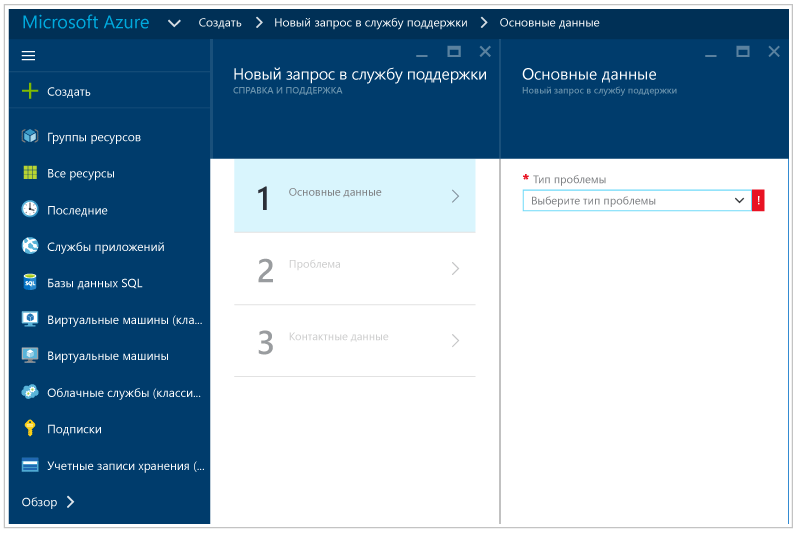

# Руководство по устранению неполадок в центре безопасности Azure
Это руководство предназначено для ИТ-специалистов, аналитиков в сфере информационной безопасности и администраторов облака, организации которых используют центр безопасности Azure и которым нужно устранять связанные с ним неполадки.

>[!NOTE]
>С начала июня 2017 г. в центре безопасности используется Microsoft Monitoring Agent для сбора и хранения данных. См. дополнительные сведения о [миграции платформы центра безопасности Azure](security-center-platform-migration.md). В этой статье описывается, как будет работать центр безопасности после перехода к использованию Microsoft Monitoring Agent.
>

## Руководство по устранению неполадок
В этом руководстве описывается устранение неполадок, связанных с центром безопасности Azure. Большая часть работы по устранению неполадок в центре безопасности выполняется при первом просмотре записей [журнала аудита](https://azure.microsoft.com/updates/audit-logs-in-azure-preview-portal/) для неисправных компонентов. С помощью журналов аудита можно определить:

* какие операции были выполнены;
* кто инициировал операцию;
* когда операция была выполнена;
* состояние операции;
* значения других свойств, которые могут помочь в анализе операции.

Журнал аудита содержит все операции записи (PUT, POST, DELETE), выполняемые с ресурсами, но не содержит операции чтения (GET).

## Microsoft Monitoring Agent
Microsoft Monitoring Agent используется в центре безопасности для сбора данных с виртуальных машин Azure. Этот агент также используется службой Log Analytics. После включения сбора данных и правильной установки агента на целевом компьютере будет запущен следующий процесс:

* HealthService.exe.

Если открыть консоль управления службами (services.msc), вы увидите, что служба Microsoft Monitoring Agent уже выполняется, как показано ниже:

Чтобы узнать версию агента, на вкладке **Процессы** откройте **диспетчер задач**, правой кнопкой мыши щелкните пункт **Служба агента наблюдения (Майкрософт)** и выберите **Свойства**. На вкладке **Сведения** будет указана версия файла, как показано ниже:

## Сценарии установки Microsoft Monitoring Agent
Существует два сценария установки Microsoft Monitoring Agent на компьютере, результаты которых могут быть разными. Поддерживаются такие сценарии:

* **Автоматическая установка агента с помощью центра безопасности**. Этот сценарий позволяет просматривать оповещения как в центре безопасности, так и с помощью поиска по журналам. Вы будете получать уведомления на адрес электронной почты, указанный при настройке политики безопасности для подписки, к которой относится ресурс.
.
* **Установка агента вручную на виртуальной машине в Azure**. Если агент скачан и установлен вручную до февраля 2017 г., вы сможете просматривать оповещения на портале центра безопасности, только если включите фильтр для подписки, к которой относится рабочая область. Если включить фильтр для подписки, к которой относится ресурс, оповещения не будут отображаться. Вы будете получать уведомления на адрес электронной почты, указанный при настройке политики безопасности для подписки, к которой относится рабочая область.

>[!NOTE]
> Чтобы избежать ситуации, приведенной во втором сценарии, скачайте последнюю версию агента.
>

## Окно проблем с работоспособностью агента мониторинга
**Состояние мониторинга** определяет причину, по которой центру безопасности не удалось выполнить мониторинг виртуальных машин и компьютеров, инициализированных для автоматической подготовки. В следующей таблице показаны значения, описания и действия для разрешения ошибок **Состояния мониторинга**.

| Состояние мониторинга | ОПИСАНИЕ | Способы устранения |
|---|---|---|
| Ожидающая установка агента | Установка Microsoft Monitoring Agent по-прежнему выполняется.  Установка может занять несколько часов. | Дождитесь завершения автоматической установки. |
| Питание отключено | Виртуальная машина остановилась.  Microsoft Monitoring Agent можно установить только на виртуальной машине, которая работает. | Перезапустите виртуальную машину. |
| Агент ВМ Azure отсутствует или недопустимый | Microsoft Monitoring Agent еще не установлен.  Чтобы центр безопасности мог установить расширение, требуется допустимый агент виртуальной машины Azure. | Установите, переустановите или обновите агент виртуальной машины Azure на виртуальной машине. |
| Виртуальная машина не готова к установке  | Microsoft Monitoring Agent еще не установлен, потому что виртуальная машина не готова для установки. Виртуальная машина не готова для установки из-за неполадок с агентом виртуальной машины или подготовкой виртуальной машины. | Проверьте состояние виртуальной машины. Вернитесь в раздел **Виртуальные машины** на портале и выберите виртуальную машину, чтобы просмотреть сведения о состоянии. |
|Сбой установки — общая ошибка | Microsoft Monitoring Agent установлен, но произошел сбой из-за ошибки. | [Установите вручную расширение](../log-analytics/log-analytics-quick-collect-azurevm.md#enable-the-log-analytics-vm-extension) или удалите расширение, чтобы центр безопасности попытался установить агент еще раз. |
| Сбой установки — локальный агент уже установлен | Сбой установки Microsoft Monitoring Agent. Центр безопасности обнаружил локальный агент (OMS или SCOM), уже установленный на виртуальной машине. Чтобы избежать конфигурации с множественной адресацией, в которой виртуальная машина отправляет отчеты в две отдельные рабочие области, установка агента Microsoft Monitoring Agent останавливается. | Есть два решения. [Вручную установите расширение](../log-analytics/log-analytics-quick-collect-azurevm.md#enable-the-log-analytics-vm-extension) и подключите его к нужной рабочей области. Или задайте нужную рабочую область в качестве рабочей области по умолчанию и включите автоматическую подготовку агента.  См., как [включить автоматическую подготовку](security-center-enable-data-collection.md). |
| Агенту не удается подключиться к рабочей области | Агент Microsoft Monitoring Agent установлен, но произошел сбой из-за подключения к сети.  Убедитесь, что есть подключение к Интернету или что для агента настроен допустимый прокси-сервер HTTP. | См. раздел о [требованиях к сети для агента мониторинга](#troubleshooting-monitoring-agent-network-requirements). |
| Агент подключен к отсутствующей или неизвестной рабочей области | Центр безопасности определил, что установленный на виртуальной машине агент Microsoft Monitoring Agent подключен к рабочей области, к которой он не имеет доступа. | Это может произойти в двух случаях. Рабочая область удалена и больше не существует. Переустановите агент с правильной рабочей областью или удалите агент и разрешите центру безопасности завершить автоматическую установку подготовки. Рабочая область является частью подписки, к которой у центра безопасности нет разрешений на доступ. Центр безопасности требует, чтобы у поставщика ресурсов безопасности Майкрософт был доступ к подпискам. Чтобы включить этот доступ, зарегистрируйте подписку в поставщике ресурсов безопасности Майкрософт. Это можно сделать с помощью API PowerShell, портала или просто отфильтровав подписку на панели мониторинга **Обзор** в центре безопасности. См. дополнительные сведения о [поставщиках и типах ресурсов](../azure-resource-manager/resource-manager-supported-services.md#portal). |
| Агент не отвечает, или его идентификатор не указан | Центру безопасности не удалось получить данные безопасности, полученные с виртуальной машины, даже если агент установлен. | Агент не передает никаких данных, даже пакет пульса. Агент может быть поврежден, или что-то блокирует трафик. Или агент передает данные, но в них отсутствует идентификатор ресурса Azure, поэтому невозможно сопоставить данные с виртуальной машиной Azure. Сведения об устранении неполадок в Linux см. в [руководстве по устранению неполадок в агенте OMS для Linux](https://github.com/Microsoft/OMS-Agent-for-Linux/blob/master/docs/Troubleshooting.md#im-not-seeing-any-linux-data-in-the-oms-portal). Сведения об устранении неполадок в Windows см. в разделе [Troubleshooting Windows Virtual Machines](https://github.com/MicrosoftDocs/azure-docs/blob/8c53ac4371d482eda3d85819a4fb8dac09996a89/articles/log-analytics/log-analytics-azure-vm-extension.md#troubleshooting-windows-virtual-machines) (Устранение неполадок на виртуальных машинах Windows). |
| Агент не установлен | Выключен сбор данных. | Включите сбор данных в политике безопасности и вручную установите Microsoft Monitoring Agent. |

## Устранение неполадок, связанных с требованиями к сети для агента мониторинга
Для подключения агентов к центру безопасности и регистрации в нем требуется доступ к сетевым ресурсам, включая номера портов и URL-адреса доменов.

- Для прокси-серверов необходимо убедиться, что в параметрах агента настроены соответствующие ресурсы прокси-сервера. Дополнительные сведения о том, как изменить параметры прокси-сервера, см. в [этой статье](https://docs.microsoft.com/azure/log-analytics/log-analytics-windows-agents#configure-proxy-settings).
- Брандмауэры, которые ограничивают доступ к Интернету, необходимо настроить таким образом, чтобы разрешить доступ к Log Analytics. Настройка параметров агента не требуется.

В следующей таблице показаны ресурсы, необходимые для обмена данными.

| Ресурс агента | порты; | Обход проверки HTTPS |
|---|---|---|
| *.ods.opinsights.azure.com | 443 | Yes |
| *.oms.opinsights.azure.com | 443 | Yes |
| *.blob.core.windows.net | 443 | Yes |
| *.azure-automation.net | 443 | Yes |

Если возникнут проблемы с подключением агента, прочтите статью, посвященную [устранению неполадок подключения к Operations Management Suite](https://support.microsoft.com/en-us/help/3126513/how-to-troubleshoot-operations-management-suite-onboarding-issues).

## Устранение неполадок, при которых Endpoint Protection не работает должным образом

Гостевой агент является родительским процессом для всех операций расширения [антивредоносной программы Майкрософт](../security/azure-security-antimalware.md). В случае сбоя процесса гостевого агента работа антивредоносной программы Майкрософт, которая выполняется как дочерний процесс гостевого агента, может завершиться сбоем.  В таких случаях рекомендуется проверить, не имеет ли место следующее.

- Целевая виртуальная машина основана на пользовательском образе, и создатель этой виртуальной машины не установил гостевой агент.
- Если целью является виртуальная машина Linux, а не виртуальная машина Windows, то установка расширения антивредоносной программы для Windows на виртуальной машине Linux завершится сбоем. Гостевой агент Linux имеет особые требования к версии ОС и необходимым пакетам, и если эти требования не выполнены, агент виртуальной машины не будет работать.
- Виртуальная машина была создана с помощью устаревшей версии гостевого агента. Если это так, то следует помнить, что некоторые устаревшие агенты не могут автоматически обновлять себя до новой версии, и это может привести к описываемой проблеме. Всегда используйте последнюю версию гостевого агента при создании собственных образов.
- Некоторое стороннее программное обеспечение для администрирования может отключить гостевой агент или запретить ему доступ к определенным расположениям файлов. Если на виртуальной машине установлено стороннее программное обеспечение, убедитесь, что агент находится в его списке исключений.
- Некоторые параметры брандмауэра или группы безопасности сети (NSG) могут блокировать входящий и исходящий сетевой трафик гостевого агента.
- Некоторые списки управления доступом (ACL) могут запретить доступ к диску.
- Нехватка места на диске может препятствовать нормальной работе гостевого агента.

По умолчанию пользовательский интерфейс антивредоносной программы Майкрософт отключен. Ознакомьтесь с разделом [Enabling Microsoft Antimalware User Interface on ARM VMs Post Deployment](https://blogs.msdn.microsoft.com/azuresecurity/2016/03/09/enabling-microsoft-antimalware-user-interface-post-deployment/) (Включение пользовательского интерфейса антивредоносной программы Майкрософт на виртуальных машинах Azure Resource Manager после развертывания), чтобы получить дополнительные сведения о том, как его включить при необходимости.

## Устранение неполадок с загрузкой панели мониторинга

Если при загрузке панели мониторинга центра безопасности возникают проблемы, убедитесь, что пользователь, который регистрирует подписку в центре безопасности (т. е. первый пользователь, открывший центр безопасности в рамках подписки), и пользователь, который хочет включить сбор данных, являются *владельцами* или *участниками* подписки. Начиная с этого момента, пользователи, имеющие доступ для *чтения* в подписке, могут просматривать панель мониторинга, оповещения, рекомендации и политику.

## Обращение в службу технической поддержки Майкрософт
Некоторые проблемы можно определить с помощью этого руководства. Другие доступны в материалах общедоступного [форума](https://social.msdn.microsoft.com/Forums/en-US/home?forum=AzureSecurityCenter), посвященного центру безопасности. Если требуется дальнейшее устранение неполадок, вы можете обратиться в службу поддержки на **портале Azure**, как показано ниже.

## См. также
В этом документе вы ознакомились с подробными сведениями о настройке политик безопасности в Центре безопасности Azure. Дополнительные сведения о Центре безопасности Azure см. в следующих статьях:

* [Руководство по планированию использования центра безопасности Azure и работе в нем](security-center-planning-and-operations-guide.md) — узнайте, как спланировать работу с центром безопасности Azure, и получите рекомендации по переходу к его использованию.
* [Наблюдение за работоспособностью системы безопасности в Центре безопасности Azure](security-center-monitoring.md) — узнайте, как отслеживать работоспособность ресурсов Azure.
* [Управление оповещениями безопасности в Центре безопасности Azure и реагирование на них](security-center-managing-and-responding-alerts.md) — узнайте, как управлять оповещениями системы безопасности и реагировать на них.
* [Мониторинг решений партнеров с помощью центра безопасности Azure](security-center-partner-solutions.md) — узнайте, как отслеживать состояние работоспособности решений партнеров.
* [Центр безопасности Azure: часто задаваемые вопросы](security-center-faq.md) — часто задаваемые вопросы об использовании этой службы.
* [Блог по безопасности Azure](http://blogs.msdn.com/b/azuresecurity/) — публикации блога, посвященные безопасности и соответствию требованиям в Azure.
