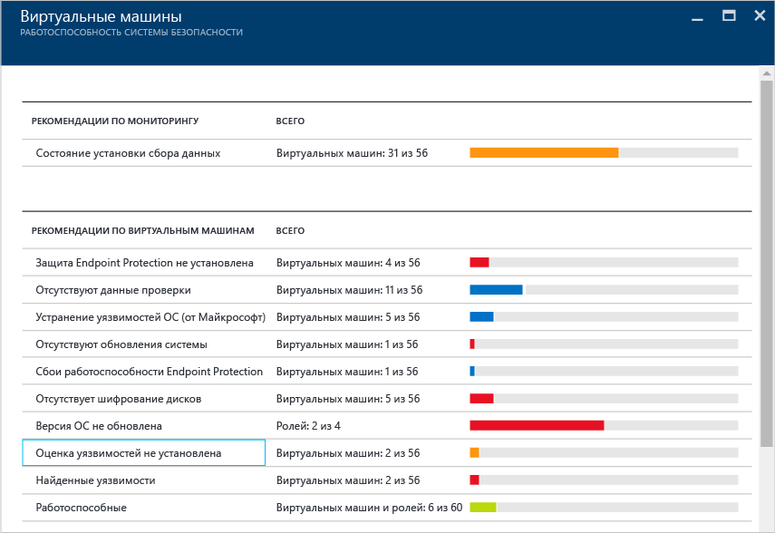
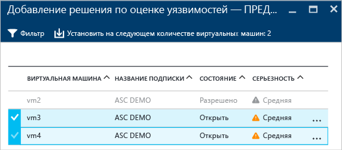
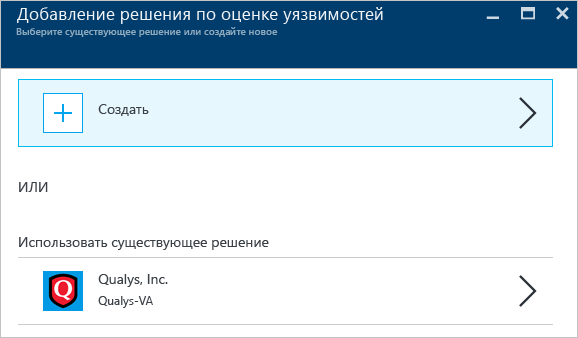
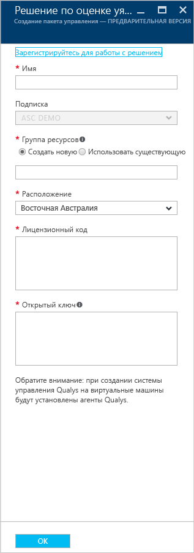
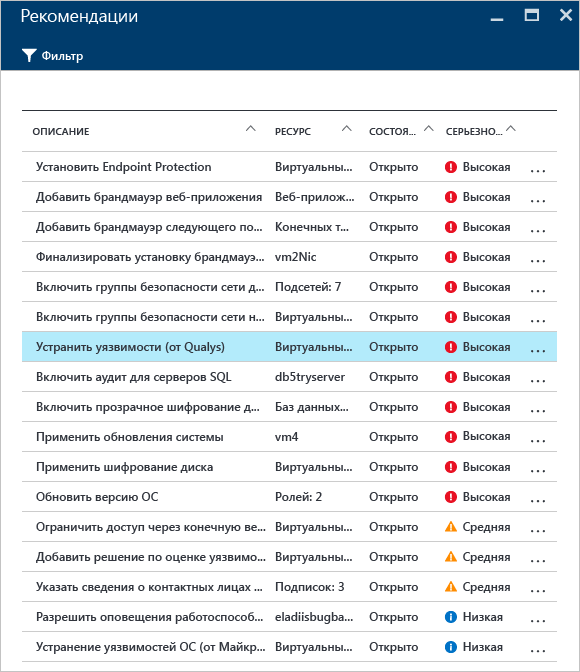
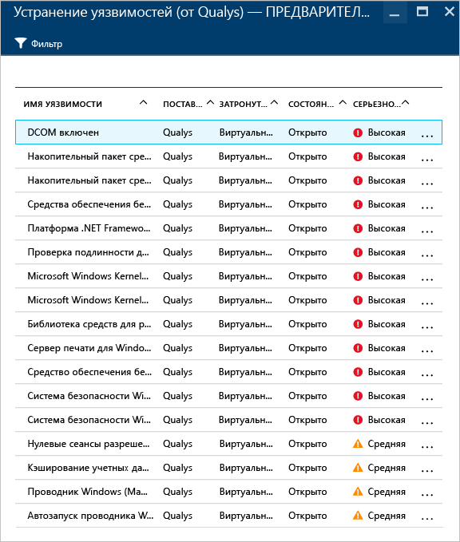
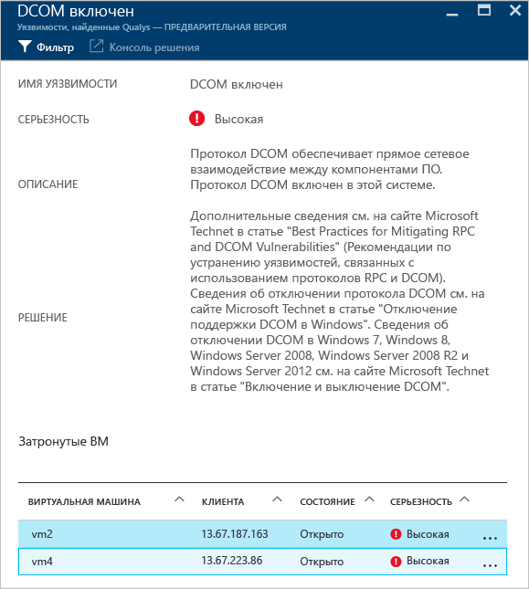

<properties
   pageTitle="Оценка уязвимостей в центре безопасности Azure| Microsoft Azure"
   description="В этой статье рассматриваются рекомендации центра безопасности Azure по установке решения для оценки уязвимостей, которые помогут защитить ваши виртуальные машины."
   services="security-center"
   documentationCenter="na"
   authors="YuriDio"
   manager="swadhwa"
   editor=""/>

<tags
   ms.service="security-center"
   ms.devlang="na"
   ms.topic="hero-article"
   ms.tgt_pltfrm="na"
   ms.workload="na"
   ms.date="09/27/2016"
   ms.author="yurid"/>

# Оценка уязвимостей в центре безопасности Azure
В этом документе рассматриваются рекомендации по оценке уязвимостей виртуальных машин, работающих в Azure.

## Что такое оценка уязвимостей?

Оценка уязвимостей в центре безопасности Azure включена в рекомендации виртуальной машины (ВМ). Если центру обеспечения безопасности не удается найти установленное на ВМ решение для оценки уязвимости, вы получите рекомендацию установить такое решение. После развертывания агент партнера начнет отправку сведений об уязвимостях на платформу управления партнера, которая, в свою очередь, возвращает данные мониторинга уязвимостей и работоспособности в центр обеспечения безопасности. Вы можете быстро определить уязвимые ВМ на панели мониторинга в центре обеспечения безопасности, а также получить отчеты и дополнительные сведения, перейдя в консоль управления партнера непосредственно из центра обеспечения безопасности.

> [AZURE.NOTE] В документе приводится обзор службы с помощью примера развертывания. Он не является пошаговым руководством.

## Ограничения общедоступной предварительной версии

К текущей общедоступной предварительной версии решения для оценки уязвимостей применяются следующие ограничения.

- Единственным доступным решением для оценки уязвимостей партнера является решение [Qualys](https://www.qualys.com/lp/azure). В дальнейшем будет добавлено больше типов.
- Решение для оценки уязвимостей можно установить на нескольких ВМ, если они принадлежат к одной подписке.
- Поддерживаются только ВМ Windows. Поддержка ВМ Linux будет добавлена в общедоступной версии.

## Реализация рекомендаций для ВМ

Когда центр обеспечения безопасности определяет одну или несколько поддерживаемых ВМ, на которых отсутствуют решения для оценки уязвимости, он активирует рекомендации этих для ВМ. Ниже показано, как получить доступ к этим рекомендациям и применить их к нескольким ВМ, которые принадлежат к одной подписке.

1. Откройте плитку **Работоспособность безопасности ресурсов** и щелкните **Виртуальные машины**.
2. В колонке **Виртуальные машины** щелкните **Оценка уязвимостей не установлена** (см. ниже).

	

3. В колонке **Добавление решения оценки уязвимости (предварительная версия)** выберите ВМ, на которых будет установлено решение для оценки уязвимостей (см. ниже).

	

4. В колонке **Добавление решения оценки уязвимости (предварительная версия)** щелкните **Установить на следующем количестве виртуальных машин: 2** (параметр может отличаться в зависимости от количества выбранных ВМ). Откроется колонка **добавления оценки уязвимостей** (см. ниже).

	

5. В этой колонке вы можете создать новое решение для оценки уязвимостей и затем выбрать решение партнера в **Azure Marketplace**. Также можно выбрать существующее решение партнера в соответствующем разделе (в нашем примере это **Qualys**).

## Создание нового решения для оценки уязвимостей

Если у вас несколько подписок, для каждой из них можно создать по одному решению для оценки уязвимостей. Основные действия аналогичны перечисленным выше, за исключением параметра **Создать**, выбранного на этапе 4. Выбрав этот вариант, следуйте инструкциям ниже.

> [AZURE.NOTE] В следующем примере используется решение Qualys. Чтобы развернуть агент облака Qualys из центра обеспечения безопасности, требуется лицензионный код и открытый ключ от Qualys. Чтобы получить лицензионный код и открытый ключ, см. инструкции в [документации по Qualys](https://community.qualys.com/docs/DOC-5823-deploying-qualys-cloud-agents-from-microsoft-azure-security-center).

1. В колонке **создания нового решения для оценки уязвимостей** щелкните имя партнера (в нашем примере это **Qualys**).
2. Откроется колонка партнера. Поля в этой колонке могут отличаться для разных партнеров. В этом примере мы работаем с решением **Qualys**.

	

3. В поле **Имя** укажите имя решения. Можно использовать имя, соответствующее группе ресурсов или подписке, к которым осуществляется привязка.
4. В поле **Подписка** выберите подписку, которая будет использоваться с этим решением.
5. В разделе **Группа ресурсов** выберите существующую группу ресурсов или создайте новую.
6. В поле **Расположение** укажите, где это решение будет располагаться географически.
7. В поле **Лицензионный код** (это поле отображается для решения Qualys) введите номер лицензии, предоставленный партнером.
8. В поле **Открытый ключ** (это поле отображается для решения Qualys) введите открытый ключ, предоставленный партнером, и нажмите кнопку **ОК**.

## Просмотр рекомендаций

Когда решение для оценки уязвимостей будет установлено на целевой ВМ, будет запущено сканирование ВМ для поиска и определения уязвимостей в системе и приложениях.

> [AZURE.NOTE] При первом запуске этот процесс может занять несколько часов. Затем он будет выполняться в течение часа.

Все проблемы будут отображаться в разделе с **рекомендациями для ВМ**. Ниже показана рекомендация, отображенная в колонке **Рекомендации**:

В этом примере выбранная рекомендация отображает, что обнаружение выполнено с помощью решения Qualys. Если щелкнуть эту рекомендацию, откроется новая колонка со списком уязвимостей (см. ниже).

Этот список содержит все уязвимости по убыванию степени серьезности, а также число ВМ, подверженных этим уязвимостям. В этом примере выбрана уязвимость "Enable DCOM". Для нее можно открыть новую колонку с рекомендуемыми действиями по устранению:

## См. также

В этой статье описывается применение рекомендаций по оценке уязвимостей в центре безопасности Azure. Дополнительные сведения о Центре безопасности Azure см. в следующих статьях:

- [Руководство по планированию использования центра безопасности Azure и работе в нем](security-center-planning-and-operations-guide.md). Узнайте, как спланировать работу в центре безопасности Azure, и получите рекомендации по переходу к его использованию.
- [Наблюдение за работоспособностью системы безопасности в Центре безопасности Azure](security-center-monitoring.md). Узнайте, как отслеживать работоспособность ресурсов Azure.
- [Управление оповещениями безопасности в Центре безопасности Azure и реагирование на них](security-center-managing-and-responding-alerts.md). Узнайте, как управлять оповещениями системы безопасности и реагировать на них.
- [Мониторинг решений партнеров с помощью центра безопасности Azure](security-center-partner-solutions.md). Узнайте, как отслеживать работоспособность партнерских решений.
- [Центр безопасности Azure: часто задаваемые вопросы](security-center-faq.md). Часто задаваемые вопросы об использовании этой службы.
- [Блог по безопасности Azure](http://blogs.msdn.com/b/azuresecurity/). Записи блога, посвященные безопасности и соответствию требованиям в Azure.

<!---HONumber=AcomDC_0928_2016-->