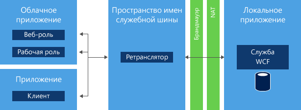

<properties
	pageTitle="Использование службы ретранслятора служебной шины (.NET) | Microsoft Azure"
	description="Узнайте, как использовать службу ретрансляции служебной шины Azure для соединения двух приложений, размещенных в разных расположениях."
	services="service-bus"
	documentationCenter=".net"
	authors="sethmanheim"
	manager="timlt"
	editor=""/>

<tags
	ms.service="service-bus"
	ms.workload="na"
	ms.tgt_pltfrm="na"
	ms.devlang="dotnet"
	ms.topic="get-started-article"
	ms.date="09/16/2016"
	ms.author="sethm"/>


# Использование службы ретранслятора служебной шины Azure

В этой статье описано создание службы ретранслятора служебной шины. Примеры написаны на языке C# и используют API службы Windows Communication Foundation (WCF) с расширениями, содержащимися в сборке служебной шины. Дополнительные сведения о ретрансляторе служебной шины см. в обзорной стать [Обмен сообщениями через служебную шину с ретрансляцией](service-bus-relay-overview.md).

[AZURE.INCLUDE [create-account-note](../../includes/create-account-note.md)]

## Описание ретрансляции служебной шины

Служба [*ретранслятора* служебной шины](service-bus-relay-overview.md) позволяет создавать гибридные приложения, которые можно запускать как в центре обработки данных Azure, так и в локальной корпоративной среде. Ретранслятор служебной шины упрощает работу, позволяя безопасно предоставлять службы Windows Communication Foundation (WCF), используемые в корпоративной сети предприятия и в общедоступном облаке, без необходимости открывать подключения брандмауэра или вносить значительные изменения в инфраструктуру корпоративной сети.



Ретранслятор служебной шины позволяет размещать службы WCF в уже существующей среде предприятия. Затем можно делегировать прослушивание входящих сеансов и запросов этих служб WCF служебной шине, запущенной в Azure. Таким образом, доступ к этим службам могут получать код приложения, работающего в Azure, мобильные сотрудники или среды партнерских экстрасетей. Служебная шина позволяет безопасно управлять доступом к этим службам с высокой точностью. Это обеспечивает эффективный и безопасный способ предоставления функциональных возможностей приложения и данных из существующих корпоративных решений и использовать их из облака

Данная статья демонстрирует использование ретранслятора служебной шины для создания веб-службы WCF, доступной с помощью привязки канала TCP, который обеспечивает безопасную передачу данных между двумя сторонами.

## Создание пространства имен службы

Прежде чем использовать ретранслятор служебной шины в Azure, необходимо создать пространство имен. Пространство имен предоставляет контейнер для адресации ресурсов служебной шины в вашем приложении.

Создание пространства имен службы:

[AZURE.INCLUDE [service-bus-create-namespace-portal](../../includes/service-bus-create-namespace-portal.md)]

## Получение пакета NuGet для служебной шины

[Пакет NuGet для служебной шины](https://www.nuget.org/packages/WindowsAzure.ServiceBus) — это самый простой способ получить интерфейс API служебной шины и настроить свое приложение с учетом всех зависимостей служебной шины. Для установки пакета NuGet в проекте сделайте следующее:

1.  В обозревателе решений щелкните правой кнопкой мыши **Ссылки**, затем выберите команду **Управление пакетами NuGet**.
2.  Выполните поиск по фразе "служебная шина" и выберите элемент **Служебная шина Microsoft Azure**. Нажмите кнопку **Установить**, чтобы выполнить установку, а затем закройте следующее диалоговое окно.

	

## Использование служебной шины для предоставления и получения веб-службы SOAP с TCP

Чтобы предоставить существующую веб-службу WCF SOAP для внешнего использования, необходимо внести изменения в привязки службы и адреса. Это может потребовать изменения файла конфигурации или кода, в зависимости от настроек и конфигурации ваших служб WCF. Обратите внимание на то, что WCF разрешает использование нескольких конечных точек сети в одной и той же службе, так что вы можете с одной стороны, сохранить внутренние конечные точки, а с другой, добавить конечные точки шины Service Bus.

В этом примере потребуется создать простую службу WCF и добавить в нее прослушиватель служебной шины. Это предполагает определенное знакомство с Visual Studio, поэтому рассматриваются не все подробности создания проекта. Вместо этого главная роль уделяется коду.

Прежде чем выполнить описанные ниже действия, сделайте следующее, чтобы настроить свою среду:

1.  В Visual Studio создайте в рамках решения консольное приложение, содержащее два проекта, Client и Service.
2.  Добавьте пакет NuGet "Служебная шина Microsoft Azure" в оба проекта. Он добавит в проекты все необходимые ссылки на сборки.

### Создание службы

Во-первых, создайте саму службу. Любая служба WCF состроит из трех или более различных частей.

-   Определение контракта, который описывает передаваемые сообщения и вызываемые операции.
-   Реализация указанного контракта.
-   Узел, на котором размещается служба WCF и который предоставляет несколько конечных точек.

Примеры кода в данном разделе обращаются к каждому из названных компонентов.

Контракт определяет одну операцию, `AddNumbers`, которая складывает два числа и возвращает результат. Интерфейс `IProblemSolverChannel` упрощает для клиента управление временем жизни прокси-сервера. Рекомендуется создать этот интерфейс. Очень удобно размещение определения контракта в отдельном файле, так что вы можете к нему обратиться как из проекта Client, так и Service, а также скопировать код в оба проекта.

```
using System.ServiceModel;

[ServiceContract(Namespace = "urn:ps")]
interface IProblemSolver
{
    [OperationContract]
    int AddNumbers(int a, int b);
}

interface IProblemSolverChannel : IProblemSolver, IClientChannel {}
```

При наличии контракта реализация предельно проста.

```
class ProblemSolver : IProblemSolver
{
    public int AddNumbers(int a, int b)
    {
        return a + b;
    }
}
```

### Программная настройка узла службы

После создания контракта и его реализации можно разместить службу. Размещение происходит внутри объекта [System.ServiceModel.ServiceHost](https://msdn.microsoft.com/library/azure/system.servicemodel.servicehost.aspx), который отвечает за управление экземплярами службы и в котором размещаются конечные точки, прослушивающие сообщения. Приведенный ниже код настраивает для службы обычную локальную конечную точку и конечную точку служебной шины для параллельного представления внутренних и внешних конечных точек. Замените строку *namespace* именем своего пространства имен, а *yourKey* — ключом SAS, полученным на предыдущем шаге настройки.

```
ServiceHost sh = new ServiceHost(typeof(ProblemSolver));

sh.AddServiceEndpoint(
   typeof (IProblemSolver), new NetTcpBinding(),
   "net.tcp://localhost:9358/solver");

sh.AddServiceEndpoint(
   typeof(IProblemSolver), new NetTcpRelayBinding(),
   ServiceBusEnvironment.CreateServiceUri("sb", "namespace", "solver"))
    .Behaviors.Add(new TransportClientEndpointBehavior {
          TokenProvider = TokenProvider.CreateSharedAccessSignatureTokenProvider("RootManageSharedAccessKey", "<yourKey>")});

sh.Open();

Console.WriteLine("Press ENTER to close");
Console.ReadLine();

sh.Close();
```

В этом примере вы создаете две конечных точки в рамках одного и того же исполнения контракта. Одна из них является локальной, а вторая проецируется с помощью служебной шины. Основным различием между ними являются привязки ([NetTcpBinding](https://msdn.microsoft.com/library/azure/system.servicemodel.nettcpbinding.aspx) для локальной и [NetTcpRelayBinding](https://msdn.microsoft.com/library/azure/microsoft.servicebus.nettcprelaybinding.aspx) для конечной точки служебной шины) и адреса. Для локальной конечной точки используется локальный сетевой адрес с отдельным портом. Адрес конечной точки служебной шины включает в себя строку `sb`, имя вашего пространства имен и путь solver. Результатом является универсальный код ресурса (URI) `sb://[serviceNamespace].servicebus.windows.net/solver`, определяющий конечную точку службы как конечную точку службы TCP служебной шины с полным внешним DNS-именем. Если в функции `Main` приложения **Service** вместо заполнителей использовать код, будет создана функциональная служба. Если нужно, чтобы ваша служба прослушивала только служебную шину, удалите объявление локальной конечной точки.

### Настройка узла службы в файле App.config

С помощью файла App.config также можно настроить узел. В этом случае код размещения службы выглядит так, как показано в следующем примере.

```
ServiceHost sh = new ServiceHost(typeof(ProblemSolver));
sh.Open();
Console.WriteLine("Press ENTER to close");
Console.ReadLine();
sh.Close();
```

Определения конечных точек перемещаются в файл App.config. Пакет NuGet уже добавил в файл App.config ряд определений, являющихся необходимыми расширениями настройки служебной шины. Следующий пример, который является точным эквивалентом кода, приведенного выше, должен появиться прямо под элементом **system.serviceModel**. В этом примере кода предполагается, что пространство имен C# вашего проекта называется **Service**. Замените заполнители на пространство имен служб и ключ SAS.

```
<services>
    <service name="Service.ProblemSolver">
        <endpoint contract="Service.IProblemSolver"
                  binding="netTcpBinding"
                  address="net.tcp://localhost:9358/solver"/>
        <endpoint contract="Service.IProblemSolver"
                  binding="netTcpRelayBinding"
                  address="sb://namespace.servicebus.windows.net/solver"
                  behaviorConfiguration="sbTokenProvider"/>
    </service>
</services>
<behaviors>
    <endpointBehaviors>
        <behavior name="sbTokenProvider">
            <transportClientEndpointBehavior>
                <tokenProvider>
                    <sharedAccessSignature keyName="RootManageSharedAccessKey" key="<yourKey>" />
                </tokenProvider>
            </transportClientEndpointBehavior>
        </behavior>
    </endpointBehaviors>
</behaviors>
```

После этих изменений служба запускается как и раньше, но с двумя работающими конечными точками: одной локальной и одной прослушивающей в облаке.

### Создание клиента

#### Программная настройка клиента

Для использования службы вы можете создать клиент WCF, работающий с объектом [ChannelFactory](https://msdn.microsoft.com/library/system.servicemodel.channelfactory.aspx). Служебная шина использует модель безопасности на основе маркеров, реализованную с помощью SAS. Класс [TokenProvider](https://msdn.microsoft.com/library/azure/microsoft.servicebus.tokenprovider.aspx) представляет собой поставщика маркеров безопасности со встроенными методами генерации, которые возвращают ряд хорошо известных поставщиков маркеров. В приведенном ниже примере используется метод [CreateSharedAccessSignatureTokenProvider](https://msdn.microsoft.com/library/azure/microsoft.servicebus.tokenprovider.createsharedaccesssignaturetokenprovider.aspx) для обработки получения соответствующего маркера SAS. Значения имени и ключа наследуются с портала, как описано в предыдущем разделе.

Во-первых, создайте в проекте клиента ссылку или скопируйте в него код контракта `IProblemSolver` из службы.

Затем замените код в методе `Main` клиента, снова подставив имя пространства имен служебной шины и ключ SAS вместо текста заполнителя.

```
var cf = new ChannelFactory<IProblemSolverChannel>(
    new NetTcpRelayBinding(),
    new EndpointAddress(ServiceBusEnvironment.CreateServiceUri("sb", "namespace", "solver")));

cf.Endpoint.Behaviors.Add(new TransportClientEndpointBehavior
            { TokenProvider = TokenProvider.CreateSharedAccessSignatureTokenProvider("RootManageSharedAccessKey","<yourKey>") });

using (var ch = cf.CreateChannel())
{
    Console.WriteLine(ch.AddNumbers(4, 5));
}
```

Теперь можно создать клиент и службу, а затем запустить их (сначала запустите службу). После этого клиент вызовет службу и выведет **9**. Можно запустить клиент и сервер на разных компьютерах, даже в разных сетях, и связь по-прежнему будет работать. Код клиента также может работать в облаке или локально.

#### Настройка клиента в файле App.config

В примере кода ниже показано, как настроить клиент с помощью файла App.config.

```
var cf = new ChannelFactory<IProblemSolverChannel>("solver");
using (var ch = cf.CreateChannel())
{
    Console.WriteLine(ch.AddNumbers(4, 5));
}
```

Определения конечных точек перемещаются в файл App.config. Следующий пример, который полностью эквивалентен приведенному выше коду, должен находиться непосредственно под элементом **system.serviceModel**. Здесь снова необходимо заменить заполнители пространством имен служебной шины и ключом SAS.

```
<client>
    <endpoint name="solver" contract="Service.IProblemSolver"
              binding="netTcpRelayBinding"
              address="sb://namespace.servicebus.windows.net/solver"
              behaviorConfiguration="sbTokenProvider"/>
</client>
<behaviors>
    <endpointBehaviors>
        <behavior name="sbTokenProvider">
            <transportClientEndpointBehavior>
                <tokenProvider>
                    <sharedAccessSignature keyName="RootManageSharedAccessKey" key="<yourKey>" />
                </tokenProvider>
            </transportClientEndpointBehavior>
        </behavior>
    </endpointBehaviors>
</behaviors>
```

## Дальнейшие действия

Теперь, когда вы изучили основы использования службы ретранслятора служебной шины, воспользуйтесь следующими ссылками, чтобы получить дополнительную информацию.

- [Обмен сообщениями через служебную шину с ретрансляцией](service-bus-relay-overview.md)
- [Обзор архитектуры служебной шины Azure](service-bus-fundamentals-hybrid-solutions.md)
- Скачайте примеры служебной шины со страницы [Примеры Azure][] или просмотрите [обзор примеров служебной шины][].

  [Shared Access Signature Authentication with Service Bus]: service-bus-shared-access-signature-authentication.md
  [Примеры Azure]: https://code.msdn.microsoft.com/site/search?query=service%20bus&f%5B0%5D.Value=service%20bus&f%5B0%5D.Type=SearchText&ac=2
  [обзор примеров служебной шины]: service-bus-samples.md

<!----HONumber=AcomDC_0921_2016-->