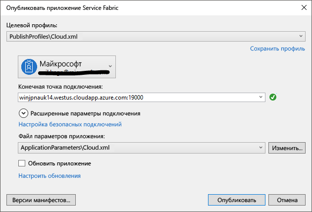

# <a name="quickstart-deploy-a-service-fabric-windows-container-application-on-azure"></a>Краткое руководство по развертыванию приложения-контейнера Service Fabric для Windows в Azure
Azure Service Fabric — это платформа распределенных систем для развертывания масштабируемых надежных микрослужб и контейнеров и управления ими. 

Чтобы запустить существующее приложение в контейнере Windows кластера Service Fabric, не требуется вносить изменения в приложение. В этом кратком руководстве показано, как развернуть готовый образ контейнера Docker в приложении Service Fabric. По окончании вы получите рабочий контейнер для IIS и Nano Server в Windows Server 2016. В этом кратком руководстве объясняется, как развернуть контейнер Windows. Чтобы узнать, как развернуть контейнер Linux, ознакомьтесь с [этим кратким руководством](service-fabric-quickstart-containers-linux.md).

![Страница служб IIS по умолчанию][iis-default]

Из этого краткого руководства вы узнаете, как выполнить следующие задачи:
> [!div class="checklist"]
> * упаковка контейнера образов Docker;
> * Настройка обмена данными
> * Создание и упаковка приложений Service Fabric
> * развертывание приложения-контейнера в Azure.

## <a name="prerequisites"></a>предварительным требованиям
* Подписка Azure. Вы можете создать [бесплатную учетную запись](https://azure.microsoft.com/free/?WT.mc_id=A261C142F).
* Компьютер для разработки, на котором установлено ПО, перечисленное ниже.
  * Visual Studio 2015 или Visual Studio 2017.
  * [Пакет SDK и средства для Service Fabric](service-fabric-get-started.md).

## <a name="package-a-docker-image-container-with-visual-studio"></a>Упаковка контейнера образов Docker с помощью Visual Studio
Пакет SDK и средства для Service Fabric предоставляют шаблон службы для развертывания контейнера в кластере Service Fabric.

Запустите Visual Studio от имени администратора.  Выберите **Файл** > **Создать** > **Проект**.

Выберите **Приложение Service Fabric**, назовите его MyFirstContainer и нажмите кнопку **ОК**.

Выберите **Контейнер** в шаблонах **размещенных контейнеров и приложений**.

В поле **Имя образа** укажите microsoft/iis:nanoserver — [базовый образ Nano Server Windows Server и IIS](https://hub.docker.com/r/microsoft/iis/). 

Присвойте службе имя MyContainerService и нажмите кнопку **ОК**.

## <a name="configure-communication-and-container-port-to-host-port-mapping"></a>Настройка обмена данными и сопоставления порта контейнера с портом узла
Для обмена данными службе требуется конечная точка.  В этом кратком руководстве служба контейнеров ожидает передачи данных на порту 80.  В обозревателе решений откройте *MyFirstContainer/ApplicationPackageRoot/MyContainerServicePkg/ServiceManifest.xml*.  Обновите имеющуюся строку `Endpoint` в файле ServiceManifest.xml и добавьте протокол, порт и схему URI. 

```xml
<Resources>
    <Endpoints>
        <Endpoint Name="MyContainerServiceTypeEndpoint" UriScheme="http" Port="80" Protocol="http"/>
   </Endpoints>
</Resources>
```
Если указать `UriScheme`, конечная точка контейнера будет автоматически зарегистрирована в службе именования Service Fabric, что улучшит ее поиск. Полный пример файла ServiceManifest.xml приведен в конце этой статьи. 

Настройте сопоставление порта контейнера с портом узла, чтобы входящие запросы к службе через порт 80 сопоставлялись с портом 80 в контейнере.  В обозревателе решений откройте *MyFirstContainer/ApplicationPackageRoot/ApplicationManifest.xml* и укажите политику `PortBinding` в строке `ContainerHostPolicies`.  В этом кратком руководстве для параметра `ContainerPort` задано значение 80, а для `EndpointRef` — MyContainerServiceTypeEndpoint (конечная точка, определенная в манифесте службы).    

```xml
<ServiceManifestImport>
...
  <ConfigOverrides />
  <Policies>
    <ContainerHostPolicies CodePackageRef="Code">
      <PortBinding ContainerPort="80" EndpointRef="MyContainerServiceTypeEndpoint"/>
    </ContainerHostPolicies>
  </Policies>
</ServiceManifestImport>
```

Полный пример файла ApplicationManifest.xml приведен в конце этой статьи.

## <a name="create-a-cluster"></a>Создание кластера
Для развертывания приложения в кластере Azure можно использовать кластер сообщества. Кластеры сообщества — это бесплатные кластеры Service Fabric, которые доступны в течение ограниченного времени. Эти кластеры размещены в Azure и поддерживаются командой Service Fabric. Любой пользователь может развертывать приложения на этих кластерах и знакомиться с платформой.  Кластер использует один самозаверяющий сертификат для обмена данными между узлами и обеспечения безопасности при взаимодействии между клиентом и узлом. Контейнеры с поддержкой кластеров сообщества. Если у вас настроен собственный кластер, он должен быть запущен в Windows Server 2016 с поддержкой контейнеров, чтобы можно было обеспечить их работу.

Войдите в систему и [присоедините кластер Windows](http://aka.ms/tryservicefabric). Загрузите сертификат PFX на компьютер, щелкнув ссылку **PFX**. Сертификат и значение **конечной точки подключения** будут использоваться в дальнейшем.


На компьютере Windows установите PFX в хранилище сертификатов: *CurrentUser\My*.

```powershell
PS C:\mycertificates> Import-PfxCertificate -FilePath .\party-cluster-873689604-client-cert.pfx -CertStoreLocation Cert:
\CurrentUser\My


  PSParentPath: Microsoft.PowerShell.Security\Certificate::CurrentUser\My

Thumbprint                                Subject
----------                                -------
3B138D84C077C292579BA35E4410634E164075CD  CN=zwin7fh14scd.westus.cloudapp.azure.com
```

Помните об отпечатке для следующего шага.  

## <a name="deploy-the-application-to-azure-using-visual-studio"></a>Развертывание приложения в Azure с помощью Visual Studio
Теперь, когда приложение готово, можно развернуть его в кластер напрямую из Visual Studio.

Щелкните правой кнопкой мыши **MyFirstContainer** в обозревателе решений и выберите команду **Опубликовать**. Появится диалоговое окно "Опубликовать".

Скопируйте **конечную точку подключения** со страницы кластера сообщества в поле **Конечная точка подключения**. Например, `zwin7fh14scd.westus.cloudapp.azure.com:19000`. Щелкните **Расширенные параметры подключения** и проверьте сведения о параметрах подключения.  Значения *FindValue* и *ServerCertThumbprint* должны соответствовать отпечатку сертификата, который установлен на предыдущем шаге. 



Щелкните **Опубликовать**.

Имя каждого приложения в кластере должно быть уникальным.  Кластеры сообщества — это открытая общедоступная среда. Но они могут конфликтовать с существующим приложением.  В случае конфликта имен переименуйте проект Visual Studio и повторите развертывание.

Откройте веб-браузер и перейдите по адресу http://zwin7fh14scd.westus.cloudapp.azure.com:80. Откроется веб-страница IIS по умолчанию. ![Веб-страница IIS по умолчанию][iis-default]

## <a name="complete-example-service-fabric-application-and-service-manifests"></a>Полные примеры манифестов службы и приложения Service Fabric
Ниже приведены полные коды манифестов службы и приложения, используемых в этом кратком руководстве.

### <a name="servicemanifestxml"></a>ServiceManifest.xml
```xml
<?xml version="1.0" encoding="utf-8"?>
<ServiceManifest Name="MyContainerServicePkg"
                 Version="1.0.0"
                 xmlns="http://schemas.microsoft.com/2011/01/fabric"
                 xmlns:xsd="http://www.w3.org/2001/XMLSchema"
                 xmlns:xsi="http://www.w3.org/2001/XMLSchema-instance">
  <ServiceTypes>
    <!-- This is the name of your ServiceType.
         The UseImplicitHost attribute indicates this is a guest service. -->
    <StatelessServiceType ServiceTypeName="MyContainerServiceType" UseImplicitHost="true" />
  </ServiceTypes>

  <!-- Code package is your service executable. -->
  <CodePackage Name="Code" Version="1.0.0">
    <EntryPoint>
      <!-- Follow this link for more information about deploying Windows containers to Service Fabric: https://aka.ms/sfguestcontainers -->
      <ContainerHost>
        <ImageName>microsoft/iis:nanoserver</ImageName>
      </ContainerHost>
    </EntryPoint>
    <!-- Pass environment variables to your container: -->
    <!--
    <EnvironmentVariables>
      <EnvironmentVariable Name="VariableName" Value="VariableValue"/>
    </EnvironmentVariables>
    -->
  </CodePackage>

  <!-- Config package is the contents of the Config directoy under PackageRoot that contains an 
       independently-updateable and versioned set of custom configuration settings for your service. -->
  <ConfigPackage Name="Config" Version="1.0.0" />

  <Resources>
    <Endpoints>
      <!-- This endpoint is used by the communication listener to obtain the port on which to 
           listen. Please note that if your service is partitioned, this port is shared with 
           replicas of different partitions that are placed in your code. -->
      <Endpoint Name="MyContainerServiceTypeEndpoint" UriScheme="http" Port="80" Protocol="http"/>
    </Endpoints>
  </Resources>
</ServiceManifest>
```
### <a name="applicationmanifestxml"></a>ApplicationManifest.xml
```xml
<?xml version="1.0" encoding="utf-8"?>
<ApplicationManifest ApplicationTypeName="MyFirstContainerType"
                     ApplicationTypeVersion="1.0.0"
                     xmlns="http://schemas.microsoft.com/2011/01/fabric"
                     xmlns:xsd="http://www.w3.org/2001/XMLSchema"
                     xmlns:xsi="http://www.w3.org/2001/XMLSchema-instance">
  <Parameters>
    <Parameter Name="MyContainerService_InstanceCount" DefaultValue="-1" />
  </Parameters>
  <!-- Import the ServiceManifest from the ServicePackage. The ServiceManifestName and ServiceManifestVersion 
       should match the Name and Version attributes of the ServiceManifest element defined in the 
       ServiceManifest.xml file. -->
  <ServiceManifestImport>
    <ServiceManifestRef ServiceManifestName="MyContainerServicePkg" ServiceManifestVersion="1.0.0" />
    <ConfigOverrides />
    <Policies>
      <ContainerHostPolicies CodePackageRef="Code">
        <PortBinding ContainerPort="80" EndpointRef="MyContainerServiceTypeEndpoint"/>
      </ContainerHostPolicies>
    </Policies>
  </ServiceManifestImport>
  <DefaultServices>
    <!-- The section below creates instances of service types, when an instance of this 
         application type is created. You can also create one or more instances of service type using the 
         ServiceFabric PowerShell module.
         
         The attribute ServiceTypeName below must match the name defined in the imported ServiceManifest.xml file. -->
    <Service Name="MyContainerService" ServicePackageActivationMode="ExclusiveProcess">
      <StatelessService ServiceTypeName="MyContainerServiceType" InstanceCount="[MyContainerService_InstanceCount]">
        <SingletonPartition />
      </StatelessService>
    </Service>
  </DefaultServices>
</ApplicationManifest>
```

## <a name="next-steps"></a>Дополнительная информация
Из этого руководства вы узнали, как выполнить следующие действия:
> [!div class="checklist"]
> * упаковка контейнера образов Docker;
> * Настройка обмена данными
> * Создание и упаковка приложений Service Fabric
> * развертывание приложения-контейнера в Azure.

* Дополнительные сведения о запуске [контейнеров в Service Fabric](service-fabric-containers-overview.md).
* Ознакомьтесь с руководством [Развертывание приложения-контейнера .NET в Azure Service Fabric](service-fabric-host-app-in-a-container.md).
* Дополнительные сведения о [жизненном цикле приложения](service-fabric-application-lifecycle.md) Service Fabric.
* Извлечение [примеров кода контейнера Service Fabric](https://github.com/Azure-Samples/service-fabric-containers) на GitHub.

[iis-default]: ./media/service-fabric-quickstart-containers/iis-default.png
[publish-dialog]: ./media/service-fabric-quickstart-containers/publish-dialog.png
