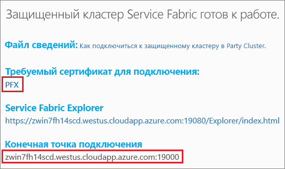

# <a name="quickstart-deploy-a-service-fabric-windows-container-application-on-azure"></a>Краткое руководство по развертыванию приложения-контейнера Service Fabric для Windows в Azure
Azure Service Fabric — это платформа распределенных систем для развертывания масштабируемых надежных микрослужб и контейнеров и управления ими. 

Чтобы запустить существующее приложение в контейнере Windows кластера Service Fabric, не требуется вносить изменения в приложение. В этом кратком руководстве показано, как развернуть готовый образ контейнера Docker в приложении Service Fabric. По окончании вы получите рабочий контейнер для IIS и Nano Server в Windows Server 2016. В этом кратком руководстве объясняется, как развернуть контейнер Windows. Чтобы узнать, как развернуть контейнер Linux, ознакомьтесь с [этим кратким руководством](service-fabric-quickstart-containers-linux.md).

![Страница служб IIS по умолчанию][iis-default]

Из этого краткого руководства вы узнаете, как выполнять следующие задачи:

* упаковка контейнера образов Docker;
* Настройка обмена данными
* Создание и упаковка приложений Service Fabric
* развертывание приложения-контейнера в Azure.

## <a name="prerequisites"></a>предварительным требованиям
* Подписка Azure. Вы можете создать [бесплатную учетную запись](https://azure.microsoft.com/free/?WT.mc_id=A261C142F).
* Компьютер для разработки, на котором установлено ПО, перечисленное ниже.
  * Visual Studio 2015 или Visual Studio 2017.
  * [Пакет SDK и средства для Service Fabric](service-fabric-get-started.md).

## <a name="package-a-docker-image-container-with-visual-studio"></a>Упаковка контейнера образов Docker с помощью Visual Studio
Пакет SDK и средства для Service Fabric предоставляют шаблон службы для развертывания контейнера в кластере Service Fabric.

Запустите Visual Studio от имени администратора.  Выберите **Файл** > **Создать** > **Проект**.

Выберите **Приложение Service Fabric**, назовите его MyFirstContainer и нажмите кнопку **ОК**.

Выберите **Контейнер** в шаблонах **размещенных контейнеров и приложений**.

В поле **Имя образа** укажите microsoft/iis:nanoserver — [базовый образ Nano Server Windows Server и IIS](https://hub.docker.com/r/microsoft/iis/). 

Настройте сопоставление порта контейнера с портом узла, чтобы входящие запросы к службе через порт 80 сопоставлялись с портом 80 в контейнере.  Укажите **порт контейнера** (80) и **узла** (80).  

Присвойте службе имя MyContainerService и нажмите кнопку **ОК**.

![Диалоговое окно создания службы][new-service]

## <a name="create-a-cluster"></a>Создание кластера
Для развертывания приложения в кластере Azure можно использовать кластер сообщества. Кластеры сообщества — это бесплатные кластеры Service Fabric, которые доступны в течение ограниченного времени. Эти кластеры размещены в Azure и поддерживаются командой Service Fabric. Любой пользователь может развертывать приложения на этих кластерах и знакомиться с платформой.  Кластер использует один самозаверяющий сертификат для обмена данными между узлами и обеспечения безопасности при взаимодействии между клиентом и узлом. Контейнеры с поддержкой кластеров сообщества. Чтобы настроить и использовать собственный кластер, связанный с ним номер SKU должен поддерживать контейнеры (например, Windows Server Datacenter 2016 с контейнерами).

Войдите в систему и [присоедините кластер Windows](http://aka.ms/tryservicefabric). Загрузите сертификат PFX на компьютер, щелкнув ссылку **PFX**. Щелкните ссылку **How to connect to a secure Party cluster?** (Как подключиться к безопасному кластеру сообщества) и скопируйте пароль сертификата. Сертификат, пароль сертификата и значение **конечной точки подключения** будут использоваться в дальнейшем.



> [!Note]
> В течение одного часа доступно ограниченное число кластеров сообщества. Если при попытке регистрации в кластере сообщества поступает сообщение об ошибке, подождите немного и повторите попытку. Или следуйте инструкциям из раздела о [развертывании приложения .NET](https://docs.microsoft.com/azure/service-fabric/service-fabric-tutorial-deploy-app-to-party-cluster#deploy-the-sample-application), чтобы создать кластер Service Fabric в подписке Azure и развернуть в нем приложение. Кластер, созданный с помощью Visual Studio, поддерживает контейнеры. После развертывания и проверки приложения в кластере можно сразу перейти к работе с [полными примерами манифестов службы и приложений Service Fabric](#complete-example-service-fabric-application-and-service-manifests). 
>

На компьютере Windows установите PFX в хранилище сертификатов: *CurrentUser\My*.

```powershell
PS C:\mycertificates> Import-PfxCertificate -FilePath .\party-cluster-873689604-client-cert.pfx -CertStoreLocation Cert:\CurrentUser\My -Password (ConvertTo-SecureString 873689604 -AsPlainText -Force)


  PSParentPath: Microsoft.PowerShell.Security\Certificate::CurrentUser\My

Thumbprint                                Subject
----------                                -------
3B138D84C077C292579BA35E4410634E164075CD  CN=zwin7fh14scd.westus.cloudapp.azure.com
``` 

## <a name="deploy-the-application-to-azure-using-visual-studio"></a>Развертывание приложения в Azure с помощью Visual Studio
Теперь, когда приложение готово, можно развернуть его в кластер напрямую из Visual Studio.

Щелкните правой кнопкой мыши **MyFirstContainer** в обозревателе решений и выберите команду **Опубликовать**. Появится диалоговое окно "Опубликовать".

Скопируйте **конечную точку подключения** со страницы кластера сообщества в поле **Конечная точка подключения**. Например, `zwin7fh14scd.westus.cloudapp.azure.com:19000`. 

Щелкните **Опубликовать**.

Имя каждого приложения в кластере должно быть уникальным.  Кластеры сообщества — это открытая общедоступная среда. Но они могут конфликтовать с существующим приложением.  В случае конфликта имен переименуйте проект Visual Studio и повторите развертывание.

Откройте браузер и перейдите к **конечной точки подключения**, указанной на странице кластера сообщества. При необходимости можно добавить в начало URL-адреса идентификатор схемы `http://` и порт `:80`. Например, http://zwin7fh14scd.westus.cloudapp.azure.com:80. Откроется веб-страница IIS по умолчанию. ![Веб-страница IIS по умолчанию][iis-default]

## <a name="next-steps"></a>Дополнительная информация
Из этого руководства вы узнали, как выполнить следующие действия:

* упаковка контейнера образов Docker;
* Настройка обмена данными
* Создание и упаковка приложений Service Fabric
* развертывание приложения-контейнера в Azure.

Дополнительные сведения о работе с контейнерами Windows в Service Fabric см. в руководстве для приложений-контейнеров Windows.

> [!div class="nextstepaction"]
> [Создание приложения-контейнера Windows](./service-fabric-host-app-in-a-container.md)

[iis-default]: ./media/service-fabric-quickstart-containers/iis-default.png
[publish-dialog]: ./media/service-fabric-quickstart-containers/publish-dialog.png
[new-service]: ./media/service-fabric-quickstart-containers/NewService.png
