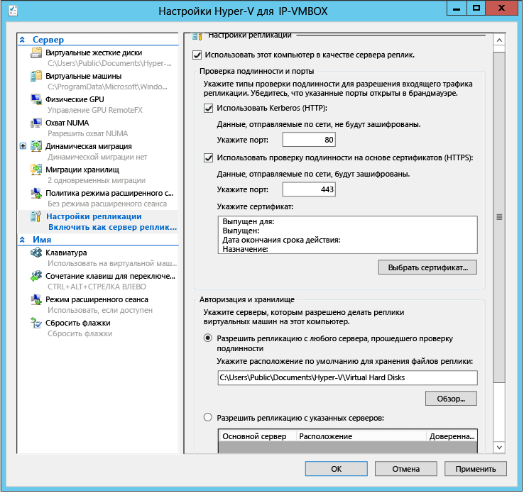

<properties
	pageTitle="Планирование загрузки для репликации Hyper-V"
	description="В этой статье описаны инструкции по использованию планировщика ресурсов для службы Azure Site Recovery, а также ресурсы по планированию загрузки для репликации Hyper-V"
	services="site-recovery"
	documentationCenter="na"
	authors="csilauraa"
	manager="jwhit"
	editor="tysonn" />
<tags
	ms.service="site-recovery"
	ms.devlang="na"
	ms.topic="article"
	ms.tgt_pltfrm="na"
	ms.workload="infrastructure-services"
	ms.date="06/01/2015"
	ms.author="lauraa" />

# Планирование загрузки для репликации Hyper-V

Служба Azure Site Recovery использует реплику Hyper-V для репликации между двумя локальными сайтами VMM или между локальным сервером VMM и хранилищем Azure. Эта статья содержит пошаговые инструкции по использованию планировщика ресурсов для Azure Site Recovery (ASR) — средство реплики Hyper-V. Планировщик ресурсов для ASR (средство реплики Hyper-V) помогает ИТ-администратору при разработке инфраструктуры серверов, хранилищ и сети, которая требуется для успешного развертывания реплики Hyper-V и проверки сетевого подключения между двумя сайтами.

## Требования к системе
- Операционная система: Windows Server ® 2012 или Windows Server ® 2012 R2
- Память: 20 МБ (минимум)
- ЦП: дополнительно 5 процентов (минимум)
- Место на диске: 5 МБ (минимум)

## Пошаговые указания
- Шаг 1. Подготовка основного сайта
- Шаг 2. Подготовка сайта восстановления, если он является локальным
- Шаг 3. Запуск планировщика ресурсов
- Шаг 4. Интерпретация результатов

## Шаг 1. Подготовка основного сайта
1. Создайте список всех виртуальных машин Hyper-V, которые нужно включить для репликации, и соответствующих основных узлов или кластеров Hyper-V.
2. Сгруппируйте основные узлы Hyper-V и кластеры в один из следующих типов:

  - Изолированные серверы Windows Server ® 2012
  - Кластеры Windows Server ® 2012
  - Изолированные серверы Windows Server® 2012 R2
  - Кластеры Windows Server® 2012 R2

3. Необходимо один раз запустить планировщик ресурсов для каждой изолированной группы серверов и один раз для каждого кластера.
4. Включите удаленный доступ к WMI на всех основных узлах и кластерах. Убедитесь, что установлены правильные наборы правил брандмауэра и разрешения пользователей.

        netsh firewall set service RemoteAdmin enable

5. Включите мониторинг производительности на основных узлах.

  - Откройте **брандмауэр Windows** с оснасткой **повышенной безопасности**, а затем включите следующие правила для входящих подключений:
    - Доступ к сети COM+ (входящий трафик DCOM)
    - Все правила в группе удаленного управления журналом событий

## Шаг 2. Подготовка сайта восстановления
Если вы используете Azure как сайт восстановления или ваш локальный сайт восстановления еще не готов, этот раздел можно пропустить. Но в этом случае вы не сможете измерить доступную пропускную способность между двумя сайтами.

1. Определите метод проверки подлинности.

	а. Kerberos: используется, если основные узлы и узлы восстановления Hyper-V находятся в одном домене или в доменах со взаимным доверием.

	b. Сертификат: используется, если основные узлы и узлы восстановления Hyper-V находятся в разных доменах. Сертификаты можно создать с помощью MakeCert. Сведения о действиях, необходимых для развертывания сертификатов с помощью этого средства, см. в записи блога [Проверка подлинности на основе сертификата реплики Hyper-V— MakeCert](http://blogs.technet.com/b/virtualization/archive/2013/04/13/hyper-v-replica-certificate-based-authentication-makecert.aspx).

2. Определите **один** узел или кластер восстановления Hyper-V на сайте восстановления.

	а. Этот узел или кластер восстановления будет использоваться для репликации фиктивной виртуальной машины и оценки доступной пропускной способности между основным и дополнительным сайтами.

	b. **Рекомендация**: при выполнении тестов используйте один узел восстановления Hyper-V.

### Подготовка одного узла Hyper-V как сервера восстановления
1. В диспетчере Hyper-V щелкните **Параметры Hyper-V** на панели **Действия**.
2. В диалоговом окне **Параметры Hyper-V** щелкните **Конфигурация репликации**.
3. В области сведений выберите **Использовать этот компьютер как сервер-реплику**.
4. В разделе **Проверка подлинности и порты** выберите выбранный ранее метод проверки подлинности. Для любого метода проверки подлинности, укажите используемый порт (порты по умолчанию — порт 80 для Kerberos по протоколу HTTP и порт 443 для проверки подлинности на основе сертификатов по протоколу HTTPS).
5. При использовании проверки подлинности на основе сертификатов нажмите кнопку **Выбор сертификата** и введите сведения о сертификате.
6. В разделе **Авторизация и хранилище** установите разрешение на отправку данных репликации на этот сервер-реплику для **любого** прошедшего проверку (основного) сервера.
7. Нажмите **ОК** или **Применить**.

8. Проверьте, запущен ли HTTPS-прослушиватель, с помощью команды: netsh http show servicestate.
9. Откройте порты брандмауэра:

        Port 443 (certificae-based authentication):
          Enable-Netfirewallrule -displayname "Hyper-V Replica HTTPS Listener (TCP-In)"

        Port 80 (Kerberos):
          Enable-Netfirewallrule -displayname "Hyper-V Replica HTTP Listener (TCP-In)"

### Подготовка одного кластера Hyper-V как целевого объекта восстановления
Если изолированный узел Hyper-V уже подготовлен как сервер восстановления, этот раздел можно пропустить.

1. Настройте брокер реплики Hyper-V:

	а. В **диспетчере серверов** откройте **диспетчер отказоустойчивости кластеров**.

	b. В левой области подключитесь к кластеру. Пока имя кластера выделено, нажмите кнопку **Настроить роль** в области **Действия**. Откроется **мастер высокой доступности**.

	c. На экране **Выберите роль** выберите **брокер реплики Hyper-V**.

	г) Завершите работу мастера, указав имя **NetBIOS-имя** и **IP-адрес**, используемые в качестве точки подключения к кластеру (называемой точкой доступа клиента). **Брокер реплики Hyper-V** настроен с указанием имени точки доступа клиента. Запишите имя точки доступа клиента, оно потребуется для настройки реплики позднее.

	д. Убедитесь, что роль брокера реплики Hyper-V успешно подключается к сети и может переключаться при сбое между всеми узлами кластера. Для этого щелкните правой кнопкой мыши роль, выберите пункт **Переместить**, а затем нажмите кнопку **Выбрать узел**. Выберите узел, нажав **ОК**.

	Е. При использовании проверки подлинности на основе сертификатов убедитесь, что для каждого узла кластера и точки доступа клиента брокера реплики Hyper-V установлен сертификат.

2. Настройте параметры реплики:

	а. В **диспетчере серверов** откройте **диспетчер отказоустойчивости кластеров**.
	
	b. В левой области подключитесь к кластеру. Пока имя кластера выделено, нажмите **Роли** в категории **Переход** области **сведений**.
	
	c. Щелкните правой кнопкой мыши роль, а затем выберите **Настройки репликации**.
	
	г) В области **сведений** выберите **Использовать этот компьютер как сервер-реплику**.

	д. В разделе **Проверка подлинности и порты** выберите выбранный ранее метод проверки подлинности. Для любого метода проверки подлинности, укажите используемый порт (порты по умолчанию — порт 80 для Kerberos по протоколу HTTP и порт 443 для проверки подлинности на основе сертификатов по протоколу HTTPS).

	Е. При использовании проверки подлинности на основе сертификатов нажмите кнопку **Выбор сертификата** и введите сведения о сертификате.

	g. В разделе **Авторизация и хранилище** установите разрешение на отправку данных репликации на этот сервер-реплику для **любого** прошедшего проверку (основного) сервера или ограничение на получение данных от конкретных основных серверов. Чтобы ограничить получение данных на серверах от определенного домена без указания их по отдельности можно использовать подстановочные знаки (например, *. contoso.com).

	h. Откройте порты брандмауэра на всех узлах восстановления Hyper-V: порт 443 (проверка подлинности сертификата): Get-ClusterNode | ForEach-Object {Invoke-command - computername \\$_.name - scriptblock {Enable-Netfirewallrule - displayname «HTTPS-прослушиватель реплики Hyper-V (TCP-In)»}}

          Port 80 (Kerberos auth):
              Get-ClusterNode | ForEach-Object {Invoke-command -computername \$_.name -scriptblock {Enable-Netfirewallrule -displayname "Hyper-V Replica HTTP Listener (TCP-In)"}}

## Шаг 3. Запуск планировщика ресурсов
1. Загрузите планировщик ресурсов.
2. Запустите средство на одном из основных серверов (или одном из узлов в составе основного кластера). Щелкните правой кнопкой мыши файл .exe, а затем выберите **Запуск от имени администратора**.
3. Примите **условия лицензии** и нажмите кнопку **Далее**.
4. Выберите **время для сбора метрик**. Настоятельно рекомендуется запускать средство в рабочие часы, чтобы собирались наиболее репрезентативные данные. Предлагаемое время сборки метрик составляет 30 минут. Если выполняется проверка только сетевого подключения, можно выбрать одну минуту.

5. Укажите **сведения об основном сайте**, как показано, и нажмите кнопку **Далее**.

	Для изолированного узла введите имя сервера или полное доменное имя.

	Если основной узел входит в состав кластера, можно ввести одно из следующих полных доменных имен:

	а. Точка доступа клиента брокера реплики Hyper-V (CAP)

	b. Имя кластера

	c. Любой узел кластера

  

6. Введите **сведения о сайте реплики** (только для репликации между локальными сайтами).

  Если вы хотите включить репликацию в Azure либо узел или кластер Hyper-V не подготовлены как сервер восстановления (как описано в шаге 2), следует пропустить тест, связанный с сайтом реплики.

  Укажите **сведения о сайте реплики**, а затем нажмите **Далее**.

i. Для изолированного узла введите имя сервера или полное доменное имя.

ii. Если основной узел входит в состав кластера, можно ввести одно из следующих полных доменных имен:

а. Точка доступа клиента брокера реплики Hyper-V (CAP)

b. Имя кластера

c. Любой узел кластера

   

7. Пропустите тесты с использованием **расширенного сайта реплики**. Они не поддерживаются ASR.
8. Выберите виртуальные машины для профиля. Средство подключается к серверам кластера или изолированным серверам, указанным в **сведениях об основном сайте**, и перечисляет запущенные виртуальные машины. Выберите виртуальные машины и виртуальные диски, для которых требуется сбор метрик.

Не перечисляются и не отображаются следующие виртуальные машины:

- Виртуальные машины, уже включенные для репликации
- Виртуальные машины, которые не запущены

9. Введите **сведения о сети** (применимо только к репликации между локальными сайтами и при предоставлении сведений о сайте реплики).

Укажите необходимые сведения о сети и нажмите кнопку **Далее**.

- Оценка пропускной способности глобальной сети
- Сертификат, используемый для проверки подлинности (необязательно): если вы планируете использовать проверку подлинности на основе сертификатов, на этой странице необходимо предоставить соответствующие сертификаты.

   

10. На последующих экранах нажмите **Далее**, чтобы запустить средство.

11. После запуска средства щелкните **Просмотреть отчет**, чтобы просмотреть результаты.

    Местонахождение отчета по умолчанию:

    %systemdrive%\\Users\\Public\\Documents\\Capacity Planner

    Местонахождение журналов:

    %systemdrive%\\Users\\Public\\Documents\\CapacityPlanner

## Шаг 4. Интерпретация результатов
Метрики, не указанные ни в одном из следующих двух сценариев, можно игнорировать, так как они не используются в этом сценарии.

### Репликация между локальными сайтами
  - Влияние репликации на вычисления и память основного узла
  - Влияние репликации на дисковое пространство и операции ввода-вывода на основном узле восстановления
  - Общая пропускная способность, необходимая для разностной репликации (Мбит/с)
  - Наблюдаемая пропускная способность между основным узлом и узлом восстановления (Мбит/с)
  - Предложение оптимального количества активных параллельных передач между двумя узлами или кластерами

### Репликация между локальным сайтом и Azure
  - Влияние репликации на вычисления и память основного узла
  - Влияние репликации на дисковое пространство и операции ввода-вывода на основном узле
  - Общая пропускная способность, необходимая для разностной репликации (Мбит/с)

Более подробные инструкции можно найти на странице загрузки [планировщика ресурсов для реплики Hyper-V](http://go.microsoft.com/?linkid=9876170).

## Другие ресурсы:
Следующие ресурсы помогут при планировании загрузки при репликации Hyper-V:

- [Обновление: планировщик ресурсов для реплики Hyper-V](http://go.microsoft.com/fwlink/?LinkId=510891) — ознакомьтесь с обзором этого нового средства в записи блога.

- [Планировщик ресурсов для реплики Hyper-V](http://go.microsoft.com/fwlink/?LinkId=510892) — загрузите последнюю версию этого средства.

- [Практическая работа с руководством ](http://go.microsoft.com/fwlink/?LinkId=510893)— ознакомьтесь с пошаговым руководством по планированию загрузки с помощью этого средства в блоге Кейта Майера (Keith Mayer) в TechNet.

- [Тестирование производительности и масштабирования: из локальной среды в локальную среду](https://msdn.microsoft.com/library/azure/dn760892.aspx) — ознакомьтесь с результатами тестирования репликации при развертывании из локальной среды в локальную среду.

## Дальнейшие действия

Статьи, посвященные началу развертывания ASR:

- [Настройка защиты между локальным сайтом VMM и Azure](site-recovery-vmm-to-azure.md)
- [Настройка защиты между локальным сайтом Hyper-V и Azure](site-recovery-hyper-v-site-to-azure)
- [Настройка защиты между локальными сайтами VMM](site-recovery-vmm-to-vmm)
- [Настройка защиты между двумя локальными сайтами VMM с помощью сети SAN](site-recovery-vmm-san)
- [Настройка защиты с одним сервером VMM](site-recovery-single-vmm)
 

<!---HONumber=62-->