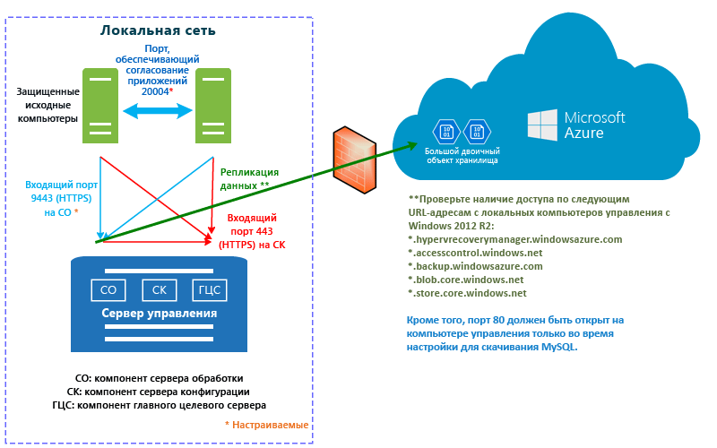

# Как работает служба Azure Site Recovery?

Прочтите эту статью, чтобы ознакомиться с базовой архитектурой службы Azure Site Recovery и ее компонентами.

Служба Azure Site Recovery помогает реализовать стратегию BCDR. Она управляет процессами репликации локальных физических серверов и виртуальных машин в облако (Azure) или дополнительные центры обработки данных. При возникновении сбоев в исходном расположении происходит отработка отказа с выполнением перехода в дополнительное расположение. Это обеспечивает доступность приложений и рабочих нагрузок. При восстановлении нормального режима работы исходного расположения происходит переключение на него. Дополнительные сведения см. в статье [Что такое Site Recovery?](site-recovery-overview.md)

В этой статье описывается развертывание на [портале Azure](https://portal.azure.com). [Классический портал Azure](https://manage.windowsazure.com/) можно использовать для обслуживания имеющихся хранилищ Site Recovery, но не для их создания.

Комментарии можно добавить в конце этой статьи или на [форуме по службам восстановления Azure](https://social.msdn.microsoft.com/forums/azure/home?forum=hypervrecovmgr).

## Сценарии развертывания

Site Recovery можно развернуть для оркестрации репликации в нескольких сценариях.

- **Репликация виртуальных машин VMware.** Вы можете реплицировать локальные виртуальные машины VMware в Azure или дополнительный центр обработки данных.
- **Репликация физических серверов.** Вы можете реплицировать физические компьютеры (под управлением Windows или Linux) в Azure или дополнительный центр обработки данных. Процесс репликации физических компьютеров практически не отличается от процесса репликации виртуальных машин VMware.
- **Репликация виртуальных машин Hyper-V.** Виртуальные машины Hyper-V можно реплицировать в Azure или на дополнительный сайт VMM. Если необходимо выполнить репликацию этих виртуальных машин на дополнительный сайт, управление ими должно осуществляться в облаках System Center Virtual Machine Manager (VMM).
- **Перенос виртуальных машин.** В дополнение к репликации (репликация, отработка отказа и восстановление размещения) локальных виртуальных машин и физических серверов в Azure их также можно перенести на виртуальные машины Azure (репликация, отработка отказа, без восстановления размещения). Ниже приведены поддерживаемые типы миграции.
    - Перенос рабочих нагрузок, выполняющихся на локальных виртуальных машинах Hyper-V, виртуальных машинах VMware и физических серверах, для выполнения на виртуальных машинах Azure.
    - Перенос [виртуальных машин IaaS](site-recovery-migrate-azure-to-azure.md) Azure между регионами Azure. Сейчас в этом сценарии поддерживается только перенос, а это означает, что восстановление размещения не поддерживается.
    - Перенос [экземпляров AWS Windows](site-recovery-migrate-aws-to-azure.md) на виртуальные машины IaaS Azure. Сейчас в этом сценарии поддерживается только перенос, а это означает, что восстановление размещения не поддерживается.

С помощью Site Recovery можно реплицировать приложения, работающие на поддерживаемых виртуальных машинах и физических серверах. Полный перечень поддерживаемых приложений см. в статье [Какие рабочие нагрузки можно защитить с помощью службы Azure Site Recovery?](site-recovery-workload.md)

## Репликация виртуальных машин VMware или физических серверов в Azure

### Компоненты

**Компонент** | **Дополнительные сведения**
--- | ---
**Таблицы Azure** | В Azure требуется учетная запись Microsoft Azure, учетная запись хранения Azure и сеть Azure.   Учетные записи хранения и сети могут быть учетными записями Resource Manager или классическими.    Реплицированные данные хранятся в учетной записи хранения, а виртуальные машины Azure создаются с использованием реплицированных данных при отработке отказа с локального сайта. При создании виртуальные машины Azure подключаются к виртуальной сети Azure.
**Сервер конфигурации** | Сервер конфигурации настраивается локально для координации обмена данными между локальным сайтом и Azure, а также для управления репликацией данных.
**Сервер обработки** | По умолчанию устанавливается на локальном сервере конфигурации.   Выступает в качестве шлюза репликации. Сервер обработки получает данные репликации с защищенных исходных компьютеров, оптимизирует их путем кэширования, сжатия и шифрования и отправляет эти данные в службу хранилища Azure.   Обеспечивает принудительную установку службы Mobility Service на защищенные компьютеры и автоматически обнаруживает виртуальные машины VMware.   По мере увеличения масштаба развертывания вы можете добавлять дополнительные выделенные серверы для обработки растущего объема данных репликации.
**Главный целевой сервер** | По умолчанию устанавливается на локальном сервере конфигурации.   Обрабатывает данные репликации при восстановлении размещения с переносом из Azure. Если объемы трафика восстановления размещения высоки, можно развернуть отдельный главный целевой сервер.
**Серверы VMware** | Серверы vCenter и vSphere добавляются в хранилище служб восстановления для репликации виртуальных машин VMware.   Если реплицировать физические серверы, для восстановления размещения потребуется локальная инфраструктура VMware. Восстанавливать размещение на физический сервер невозможно.
**Реплицируемые компьютеры** | Служба Mobility Service должна быть установлена на каждом компьютере, который нужно реплицировать. Ее можно установить вручную или с помощью принудительной установки с сервера обработки.

**Рис. 1. Компоненты VMware, реплицируемые в Azure**

### Процесс репликации

1. Необходимо настроить развертывание, включая компоненты Azure, и хранилище служб восстановления. В хранилище необходимо указать источник и целевой объект репликации, настроить сервер конфигурации, добавить серверы VMware, создать политику репликации, развернуть службу Mobility Service, включить репликацию и запустить тестовую отработку отказа.
2.  Компьютеры начинают репликацию в соответствии с политикой репликации, а репликация первоначальной копии данных выполняется в службу хранилища Azure.
4. Репликация разностных изменений в Azure начинается после завершения начальной репликации. Отслеживаемые изменения для компьютера хранятся в HRL-файле.
    - Реплицируемые компьютеры обмениваются данными с сервером конфигурации через порт HTTPS 443 для входящих подключений для управления репликацией.
    - Реплицируемые компьютеры отправляют данные репликации на сервер обработки через порт HTTPS 9443 для входящих подключений (можно настроить).
    - Сервер конфигурации выполняет оркестрацию управления репликацией с Azure через порт HTTPS 443 для исходящих подключений.
    - Сервер обработки получает данные с исходных компьютеров, оптимизирует и зашифровывает их, а затем отправляет их в службу хранилища Azure через порт 443 для исходящих подключений.
    - Если включить согласованность между виртуальными машинами, компьютеры в группе репликации будут обмениваться данными друг с другом через порт 20004. Эту функция используется, если вы объединяете несколько компьютеров в группы репликации, и они совместно используют отказоустойчивые и согласованные точки восстановления после отработки отказа. Это полезно, если на компьютерах выполняется одна и та же рабочая нагрузка и они должны быть согласованы.
5. Трафик реплицируется в общедоступные конечные точки службы хранилища Azure через Интернет. Кроме того, можно использовать [общедоступный пиринг](https://docs.microsoft.com/en-us/azure/expressroute/expressroute-circuit-peerings#public-peering) Azure ExpressRoute. Репликация трафика через VPN типа "сеть — сеть" с локального сайта в Azure не поддерживается.

**Рис. 2. Репликация VMware в Azure**

### Процесс отработки отказа и восстановления размещения

1. Внеплановые отработки отказа выполняются с локальных виртуальных машин VMware и физических серверов в Azure. Плановая отработка отказа не поддерживается.
2. Вы можете выполнить отработку отказа одного компьютера или создать [планы восстановления](site-recovery-create-recovery-plans.md) для координации отработки отказа нескольких компьютеров.
3. При отработке отказа в Azure создаются виртуальные машины реплик. Фиксация отработки отказа выполняется для получения доступа к рабочей нагрузке из виртуальной машины реплики Azure.
4. Когда основной локальный сайт снова станет доступным, вы сможете выполнить восстановление размещения. Вы настраиваете инфраструктуру восстановления размещения, запускаете репликацию компьютера с дополнительного сайта на основной и выполняете внеплановую отработку отказа с дополнительного сайта. После того, как это восстановление размещения будет зафиксировано, данные переместятся обратно в локальное расположение, и вам понадобится включить репликацию в Azure снова. [Дополнительные сведения](site-recovery-failback-azure-to-vmware.md)

Есть ряд требований к восстановлению размещения.

- **Восстановление размещения из физического сервера на физический компьютер не поддерживается.** Это означает, что после отработки отказа физического сервера в Azure восстановить размещение можно только на виртуальную машину VMware. Восстанавливать размещение на физический сервер нельзя. Для восстановления размещения потребуется виртуальная машина Azure. Если сервер конфигурации не развернут в качестве виртуальной машины VMware, необходимо настроить в качестве такой машины отдельный главный целевой сервер. Это связано с тем, что для восстановления дисков на виртуальную машину VMware главный целевой сервер подключается к хранилищу VMware и взаимодействует с ним.
- **Временный сервер обработки в Azure.** Если вы хотите восстановить размещение из Azure после отработки отказа, необходимо настроить виртуальную машину Azure в качестве сервера обработки, который будет обрабатывать репликацию из Azure. После восстановления размещения эту виртуальную машину можно удалить.
- **VPN-подключение.** Для восстановления размещения вам потребуется настроить VPN-подключение (или Azure ExpressRoute) между сетью Azure и локальным сайтом.
- **Отдельный локальный главный целевой сервер.** Локальный главный целевой сервер обрабатывает восстановление размещения. Главный целевой сервер устанавливается по умолчанию на сервер управления, но если восстанавливается размещение больших объемов трафика, настройте для этой цели отдельный локальный главный целевой сервер.
- **Политика восстановления размещения.** Для репликации обратно на локальный сайт необходима политика восстановления размещения. Она создается автоматически во время создания политики репликации.

**Рис. 3. Восстановление размещения виртуальных машин или физических компьютеров VMware**

## Репликация виртуальных машин или физических серверов VMware на дополнительный сайт

### Компоненты

**Компонент** | **Дополнительные сведения**
--- | ---
**Таблицы Azure** | Разверните этот сценарий с помощью InMage Scout. Для ее использования необходима подписка Azure.   Создайте хранилище служб восстановления, затем скачайте InMage Scout и установите последние обновления, чтобы настроить развертывание.
**Сервер обработки** | Разверните компонент сервера обработки на основном сайте для кэширования, сжатия и оптимизации данных.   Кроме того, он обеспечивает принудительную установку единого агента на компьютеры, которые необходимо защитить.
**VMware ESX/ESXi и сервер vCenter** |  Для репликации виртуальных машин VMware требуется инфраструктура VMware.
**Виртуальные машины или физические серверы** |  На виртуальных машинах VMware или физических серверах Windows и Linux, которые требуется реплицировать, необходимо установить единый агент.   Агент обеспечивает обмен данными между всеми компонентами.
**Сервер конфигурации** | Этот компонент устанавливается на дополнительный сайт и отвечает за управление, настройку и мониторинг развертывания с помощью веб-сайта управления или консоли vContinuum.
**Сервер vContinuum** | Устанавливается в том же расположении, что и сервер конфигурации.   Он предоставляет консоль для мониторинга защищенной среды и управления ею.
**Главный целевой сервер (дополнительный сайт)** | На главном целевом сервере хранятся реплицированные данные. Он получает данные с сервера обработки, создает реплицированный компьютер на дополнительном сайте и хранит точки хранения данных.   Необходимое количество главных целевых серверов зависит от количества защищаемых компьютеров.   Если нужно переключиться на основной сайт, вам также понадобится главный целевой сервер. Единый агент устанавливается на этом сервере.

### Процесс репликации

1. Настройте серверы компонентов для каждого сайта (сервер конфигурации, сервер обработки, главный целевой сервер) и установите унифицированный агент на компьютеры, которые требуется реплицировать.
2. После начальной репликации агент на каждом компьютере отправляет сведения об изменениях дельта-репликации на сервер обработки.
3. Сервер обработки оптимизирует эти данные и передает их на главный целевой сервер на дополнительном сайте. Сервер конфигурации управляет процессом репликации.

**Рис. 4. Репликация VMware в VMware**

## Репликация виртуальных машин Hyper-V в Azure

### Компоненты

**Компонент** | **Дополнительные сведения**
--- | ---

**Azure** | В Azure требуется учетная запись Microsoft Azure, учетная запись хранения Azure и сеть Azure.   Учетные записи хранения и сети могут быть учетными записями Resource Manager или классическими.   Реплицированные данные хранятся в учетной записи хранения, а виртуальные машины Azure создаются с использованием реплицированных данных при отработке отказа с локального сайта.   При создании виртуальные машины Azure подключаются к виртуальной сети Azure.
**Сервер VMM** | Если узлы Hyper-V расположены в облаках VMM, необходимо настроить логические сети и сети виртуальных машин для настройки сетевого сопоставления. Сеть виртуальных машин должна быть связана с логической сетью, которая сопоставлена с облаком.
**Узел Hyper-V** | Требуется один или несколько серверов узлов Hyper-V.
**Виртуальные машины Hyper-V** | На сервере узла Hyper-V должна быть установлена как минимум одна виртуальная машина. Поставщик на узле Hyper-V координирует репликацию с помощью службы Site Recovery и управляет ею через Интернет. Агент обрабатывает данные репликации через защищенный канал (HTTPS, порт 443). Обмен данными между поставщиком и агентом осуществляется по защищенным и зашифрованным каналам. Реплицированные данные в службе хранилища Azure также шифруются.

## Процесс репликации

1. Вы настраиваете компоненты Azure. Перед развертыванием Site Recovery мы рекомендуем настроить учетные записи хранения и сети.
2. Необходимо создать хранилище служб репликации для Site Recovery и настроить параметры хранилища. В частности, необходимо сделать следующее.
    - Если вы не управляете узлами Hyper-V в облаке VMM, необходимо создать контейнер сайта Hyper-V и добавить к нему узлы Hyper-V.
    - Настроить источник и целевой объект репликации. Если управление узлами Hyper-V осуществляется в VMM, источником является облако VMM. В противном случае источником является узел Hyper-V.
    - Установка поставщика Azure Site Recovery и агента служб восстановления Microsoft Azure. При наличии VMM поставщик будет установлен в нем, а агент — на каждом узле Hyper-V. При отсутствии VMM поставщик и агент будут установлены на каждом узле.
    - Создайте политику репликации для сайта Hyper-V или облака VMM. Политика применяется ко всем виртуальным машинам, расположенным на узлах на сайте или в облаке.
    - Включите репликацию для виртуальных машин Hyper-V. Начальная репликация выполняется в соответствии с параметрами политики репликации.
4. Отслеживаются изменения данных. Репликация разностных изменений в Azure начинается после завершения начальной репликации. Отслеживаемые изменения для элемента хранятся в HRL-файле.
5. Запустите тестовую отработку отказа, чтобы убедиться в надлежащей работе всех компонентов.

### Процесс отработки отказа и восстановления размещения

1. Вы можете запустить плановую или внеплановую [отработку отказа](site-recovery-failover.md) с локальных виртуальных машин Hyper-V в Azure. Чтобы не допустить потери данных при выполнении плановой отработки отказа, выключите исходные виртуальные машины.
2. Вы можете выполнить отработку отказа одного компьютера или создать [планы восстановления](site-recovery-create-recovery-plans.md) для координации отработки отказа нескольких компьютеров.
4. После запуска отработки отказа в Azure должны отобразиться созданные виртуальные машины реплик. При необходимости виртуальной машине можно назначить общедоступный IP-адрес.
5. Затем необходимо зафиксировать отработку отказа для получения доступа к рабочей нагрузке из виртуальной машины реплики Azure.
6. Когда основной локальный сайт снова станет доступным, вы сможете выполнить восстановление размещения. Запустите плановую отработку отказа из Azure на основной сайт. Для плановой отработки отказа можно выбрать восстановление размещения на ту же самую виртуальную машину или в другое расположение и синхронизировать изменения между Azure и локальным расположением, чтобы предотвратить потерю данных. Если виртуальные машины создаются локально, необходимо зафиксировать отработку отказа.

**Рис. 5. Репликация с сайта Hyper-V в Azure**

**Рис. 6. Репликация Hyper-V из облаков VMM в Azure**

## Репликация виртуальных машин Hyper-V на дополнительный сайт

### Компоненты

**Компонент** | **Дополнительные сведения**
--- | ---
**Учетная запись Azure** | Вам потребуется учетная запись Microsoft Azure.
**Сервер VMM** | Мы рекомендуем подключенный к Интернету сервер VMM на основном и дополнительном сайтах.   На каждом сервере должно быть по крайней мере одно частное облако VMM с настроенным профилем возможностей Hyper-V.   Установите поставщик Azure Site Recovery на сервере VMM. Поставщик координирует процессы репликации и управляет ими через Интернет с помощью службы Site Recovery. Обмен данными между поставщиком и Azure осуществляется по защищенным и зашифрованным каналам.
**Сервер Hyper-V** |  Понадобится один или несколько серверов узлов Hyper-V в основном и дополнительном облаках VMM. Серверы должны быть подключены к Интернету.   Данные реплицируются между основным и дополнительным серверами узлов Hyper-V через локальную сеть или VPN-подключение с использованием проверки подлинности Kerberos или на основе сертификатов.  
**Исходные компьютеры** | На исходном сервере узла Hyper-V должна быть установлена как минимум одна виртуальная машина, которую необходимо реплицировать.

## Процесс репликации

1. Необходимо настроить учетную запись Azure.
2. Необходимо создать хранилище служб репликации для Site Recovery и настроить параметры хранилища. В частности, необходимо сделать следующее.

    - Настроить источник и целевой объект репликации (основной и дополнительный сайты).
    - Установка поставщика Azure Site Recovery и агента служб восстановления Microsoft Azure. Поставщик устанавливается на серверах VMM, а агент — на каждом узле Hyper-V.
    - Создайте политику репликации для исходного облака VMM. Политика применяется ко всем виртуальным машинам, расположенным на узлах в облаке.
    - Включите репликацию для виртуальных машин Hyper-V. Начальная репликация выполняется в соответствии с параметрами политики репликации.
4. Отслеживаются изменения данных. Репликация разностных изменений в Azure начинается после завершения начальной репликации. Отслеживаемые изменения для элемента хранятся в HRL-файле.
5. Запустите тестовую отработку отказа, чтобы убедиться в надлежащей работе всех компонентов.

**Рис. 7. Репликация VMM в VMM**

### Процесс отработки отказа и восстановления размещения

1. Вы можете запустить плановую или внеплановую [отработку отказа](site-recovery-failover.md) между локальными сайтами. Чтобы не допустить потери данных при выполнении плановой отработки отказа, выключите исходные виртуальные машины.
2. Вы можете выполнить отработку отказа одного компьютера или создать [планы восстановления](site-recovery-create-recovery-plans.md) для координации отработки отказа нескольких компьютеров.
4. Если вы выполнили внеплановую отработку отказа с переносом на дополнительный сайт, то после этого компьютеры в дополнительном расположении не будут защищены и для них не будет выполняться репликация. Если вы выполнили плановую отработку отказа, то после этого компьютеры в дополнительном расположении будут защищены.
5. Затем необходимо зафиксировать отработку отказа для получения доступа к рабочей нагрузке из виртуальной машины реплики.
6. Когда основной сайт снова станет доступным, необходимо запустить обратную репликацию, чтобы она выполнялась с дополнительного сайта на основной. При обратной репликации виртуальные машины будут переведены в защищенное состояние, но при этом активным расположением по-прежнему останется дополнительный центр обработки данных.
7. Чтобы сделать активным расположением основной сайт, необходимо запустить плановую отработку отказа с переносом из дополнительного расположения в основное, а затем выполнить еще одну обратную репликацию.

### Рабочий процесс репликации Hyper-V

**Этап рабочего процесса** | **Действие**
--- | ---
1. **Включение защиты** | После включения защиты для виртуальной машины Hyper-V запускается задание **Включить защиту**, чтобы проверить, выполнены ли на компьютере предварительные требования. Задание вызывает два метода:   [CreateReplicationRelationship](https://msdn.microsoft.com/library/hh850036.aspx) для настройки репликации с помощью настроенных параметров;   [StartReplication](https://msdn.microsoft.com/library/hh850303.aspx) для инициализации полной репликации виртуальной машины.
2) **Начальная репликация** |  Создается моментальный снимок виртуальной машины, и виртуальные жесткие диски реплицируются по одному, пока все они не будут скопированы в дополнительное расположение.   Время выполнения этой процедуры зависит от размера виртуальной машины, пропускной способности сети, а также способа начальной репликации.   Если при выполнении начальной репликации данные на диске будут изменены, модуль отслеживания репликации реплики Hyper-V зарегистрирует эти изменения в журналах репликации Hyper-V (HRL-файлы), которые находятся в одной папке с дисками.   С каждым диском связан HRL-файл, который отправляется в дополнительное хранилище.   При начальной репликации файлы моментальных снимков и журналов потребляют ресурсы диска. После завершения начальной репликации моментальный снимок виртуальной машины удаляется, а сохраненные в журнале изменения, произошедшие во время репликации, синхронизируются и объединяются.
3. **Завершение подготовки защиты** | После завершения начальной репликации задание **Завершить подготовку защиты** настраивает сеть и другие параметры для защиты виртуальной машины.   При репликации в Azure может потребоваться настроить параметры виртуальной машины для обеспечения готовности к отработке отказа.   На этом этапе можно выполнить тестовую отработку отказа, чтобы убедиться, что все работает правильно.
4. **Репликация** | После начальной репликации начинается синхронизация изменений в соответствии с параметрами репликации.   **Сбой репликации.** Если происходит сбой дельта-репликации и для полной репликации необходима высокая пропускная способность или требуется много времени, выполняется повторная синхронизация. Например, когда HRL-файлы заполняют до 50 % объема диска, виртуальная машина отмечается для повторной синхронизации. Повторная синхронизация минимизирует объем передаваемых данных. Для этого вычисляются контрольные суммы исходной и целевой виртуальной машины, а затем отправляется только полученная разница. После завершения повторной синхронизации возобновляется дельта-репликация. По умолчанию повторная синхронизация автоматически выполняется в нерабочее время. Повторную синхронизацию виртуальной машины можно выполнить вручную.   **Ошибка репликации.** Если возникает ошибка репликации, используется встроенный механизм повторных попыток. Если произошла неустранимая ошибка, например ошибка проверки подлинности или авторизации, или реплицируемый компьютер находится в недопустимом состоянии, повторная попытка не выполняется. Если произошла устранимая ошибка, например ошибка в сети, нехватка свободного места на диске или объема памяти, происходит повторная попытка. После каждой повторной попытки интервал между повторными попытками увеличивается (через 1, 2, 4 минуты, 8, 10 минут и затем через 30 минут).
5. **Плановая и внеплановая отработка отказа** | Плановые и внеплановые отработки отказа выполняются по мере необходимости.   Чтобы не допустить потери данных при выполнении плановой отработки отказа, выключите исходные виртуальные машины.   Реплицированные виртуальные машины переходят в состояние ожидания фиксации. Их необходимо зафиксировать, чтобы завершить отработку отказа.   После запуска основного сайта на него можно выполнить восстановление размещения, если он доступен.

**Рис. 8. Рабочий процесс Hyper-V**

## Дальнейшие действия

[Проверьте, соблюдены ли предварительные требования](site-recovery-prereq.md)

