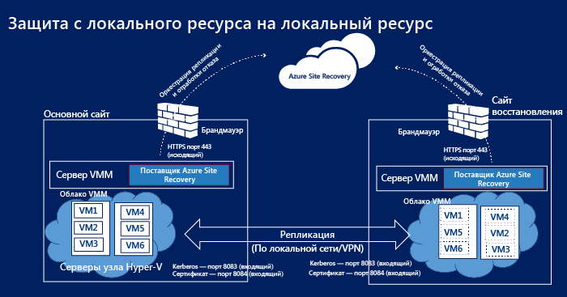
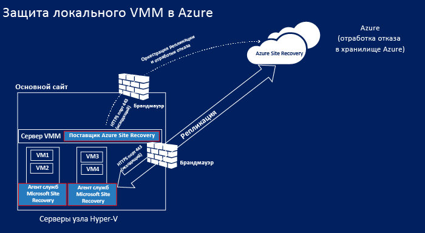
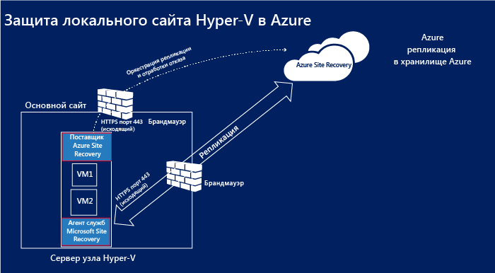
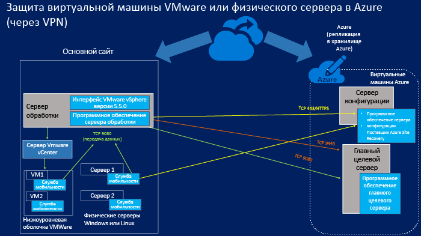
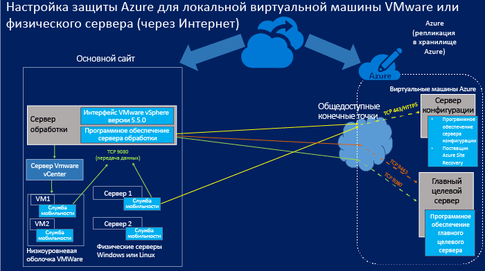

<properties
	pageTitle="Компоненты Site Recovery"
	description="В этой статье описаны общие компоненты Site Recovery и управление ими"
	services="site-recovery"
	documentationCenter=""
	authors="rayne-wiselman"
	manager="jwhit"
	editor=""/>

<tags
	ms.service="site-recovery"
	ms.workload="backup-recovery"
	ms.tgt_pltfrm="na"
	ms.devlang="na"
	ms.topic="get-started-article"
	ms.date="08/10/2015"
	ms.author="raynew"/>

# Компоненты Site Recovery

Служба Azure Site Recovery помогает реализовать стратегии непрерывности бизнеса и восстановления после сбоев (BCDR), управляя процессами репликации, отработки отказа и восстановления виртуальных машин и физических серверов. Виртуальные машины можно реплицировать в Azure или во вторичный локальный центр обработки данных. [Ознакомьтесь с обзором](site-recovery-overview.md).

В этой статье перечислены и описаны компоненты Site Recovery, которые устанавливаются на серверы и виртуальные машины.

На [форуме служб Azure Recovery](https://social.msdn.microsoft.com/forums/azure/home?forum=hypervrecovmgr) можно задать любые вопросы.

## Обзор

Используемые компоненты Site Recovery будут немного различаться в зависимости от сценария защиты.

### Настройка защиты между двумя центрами обработки данных с VMM

**Сценарий** | **Описание** | **Необходимые компоненты** | **Дополнительные сведения**
--- | --- | --- | ---
Azure Site Recovery развертывается для репликации виртуальных машин между двумя датацентрами | 
В каждом датацентре есть сервер VMM

У каждого сервера VMM есть частное облако, содержащее один или несколько серверов Hyper-V с виртуальными машинами, которые необходимо защитить
 | На оба сервера VMM устанавливаются поставщики Azure Site Recovery. | 
На серверы Hyper-V и на защищаемые виртуальные машины не устанавливается никаких компонентов

Для организации защиты поставщик Azure Site Recovery на сервере VMM взаимодействует со службой Site Recovery через порт HTTPS 443

Репликация выполняется между первичным и вторичным серверами Hyper-V через Интернет с использованием Kerberos и проверкой подлинности сертификатов на портах 8083 и 8084.

### Настройка защиты между датацентром с VMM и Azure

**Сценарий** | **Описание** | **Необходимые компоненты** | **Дополнительные сведения**
--- | --- | --- | ---
Azure Site Recovery развертывается для репликации виртуальных машин между датацентром и Azure | 
На локальном датацентре находится сервер VMM с частным облаком, которое содержит один или несколько серверов Hyper-V с виртуальными машинами, которые необходимо защитить
 | 
Поставщик Azure Site Recovery устанавливается на сервере VMM

Агент служб восстановления Microsoft устанавливается на серверах Hyper-V источника
 | 
На защищаемые виртуальные машины не устанавливается никаких компонентов

Для организации защиты поставщик Azure Site Recovery на сервере VMM взаимодействует со службой Site Recovery через порт HTTPS 443

Репликация выполняется между агентом служб восстановления Microsoft, запущенным на серверах Hyper-V источника, и Azure через порт HTTPS 443.

###  Настройка защиты между сайтом Hyper-V и Azure

**Сценарий** | **Описание** | **Необходимые компоненты** | **Дополнительные сведения**
--- | --- | --- | ---
Azure Site Recovery развертывается для репликации виртуальных машин между датацентром и Azure | 
На локальном датацентре находятся один или несколько серверов Hyper-V с виртуальными машинами, которые необходимо защитить

Во время настройки защиты задается сайт Hyper-V, который содержит один или несколько из этих серверов Hyper-V
 | 
Установка поставщика Azure Site Recovery и агента служб восстановления Microsoft на серверы Hyper-V выполняется путем установки одного компонента
 | 
Не разворачивается никаких серверов VMM

На защищаемые виртуальные машины не устанавливается никаких компонентов

Для организации защиты поставщик Azure Site Recovery на сервере Hyper-V взаимодействует со службой Site Recovery через порт HTTPS 443

Репликация выполняется между агентом служб восстановления Microsoft, запущенным на сервере Hyper-V, и Azure через порт HTTPS 443.

### Настройка защиты между локальным физическим сервером или виртуальной машиной VMware и Azure

В этом сценарии репликация может выполняться двумя способами.

- Через VPN-подключение (с использованием Azure ExpressRoute или VPN типа «сеть — сеть»)
- Через защищенное подключение к Интернету

#### Через VPN-подключение типа «сеть — сеть» (или ExpressRoute)

Соединения от локальных серверов направляются на внутренние порты виртуальной сети Azure, к которой подключены конфигурационные и целевые виртуальные машины.

#### Через Интернет

Все соединения от локальных серверов направляются на выделенные общедоступные конечные точки облачного сервиса Azure для настройки серверной виртуальной машины и главной целевой серверной виртуальной машины. Конечные точки создаются динамически при развертывании виртуальных машин.

#### порты;

**Компонент** | **Порт** | **Дополнительные сведения**
--- | --- | --- | ---
**Сервер обработки** |9080 | Защищаемые виртуальные машины отправляют данные для репликации на сервер обработки через порт TCP 9080.
**Сервер конфигурации** | HTTPS/443 | Служба Mobility Service, запущенная на защищаемых виртуальных машинах, отправляет метаданные репликации на сервер конфигурации на порт 443.
 | HTTPS/443 | Сервер конфигурации координирует защиту виртуальных машин и управляет ей. Сервер обработки взаимодействует с сервером конфигурации через порт 443 или выделенную общедоступную конечную точку для получения управляющей информации.
 | 9443 | При обработке отказа утилита vContinuum запрашивает управляющую информацию и метаданные от сервера конфигурации через порт 9443 (на схеме не показан)
 | 5986 | При удаленном управлении с помощью PowerShell используется порт 5986 (на схеме не показан)
 | 3389 | RDP-подключение к серверу конфигурации через порт 3389 (на схеме не показан)
**Главный целевой сервер** | 80 | Узел процесса отправляет данные о трафике репликации на главный целевой сервер через порт 9080
 | HTTP/443 | Сервер обработки реплицирует данные на главный целевой сервер по протоколу HTTP или через порт 443 (VPN)
 | HTTP/443 | Сервер обработки реплицирует данные на главный целевой сервер по протоколу HTTP или через порт 443 (VPN)
**Правила файрволла** | | 
Для корректной работы службы Mobility Service в правилах брандмауэра на защищаемых виртуальных машинах должны быть включены общий доступ к файлам и принтерам и инструментарий управления Windows.

Правила файрволла на защищаемых виртуальных машинах должны разрешать им доступ к серверу конфигурации.

Для подключения к виртуальным машинам Azure через Интернет после отказа в правилах брандмауэра на компьютерах должны быть разрешены подключения с удаленного рабочего стола через Интернет. Для подключения к компьютеру Linux, на котором произошел сбой, в Azure должен быть настроен автоматический запуск службы Secure Shell и правила файрволла должны разрешать подключения по ssh.

## Компоненты Site Recovery

**Компонент** | **Дополнительные сведения** | **Установка** | **Сценарий развертывания**
--- | --- | --- | ---
**Поставщик Azure Site Recovery для VMM** | Обеспечивает взаимодействие между сервером VMM и службой Site Recovery. | Устанавливается на сервер VMM. | Используется при настройке защиты между двумя сетями VMM или сетью VMM и Azure.
**Поставщик Azure Site Recovery для Hyper-V** | Обеспечивает взаимодействие между узлом Hyper-V и службой Site Recovery, если VMM не развернут. | Устанавливается на сервер узла Hyper-V. | Используется при настройке защиты между сетью Hyper-V и Azure.
**Агент служб восстановления Microsoft** | Обеспечивает взаимодействие между сервером узла Hyper-V и службой Site Recovery. | Устанавливается на сервер узла Hyper-V. | 
Используется при настройке защиты между сетью Hyper-V и Azure.

Загружается один поставщик, который включает как поставщика Azure Site Recovery для Hyper-V, так и агента служб восстановления Microsoft.

**Сервер обработки/резервный сервер обработки** | 
Оптимизирует данные защищаемых виртуальных машин VMware или физических серверов Windows/Linux перед их отправкой на главный целевой сервер Azure

Выполняет принудительную установку службы Mobility Service на виртуальные машины VMware или физические серверы

Выполняет автоматическое обнаружение виртуальных машин VMware.
 
Резервный сервер обработки: к резервному серверу обработки применяется только первый пункт об оптимизации данных перед репликацией
 | 
Устанавливается на локальный сервер, на котором должна быть установлена по крайней мере Windows Server 2012 R2

Резервный сервер обработки: запускается в виртуальной машине Azure стандартного размера A4
 | 
Используется при настройке защиты между локальным физическим сервером или виртуальными машинами VMware и Azure.

Резервный сервер обработки: используется для переключения с Azure на локальный сервер

**Служба Mobility Service** | Собирает информацию об изменениях на защищаемых компьютерах и передает их на локальный сервер обработки для репликации в Azure. | Устанавливается на локальные виртуальные машины VMware или физические серверы, которые необходимо защитить.| Используется при настройке защиты между локальным физическим сервером или виртуальными машинами VMware и Azure.
**Главный целевой сервер/резервный главный целевой сервер** | 
На нем хранятся данные репликации с защищаемых компьютеров. Данные размещаются на подключенных виртуальных жестких дисках, созданных в хранилище больших двоичных объектов в учетной записи хранения Azure.

Резервный главный целевой сервер: на нем хранятся данные репликации виртуальных машин в Azure, находящихся в состоянии отказа. Данные размещаются в файлах формата VMDK, созданных в хранилище данных, которое было выбрано при включении обратной репликации для обработки отказа.
 | 
Устанавливается как виртуальная машина Azure сервера Windows на основе образа Windows Server 2012 R2 из коллекции образов (для защиты компьютеров Windows) или сервера Linux на основе образа OpenLogic CentOS 6.6 из коллекции образов (для защиты компьютеров Linux)

Доступны два варианта размера — стандартный A3 и стандартный D14

Резервный главный целевой сервер: запускается в виртуальной машине VMware. Разворачивается на том же узле, к которому будет осуществляться обращение в случае отказа.
| 
Используется при настройке защиты между локальным физическим сервером или виртуальными машинами VMware и Azure.

Резервный главный целевой сервер: используется для переключения с Azure на локальный сервер в случае отказа.

**Сервер конфигурации** | 
Координирует взаимодействие между защищаемыми компьютерами, сервером обработки и главными целевыми серверами в Azure.

Настраивает репликацию и координирует восстановление в Azure в случае отказа.
 | Устанавливается в виртуальной машине Azure A3 в той же подписке Azure, в которой находится Site Recovery. | Используется при настройке защиты между локальным физическим сервером или виртуальными машинами VMware и Azure.

## Планирование развертывания компонента

### Поставщик Azure Site Recovery

Поставщик запускается на серверах VMM, серверах узла Hyper-V при отсутствии сервера VMM в вашей конфигурации или на сервере конфигурации. Они подключаются к службе Site Recovery через Интернет с помощью зашифрованного HTTPS-подключения. Обратите внимание на следующее.

- Добавлять исключение файрволла для подключения поставщика к службе Site Recovery не нужно.
- Если сервер, на котором запускается поставщик, должен подключаться к Интернету через прокси-сервер, можно использовать существующие параметры прокси-сервера или задать собственные.
- Прокси-сервер должен пропускать следующие адреса через файрволл.

	-  *.accesscontrol.windows.net
	-  .backup.windowsazure.com
	-  *.blob.core.windows.net
	-  *.store.core.windows.net

- При наличии правил брандмауэра для IP-адресов убедитесь, что они разрешают установку соединений от сервера конфигурации к IP-адресам, описанным в статье [Диапазоны IP-адресов центров обработки данных Azure](https://www.microsoft.com/download/details.aspx?id=41653), а также для протокола HTTPS (443). Необходимо добавить в белый список диапазоны адресов того региона Azure, который вы планируете использовать, и IP-адреса Azure Запада США.
- Если вы развертываете Site Recovery с VMM и используете настраиваемый прокси-сервер, автоматически создается учетная запись запуска от имени VMM (DRAProxyAccount). В ней используются учетные данные прокси-сервера, которые вы указали в параметрах настраиваемого прокси-сервера на портале Site Recovery. Вам потребуется настроить прокси-сервер так, чтобы эта учетная запись могла успешно проходить проверку подлинности.
- При использовании прокси-сервера трафик от поставщика, установленного на сервере узла Hyper-V, до прокси-сервера должен направляться по протоколу HTTP.

### Агент служб восстановления Microsoft

Агент подключается к службе Site Recovery через Интернет с помощью зашифрованного HTTPS-подключения. Указание специальных исключений файрволла не требуется.

### Компоненты для защиты VMware или физического сервера

#### Главный целевой сервер

- Виртуальная машина главного целевого сервера может иметь один из стандартных типов Azure A4 или D14.
- На главный целевой сервер типа A4 можно добавить до 16 дисков данных для каждой виртуальной машины (размер каждого диска до 1023 Гб).
- На главный целевой сервер типа D14 можно добавить до 32 дисков данных для каждой виртуальной машины (размер каждого диска до 1023 Гб).
- Главный целевой сервер типа D14 необходим только для защиты сервера, к которому подключено более 15 дисков; для всех остальных конфигураций можно развернуть сервер типа A4.
- Учтите, что один диск, присоединенный к главному целевому серверу, зарезервирован в качестве диска хранения. Azure Site Recovery позволяет задать период хранения и выполнять восстановление защищаемых компьютеров до точки восстановления в пределах этого периода. Диск хранения обеспечивает ведение журнала изменений диска на протяжении периодов хранения. Это уменьшает максимальное дисков, доступных для репликации до 15 для типа A4 и до 31 для типа D14.

#### Сервер обработки

- Сервер обработки использует дисковый кэш. Убедитесь в наличии достаточного для кэша места на диске C:/. Размер кэша определяется скоростью изменения данных на защищаемых компьютерах. Как правило, рекомендуется, чтобы размер каталога кэша составлял 600 Гб для средних развертываний.
- Развертывание дополнительного сервера обработки требуется, если скорость изменения данных защищенных компьютеров превышает емкость существующего сервера обработки.
- Масштабирование развертывания осуществляется путем добавления нескольких серверов обработки и главных целевых серверов. Развертывание второго главного целевого сервера требуется, если на существующем главном целевом сервере недостаточно свободных дисков.
-  Учтите, что серверы обработки и главные целевые серверы не требуют сопоставления «один к одному». Вы можете выполнить развертывание первого сервера обработки со вторым главным целевым сервером и т. д.

#### Сервер конфигурации

- Сервер конфигурации представляет собой виртуальную машину типа A3 на основе образа Windows Server 2012 R2 из коллекции образов Azure Site Recovery. Эта виртуальная машина будет создана в вашей подписке для сервера конфигурации. Она создается как первый экземпляр в новой облачной службе с зарезервированным общедоступным IP-адресом.
- Путь установки (должен включать только символы латинского алфавита).

#### Служба Mobility Service

Устанавливается на виртуальных машинах VMware или физических серверах. Компьютеры и серверы должны соответствовать следующим требованиям.

- **Серверы Windows**:
	-  64-битная ОС: Windows Server 2012 R2, Windows Server 2012 или Windows Server 2008 R2 с пакетом обновлений SP1 (как минимум).
	-  Имена узлов, точек подключения, устройств и системного каталога Windows (например, C:\\Windows) должны состоять только из букв латинского алфавита.
	-  Операционная система устанавливается на диск C:\\.
	-  Поддерживаются только базовые диски. Динамические диски не поддерживаются.

- **Серверы Linux**:
	- поддерживаемая 64-битная операционная система: Centos 6.4, 6.5, 6.6; Oracle Enterprise Linux 6.4, 6.5 с ядром, совместимым с Red Hat, или с ядром Unbreakable Enterprise Kernel Release 3 (UEK3), SUSE Linux Enterprise Server 11 SP3.
	- Файлы /etc/hosts на защищаемых компьютерах должны содержать записи, которые связывают имя локального узла с IP-адресами всех сетевых адаптеров.
	- Имена узлов, точек подключения, устройств и системные пути и имена файлов Linux (например, /etc/; /usr) должны состоять только из букв латинского алфавита.
	-  Поддерживаются следующие типы хранилищ: файловые системы: EXT3, ETX4, ReiserFS, XFS/многомаршрутное подключение устройств (multipath)/менеджер томов: LVM2. Физические серверы с хранилищем контроллера HP CCISS не поддерживаются.

Подробная информация о планировании этих компонентов приведена в разделе об объеме планирования [в этой статье](site-recovery-vmware-to-azure.md).

## Поддерживайте компоненты в обновленном состоянии

**Компонент** | **Процедура обновления**
--- | ---

**Поставщик Azure Site Recovery для VMM**

**Агент служб восстановления Azure**
 | 

**Первоначальная установка**: скачайте последнюю версию на странице быстрого запуска

**Последующие установки**: скачайте последнюю (или предыдущие) версии на панели мониторинга Site Recovery. Также, если были выбраны обновления Microsoft, на сервер будут автоматически установлены последние версии поставщика и агента.

**Сервер обработки**

**Сервер конфигурации**

**Главный целевой сервер**
 | Проверка наличия обновлений на панели мониторинга Site Recovery.
**Служба Mobility Service** | 
Убедитесь в наличии последних обновлений на каждом компьютере, который необходимо защитить.

Последние обновления можно скачать по ссылкам:

[Windows](http://download.microsoft.com/download/7/C/7/7C70CA53-2D8E-4FE0-BD85-8F7A7A8FA163/Microsoft-ASR_UA_8.3.0.0_Windows_GA_03Jul2015_release.exe)

[RHELP6 64](http://download.microsoft.com/download/B/4/5/B45D1C8A-C287-4339-B60A-70F2C7EB6CFE/Microsoft-ASR_UA_8.3.0.0_RHEL6-64_GA_03Jul2015_release.tar.gz)

[OL6 64](http://download.microsoft.com/download/9/4/8/948A2D75-FC47-4DED-B2D7-DA4E28B9E339/Microsoft-ASR_UA_8.3.0.0_OL6-64_GA_03Jul2015_release.tar.gz)

[SLES11-SP3-64](http://download.microsoft.com/download/6/A/2/6A22BFCD-E978-41C5-957E-DACEBD43B353/Microsoft-ASR_UA_8.3.0.0_SLES11-SP3-64_GA_03Jul2015_release.tar.gz)

. Альтернативный вариант: убедившись в том, что используется последняя версия сервера обработки, можно скачать последнюю версию службы Mobility Service из каталога C:\\pushinstallsvc\\repository на сервере обработки
  

## Дальнейшие действия

Начало настройки компонентов для вашего сценария развертывания. [Подробнее](site-recovery-overview.md).

<!----HONumber=Oct15_HO3-->