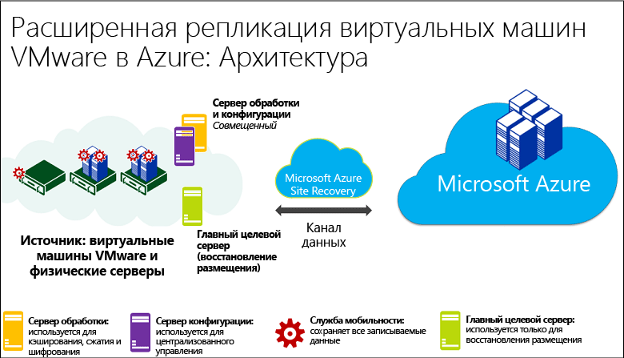
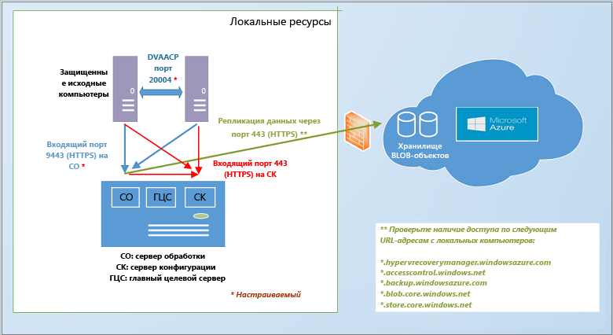
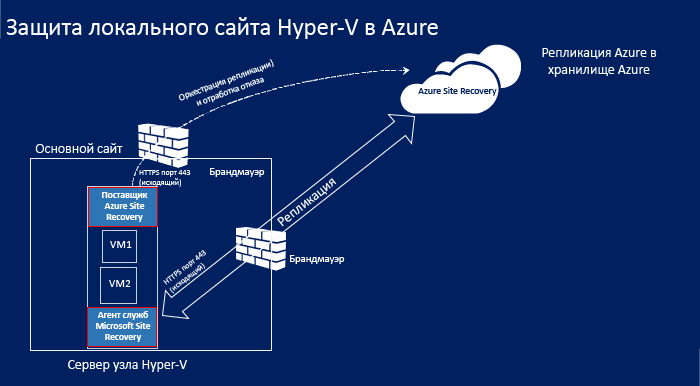
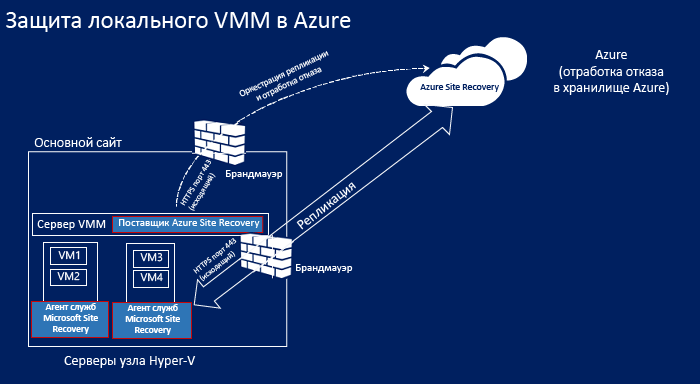
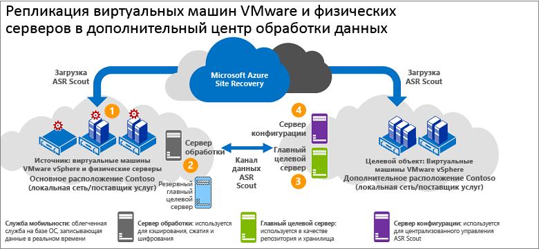
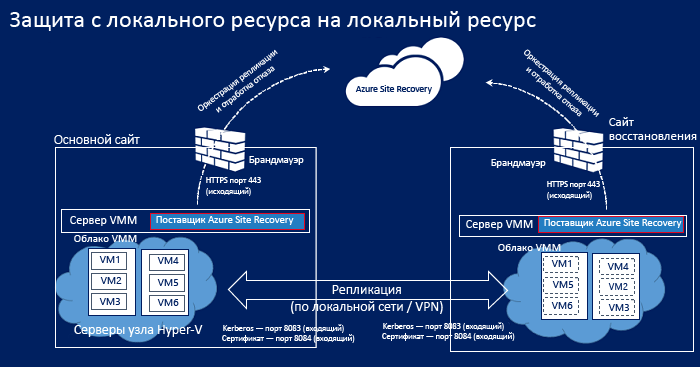
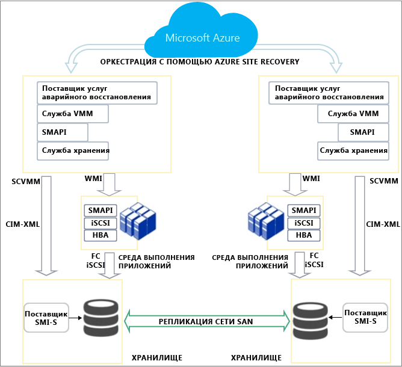
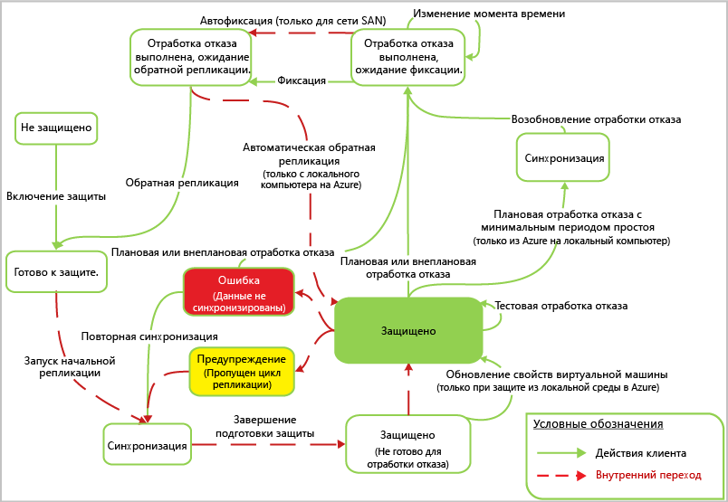

# Как работает служба Azure Site Recovery?
Прочтите эту статью, чтобы ознакомиться с базовой архитектурой службы Azure Site Recovery и ее компонентами.

Все комментарии или вопросы можно добавить в конце этой статьи или на [форуме по службам восстановления Azure](https://social.msdn.microsoft.com/forums/azure/home?forum=hypervrecovmgr).

## Обзор
Организациям нужна стратегия обеспечения непрерывности бизнес-процессов и аварийного восстановления, которая определяет, как приложения, рабочие нагрузки и данные будут оставаться доступными при запланированных и незапланированных простоях, а также как можно максимально быстро восстановить нормальный режим работы. Эта стратегия должна обеспечивать защиту и восстановление бизнес-данных, а также постоянную доступность рабочих нагрузок в случае сбоя.

Служба Azure Site Recovery помогает реализовать стратегию BCDR. Она управляет процессами репликации локальных физических серверов и виртуальных машин в облако (Azure) или дополнительные центры обработки данных. При возникновении сбоев в исходном расположении происходит отработка отказа с выполнением перехода в дополнительное расположение. Это обеспечивает доступность приложений и рабочих нагрузок. При восстановлении нормального режима работы исходного расположения происходит переключение на него. Дополнительные сведения см. в статье [Что такое Site Recovery?](site-recovery-overview.md)

## Служба Site Recovery на портале Azure
В Azure предусмотрены две [модели развертывания](../resource-manager-deployment-model.md) для создания ресурсов и работы с ними: модель Azure Resource Manager и классическая модель управления службами. Кроме того, Azure предоставляет два портала — [классический портал Azure](https://manage.windowsazure.com/), поддерживающий классическую модель развертывания, и [портал Azure](https://portal.azure.com), поддерживающий обе модели развертывания.

Служба Site Recovery доступна как на классическом портале, так и на портале Azure. На классическом портале Azure поддерживается классическая модель управления службой Site Recovery, а на обычном портале Azure — классическая модель и модель Resource Manager. Дополнительные сведения о развертывании с помощью портала Azure см. [здесь](site-recovery-overview.md#site-recovery-in-the-azure-portal) .

Информация, приведенная в этой статье, относится как к классической модели развертывания, так и к модели развертывания с помощью портала Azure. Отличия будут указаны.

## Сценарии развертывания
Site Recovery можно развернуть для оркестрации репликации в нескольких сценариях.

* **Репликация виртуальных машин VMware.** Вы можете реплицировать локальные виртуальные машины VMware в Azure или дополнительный центр обработки данных.
* * **Репликация физических серверов.** Вы можете реплицировать физические компьютеры под управлением Windows и Linux в Azure или дополнительный центр обработки данных. Процесс репликации физических компьютеров практически не отличается от процесса репликации виртуальных машин VMware.
* **Репликация виртуальных машин Hyper-V (без VMM).** Виртуальные машины Hyper-V, управление которыми осуществляется без помощи VMM, можно реплицировать в Azure.
* **Репликация виртуальных машин Hyper-V, управление которыми выполняется с помощью облачных сред System Center VMM.** Локальные виртуальные машины Hyper-V, выполняющиеся на серверах узлов Hyper-V в облачных средах VMM, можно реплицировать в Azure или дополнительный центр обработки данных. Репликацию можно выполнять с использованием стандартной реплики Hyper-V или репликации сети SAN.
* **Перенос виртуальных машин.** С помощью службы Site Recovery [можно переносить виртуальные машины IaaS Azure](site-recovery-migrate-azure-to-azure.md) из одного региона в другой, а [экземпляры AWS Windows](site-recovery-migrate-aws-to-azure.md) — на виртуальные машины IaaS Azure. В настоящее время поддерживается только миграция. Это означает, что вы можете выполнить отработку отказа этих виртуальных машин, но не можете восстановить их размещение.

При помощи Site Recovery можно реплицировать большинство приложений, работающих на этих виртуальных машинах и физических серверах. Полный перечень поддерживаемых приложений см. в статье [Какие рабочие нагрузки можно защитить с помощью службы Azure Site Recovery?](site-recovery-workload.md)

## Репликация виртуальных машин VMware и физических серверов Windows/Linux в среду Azure
Существует два различных способа репликации виртуальных машин VMware с использованием Site Recovery.

* **С помощью портала Azure.** При развертывании службы Site Recovery на портале Azure можно выполнить отработку отказа виртуальных машин в классическое хранилище диспетчера служб или в Resource Manager. Выполнение репликации виртуальных машин VMware на портале Azure предоставляет ряд преимуществ, в том числе возможность репликации в классическое хранилище или хранилище Resource Manager в Azure. [Подробнее](site-recovery-vmware-to-azure.md).
* **С помощью классического портала.** Вы можете развернуть службу Site Recovery на классическом портале, используя расширенные возможности. Этот способ рекомендуется использовать для новых развертываний. При этом отработку отказа виртуальных машин можно выполнять только в классическое хранилище Azure (возможность репликации в хранилище Resource Manager не поддерживается). [Подробнее](site-recovery-vmware-to-azure-classic.md). На классическом портале также можно настроить репликацию виртуальных машин VMware с помощью [устаревшей архитектуры](site-recovery-vmware-to-azure-classic-legacy.md). Этот способ не рекомендуется использовать для новых развертываний.  Если вы уже развернули сценарий с помощью устаревшей архитектуры, [ознакомьтесь со сведениями о переходе](site-recovery-vmware-to-azure-classic-legacy.md#migrate-to-the-enhanced-deployment) на расширенное развертывание.

Требования к архитектуре для развертывания службы Site Recovery с целью репликации виртуальных машин или физических серверов VMware на портале Azure или на классическом портале Azure (расширенные возможности) аналогичны, но существуют некоторые отличия.

* При развертывании на портале Azure можно выполнять репликацию в хранилище на основе Resource Manager и использовать сети Resource Manager для подключения к виртуальным машинам Azure после отработки отказа.
* При развертывании на портале Azure можно использовать хранилище LRS и GRS, а на классическом портале — только хранилище GRS.
* На портале Azure процесс развертывания упрощен и более удобен.

Вам потребуется следующее.

* **Учетная запись Azure.** Вам потребуется учетная запись Microsoft Azure.
* **Служба хранилища Azure.** Для хранения реплицированных данных вам потребуется учетная запись хранения Azure. Для этой цели подойдет классическая учетная запись или учетная запись хранения Resource Manager. При развертывании на портале Azure можно использовать учетную запись хранения LRS или GRS. Реплицированные данные хранятся в службе хранилища Azure, а виртуальные машины Azure развертываются при отработке отказа.
* **Сеть Azure.** Вам потребуется виртуальная сеть Azure, к которой будут подключаться виртуальные машины Azure, созданные при отработке отказа. На портале Azure можно использовать сети, созданные с помощью классической модели диспетчера служб или модели Resource Manager.
* **Локальный сервер конфигурации.** Вам потребуется локальная машина Windows Server 2012 R2 с сервером конфигурации и другими компонентами Site Recovery. При репликации виртуальных машин VMware рекомендуется использовать высокодоступную виртуальную машину VMware. Для репликации физических серверов можно использовать физический компьютер. На компьютер устанавливаются следующие компоненты Site Recovery.
  * **Сервер конфигурации.** Используется для управления обменом данными между локальной средой и облаком Azure, а также репликацией и восстановлением данных.
  * **Сервер обработки**— выступает в качестве шлюза репликации. Сервер обработки получает данные репликации с защищенных исходных компьютеров, оптимизирует их путем кэширования, сжатия и шифрования и отправляет эти данные в службу хранилища Azure. Он также обеспечивает принудительную установку службы Mobility Service на защищенные компьютеры и выполняет автоматическое обнаружение виртуальных машин VMware. По мере увеличения масштаба развертывания вы можете добавлять дополнительные выделенные серверы для обработки растущего объема данных репликации.
  * **Главный целевой сервер**— обрабатывает данные репликации при восстановлении размещения с переносом из Azure.
* **Виртуальные машины VMware или физические серверы.** На каждой машине, которую нужно реплицировать в Azure, необходимо установить компонент Mobility Service. Она фиксирует операции записи данных на компьютере и перенаправляет их на сервер обработки. Этот компонент можно установить вручную или автоматически. Автоматическую установку выполняет сервер обработки, когда вы включаете репликацию для конкретной машины.
* **Узлы vSphere и сервер vCenter.** Вам понадобится один или несколько серверов узлов vSphere, на которых работают виртуальные машины VMware. Для управления этими узлами рекомендуется развернуть сервер vCenter.
* **Восстановление размещения.** Ниже приведены сведения, на которые следует обратить внимание.
  * **Восстановление размещения из физического сервера на физический компьютер не поддерживается.** Это означает, что после отработки отказа физического сервера в Azure восстановить размещение можно только на виртуальную машину VMware. Восстанавливать размещение на физический сервер нельзя. Для восстановления размещения потребуется виртуальная машина Azure. Если сервер конфигурации не развернут в качестве виртуальной машины VMware, необходимо настроить в качестве такой машины отдельный главный целевой сервер. Это связано с тем, что для восстановления дисков на виртуальную машину VMware главный целевой сервер подключается к хранилищу VMware и взаимодействует с ним.
  * * **Временный сервер обработки в Azure.** Если вы хотите восстановить размещение из Azure после отработки отказа, необходимо настроить виртуальную машину Azure в качестве сервера обработки, который будет обрабатывать репликацию из Azure. После восстановления размещения эту виртуальную машину можно удалить.
  * **VPN-подключение.** Для восстановления размещения вам потребуется настроить VPN-подключение (или Azure ExpressRoute) между сетью Azure и локальным сайтом.
  * **Отдельный локальный главный целевой сервер.** Локальный главный целевой сервер обрабатывает восстановление размещения. Главный целевой сервер устанавливается по умолчанию на сервер управления, но если восстанавливается размещение больших объемов трафика, настройте для этой цели отдельный локальный главный целевой сервер.

**Общая архитектура**

**Компоненты развертывания**

**Восстановление размещения**

* [Узнайте больше](site-recovery-vmware-to-azure.md#azure-prerequisites) о требованиях к развертыванию на портале Azure.
* Требования к расширенному развертыванию на классическом портале см. [здесь](site-recovery-vmware-to-azure-classic.md#before-you-start-deployment).
* [Узнайте больше](site-recovery-failback-azure-to-vmware.md) о восстановлении размещения на портале Azure.
* [Узнайте больше](site-recovery-failback-azure-to-vmware-classic.md) о восстановлении размещения на классическом портале.

## Репликация виртуальных машин Hyper-V, управление которыми не осуществляется с помощью VMM, в Azure
Репликацию виртуальных машин Hyper-V, управление которыми не осуществляется с помощью System Center VMM, в Azure с использованием службы Site Recovery можно выполнить несколькими способами.

* **С помощью портала Azure.** При развертывании службы Site Recovery на портале Azure можно выполнить отработку отказа виртуальных машин в классическое хранилище или в Resource Manager. [Подробнее](site-recovery-hyper-v-site-to-azure.md).
* **С помощью классического портала.** Вы можете развернуть службу Site Recovery на классическом портале. При этом отработку отказа виртуальных машин можно выполнять только в классическое хранилище Azure (возможность репликации в хранилище Resource Manager не поддерживается). [Подробнее](site-recovery-hyper-v-site-to-azure-classic.md).

Архитектура обоих развертываний аналогична, за исключением следующих моментов.

* При развертывании на портале Azure можно выполнять репликацию в хранилище Resource Manager и использовать сети Resource Manager для подключения к виртуальным машинам Azure после отработки отказа.
* На портале Azure процесс развертывания упрощен и более удобен.

Вам потребуется следующее.

* **Учетная запись Azure.** Вам потребуется учетная запись Microsoft Azure.
* **Служба хранилища Azure.** Для хранения реплицированных данных вам потребуется учетная запись хранения Azure. На портале Azure можно использовать классическую учетную запись или учетную запись хранения Resource Manager. На классическом портале можно использовать только классическую учетную запись.  Реплицированные данные хранятся в службе хранилища Azure, а виртуальные машины Azure создаются при отработке отказа.
* **Сеть Azure.** Вам потребуется сеть Azure, к которой будут подключаться виртуальные машины Azure, созданные после отработки отказа.
* **Узел Hyper-V.** Вам потребуется один или несколько серверов узла Hyper-V, работающих под управлением Windows Server 2012 R2. При развертывании Site Recovery вы можете установить поставщик этой службы и агент служб восстановления Microsoft Azure на узле.
* **Виртуальные машины Hyper-V.** На сервере узла Hyper-V должна быть установлена как минимум одна виртуальная машина. поставщик Azure Site Recovery и агент служб восстановления Azure на узле Hyper-V. Поставщик координирует процессы репликации и управляет ими через Интернет с помощью службы Site Recovery. Агент обрабатывает данные репликации через защищенный канал (HTTPS, порт 443). Обмен данными между поставщиком и агентом осуществляется по защищенным и зашифрованным каналам. Реплицированные данные в службе хранилища Azure также шифруются.

**Общая архитектура**

* [Узнайте больше](site-recovery-hyper-v-site-to-azure.md#azure-prerequisites) о требованиях к развертыванию на портале Azure.
* [Узнайте больше](site-recovery-hyper-v-site-to-azure-classic.md#azure-prerequisites) о требованиях к развертыванию на классическом портале Azure.

## Репликация виртуальных машин Hyper-V, управление которыми осуществляется с помощью VMM, в Azure
Выполнять репликацию виртуальных машин Hyper-V из облачных сред VMM в Azure с помощью службы Site Recovery можно следующим образом.

* **С помощью портала Azure.** При развертывании службы Site Recovery на портале Azure можно выполнить отработку отказа виртуальных машин в классическое хранилище или в Resource Manager. [Подробнее](site-recovery-vmm-to-azure.md).
* **С помощью классического портала.** Вы можете развернуть службу Site Recovery на классическом портале. При этом отработку отказа виртуальных машин можно выполнять только в классическое хранилище Azure (возможность репликации в хранилище Resource Manager не поддерживается). [Подробнее](site-recovery-vmm-to-azure-classic.md).

Архитектура обоих развертываний аналогична, за исключением следующих моментов.

* При развертывании на портале Azure можно выполнять репликацию в хранилище на основе Resource Manager и использовать сети Resource Manager для подключения к виртуальным машинам Azure после отработки отказа.
* На портале Azure процесс развертывания упрощен и более удобен.

Вам потребуется следующее.

* **Учетная запись Azure.** Вам потребуется учетная запись Microsoft Azure.
* **Служба хранилища Azure.** Для хранения реплицированных данных вам потребуется учетная запись хранения Azure. На портале Azure можно использовать классическую учетную запись или учетную запись хранения Resource Manager. На классическом портале можно использовать только классическую учетную запись.  Реплицированные данные хранятся в службе хранилища Azure, а виртуальные машины Azure создаются при отработке отказа.
* **Сеть Azure.** Вам потребуется настроить сетевое сопоставление виртуальных машин Azure, чтобы они были подключены к соответствующим сетям после отработки отказа.
* **Сервер VMM.** Вам потребуется по крайней мере один локальный сервер VMM под управлением System Center 2012 R2 с одним или несколькими настроенными частными облаками. Если развертывание осуществляется на портале Azure, для настройки сетевого сопоставления необходимо настроить логические сети и сети виртуальных машин. На классическом портале это необязательно.  Сеть виртуальных машин должна быть связана с логической сетью, которая сопоставлена с облаком.
* **Узел Hyper-V.** Вам потребуется один или несколько серверов узла Hyper-V, размещенных в облаке VMM. Они должны работать под управлением Windows Server 2012 R2.
* **Виртуальные машины Hyper-V.** На сервере узла Hyper-V должна быть установлена как минимум одна виртуальная машина.

**Общая архитектура**

* [Узнайте больше](site-recovery-vmm-to-azure.md#azure-requirements) о требованиях к развертыванию на портале Azure.
* [Узнайте больше](site-recovery-vmm-to-azure-classic.md#before-you-start) о требованиях к развертыванию на классическом портале Azure.

## Репликация физических серверов или виртуальных машин VMware на дополнительный сайт
Чтобы реплицировать физические серверы или виртуальные машины VMware на дополнительный сайт, скачайте компонент InMage Scout, включенный в подписку Azure Site Recovery. Его можно скачать на портале Azure или на классическом портале Azure.

Настройте серверы компонентов для каждого сайта (сервер конфигурации, сервер обработки, главный целевой сервер) и установите унифицированный агент на компьютеры, которые требуется реплицировать. После начальной репликации агент на каждом компьютере отправляет данные дельта-репликации на сервер обработки. Сервер обработки оптимизирует эти данные и передает их на главный целевой сервер на дополнительном сайте. Сервер конфигурации управляет процессом репликации.

Вам потребуется следующее.

**Учетная запись Azure.** Для развертывания этого сценария используется InMage Scout. Для ее использования необходима подписка Azure. Создайте хранилище Site Recovery, затем загрузите InMage Scout и установите последние обновления, чтобы настроить развертывание.
**Сервер обработки (основной сайт).** Настройте компонент сервера обработки на основном сайте для кэширования, сжатия и оптимизации данных. Кроме того, он обеспечивает принудительную установку единого агента на компьютеры, которые необходимо защитить.
**VMware ESX/ESXi и сервер vCenter (основной сайт).** Для защиты виртуальных машин VMware нужен гипервизор VMware EXS/ESXi и иногда сервер VMware vCenter, управляющий гипервизорами.

* **Виртуальные машины и физические серверы (основной сайт).** Для защиты виртуальных машин VMware или физических серверов Windows и Linux на них нужно установить единый агент. Единый агент также устанавливается на машину, выступающую в качестве главного целевого сервера. Агент обеспечивает обмен данными между всеми компонентами.
* * **Сервер конфигурации (дополнительный сайт).** Сервер конфигурации — первый компонент, устанавливаемый на дополнительный сайт. Он отвечает за управление, настройку и мониторинг развертывания с помощью веб-сайта управления или консоли vContinuum. В развертывании используется только один сервер конфигурации, который должен быть установлен на компьютере под управлением Windows Server 2012 R2.
* **Сервер vContinuum (дополнительный сайт).** Устанавливается в том же расположении (дополнительный сайт), что и сервер конфигурации. Он предоставляет консоль для мониторинга защищенной среды и управления ею. При установке по умолчанию сервер vContinuum является первым главным целевым сервером с установленным единым агентом.
* **Главный целевой сервер (дополнительный сайт).** Здесь хранятся реплицированные данные. Он получает данные с сервера обработки, создает реплицированный компьютер на дополнительном сайте и хранит точки хранения данных. Необходимое количество главных целевых серверов зависит от количества защищаемых компьютеров. Если нужно переключиться на основной сайт, вам также понадобится главный целевой сервер.

**Общая архитектура**

## Репликация виртуальных машин Hyper-V, управление которыми осуществляется с помощью VMM, на дополнительный сайт
Репликацию виртуальных машины Hyper-V, управление которыми осуществляется с помощью System Center VMM, на дополнительный сайт с помощью службы Site Recovery можно выполнить несколькими способами.

* **С помощью портала Azure.** Развертывание службы Site Recovery осуществляется на портале Azure. [Подробнее](site-recovery-hyper-v-site-to-azure.md).
* **С помощью классического портала.** Вы можете развернуть службу Site Recovery на классическом портале. [Подробнее](site-recovery-hyper-v-site-to-azure-classic.md).

Архитектура обоих развертываний аналогична, за исключением следующих моментов.

* При развертывании на портале Azure необходимо настроить сетевое сопоставление. На классическом портале это необязательно.
* На портале Azure процесс развертывания упрощен и более удобен.
* * При развертывании на классическом портале Azure предоставляется возможность [сопоставления хранилищ](site-recovery-storage-mapping.md) .

Вам потребуется следующее.

* **Учетная запись Azure.** Вам потребуется учетная запись Microsoft Azure.
* **Сервер VMM.** Мы советуем разместить один сервер VMM на основном сайте, а второй — на дополнительном. На каждом сервере должно быть установлено по крайней мере одно частное облако VMM. На сервере должно быть запущено как минимум решение System Center 2012 с пакетом обновления 1 (SP1) с последними обновлениями. Кроме того, сервер должен быть подключен к Интернету. В каждом облаке необходимо настроить профиль возможностей Hyper-V. Установите поставщик Azure Site Recovery на сервере VMM. Поставщик координирует процессы репликации и управляет ими через Интернет с помощью службы Site Recovery. Обмен данными между поставщиком и Azure осуществляется по защищенным и зашифрованным каналам.
* **Сервер Hyper-V.** Серверы узлов Hyper-V должны быть размещены в основном и дополнительном облаках VMM. Серверы узлов должны быть подключены к Интернету и работать под управлением Windows Server 2012 с последними обновлениями (или более поздней версии этой ОС). Данные реплицируются между основным и дополнительным серверами узлов Hyper-V через локальную или VPN-сеть или по протоколу Kerberos или с использованием проверки подлинности на основе сертификата.  
* **Защищенные компьютеры.** На исходном сервере узла Hyper-V должна быть установлена как минимум одна виртуальная машина, которую необходимо защитить.

**Общая архитектура**

* [Узнайте больше](site-recovery-vmm-to-vmm.md#azure-prerequisites) о требованиях к развертыванию на портале Azure.
* * [Узнайте больше о требованиях](site-recovery-vmm-to-vmm-classic.md#before-you-start) к развертыванию на классическом портале Azure.

## Репликация виртуальных машин Hyper-V, управление которыми осуществляется с помощью VMM, на дополнительный сайт с применением репликации сети SAN
Репликацию виртуальных машин Hyper-V, управляемых с помощью облачных сред VMM, на дополнительный сайт с применением репликации сети SAN можно выполнить на классическом портале Azure. В настоящее время этот сценарий не поддерживается на новом портале Azure.

В этом сценарии во время развертывания службы Site Recovery установите на серверы VMM поставщик Azure Site Recovery. Поставщик координирует процессы репликации и управляет ими через Интернет с помощью службы Site Recovery. Данные реплицируются между основным и дополнительным массивами хранения с помощью синхронной репликации сети SAN.

Вам потребуется следующее.

**Учетная запись Azure.** Вам потребуется подписка Azure.

* **Массив SAN.** Основной сервер VMM управляет [поддерживаемым массивом SAN](http://social.technet.microsoft.com/wiki/contents/articles/28317.deploying-azure-site-recovery-with-vmm-and-san-supported-storage-arrays.aspx). SAN использует сетевую инфраструктуру совместно с другим массивом SAN в дополнительном ЦОД.
* **Сервер VMM.** Мы советуем разместить один сервер VMM на основном сайте, а второй — на дополнительном. На каждом сервере должно быть установлено по крайней мере одно частное облако VMM. На сервере должно быть запущено как минимум решение System Center 2012 с пакетом обновления 1 (SP1) с последними обновлениями. Кроме того, сервер должен быть подключен к Интернету. В каждом облаке необходимо настроить профиль возможностей Hyper-V.
* **Сервер Hyper-V.** Серверы узлов Hyper-V размещены в основном и дополнительном облаках VMM. Серверы узлов должны быть подключены к Интернету и работать под управлением Windows Server 2012 с последними обновлениями (или более поздней версии этой ОС).
* **Защищенные компьютеры.** На исходном сервере узла Hyper-V должна быть установлена как минимум одна виртуальная машина, которую необходимо защитить.

**Архитектура репликации сети SAN**

[Узнайте больше](site-recovery-vmm-san.md#before-you-start) о требованиях к развертыванию.

### Локальная система
## Жизненный цикл защиты Hyper-V
Ниже описан рабочий процесс защиты, репликации и отработки отказа виртуальных машин Hyper-V.

1. **Включение защиты.** Выполняется настройка хранилища Site Recovery, настройка параметров репликации для облачных сред VMM или сайта Hyper-V и включается защита виртуальных машин. Инициируется задание **Включить защиту**, ход выполнения которого можно отслеживать на вкладке **Задания**. При выполнении задания проверяется, соответствует ли компьютер необходимым требованиям, а затем вызывается метод [CreateReplicationRelationship](https://msdn.microsoft.com/library/hh850036.aspx), который настраивает репликацию в Azure с помощью настраиваемых пользователем параметров. Кроме того, при выполнении задания **Включить защиту** вызывается метод [StartReplication](https://msdn.microsoft.com/library/hh850303.aspx) для инициализации полной репликации виртуальной машины.
2. **Начальная репликация.** Создается моментальный снимок виртуальной машины, и виртуальные жесткие диски реплицируются по одному, пока все они не будут скопированы в Azure или дополнительный центр обработки данных. Время выполнения этой процедуры зависит от размера виртуальной машины, пропускной способности сети, а также способа начальной репликации. В случае возникновения изменений на диске при выполнении начальной репликации модуль отслеживания репликации реплики Hyper-V регистрирует их в журналах репликации Hyper-V (HRL), которые находятся в папке с дисками. С каждым диском связан HRL-файл, который отправляется в дополнительное хранилище. Обратите внимание, что при выполнении начальной репликации файлы моментальных снимков и журналов потребляют ресурсы диска. После завершения начальной репликации моментальный снимок виртуальной машины удаляется, а изменения, произошедшие с дельта-диском, в журнале синхронизируются и объединяются.
3. **Завершение подготовки защиты.** После завершения начальной репликации задание **Завершить подготовку защиты** настраивает сеть и другие не связанные с репликацией параметры. После этого виртуальная машина защищена. При репликации в Azure может потребоваться настроить параметры виртуальной машины для обеспечения готовности к отработке отказа. На этом этапе можно выполнить тестовую отработку отказа, чтобы убедиться, что все работает правильно.
4. **Репликация.** После начальной репликации начинается синхронизация изменений в соответствии с параметрами репликации.
   * **Сбой репликации.** Если происходит сбой дельта-репликации и для полной репликации необходима высокая пропускная способность или требуется много времени, выполняется повторная синхронизация. Например, если HRL-файлы занимают 50 % места на диске, виртуальная машина помечается для повторной синхронизации. Повторная синхронизация минимизирует объем передаваемых данных. Для этого вычисляются контрольные суммы исходной и целевой виртуальной машины, а затем отправляется только полученная разница. После завершения повторной синхронизации возобновляется дельта-репликация. По умолчанию повторная синхронизация автоматически выполняется в нерабочее время. Повторную синхронизацию виртуальной машины можно выполнить вручную.
   * **Ошибка репликации.** При возникновении ошибки репликации используется встроенный механизм повторных попыток. Если произошла неустранимая ошибка, например проверки подлинности или авторизации, или реплицируемый компьютер находится в недопустимом состоянии, повторная попытка не выполняется. Если произошла устранимая ошибка, например ошибка в сети, нехватка свободного места на диске или объема памяти, происходит повторная попытка. После каждой повторной попытки интервал между повторными попытками увеличивается (через 1, 2, 4 минуты, 8, 10 минут и затем через 30 минут).
5. **Плановые и внеплановые отработки отказа.** Плановые и внеплановые отработки отказа выполняются по мере необходимости. Чтобы не допустить потери данных при выполнении плановой отработки отказа, выключите исходные виртуальные машины. После создания реплицированные виртуальные машины переходят в состояние ожидания фиксации. Чтобы завершить отработку отказа, необходимо зафиксировать изменения на этих виртуальных машинах. Если выполняется репликация с использованием сети SAN, фиксация выполняется автоматически. После запуска основного сайта может произойти восстановление размещения. Если репликация выполнялась в Azure, обратная репликация выполняется автоматически. Иначе ее нужно будет запустить вручную.

## Дальнейшие действия
[Подготовка к развертыванию](site-recovery-best-practices.md)

<!--HONumber=Nov16_HO2-->

