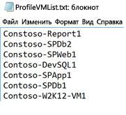
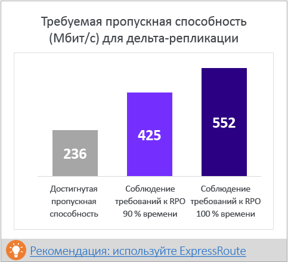
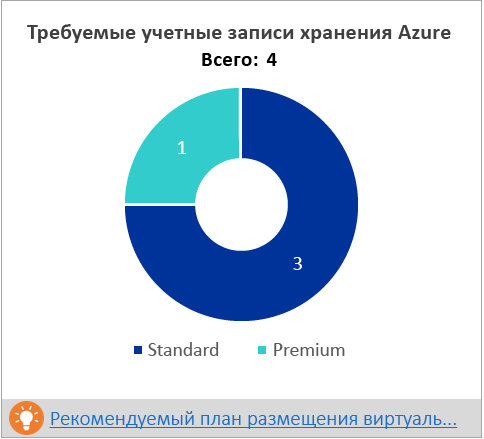
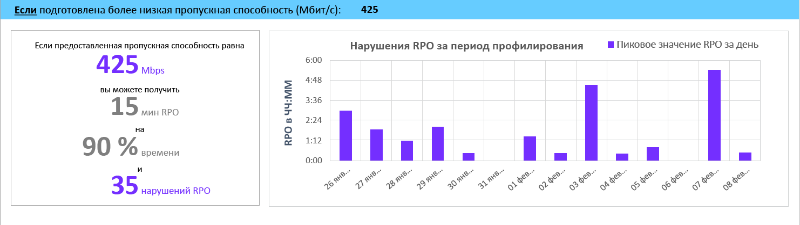
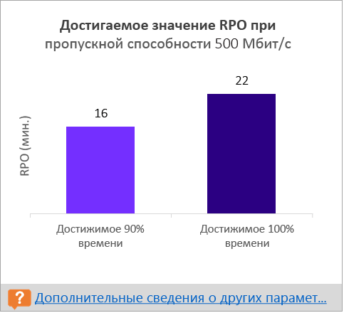
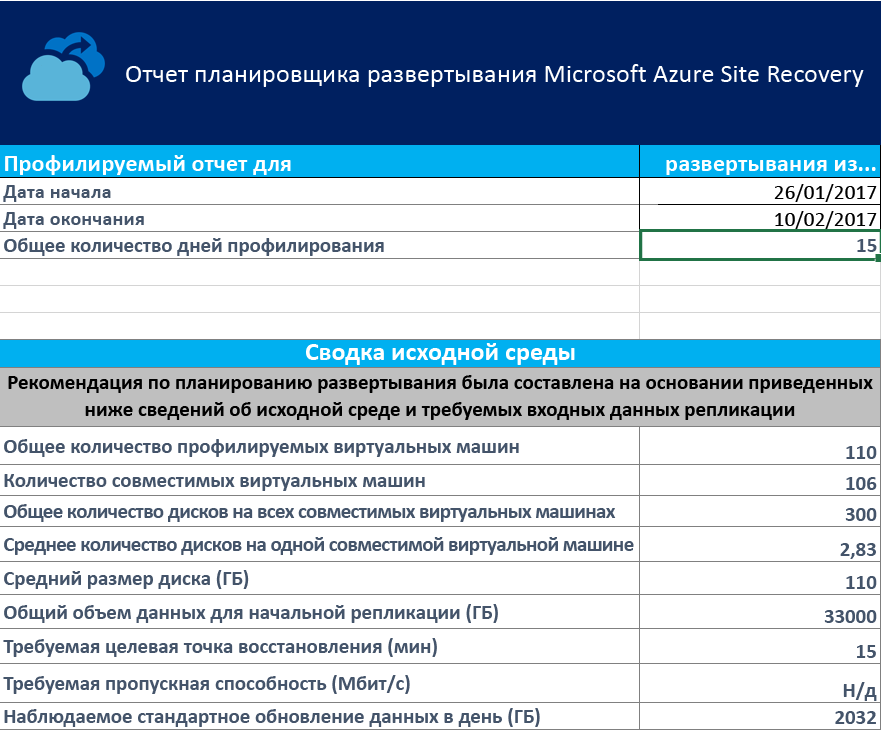
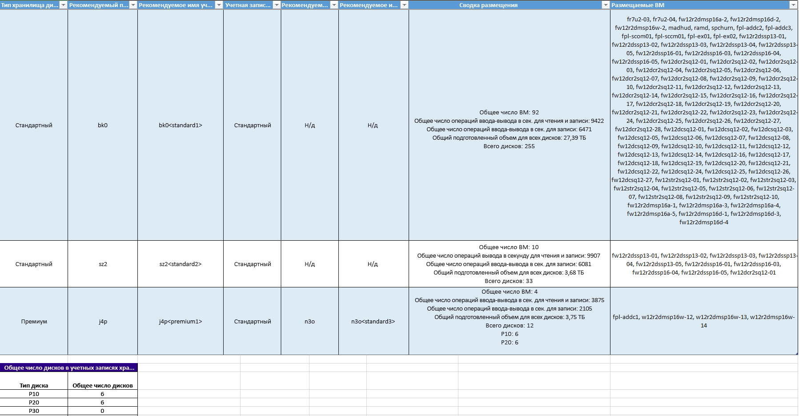
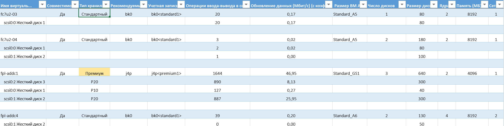
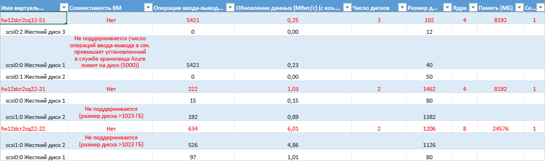

# <a name="azure-site-recovery-deployment-planner"></a>Планировщик ресурсов Azure Site Recovery
В этой статье приведены рекомендации по использованию планировщика развертывания Azure Site Recovery в сценариях рабочих развертываний виртуальных машин VMware в Azure.

## <a name="overview"></a>Обзор

Перед установкой защиты виртуальных машин VMware с помощью Site Recovery выделите достаточный объем пропускной способности в зависимости от частоты ежедневного изменения данных в соответствии с требуемой целевой точкой восстановления (RPO). В локальной среде необходимо развернуть нужное число серверов конфигурации и обработки.

Кроме того, необходимо создать требуемое количество целевых учетных записей хранения Azure соответствующего типа (класса Standard или Premium), учитывая рост нагрузки на исходные рабочие серверы из-за более активного их использования в будущем. Тип хранилища определяется для каждой виртуальной машины на основе особенностей рабочей нагрузки (количества операций записи и чтения на диск в секунду, активности обработки данных) и ограничений Azure Site Recovery.

Общедоступная предварительная версия планировщика ресурсов Site Recovery — это программа командной строки, доступная сейчас только в сценариях развертывания виртуальных машин VMware в Azure. Эта программа позволяет выполнить удаленное профилирование виртуальных машин VMware (никоим образом не влияя на рабочий процесс), чтобы оценить требования к пропускной способности и службе хранилища Azure для успешной репликации и отработки отказа. Вы можете запустить эту программу, не устанавливая в локальной среде каких-либо дополнительных компонентов Site Recovery. Однако чтобы получить более точные сведения о пропускной способности, мы рекомендуем запустить планировщик ресурсов на виртуальной машине Windows Server, соответствующей минимальным требованиям сервера конфигурации Site Recovery, который в конечном итоге потребуется развернуть на одном из первых этапов рабочего развертывания.

Эта программа предоставляет указанные ниже сведения.

**Оценка совместимости**

* Оценка совместимости виртуальной машины в зависимости от количества дисков, их размера, числа операций ввода-вывода в секунду, активности обработки данных и типа загрузки (EFI/BIOS).
* Расчетное значение пропускной способности, необходимой для разностной репликации.

**Оценка пропускной способности сети и целевой точки восстановления**

* Расчетное значение пропускной способности, необходимой для разностной репликации.
* Пропускная способность, которую может получить Site Recovery при репликации данных из локальной среды в Azure.
* Количество виртуальных машин, которое можно включить в пакет, на основе расчетного значения пропускной способности для завершения начальной репликации в указанный промежуток времени.

**Требования к инфраструктуре Azure**

* Требование к типу хранилища (хранилище класса Standard или Premium) каждой виртуальной машины.
* Общее число учетных записей хранения уровня Standard или Premium, которое необходимо настроить для репликации.
* Именование учетных записей хранения в соответствии с рекомендациями к службе хранилища Azure.
* Размещение учетной записи хранения каждой виртуальной машины.
* Число ядер Azure, которое необходимо настроить перед отработкой отказа или тестовой отработкой отказа, на подписку.
* Рекомендуемый размер виртуальной машины Azure для каждой локальной виртуальной машины.

**Требования к локальной инфраструктуре**
* Число серверов конфигурации и серверов обработки, которые необходимо развернуть в локальной среде.

>[!IMPORTANT]
>
>При выполнении вычислений в программе использовался 30%-ный коэффициент роста характеристик рабочей нагрузки (из-за возможного роста использования со временем) и 95-й процентиль всех метрик профилирования (число операций записи и чтения в секунду, активность обработки данных и т. д.). Оба эти элемента (коэффициент роста и используемый процентиль) можно изменить. Дополнительные сведения о коэффициенте роста и используемом процентиле см. в разделе "Рекомендации по коэффициенту роста" и "Значение процентиля, используемое для вычисления".
>

## <a name="requirements"></a>Требования
Программа выполняет два основных действия: осуществляет профилирование и создает отчет. С ее помощью также можно оценить пропускную способность. В таблице ниже приведены требования к серверу, на котором инициируется профилирование и измерение пропускной способности.

| Требование к серверу | Описание|
|---|---|
|Профилирование и измерение пропускной способности| <ul><li>Операционная система: Microsoft Windows Server 2012 R2<br>(в идеале соответствует [рекомендациям по размеру сервера конфигурации](https://aka.ms/asr-v2a-on-prem-components)).</li><li>Конфигурация виртуальной машины: 8 виртуальных ЦП, 16 ГБ ОЗУ, жесткий диск емкостью 300 ГБ.</li><li>[Microsoft .NET Framework 4.5](https://aka.ms/dotnet-framework-45)</li><li>[VMware vSphere PowerCLI 6.0 R3](https://developercenter.vmware.com/tool/vsphere_powercli/6.0).</li><li>[Распространяемый компонент Microsoft Visual C++ для Visual Studio 2012](https://aka.ms/vcplusplus-redistributable).</li><li>Интернет-доступ к Azure с этого сервера.</li><li>Учетная запись хранения Azure.</li><li>Права администратора на доступ к серверу.</li><li>Минимальное свободное место на диске: 100 ГБ (предполагается, что профилирование 1000 виртуальных машин в среднем с 3 дисками на каждую выполняется 30 дней).</li><li>Параметрам уровня статистики vCenter VMware необходимо присвоить значение 2 или выше.</li></ul>|
| Создание отчетов. | Любой компьютер с Windows или Windows Server с Microsoft Excel 2013 или более поздней версии. |
| Разрешения пользователя | Разрешение только на чтение для учетной записи пользователя, используемой для доступа к серверу VMware vCenter Server или узлу VMware vSphere ESXi во время профилирования. |

> [!NOTE]
>
>Эта программа позволяет профилировать только виртуальные машины с дисками VMDK и RDM и не поддерживает диски iSCSI или NFS. Site Recovery поддерживает диски iSCSI и NFS для серверов VMware, но так как планировщик ресурсов запущен не в гостевой ОС и выполняет профилирование только на основе показателей счетчиков производительности vCenter, он не видит диски этого типа.
>

## <a name="download-and-extract-the-public-preview"></a>Скачивание и распаковка общедоступной предварительной версии
1. Скачайте последнюю [общедоступную предварительную версию планировщика ресурсов Site Recovery](https://aka.ms/asr-deployment-planner).  
Эта программа упакована в формате ZIP. Текущая ее версия поддерживает только сценарии развертывания виртуальных машин VMware в Azure.

2. Скопируйте ZIP-папку на сервер Windows Server, на котором необходимо запустить программу.  
Вы можете запустить планировщик на любом сервере Windows Server 2012 R2, имеющем сетевой доступ к vCenter Server или узлу vSphere ESXi, в котором содержатся виртуальные машины, профилирование которых необходимо выполнить. Но мы советуем запускать эту программу на сервере, конфигурация оборудования которого соответствует [рекомендациям по размеру сервера конфигурации](https://aka.ms/asr-v2a-on-prem-components). Если вы уже развернули компоненты Site Recovery в локальной среде, запустите программу на сервере конфигурации.

 При одинаковых конфигурациях оборудования сервера, рекомендуемого для запуска программы, и сервера конфигурации (со встроенным сервером обработки) пропускная способность, сведения о которой получены с помощью планировщика, будет соответствовать фактической пропускной способности, которой Site Recovery может добиться во время репликации. Значение пропускной способности зависит от доступной пропускной способности сети и конфигурации оборудования сервера (ЦП, хранилище и т. д.). При запуске программы на другом сервере пропускная способность вычисляется при передаче из этого сервера в Microsoft Azure. Кроме того, конфигурация оборудования на этом сервере и на сервере конфигурации может отличаться. И поэтому значение достигаемой пропускной способности, полученное с помощью этой программы, будет неточным.

3. Распакуйте ZIP-папку.  
Папка содержит несколько файлов и вложенных папок. Исполняемый файл ASRDeploymentPlanner.exe находится в родительской папке.

    Пример:  
    Скопируйте ZIP-файл в папку E:\ drive и распакуйте его.
   E:\ASR Deployment Planner-Preview_v1.2.zip

    E:\ASR Deployment Planner-Preview_v1.2\ ASR Deployment Planner-Preview_v1.2\ ASRDeploymentPlanner.exe

## <a name="capabilities"></a>Возможности
Программу командной строки (ASRDeploymentPlanner.exe) можно запустить в любом из следующих трех режимов:

1. Профилирование.  
2. Создание отчетов.
3. Оценка пропускной способности.

Сначала планировщик необходимо запустить в режиме профилирования, чтобы получить сведения об активности обработки данных и числе операций ввода-вывода в секунду на виртуальной машине. Затем запустите его в режиме создания отчетов, чтобы оценить требования к пропускной способности сети и хранилищу.

## <a name="profiling"></a>Профилирование.
В режиме профилирования планировщик ресурсов подключается к серверу vCenter Server или узлам vSphere ESXi, чтобы собрать данные о производительности виртуальной машины.

* Профилирование не влияет на производительность рабочих процессов виртуальных машин, так как программа напрямую не подключается к виртуальной машине. Все данные о производительности собираются на сервере vCenter Server или узле vSphere ESXi.
* Программа отправляет запросы к серверу vCenter Server или узлу vSphere ESXi каждые 15 минут. За счет этого влияние на сервер во время профилирования незначительное. Такой интервал запросов не влияет на точность профилирования, так как программа сохраняет данные счетчика производительности, получаемые каждую минуту.

### <a name="create-a-list-of-vms-to-profile"></a>Создание списка виртуальных машин для профилирования
Сначала вы должны создать список виртуальных машин, профилирование которых нужно выполнить. Список всех имен виртуальных машин можно получить на сервере vCenter Server или узле vSphere ESXi, используя приведенные ниже команды VMware vSphere PowerCLI. Кроме того, вы можете выбрать знакомые имена или IP-адреса виртуальных машин, для которых следует выполнить профилирование, вручную в файле.

1. Войдите в виртуальную машину, на которой установлен VMware vSphere PowerCLI.
2. Откройте консоль VMware vSphere PowerCLI.
3. Проверьте, включена ли политика выполнения скрипта. Если отключена, запустите консоль VMware vSphere PowerCLI в режиме администратора и включите ее, выполнив следующую команду:

            Set-ExecutionPolicy –ExecutionPolicy AllSigned

4. Чтобы получить список всех имен виртуальных машин на сервере vCenter Server или узле vSphere ESXi и сохранить их в TXT-файле, выполните приведенные ниже команды.
Замените значения &lsaquo;имени сервера&rsaquo;, &lsaquo;имени пользователя&rsaquo;, &lsaquo;пароля&rsaquo; и &lsaquo;выходного TXT-файла&rsaquo; собственными.

            Connect-VIServer -Server <server name> -User <user name> -Password <password>

            Get-VM |  Select Name | Sort-Object -Property Name >  <outputfile.txt>

5. Откройте выходной файл в Блокноте. Скопируйте имена виртуальных машин, профилирование которых необходимо выполнить, в другой файл (например, в файл ProfileVMList.txt) по одному на строку. Этот файл используется в качестве входного значения параметра *-VMListFile* в программе командной строки.

    

### <a name="start-profiling"></a>Начало профилирования
После создания списка виртуальных машин можно запустить программу в режиме профилирования. Ниже приведен список обязательных и необязательных параметров для запуска планировщика в режиме профилирования.

ASRDeploymentPlanner.exe -Operation StartProfiling /?

| Имя параметра | Описание |
|---|---|
| -Operation | StartProfiling |
| -Server | Полное доменное имя или IP-адрес сервера vCenter Server или узла vSphere ESXi, профилирование виртуальных машин которого необходимо выполнить.|
| -User | Имя пользователя для подключения к серверу vCenter Server или узлу vSphere ESXi. Пользователь должен иметь по крайней мере доступ с правами только для чтения.|
| -VMListFile | Файл со списком виртуальных машин для профилирования. Путь к файлу может быть абсолютным или относительным. Этот файл должен содержать по одному имени или IP-адресу виртуальной машины в каждой строке. Имя виртуальной машины, указанное в файле, должно совпадать с именем виртуальной машины на сервере vCenter Server или узле vSphere ESXi.<br>Например, файл VMList.txt содержит следующие виртуальные машины:<ul><li>virtual_machine_A</li><li>10.150.29.110</li><li>virtual_machine_B</li><ul> |
| -NoOfDaysToProfile | Число дней, в течение которых будет выполняться профилирование. Мы рекомендуем выполнять профилирование более 15 дней. Это позволит более детально определить шаблон рабочей нагрузки в среде и предоставить более точные рекомендации. |
| -Directory | (Необязательно.) UNC-путь или путь к локальному каталогу для хранения данных профилирования. Если имя каталога не задано, в качестве каталога по умолчанию используется каталог ProfiledData, расположенный по текущему пути. |
| -Password | (Необязательно.) Пароль, используемый для подключения к серверу vCenter Server или узлу vSphere ESXi. Если не указать его сейчас, запрос на ввод пароля отобразится после выполнения команды.|
| -StorageAccountName | (Необязательно.) Имя учетной записи хранения, используемой для определения объема пропускной способности, доступной для репликации данных из локальной среды в Azure. Программа отправляет тестовые данные в эту учетную запись хранения, чтобы рассчитать пропускную способность.|
| -StorageAccountKey | (Необязательно.) Ключ, используемый для доступа к учетной записи хранения. Перейдите на портал Azure и выберите "Учетные записи хранения > *имя_учетной записи_хранения* > Параметры > Ключи доступа > Ключ 1" (или первичный ключ доступа для классической учетной записи хранения). |
| -Environment | (необязательно) Это целевая среда учетной записи хранения Azure. Этот параметр может иметь одно из трех значений: AzureCloud, AzureUSGovernment, AzureChinaCloud. Значение по умолчанию — AzureCloud. Используйте этот параметр, если ваш целевой регион Azure — Azure для государственных организаций США или Azure для Китая. |


Мы рекомендуем выполнять профилирование виртуальной машины от 15 до 30 дней. В течение этого периода программа ASRDeploymentPlanner.exe продолжает работать. Время профилирования необходимо указать в днях. Если вы хотите запустить профилирование в общедоступной предварительной версии на несколько часов или минут (например, чтобы быстро проверить эту программу), это время необходимо преобразовать в эквивалент в днях. Например, чтобы выполнить профилирование в течение 30 минут, это значение необходимо преобразовать следующим образом: 30/(60*24) = 0,021 дней. Минимальное разрешенное время профилирования составляет 30 минут.

В процессе профилирования при необходимости можно передать имя и ключ учетной записи хранения, чтобы определить пропускную способность, которой может достигнуть Site Recovery во время репликации данных с сервера конфигурации и сервера обработки в Azure. Если их не передать, планировщик не будет рассчитывать достигаемую пропускную способность.

Вы можете запустить несколько экземпляров этой программы для наборов виртуальных машин. Убедитесь, что в этих наборах профилирования имена виртуальных машин не повторяются. Например, вы выполнили профилирование десяти виртуальных машин (VM1–VM10) и спустя несколько дней хотите повторить этот процесс для еще пяти (VM11–VM15). Для профилирования второго набора виртуальных машин (VM11–VM15) эту программу можно запустить в другой консоли командной строки. Проверьте, не входят ли во второй набор виртуальные машины из первого экземпляра профилирования или не используется ли для второго запуска другой выходной каталог. Если два экземпляра планировщика выполняют профилирование тех же самых виртуальных машин и используется тот же выходной каталог, созданный отчет будет неправильным.

Конфигурации виртуальных машин записываются один раз при запуске профилирования и сохраняются в файле VMDetailList.xml. Эти сведения используются во время создания отчета. Изменения в конфигурации виртуальной машины (например, увеличение числа ядер, дисков, сетевых карт и т. д.), внесенные после запуска профилирования до завершения этого процесса, не записываются. Если конфигурация виртуальной машины изменилась во время профилирования в общедоступной предварительной версии планировщика, ниже приведены рекомендации по получению последних сведений о виртуальной машине, используемых при создании отчета.

* Создайте резервную копию файла VMdetailList.xml и удалите его из текущего расположения.
* Передайте аргументы -User и -Password во время создания отчета.

Команда профилирования создает в каталоге профилирования несколько файлов. Не удаляйте их, так как это повлияет на создание отчетов.

#### <a name="example-1-profile-vms-for-30-days-and-find-the-throughput-from-on-premises-to-azure"></a>Пример 1. Профилирование виртуальных машин, выполняемое в течение 30 дней, и определение пропускной способности, достигаемой при репликации данных из локальной среды в Azure
```
ASRDeploymentPlanner.exe -Operation StartProfiling -Directory “E:\vCenter1_ProfiledData” -Server vCenter1.contoso.com -VMListFile “E:\vCenter1_ProfiledData\ProfileVMList1.txt”  -NoOfDaysToProfile  30  -User vCenterUser1 -StorageAccountName  asrspfarm1 -StorageAccountKey Eby8vdM02xNOcqFlqUwJPLlmEtlCDXJ1OUzFT50uSRZ6IFsuFq2UVErCz4I6tq/K1SZFPTOtr/KBHBeksoGMGw==
```

#### <a name="example-2-profile-vms-for-15-days"></a>Пример 2. Профилирование виртуальных машин, выполняемое в течение 15 дней

```
ASRDeploymentPlanner.exe -Operation StartProfiling -Directory “E:\vCenter1_ProfiledData” -Server vCenter1.contoso.com -VMListFile “E:\vCenter1_ProfiledData\ProfileVMList1.txt”  -NoOfDaysToProfile  15  -User vCenterUser1
```

#### <a name="example-3-profile-vms-for-1-hour-for-a-quick-test-of-the-tool"></a>Пример 3. Профилирование виртуальных машин, выполняемое в течение часа, чтобы быстро проверить программу
```
ASRDeploymentPlanner.exe -Operation StartProfiling -Directory “E:\vCenter1_ProfiledData” -Server vCenter1.contoso.com -VMListFile “E:\vCenter1_ProfiledData\ProfileVMList1.txt”  -NoOfDaysToProfile  0.04  -User vCenterUser1
```

>[!NOTE]
>
>* Если сервер, на котором выполняется программа, перезагрузился или на нем произошел сбой, а также если вы вышли из нее, нажав клавиши CTRL+C, данные профилирования сохраняются. Однако вы можете потерять данные за последние 15 минут. В этом случае после перезагрузки сервера повторно запустите планировщик в режиме профилирования.
>* Получив имя и ключ учетной записи хранения, программа измеряет пропускную способность на последнем этапе профилирования. Если она прерывает работу до завершения профилирования, пропускная способность не измеряется. Чтобы определить пропускную способность перед созданием отчета, вы можете выполнить операцию GetThroughput в консоли командной строки. В противном случае сведения о достигаемой пропускной способности не будут включены в отчет.


## <a name="generate-a-report"></a>Создание отчета
Планировщик создает отчет в формате XLSM (файл Microsoft Excel с поддержкой макросов). В нем содержатся все рекомендации по развертыванию. Этот отчет называется DeploymentPlannerReport_<*уникальный_числовой_идентификатор*>.xlsm и помещается в указанный каталог.

После завершения профилирования планировщик можно запустить в режиме создания отчетов. В таблице ниже приведен список обязательных и необязательных параметров для запуска программы в режиме создания отчетов.

`ASRDeploymentPlanner.exe -Operation GenerateReport /?`

|Имя параметра | Описание |
|-|-|
| -Operation | Создание отчета. |
| -Server |  Полное доменное имя или IP-адрес сервера vCenter Server или сервера vSphere (имя или IP-адрес должны совпадать с используемыми во время профилирования), где расположены виртуальные машины, для которых необходимо создать отчет. Обратите внимание, если профилирование выполняется на сервере vCenter Server, вы не можете использовать для создания отчетов сервер vSphere (и наоборот).|
| -VMListFile | Файл со списком профилированных виртуальных машин, для которых необходимо создать отчет. Путь к файлу может быть абсолютным или относительным. Этот файл должен содержать по одному имени или IP-адресу виртуальной машины в каждой строке. Имена виртуальных машин, указанные в файле, должны совпадать с именами на сервере vCenter Server или узле vSphere ESXi, а также с именами, используемыми в процессе профилирования.|
| -Directory | (Необязательно.) UNC-путь или путь к локальному каталогу, в котором хранятся данные профилирования (файлы, созданные в процессе профилирования). Эти данные используются для создания отчета. Если имя не указано, используется каталог ProfiledData. |
| -GoalToCompleteIR | (Необязательно.) Время (в часах), необходимое для завершения начальной репликации профилированных виртуальных машин. В созданном отчете содержатся сведения о количестве виртуальных машин, репликацию которых можно выполнить в течение указанного времени. По умолчанию — 72 часа. |
| -User | (Необязательно.) Имя пользователя, используемое для подключения к серверу vCenter Server или vSphere. Имя используется для получения последних сведений о конфигурации виртуальных машин, например о количестве дисков, ядер, сетевых карт и т. д., используемых в отчете. Если не указать имя, используются сведения о конфигурации, полученные в начале профилирования. |
| -Password | (Необязательно.) Пароль, используемый для подключения к серверу vCenter Server или узлу vSphere ESXi. Если не указать его в качестве параметра, запрос на ввод пароля отобразится позже после выполнения команды. |
| -DesiredRPO | (Необязательно.) Требуемая целевая точка восстановления в минутах. Значение по умолчанию — 15 минут.|
| -Bandwidth | Пропускная способность в Мбит/с. Этот параметр используется для вычисления значения целевой точки восстановления, которого можно достигнуть для указанной пропускной способности. |
| -StartDate | (Необязательно.) Дата и время начала в формате ММ-ДД-ГГГГ:ЧЧ:ММ (24-часовой цикл). Параметр *StartDate* необходимо указать с параметром *EndDate*. Если указать параметр StartDate, отчет будет создан на основе данных, собранных в период между датой начала и окончания. |
| -EndDate | (Необязательно.) Дата и время окончания в формате ММ-ДД-ГГГГ:ЧЧ:ММ (24-часовой цикл). Параметр *EndDate* необходимо указать с параметром *StartDate*. Если указать параметр EndDate, отчет будет создан на основе данных, собранных в период между датой начала и окончания. |
| -GrowthFactor | (Необязательно.) Коэффициент роста в процентах. Значение по умолчанию — 30 процентов. |
| -UseManagedDisks | (Необязательно) UseManagedDisks — "Да" или "Нет". Значение по умолчанию — "Да". Число виртуальных машин, которые можно разместить в одной учетной записи хранения, вычисляется с учетом того, где выполняется отработка отказа или тестовая отработка отказа виртуальных машин — на управляемом или на неуправляемом диске. |

#### <a name="example-1-generate-a-report-with-default-values-when-the-profiled-data-is-on-the-local-drive"></a>Пример 1. Создание отчета со значениями по умолчанию, когда данные профилирования находятся на локальном диске
```
ASRDeploymentPlanner.exe -Operation GenerateReport -Server vCenter1.contoso.com -Directory “\\PS1-W2K12R2\vCenter1_ProfiledData” -VMListFile “\\PS1-W2K12R2\vCenter1_ProfiledData\ProfileVMList1.txt”
```

#### <a name="example-2-generate-a-report-when-the-profiled-data-is-on-a-remote-server"></a>Пример 2. Создание отчета, когда данные профилирования находятся на удаленном сервере
У вас должен быть доступ на чтение и запись к удаленному каталогу.
```
ASRDeploymentPlanner.exe -Operation GenerateReport -Server vCenter1.contoso.com -Directory “\\PS1-W2K12R2\vCenter1_ProfiledData” -VMListFile “\\PS1-W2K12R2\vCenter1_ProfiledData\ProfileVMList1.txt”
```

#### <a name="example-3-generate-a-report-with-a-specific-bandwidth-and-goal-to-complete-ir-within-specified-time"></a>Пример 3. Создание отчета с определенной пропускной способностью для выполнения начальной репликации в указанный интервал времени
```
ASRDeploymentPlanner.exe -Operation GenerateReport -Server vCenter1.contoso.com -Directory “E:\vCenter1_ProfiledData” -VMListFile “E:\vCenter1_ProfiledData\ProfileVMList1.txt” -Bandwidth 100 -GoalToCompleteIR 24
```

#### <a name="example-4-generate-a-report-with-a-5-percent-growth-factor-instead-of-the-default-30-percent"></a>Пример 4. Создание отчета с коэффициентом роста 5 %, а не 30 % (значение по умолчанию)
```
ASRDeploymentPlanner.exe -Operation GenerateReport -Server vCenter1.contoso.com -Directory “E:\vCenter1_ProfiledData” -VMListFile “E:\vCenter1_ProfiledData\ProfileVMList1.txt” -GrowthFactor 5
```

#### <a name="example-5-generate-a-report-with-a-subset-of-profiled-data"></a>Пример 5. Создание отчета с подмножеством данных профилирования
Например, у вас есть данные профилирования за 30 дней, но вы хотите создать отчет только за 20 дней.
```
ASRDeploymentPlanner.exe -Operation GenerateReport -Server vCenter1.contoso.com -Directory “E:\vCenter1_ProfiledData” -VMListFile “E:\vCenter1_ProfiledData\ProfileVMList1.txt” -StartDate  01-10-2017:12:30 -EndDate 01-19-2017:12:30
```

#### <a name="example-6-generate-a-report-for-5-minute-rpo"></a>Пример 6. Создание отчета для 5-минутной целевой точки восстановления
```
ASRDeploymentPlanner.exe -Operation GenerateReport -Server vCenter1.contoso.com -Directory “E:\vCenter1_ProfiledData” -VMListFile “E:\vCenter1_ProfiledData\ProfileVMList1.txt”  -DesiredRPO 5
```

## <a name="percentile-value-used-for-the-calculation"></a>Значение процентиля, используемое для вычисления
**Значение какого процентиля метрик производительности, собранных во время профилирования, по умолчанию использует планировщик при создании отчета?**

По умолчанию планировщик использует значения 95-го процентиля числа операций записи и чтения на диск в секунду, числа операций вода-вывода в секунду при записи и активности обработки данных, собранных во время профилирования всех виртуальных машин. Это гарантирует, что для определения требований к пропускной способности учетной записи хранения и целевой службы не будут использоваться пиковые значения 100-го процентиля, которые могут возникать на виртуальной машине из-за временных событий, например из-за выполнения задания архивации раз в день, периодического индексирования базы данных, создания аналитического отчета или какого-либо другого кратковременного события, происходящего в определенный момент времени.

При использовании значений 95-го процентиля вы получите точные сведения об особенностях рабочей нагрузки, что, в свою очередь, позволяет обеспечить наилучшую производительность при выполнении этих рабочих нагрузок в Azure. Мы не рекомендуем изменять это значение, но если вы решили сделать это, например изменить на 90-й процентиль, обновите файл конфигурации *ASRDeploymentPlanner.exe.config*, который находится в каталоге по умолчанию, а затем сохраните этот файл, чтобы создать отчет на основе имеющихся данных профилирования.
```
<add key="WriteIOPSPercentile" value="95" />      
<add key="ReadWriteIOPSPercentile" value="95" />      
<add key="DataChurnPercentile" value="95" />
```

## <a name="growth-factor-considerations"></a>Рекомендации по коэффициенту роста
**Почему следует учитывать коэффициент роста при планировании развертывания?**

Крайне важно учитывать расширение характеристик рабочей нагрузки при увеличении шаблона использования с течением времени. После установки защиты виртуальной машины изменяются характеристики рабочей нагрузки. Сейчас невозможно переключиться на другую учетную запись хранения Azure, не отключая защиту.

Например, сейчас виртуальная машина находится в учетной записи репликации хранилища класса Standard. За следующие три месяца произошли некоторые изменения:

* Увеличилось количество пользователей приложения, запущенного на этой виртуальной машине.
* Объем данных на ней вырос, и из-за этого вам потребуется перейти на хранилище класса Premium. Это позволит Site Recovery обрабатывать еще больший объем данных во время репликации.
* Для этого вам потребуется отключить защиту, а затем повторно включить ее в учетной записи хранения уровня Premium.

Поэтому мы настоятельно рекомендуем спланировать рост во время планирования развертывания. По умолчанию коэффициент роста составляет 30 %. Вы знаете шаблон использования ваших приложений и можете оценить рост их использования. Измените этот коэффициент соответствующим образом при создании отчета. Кроме того, вы можете создать несколько отчетов с разными коэффициентами роста на основе тех же данных профилирования и оценить, какие рекомендации по пропускной способности источника данных и целевого хранилища лучше всего соответствуют вашим требованиям.

Созданный отчет Microsoft Excel содержит следующие сведения:

* [Входные данные](site-recovery-deployment-planner.md#input)
* [рекомендации](site-recovery-deployment-planner.md#recommendations-with-desired-rpo-as-input);
* [рекомендации по вводу значения пропускной способности](site-recovery-deployment-planner.md#recommendations-with-available-bandwidth-as-input);
* [Размещение хранилища виртуальной машины](site-recovery-deployment-planner.md#vm-storage-placement)
* [Совместимые виртуальные машины](site-recovery-deployment-planner.md#compatible-vms)
* [Несовместимые виртуальные машины](site-recovery-deployment-planner.md#incompatible-vms)


## <a name="get-throughput"></a>Оценка пропускной способности.

Чтобы оценить пропускную способность, которой Site Recovery может достигнуть при репликации данных из локальной среды в Azure, запустите программу в режиме GetThroughput. Планировщик вычисляет пропускную способность на сервере, где он запущен. В идеале используется сервер, конфигурация оборудования которого соответствует рекомендациям по размеру сервера конфигурации. Если вы уже развернули компоненты инфраструктуры Site Recovery в локальной среде, запустите эту программу на сервере конфигурации.

Откройте консоль командной строки и перейдите в папку планировщика ресурсов Site Recovery. Запустите ASRDeploymentPlanner.exe с указанными ниже параметрами.

`ASRDeploymentPlanner.exe -Operation GetThroughput /?`

|Имя параметра | Описание |
|-|-|
| -Operation | Оценка пропускной способности. |
| -Directory | (Необязательно.) UNC-путь или путь к локальному каталогу, в котором хранятся данные профилирования (файлы, созданные в процессе профилирования). Эти данные используются для создания отчета. Если имя каталога не указано, используется каталог ProfiledData. |
| -StorageAccountName | Имя учетной записи хранения, используемой для определения пропускной способности, необходимой для репликации данных из локальной среды в Azure. Программа отправляет тестовые данные в эту учетную запись хранения, чтобы рассчитать используемую пропускную способность. |
| -StorageAccountKey | Ключ, используемый для доступа к учетной записи хранения. Перейдите на портал Azure и выберите "Учетные записи хранения > *имя_учетной записи_хранения* > Параметры > Ключи доступа > Ключ 1" (или первичный ключ доступа для классической учетной записи хранения). |
| -VMListFile | Файл со списком виртуальных машин, профилирование которых необходимо выполнить, для расчета используемой пропускной способности. Путь к файлу может быть абсолютным или относительным. Этот файл должен содержать по одному имени или IP-адресу виртуальной машины в каждой строке. Имена виртуальных машин, указанные в файле, должны совпадать с именами виртуальных машин на сервере vCenter Server или узле vSphere ESXi.<br>Например, файл VMList.txt содержит следующие виртуальные машины:<ul><li>VM_A;</li><li>10.150.29.110</li><li>VM_B.</li></ul>|
| -Environment | (необязательно) Это целевая среда учетной записи хранения Azure. Этот параметр может иметь одно из трех значений: AzureCloud, AzureUSGovernment, AzureChinaCloud. Значение по умолчанию — AzureCloud. Используйте этот параметр, если ваш целевой регион Azure — Azure для государственных организаций США или Azure для Китая. |

Планировщик создает в указанном каталоге несколько файлов asrvhdfile<#>.vhd емкостью 64 МБ (# — число), а затем передает их в учетную запись хранения для определения пропускной способности. После измерения пропускной способности он удаляет эти файлы из учетной записи хранения и с локального сервера. Если программа по каким-либо причинам прерывает работу, не завершив оценку пропускной способности, она не удаляет файлы. Их необходимо удалить вручную.

Пропускная способность измеряется в определенный момент времени. Это максимальная пропускная способность, которой может достигнуть Site Recovery во время репликации (при условии, что все остальные факторы не изменяются). Например, если любое приложение начинает использовать больший объем пропускной способности сети, тогда фактическая пропускная способность меняется во время репликации. При выполнении команды GetThroughput на сервере конфигурации планировщик не учитывает все защищенные виртуальные машины и непрерывную репликацию. Если выполнить команду GetThroughput на защищенных виртуальных машинах с активной обработкой данных, результаты измерения пропускной способности будут отличаться. Мы рекомендуем запустить программу несколько раз во время профилирования, чтобы оценить, какой пропускной способности можно достигнуть в разные моменты времени. В отчете планировщик отображает последнюю измеренную пропускную способность.

### <a name="example"></a>Пример
```
ASRDeploymentPlanner.exe -Operation GetThroughput -Directory  E:\vCenter1_ProfiledData -VMListFile E:\vCenter1_ProfiledData\ProfileVMList1.txt  -StorageAccountName  asrspfarm1 -StorageAccountKey by8vdM02xNOcqFlqUwJPLlmEtlCDXJ1OUzFT50uSRZ6IFsuFq2UVErCz4I6tq/K1SZFPTOtr/KBHBeksoGMGw==
```

>[!NOTE]
>
> Запустите программу на сервере с такими же характеристиками хранилища и ЦП, что и на сервере конфигурации.
>
> При выполнении репликации установите рекомендуемый объем пропускной способности, необходимый для соблюдения требований к RPO в 100 % случаев. Если после установки достаточной пропускной способности результаты в отчете не улучшились, сделайте следующее:
>
>  1. Проверьте наличие требований к качеству обслуживания сети, которые ограничивают пропускную способность Site Recovery.
>
>  2. Проверьте, находится ли хранилище Site Recovery в ближайшем поддерживаемом физическом регионе Microsoft Azure, чтобы минимизировать сетевые задержки.
>
>  3. Проверьте характеристики локального хранилища, чтобы определить, можно ли улучшить оборудование (например, замените жесткие диски на твердотельные).
>
>  4. Измените параметры Site Recovery на сервере обработки, чтобы [увеличить объем пропускной способности сети, необходимой для репликации](./site-recovery-plan-capacity-vmware.md#control-network-bandwidth).

## <a name="recommendations-with-desired-rpo-as-input"></a>Рекомендации относительно требуемого значения RPO

### <a name="profiled-data"></a>Данные профилирования


**Profiled data period** (Период профилирования данных) — длительность выполнения профилирования. По умолчанию программа использует для вычисления все данные профилирования, за исключением случаев, когда создается отчет для определенного периода времени с использованием параметров StartDate и EndDate.

**Имя сервера** — имя или IP-адрес сервера VMware vCenter Server или узла ESXi, для виртуальных машин которого создается отчет.

**Desired RPO** (Требуемое значение RPO) — значение целевой точки восстановления для развертывания. По умолчанию необходимая пропускная способность рассчитывается для значений RPO, равных 15, 30 и 60 минутам. В зависимости от выбора в отчете обновляются затронутые значения. Если во время создания отчета вы использовали параметр *DesiredRPOinMin*, это значение отображается в результатах по параметру Desired RPO (Требуемое значение RPO).

### <a name="profiling-overview"></a>Общие сведения о профилировании


**Total Profiled Virtual Machines** (Общее число профилированных виртуальных машин) — общее количество виртуальных машин, данные профилирования которых доступны. Если в качестве значений параметра VMListFile заданы виртуальные машины, профилирование которых не выполнялось, они не учитываются при создании отчета и исключаются из общего числа профилированных виртуальных машин.

**Compatible Virtual Machines** (Совместимые виртуальные машины) — число виртуальных машин, которые можно защитить с помощью Site Recovery. Это общее число совместимых виртуальных машин, использующих пропускную способность сети, а также необходимое число учетных записей хранения, ядер Azure, серверов конфигурации и дополнительных серверов обработки. Сведения о каждой совместимой виртуальной машине см. в соответствующем разделе.

**Incompatible Virtual Machines** (Несовместимые виртуальные машины) — число виртуальных машин, которые нельзя защитить с помощью Site Recovery. Причины несовместимости см. в разделе "Несовместимые виртуальные машины". Если в качестве значений параметра VMListFile заданы виртуальные машины, профилирование которых не выполнялось, они исключаются из общего числа несовместимых виртуальных машин. Эти виртуальные машины перечислены в списке Data not found (Данные не найдены) в нижней части раздела Incompatible Virtual Machines (Несовместимые виртуальные машины).

**Desired RPO** (Требуемое значение RPO) — требуемая целевая точка восстановления в минутах. Отчет создается на основе трех значений RPO: 15, 30 и 60 минут. Рекомендации относительно пропускной способности изменяются в отчете в зависимости от значения, выбранного в раскрывающемся списке Desired RPO (Требуемое значение RPO). Этот список расположен в верхнем правом углу страницы. Если при создании отчета вы использовали другое значение параметра *-DesiredRPO*, оно будет отображаться в этом раскрывающемся списке в качестве значения по умолчанию.

### <a name="required-network-bandwidth-mbps"></a>Требуемая пропускная способность сети (Мбит/с)



**To meet RPO 100 percent of the time** (Соблюдение требований к RPO 100 % времени). Рекомендуемая пропускная способность (в Мбит/с), необходимая для соблюдения требований к RPO в 100 % случаев. Это объем пропускной способности, необходимый для разностной репликации в устойчивом состоянии всех совместимых виртуальных машин, чтобы избежать каких-либо нарушений требований к RPO.

**To meet RPO 90 percent of the time** (Соблюдение требований к RPO 90 % времени). Из-за цены на высокоскоростное подключение или по какой-либо другой причине, когда вы не можете установить объем пропускной способности, необходимый для соблюдения требований к RPO в 100 % случаев, вы можете установить меньший объем пропускной способности, необходимый для соблюдения требований к RPO в 90 % случаев. Чтобы оценить влияние установки меньшего объема, в отчете можно просмотреть сведения о возможном количестве нарушений требований к RPO и их продолжительности.

**Achieved Throughput** (Достигнутая пропускная способность) — это пропускная способность сервера, на котором вы выполнили команду GetThroughput, доступная для региона Microsoft Azure, где расположена учетная запись хранения. Это значение указывает примерную пропускную способность, которой можно достичь при защите совместимых виртуальных машин с помощью Site Recovery при условии, что характеристики хранилища и сети сервера конфигурации и сервера обработки такие же, как и на сервере, на котором вы запустили программу.

При выполнении репликации нужно установить рекомендуемый объем пропускной способности, необходимый для соблюдения требований к RPO в 100 % случаев. Если после установки пропускной способности результаты в отчете не улучшились, сделайте следующее:

1. Проверьте наличие требований к качеству обслуживания сети, которые ограничивают пропускную способность Site Recovery.

2. Проверьте, находится ли хранилище Site Recovery в ближайшем поддерживаемом физическом регионе Microsoft Azure, чтобы минимизировать сетевые задержки.

3. Проверьте характеристики локального хранилища, чтобы определить, можно ли улучшить оборудование (например, замените жесткие диски на твердотельные).

4. Измените параметры Site Recovery на сервере обработки, чтобы [увеличить объем пропускной способности сети, необходимой для репликации](./site-recovery-plan-capacity-vmware.md#control-network-bandwidth).

Если вы запустили программу на сервере конфигурации или сервере обработки, на котором уже расположены защищенные виртуальные машины, запустите ее еще несколько раз, так как значение достигаемой пропускной способности будет изменяться в зависимости от активности обработки данных в определенный момент времени.

Для всех развертываний Site Recovery в корпоративных средах мы рекомендуем использовать [ExpressRoute](https://aka.ms/expressroute).

### <a name="required-storage-accounts"></a>Диаграмма Required Azure Storage Accounts (Требуемые учетные записи хранения Azure)
На следующей диаграмме показано общее число учетных записей хранения Azure (уровня Standard и Premium), необходимых для защиты всех совместимых виртуальных машин. Чтобы узнать, какую учетную запись хранения необходимо использовать для каждой виртуальной машины, см. раздел "Размещение хранилища виртуальной машины".



### <a name="required-number-of-azure-cores"></a>Область Required Number of Azure Cores (Необходимое число ядер Azure)
Это значение указывает на общее число ядер, которое необходимо задать перед отработкой отказа (или тестовой отработкой отказа) всех совместимых виртуальных машин. Если в подписке доступно слишком мало ядер, Site Recovery не сможет создать виртуальные машины и этот процесс завершится сбоем во время отработки отказа (или тестовой отработки отказа).


### <a name="required-on-premises-infrastructure"></a>Область Required On-premises Infrastructure (Необходимая локальная инфраструктура)
Это значение указывает на общее число серверов конфигурации и дополнительных серверов обработки, которых хватит для защиты всех совместимых виртуальных машин. В зависимости от поддерживаемых [рекомендаций по размеру сервера конфигурации](https://aka.ms/asr-v2a-on-prem-components), например рекомендаций по большему значению объема обработки данных в день или максимальному количеству защищенных виртуальных машин (в зависимости от значения, которое достигается первым, при условии, что к каждой виртуальной машине подключено три диска), на сервере конфигурации или дополнительном сервере планировщик может порекомендовать использовать дополнительные серверы. Сведения об общем количестве данных, обработанных за день, и общем числе защищенных дисков см. в разделе "Входные данные".


### <a name="what-if-analysis"></a>Анализ "что если"
В этом анализе отображаются сведения о возможном количестве нарушений, которые могут произойти в процессе профилирования при установке меньшего объема пропускной способности, необходимой для соблюдения требований к RPO только в 90 % случаев. Это может быть одно или несколько нарушений, которые могут произойти в любой заданный день. На диаграмме показано максимальное значение RPO за день.
По результатам анализа вы можете определить, допустимо ли количество нарушений требований к RPO за все время и максимальное значение RPO за день для выделенного объема пропускной способности. В зависимости от результатов вы можете выделить меньший объем пропускной способности для репликации или повысить ее пределы для соблюдения требований к RPO в 100 % случаев.



### <a name="recommended-vm-batch-size-for-initial-replication"></a>Recommended VM batch size for initial replication (Рекомендуемый размер пакета виртуальных машин для начальной репликации)
В этом разделе приведено рекомендуемое число виртуальных машин, которые можно защищать в параллельном режиме, чтобы завершить начальную репликацию в течение 72 часов с пропускной способностью, необходимой для соблюдения требований к RPO в 100 % случаев. Это значение можно изменить во время создания отчетов с помощью параметра *GoalToCompleteIR*.

На диаграмме отображается диапазон значений пропускной способности и рекомендуемый размер пакета виртуальных машин, необходимые для завершения начальной репликации в течение 72 часов. Размер пакета определяется на основе среднего размера всех совместимых виртуальных машин.

В общедоступной предварительной версии в отчет не входят сведения о том, какие виртуальные машины необходимо добавить в пакет. Вы можете просмотреть размер каждой виртуальной машины в разделе "Совместимые виртуальные машины", а затем на основе этих сведений или известных характеристик рабочей нагрузки сформировать пакет. Время выполнения начальной репликации изменяется пропорционально в зависимости от фактического размера диска виртуальной машины, используемого дискового пространства и доступной пропускной способности сети.


### <a name="growth-factor-and-percentile-values-used"></a>Коэффициент роста и используемые значения процентилей
Этот раздел находится в нижней части страницы. В нем содержатся сведения о значении процентиля, используемом для всех счетчиков производительности профилированных виртуальных машин (по умолчанию 95-й процентиль), а также о коэффициенте роста, используемом во всех вычислениях (по умолчанию — 30 %).


## <a name="recommendations-with-available-bandwidth-as-input"></a>Рекомендации по вводу значения доступной пропускной способности


Возможны ситуации, когда вы не сможете установить для репликации Site Recovery достаточный объем пропускной способности. Эта программа позволяет вам во время создания отчета ввести значение доступной пропускной способности (с помощью параметра -Bandwidth) и получить достигаемое значение RPO в минутах. На основе полученного значения вы можете определить, нужно ли установить дополнительный объем пропускной способности или можно просто создать решение для аварийного восстановления.



## <a name="input"></a>Входные данные
На листе "Входные данные" содержатся общие сведения о профилированной среде VMware.



**Дата начала** и **Дата окончания** — даты начала и окончания профилирования данных, используемых при создании отчета. По умолчанию "Дата начала" — это дата начала профилирования, а "Дата окончания" — это дата окончания. При создании отчета с этими параметрами им соответствуют значения StartDate и EndDate.

**Total number of profiling days** (Общее число дней профилирования) — общее число дней профилирования между датами начала и окончания, для которых создается отчет.

**Number of compatible virtual machines** (Число совместимых виртуальных машин) — это общее число совместимых виртуальных машин, использующих пропускную способность сети, а также необходимое число учетных записей хранения, ядер Microsoft Azure, серверов конфигурации и дополнительных серверов обработки.

**Total number of disks across all compatible virtual machines** (Общее число дисков на всех совместимых виртуальных машинах). Это значение используется в качестве одного из входных параметров при определении необходимого числа серверов конфигурации и дополнительных серверов обработки, используемых во время развертывания.

**Average number of disks per compatible virtual machine** (Среднее число дисков на каждой совместимой виртуальной машине) — среднее число дисков, вычисленное для всех совместимых виртуальных машин.

**Average disk size (GB)** (Средний размер диска (ГБ)) — средний размер диска, вычисленный для всех совместимых виртуальных машин.

**Desired RPO (minutes)** (Требуемое значение RPO (в минутах)) — значение целевой точки восстановления по умолчанию или значение, заданное для параметра DesiredRPO во время создания отчета для оценки необходимой пропускной способности.

**Desired bandwidth (Mbps)** (Необходимая пропускная способность (Мбит/с)) — значение, заданное для параметра Bandwidth во время создания отчета для оценки достигаемого значения RPO.

**Observed typical data churn per day (GB)** (Стандартная активность обработки данных в день (ГБ)) — среднее значение обработки данных в течение профилирования. Это значение используется в качестве одного из входных параметров при определении необходимого числа серверов конфигурации и дополнительных серверов обработки, используемых во время развертывания.


## <a name="vm-storage-placement"></a>Размещение хранилища виртуальной машины



**Disk Storage Type** (Тип хранилища дисков) — учетная запись хранения уровня Standard или Premium, используемая для репликации всех соответствующих виртуальных машин, указанных в столбце **VMs to Place** (Виртуальные машины для размещения).

**Suggested Prefix** (Рекомендуемый префикс) — префикс из трех знаков, который можно использовать для создания имени учетной записи хранения. Вы можете использовать собственный префикс, но для программы мы рекомендуем использовать префикс, соответствующий требованиям [соглашения об именовании секций учетных записей хранения](https://aka.ms/storage-performance-checklist).

**Suggested Account Name** (Рекомендуемое имя учетной записи) — имя учетной записи хранения после добавления рекомендуемого префикса. Замените имя в угловых скобках (< и >) именем своей учетной записи.

**Log Storage Account** (Учетная запись хранения журналов). Все журналы репликации хранятся в учетной записи хранения уровня Standard. Если репликация виртуальных машин выполняется в учетную запись хранения уровня Premium, для хранения журналов необходимо настроить дополнительную учетную запись уровня Standard. Одна учетная запись хранения журналов уровня Standard может использоваться несколькими учетными записями хранения репликации уровня Premium. Виртуальные машины, реплицированные в учетные записи хранения уровня Standard, используют ту же учетную запись хранения для журналов.

**Suggested Log Account Name** (Рекомендуемое имя учетной записи) — имя учетной записи хранения журналов после добавления рекомендуемого префикса. Замените имя в угловых скобках (< и >) именем своей учетной записи.

**Placement Summary** (Сводка размещения) — сводные данные об общем числе виртуальных машин, переданных в учетную запись хранения во время репликации и отработки отказа (или тестовой отработки отказа). В этом столбце содержатся сведения об общем числе виртуальных машин, сопоставленных с учетной записью хранения, общем количестве операций записи и чтения на диск в секунду на всех виртуальных машинах, размещенных в этой учетной записи, общем количестве операций ввода-вывода в секунду при записи (репликации), общем объеме установленного пространства на всех дисках и общем числе дисков.

В столбце **Virtual Machines to Place** (Виртуальные машины для размещения) перечислены все виртуальные машины, которые необходимо поместить в определенную учетную запись хранения для обеспечения оптимальной производительности и эффективного использования.

## <a name="compatible-vms"></a>Совместимые виртуальные машины


**Имя виртуальной машины** — имя или IP-адрес виртуальной машины, заданные в качестве значения параметра VMListFile во время создания отчета. В этом столбце также перечислены диски (VMDK-файлы), присоединенные к виртуальным машинам. Чтобы различать виртуальные машины, для виртуальных машин в vCenter с повторяющимися именами или IP-адресами указывается имя узла ESXi. Это узел ESXi, на котором размещалась виртуальная машина, когда она была впервые обнаружена с помощью средства в процессе профилирования.

Параметр **VM Compatibility** (Совместимость виртуальной машины) имеет два значения: **Да** и **Да**\*. Значение **Да**\* используется в тех случаях, когда виртуальная машина подготавливается для [хранилища Azure класса Premium](https://aka.ms/premium-storage-workload). За счет высокой активности обработки данных и обработки большого числа операций ввода-вывода в секунду на диске она подходит для категории P20 или P30, но из-за размера диска она сопоставляется с категорией P10 или P20. Служба хранилища Azure определяет, с каким типом диска хранилища класса Premium сопоставить диск виртуальной машины на основе его размера. Например:
* если емкость диска составляет меньше 128 ГБ, он сопоставляется с категорией P10;
* если емкость диска составляет от 128 до 512 ГБ, он сопоставляется с категорией P20;
* если емкость диска составляет от 512 до 1023 ГБ, он сопоставляется с категорией P30.

Если из-за характеристик рабочей нагрузки диска виртуальная машина подпадает под категорию P20 или P30, но из-за своего размера этот диск сопоставляется с типом диска хранилища класса Premium более низкой категории, программа отмечает эту виртуальную машину значением **Да**\* и рекомендует вам либо изменить размер исходного диска для соответствия рекомендуемому типу диска хранилища класса Premium, либо изменить тип целевого диска после отработки отказа.

**Тип хранилища** — Standard или Premium.

**Suggested Prefix** (Рекомендуемый префикс) — префикс имени учетной записи хранения, состоящий из трех знаков.

**Учетная запись хранения** — имя, к которому добавляется рекомендуемый префикс.

**R/W IOPS (with Growth Factor)** (Количество операций записи и чтения на диск в секунду (с коэффициентом роста)) — пиковое значение числа операций ввода-вывода в секунду при чтении и записи на диске (95-й процентиль), включая будущий коэффициент роста (по умолчанию — 30 %). Обратите внимание, что общее число операций записи и чтения на диск в секунду не всегда вычисляется путем сложения операций записи и чтения каждого отдельного диска виртуальной машины, так как максимальное число операций записи и чтения в секунду виртуальной машины состоит из максимальных значений каждого отдельного диска в течение каждой минуты процесса профилирования.

**Data Churn in Mbps (with Growth Factor)** (Активность обработки данных на диске в Мбит/с (с коэффициентом роста)) — пиковая скорость обработки данных на диске (95-й процентиль), включая будущий коэффициент роста (по умолчанию — 30 %). Обратите внимание, что общая скорость обработки данных виртуальной машины не всегда вычисляется путем сложения скорости обработки данных на каждом ее отдельном диске, так как максимальная скорость обработки данных виртуальной машины состоит из максимальных значений обработки на каждом отдельном диске в течение каждой минуты процесса профилирования.

**Azure VM Size** (Размер виртуальной машины Azure) — размер виртуальной машины облачных служб Azure, который лучше всего использовать для сопоставления с локальной виртуальной машиной. Это сопоставление выполняется на основе памяти, числа дисков, ядер, сетевых карт и операций записи и чтения на диск в секунду локальной виртуальной машины. Мы рекомендуем всегда использовать виртуальную машину Azure наименьшего размера, характеристики которой соответствуют всем этим характеристикам локальной виртуальной машины.

**Количество дисков** — общее количество дисков (VMDK-файлов) на виртуальной машине.

**Размер диска (ГБ)** — общий размер, настроенный на всех дисках виртуальной машины. Эта программа также показывает размер каждого отдельного диска виртуальной машины.

**Ядра** — количество ядер ЦП на виртуальной машине.

**Память (МБ)** — ОЗУ виртуальной машины.

**Сетевые карты** — количество сетевых карт на виртуальной машине.

**Тип загрузки** — тип загрузки виртуальной машины (BIOS или EFI). Сейчас Azure Site Recovery поддерживает только тип загрузки BIOS. Все виртуальные машины с типом загрузки EFI перечислены на листе со списком несовместимых виртуальных машин.

**Тип ОС** — тип операционной системы виртуальной машины (Windows, Linux или другая ОС).

## <a name="incompatible-vms"></a>Несовместимые виртуальные машины



**Имя виртуальной машины** — имя или IP-адрес виртуальной машины, заданные в качестве значения параметра VMListFile во время создания отчета. В этом столбце также перечислены диски (VMDK-файлы), присоединенные к виртуальным машинам. Чтобы различать виртуальные машины, для виртуальных машин в vCenter с повторяющимися именами или IP-адресами указывается имя узла ESXi. Это узел ESXi, на котором размещалась виртуальная машина, когда она была впервые обнаружена с помощью средства в процессе профилирования.

Параметр **VM Compatibility** (Совместимость виртуальной машины) указывает, почему определенная виртуальная машина не поддерживает Site Recovery. Причины приводятся для каждого несовместимого диска виртуальной машины, и в зависимости от опубликованных [ограничений хранилища](https://aka.ms/azure-storage-scalbility-performance) эта проблема может быть вызвана следующим:

* Размер диска превышает 1023 МБ. Сейчас служба хранилища Azure не поддерживает диски емкостью более 1 ТБ.
* Тип загрузки — EFI. Сейчас Azure Site Recovery поддерживает только виртуальные машины с типом загрузки BIOS.

* Общий размер виртуальной машины (репликация и тестовая отработка отказа) превышает поддерживаемый размер учетной записи хранения (35 ТБ). Это обычно происходит на виртуальных машинах с одним диском, показатели производительности которого превышают максимально поддерживаемые ограничения Microsoft Azure или Azure Site Recovery для хранилища класса Standard, используемого для отправки виртуальной машины в зону хранилища класса Premium. Однако максимальный поддерживаемый размер учетной записи хранения класса Premium составляет 35 ТБ, и поэтому невозможно обеспечить защиту одной виртуальной машины в нескольких учетных записях хранения. Кроме того, обратите внимание, что если тестовая отработка отказа выполняется на защищенной виртуальной машине, этот процесс происходит в той же учетной записи хранения, где выполняется репликация. Поэтому на диске необходимо настроить в 2 раза больше пространства для выполнения репликации и тестовой отработки отказа в параллельном режиме.
* Число операций ввода-вывода в секунду источника превышает поддерживаемое хранилищем ограничение в 5000 операций ввода-вывода в секунду на диск.
* Число операций ввода-вывода в секунду источника превышает поддерживаемое хранилищем ограничение в 80 000 операций ввода-вывода в секунду на виртуальную машину.
* Среднее значение скорости обработки данных превышает поддерживаемое Site Recovery ограничение в 10 Мбит/с для среднего объема ввода-вывода на диск.
* Общая скорость обработки данных на всех дисках виртуальной машины превышает максимально поддерживаемое Site Recovery ограничение в 54 Мбит/с на виртуальную машину.
* Среднее эффективное значение количества операций ввода-вывода в секунду при записи превышает поддерживаемое Site Recovery ограничение в 840 операций на диск.
* Вычисленный объем хранилища моментальных снимков превышает поддерживаемое ограничение в 10 ТБ.

**R/W IOPS (with Growth Factor)** (Количество операций записи и чтения на диск в секунду (с коэффициентом роста)) — пиковое значение числа операций ввода-вывода в секунду на диске (95-й процентиль), включая будущий коэффициент роста (по умолчанию — 30 %). Обратите внимание, что общее число операций записи и чтения на диск в секунду не всегда вычисляется путем сложения операций записи и чтения каждого отдельного диска виртуальной машины, так как максимальное число операций записи и чтения в секунду виртуальной машины состоит из максимальных значений каждого отдельного диска в течение каждой минуты процесса профилирования.

**Data Churn in Mbps (with Growth Factor)** (Активность обработки данных на диске в Мбит/с (с коэффициентом роста)) — пиковая скорость обработки данных на диске (95-й процентиль), включая будущий коэффициент роста (по умолчанию — 30 %). Обратите внимание, что общая скорость обработки данных виртуальной машины не всегда вычисляется путем сложения скорости обработки данных на каждом ее отдельном диске, так как максимальная скорость обработки данных виртуальной машины состоит из максимальных значений обработки на каждом отдельном диске в течение каждой минуты процесса профилирования.

**Количество дисков** — общее количество VMDK-файлов на виртуальной машине.

**Размер диска (ГБ)** — общий размер, настроенный на всех дисках виртуальной машины. Эта программа также показывает размер каждого отдельного диска виртуальной машины.

**Ядра** — количество ядер ЦП на виртуальной машине.

**Память (МБ)** — объем ОЗУ виртуальной машины.

**Сетевые карты** — количество сетевых карт на виртуальной машине.

**Тип загрузки** — тип загрузки виртуальной машины (BIOS или EFI). Сейчас Azure Site Recovery поддерживает только тип загрузки BIOS. Все виртуальные машины с типом загрузки EFI перечислены на листе со списком несовместимых виртуальных машин.

**Тип ОС** — тип операционной системы виртуальной машины (Windows, Linux или другая ОС).


## <a name="site-recovery-limits"></a>Ограничения Site Recovery

**Целевое хранилище репликации** | **Средний размер ввода-вывода исходного диска** |**Средняя скорость обработки данных исходного диска** | **Общий размер обработанных данных на исходном диске за день**
---|---|---|---
Хранилище уровня "Стандартный" | 8 КБ | 2 Мбит/с | 168 ГБ на диск
Диск класса Premium категории P10 | 8 КБ | 2 Мбит/с | 168 ГБ на диск
Диск класса Premium категории P10 | 16 КБ | 4 Мбит/с | 336 ГБ на диск
Диск класса Premium категории P10 | 32 КБ или выше | 8 Мбит/с | 672 ГБ на диск
Диск уровня Premium категории P20 или P30 | 8 КБ  | 5 Мбит/с | 421 ГБ на диск
Диск уровня Premium категории P20 или P30 | 16 КБ или выше |10 Мбит/с | 842 ГБ на диск

В указанных средних значениях предполагается 30-процентное перекрытие операций ввода-вывода. В зависимости от коэффициента перекрытия, размера записи и фактической рабочей нагрузки ввода-вывода Site Recovery может обрабатывать более высокую пропускную способность. В приведенных выше значениях предполагается, что длина очереди невыполненной работы составляет примерно 5 минут, то есть после передачи выполняется обработка данных, а созданная точка восстановления составляет 5 минут.

Эти ограничения получены на основе наших проверок, но они не охватывают все возможные сочетания операций ввода-вывода в приложении. Фактические результаты зависят от сочетания операций ввода-вывода приложения. Чтобы получить более точные сведения о производительности, мы рекомендуем всегда выполнять расширенное тестирование приложения с помощью тестовой отработки отказа.

## <a name="updating-the-deployment-planner"></a>Обновление планировщика ресурсов
Чтобы обновить планировщик ресурсов, сделайте следующее:

1. Скачайте последнюю версию [планировщика ресурсов Azure Site Recovery](https://aka.ms/asr-deployment-planner).

2. Скопируйте ZIP-папку на сервер, на котором вы хотите запустить планировщик.

3. Распакуйте ZIP-папку.

4. Выполните одно из приведенных ниже действий.
 * Если в последней версии нет исправления профилирования и оно уже выполняется, вам не нужно останавливать его.
 * Если в последней версии есть исправления профилирования, мы рекомендуем остановить профилирование, выполняемое в текущей версии, и запустить его с использованием новой версии.

  >[!NOTE]
  >
  >При запуске профилирования с использованием новой версии передайте тот же путь к выходному каталогу, который будет использоваться средством для добавления данных профиля в существующие файлы. При создании отчетов будет использоваться полный набор данных профилирования. Если передать разные выходные каталоги, то создадутся файлы, а старые данные профилирования нельзя будет использовать при создании отчета.
  >
  >Каждое обновление планировщика ресурсов с использованием ZIP-файла является накопительным. Не нужно копировать файлы новой версии в папку со старой версией. Вы можете создать и использовать папку.


## <a name="version-history"></a>Журнал версий

### <a name="13"></a>1,3
Обновление: 9 мая 2017 г.

Добавлена следующая новая функция:

* Добавлена поддержка управляемых дисков при создании отчетов. Число виртуальных машин, которые можно разместить в одной учетной записи хранения, вычисляется в зависимости от того, выбран ли управляемый диск для отработки отказа или тестовой отработки отказа.        


### <a name="12"></a>1.2
Обновлено: 7 апреля 2017 г.

Добавлены следующие исправления:

* Добавлена проверка типа загрузки (BIOS или EFI) для каждой виртуальной машины. Это позволяет определить, совместима ли виртуальная машина для обеспечения защиты.
* На листах со списками совместимых и несовместимых виртуальных машин добавлены сведения о типе ОС каждой виртуальной машины.
* Операция GetThroughput теперь поддерживается в регионах Microsoft Azure для государственных организаций США и Microsoft Azure для Китая.
* Добавлено несколько дополнительных проверок необходимых компонентов для vCenter и сервера ESXi.
* Если были заданы параметры языкового стандарта, отличного от английского, создавался неправильный отчет.


### <a name="11"></a>1,1
Обновление: 9 марта 2017 г.

Исправлены следующие ошибки:

* Программа не поддерживает профилирование виртуальных машин, если на сервере vCenter Server находится несколько виртуальных машин с одинаковым именем или IP-адресом, расположенных на разных узлах ESXi.
* Для электронных таблиц совместимых и несовместимых виртуальных машин отключены функции копирования и поиска.

### <a name="10"></a>1.0
Обновление: 23 февраля 2017 г.

Общедоступная предварительная версия планировщика ресурсов Azure Site Recovery 1.0 имеет описанные ниже известные проблемы, которые будут устранены в предстоящих обновлениях:

* Эта программа поддерживает только сценарии развертывания виртуальных машин VMware в Azure (а не развертывание виртуальных машин Hyper-V в Azure). В сценариях развертывания виртуальных машин Hyper-V в Azure используйте [планировщик ресурсов Hyper-V](./site-recovery-capacity-planning-for-hyper-v-replication.md).
* Операция GetThroughput не поддерживается в регионах Microsoft Azure для государственных организаций США и в регионах Microsoft Azure в Китае.
* Программа не поддерживает профилирование виртуальных машин, если на сервере vCenter Server находится несколько виртуальных машин с одинаковым именем или IP-адресом, расположенных на разных узлах ESXi. В этой версии программа пропускает профилирование виртуальных машин, имена или IP-адреса которых заданы в качестве значения параметра VMListFile несколько раз. Возможное решение — выполнить профилирование виртуальных машин на узле ESXi, а не на сервере vCenter Server. Необходимо запустить один экземпляр для каждого узла ESXi.

