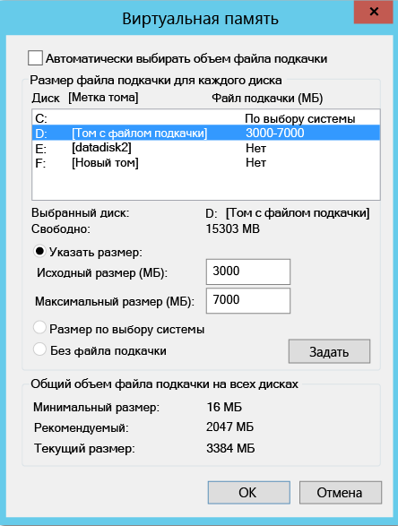
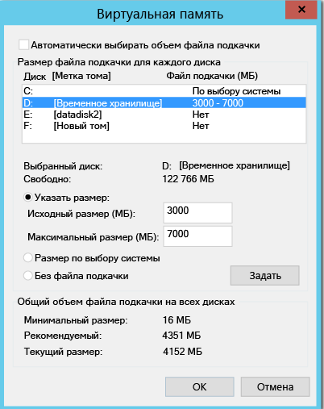
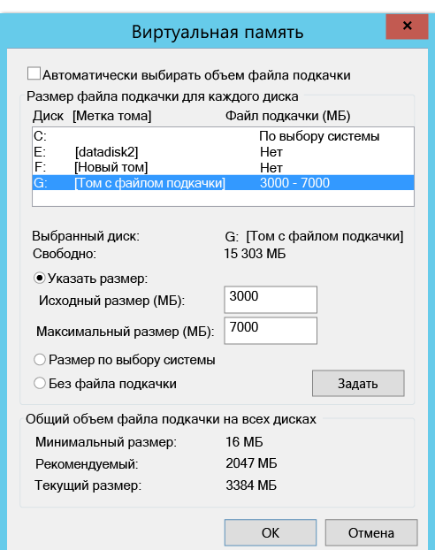
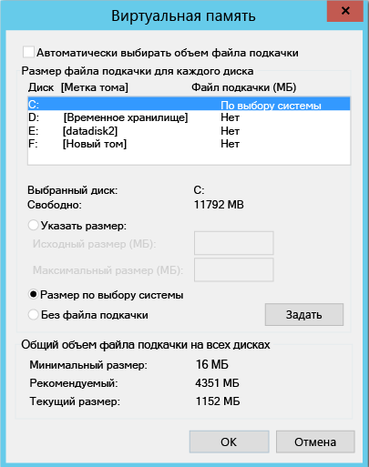

#Исключение дисков из репликации
В этой статье описывается, как исключить диски из репликации для оптимизации использования пропускной способности при репликации или оптимизации ресурсов целевой стороны, используемой этими дисками. Эта функция поддерживается для сценариев репликации из VMware в Azure и из Hyper-V в Azure.

##Предварительные требования

По умолчанию реплицируются все диски на компьютере. Чтобы исключить диск из репликации, необходимо установить вручную на компьютер службу Mobility Service до включения репликации (при репликации из **VMware в Azure**).

## Зачем исключать диски из репликации
Исключение дисков из репликации часто бывает необходимо:

1. Если данные, находящиеся на исключенных дисках, не важны или их репликация не требуется.

2. Ресурсы хранилища и сети можно сохранять, не реплицируя данные этого потока.

##Стандартные сценарии
Существуют конкретные примеры потоков данных, которые можно легко идентифицировать и которые являются подходящими для исключения, например данные файлов подкачки, записи tempdb Microsoft SQL Server и т. д. В зависимости от рабочей нагрузки и подсистемы хранилища файл подкачки может регистрировать значительный поток данных. Для репликации таких данных из основного сайта в Azure понадобится много ресурсов. Таким образом, можно оптимизировать репликацию виртуальной машины с одним виртуальным диском, содержащим операционную систему и файл подкачки, следующим образом:

1. Путем разделения одного виртуального диска на два (один с операционной системой, а другой с файлом подкачки).
2. Путем исключения из репликации диска с файлом подкачки.

Microsoft SQL Server с файлом tempdb и файлом системной базы данных на одном диске можно оптимизировать следующим образом:

1. За счет хранения системной базы данных и tempdb на двух различных дисках.
2. Путем исключения из репликации диска с файлом tempdb.

##Как исключать диски из репликации

###VMware — Azure
На портале Azure Site Recovery выполните рабочий процесс [Включение репликации](site-recovery-vmware-to-azure.md#enable-replication) для защиты виртуальной машины. На шаге 4 этого процесса имеется столбец **Disk to replicate** (Диск для репликации), в котором можно указать диск, который будет исключен из репликации. По умолчанию выбраны все диски. Снимите флажок для диска, который требуется исключить, и выполните инструкции, чтобы включить репликацию. 

    
    
>[!NOTE]
> 
> * Исключать можно только те диски, которые уже установлены в службе Mobility. Службу Mobility Service необходимо установить вручную, так как механизм принудительной установки для нее можно использовать только после включения репликации.
> * Из репликации можно исключать только базовые диски. Диски операционной системы и динамический диск исключать нельзя.
> * После включения репликации добавить или удалить диски для репликации нельзя. Если вы хотите добавить или исключить диск, отключите защиту компьютера, а затем включите ее повторно.
> * Если вы исключили диск, необходимый для работы приложения, для выполнения реплицируемого приложения после отработки отказа в Azure вам необходимо будет создать его в Azure вручную. Кроме того, для создания диска во время отработки отказа компьютера вы можете интегрировать службу автоматизации Azure в план восстановления.
> * Виртуальная машина Windows: диски, создаваемые в Azure вручную, не восстанавливаются в исходном расположении. Например, если вы выполните отработку отказа трех дисков и создадите два диска непосредственно на виртуальной машине Azure, то восстановление размещения будет выполнено только для трех дисков, задействованных при отработке отказа. Восстановление размещения после сбоя или защита из локальной среды в Azure недоступны для дисков, созданных вручную.
> * Виртуальная машина Linux: диски, создаваемые в Azure вручную, восстанавливаются в исходном расположении. Например, если для трех дисков выполняется отработка отказа, а еще два создаются непосредственно в Azure, восстановление будет выполнено для всех пяти дисков. Диски, созданные вручную при восстановлении расположения, исключать нельзя.
> 

###Hyper-V в Azure
На портале Azure Site Recovery выполните рабочий процесс [Включение репликации](site-recovery-hyper-v-site-to-azure.md#step-6-enable-replication) для защиты виртуальной машины. На шаге 4 этого процесса имеется столбец **Disk to replicate** (Диск для репликации), в котором можно указать диск, который будет исключен из репликации. По умолчанию для репликации выбраны все диски. Снимите флажок для диска, который требуется исключить, и выполните инструкции, чтобы включить репликацию. 

    
>[!NOTE]
> 
> * Из репликации можно исключать только базовые диски. Нельзя исключить диск операционной системы. Также не рекомендуется исключать динамические диски. ASR не может определить, какой из виртуальных жестких дисков в гостевой виртуальной машине является базовым, а какой динамическим.  Если все зависимые динамические диски не исключены, защищенный динамический диск на виртуальной машине, используемой для отработки отказа, будет считаться неисправным и данные на нем будут недоступны.    
> * После включения репликации добавить или удалить диски для репликации нельзя. Если вы хотите добавить или исключить диск, отключите защиту виртуальной машины, а затем включите ее повторно.
> * Если вы исключили диск, необходимый для работы приложения, для выполнения реплицируемого приложения после отработки отказа в Azure вам необходимо будет создать его в Azure вручную. Кроме того, для создания диска во время отработки отказа компьютера вы можете интегрировать службу автоматизации Azure в план восстановления.
> * Диски, создаваемые в Azure вручную, не будут восстановлены в исходном расположении. Например, если вы выполните отработку отказа трех дисков и создадите два диска непосредственно на виртуальной машине Azure, восстановление размещения из Azure в Hyper-V будет выполнено только для трех дисков, задействованных при отработке отказа. Восстановление размещения после сбоя и обратная репликация из Hyper-V в Azure недоступны для дисков, созданных вручную.
 

##Полные сценарии исключения дисков
Рассмотрим два сценария, чтобы лучше понять функцию исключения дисков.

1. Диск tempdb SQL Server.
2. Диск файла подкачки.

###Исключение диска tempdb SQL Server
Рассмотрим виртуальную машину SQL Server с диском tempdb, который может быть исключен из репликации.

Имя виртуальной машины: диски базы данных SalesDB на исходной виртуальной машине.

**Имя диска** | **№ диска гостевой ОС** | **Буква диска** | **Тип данных на диске**
--- | --- | --- | ---
DB-Disk0-OS | Диск 0 | C:\ | Диск ОС
DB-Disk1| Диск 1 | D:\ | Системная база данных SQL и база данных пользователя Database1
DB-Disk2 (исключенный из репликации) | Диск 2 | E:\ | Временные файлы
DB-Disk3 (исключенный из репликации) | Диск 3 | F:\ | База данных tempdb SQL (путь к папке — F:\MSSQL\Data; запишите путь к папке перед началом отработки отказа\)
DB-Disk4 | Диск 4 |G:\ |База данных пользователя Database2

Так как поток данных на двух дисках виртуальной машины является временным, оставьте включенной репликацию для виртуальной машины SalesDB и исключите из репликации диски 2 и 3. Azure Site Recovery не будет реплицировать эти диски, и при переходе на другой ресурс эти диски не будут присутствовать на восстановленной в Azure виртуальной машине.

Диски на виртуальной машине Azure после отработки отказа:

**№ диска гостевой ОС** | **Буква диска** | **Тип данных на диске**
--- | --- | ---
Диск 0 |    C:\ | Диск ОС
Диск 1 |    E:\ | Временное хранилище (Azure добавляет этот диск и назначает ему первую доступную букву)
Диск 2 | D:\ | Системная база данных SQL и база данных пользователя Database1
Диск 3 | G:\ | База данных пользователя Database2

Так как диски 2 и 3 были исключены из репликации виртуальной машины SalesDB, "E:" является первой доступной буквой из списка. Azure назначает "E:" тому временного хранилища. Для всех реплицированных дисков буква диска не изменится.

Исключенный из репликации диск 3, который был диском базы данных tempdb SQL (путь к папке tempdb — F:\MSSQL\Data\), будет недоступен на восстановленной виртуальной машине. В результате служба SQL будет остановлена и ей понадобится путь F:\MSSQL\Data.

Существует два способа создания этого пути.

1. Добавьте новый диск и назначьте путь к папке tempdb.
2. Используйте существующий диск временного хранилища для пути к папке tempdb.

####Добавьте новый диск:

1. Запишите путь к tempdb.mdf и tempdb.ldf для базы данных SQL перед отработкой отказа.
2. На портале Azure добавьте новый диск для восстановленной виртуальной машины с размером, не меньшим, чем у исходного диска базы данных tempdb SQL (диск 3).
3. Войдите в систему виртуальной машины Azure. В консоли управления (diskmgmt.msc) диском выполните инициализацию и форматирование добавленного диска.
4. Назначьте букву диска, используемую для диска базы данных tempdb SQL ("F:").
5. Создайте папку для tempdb в томе "F:" (F:\MSSQL\Data).
6. Запустите службу SQL из консоли службы.

####Используйте существующий диск временного хранилища для пути к папке базы данных tempdb SQL.

1. Откройте консоль командной строки.
2. Запустите SQL Server в режиме восстановления из консоли командной строки.

        Net start MSSQLSERVER /f / T3608

3. Запустите следующую команду sqlcmd, чтобы изменить путь к tempdb на новый.

        sqlcmd -A -S SalesDB        **Use your SQL DBname**
        USE master;        
        GO        
        ALTER DATABASE tempdb        
        MODIFY FILE (NAME = tempdev, FILENAME = 'E:\MSSQL\tempdata\tempdb.mdf');
        GO        
        ALTER DATABASE tempdb        
        MODIFY FILE (NAME = templog, FILENAME = 'E:\MSSQL\tempdata\templog.ldf');        
        GO

4. Остановите службу Microsoft SQL Server.

        Net stop MSSQLSERVER
5. Запустите службу Microsoft SQL Server.

        Net start MSSQLSERVER

Обратитесь к следующим рекомендациям Azure для диска временного хранилища:

* Использование SSD на виртуальных машинах Azure для хранения базы данных TempDB SQL Server и расширений буферного пула.
* Рекомендации по оптимизации производительности SQL Server в виртуальных машинах Azure

###Восстановление размещения из Azure в локальную среду.
Теперь давайте разберемся, какие диски будут реплицированы при выполнении отработки отказа из Azure на локальную виртуальную машину VMware или узел Hyper-V. Диски, созданные в Azure вручную, не будут реплицированы. Например, если вы выполните отработку отказа трех дисков и создадите два диска непосредственно на виртуальной машине Azure, то восстановление размещения будет выполнено только для трех дисков, задействованных при отработке отказа. Восстановление размещения после сбоя или повторная защита из локальной среды в Azure недоступны для дисков, созданных вручную. Диски временного хранилища также не реплицируются в локальную среду.

####Восстановление размещения в исходном расположении (OLR)

В приведенном выше примере использовалась следующая конфигурация дисков виртуальной машины Azure:

**№ диска гостевой ОС** | **Буква диска** | **Тип данных на диске** 
--- | --- | --- 
Диск 0 | C:\ | Диск ОС
Диск 1 |    E:\ | Временное хранилище (Azure добавляет этот диск и назначает ему первую доступную букву)
Диск 2 |    D:\ | Системная база данных SQL и база данных пользователя Database1
Диск 3 |    G:\ | База данных пользователя Database2

####VMware — Azure
После выполнения восстановления в исходном расположении в конфигурации дисков восстановленной виртуальной машины отсутствуют исключенные из репликации диски. Это значит, что диски, которые были исключены из репликации из VMware в Azure, не будут доступны на восстановленной виртуальной машине. 

Диски, доступные после плановой отработки отказа из Azure на локальную виртуальную машину VMware (исходное расположение):

**№ диска гостевой ОС** | **Буква диска** | **Тип данных на диске** 
--- | --- | --- 
Диск 0 | C:\ | Диск ОС
Диск 1 |    D:\ | Системная база данных SQL и база данных пользователя Database1
Диск 2 |    G:\ | База данных пользователя Database2

####Hyper-V в Azure
После восстановления в исходном расположении конфигурация дисков восстановленной виртуальной машины остается такой же, как исходная конфигурация дисков виртуальной машины Hyper-V. Это значит, что диски, которые были исключены из сайта Hyper-V в Azure, будут доступны на восстановленной виртуальной машине.

Диски, доступные после плановой отработки отказа из Azure на локальную виртуальную машину Hyper-V (исходное расположение):

**Имя диска** | **№ диска гостевой ОС** | **Буква диска** | **Тип данных на диске**
--- | --- | --- | ---
DB-Disk0-OS | Диск 0 |    C:\ | Диск ОС
DB-Disk1 | Диск 1 | D:\ | Системная база данных SQL и база данных пользователя Database1
DB-Disk2 (исключенный из репликации) | Диск 2 | E:\ | Временные файлы
DB-Disk3 (исключенный из репликации) | Диск 3 | F:\ | База данных tempdb SQL (путь к папке — F:\MSSQL\Data\)
DB-Disk4 | Диск 4 | G:\ | База данных пользователя Database2

####Исключение диска файла подкачки

Рассмотрим виртуальную машину с диском файла подкачки, который может быть исключен из репликации.
Ниже приведены два возможных варианта.

####Вариант 1. Файл подкачки настроен на диске "D:"
Конфигурация дисков:

**Имя диска** | **№ диска гостевой ОС** | **Буква диска** | **Тип данных на диске**
--- | --- | --- | ---
DB-Disk0-OS | Диск 0 | C:\ | Диск ОС
DB-Disk1 (исключенный из репликации) | Диск 1 | D:\ | pagefile.sys
DB-Disk2 | Диск 2 | E:\ | Пользовательские данные 1
DB-Disk3 | Диск 3 | F:\ | Пользовательские данные 2

Параметры файла подкачки исходной виртуальной машины:

    

Диски, доступные на виртуальной машине Azure после отработки отказа из VMware или Hyper-V в Azure.
**Имя диска** | **№ диска гостевой ОС** | **Буква диска** | **Тип данных на диске**
--- | --- | --- | ---
DB-Disk0-OS | Диск 0 | C:\ | Диск ОС
DB-Disk1 | Диск 1 | D:\ | Временное хранилище: pagefile.sys
DB-Disk2 | Диск 2 | E:\ | Пользовательские данные 1
DB-Disk3 | Диск 3 | F:\ | Пользовательские данные 2

Так как диск 1 ("D:") был исключен из репликации, "D:" — первая буква диска, доступная в списке, и Azure назначит ее тому временного хранилища.  Так как диск "D:" доступен на виртуальной машине Azure, параметры файла подкачки виртуальной машины не изменятся.

Параметры файла подкачки виртуальной машины Azure:

####Вариант 2. Файл подкачки настроен на другом диске (отличном от диска "D:")

Конфигурация дисков исходной виртуальной машины:

**Имя диска** | **№ диска гостевой ОС** | **Буква диска** | **Тип данных на диске**
--- | --- | --- | ---
DB-Disk0-OS | Диск 0 | C:\ | Диск ОС
DB-Disk1 (исключенный из репликации) | Диск 1 | G:\ | pagefile.sys
DB-Disk2 | Диск 2 | E:\ | Пользовательские данные 1
DB-Disk3 | Диск 3 | F:\ | Пользовательские данные 2

Параметры файла подкачки локальной виртуальной машины:

Диски, доступные на виртуальной машине после отработки отказа из VMware или Hyper-V в Azure.

**Имя диска**| **№ диска гостевой ОС**| **Буква диска** | **Тип данных на диске**
--- | --- | --- | ---
DB-Disk0-OS | Диск 0  |C:\ |Диск ОС
DB-Disk1 | Диск 1 | D:\ | Временное хранилище: pagefile.sys
DB-Disk2 | Диск 2 | E:\ | Пользовательские данные 1
DB-Disk3 | Диск 3 | F:\ | Пользовательские данные 2

Так как "D:" — первая буква диска, доступная в списке, Azure назначит ее тому временного хранилища. Для всех реплицированных дисков буква диска не изменится. Так как диск "G:" недоступен, для файла подкачки система будет использовать диск "C:".

Параметры файла подкачки виртуальной машины Azure:

## Дальнейшие действия
Настроив и запустив развертывание, вы можете ознакомиться с [дополнительными сведениями](site-recovery-failover.md) о различных типах обработки отказа.

