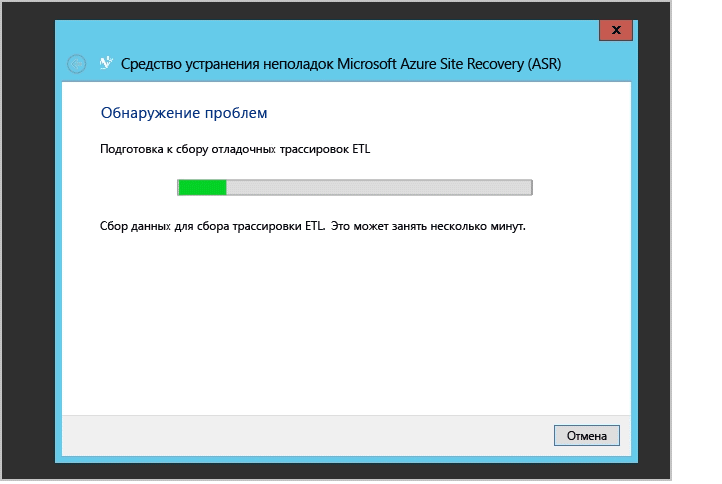

<properties
	pageTitle="Мониторинг и устранение неполадок защиты виртуальных машин и физических серверов | Microsoft Azure" 
	description="Служба Azure Site Recovery управляет репликацией, отработкой отказа и восстановлением виртуальных машин, размещенных на локальных серверах, с использованием Azure или дополнительного центра обработки данных. Эта статья поможет вам отслеживать и устранять неполадки при защите сайтов VMM или Hyper-V." 
	services="site-recovery" 
	documentationCenter="" 
	authors="anbacker" 
	manager="mkjain" 
	editor=""/>

<tags 
	ms.service="site-recovery" 
	ms.devlang="na"
	ms.topic="article"
	ms.tgt_pltfrm="na"
	ms.workload="storage-backup-recovery" 
	ms.date="12/14/2015" 
	ms.author="anbacker"/>
	
# Мониторинг и устранение неполадок защиты виртуальных машин и физических серверов

Это руководство по мониторингу и устранению неполадок позволяет узнать об отслеживании работоспособности репликации и способах устранения неполадок для Azure Site Recovery.

## Общие сведения о компонентах

### Развертывание сайта Hyper-V или физического сайта для репликации между локальными средами и Azure.
Для настройки DR между локальным компьютером VMware или физическим компьютером необходимо настроить сервер конфигурации, главный целевой сервер и сервер обработки. При включении защиты ля исходного сервера служба Azure Site Recovery установит службу Mobility Service. После локального отключения, когда исходный сервер перейдет в Azure, клиентам потребуется настроить сервер обработки в Azure и главный целевой сервер в локальной среде для защиты исходного сервера в перестроенной локальной среде.

### Развертывание сайта VMM для репликации между локальными средами

В ходе настройки аварийного восстановления между двумя локальными средами необходимо загрузить поставщика Azure Site Recovery и установить на сервере VMM. Поставщику требуется подключение к Интернету, чтобы все операции с портала Azure преобразовались в локальные операции, такие как включение защиты, завершение работы виртуальных машин на основном сервере в рамках отработки отказа и т. д.

### Развертывание сайта VMM для репликации между локальными средами и Azure

В ходе настройки аварийного восстановления между локальными средами и Azure необходимо загрузить поставщика Azure Site Recovery и установить на сервере VMM вместе с агентом служб восстановления Azure, который должен быть установлен на каждом узле Hyper-V. Дополнительные сведения см. в статье [Основные сведения о защите сайтов с помощью Azure](./site-recovery-understanding-site-to-azure-protection.md).

### Развертывание сайта Hyper-V для репликации между локальными средами и Azure

Это то же, что и развертывание VMM, только на самом узле Hyper-V устанавливается другой поставщик и агент. Дополнительные сведения см. в статье [Основные сведения о защите сайтов с помощью Azure](./site-recovery-understanding-site-to-azure-protection.md).

## Мониторинг операций настройки, защиты и восстановления

Каждая операция в ASR контролируется и отслеживается на вкладке «Задания». В случае возникновения какой-либо ошибки конфигурации, защиты или восстановления перейдите на вкладку «Задания» и проверьте, отображаются ли там сбои.

После обнаружения сбоя на вкладке «Задания» выберите задание и щелкните описание ошибки для этого задания.

Сведения об ошибке позволяют выявить возможные причины и рекомендации о проблеме.

В приведенном выше случае есть другая операция, которая выполняется в данный момент и из-за которой происходит сбой настройки защиты. Решите проблему рекомендуемым способом, а затем нажмите кнопку «Перезапуск» для повторного запуска операции.

Возможность перезапуска доступна не для всех операций. В случае операций без возможности перезапуска перейдите обратно к объекту и повторить операцию еще раз. Каждое задание можно отменить в любой момент времени во время выполнения, нажав кнопку «Отмена».

## Мониторинг работоспособности репликации для виртуальной машины

ASR предоставляет возможность центрального и удаленного мониторинга каждой защищенной сущности через портал Azure. Перейдите на вкладку «Защищенные элементы» и выберите «Облака VMM» или «Группы защиты». Вкладка «Облака VMM» предназначена только для развертывания на основе VMM, а для всех других сценариев защищенные сущности находятся на вкладке «Группы защиты».

Затем выберите защищенную сущность в соответствующем облаке или группе защиты. После выбора защищенной сущности все допустимые операции отображаются в нижней области.

Как показано выше, в случае виртуальной машины работоспособность крайне важна. Чтобы просмотреть ошибку, можно нажать кнопку «Сведения об ошибке», расположенную внизу. Устраните проблемы в соответствии с разделами "Возможные причины" и "Рекомендации".

Примечание. Если имеются какие-либо выполняющиеся или неудачно завершенные активные операции, перейдите на вкладку «Задания», как упоминалось ранее, чтобы просмотреть ошибку задания.

## Устранение неполадок локальной среды Hyper-V

Подключитесь к консоли диспетчера Hyper-V локальных сред, выберите виртуальную машину и проверьте работоспособность репликации.

В этом случае *работоспособность репликации* обозначена как критическая. Для просмотра дополнительных сведений нажмите *Просмотреть состояние работоспособности репликации*.

Если репликация виртуальной машины приостановлена, нажмите правую кнопку мыши и последовательно выберите параметры *Репликация*->*Возобновить репликацию* 

Перенос виртуальной машины на новый узел Hyper-V (в пределах одного и того же кластера или отдельного компьютера), настроенный с помощью ASR, не повлияет на репликацию. Убедитесь, что новый узел Hyper-V соответствует всем предварительным требованиям и настроен с помощью ASR.

### Журнал событий

| Источники событий | Сведения |
|-------------------------	|:------------------------------------------------------------------------------------------------------------------------------------------------------------------------------------------------------	|
| **Applications and Service Logs/Microsoft/VirtualMachineManager/Server/Admin** (сервер VMM) | Здесь представлены журналы, полезные для устранения множество проблем VMM. |
| **Applications and Service Logs/MicrosoftAzureRecoveryServices/Replication** (узел Hyper-V) | Здесь представлены журналы, полезные для устранения многих проблем агента служб восстановления Microsoft Azure.    |
| **Applications and Service Logs/Microsoft/Azure Site Recovery/Provider/Operational** (узел Hyper-V) | Здесь представлены журналы, полезные для устранения многих проблем службы восстановления сайта Microsoft Azure.    |
| **Applications and Service Logs/Microsoft/Windows/Hyper-V-VMMS/Admin** (узел Hyper-V) | Здесь представлены журналы, полезные для устранения многих проблем, связанных с управлением виртуальной машины Hyper-V.    |

### Параметры ведения журнала репликации Hyper-V

Все события, относящиеся к реплике Hyper-V, записываются в журнал Hyper-V-VMMS\\Admin log, расположенный в папке **Applications and Services Logs\\Microsoft\\Windows**. Кроме того можно также включить аналитический журнал для Hyper-V-VMMS. Чтобы включить этот журнал, сначала убедитесь, что аналитический журнал и журнал отладки видны в средстве просмотра событий. Откройте средство просмотра событий, в **меню «Вид»** выберите **Отобразить аналитический и отладочный журналы**.

Аналитический журнал отображается в группе Hyper-V-VMMS.

В области **Действия** выберите **Включить журнал**. После включения журнала он отображается в **системном мониторе ** как сеанс трассировки событий в области **Группы сборщиков данных**.

Чтобы просмотреть собранные сведения, сначала остановите сеанс трассировки, отключив журнал. Затем сохраните журнал и снова откройте его в средстве просмотра событий или при необходимости используйте другие средства для его преобразования.

## Служба технической поддержки Майкрософт

### Сбор журналов

Защита сайтов VMM: см. [сбор журналов ASR с помощью средства Support Diagnostics Platform (SDP)](http://social.technet.microsoft.com/wiki/contents/articles/28198.asr-data-collection-and-analysis-using-the-vmm-support-diagnostics-platform-sdp-tool.aspx), предназначенного для сбора необходимых журналов.

Защита сайтов Hyper-V: скачайте [средство](https://dcupload.microsoft.com/tools/win7files/DIAG_ASRHyperV_global.DiagCab) и запустите его на узле Hyper-V для сбора журналов.

Сценарии для VMware или физических сайтов: см. [Сбор журналов Azure Site Recovery для защиты VMware и физических сайтов](http://social.technet.microsoft.com/wiki/contents/articles/30677.azure-site-recovery-log-collection-for-vmware-and-physical-site-protection.aspx) для сбора необходимых журналов.

Средство собирает журналы локально и сохраняет их в подпапку раздела **%LocalAppData%\\ElevatedDiagnostics** со случайным именем.

### Открытие запроса в службу поддержки

Чтобы создать запрос в службу поддержки по ASR, перейдите на страницу службы поддержки Azure по URL-адресу <http://aka.ms/getazuresupport>

## Статьи базы знаний

-   [Сохранение буквы диска для защищенных виртуальных машин, для которых выполнена отработка отказа или перенос в Azure](http://support.microsoft.com/kb/3031135)
-   [Управление локальными ресурсами для использования пропускной способности защищенной сети Azure](https://support.microsoft.com/kb/3056159)
-   [ASR: ошибка "не удается найти ресурс кластера" при попытке включить защиту для виртуальной машины](http://support.microsoft.com/kb/3010979)
-   [Общие сведения и руководство по устранению неполадок реплики Hyper-V](http://www.microsoft.com/en-in/download/details.aspx?id=29016) 

## Распространенные ошибки ASR и способы их устранения

Ниже приведены распространенные ошибки, с которыми вы можете столкнуться, и способы их устранения. Каждая ошибка описана на отдельной вики-странице.

### Общие сведения
-   НОВОЕ [Задания завершаются с ошибкой "Выполняется операция". Ошибка 505, 514, 532](http://social.technet.microsoft.com/wiki/contents/articles/32190.azure-site-recovery-jobs-failing-with-error-an-operation-is-in-progress-error-505-514-532.aspx)
-   НОВОЕ [Задания завершаются с ошибкой "Сервер не подключен к Интернету". Ошибка 25018](http://social.technet.microsoft.com/wiki/contents/articles/32192.azure-site-recovery-jobs-failing-with-error-server-isn-t-connected-to-the-internet-error-25018.aspx)

### Настройка
-   [Не удается зарегистрировать сервер VMM из-за внутренней ошибки. Пожалуйста, просмотрите представление заданий на портале Site Recovery для получения дополнительных сведений об этой ошибке. Запустите программу установки еще раз, чтобы зарегистрировать сервер.](http://social.technet.microsoft.com/wiki/contents/articles/25570.the-vmm-server-cannot-be-registered-due-to-an-internal-error-please-refer-to-the-jobs-view-in-the-site-recovery-portal-for-more-details-on-the-error-run-setup-again-to-register-the-server.aspx)
-   [Не удается установить подключение к хранилищу диспетчера восстановления Hyper-V. Проверьте параметры прокси-сервера или повторите попытку позже.](http://social.technet.microsoft.com/wiki/contents/articles/25571.a-connection-cant-be-established-to-the-hyper-v-recovery-manager-vault-verify-the-proxy-settings-or-try-again-later.aspx)

### Конфигурация
-   [Невозможно создать группу защиты: при получении списка серверов произошла ошибка.](http://blogs.technet.com/b/somaning/archive/2015/08/12/unable-to-create-the-protection-group-in-azure-site-recovery-portal.aspx)
-   [Кластер узлов Hyper-V содержит по крайней мере один статический сетевой адаптер, или ни на одном из подключенных адаптеров не настроено использование DHCP.](http://social.technet.microsoft.com/wiki/contents/articles/25498.hyper-v-host-cluster-contains-at-least-one-static-network-adapter-or-no-connected-adapters-are-configured-to-use-dhcp.aspx)
-   [VMM не имеет разрешений для выполнения действия.](http://social.technet.microsoft.com/wiki/contents/articles/31110.vmm-does-not-have-permissions-to-complete-an-action.aspx)
-   [Невозможно выбрать учетную запись хранения в подписке при настройке защиты](http://social.technet.microsoft.com/wiki/contents/articles/32027.can-t-select-the-storage-account-within-the-subscription-while-configuring-protection.aspx)

### Защита
- НОВОЕ [Ошибка включения защиты с сообщением "Не удалось настроить защиту для виртуальной машины". Ошибка 60007, 40003](http://social.technet.microsoft.com/wiki/contents/articles/32194.azure-site-recovery-enable-protection-failing-with-error-protection-couldn-t-be-configured-for-the-virtual-machine-error-60007-40003.aspx)
- НОВОЕ [Ошибка включения защиты с сообщением "Не удалось включить защиту для виртуальной машины". Ошибка 70094](http://social.technet.microsoft.com/wiki/contents/articles/32195.azure-site-recovery-enable-protection-failing-with-error-protection-couldn-t-be-enabled-for-the-virtual-machine-error-70094.aspx)
- НОВОЕ [Ошибка динамической миграции 23848 — виртуальная машина будет перемещена с использованием типа Live. Это может нарушить состояние защиты восстановления у виртуальной машины.](http://social.technet.microsoft.com/wiki/contents/articles/32021.live-migration-error-23848-the-virtual-machine-is-going-to-be-moved-using-type-live-this-could-break-the-recovery-protection-status-of-the-virtual-machine.aspx) 
- [Включение защиты не выполнено, поскольку на компьютере не установлен агент.](http://social.technet.microsoft.com/wiki/contents/articles/31105.enable-protection-failed-since-agent-not-installed-on-host-machine.aspx)
- [Не удается найти подходящий узел для реплики виртуальной машины из-за недостатка вычислительных ресурсов.](http://social.technet.microsoft.com/wiki/contents/articles/25501.a-suitable-host-for-the-replica-virtual-machine-can-t-be-found-due-to-low-compute-resources.aspx)
- [Не удается найти подходящий узел для реплики виртуальной машины из-за того, что не подключена ни одна логическая сеть.](http://social.technet.microsoft.com/wiki/contents/articles/25502.a-suitable-host-for-the-replica-virtual-machine-can-t-be-found-due-to-no-logical-network-attached.aspx)
- [Не удается подключиться к узлу реплики — невозможно установить соединение.](http://social.technet.microsoft.com/wiki/contents/articles/31106.cannot-connect-to-the-replica-host-machine-connection-could-not-be-established.aspx)

### Восстановление
- VMM не удалось завершить операцию узла
    -   [Отработка отказа на выбранную точку восстановления для виртуальной машины: общая ошибка доступа.](http://social.technet.microsoft.com/wiki/contents/articles/25504.fail-over-to-the-selected-recovery-point-for-virtual-machine-general-access-denied-error.aspx)
    -   [Hyper-V не удалось выполнить отработку отказа с использованием выбранной точки восстановления для виртуальной машины: операция прервана. Укажите более новую точку восстановления. (0x80004004)](http://social.technet.microsoft.com/wiki/contents/articles/25503.hyper-v-failed-to-fail-over-to-the-selected-recovery-point-for-virtual-machine-operation-aborted-try-a-more-recent-recovery-point-0x80004004.aspx)
    -   Подключение к серверу не может быть установлено (0x00002EFD)
        -   [Hyper-V не удалось включить обратную репликацию для виртуальной машины](http://social.technet.microsoft.com/wiki/contents/articles/25505.a-connection-with-the-server-could-not-be-established-0x00002efd-hyper-v-failed-to-enable-reverse-replication-for-virtual-machine.aspx)
        -   [Hyper-V не удалось включить репликацию для виртуальной машины.](http://social.technet.microsoft.com/wiki/contents/articles/25506.a-connection-with-the-server-could-not-be-established-0x00002efd-hyper-v-failed-to-enable-replication-for-virtual-machine-virtual-machine.aspx)
    -   [Не удалось выполнить отработку отказа для виртуальной машины.](http://social.technet.microsoft.com/wiki/contents/articles/25508.could-not-commit-failover-for-virtual-machine.aspx)
-   [План восстановления содержит виртуальные машины, которые еще не готовы для запланированной отработки отказа.](http://social.technet.microsoft.com/wiki/contents/articles/25509.the-recovery-plan-contains-virtual-machines-which-are-not-ready-for-planned-failover.aspx)
-   [Виртуальная машина не готова для запланированной отработки отказа.](http://social.technet.microsoft.com/wiki/contents/articles/25507.the-virtual-machine-isn-t-ready-for-planned-failover.aspx)
-   [Виртуальная машина не запущена и не отключена.](http://social.technet.microsoft.com/wiki/contents/articles/25510.virtual-machine-is-not-running-and-is-not-powered-off.aspx)
-   [На виртуальной машине произошла незапланированная операция, и не удалось выполнить отработку отказа](http://social.technet.microsoft.com/wiki/contents/articles/25507.the-virtual-machine-isn-t-ready-for-planned-failover.aspx)
-   Тестирование отработки отказа
    -   [Не удалось начать отработку отказа, так как выполняется тестовая отработка отказа.](http://social.technet.microsoft.com/wiki/contents/articles/31111.failover-could-not-be-initiated-since-test-failover-is-in-progress.aspx)
-   Новая информация. Время ожидания отработки отказа заканчивается (появляется сообщение "Завершилось время ожидания задачи PreFailoverWorkflow WaitForScriptExecutionTask") из-за настроек конфигурации в группе безопасности сети, связанной с виртуальной машиной или подсетью, к которой виртуальная машина принадлежит. Подробности см. в статье [Failover operation timed out due to "PreFailoverWorkflow task WaitForScriptExecutionTask timed out"](https://aka.ms/troubleshoot-nsg-issue-azure-site-recovery) (Завершилось время ожидания отработки отказа из-за ошибки "Завершилось время ожидания задачи PreFailoverWorkflow WaitForScriptExecutionTask").

### Сервер конфигурации, Сервер обработки, Главный целевой сервер
Сервер конфигурации (СК), Сервер обработки (СО), Главный целевой сервер (ГЦС)
-   [На узле ESXi, на котором работает PS/CS в виде виртуальной машины, произошел сбой с фиолетовым экраном смерти.](http://social.technet.microsoft.com/wiki/contents/articles/31107.vmware-esxi-host-experiences-a-purple-screen-of-death.aspx)

### Устранение неполадок после отработки отказа удаленного рабочего стола
-   Многие пользователи испытывают проблемы при подключении к виртуальной машине Azure после обработки отказа. [Используйте документ по устранению неполадок для подключения к виртуальной машине с помощью удаленного рабочего стола](http://social.technet.microsoft.com/wiki/contents/articles/31666.troubleshooting-remote-desktop-connection-after-failover-using-asr.aspx)

<!---HONumber=AcomDC_0615_2016-->