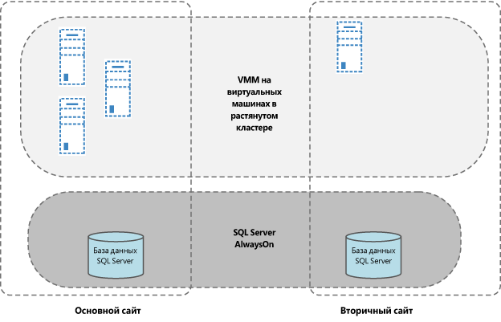
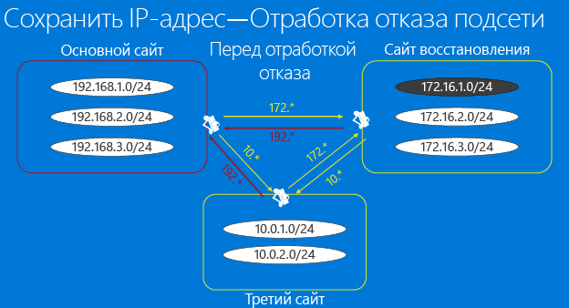
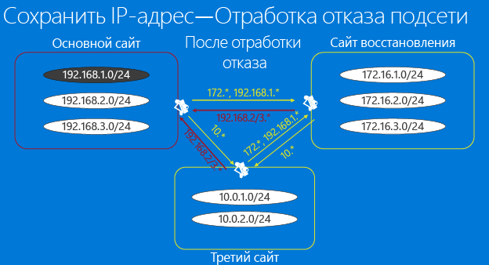
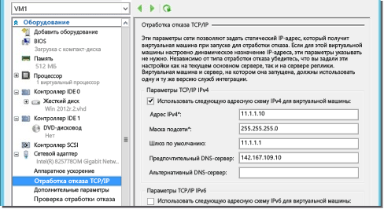
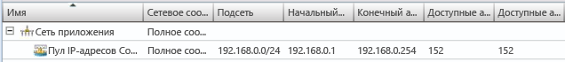
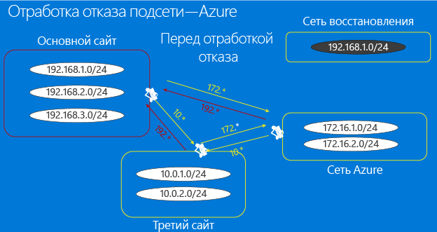
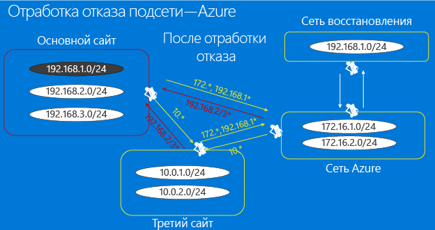
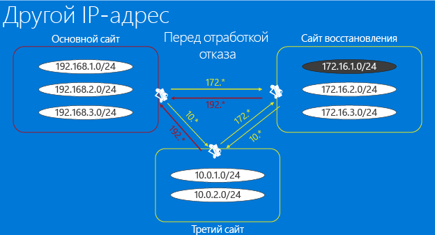
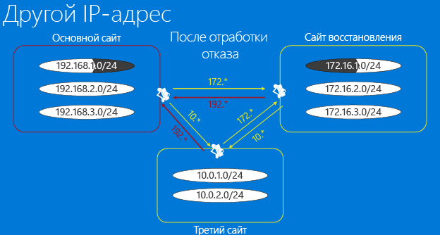

<properties
	pageTitle="Особенности инфраструктуры сети для Site Recovery | Microsoft Azure" 
	description="В этой статье обсуждаются практические вопросы проектирования сети для отработки отказа с помощью Site Recovery" 
	services="site-recovery" 
	documentationCenter="" 
	authors="rayne-wiselman" 
	manager="jwhit" 
	editor=""/>

<tags 
	ms.service="site-recovery" 
	ms.devlang="na"
	ms.topic="get-started-article"
	ms.tgt_pltfrm="na"
	ms.workload="storage-backup-recovery" 
	ms.date="12/14/2015" 
	ms.author="raynew"/>

#  Особенности инфраструктуры сети для Site Recovery

Служба Azure Site Recovery способствует работе надежного решения по обеспечению непрерывности бизнес-процессов и аварийного восстановления (BCDR). Она защищает ваши локальные физические серверы и виртуальные машины, выполняя оркестрацию, автоматическую репликацию и отработку отказа с переносом в Azure или в дополнительный локальный центр обработки данных.

Эта статья главным образом предназначена для специалистов по виртуализации, ответственных за разработку архитектуры, внедрение и поддержку решения BCDR и инфраструктуры, включающей System Center VMM и Azure Site Recovery.

## Обзор

Целью стратегии BCDR является поддержка работы ваших бизнес-приложений и восстановление сбойных рабочих нагрузок и служб, чтобы организация могла быстро возобновить нормальную работу. Разработка стратегий аварийного восстановления является сложной задачей из-за присущей этой работе сложности прогнозирования непредвиденных событий и высокой стоимости реализации адекватной защиты от серьезных сбоев. Azure Site Recovery позволяет реализовать защиту и переход от вашего основного центра обработки данных на вторичный центр обработки данных (или в Azure) путем первоначального копирования (репликации) основных данных и периодического последующего обновления реплик.

Одной из важнейших частей планирования решения BCDR, которую вам необходимо определить, является целевое время восстановления (RTO) и целевая точка восстановления (RPO), чтобы иметь возможность восстановить доступ к данным организации максимально быстро (с низким RTO) и минимальной потерей данных (низкая RPO). Архитектура сети организации является потенциально узким местом для вашего RTO и RPO. Правильное планирование архитектуры может помочь избежать этого.

Если вы решили использовать службу Azure Site Recovery для реализации защиты и отработки отказа, возникает ряд основных вопросов в отношении архитектуры сети для BCDR.

- **Архитектура VMM**: я использую System Center VMM. Как организовать архитектуру сети для интеграции VMM и Site Recover?
- **Подключения после отработки отказа**: я использую Site Recovery для запуска отработки отказа. Как обеспечить доступность моих рабочих нагрузок и приложений после завершения отработки отказа?

## Конструкция VMM

Вы можете разместить Site Recovery поверх существующей архитектуры VMM, независимо от того, сколько серверов VMM в ней используется.

### Автономный сервер VMM

В данной топологии вы развернете сервер VMM на виртуальной машине на основном объекте, а затем реплицируете эту виртуальную машину на вторичный объект с помощью Site Recovery и Hyper-V Replica. Можно рассмотреть возможность установки сервера VMM и SQL Server поддержки на одной виртуальной машине, благодаря чему можно сократить время простоя, поскольку нужно будет создать экземпляр только одной виртуальной машины. Если служба VMM использует удаленный SQL Server, то, прежде чем восстанавливать сервер VMM, потребуется сначала восстановить экземпляр SQL Server.

Развертывание одной VMM на виртуальной машине с Hyper-V Replica:

1. Настройте VMM на виртуальной машине с установленным SQL Server.
2. Добавьте узлы, которыми будете управлять, в облака на этом сервере VMM.
3. Войдите на портал Azure, а затем настройте облака для защиты.
4. Включите репликацию для всех виртуальных машин, которые должны быть защищены на сервере VMM.
5. Перейдите к консоли диспетчера Hyper-V, выберите Hyper-V Replica и включите репликацию на ВМ с VMM.
6. Убедитесь, что ВМ с VMM не добавлена в облака, которые защищены службой ASR, чтобы параметры репликации Hyper-V не переопределялись ASR.

В случае аварии рабочие нагрузки можно будет восстановить следующим образом.

1. Переключение реплики ВМ с VMM на объект восстановления с помощью диспетчера Hyper-V.
2. После восстановления виртуальной машины с VMM пользователь сможет войти в диспетчер восстановления Hyper-V со вторичного объекта.
3. После завершения незапланированной отработки отказа пользователям будут доступны все ресурсы на основном объекте.
4. Обратите внимание, что ВМ с VMM необходимо будет переключить на вторичный объект вручную и только после этого можно будет переключить рабочие нагрузки. 

### Кластеризованный сервер VMM

[Развертывание VMM в кластере](https://technet.microsoft.com/library/gg610675.aspx) обеспечивает высокую доступность и защиту от отработки отказа оборудования. Если вы выполняете развертывание кластера VMM со службой Site Recovery, обратите внимание на следующее.

Сервер VMM должен быть развернут в кластере, растянутом по географически разделенным объектам. База данных SQL Server, используемая VMM, должна быть защищена с помощью групп доступности SQL Server AlwaysOn с репликой на дополнительном сайте. В случае аварии сервер VMM и соответствующий SQL Server автоматически переключатся на объект восстановления. Затем можно будет выполнить переключение рабочих нагрузок с помощью Site Recovery.

## Подключения после отработки отказа

Современным приложениям практически всегда в той или иной степени требуется доступ к сети. Следовательно, физическое перемещение службы с одного объекта на другой снижает вероятность доступности приложений и рабочих нагрузок после отработки отказа. Существует два основных решения этой проблемы.

- **Фиксированные IP-адреса**: первый подход заключается во введении фиксированных IP-адресов. Несмотря на перенос служб и размещение серверов в разных физических местоположениях, приложения сохраняют IP-адреса в их в новом расположении.
- **Изменяемые IP-адреса**: второй подход требует изменения IP-адреса во время перехода на объект восстановления. 

### Вариант 1. Фиксированные IP-адреса

С точки зрения аварийного восстановления использование статических IP-адресов представляется самым простым способом для реализации. Однако существует несколько потенциальных проблем, из-за которых на практике этот способ является наименее популярным. Azure Site Recovery предоставляет возможность сохранять IP-адреса во всех сценариях. Прежде чем вы примете решение использовать этот подход, давайте рассмотрим вопросы для основных сценариев (растянутая подсеть и отработки отказа в подсети).

#### Растянутая подсеть

В растянутой подсети подсеть доступна одновременно и в основном и в целевом расположении. Проще говоря, это означает, что вы можете переместить сервер и его конфигурацию IP-адреса (уровень 3) на вторичный объект, а сеть направит трафик в новое местоположение автоматически. Это является простейшей задачей с точки зрения сервера, но несет с собой ряд проблем.

- С точки зрения уровня 2 (уровень канала передачи данных) требуется сетевое оборудование, которое может управлять растянутой VLAN, хотя оборудование такого типа в настоящее время общедоступно.
- Вторая и более сложная проблема заключается в том, что при растягивании VLAN потенциальная возможность домена сбоя будет затрагивать оба объекта, которые, по сути, становятся единой точкой отказа. Хотя это маловероятно, может произойти сетевая буря, которую не получится изолировать. Наблюдались смешанные оценки данной проблемы: от "успешно реализовано" до "никогда".
- Создать растянутую подсеть невозможно, если вы используете Azure в объектах аварийного восстановления.

#### Отработка отказа подсети

Возможно реализовать отработку отказа подсети для получения преимуществ растянутой подсети без ее фактического растягивания. В этой конфигурации все данные подсети присутствуют на объекте 1 или 2, но никогда на обоих объектах одновременно. Чтобы сохранить пространство IP-адресов при отработке отказа, программными средствами можно сделать так, чтобы инфраструктура маршрутизаторов перемещала подсети с одного объекта на другой. В случае отработки отказа подсети перемещаются вместе со связанными с ними защищенными виртуальными машинами. Основным недостатком этого подхода является то, что в случае сбоя необходимо переместить всю подсеть, что, возможно, и является приемлемым решением, но может повлиять на гранулярность отработки отказа.

Давайте рассмотрим, как вымышленное предприятие (Contoso) может реплицировать свои виртуальные машины в предназначенное для восстановления расположение, переключая при этом всю подсеть. Мы посмотрим, как Contoso сможет управлять своими подсетями во время репликации виртуальных машин между двумя локальными расположениями, и обсудим, как работает отработка переключения подсетей при использовании Azure в качестве объекта для аварийного восстановления.

##### Пример — переключение подсети на предприятии
 
- На основном объекте приложения работают в подсети 192.168.1.0/24.
- Происходит отработка отказа всей подсети, при этом все имеющиеся в подсети виртуальные машины переносятся на объект восстановления с сохранением своих IP-адресов.
- Как показано на приведенной далее схеме, маршруты между основным объектом и объектом восстановления, третьим и основным объектами, а также третьим объектом и объектом восстановления необходимо соответствующим образом изменить, чтобы отразить тот факт, что все виртуальные машины, принадлежащие подсети 192.168.1.0/24, были перемещены на объект восстановления.
- Эта диаграмма предполагает следующее.
	-  Каждый центр обработки данных обслуживается собственным экземпляром VMM. Репликация баз данных System Center VMM между центрами обработки данных производиться не будет.
	-  Каждый центр обработки данных использует статические IP-адреса для виртуальных машин.
	-  Подключения между центрами обработки данных осуществляются посредством выделенного канала, а не через VPN-подключения к сети Интернет.

**Перед выполнением отработки отказа**

**После выполнения отработки отказа**

При включении защиты для конкретной виртуальной машины Site Recovery выделяет сетевые ресурсы следующим образом.

1. Site Recovery выделяет IP-адреса для каждого сетевого интерфейса на виртуальной машине из пула статических IP-адресов, определенного на соответствующей сети для каждого экземпляра VMM.
2. Если администратор определяет тот же пул IP-адресов, который используется на основном объекте, для сети на объекте восстановления Site Recovery выделит тот же IP-адрес, который был назначен основной виртуальной машине, реплике виртуальной машины. Этот IP-адрес зарезервирован в VMM, но не задан как IP-адрес отработки отказа. IP-адрес отработки отказа задается непосредственно перед отработкой отказа. На этом снимке экрана показаны параметры TCP/IP для реплики виртуальной машины (на консоли Hyper-V). Эти параметры реплицируются непосредственно перед началом отработки отказа для виртуальной машины.

	

3. Если же IP-адрес недоступен, Site Recovery выделит другой адрес из пула.
4. После включения виртуальной машины для защиты вы можете использовать следующий образец скрипта для проверки IP-адреса, назначенного виртуальной машине. Тот же IP-адрес будет задан в качестве IP-адреса отработки отказа и назначен виртуальной машине во время отработки отказа.

    $vm = Get-SCVirtualMachine -Name $na = $vm[0].VirtualNetworkAdapters $ip = Get-SCIPAddress -GrantToObjectID $na[0].id $ip.address

Обратите внимание, что, если виртуальные машины используют DHCP, управление IP-адресами не выполняется службой Site Recovery. Необходимо убедиться, что DHCP-сервер, выделяющий IP-адреса на объекте восстановления, может выделять адреса из того же диапазона, который используется на основном объекте.

##### Пример — переключение подсети в Azure

При отработке отказа в Azure есть несколько дополнительных ограничений. Рассмотрим вымышленную компанию (Woodgrove Bank) с локальной инфраструктурой, в которой размещены их профильные бизнес-приложения и мобильные приложения, размещаемые в Azure.

- Связь между виртуальными машинами компании Woodgrove Bank в Azure и на локальных серверах осуществляется через сеть VPN, представляющую виртуальную сеть в Azure в качестве расширения локальной сети Woodgrove Bank. 
- Компания Woodgrove хочет использовать Site Recovery для репликации своих локальных рабочих нагрузок в Azure. 
- В компании Woodgrove используются приложения и конфигурации, зависящие от жестко определенных IP-адресов, т. е. им необходимо сохранить IP-адреса для своих приложений после отработки отказа в Azure.
- Локальная инфраструктура в компании Woodgrove управляется сервером VMM 2012 R2.
- Логическая сеть VLAN (сеть приложений) была создана на сервере VMM.
- Сеть виртуальных машин (сеть виртуальных машин приложения) была создана с помощью логической сети.
- Все виртуальные машины в приложении используют статические IP-адреса, поэтому пул статических IP-адресов также определяется для логической сети. 
- Компания Woodgrove назначает IP-адреса из диапазона IP-адресов (172.16.1.0/24, 172.16.2.0/24) своим ресурсам в Azure.

Для развертывания репликации и сохранения IP-адресов компании Woodgrove необходимо следующее.

- Виртуальная машина Azure — это расширение локальной сети. Таким образом, приложения могут быть просто перемещены.
- Обратите внимание, что при настройке подключения "сеть-сеть" в Azure сеть Azure позволяет направить трафик в локальное расположение (Azure называет его "локальная система ― сеть") только в том случае, если диапазон IP-адресов отличается от диапазона IP-адресов локальной сети, так как Azure не поддерживает растягивание подсетей. Это означает, что при наличии локальной подсети 192.168.1.0/24 нельзя добавить локальную сеть 192.168.1.0/24 в сеть Azure. Это происходит, поскольку Azure не знает, что в подсети нет активных виртуальных машин и что подсеть создается только в целях аварийного восстановления данных. Чтобы иметь возможность правильно направлять сетевой трафик из сети Azure, подсети в локальной сети и сети не должны конфликтовать. 
- Нам потребуется создать дополнительную сеть в Azure (сеть восстановления), где будут созданы виртуальные машины для отработки отказа.

	

- Чтобы убедиться, что IP-адрес для виртуальной машины сохранен, в свойствах виртуальной машины в Site Recovery необходимо будет указать, что следует использовать тот же IP-адрес. Затем после отработки отказа Site Recovery назначит указанный IP-адрес виртуальной машине.

- Если инициируется отработка отказа и виртуальные машины создаются в сети восстановления с требуемыми IP-адресами, подключение к виртуальной машине может быть установлено с помощью. Это действие можно включить в скрипт. Как уже говорилось в предыдущем разделе об отработке отказа подсети, а также в случае отработки отказа в Azure маршруты необходимо будет соответствующим образом изменить, чтобы отразить тот факт, что подсеть 192.168.1.0/24 теперь перемещена в Azure.

### Вариант 2. Измененные IP-адреса

Такой подход является наиболее распространенным и означает, что IP-адрес каждой перемещаемой виртуальной машины будет изменен. Основной недостаток этого подхода заключается в том, что сетевая инфраструктура должна быть готова к изменению IP-адресов, а DNS-записи, как правило, должны быть изменены или сброшены во всей сети, как и кэшированные записи в сетевых таблицах. Это может повлечь за собой увеличение времени простоя в зависимости от настройки инфраструктуры DNS. Частично этого можно избежать за счет использования низких значений TTL в случае приложений интрасети и [диспетчера трафика Azure с Site Recovery](https://azure.microsoft.com/blog/2015/03/03/reduce-rto-by-using-azure-traffic-manager-with-azure-site-recovery/) для интернет-приложений.

#### Пример: изменяемые IP-адреса

Давайте рассмотрим этот сценарий с примером, в котором присутствует третий объект, с которого может быть получен доступ к приложениям, расположенным на первичном объекте или объекте восстановления.

- Некоторые приложения размещены в подсети 192.168.1.0/24 на первичном объекте, они были настроены для запуска на объекте восстановления в подсети 172.16.1.0/24 после отработки отказа.
- VPN-подключения/сетевые маршруты были настроены так, чтобы все три объекта могли иметь доступ друг к другу. 
- После отработки отказа одного или нескольких приложений они будут восстановлены в подсети восстановления. В этом случае нет необходимости в одновременном переносе всей подсети и изменении конфигурации VPN или сетевых маршрутов.
- Отработка отказа и некоторые обновления DNS обеспечат доступность приложений. Если на DNS-сервере разрешены динамические обновления, виртуальные машины будут регистрировать себя, используя новый IP-адрес при запуске сразу после отработки отказа.

	

- После отработки отказа реплика виртуальной машины должна иметь IP-адрес, не совпадающий с IP-адресом основной виртуальной машины.
- Виртуальные машины обновят используемый DNS-сервер после запуска. Записи DNS обычно должны быть изменены или сброшены во всей сети, а кэшированные записи в сетевых таблицах должны быть обновлены или сброшены, поэтому при изменении данных состояний простой возникает нередко. Этого можно частично избежать следующим образом.

	- Использование низких значений TTL для приложений интрасети.
	- С помощью [диспетчера трафика Azure, используемого с Site Recovery](https://azure.microsoft.com/blog/2015/03/03/reduce-rto-by-using-azure-traffic-manager-with-azure-site-recovery/ для интернет-приложений).
	- С помощью следующего скрипта в плане восстановления для обновления DNS-сервера, чтобы обеспечить своевременное обновление (скрипт не требуется, если настроена динамическая регистрация DNS)

    [string]$Zone, [string]$name, [string]$IP ) $Record = Get-DnsServerResourceRecord -ZoneName $zone -Name $name $newrecord = $record.clone() $newrecord.RecordData[0].IPv4Address = $IP Set-DnsServerResourceRecord -zonename $zone -OldInputObject $record -NewInputObject $Newrecord

#### Пример — отработка отказа в Azure

В [записи блога](https://azure.microsoft.com/blog/2014/09/04/networking-infrastructure-setup-for-microsoft-azure-as-a-disaster-recovery-site/) "Настройка инфраструктуры сети в Azure в качестве объекта аварийного восстановления" описана установка необходимой сетевой инфраструктуры Azure, если сохранение IP-адресов не является обязательным требованием. Она начинается с описания приложения и затем рассматривается настройка сети локально и в Azure. Приводятся инструкции по выполнению теста отработки отказа и плановой отработки отказа.

## Дальнейшие действия

[Узнайте](site-recovery-network-mapping.md), как Site Recovery сопоставляет исходные и целевые сети.

<!---HONumber=AcomDC_0128_2016-->