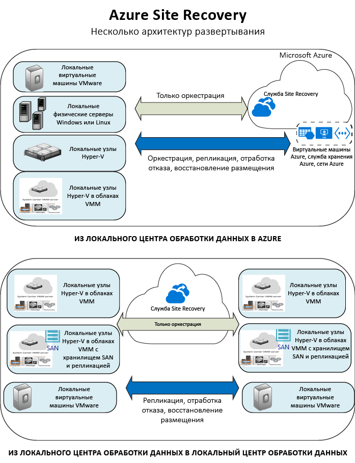

<properties
	pageTitle="Что такое Site Recovery? | Microsoft Azure" 
	description="Azure Site Recovery координирует репликацию, отработку отказа и восстановление виртуальных машин и физических серверов, размещенных на локальных серверах, в Azure или дополнительный локальный узел." 
	services="site-recovery" 
	documentationCenter="" 
	authors="rayne-wiselman" 
	manager="jwhit" 
	editor=""/>

<tags 
	ms.service="site-recovery" 
	ms.devlang="na"
	ms.topic="get-started-article"
	ms.tgt_pltfrm="na"
	ms.workload="storage-backup-recovery" 
	ms.date="02/22/2016" 
	ms.author="raynew"/>

#  Что такое Site Recovery?

Служба Azure Site Recovery помогает реализовать стратегии непрерывности бизнес-процессов и аварийного восстановления, управляя процессами репликации, отработки отказа и восстановления виртуальных машин и физических серверов. Виртуальные машины можно реплицировать в Azure или в дополнительный локальный центр обработки данных. [Здесь](site-recovery-faq.md) можно найти ответы на некоторые наиболее распространенные вопросы.

## Зачем использовать Site Recovery? 

- **Упрощение процессов BCDR** — Site Recovery позволяет легко выполнять репликацию, отработку отказа и восстановление локальных рабочих нагрузок и приложений.
- **Гибкая репликация** — вы можете реплицировать локальные серверы, виртуальные машины Hyper-V и виртуальные машины VMware. Site Recovery применяет смарт-репликацию, используя только блоки данных, а не весь виртуальный жесткий диск, для начальной репликации. Текущая репликация применяется только к разностным изменениям. Служба Site Recovery поддерживает автономную передачу данных и совместима с оптимизаторами WAN. 
- **Устранение потребности в дополнительном центре обработки данных** — хотя Site Recovery может автоматизировать репликацию между центрами обработки данных, она также позволяет обойтись без дополнительного локального расположения при репликации в Azure. Реплицированные данные хранятся в отказоустойчивой службе хранилища Azure.

## Сценарии развертывания

В следующей таблице перечислены сценарии репликации, поддерживаемые службой Site Recovery.

**REPLICATE** | **РЕПЛИКАЦИЯ ИЗ** | **РЕПЛИКАЦИЯ В** | **СТАТЬЯ**
---|---|---|---
Виртуальные машины VMware | Локальный сервер VMware | Хранилище Azure | [Развертывание](site-recovery-vmware-to-azure-classic.md)
Физический сервер Windows или Linux | Локальный физический сервер | Хранилище Azure | [Развертывание](site-recovery-vmware-to-azure-classic.md)
Виртуальные машины Hyper-V | Локальный сервер Hyper-V в облаке VMM | Хранилище Azure | [Развертывание](site-recovery-vmm-to-azure.md)
Виртуальные машины Hyper-V | Локальный сайт Hyper-V (один или несколько серверов Hyper-V) | Хранилище Azure | [Развертывание](site-recovery-hyper-v-site-to-azure.md)
Локальные виртуальные машины Hyper-V| Локальный сервер Hyper-V в облаке VMM | Локальный сервер Hyper-V в облаке VMM, размещенный в дополнительном центре обработки данных | [Развертывание](site-recovery-vmm-to-vmm.md)
Виртуальные машины Hyper-V | Локальный сервер Hyper-V в облаке VMM с хранилищем SAN| Локальный сервер Hyper-V в облаке VMM с хранилищем SAN, размещенный в дополнительном центре обработки данных | [Развертывание](site-recovery-vmm-san.md)
Виртуальные машины VMware | Локальный сервер VMware | Дополнительный центр обработки данных под управлением VMware | [Развертывание](site-recovery-vmware-to-vmware.md) 
Физический сервер Windows или Linux | Локальный физический сервер | Второстепенный центр обработки данных | [Развертывание](site-recovery-vmware-to-vmware.md) 

Ниже представлены диаграммы, которые иллюстрируют эти сценарии.

## Какие рабочие нагрузки я могу защитить?

Site Recovery помогает вам обеспечить непрерывность бизнес-процессов с учетом специфики модулей. Site Recovery можно использовать для оркестрации аварийного восстановления приложений Windows и сторонних производителей. Защита с учетом специфики приложений имеет следующие характеристики.

- Практически синхронная репликация — значение RPO (целевых точек восстановления) составляет всего 30 секунд для Hyper-V, а для VMware поддерживается непрерывная репликация, что соответствует потребностям большинства важных приложений.
- Моментальные снимки с согласованием одноуровневых или n-уровневых приложений.
- Интеграция с SQL Server AlwaysOn, взаимодействие с другими технологиями репликации на уровне приложения, включая репликацию Active Directory, группы DAG Exchange и Oracle Data Guard.
- Гибкие планы восстановления, которые позволяют быстро и просто восстановить весь стек приложения. Поддерживается выполнение внешних сценариев и запуск действий вручную. 
- Дополнительные функции сетевого управления в Site Recovery и Azure упрощают сетевые требования к приложениям, такие как резервирование IP-адресов, настройка балансировщиков нагрузки или интеграция диспетчера трафика Azure для переключения сетей с низким значением RTO (целевого времени восстановления).
- Обширная библиотека автоматизации, содержащая готовые к работе и учитывающие особенности приложений сценарии, которые можно загрузить и интегрировать с помощью Site Recovery.  

Дополнительные сведения см. в статье [Какие рабочие нагрузки можно защитить с помощью службы Azure Site Recovery?](site-recovery-workload.md)

## Дальнейшие действия

После прочтения этого обзора [ознакомьтесь](site-recovery-components.md) с архитектурой Site Recovery.
 

<!---HONumber=AcomDC_0224_2016-->