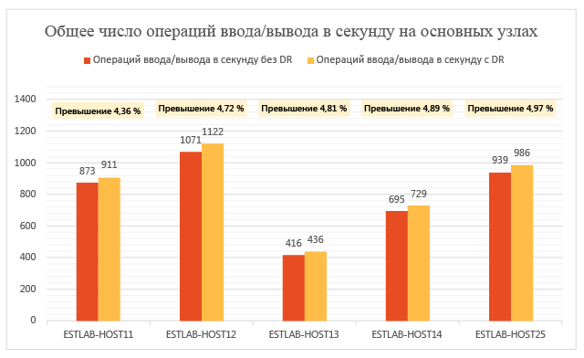
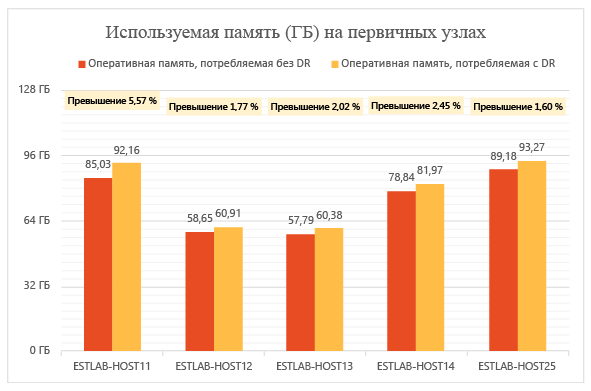
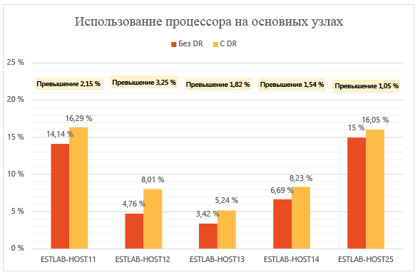
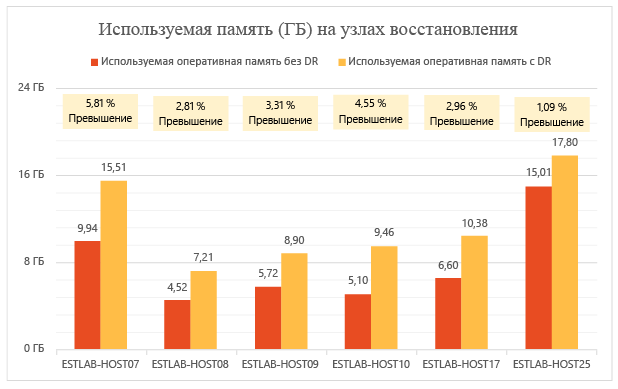
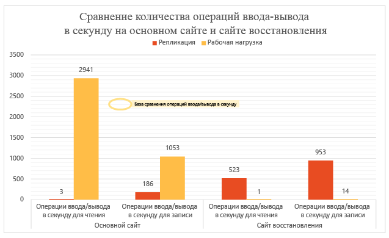
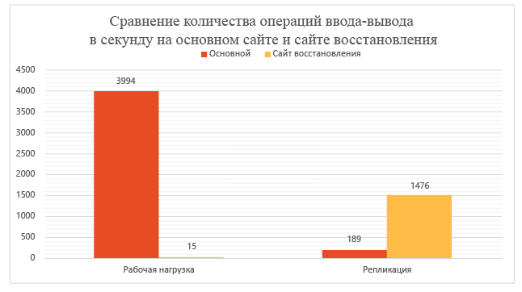
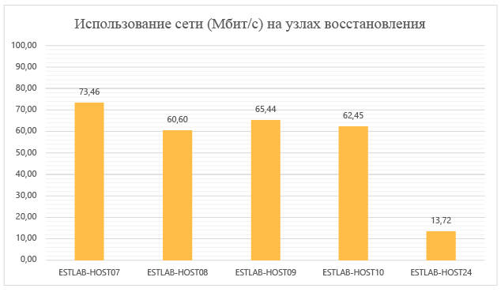
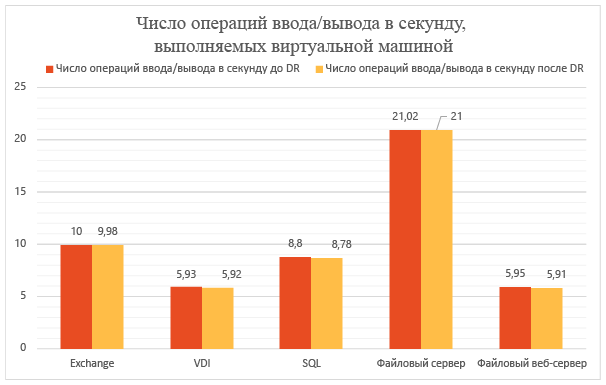
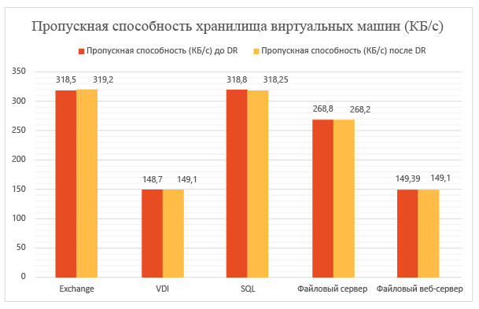
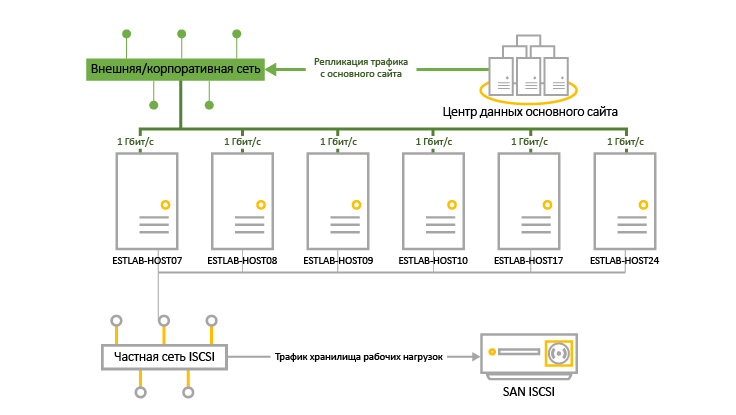

<properties
	pageTitle="Azure Site Recovery: тестирование производительности и масштабирования — перенос из локальной среды в локальную среду"
	description="В этой статье рассматривается то, как репликация с помощью Azure Site Recovery влияет на производительность на примере развертывания из локальной среды в локальную среду."
	services="site-recovery"
	documentationCenter=""
	authors="csilauraa"
	manager="jwhit"
	editor="tysonn"/>

<tags
	ms.service="site-recovery"
	ms.devlang="na"
	ms.topic="get-started-article"
	ms.tgt_pltfrm="na"
	ms.workload="storage-backup-recovery"
	ms.date="10/07/2015"
	ms.author="lauraa"/>

# Тестирование производительности и масштабирования: перенос из локальной среды в локальную среду

Microsoft Azure Site Recovery организует репликацию данных из основного центра обработки данных в другое расположение и управляет этим процессом репликации, чтобы в случае незапланированных отключений у вас всегда имелась резервная копия данных для восстановления. Можно выполнять резервное копирование локальных частных облаков, размещенных на диспетчере виртуальных машин System Center Virtual Machine Manager (VMM), в другое локальное расположение или в службу хранилища Microsoft Azure. Для репликации VMM применяет реплику Hyper-V. Это механизм, встроенный в Hyper-V в составе Windows Server 2012 и Windows Server 2012 R2. Он обеспечивает асинхронную репликацию виртуальных машин Hyper-V между двумя серверами размещения. Можно реплицировать любую серверную рабочую нагрузку, которую можно виртуализировать в Hyper-V. Репликация поддерживается в любой обычный IP-сети реплики. Hyper-V работает как с изолированными серверами и отказоустойчивыми кластерами, так и с их сочетаниями.

В этом разделе рассматривается то, как репликация с помощью Azure Site Recovery влияет на производительность на примере развертывания из локальной среды в локальную среду. В ней предоставлены подробные сведения о параметрах и настройках конфигурации, используемых в тестировании, показан этап тестового развертывания, а также приводятся подробные результаты тестирования.

## Цели тестирования

Цель — проверить, как ведет себя Azure Site Recovery при репликации устойчивого состояния. Репликация устойчивого состояния происходит, когда виртуальные машины завершили начальную репликацию и выполняют синхронизацию небольших изменений. Производительность важно измерять с помощью устойчивого состояния, поскольку это как раз то состояние, в котором большинство виртуальных машин остается до тех пор, пока не возникает непредвиденный простой.

## Выполнение тестового развертывания

Тестовое развертывание включает два локальных сайта, на каждом из которых имеется сервер VMM. Оба таких сервера VMM зарегистрированы в хранилище Azure Site Recovery. Такое тестовое развертывание является типичным для развертывания головного офиса и филиала, в котором первый выступает в качестве основного сайта, а филиал — как дополнительный сайт или сайт восстановления.

### Этапы тестового развертывания

1. Создание виртуальных машин с помощью шаблонов VMM.

1. Запуск виртуальных машин и отслеживание базовых показателей производительности каждые 12 часов.

1. Создание облаков на основном сервере VMM и сервере восстановления VMM.

1. Настройка защиты облака в Azure Site Recovery, включая сопоставление исходного облака и облака восстановления.

1. Включение защиты для виртуальных машин и предоставление им разрешения на выполнение начальной репликации.

1. Ожидание стабилизации системы в течение нескольких часов.

1. Собор метрик производительности каждые 12 часов для проверки того, что в течение этих 12 часов все виртуальные машины остаются в ожидаемом состоянии репликации.

1. Измерение разницы между базовыми метриками производительности и метриками производительности репликации.

## Результаты тестового развертывания

### Производительность основного сервера

- Реплика Hyper-V асинхронно отслеживает изменения в файле журнала с минимальным задействованием ресурсов хранилища на основном сервере.

- Реплика Hyper-V использует самоподдерживающий кэш памяти, чтобы свести к минимуму временные затраты на выполнение операций ввода-вывода в секунду для отслеживания. Она сохраняет операции записи в VHDX в памяти и записывает их в файл журнала перед отправкой журнала на сайт восстановления. Окончательная запись данных на диск также происходит в случае, если операции записи сталкиваются с предопределенным ограничением.

- На диаграмме ниже показаны временные затраты на выполнение операций ввода-вывода в секунду для репликации. Мы видим, что временные затраты на выполнение операций ввода-вывода в секунду для репликации составляют приблизительно 5 %, что довольно мало.

Реплика Hyper-V использует память на основном сервере для оптимизации производительности диска. Как показано на следующей диаграмме, временные затраты на использование памяти на всех серверах в основном кластере являются граничными. Временные затраты на использование памяти представлены в виде процента памяти, используемого репликацией, по отношению к общему объему памяти, который имеется на сервере Hyper-V.

Временные затраты на использование ресурсов ЦП репликой Hyper-V являются минимальными. Как показано на диаграмме ниже, временные затраты на репликацию находятся в диапазоне 2–3 %.

### Производительность дополнительного сервера (сервера восстановления)

Реплика Hyper-V использует небольшой объем памяти на сервере восстановления, чтобы оптимизировать числа операций сохранения. На диаграмме ниже представлены обобщенные данные об использовании памяти на сервере восстановления. Временные затраты на использование памяти представлены в виде процента памяти, используемого репликацией, по отношению к общему объему памяти, который имеется на сервере Hyper-V.

Объем операций ввода-вывода на сайте восстановления зависит от количества операций записи на основном сайте. Рассмотрим общее количество операций ввода-вывода на сайте восстановления по сравнению с общим количеством операций ввода-вывода и операций записи на основном сайте. На диаграмме показано, что итоговое количество операций ввода-вывода в секунду на сайте восстановления:

- приблизительно в 1,5 раза больше количества операций записи на основном сайте;

- составляет приблизительно 37 % от общего количества операций ввода-вывода в секунду на основном сайте.

### Влияние репликации на использование сети

Пропускная способность сети между основным узлом и узлом восстановления в среднем составила 275 МБ/с (с включенным сжатием данных) по отношению к существующей пропускной способности сети в 5 ГБ/с.

### Влияние репликации на производительность виртуальной машины

Важным аспектом является влияние репликации на выполнение рабочей нагрузки, назначенной виртуальным машинам. Если основной сайт правильно подготовлен для репликации, то не должно быть никакого влияния на рабочую нагрузку. Упрощенный механизм отслеживания реплики Hyper-V гарантирует, что рабочие нагрузки, выполняющиеся на виртуальных машинах, не будут затронуты репликацией устойчивого состояния. Это как раз иллюстрируется на следующих диаграммах.

На этой диаграмме показаны операции ввода-вывода в секунду, выполняемые виртуальными машинами с разными рабочими нагрузками до и после включения репликации. Можно заметить, что никаких различий между ними не наблюдается.

На следующей диаграмме показана пропускная способность виртуальных машин, на которых выполняются разные рабочие нагрузки до и после включения репликации. Можно видеть, что репликация не оказывает существенного влияния.

### Заключение

Результаты ясно показывают, что масштабирование Azure Site Recovery в сочетании с репликой Hyper-V выполняется с минимальными временными затратами для большого кластера. Azure Site Recovery обеспечивает простоту развертывания, репликации, управления и мониторинга. Реплика Hyper-V предоставляет необходимую инфраструктуру для успешного масштабирования репликации. Для планирования оптимального развертывания рекомендуется скачать [Планировщик ресурсов реплики Hyper-V](https://www.microsoft.com/RU-RU/download/details.aspx?id=39057).

## Среда тестового развертывания

### Основной сайт

- Основной сайт включает кластер, содержащий пять серверов Hyper-V, на которых выполняются 470 виртуальных машин.

- Виртуальные машины выполняют разную рабочую нагрузку и на них на всех включена защита Azure Site Recovery.

- Хранилище для узла кластера предоставляется сетью хранения данных iSCSI. Модель — Hitachi HUS130.

- Каждый сервер кластера оборудован четырьмя сетевыми картами (NIC) со скоростью передачи данных 1 Гбит/с.

- Две из них подключены к частной сети iSCSI, а другие две — к внешней корпоративной сети. Одна из внешних сетей зарезервирована исключительно для кластерных взаимодействий.

|сервер;|ОЗУ|Модель|Процессор|Количество процессоров|Сетевая карта|Программное обеспечение|
|---|---|---|---|---|---|---|
|Серверы Hyper-V в кластере:  ESTLAB HOST11 ESTLAB HOST12 ESTLAB HOST13 ESTLAB HOST14 ESTLAB-HOST25|На сервере 128ESTLAB-HOST25 имеется ОЗУ 256 МБ|Dell ™ PowerEdge ™ R820|ЦП Intel(R) Xeon(R) E5-4620 0 с тактовой частотой 2,20 ГГц|4\.|1 Гбит/с х 4|Windows Server Datacenter 2012 R2 (64-разрядная версия) + роль Hyper-V|
|Сервер VMM|2|||2|1 Гбит/с|Windows Server Database 2012 R2 (64-разрядная версия) + VMM 2012 R2|

### Дополнительный сайт (сайт восстановления)

- Дополнительный сайт включает отказоустойчивый кластер с шестью узлами.

- Хранилище для узла кластера предоставляется сетью хранения данных iSCSI. Модель — Hitachi HUS130.

|сервер;|ОЗУ|Модель|Процессор|Количество процессоров|Сетевая карта|Программное обеспечение|
|---|---|---|---|---|---|---|
|Серверы Hyper-V в кластере:  ESTLAB-HOST07 ESTLAB-HOST08 ESTLAB-HOST09 ESTLAB-HOST10|96|Dell ™ PowerEdge ™ R720|ЦП Intel(R) Xeon(R) E5-2630 0 с тактовой частотой 2,30 ГГц|2|1 Гбит/с х 4|Windows Server Datacenter 2012 R2 (64-разрядная версия) + роль Hyper-V|
|ESTLAB HOST17|128|Dell ™ PowerEdge ™ R820|ЦП Intel(R) Xeon(R) E5-4620 0 с тактовой частотой 2,20 ГГц|4\.||Windows Server Datacenter 2012 R2 (64-разрядная версия) + роль Hyper-V|
|ESTLAB HOST24|256|Dell ™ PowerEdge ™ R820|ЦП Intel(R) Xeon(R) E5-4620 0 с тактовой частотой 2,20 ГГц|2||Windows Server Datacenter 2012 R2 (64-разрядная версия) + роль Hyper-V|
|Сервер VMM|2|||2|1 Гбит/с|Windows Server Database 2012 R2 (64-разрядная версия) + VMM 2012 R2|

### Рабочие нагрузки сервера

- Для целей тестирования мы выбрали рабочие нагрузки, которые обычно используются в сценариях корпоративных клиентов.

- Мы используем [IOMeter](http://www.iometer.org) со сводной таблицей характеристик рабочей нагрузки для моделирования.

- Все профили IOMeter настроены на запись случайных байтов, чтобы смоделировать худшие варианты моделей записи для рабочих нагрузок.

|Рабочая нагрузка|Размер ввода-вывода (КБ)|% доступа|% чтения|Количество необработанных операций ввода-вывода|Модель операций ввода-вывода|
|---|---|---|---|---|---|
|Файловый сервер|48163264|60 %, 20 %, 5 %, 5 %, 10 %|80 %, 80 %, 80 %, 80 %, 80 %|88888|Все 100 % случайные|
|SQL Server (том 1), SQL Server (том 2)|864|100 %, 100 %|70 %, 0 %|88|100 % случайные, 100 % последовательные|
|Exchange|32|100 %|67 %|8|100 % случайные|
|Рабочая станция/VDI|464|66 %, 34 %|70 %, 95 %|11|100 % случайные (в обоих случаях)|
|Файловый веб-сервер|4864|33 %, 34 %, 33 %|95 %, 95 %, 95 %|888|Все 75 % случайные|

### Конфигурация виртуальной машины

- 470 виртуальных машин в основном кластере.

- Все виртуальные машины с диском VHDX.

- В таблице представлены сводные сведения о виртуальных машинах, выполняющих рабочие нагрузки. Все они созданы с помощью шаблонов VMM.

|Рабочая нагрузка|Количество виртуальных машин|Минимальный объем ОЗУ (ГБ)|Максимальный объем ОЗУ (ГБ)|Размер логического диска (ГБ) на виртуальную машину|Максимальное значение IOPS|
|---|---|---|---|---|---|
|SQL Server|51|1|4\.|167|10|
|Exchange Server|71|1|4\.|552|10|
|Файловый сервер|50|1|2|552|22|
|VDI|149|0,5|1|80|6|
|Веб-сервер|149|0,5|1|80|6|
|ВСЕГО|470|||96,83 ТБ|4108|

### Настройки Azure Site Recovery

- Azure Site Recovery был настроен на защиту с помощью переноса из локальной среды в локальную среду.

- На сервере VMM имеется четыре облака, в которых находятся серверы кластера Hyper-V и их виртуальные машины.

|Основное облако VMM|Защищенные виртуальные машины в облаке|Частота репликации|Дополнительные точки восстановления|
|---|---|---|---|
|PrimaryCloudRpo15m|142|15 мин|None|
|PrimaryCloudRpo30s|47|30 с|None|
|PrimaryCloudRpo30sArp1|47|30 с|1|
|PrimaryCloudRpo5m|235|5 мин|None|

### Метрики производительности

В таблице ниже перечислены метрики производительности и счетчики, которые оценивались в развертывании.

|Метрика|Счетчик|
|---|---|
|ЦП|\\Processor(\_Total)\\% загруженности процессора| |Доступная память|\\Память\\Доступно МБ| |Число операций ввода-вывода в секунду|\\PhysicalDisk(\_Total)\\Обращений к диску/с| |Операций чтения ВМ (IOPS)/сек|\\Виртуальное запоминающее устройство Hyper-V(<VHD>)\\Операций чтения/сек| |Операций записи ВМ (IOPS)/сек|\\Виртуальное запоминающее устройство Hyper-V(<VHD>)\\Операций записи/сек| |Пропускная способность чтения ВМ|\\Виртуальное запоминающее устройство Hyper-V(<VHD>)\\Прочитано байт/сек| |Пропускная способность записи ВМ|\\Виртуальное запоминающее устройство Hyper-V(<VHD>)\\Записано байт/сек|

## Дальнейшие действия

Статьи, посвященные началу развертывания ASR:

- [Настройка защиты между локальным сайтом VMM и Azure](site-recovery-vmm-to-azure.md)
- [Настройка защиты между локальным сайтом Hyper-V и Azure](site-recovery-hyper-v-site-to-azure.md)
- [Настройка защиты между локальными сайтами VMM](site-recovery-vmm-to-vmm.md)
- [Настройка защиты между двумя локальными сайтами VMM с помощью сети SAN](site-recovery-vmm-san.md)
- [Настройка защиты с одним сервером VMM](site-recovery-single-vmm.md)
 

<!---HONumber=Oct15_HO2-->