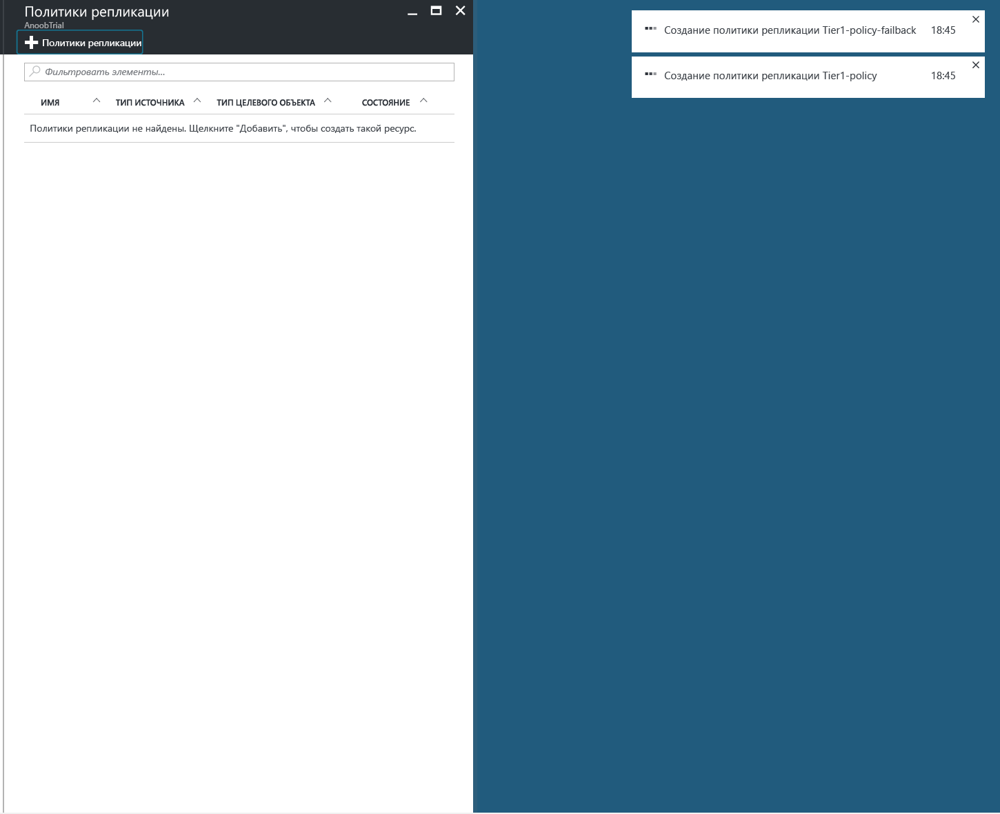
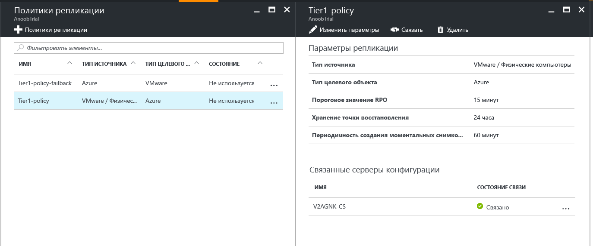
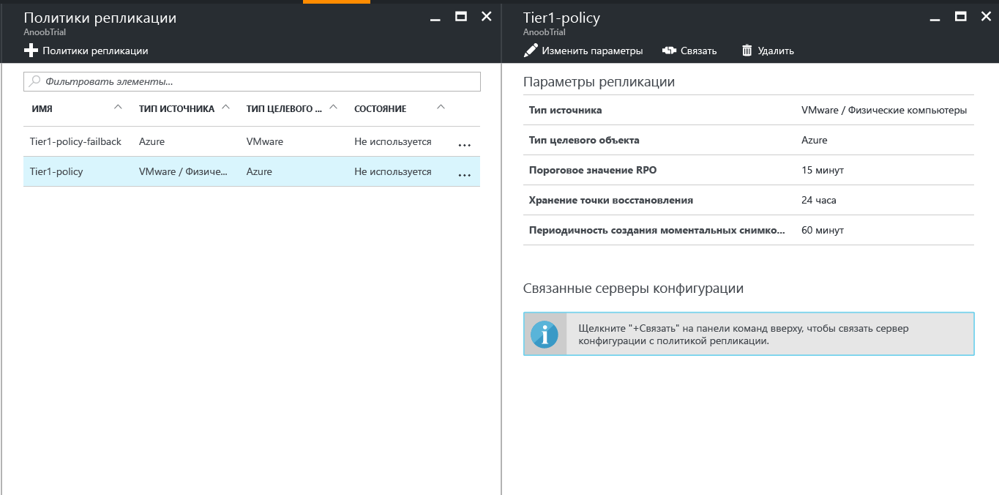
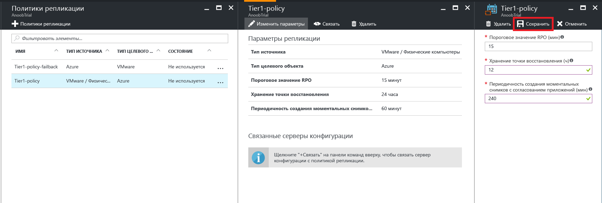

# Управление политикой репликации для VMware в Azure

## Создание политики репликации

1. Выберите **Управление** > **Site Recovery Infrastructure** (Инфраструктура Site Recovery).
2. В разделе **For VMware and Physical machines** (Для виртуальных машин VMware и физических компьютеров) выберите **Политики репликации**.
3. Щеклните **+Replication policy** (+ Политика репликации).

    

4. Введите имя политики.

5. В поле **Пороговое значение RPO**укажите предельное значение целевой точки восстановления (RPO). Если непрерывная репликация превышает это значение, выдаются оповещения.
6. В поле **Хранение точки восстановления** укажите период хранения каждой точки восстановления (в часах). Защищенные компьютеры будут восстанавливаться до любой точки в пределах этого периода.

    > [!NOTE]
    > Для компьютеров, реплицируемых в хранилище уровня "Премиум", поддерживается хранение до 24 часов. Для компьютеров, реплицируемых в хранилище уровня "Стандартный", поддерживается хранение до 72 часов.

    > [!NOTE]
    > Политика репликации для восстановления размещения создается автоматически.

7. В поле **Периодичность создания моментальных снимков с согласованием приложений** укажите, с какой периодичностью (в минутах) будут создаваться точки восстановления, содержащие моментальные снимки, согласованные на уровне приложений.

8. Последовательно выберите **ОК**. Политика будет создана в течение 30–60 секунд.

## Связывание сервера конфигурации с политикой репликации
1. Щелкните политику репликации, с которой вы хотите связать сервер конфигурации.
2. Щелкните **Связать**.

3. Выберите сервер конфигурации из списка серверов.
4. Последовательно выберите **ОК**. Связь сервера конфигурации с политикой будет задана в течение 1–2 минут.

## Изменение политики репликации
1. Щелкните политику репликации, для которой вы хотите изменить параметры репликации.

2. Нажмите **Изменить параметры**.

3. Измените параметры по своему усмотрению.
4. Выберите команду **Сохранить**. Политика будет сохранена в течение 2–5 минут в зависимости от количества виртуальных машин, использующих эту политику репликации.

## Отмена связи сервера конфигурации с политикой репликации
1. Щелкните политику репликации, с которой вы хотите связать сервер конфигурации.
2. Щелкните **Отменить связь**.
3. Выберите сервер конфигурации из списка серверов.
4. Последовательно выберите **ОК**. Связь сервера конфигурации с политикой будет отменена в течение 1–2 минут.

    > [!NOTE]
    > Если хотя бы один реплицируемый элемент использует политику, то вы не сможете отменить ее связь с сервером конфигурации. Прежде чем отменять связь политики с сервером, убедитесь, что ни один реплицируемый элемент не использует ее.

## Удаление политики репликации

1. Щелкните политику репликации, которую вы хотите удалить.
2. Нажмите кнопку **Delete**(Удалить). Политика будет удалена в течение 30–60 секунд.

    > [!NOTE]
    > Если с политикой репликации связан хотя бы один сервер конфигурации, вы не сможете удалить ее. Прежде чем удалять политику, убедитесь, что ни один реплицируемый элемент не использует ее, и удалите все связанные с ней серверы конфигурации.
