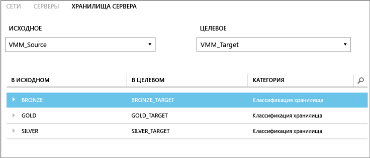
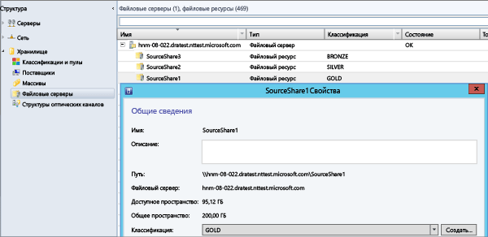

<properties
	pageTitle="Сопоставление хранилищ Site Recovery"
	description="Azure Site Recovery координирует репликацию, отработку отказа и восстановление виртуальных машин и физических серверов, размещенных на локальных серверах, в Azure или дополнительный локальный узел."
	services="site-recovery"
	documentationCenter=""
	authors="rayne-wiselman"
	manager="jwhit"
	editor=""/>

<tags
	ms.service="site-recovery"
	ms.devlang="na"
	ms.topic="get-started-article"
	ms.tgt_pltfrm="na"
	ms.workload="storage-backup-recovery"
	ms.date="08/05/2015"
	ms.author="raynew"/>

# Сопоставление хранилищ Site Recovery

Служба Azure Site Recovery помогает реализовать стратегии непрерывности бизнеса и восстановления после сбоев (BCDR), управляя процессами репликации, отработки отказа и восстановления виртуальных машин и физических серверов. Сведения о возможных сценариях развертывания см. в статье [Обзор Site Recovery](site-recovery-overview.md).

## Сведения об этой статье

Сопоставление хранилищ — важный элемент развертывания Site Recovery. Это гарантирует оптимальное использование хранилища. В этой статье описывается сопоставление хранилищ и представлено несколько примеров, которые помогут понять принцип его работы.

Вы можете задать любые вопросы на [форуме по Azure Recovery Services](https://social.msdn.microsoft.com/forums/azure/home?forum=hypervrecovmgr).

## Обзор

Способ настройки сопоставления хранилищ зависит от сценария развертывания Site Recovery.

- **Из локальной среды в локальную среду (репликация с помощью реплики Hyper-V)** — сопоставление классификаций хранилищ на исходном и целевом серверах VMM для решения следующих задач:

	- **Определение целевого хранилища для виртуальных машин реплики** — виртуальные машины будут реплицированы в выбранное целевое хранилище (общий ресурс SMB или общие тома кластера [CSV]).
	- **Размещение виртуальных машин реплики** — сопоставление хранилищ используется для оптимального размещения виртуальных машин реплики на серверах узлов Hyper-V. Виртуальные машины реплики будут размещены на узлах, которые имеют доступ к сопоставленной классификации хранилища.
	- **Без сопоставления хранилищ** — если не настроить сопоставление хранилищ, виртуальные машины будут реплицированы в хранилище по умолчанию, указанное на сервере узла Hyper-V, который связан с репликой виртуальной машины.

- **Из локальной среды в локальную среду (репликация с помощью SAN** — сопоставление пулов массивов хранения на исходном и целевом серверах VMM для решения следующих задач:
	- **Определение целевых пулов носителей** — сопоставление хранилищ гарантирует, что LUN в группе репликации будут реплицированы в сопоставленный целевой пул носителей.

## Классификации хранилищ

Необходимо сопоставить классификации хранилищ на исходном и целевом серверах VMM или на одном сервере VMM, если двумя сайтами управляет один и тот же сервер VMM. Если сопоставление настроено правильно и включена репликация, виртуальный жесткий диск виртуальной машины из основного расположения будет реплицирован в хранилище в сопоставленном целевом расположении. Обратите внимание на следующее:

- Классификации хранилищ должны быть доступны в группах размещения в исходном и целевом облаках.
- - Классификации не обязательно должны иметь одинаковый тип хранилища. Например, можно сопоставить исходную классификацию, содержащую общие папки SMB, с целевой классификацией, которая содержит CSV-файлы.
- Дополнительные сведения см. в статье [Создание классификаций хранилищ в VMM](https://technet.microsoft.com/library/gg610685.aspx).

## Пример

Если классификации правильно настроены в VMM, то при выборе исходного и целевого сервера VMM во время сопоставления хранилищ отображаются исходные и целевые классификации. Ниже приведен пример общих файловых ресурсов хранилища и классификаций для организации с местами хранения в Нью-Йорке и Чикаго.

**Расположение** | **Сервер VMM** | **Общая папка (исходная)** | **Классификация (исходная)** | **Сопоставление** | **Общая папка (целевая)**
---|---|--- |---|---|---
Нью-Йорк | VMM\_Source| SourceShare1 | GOLD | GOLD\_TARGET | TargetShare1
 | | SourceShare2 | SILVER | SILVER\_TARGET | TargetShare2
 | | SourceShare3 | BRONZE | BRONZE\_TARGET | TargetShare3
Чикаго | VMM\_Target | | GOLD\_TARGET | Не сопоставлена |
| | | SILVER\_TARGET | Не сопоставлена |
 | | | BRONZE\_TARGET | Не сопоставлена

Их следует настроить на портале Site Recovery (страница **Ресурсы**, вкладка **Хранилище сервера**).

В этом примере показано следующее. Если виртуальная машина реплики создается для любой виртуальной машины в хранилище GOLD (SourceShare1), то такая реплика будет реплицироваться в хранилище GOLD\_TARGET (TargetShare1). Если виртуальная машина реплики создается для любой виртуальной машины в хранилище SILVER (SourceShare2), то такая реплика будет реплицироваться в хранилище SILVER\_TARGET (TargetShare2), и так далее.

Фактические общие папки и назначенные им в VMM классификации будут такими, как показано на снимке экрана ниже.

## Несколько мест хранения

Если целевая классификация назначена нескольким общим ресурсам SMB или CSV-файлам, оптимальное место хранения будет выбрано автоматически при защите виртуальной машины. Если нет подходящего целевого хранилища с указанной классификацией, для размещения виртуальных жестких дисков реплики используется место хранения по умолчанию, указанное на узле Hyper-V.

В таблице ниже показано, как в нашем примере настраиваются классификация хранилища и общие тома кластера.

**Расположение** | **Классификация** | **Связанное хранилище**
---|---|---
Нью-Йорк | GOLD | 
C:\\ClusterStorage\\SourceVolume1

\\FileServer\\SourceShare1

 | SILVER | 
C:\\ClusterStorage\\SourceVolume2

\\FileServer\\SourceShare2

Чикаго | GOLD\_TARGET | 
C:\\ClusterStorage\\TargetVolume1

\\FileServer\\TargetShare1

 | SILVER\_TARGET| 
C:\\ClusterStorage\\TargetVolume2

\\FileServer\\TargetShare2

В следующей таблице указывается поведение при включении защиты для виртуальных машин (VM1–VM5) в этом примере среде.

**Виртуальная машина** | **Исходное хранилище** | **Исходная классификация** | **Сопоставленное целевое хранилище**
---|---|---|---
VM1 | C:\\ClusterStorage\\SourceVolume1 | GOLD | 
C:\\ClusterStorage\\SourceVolume1

\\\\FileServer\\SourceShare1

Оба GOLD\_TARGET

VM2 | \\FileServer\\SourceShare1 | GOLD | 
C:\\ClusterStorage\\SourceVolume1

\\FileServer\\SourceShare1
 
Оба GOLD\_TARGET

VM3 | C:\\ClusterStorage\\SourceVolume2 | SILVER | 
C:\\ClusterStorage\\SourceVolume2

\\FileServer\\SourceShare2

VM4 | \\FileServer\\SourceShare2 | SILVER |
C:\\ClusterStorage\\SourceVolume2

\\FileServer\\SourceShare2

Оба SILVER\_TARGET

VM5 | C:\\ClusterStorage\\SourceVolume3 | Недоступно | Без сопоставления, поэтому используется место хранения узла Hyper-V по умолчанию.

## Дальнейшие действия

Теперь, когда вы получили представление о сопоставлении хранилищ, изучите [лучшие методики](site-recovery-best-practices.md) для подготовки к развертыванию.
 

<!---HONumber=August15_HO7-->