<properties
	pageTitle="Репликация виртуальных машин Hyper-V из облачных сред VMM в Azure с помощью Site Recovery на портале Azure | Microsoft Azure"
	description="В статье описано, как развернуть Azure Site Recovery, чтобы управлять репликацией, отработкой отказа и восстановлением виртуальных машин Hyper-V, запущенных в облаках VMM, в Azure с помощью портала Azure."
	services="site-recovery"
	documentationCenter=""
	authors="rayne-wiselman"
	manager="jwhit"
	editor="tysonn"/>

<tags
	ms.service="site-recovery"
	ms.workload="backup-recovery"
	ms.tgt_pltfrm="na"
	ms.devlang="na"
	ms.topic="hero-article"
	ms.date="09/16/2016"
	ms.author="raynew"/>

# Репликация виртуальных машин Hyper-V из облачных сред VMM в Azure с помощью Azure Site Recovery на портале Azure | Microsoft Azure

> [AZURE.SELECTOR]
- [Портал Azure](site-recovery-vmm-to-azure.md)
- [Классическая модель Azure](site-recovery-vmm-to-azure-classic.md)
- [PowerShell — Resource Manager](site-recovery-vmm-to-azure-powershell-resource-manager.md)
- [PowerShell — классическая модель](site-recovery-deploy-with-powershell.md)

Вас приветствует служба Azure Site Recovery! Эта статья поможет вам выполнить репликацию локальных виртуальных машин Hyper-V, управление которыми осуществляется в облаках System Center Virtual Machine Manager (VMM), в Azure с помощью Azure Site Recovery на портале Azure.

> [AZURE.NOTE] В Azure предлагаются две [модели развертывания](../resource-manager-deployment-model) для создания ресурсов и работы с ними: модель Azure Resource Manager и классическая модель. Кроме того, Azure предоставляет два портала — классический портал Azure, поддерживающий классическую модель развертывания, и портал Azure, поддерживающий обе модели развертывания.

Служба Azure Site Recovery на портале Azure предлагает некоторые новые возможности.

- На портале Azure служба архивации Azure и служба Azure Site Recovery объединены в одном хранилище служб восстановления. Таким образом, вы можете настроить непрерывность бизнес-процессов и аварийное восстановление (BCDR), а также управлять этими функциями из одного расположения. Единая панель мониторинга позволяет отслеживать операции между локальными сайтами и общедоступным облаком Azure, а также управлять этими операциями.
- Теперь у пользователей с подписками Azure, которые подготовлены к работе в рамках программы для поставщиков облачных решений, появилась возможность управлять операциями Site Recovery на портале Azure.
- Используя службу Site Recovery на портале Azure, можно реплицировать компьютеры в учетные записи хранения Azure Resource Manager. При отработке отказа Site Recovery создает виртуальные машины на основе Resource Manager в Azure.
- Site Recovery по-прежнему поддерживает репликацию в классические учетные записи хранения. При отработке отказа Site Recovery создает виртуальные машины с использованием классической модели.

Если после прочтения этой статьи у вас появятся комментарии, вы можете оставить их внизу в разделе Disqus. Вы можете задать любые вопросы технического характера на [форуме по службам восстановления Azure](https://social.msdn.microsoft.com/forums/azure/home?forum=hypervrecovmgr).

## Обзор

Организациям нужна стратегия обеспечения непрерывности бизнес-процессов и аварийного восстановления, которая определяет, как приложения, рабочие нагрузки и данные будут оставаться доступными при запланированных и незапланированных простоях, а также как можно максимально быстро восстановить нормальный режим работы. Эта стратегия должна обеспечивать защиту и восстановление бизнес-данных, а также постоянную доступность рабочих нагрузок в случае сбоя.

Служба Azure Site Recovery помогает реализовать стратегию BCDR. Она управляет процессами репликации локальных физических серверов и виртуальных машин в облако (Azure) или дополнительные центры обработки данных. При возникновении сбоев в исходном расположении происходит отработка отказа с выполнением перехода в дополнительное расположение. Это обеспечивает доступность приложений и рабочих нагрузок. При восстановлении нормального режима работы исходного расположения происходит переключение на него. Дополнительные сведения см. в статье [Что такое Site Recovery?](site-recovery-overview.md)

Эта статья содержит все сведения, необходимые для репликации локальных виртуальных машин Hyper-V из облаков VMM в среду Azure. Здесь приведены обзор архитектуры и сведения о планировании, а также рассмотрены этапы развертывания для настройки среды Azure, локальных серверов, параметров репликации и планирования ресурсов. После настройки инфраструктуры можно включить репликацию на компьютерах, которые требуется защитить, и проверить работоспособность отработки отказа.

## Преимущества для предприятий

- Site Recovery обеспечивает удаленную защиту корпоративных рабочих нагрузок и приложений, запущенных на виртуальных машинах Hyper-V.
- Портал служб восстановления предоставляет единое расположение для настройки, мониторинга и контроля репликации, отработки отказа и восстановления.
- Azure Site Recovery позволяет выполнять простую отработку отказа из локальной инфраструктуры в Azure и восстановление размещения с переносом из Azure на серверы узла Hyper-V на локальном сайте.
- Можно настроить планы восстановления для нескольких компьютеров, чтобы обеспечить отработку отказа рабочих нагрузок многоуровневого приложения.

## Архитектура сценария

Ниже приведены компоненты, участвующие в сценарии:

- **Сервер VMM**. Локальный сервер VMM с одним или несколькими облаками.
- **Узел или кластер Hyper-V**. Серверы узлов или кластеры Hyper-V, управление которыми осуществляется в облаках VMM.
- **Агент служб восстановления и поставщик Azure Site Recovery**. Во время развертывания на сервере VMM необходимо установить поставщик Azure Site Recovery, а на узле Hyper-V — агент служб восстановления Microsoft Azure. Поставщик на сервере VMM обменивается данными со службой Site Recovery через порт HTTPS 443 для репликации оркестрации. По умолчанию агент на сервере узла Hyper-V реплицирует данные в службу хранилища Azure через порт HTTPS 443.
- **Azure**. Требуется подписка Azure, учетная запись хранения Azure для хранения реплицированных данных и виртуальная сеть Azure для подключения виртуальных машин Azure к сети после отработки отказа.

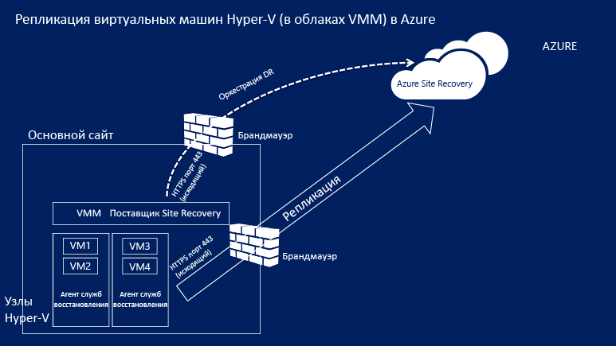

## Предварительные требования Azure

Для развертывания этого сценария вам потребуются следующие компоненты среды Azure.

**Предварительные требования** | **Дополнительные сведения**
--- | ---
**Учетная запись Azure**| Вам потребуется учетная запись [Microsoft Azure](http://azure.microsoft.com/). Начните с [бесплатной пробной версии](https://azure.microsoft.com/pricing/free-trial/). Ознакомьтесь с [дополнительными сведениями](https://azure.microsoft.com/pricing/details/site-recovery/) о ценах на использование Site Recovery.
**Служба хранилища Azure** | Для хранения реплицируемых данных требуется стандартная учетная запись хранения Azure. Подойдет учетная запись хранения LRS или GRS. Рекомендуется использовать учетную запись хранения GRS, чтобы обеспечить устойчивость данных в случае отключения электричества в регионе или при отсутствии возможности восстановления основного региона. [Подробнее](../storage/storage-redundancy.md). Учетная запись должна находиться в том же регионе, что и хранилище служб восстановления.  Хранилище класса Premium не поддерживается.   Реплицированные данные хранятся в службе хранилища Azure, а виртуальные машины Azure создаются при отработке отказа.    [Прочтите статью](../storage/storage-introduction.md) о службе хранилища Azure.
**Сеть Azure** | Потребуется виртуальная сеть Azure, к которой будут подключаться виртуальные машины Azure при отработке отказа. Сеть должна располагаться в том же регионе, что и хранилище служб восстановления.

## Предварительные требования для локальной среды

Вам потребуются следующие компоненты в локальной среде.

**Предварительные требования** | **Дополнительные сведения**
--- | ---
**VMM**| Один или несколько серверов VMM под управлением System Center 2012 R2. Для каждого сервера VMM следует настроить одно или несколько облаков. Облако должно содержать:   одну или несколько групп узлов VMM;   один или несколько серверов узлов или кластеров Hyper-V в каждой группе узлов.  [См. дополнительные сведения](http://www.server-log.com/blog/2011/8/26/vmm-2012-and-the-clouds.html) о настройке облаков VMM.
**Hyper-V** | Серверы узлов Hyper-V должны работать под управлением Windows Server 2012 R2 (или более поздних версий) с ролью Hyper-V и установленными последними обновлениями.   Сервер Hyper-V должен содержать одну или несколько виртуальных машин.   Управление сервером узла или кластером Hyper-V, содержащим виртуальные машины, которые требуется реплицировать, должно осуществляться в облаке VMM.  Серверы Hyper-V следует подключить к Интернету напрямую или через прокси-сервер.  Для серверов Hyper-V следует установить исправления, рассмотренные в статье [2961977](https://support.microsoft.com/kb/2961977).  Серверам узлов Hyper-V нужен доступ к Интернету для репликации данных в Azure.
**Поставщик и агент** | При развертывании Azure Site Recovery мы установим поставщик этой службы на сервере VMM и агент служб восстановления Azure на узлах Hyper-V. Поставщик и агент должны подключиться к Azure через Интернет (напрямую или через прокси-сервер). Обратите внимание, что прокси-сервер HTTPS не поддерживается. На прокси-сервере на сервере VMM и узлах Hyper-V должен быть разрешен доступ к следующим адресам:    *.hypervrecoverymanager.windowsazure.com;    *.accesscontrol.windows.net;    *.backup.windowsazure.com;    *.blob.core.windows.net;    *.store.core.windows.net.  При наличии на сервере VMM правил брандмауэра на основе IP-адресов убедитесь, что они разрешают обмен данными с Azure. Необходимо разрешить использовать [диапазоны IP-адресов центра обработки данных Azure](https://www.microsoft.com/download/confirmation.aspx?id=41653) и порт HTTPS (443).  Внесите диапазоны IP-адресов для региона Azure, в котором расположена ваша подписка, и для западной части США в список разрешенных.  Кроме того, прокси-серверу на сервере VMM потребуется доступ к https://www.msftncsi.com/ncsi.txt.

## Предварительные требования для защищенных компьютеров

**Предварительные требования** | **Дополнительные сведения**
--- | ---
**Защищенные виртуальные машины** | Перед отработкой отказа на виртуальной машине убедитесь, что имя, которое будет назначено виртуальной машине Azure, соответствует [предварительным требованиям Azure](site-recovery-best-practices.md#azure-virtual-machine-requirements). После включения репликации для виртуальной машины это имя можно изменить.    Емкость одного диска на защищенных компьютерах не должна превышать 1023 ГБ. Для виртуальной машины можно настроить до 64 дисков (то есть до 64 ТБ).   Гостевые кластеры общих дисков не поддерживаются.   Загрузка единого интерфейса EFI (UEFI) или интерфейса EFI не поддерживается.   Если на исходной виртуальной машине настроено объединение сетевых карт, после отработки отказа в Azure оно преобразуется в одну сетевую карту.   Защита виртуальных машин под управлением Linux со статическими IP-адресами не поддерживается.

## Подготовка к развертыванию

Чтобы подготовиться к развертыванию, потребуется следующее:

1. [Настроить сеть Azure](#set-up-an-azure-network), в которой будут размещаться виртуальные машины Azure после отработки отказа.
2. [Настроить учетную запись хранения Azure](#set-up-an-azure-storage-account) для реплицированных данных.
4. [Подготовить сервер VMM](#prepare-the-vmm-server) к развертыванию Site Recovery.
5. [Подготовиться к сопоставлению сетей](#prepare-for-network-mapping). Настройте сети, чтобы сопоставление сетей можно было настроить во время развертывания Site Recovery.

### Настройка сети Azure

Вам потребуется сеть Azure, к которой можно будет подключать виртуальные машины Azure, созданные после отработки отказа.

- Сеть должна располагаться в том же регионе, в котором будет развернуто хранилище служб восстановления.
- В зависимости от модели ресурсов, которую нужно использовать для виртуальных машин Azure после отработки отказа, для сети Azure необходимо настроить [режим Resource Manager](../virtual-network/virtual-networks-create-vnet-arm-pportal.md) или [классический режим](../virtual-network/virtual-networks-create-vnet-classic-pportal.md).
- Рекомендуется настроить сеть перед началом работы. В противном случае это нужно будет сделать во время развертывания службы Site Recovery.

> [AZURE.NOTE] [Migration of networks](../resource-group-move-resources.md) между группами ресурсов в рамках одной или нескольких подписок не поддерживается для сетей, используемых для развертывания Site Recovery.

### Настройка учетной записи хранения Azure

- Для хранения данных, реплицированных в Azure, понадобится стандартная учетная запись хранения Azure. Учетная запись должна находиться в том же регионе, что и хранилище служб восстановления.
- В зависимости от модели ресурсов, которую нужно использовать для виртуальных машин Azure после отработки отказа, для учетной записи необходимо настроить [режим Resource Manager](../storage/storage-create-storage-account.md) или [классический режим](../storage/storage-create-storage-account-classic-portal.md).
- Рекомендуется настроить учетную запись до начала работы. В противном случае это нужно будет сделать во время развертывания службы Site Recovery.

> [AZURE.NOTE] [Migration of storage accounts](../resource-group-move-resources.md) между группами ресурсов в рамках одной или нескольких подписок не поддерживается для учетных записей хранения, используемых для развертывания Site Recovery.

### Подготовка сервера VMM

- Убедитесь, что сервер VMM соответствует [предварительным требованиям](#on-premises-prerequisites).
- Во время развертывания службы Site Recovery можно указать, что все облака на сервере VMM должны быть доступны на портале Azure. Если нужно, чтобы на портале отображались только определенные облака, соответствующий параметр можно включить в консоли администратора VMM.

### Подготовка к сопоставлению сетей

Во время развертывания службы Site Recovery необходимо настроить сопоставление сетей. Будут сопоставляться исходные сети виртуальных машин VMM и целевые сети Azure. Это предоставляет следующие возможности:

- Компьютеры, для которых отработка отказа выполняется в одной сети, могут подключаться друг к другу, даже если отработка отказа выполнялась по-разному или в рамках разных планов восстановления.
- При наличии сетевого шлюза в целевой сети Azure виртуальные машины могут подключиться к локальным виртуальным машинам.
- Чтобы настроить сопоставление сетей, необходимо следующее:

	- Виртуальные машины на сервере узла Hyper-V должны быть подключены к сети виртуальных машин VMM. Эта сеть должна быть подключена к логической сети, которая связана с облаком.
	- Сеть Azure, как описано [выше](#set-up-an-azure-network).

- См. [дополнительные сведения](site-recovery-network-mapping.md) о принципе действия сопоставления сетей.

## Создание хранилища служб восстановления

1. Войдите на [портал Azure](https://portal.azure.com).
2. Последовательно выберите **Создать** > **Управление** > **Службы восстановления**. Кроме того, можно щелкнуть **Обзор** > **Хранилища служб восстановления** > **Добавить**.

	

3. В поле **Имя** укажите понятное имя для идентификации хранилища. Если у вас имеется несколько подписок, выберите одну из них.
4. [Создайте новую группу ресурсов](../resource-group-template-deploy-portal.md) или выберите существующую. Укажите регион Azure. В него будут реплицированы данные компьютеров. Чтобы проверить поддерживаемые регионы, см. географическую доступность в разделе [Azure Site Recovery Pricing Details](https://azure.microsoft.com/pricing/details/site-recovery/) (Информация о ценах на Azure Site Recovery).
4. Если вам нужно быстро получить доступ к хранилищу на панели мониторинга, щелкните **Закрепить на панели мониторинга** > **Создать хранилище**.

	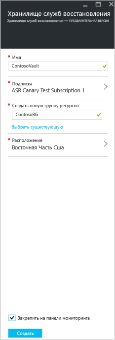

Новое хранилище появится в колонке **Панель мониторинга** > **Все ресурсы** и в основной колонке **Хранилища служб восстановления**.

## Приступая к работе

В Site Recovery предусмотрен механизм для начала работы, который позволяет выполнить развертывание как можно быстрее. Перед развертыванием проверяется соответствие предварительным требованиям. Кроме того, вы получаете указания для выполнения этапов развертывания в правильной последовательности.

Приступая к работе, необходимо выбрать тип компьютеров, которые требуется реплицировать, и место для репликации. Затем нужно настроить локальные серверы, учетные записи хранения Azure и сети. Кроме того, требуется создать политики репликации и выполнить планирование ресурсов. После настройки инфраструктуры включается репликация виртуальных машин. Можно выполнить отработку отказа для конкретных компьютеров или создать план восстановления для отработки отказа на нескольких компьютерах.

Сначала выберите способ развертывания Site Recovery. Начальные процедуры немного изменяются в зависимости от требований к репликации.

## Шаг 1. Выбор целевых объектов для защиты

Выберите целевые объекты и место для репликации.

1. В колонке **Хранилища служб восстановления** выберите хранилище и щелкните **Параметры**.
2. В области **Приступая к работе** щелкните **Site Recovery** > **Step 1: Prepare Infrastructure** (Шаг 1. Подготовка инфраструктуры) > **Protection goal** (Цель защиты).

	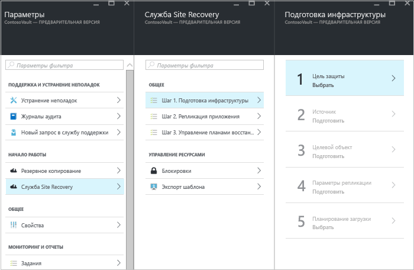

3. На странице **Protection goal** (Цель защиты) выберите **To Azure** (В Azure) и **Yes, with Hyper-V** (Да, с помощью Hyper-V). Выберите **Да**, чтобы подтвердить, что для управления узлами Hyper-V и сайтом восстановления используется VMM. Нажмите кнопку **ОК**.

	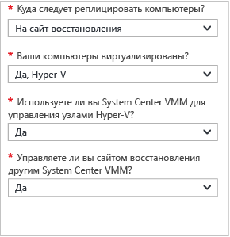

## Шаг 2. Настройка исходной среды

Установите поставщик Azure Site Recovery на сервере VMM и зарегистрируйте сервер в хранилище. Установите агент служб восстановления Azure на узлах Hyper-V.

1. Щелкните **Step 2: Prepare Infrastructure** (Шаг 2. Подготовка инфраструктуры) > **Источник**.

	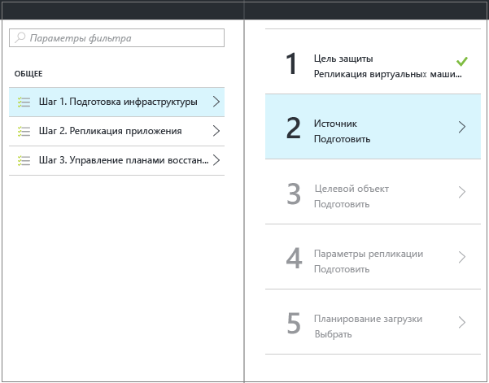

2. На странице **Подготовка источника** щелкните **+ VMM**, чтобы добавить сервер VMM.

	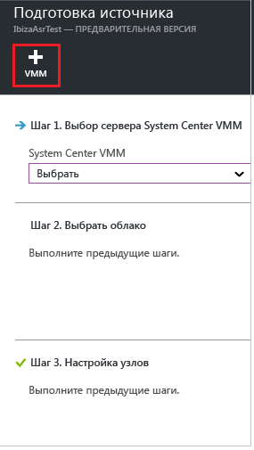

3. В колонке **Добавление сервера** убедитесь, что **сервер System Center VMM** появился в разделе **Тип сервера** и что он соответствует [предварительным требованиям и требованиям к URL-адресам](#on-premises-prerequisites).
4. Скачайте файл установки поставщика Azure Site Recovery.
5. Скачайте ключ регистрации. Он потребуется при запуске программы установки. Ключ действителен в течение пяти дней после создания.

	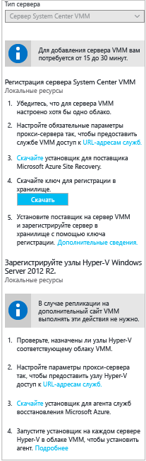

6. Установите поставщик Azure Site Recovery на сервере VMM.

### Настройка поставщика Azure Site Recovery

1.	Запустите файл установки поставщика.
2. На странице **Центр обновления Майкрософт** можно включить обновления, чтобы обновления поставщика устанавливались в соответствии с политикой Центра обновления Майкрософт.
3. На странице **Установка** примите или измените расположение установки поставщика по умолчанию и нажмите кнопку **Установить**.

	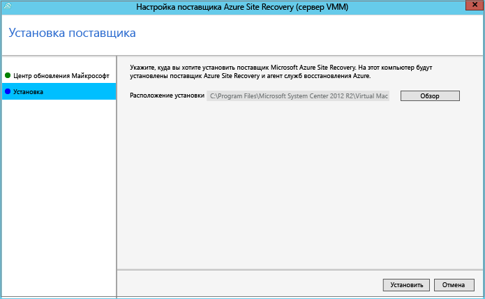

4. После установки нажмите кнопку **Зарегистрировать**, чтобы зарегистрировать сервер VMM в хранилище.
5. На странице **Параметры хранилища** нажмите кнопку **Обзор**, чтобы выбрать файл ключа хранилища. Укажите подписку Azure Site Recovery и имя хранилища.

	

6. На странице **Подключение к Интернету** укажите, как запущенный на сервере VMM поставщик будет подключаться к Site Recovery через Интернет.

	- Чтобы поставщик подключался напрямую, установите переключатель **Подключиться к Azure Site Recovery напрямую без прокси-сервера**.
	- Если для существующего прокси-сервера требуется проверка подлинности или нужно использовать пользовательский прокси-сервер, установите переключатель **Подключиться к Azure Site Recovery с использованием прокси-сервера**.
	- При использовании пользовательского прокси-сервера необходимо указать адрес, порт и учетные данные.
	- Если используется прокси-сервер, скорее всего, вы уже разрешили использовать URL-адреса, описанные в разделе о [предварительных требованиях](#on-premises-prerequisites).
	- При использовании настраиваемого прокси-сервера автоматически создается учетная запись запуска от имени VMM (DRAProxyAccount), использующая указанные учетные данные прокси-сервера. Настройте прокси-сервер так, чтобы эта учетная запись могла успешно проходить проверку подлинности. Параметры учетной записи запуска от имени VMM можно изменить в консоли VMM. В области **Параметры** разверните элементы **Безопасность** > **Учетные записи запуска от имени**, а затем измените пароль для учетной записи DRAProxyAccount. Чтобы параметры вступили в силу, потребуется перезапустить службу VMM.

	

7. Примите или измените расположение сертификата SSL, который создается автоматически для шифрования данных. Этот сертификат используется при включении шифрования данных для облачных сред, защищенных Azure, на портале Azure Site Recovery. Сертификат следует хранить в безопасном месте. При отработке отказа в Azure он понадобится для расшифровки, если включено шифрование данных.

8. В поле **Имя сервера** укажите понятное имя, описывающее сервер VMM в хранилище. В конфигурации кластера укажите имя роли кластера VMM.
9. Включите **синхронизацию метаданных в облаке**, если нужно синхронизировать метаданные для всех облаков сервера VMM в хранилище. На каждом сервере это действие требуется выполнять только один раз. Если не требуется синхронизировать все облака, можно оставить этот флажок снятым и синхронизировать каждое облако индивидуально в свойствах облака в консоли VMM. Для завершения процесса нажмите кнопку **Зарегистрировать**.

	

10. Начнется процедура регистрации. После ее завершения сервер появится в колонке **Параметры** > **Серверы** в хранилище.

#### Установка поставщика Azure Site Recovery в командной строке

Поставщик Azure Site Recovery можно установить с помощью командной строки. Этот метод можно использовать для установки поставщика на основные серверные компоненты Windows Server 2012 R2.

1. Скачайте файл установки поставщика и ключ регистрации в папку. Например, C:\\ASR.
2. В командной строке с повышенными правами запустите следующие команды, чтобы извлечь установщик поставщика:

	    	C:\Windows\System32> CD C:\ASR
	    	C:\ASR> AzureSiteRecoveryProvider.exe /x:. /q
3. Выполните следующую команду для установки компонентов:

			C:\ASR> setupdr.exe /i

4. Затем выполните следующие команды для регистрации сервера в хранилище:

    	CD C:\Program Files\Microsoft System Center 2012 R2\Virtual Machine Manager\bin
    	C:\Program Files\Microsoft System Center 2012 R2\Virtual Machine Manager\bin> DRConfigurator.exe /r  /Friendlyname <friendly name of the server> /Credentials <path of the credentials file> /EncryptionEnabled <full file name to save the encryption certificate>       

Описание

- **/Credentials** — обязательный параметр, который определяет расположение ключа регистрации.
- **/FriendlyName** — обязательный параметр для имени сервера узла Hyper-V, который отображается на портале Azure Site Recovery.
- - **/EncryptionEnabled** — необязательный параметр, используемый при репликации виртуальных машин Hyper-V из облаков VMM в Azure. Укажите, следует ли шифровать виртуальные машины в Azure (шифрование неактивных данных). Имя файла должно иметь расширение **PFX**. По умолчанию шифрование отключено.
- **/proxyAddress** — необязательный параметр, определяющий адрес прокси-сервера.
- **/proxyport** — необязательный параметр, определяющий порт прокси-сервера.
- **/proxyUsername** — необязательный параметр, определяющий имя пользователя прокси-сервера (если прокси-сервер требует проверки подлинности).
- **/proxyPassword** — необязательный параметр, определяющий пароль для проверки подлинности на прокси-сервере (если прокси-сервер требует проверки подлинности).

### Установка агента служб восстановления Azure на узлах Hyper-V

1. После настройки поставщика нужно скачать файл установки для агента служб восстановления Azure. Запустите программу установки на каждом сервере Hyper-V в облаке VMM.

	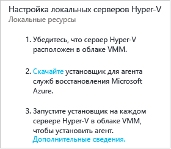

2. На странице **Проверка предварительных требований** нажмите кнопку **Далее**. Все отсутствующие предварительные требования будут установлены автоматически.

	

3. На странице **Параметры установки** примите или измените место установки и расположение кэша. Можно настроить кэш на диске объемом от 5 ГБ. Однако рекомендуемый объем — не менее 600 ГБ. Нажмите **Install** (Установить).
4. После завершения установки нажмите кнопку **Закрыть**.

	

#### Установка служб Azure Site Recovery в командной строке

Агент служб восстановления Microsoft Azure можно установить из командной строки, используя следующую команду:

     marsagentinstaller.exe /q /nu

#### Настройка доступа прокси-сервера к Site Recovery через Интернет для узлов Hyper-V

Агенту служб восстановления на узлах Hyper-V требуется доступ к Azure через Интернет для репликации виртуальных машин. Если доступ к Интернету осуществляется через прокси-сервер, настройте его так:

1. Откройте на узле Hyper-V оснастку MMC в службе архивации Microsoft Azure. По умолчанию ярлык для службы архивации Microsoft Azure доступен на рабочем столе или в папке C:\\Program Files\\Microsoft Azure Recovery Services Agent\\bin\\wabadmin.
2. В оснастке щелкните **Изменить свойства**.
3. На вкладке **Конфигурация прокси-сервера** укажите сведения о прокси-сервере.

	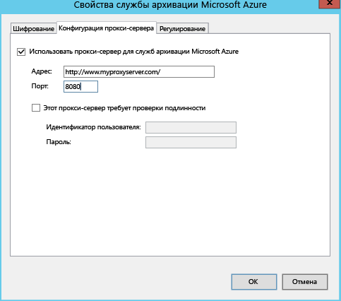

4. Убедитесь, что агент может связаться с URL-адресами, описанными в разделе с [предварительными требованиями](#on-premises-prerequisites).

## Шаг 3. Настройка целевой среды

Укажите учетную запись хранения Azure для репликации и сеть Azure, к которой будут подключаться виртуальные машины Azure после отработки отказа.

1.	Щелкните **Подготовка инфраструктуры** > **Цель** и выберите требуемую подписку Azure.
2.	Укажите модель развертывания, которая будет использоваться для виртуальных машин после отработки отказа.
3.	Site Recovery проверяет наличие одной или нескольких совместимых учетных записей хранения и сетей Azure.

	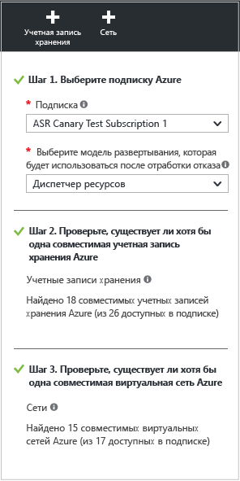

4.	Если учетная запись хранения еще не создана и ее нужно создать с помощью Resource Manager, щелкните **+Storage account** (+Учетная запись хранения). В колонке **Создание учетной записи хранения** укажите имя, тип, подписку и расположение учетной записи. Учетная запись должна находиться в том же регионе, что и хранилище служб восстановления.

	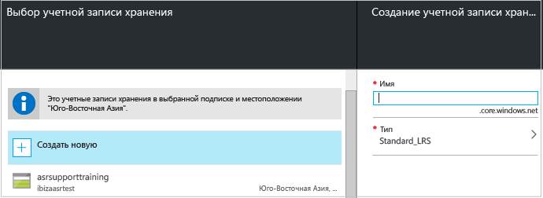

	Обратите внимание на следующее.

	- Если нужно создать учетную запись хранения, используя классическую модель, это можно сделать на портале Azure. [Подробнее](../storage/storage-create-storage-account-classic-portal.md)
	- Если для реплицированных данных используется учетная запись хранения "Премиум", потребуется настроить дополнительную учетную запись хранения "Стандартный" для хранения журналов репликации, в которых фиксируются текущие изменения локальных данных.

4.	Если сеть Azure еще не создана и ее нужно создать с помощью Resource Manager, щелкните **+Network** (+Сеть), чтобы сделать это в процессе настройки. В колонке **Создание виртуальной сети** укажите имя, диапазон адресов, сведения о подсетях, подписку и расположение сети. Сеть должна располагаться в том же регионе, что и хранилище служб восстановления.

	.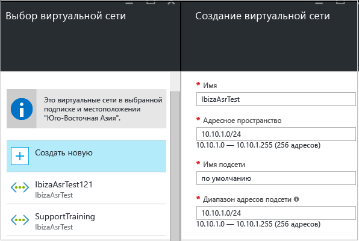

	Если нужно создать сеть, используя классическую модель, это можно сделать на портале Azure. [Подробнее](../virtual-network/virtual-networks-create-vnet-classic-pportal.md).

### Настройка сетевого сопоставления

- [Прочтите](#prepare-for-network-mapping) краткий обзор сопоставления сетей. Подробное описание см. в [этой статье](site-recovery-network-mapping.md).
- Убедитесь, что виртуальные машины на сервере VMM подключены к сети виртуальной машины и что создана по крайней мере одна виртуальная сеть Azure. Несколько сетей виртуальных машин можно сопоставить с одной сетью Azure.

Настройте сопоставление следующим образом:

1. Последовательно выберите **Параметры** > **Инфраструктура Site Recovery** > **Сетевые сопоставления** > **Сетевое сопоставление** и щелкните значок **+Network Mapping** (+Сетевое сопоставление).

	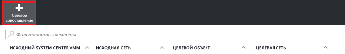

2. На странице **Добавление сетевого сопоставления** выберите исходный сервер VMM, а в качестве целевого сервера — **Azure**.
3. Проверьте подписку и модель развертывания после отработки отказа.
4. На странице **Исходная сеть** в списке, связанном с сервером VMM, выберите исходную сеть локальной виртуальной машины, которую нужно сопоставить.
5. На странице **Целевая сеть** выберите сеть Azure, в которой будут размещены реплицированные виртуальные машины Azure после создания. Нажмите кнопку **ОК**.

	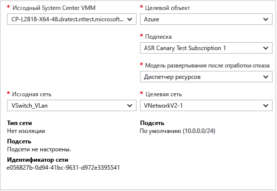

Когда начинается сопоставление сетей, происходит следующее:

- При запуске сопоставления существующие виртуальные машины в исходной сети виртуальных машин подключаются к целевой сети. Новые виртуальные машины, подключенные к исходной сети виртуальных машин, будут подключены к сопоставленной сети Azure после репликации.
- Если изменить существующее сопоставление сетей, реплики виртуальных машин будут подключаться с новыми параметрами.
- Если целевая сеть включает несколько подсетей и одна из этих подсетей имеет то же имя, что и подсеть, в которой размещается исходная виртуальная машина, то реплика виртуальной машины будет подключена к этой целевой подсети после отработки отказа.
- Если нет подсетей с таким же именем, виртуальная машина будет подключена к первой подсети в сети.

## Этап 4. Настройка параметров репликации

1. Чтобы создать политику репликации, последовательно выберите **Подготовка инфраструктуры** > **Параметры репликации** > **+Create and associate** (+Создание и сопоставление).

	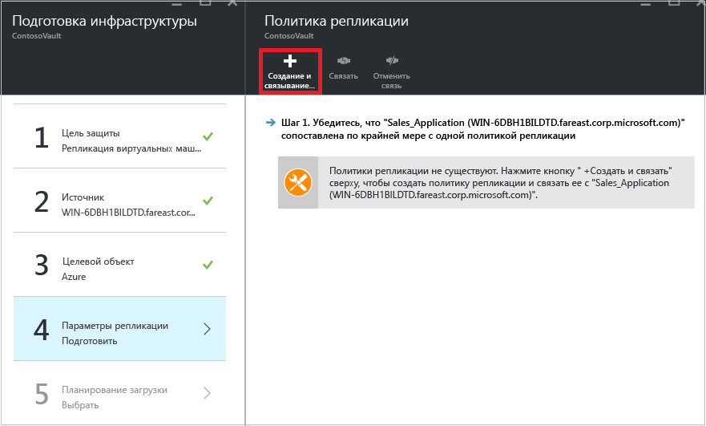

2. На странице **Создать и связать политику** укажите имя политики.
3. В раскрывающемся списке **Частота копирования** выберите периодичность репликации изменений данных после начальной репликации (каждые 30 секунд, 5 или 15 минут).
4. В поле **Хранение точки восстановления** укажите продолжительность периода хранения для каждой точки восстановления (в часах). Защищенные компьютеры будут восстанавливаться до любой точки в пределах этого периода.
6. В поле **Периодичность создания моментальных снимков с согласованием приложений** укажите, как часто будут создаваться точки восстановления, содержащие моментальные снимки, согласованные с приложениями (от 1 до 12 часов). Hyper-V использует два типа резервного копирования: стандартное резервное копирование, обеспечивающее создание добавочных резервных копий всей виртуальной машины, и соответствующие приложению моментальные снимки, обеспечивающие создание моментального снимка данных приложений в виртуальной машине на момент времени. Функция моментальных снимков, соответствующих приложению, использует службу теневого копирования томов (VSS), чтобы гарантировать согласованное состояние приложений на момент создания снимка. Примечание. Включение моментальных снимков, соответствующих приложению, влияет на производительность приложений, выполняющихся на исходных виртуальных машинах. Заданное значение должно быть меньше числа настроенных дополнительных точек восстановления.
3. В поле **Время запуска начальной репликации** укажите, когда должна запускаться начальная репликация. При репликации используется полоса пропускания Интернета. Поэтому проведение репликации нужно запланировать на свободное от работы время.
5. В области **Шифровать данные, хранящиеся в Azure** нажмите соответствующую кнопку. Нажмите кнопку **ОК**.

	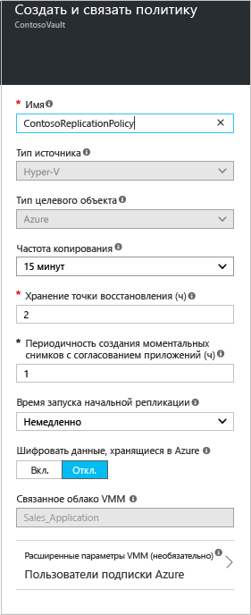

6. При создании политики она автоматически сопоставляется с облаком VMM. Нажмите кнопку **ОК**. С этой политикой репликации можно сопоставить дополнительные облака VMM (и виртуальные машины, содержащиеся в них). Для этого последовательно выберите **Параметры** > **Репликация** > имя политики > **Associate VMM Cloud** (Сопоставить облако VMM).

	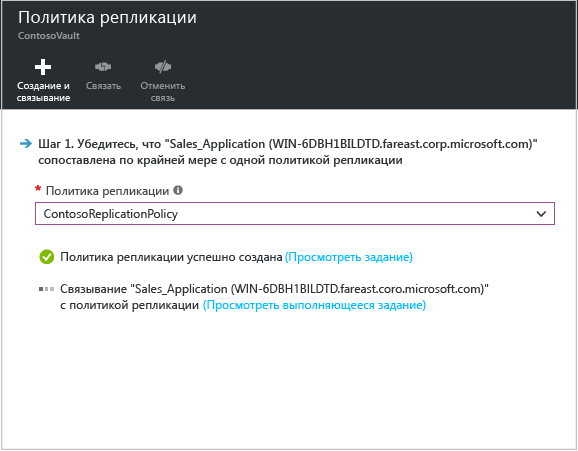

## Шаг 5. Планирование ресурсов

Теперь после настройки базовой инфраструктуры можно начать планирование ресурсов и выяснить, нужны ли дополнительные ресурсы.

Site Recovery предоставляет планировщик ресурсов, который поможет выделить нужные ресурсы для исходной среды, компонентов Site Recovery, сети и хранилища. Планировщик можно запустить в быстром режиме, чтобы получить оценку на основе среднего числа виртуальных машин и дисков, а также среднего объема хранилища, или в подробном режиме, в котором необходимо вводить показатели на уровне рабочей нагрузки. Прежде всего необходимо сделать следующее:

- Соберите сведения о среде репликации, включая информацию о виртуальных машинах, количестве дисков на виртуальную машину и объеме хранилища на диск.
- Определите частоту ежедневных изменений (обновлений) реплицированных данных. Для этого можно воспользоваться [планировщиком ресурсов для реплики Hyper-V](https://www.microsoft.com/download/details.aspx?id=39057).

1.	Щелкните ссылку **Скачать**, чтобы скачать этот инструмент, и запустите его. Сведения о планировщике ресурсов см. в [этой статье](site-recovery-capacity-planner.md).
2.	После этого выберите **Да** в поле **Have you run the Capacity Planner?** (Вы запустили планировщик ресурсов?).

	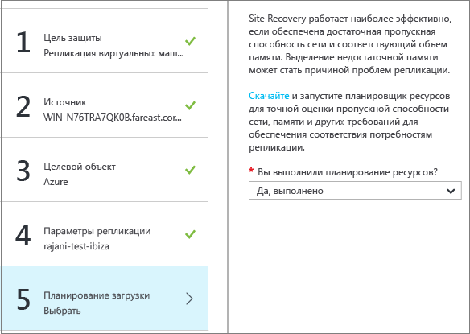

### Рекомендации по пропускной способности сети

С помощью планировщика ресурсов можно рассчитать пропускную способность, необходимую для репликации (начальная и разностная репликации данных). Существует несколько вариантов управления объемом пропускной способности, используемой для репликации:

- **Регулирование пропускной способности**. Трафик Hyper-V, который реплицируется на дополнительный сайт, проходит через определенный узел Hyper-V. Пропускную способность можно регулировать на сервере этого узла.
- **Настройка пропускной способности**. Пропускную способность, используемую для репликации, можно изменить с помощью нескольких разделов реестра.

#### Регулирование пропускной способности

1. Откройте на сервере узла Hyper-V оснастку MMC в службе архивации Microsoft Azure. По умолчанию ярлык для службы архивации Microsoft Azure доступен на рабочем столе или в папке C:\\Program Files\\Microsoft Azure Recovery Services Agent\\bin\\wabadmin.
2. В оснастке щелкните **Изменить свойства**.
3. На вкладке **Регулирование** установите флажок **Разрешить регулирование уровня использования пропускной способности интернет-канала для операций архивации** и задайте ограничения для рабочего и нерабочего времени. Допустимы значения в диапазоне от 512 Кбит/с до 102 Мбит/с.

	.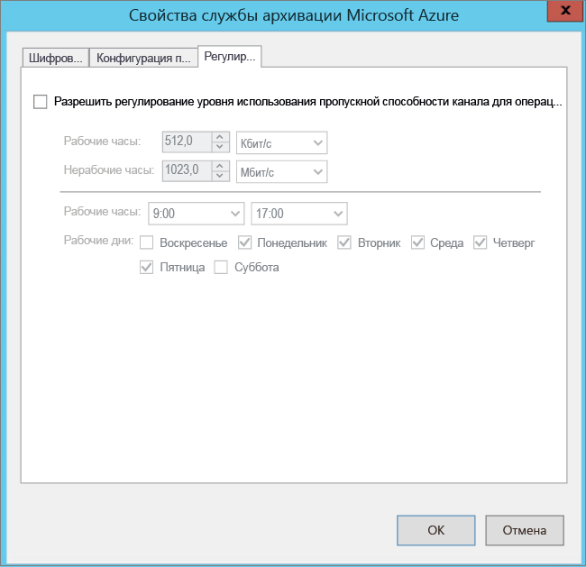

Чтобы настроить регулирование, можно также использовать командлет [Set-OBMachineSetting](https://technet.microsoft.com/library/hh770409.aspx). Рассмотрим пример:

    $mon = [System.DayOfWeek]::Monday
    $tue = [System.DayOfWeek]::Tuesday
    Set-OBMachineSetting -WorkDay $mon, $tue -StartWorkHour "9:00:00" -EndWorkHour "18:00:00" -WorkHourBandwidth  (512*1024) -NonWorkHourBandwidth (2048*1024)

**Set-OBMachineSetting -NoThrottle** указывает, что регулирование не требуется.

#### Изменение пропускной способности сети

Значение реестра **UploadThreadsPerVM** управляет количеством потоков, используемых для передачи данных диска (начальная или разностная репликация данных). Если задать высокое значение, пропускная способность сети, используемая для репликации, увеличивается. Значение реестра **DownloadThreadsPerVM** указывает количество потоков, используемых для передачи данных при восстановлении размещения.

1. В реестре перейдите в раздел **HKEY\_LOCAL\_MACHINE\\SOFTWARE\\Microsoft\\Windows Azure Backup\\Replication**.

	- Измените значение **UploadThreadsPerVM** (или создайте раздел, если он не существует), чтобы управлять потоками, используемыми для репликации дисков.
	- Измените значение **DownloadThreadsPerVM** (или создайте раздел, если он не существует), чтобы управлять потоками, используемыми для трафика восстановления размещения в Azure.
2. Значение по умолчанию — 4. В сети со значительным избыточным резервом для этих разделов реестра необходимо изменить значения по умолчанию. Максимальное значение — 32. Следите за трафиком для оптимизации значения.

## Шаг 6. Включение репликации

Включите репликацию следующим образом:

1. Последовательно выберите **Шаг 2. Репликация приложения** > **Источник**. Включив репликацию впервые, щелкните **+Replicate** (+Реплицировать) в хранилище, чтобы включить репликацию для дополнительных компьютеров.

	

2. В колонке **Источник** выберите сервер VMM и облако, в котором находятся узлы Hyper-V. Нажмите кнопку **ОК**.

	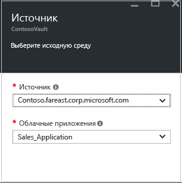

3. В колонке **Цель** выберите подписку, модель развертывания после отработки отказа и учетную запись хранения, используемую для реплицируемых данных.

	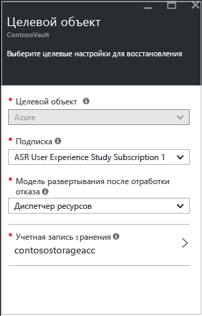

4. Выберите учетную запись хранения, которую нужно использовать. Если вам нужна другая учетная запись хранения, [создайте ее](#set-up-an-azure-storage-account). Чтобы создать учетную запись хранения с использованием модели Resource Manager, щелкните **Создать**. Если нужно создать учетную запись хранения, используя классическую модель, это можно сделать [на портале Azure](../storage/storage-create-storage-account-classic-portal.md). Нажмите кнопку **ОК**.
5. Выберите сеть и подсеть Azure, к которой будут подключаться развернутые виртуальные машины Azure после отработки отказа. Выберите **Настроить сейчас для всех выбранных компьютеров**, чтобы применить параметр сети для всех защищаемых компьютеров. Выберите **Отложить настройку**, чтобы выбрать сеть Azure для каждого компьютера. Если требуется использовать другую сеть, [создайте ее](#set-up-an-azure-network). Чтобы создать сеть, используя модель Resource Manager, щелкните **Создать**. Если нужно создать сеть, используя классическую модель, это можно сделать [на портале Azure](../virtual-network/virtual-networks-create-vnet-classic-pportal.md). Выберите подсеть (если это применимо). Нажмите кнопку **ОК**.
6. Щелкнув **Виртуальные машины** > **Выбор виртуальных машин**, выберите каждый компьютер, который нужно реплицировать. Можно выбрать только те компьютеры, для которых можно включить репликацию. Нажмите кнопку **ОК**.

	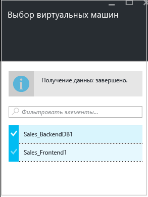

5. Щелкнув **Свойства** > **Настройка свойств**, выберите операционную систему для выбранных виртуальных машин и диск операционной системы. Нажмите кнопку **ОК**. Позже можно задать дополнительные свойства.

	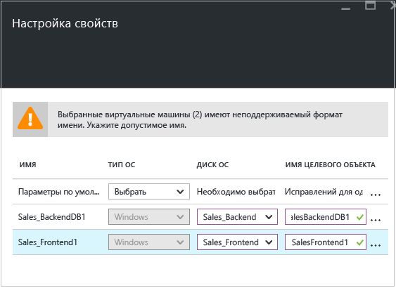

12. Щелкнув **Параметры репликации** > **Настройка параметров репликации**, выберите политику репликации, которую необходимо применить к защищенным виртуальным машинам. Нажмите кнопку **ОК**. Политику репликации можно изменить, последовательно выбрав **Параметры** > **Политики репликации** > имя политики > **Изменить параметры**. Изменения будут применены как к ВМ, для которых уже выполняется репликация, так и к новым ВМ.

	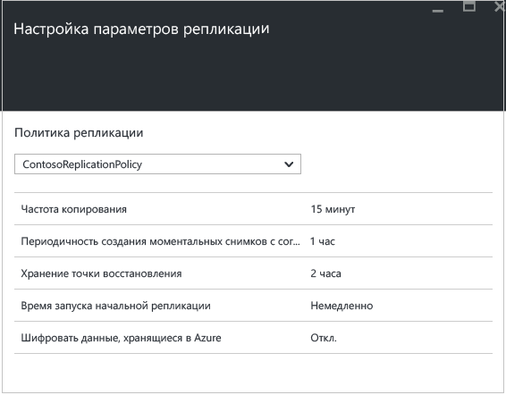

Ход выполнения задания **включения защиты** можно отслеживать, выбрав **Параметры** > **Задания** > **Site Recovery jobs** (Задания Site Recovery). После выполнения задания **Завершить подготовку защиты** виртуальная машина будет готова к отработке отказа.

### Просмотр свойств виртуальной машины и управление ими

Рекомендуется проверить свойства исходного компьютера. Помните, что имя виртуальной машины Azure должно соответствовать [требованиям к виртуальным машинам Azure](site-recovery-best-practices.md#azure-virtual-machine-requirements).

1. Щелкните **Параметры** > **Защищенные элементы** > **Реплицированные элементы** и выберите ВМ, чтобы просмотреть сведения о ней.

	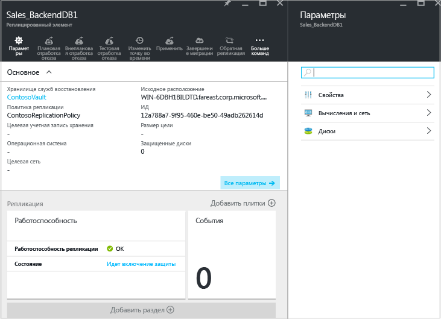

2. На странице **Свойства** можно просмотреть сведения о репликации и отработке отказа для виртуальной машины.

	.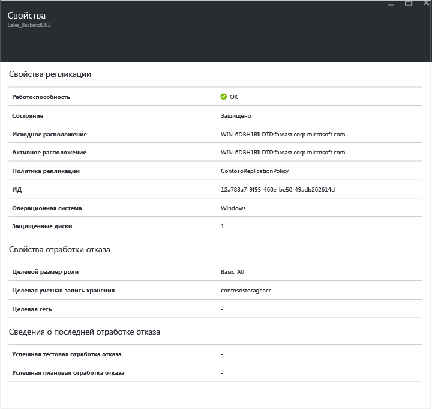

3. Выбрав **Вычисления и сеть** > **Свойства вычислений**, можно указать имя и целевой размер виртуальной машины Azure. При необходимости измените имя в соответствии с [требованиями Azure](site-recovery-best-practices.md#azure-virtual-machine-requirements). Кроме того, можно просмотреть и изменить сведения о целевой сети, подсети и целевом IP-адресе, который будет назначен виртуальной машине Azure. Обратите внимание на следующее.

	- Вы можете задать целевой IP-адрес. Если не указать его, компьютер, для которого выполнена отработка отказа, будет использовать DHCP. Если задать адрес, недоступный при отработке отказа, произойдет сбой. Этот же целевой IP-адрес можно использовать для тестовой отработки отказа, если он доступен в сети тестовой отработки отказа.
	- Количество сетевых адаптеров зависит от размера, указанного для целевой виртуальной машины:

		- Если число сетевых адаптеров на исходной машине меньше или равно числу адаптеров, разрешенному для целевой машины, то количество адаптеров на целевой машине будет таким же.
		- Если число адаптеров на исходной виртуальной машине превышает допустимое для целевого размера, будет использован максимальный размер целевой машины.
		- Например, если на исходной машине есть два сетевых адаптера, а размер целевой машины поддерживает четыре, то на целевой машине будет два адаптера. Если на исходной машине два адаптера, но целевой размер поддерживает только один, то на целевой машине будет только один адаптер.
		- Если для виртуальной машины настроено несколько сетевых адаптеров, они будут подключены к одной сети.

	.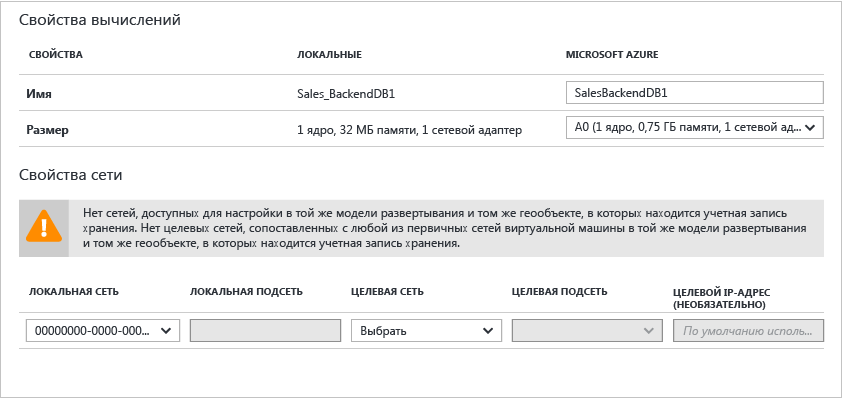

5.	На странице **Диски** отображаются сведения о дисках ОС и дисках данных на виртуальной машине, для которой будет выполняться репликация.

## Шаг 7. Тестирование развертывания

Чтобы протестировать развертывание, можно запустить тестовую отработку отказа для отдельной виртуальной машины или создать план восстановления для одной или нескольких виртуальных машин.

### Подготовка к отработке отказа

- Для запуска тестовой отработки отказа рекомендуется создать сеть Azure, изолированную от рабочей среды Azure (обычная практика при создании сети в Azure). [Узнайте больше](site-recovery-failover.md#run-a-test-failover) о выполнении тестовой отработки отказа.
- Для оптимальной производительности при отработке отказа в Azure установите агент Azure на защищенном компьютере. Это ускоряет загрузку и помогает устранять неполадки. Установите агент [Linux](https://github.com/Azure/WALinuxAgent) или [Windows](http://go.microsoft.com/fwlink/?LinkID=394789).
- Для полного тестирования развертывания необходимо, чтобы инфраструктура для реплицируемой ВМ работала должным образом. Если нужно протестировать Active Directory и DNS, можно создать виртуальную машину в качестве контроллера домена с помощью DNS и реплицировать ее в Azure с помощью службы Azure Site Recovery. Узнайте больше о [рекомендациях по тестированию отработки отказа для Active Directory](site-recovery-active-directory.md#considerations-for-test-failover).
- Если нужно выполнить внеплановую отработку отказа вместо тестовой, обратите внимание на следующее:

	- По возможности перед выполнением внеплановой отработки отказа следует выключить основные компьютеры. В этом случае исходные и реплицированные компьютеры не будут работать одновременно.
	- При выполнении внеплановой отработки отказа репликация данных с основных компьютеров прекращается. Поэтому после начала внеплановой отработки отказа все изменения в данных не будут передаваться. Кроме того, при выполнении внеплановой отработки отказа в рамках плана восстановления она завершится даже в случае ошибки.

### Подготовка к подключению виртуальных машин Azure после отработки отказа

Если после отработки отказа нужно подключиться к виртуальным машинам Azure по протоколу удаленного рабочего стола, обязательно сделайте следующее:

**На локальном компьютере до отработки отказа**.

- Чтобы получить доступ через Интернет, включите протокол RDP. Убедитесь, что правила TCP и UDP добавлены в разделе **Общее** и что RDP разрешен в разделе **Брандмауэр Windows** > **Разрешенные программы и компоненты** для всех профилей.
- Чтобы получить доступ через подключение типа "сеть — сеть", включите протокол RDP на компьютере. Убедитесь, что RDP разрешен в разделе **Брандмауэр Windows** > **Разрешенные программы и компоненты** для сетей **домена** и **частных** сетей.
- Установите [агент виртуальной машины Azure](http://go.microsoft.com/fwlink/?LinkID=394789&clcid=0x409) на локальном компьютере.
- Задайте для политики сети SAN операционной системы значение OnlineAll. [Подробнее](https://support.microsoft.com/kb/3031135)
- Отключите службу IPSec перед выполнением отработки отказа.

**На виртуальной машине Azure после отработки отказа**.

- Добавьте общедоступную конечную точку для протокола RDP (порт 3389) и укажите учетные данные для входа.
- Убедитесь в отсутствии политик домена, которые не допускают подключение к виртуальной машине с использованием общедоступного адреса.
- Попытайтесь подключиться. Если вам не удалось это сделать, убедитесь, что виртуальная машина запущена. Дополнительные советы по устранению неполадок см. в этой [статье](http://social.technet.microsoft.com/wiki/contents/articles/31666.troubleshooting-remote-desktop-connection-after-failover-using-asr.aspx).

Если после отработки отказа нужно получить доступ к виртуальной машине Azure под управлением Linux с помощью клиента SSH, выполните следующее:

**На локальном компьютере до отработки отказа**.

- Настройте автоматический запуск службы SSH на виртуальной машине Azure при загрузке системы (если он еще не настроен).
- Убедитесь, что правила брандмауэра разрешают SSH-подключение к виртуальной машине.

**На виртуальной машине Azure после отработки отказа**.

- Правила группы сетевой безопасности на виртуальной машине, для которой выполнена отработка отказа, и подсети Azure, к которой она подключена, должны разрешать входящие подключения на порт SSH.
- Чтобы разрешить входящие подключения на порт SSH (TCP-порт 22 по умолчанию), необходимо создать общедоступную конечную точку.
- Если доступ к виртуальной машине осуществляется через VPN-подключение (Express Route или VPN типа "сеть — сеть"), можно использовать клиент для прямого подключения к виртуальной машине по протоколу SSH.

### Запуск тестовой отработки отказа

Для запуска тестовой отработки отказа сделайте вот что:

1. Чтобы выполнить отработку отказа для одной виртуальной машины, в разделе **Параметры** > **Реплицированные элементы** щелкните виртуальную машину и выберите элемент **+Test Failover** (+Тестовая отработка отказа).
2. Чтобы выполнить отработку отказа по плану восстановления, в разделе **Параметры** > **Планы восстановления** щелкните план правой кнопкой мыши и выберите **Тестовая отработка отказа**. Чтобы создать план восстановления, [выполните эти инструкции](site-recovery-create-recovery-plans.md).

3. На странице **Тестовая отработка отказа** выберите сеть Azure, к которой будут подключаться виртуальные машины Azure после отработки отказа.
4. Нажмите кнопку **ОК**, чтобы запустить отработку отказа. За ходом выполнения можно следить в окне свойств, которое можно открыть, щелкнув виртуальную машину, или в задании **тестовой отработки отказа**, выбрав **Параметры** > **Site Recovery jobs** (Задания Site Recovery).
5. Когда отработка отказа достигнет этапа **Полное тестирование**, выполните следующие действия.

	1. Просмотрите реплику виртуальной машины на портале Azure. Проверьте, успешно ли выполнен запуск виртуальной машины.
	2. Если настройки предусматривают доступ к виртуальным машинам из локальной сети, можно инициировать подключение протокола удаленного рабочего стола к виртуальной машине.
	3. Щелкните **Завершить проверку** для завершения действия.
	4. Щелкните элемент **Примечания** для регистрации и сохранения любых наблюдений, связанных с тестовой отработкой отказа.
	5. Щелкните пункт **Тестовая отработка отказа завершена**. Проведите очистку тестовой среды, чтобы автоматически отключить питание и удалить тестовую виртуальную машину.
	6. На этом этапе элементы или виртуальные машины, автоматически созданные Site Recovery во время тестовой отработки отказа, удаляются. Дополнительные элементы, созданные для тестовой отработки отказа, не удаляются.

	> [AZURE.NOTE] Если отработка отказа выполняется более двух недель, она завершается принудительно.

6. После завершения отработки отказа реплика виртуальной машины Azure появится на портале Azure в области **Виртуальные машины**. Следует убедиться, что виртуальная машина имеет соответствующий размер, подключена к соответствующей сети и работает.
7. Если вы заранее [подготовились к подключению после отработки отказа](#prepare-to-connect-to-Azure-VMs-after-failover), то сможете подключиться к виртуальной машине Azure.

## Мониторинг развертывания

Вот как можно отслеживать параметры конфигурации, состояние и работоспособность развертывания Site Recovery:

1. Щелкните имя хранилища, чтобы открыть панель мониторинга **Основные компоненты**. На этой панели мониторинга можно просмотреть сведения о заданиях Site Recovery, состоянии репликации, планах восстановления, работоспособности сервера и событиях. Эту панель можно настроить таким образом, чтобы на ней отображались самые необходимые элементы и макеты, а также сведения о состоянии других хранилищ Site Recovery и службы архивации.

	

2. На элементе **Работоспособность** можно следить за серверами сайта (серверами VMM или серверами конфигурации), на которых возникают ошибки, а также за событиями, о которых сообщила служба Site Recovery за последние 24 часа.
3. Мониторинг репликации и управление ею можно осуществлять в элементах **Реплицированные элементы**, **Планы восстановления** и **Site Recovery Jobs** (Задания Site Recovery). Подробные сведения о заданиях можно просмотреть, выбрав **Параметры** > **Задания** > **Site Recovery Jobs** (Задания Site Recovery).

## Дальнейшие действия

Настроив и запустив развертывание, вы можете ознакомиться с [дополнительными сведениями](site-recovery-failover.md) о различных типах обработки отказа.

<!---HONumber=AcomDC_0928_2016-->