<properties
	pageTitle="Настройка защиты между локальным сайтом VMM и Azure | Microsoft Azure"
	description="Azure Site Recovery предназначен для выполнения таких операций, как репликация виртуальных машин Hyper-V, размещенных в локальных облаках VMM на Azure, их перенос на другой ресурс при сбое, а также восстановление."
	services="site-recovery"
	documentationCenter=""
	authors="rayne-wiselman"
	manager="jwhit"
	editor="tysonn"/>

<tags
	ms.service="site-recovery"
	ms.workload="backup-recovery"
	ms.tgt_pltfrm="na"
	ms.devlang="na"
	ms.topic="hero-article"
	ms.date="08/05/2015"
	ms.author="raynew"/>

#  Настройка защиты между локальным сайтом VMM и Azure

## Обзор

Служба Azure Site Recovery помогает реализовать стратегию непрерывности бизнеса и аварийного восстановления (BCDR), управляя процессами репликации, отработки отказа и восстановления виртуальных машин в ряде сценариев развертывания. Полный список сценариев развертывания см. в статье [Обзор Azure Site Recovery](site-recovery-overview.md).

Этот учебный сценарий демонстрирует развертывание компонента Site Recovery для организации и автоматизации защиты рабочих нагрузок, выполняемых на виртуальных машинах на серверах узлов Hyper-V, размещаемых в частных облаках VMM. В этом сценарии виртуальные машины реплицируются с первичного сайта VMM в Azure с помощью реплики Hyper-V.

Руководство включает перечень необходимых для сценария компонентов и инструкции по настройке хранилища Site Recovery, установке поставщика Azure Site Recovery на исходном сервере VMM, регистрации сервера в хранилище, добавлению учетной записи хранения Azure, установке агента Azure Recovery Services на серверах узлов Hyper-V, настройке параметров защиты для облаков VMM, которые будут применяться ко всем защищенным виртуальным машинам, и включению защиты для этих виртуальных машин. В заключение выполните тестовую отработку отказа, чтобы убедиться в том, что все работает правильно.

Если у вас возникают проблемы, опубликуйте свои вопросы на [форуме по Azure Recovery Services](http://go.microsoft.com/fwlink/?LinkId=313628).

## Перед началом работы

Убедитесь, что у вас есть следующие необходимые компоненты.
### Предварительные требования Azure

- Вам потребуется учетная запись [Microsoft Azure](http://azure.microsoft.com/). Если у вас ее нет, начните с получения [бесплатной пробной версии](http://aka.ms/try-azure). Также можете ознакомиться с [Расценками на использование менеджера Azure Site Recovery](http://go.microsoft.com/fwlink/?LinkId=378268).
- Для хранения данных, реплицируемых в Azure, потребуется учетная запись хранения Azure. На учетной записи необходимо включить георепликацию. Она должна находиться в том же регионе, что и служба Azure Site Recovery, и быть связана с той же подпиской. Более подробную информацию о настройке хранилища Azure см. в разделе [Знакомство со службой хранилища Microsoft Azure](http://go.microsoft.com/fwlink/?LinkId=398704).
- Вам потребуется убедиться, что защищаемые виртуальные машины соответствуют требованиям Azure. Подробные сведения см. в статье [Поддержка виртуальных машин](https://msdn.microsoft.com/library/azure/dn469078.aspx#BKMK_E2A).

### Предварительные требования VMM
- Вам потребуется сервер VMM под управлением System Center 2012 R2.
- На всех серверах VMM, содержащих виртуальные машины, для которых предполагается настроить защиту, должен выполняться поставщик Azure Site Recovery. Он устанавливается во время развертывания Azure Site Recovery.
- Требуется по крайней мере одно облако на сервере VMM, для которого предполагается настроить защиту. Облако должно содержать:
	- одну или несколько групп узлов VMM;
	- Один или несколько серверов или кластеров узлов Hyper-V в каждой группе узлов.
	- одну или несколько виртуальных машин на исходном сервере Hyper-V.
- Дополнительные сведения о настройке облаков VMM
	- Дополнительные сведения о частных облаках VMM см. в статьях [Новые функции частного облака в System Center 2012 R2 VMM](http://go.microsoft.com/fwlink/?LinkId=324952) и [VMM 2012 и облачные среды](http://go.microsoft.com/fwlink/?LinkId=324956).
	- Дополнительные сведения о [настройке структуры облака VMM](https://msdn.microsoft.com/library/azure/dn469075.aspx#BKMK_Fabric)
	- После того как все элементы структуры облака будут готовы, ознакомьтесь с дополнительными сведениями о создании частных облаков в статьях [Создание частного облака в VMM](http://go.microsoft.com/fwlink/?LinkId=324953) и [Пошаговое руководство: создание частных облаков с VMM System Center 2012 SP1](http://go.microsoft.com/fwlink/?LinkId=324954).

### Предварительные требования Hyper-V

- Серверы узлов Hyper-V должны работать под управлением Windows Server 2012 R2 (или более поздних версий) с ролью Hyper-V и установленными последними обновлениями.
- Если Hyper-V выполняется в кластере, учтите, что брокер кластера не создается автоматически при использовании кластера на основе статических IP-адресов. Вам потребуется настроить брокер кластера вручную. Инструкции см. в статье [Настройка брокера реплики Hyper-V](http://go.microsoft.com/fwlink/?LinkId=403937).
- Все кластеры или серверы узлов Hyper-V, для которых вы настраиваете управление защитой, должны быть включены в облако VMM.

На следующей схеме показаны различные каналы связи и порты, используемые службой Azure Site Recovery для оркестрации и репликации.

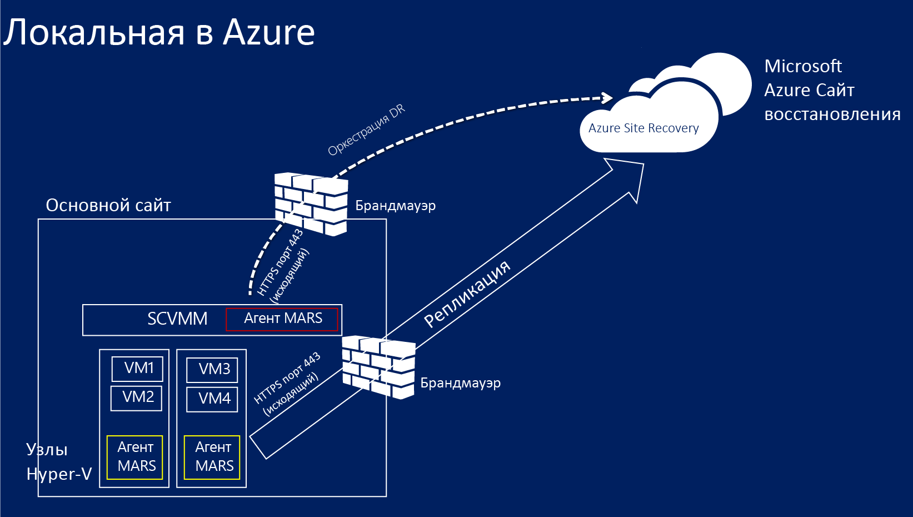

### Предварительные требования сетевого сопоставления
В рамках защиты виртуальных машин в Azure с помощью сопоставления сетей осуществляется сопоставление сетей виртуальных машин на исходном сервере VMM и целевых сетей Azure, что обеспечивает следующие преимущества.

- Отработка отказа всех виртуальных машин выполняется в одной сети, что позволяет им подключаться друг к другу, независимо от назначенного им плана восстановления.
- При наличии сетевого шлюза в целевой сети Azure виртуальные машины могут подключиться к другим локальным виртуальным машинам.
- Если сопоставление не включено, то после отработки отказа в Azure могут подключаться друг к другу только виртуальные машины, переключающиеся на другой ресурс в рамках одного плана восстановления.

Для развертывания сетевого сопоставления требуется следующее.

- Защищаемые виртуальные машины на исходном сервере VMM должны быть подключены к сети виртуальных машин. Эта сеть должна быть подключена к логической сети, которая связана с облаком.
- Сеть Azure, к которой могут подключаться реплицированные виртуальные машины после отработки отказа. Эту сеть вы выбираете во время отработки отказа. Сеть должна быть в том же регионе, в котором действует ваша подписка Azure Site Recovery.
- Дополнительные сведения о сопоставлении сетей
	- [Настройка логических сетей в VMM](http://go.microsoft.com/fwlink/?LinkId=386307)
	- [Настройка сетей виртуальных машин и шлюзов в VMM](http://go.microsoft.com/fwlink/?LinkId=386308)
	- [Настройка и мониторинг виртуальных сетей в Azure](http://go.microsoft.com/fwlink/?LinkId=402555)

## Шаг 1. Создание хранилища Site Recovery

1. Войдите на [портал Azure](https://portal.azure.com) с сервера VMM, который нужно зарегистрировать.

2. Разверните элементы **Службы данных** и **Службы восстановления**, а затем щелкните **Хранилище Site Recovery**.

3. Щелкните **Создать**, а затем **Быстрое создание**.

4. В поле **Имя** введите понятное имя для идентификации хранилища.

5. В поле **Область** выберите географический регион для хранилища архивации. Доступные географические регионы: Восточная Азия, Западная Европа, Запад США, Восток США, Северная Европа и Юго-Восточная Азия.
6. Щелкните элемент **Создать хранилище**.

	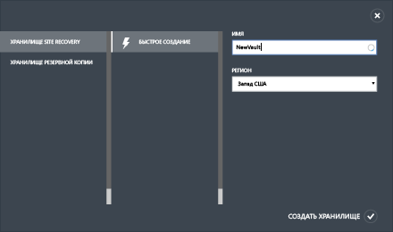

Проверьте строку состояния, чтобы убедиться, что хранилище успешно создано. На главной странице cлужб восстановления хранилище будет указано как *Активное*.

## Шаг 2. Создание ключа регистрации хранилища

Создайте ключ регистрации в хранилище. После загрузки поставщика Azure Site Recovery и установки его на сервер VMM этот ключ используется для регистрации сервера VMM в хранилище.

1. На странице **Службы восстановления** щелкните хранилище, чтобы открыть страницу **быстрого запуска**. Страницу **быстрого запуска** можно открыть и в любой другой момент, щелкнув этот значок.

	

2. В раскрывающемся списке выберите элемент **Между локальным узлом Hyper-V и Microsoft Azure**.
3. В разделе **Prepare VMM Servers** (Подготовка серверов VMM) выберите пункт **Generate registration key** (Создать регистрационный ключ). Файл ключа создается автоматически. Срок действия ключа — пять дней с момента создания. Если вы получаете доступ к порталу Azure не с сервера VMM, вам потребуется скопировать этот файл на сервер.

	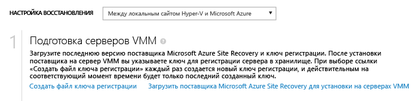

## Шаг 3. Установка поставщика Azure Site Recovery

4. На странице **Быстрый запуск** в разделе **Prepare VMM servers** (Подготовка серверов VMM) выберите пункт **Download Microsoft Azure Site Recovery Provider for installation on VMM servers** (Скачать поставщик Microsoft Azure Site Recovery для установки на серверы VMM), чтобы получить последнюю версию установочного файла приложения поставщика.

2. Запустите этот файл на исходном сервере VM. Если развертывание VMM выполняется в кластере и вы устанавливаете поставщик впервые, установите его на активном узле и завершите установку, чтобы зарегистрировать сервер VMM в хранилище. Затем установите поставщик на других узлах. Учтите, что при обновлении поставщика потребуется обновить его на всех узлах, так как все они должны работать под управлением одной версии.

3. В разделе **Pre-requirements Check** (Проверка предварительных требований) выберите остановку службы VMM, чтобы начать установку приложения поставщика. Служба остановится и будет перезапущена автоматически после завершения установки. При установке в кластере VMM будет выдан запрос на остановку роли Cluster.

	

4. В **Центре обновления Майкрософт** вы можете настроить обновления. Если этот параметр включен, то обновления поставщика будут устанавливаться в соответствии с вашей политикой Центра обновления Майкрософт.

	

После установки приложения поставщика продолжите установку, чтобы зарегистрировать сервер в хранилище.

5. На странице **Подключение к Интернету** укажите, как запущенный на сервере VMM поставщик подключается к Интернету. Выберите пункт **Use default system proxy settings** (Использовать настройки прокси-сервера по умолчанию), чтобы использовать настройки подключения к Интернету, по умолчанию заданные на сервере.

	
	- Если вы хотите использовать настраиваемый прокси-сервер, его следует настроить перед установкой поставщика. При настройке параметров прокси-сервера будет выполнена проверка прокси-подключения.
	- Если используется настраиваемый прокси-сервер или если ваш прокси-сервер требует выполнения проверки подлинности, необходимо ввести данные прокси-сервера, включая адрес прокси-сервера и порт.
	- С сервера VMM и узлов Hyper-v должны быть доступны следующие адреса:
		- *.hypervrecoverymanager.windowsazure.com
		- *.accesscontrol.windows.net
		- *.backup.windowsazure.com
		- *.blob.core.windows.net
		- *.store.core.windows.net.
	- Разрешите доступ с IP-адресов, описанных в разделе [Диапазоны IP-адресов центра обработки данных Azure](http://go.microsoft.com/fwlink/?LinkId=511094), а также с использованием протокола HTTPS (порт 443). Необходимо разрешить диапазоны IP-адресов региона Azure, который вы планируете использовать, и Запада США.

	- При использовании настраиваемого прокси-сервера автоматически создается учетная запись запуска от имени VMM (DRAProxyAccount), использующая указанные учетные данные прокси-сервера. Настройте прокси-сервер так, чтобы эта учетная запись могла успешно проходить проверку подлинности. Параметры учетной записи запуска от имени VMM можно изменить в консоли VMM. Для этого откройте рабочую область **Параметры**, разверните раздел **Безопасность**, щелкните **Учетные записи запуска от имени**, а затем измените пароль для учетной записи DRAProxyAccount. Чтобы параметры вступили в силу, потребуется перезапустить службу VMM.

6. В поле **Регистрационный ключ** укажите, что вы скачали его с Azure Site Recovery и скопировали на сервер VMM.
7. В поле **Имя хранилища** проверьте имя хранилища, в котором будет зарегистрирован сервер.
8. В поле **Имя сервера** укажите понятное имя, описывающее сервер VMM в хранилище. В конфигурации кластера укажите имя роли кластера VMM.

	

8. В поле синхронизации **Initial cloud metadata** (Первоначальные метаданные в облаке) выберите, нужно ли синхронизировать метаданные для всех облаков сервера VMM в хранилище. На каждом сервере это действие требуется выполнять только один раз. Если не требуется синхронизировать все облака, можно оставить этот флажок снятым и синхронизировать каждое облако отдельно в свойствах облака в консоли VMM.

9. В параметре **Шифрование данных для виртуальных машин, защищенных Azure** следует указать расположение сертификата SSL, который создается автоматически для выполнения этой операции. Этот сертификат используется при активации шифрования данных для облачных сред, защищенных Azure на портале Azure Site Recovery. Данный сертификат следует хранить в безопасном месте. Его будет предложено выбрать для расшифровки данных при выполнении отработки отказа в Azure.

	

8. Для завершения процесса нажмите кнопку **Зарегистрировать**. После регистрации метаданные с сервера VMM извлекаются службой Azure Site Recovery. Сервер отображается на вкладке **Ресурсы** на странице **Серверы** в хранилище.

## Шаг 4. Создание учетной записи хранения Azure

При отсутствии учетной записи хранения Azure щелкните **Добавить учетную запись хранения Azure**. Для учетной записи необходимо включить георепликацию. Она должна находиться в том же регионе, что и служба Azure Site Recovery, и быть связана с той же подпиской.

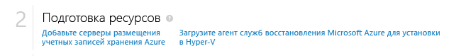

## Шаг 5. Установка агента служб восстановления Azure

Установите агент служб восстановления Azure на всех серверах узлов Hyper-V в облаках VMM, для которых предполагается настроить защиту.

1. На странице **быстрого запуска** щелкните <b>Загрузить и установить на узлах агент служб Azure Site Recovery</b>, чтобы получить последнюю версию файла установки агента.

	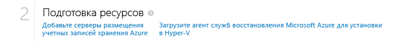

2. Запустите файл установки на каждом сервере узла Hyper-V, размещенном в облаках VMM, которые необходимо защитить.
3. На странице **Проверка готовности к установке** нажмите кнопку <b>Далее</b>. Все отсутствующие предварительные требования будут установлены автоматически.

	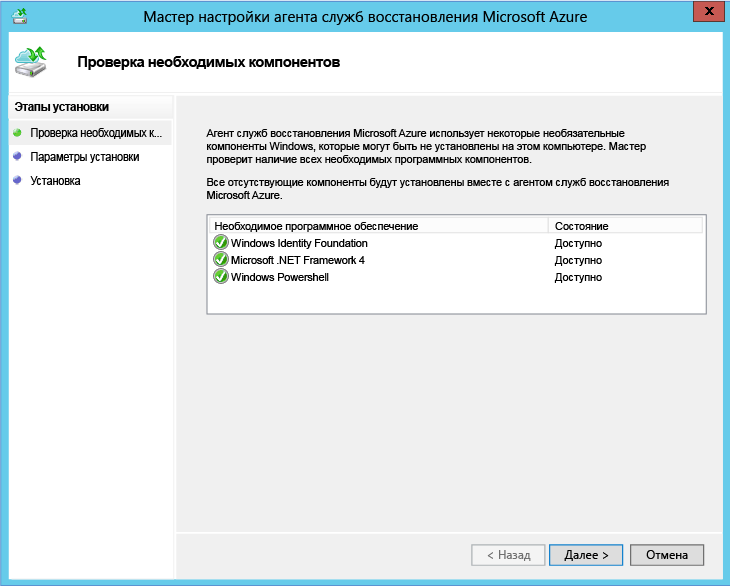

4. На странице **Параметры установки** задайте место для установки агента и выберите местоположение кэша, в котором будут установлены метаданные резервной копии. Нажмите кнопку <b>Установить</b>.

## Шаг 6. Настройка параметров защиты облачных систем

После регистрации сервера VMM можно настроить параметры защиты облака. Параметр **Синхронизировать облачные данные с хранилищем** был включен при установке поставщика, поэтому все облака на сервере VMM появятся на вкладке <b>Защищенные элементы</b> в хранилище.

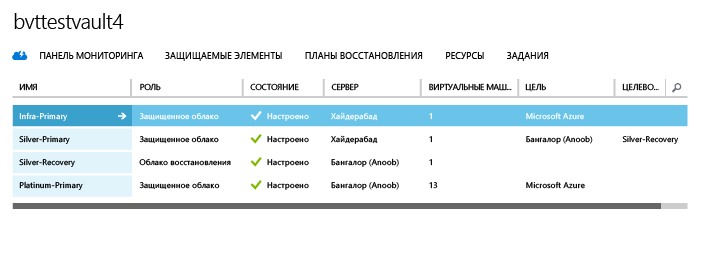

1. На странице **быстрого запуска** щелкните **Настроить защиту для облаков VM**.
2. На вкладке **Защищенные элементы** выберите облако, которое нужно настроить, и перейдите на вкладку **Конфигурация**.
3. В поле <b>Цель</b> выберите <b>Microsoft Azure</b>.
4. В поле <b>Учетная запись хранения</b> выберите учетную запись хранения Azure, в которую будут реплицироваться виртуальные машины Azure.
5. Задайте для параметра <b>Шифрование сохраненных данных</b> значение <b>Выкл</b>. Этот параметр определяет, что данные должны шифроваться при передаче между локальным сайтом и Azure.
6. В поле <b>Периодичность копирования</b> оставьте значение по умолчанию. Это значение указывает, как часто следует синхронизировать данные между исходным и конечным расположениями.
7. В поле <b>Сохранение точек восстановления для</b> оставьте значение по умолчанию. При использовании нулевого значения по умолчанию на сервере узла реплики хранится только последняя точка восстановления для основной виртуальной машины.
8. В поле <b>Периодичность создания соответствующих приложению снимков</b> оставьте значение по умолчанию. Это значение указывает, как часто создаются моментальные снимки. Снимки используют службу теневого копирования томов (VSS), чтобы обеспечить согласованное состояние приложение при создании моментального снимка. Если это значение задается, оно должно быть меньше количества дополнительных точек восстановления, которое было настроено.
9. В поле <b>Время запуска репликации</b> укажите, когда должна запускаться начальная репликация данных в Azure. Используется часовой пояс сервера узла Hyper-V. Рекомендуется запланировать начальную репликацию на часы наименьшей нагрузки.

	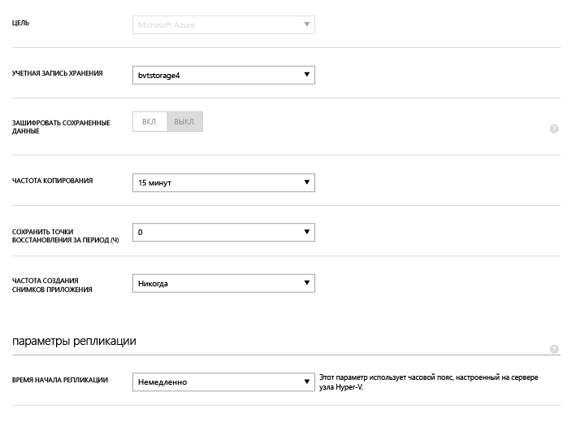

После сохранения параметров создается задание, которое можно отслеживать на вкладке <b>Задания</b>. Все сервера узлов Hyper-V в исходном облаке VMM могут быть настроены для репликации.

После сохранения параметры облака можно изменить на вкладке <b>Настройка</b>. Чтобы изменить целевое расположение или целевое хранилище, необходимо удалить конфигурацию облака, а затем повторно его настроить. Обратите внимание, что при изменении учетной записи хранения изменение применяется только к виртуальным машинам, которые включены для защиты после изменения учетной записи хранения. Существующие виртуальные машины в новую учетную запись хранения не переносятся.

## Шаг 7. Настройка сетевого сопоставления
Прежде чем приступать к настройке сетевого сопоставления, убедитесь, что виртуальные машины на исходном сервере VMM подключены к сети виртуальных машин. Кроме того, создайте одну или несколько виртуальных сетей Azure. Учтите, что несколько сетей виртуальных машин можно сопоставить с одной сетью Azure.

1. На странице **быстрого запуска** щелкните **Сопоставление сетей**.
2. На вкладке **Сети** в поле **Исходное расположение** выберите исходный сервер VMM. В поле **Целевое расположение** выберите **Azure**.
3. В списке **исходных сетей** отображаются сети виртуальных машин, связанные с сервером VMM. В списке **целевых** сетей отображаются сети Azure, связанные с подпиской.
4. Выберите исходную сеть виртуальных машин и нажмите кнопку **Сопоставить**.
5. На странице **Выбор целевой сети** выберите целевую сеть Azure, которую вы хотите использовать.
6. Установите флажок для завершения процесса сопоставления.

	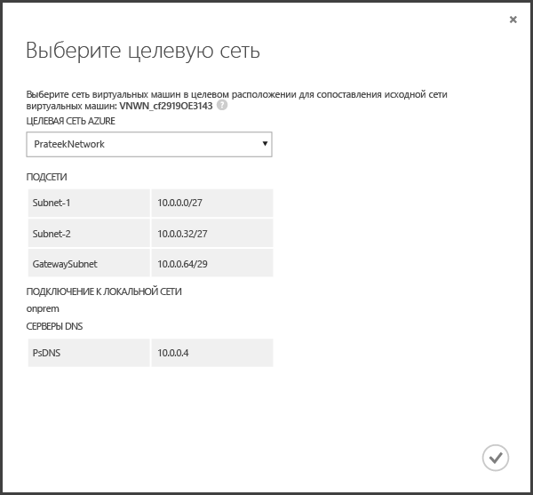

После сохранения параметров будет запущено задание, отслеживающее выполнение сопоставления. Этот процесс можно наблюдать на вкладке **Задания**. Все существующие реплики виртуальных машин, соответствующие исходной сети виртуальных машин, будут подключены к целевым сетям Azure. Новые виртуальные машины, подключенные к исходной сети виртуальных машин, будут подключены к сопоставленной сети Azure после репликации. Если изменить существующее сопоставление, указав новую сеть, реплики виртуальных машин будут подключаться с новыми параметрами.

Обратите внимание, что целевая сеть может включать несколько подсетей, одна из них будет иметь то же имя, что и подсеть, в которой размещается исходная виртуальная машина. В таком случае после отработки отказа виртуальная машина реплики будет подключена к этой целевой подсети. Если нет подсетей с таким же именем, виртуальная машина будет подключена к первой подсети в сети.

## Шаг 8. Включение защиты для виртуальных машин

После успешной настройки серверов, облаков и сетей можно включить защиту для виртуальных машин в облаке. Обратите внимание на следующее.

- Виртуальные машины должны соответствовать требованиям, предъявляемым Azure. Эти требования приведены в разделе <a href="http://go.microsoft.com/fwlink/?LinkId=402602">Необходимые компоненты и поддержка</a> руководства по планированию.
- Для обеспечения защиты должны быть заданы соответствующие свойства операционной системы и диска с операционной системой. Данные свойства можно установить при создании виртуальной машины в VMM с помощью шаблона виртуальной машины. Также вы можете настроить эти параметры для существующих виртуальных машин на вкладках **Общие** и **Конфигурация оборудования** свойств виртуальной машины. Если установка этих свойств в VMM не была выполнена, сделать это можно на портале Azure Site Recovery.

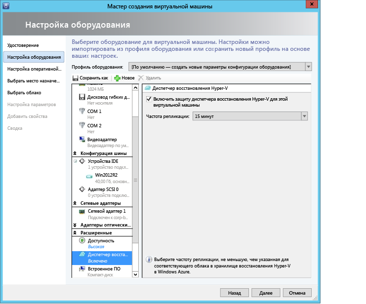

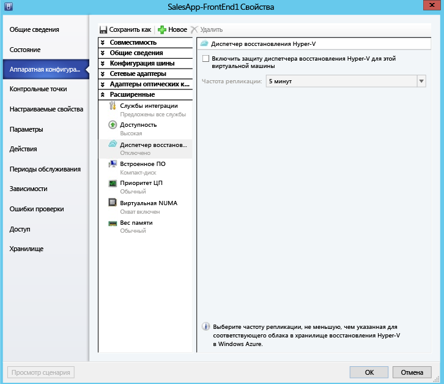

1. Чтобы включить защиту, в облаке, в котором расположена виртуальная машина, на вкладке <b>Виртуальные машины</b> щелкните <b>Включить защиту</b> и выберите <b>Добавить виртуальные машины</b>.
2. Из списка виртуальных машин в облаке выберите те, которые хотите защитить.

	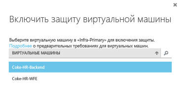

	За ходом выполнения действия «Включение защиты», в том числе и за первоначальной репликацией, можно наблюдать на вкладке **Задания**. После запуска задачи финализации защиты виртуальная машина готова к отработке отказа. После включения защиты и репликации виртуальных машин вы сможете просматривать их в Azure.

	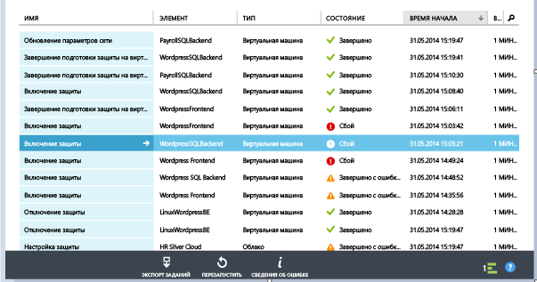

3. Проверьте свойства виртуальной машины и внесите в них необходимые изменения.

	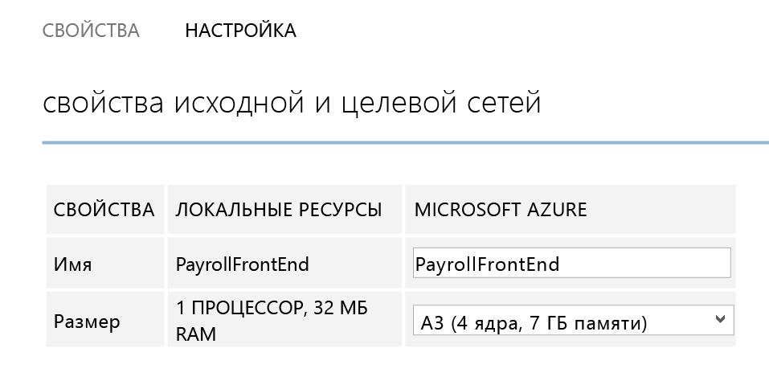

4. На вкладке настройки свойств виртуальной машины можно изменить следующие свойства сети.

    - Количество сетевых адаптеров целевой виртуальной машины: количество сетевых адаптеров целевой виртуальной машины зависит от размера выбранной виртуальной машины. Минимальное значение количества сетевых адаптеров целевой виртуальной машины — это количество сетевых адаптеров исходной виртуальной машины, а максимальное определяется размером выбранной виртуальной машины.  

	- Сеть целевой виртуальной машины: сеть, к которой подключается виртуальная машина, определяется сопоставлением сети исходной виртуальной машины. Если у исходной виртуальной машины имеется несколько сетевых адаптеров, а исходные сети сопоставлены с различными сетями на целевом узле, пользователю необходимо выбрать одну из целевых сетей.

	1. Подсеть для каждого из сетевых адаптеров: для каждого сетевого адаптера можно выбрать подсеть, к которой будет подключаться виртуальная машина в случае сбоя.

	1. Целевой IP-адрес: если сетевой адаптер исходной виртуальной машины настроен на использование статического IP-адреса, пользователь может указать IP-адрес целевой виртуальной машины. Пользователь может использовать эту возможность для сохранения IP-адреса исходной виртуальной машины после отработки отказа. Если IP-адрес не указан, то при отработке отказа сетевому адаптеру будет присвоен любой доступный IP-адрес. Если предоставленный пользователем целевой IP-адрес уже используется другими виртуальными машинами в Azure, отработка отказа завершится сбоем.

		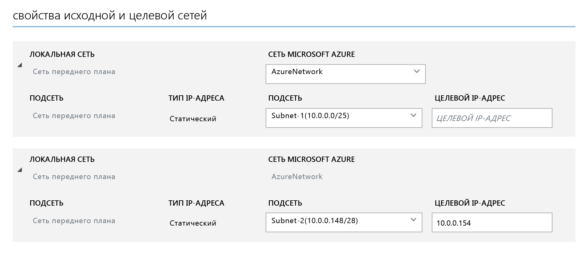

## Выполните тестирование развертывания
Чтобы протестировать развертывание, можно запустить тестовую отработку отказа для отдельной виртуальной машины или создать план восстановления, состоящий из нескольких виртуальных машин, и запустить тестовую отработку отказа плана. Тестовая обработка отказа имитирует механизм отработки отказа и восстановления в изолированной сети. Обратите внимание на следующее.

- При необходимости подключиться к виртуальной машине в Azure с использованием удаленного рабочего стола после отработки отказа, включите подключение удаленного рабочего стола на виртуальной машине до запуска тестирования отработки отказа.
- После отработки отказа будет использоваться общедоступный IP-адрес, чтобы подключиться к виртуальной машине в Azure с использованием удаленного рабочего стола. Если необходимо это сделать, убедитесь в отсутствии политик домена, которые не допустили бы подключение к виртуальной машине с использованием общедоступного адреса.

### Создайте план восстановления

1. На вкладке **Планы восстановления** добавьте новый план. Укажите имя **VMM** в поле **Тип источника** и исходный сервер VMM в поле **Источник**. В качестве целевого расположения выберите Azure.

	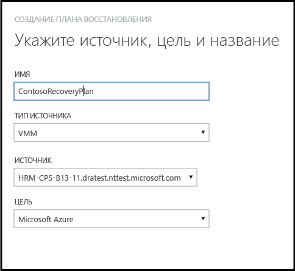

2. На странице **Выбор виртуальных машин** выберите виртуальные машины, которые требуется добавить в план восстановления. Эти виртуальные машины добавляются в группу плана восстановления по умолчанию (группа 1). Проводилось тестирование сценария с максимум 100 виртуальными машинами в одном плане восстановления.

	- Если вы хотите проверить свойства виртуальной машины до добавления ее в план, щелкните виртуальную машину на странице свойств облака, в котором она размещается. Также можно настроить свойства виртуальной машины в консоли VMM.
	- Защита включена для всех отображаемых виртуальных машин. В списке содержатся виртуальные машины, для которых включена защита и выполнена начальная репликация, и виртуальные машины, для которых включена защита и начальная репликация не завершена. Отработка отказа в рамках плана восстановления может выполняться только для виртуальных машин с выполненной начальной репликацией. Поэтому необходимо проверить состояние начальной репликации виртуальных машин до начала отработки отказа плана восстановления.

	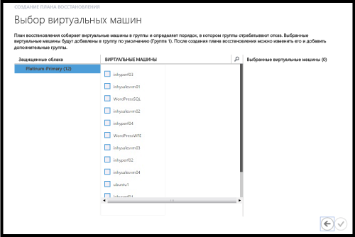

Созданный план восстановления появится на вкладке **Планы восстановления**. Также к плану восстановления можно добавить [модули Runbook службы автоматизации Azure](site-recovery-runbook-automation.md), чтобы автоматизировать процедуру обработки отказа.

### Запуск тестовой отработки отказа

Существует два способа запуска тестовой отработки отказа в Azure.

- Тестовая отработка отказа без сети Azure. Этот тип тестовой отработки отказа проверяет правильную работу виртуальной машины в Azure. Виртуальная машина не подключается к сети Azure после отработки отказа.
- Тестовая отработка отказа с сетью Azure. Этот тип отработки отказа проверяет, работает ли вся среда репликации, как ожидалось, и подключаются ли виртуальные машины, для которых выполнена отработка отказа, к указанной целевой сети Azure. Режим тестовой отработки отказа с подсетью предусматривает определение подсети тестовой виртуальной машины на основе подсети виртуальной машины реплики. Этот режим отличается от обычной репликации, когда подсеть реплики виртуальной машины основывается на подсети исходной виртуальной машины.

Если вы хотите выполнить тестовую отработку отказа для виртуальной машины с включенной защитой в Azure без указания целевой сети Azure, никакой подготовки не требуется. Для запуска тестовой отработки отказа с целевой сетью Azure вам потребуется создать новую сеть Azure, изолированную от рабочей среды Azure (обычная практика при создании новой сети в Azure). Кроме того, нужно настроить инфраструктуру в соответствии с требуемым режимом работы реплицируемой виртуальной машины. Допустим, виртуальная машина с контроллером домена и DNS может быть реплицирована в Azure с помощью Azure Site Recovery и создана в тестовой сети с помощью тестовой отработки отказа. Для проверки отработки отказа выполните следующие действия.

1. Выполните тестовую отработку отказа виртуальной машины с контролером домена и DNS в той же сети, которую вы будете использовать для фактической тестовой отработки отказа локальных виртуальных машин.
2. Сохраните IP-адреса, выделенные виртуальным машинам DNS с выполненной отработкой отказа.
3. В виртуальной сети Azure, которая будет использоваться для отработки отказа, добавьте IP-адрес как адрес DNS-сервера.
4. Запустите тестовую отработку отказа исходной локальной виртуальной машины, указав тестовую сеть Azure.
5. Убедившись, что тестовая отработка отказа выполняется, как ожидалось, пометьте эту тестовую отработку отказа как выполненную для плана восстановления, а затем пометьте ее как выполненную для виртуальных машин с контроллером домена и DNS.

Для запуска тестовой отработки отказа выполните следующие действия.

1. На вкладке **Планы восстановления** выберите план и щелкните **Тестовая отработка отказа**.
1. На **странице подтверждения тестовой отработки отказа** выберите **Нет** или конкретную сеть Azure. Учтите, что при выборе варианта **Нет** в ходе тестовой отработки отказа будет проверяться правильность репликации виртуальной машины в Azure, но не конфигурация сети репликации.

	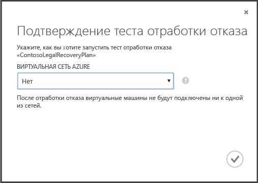

1. Если для облака включено шифрование данных, выберите в поле **Ключ шифрования** сертификат, который был выдан в ходе установки поставщика на сервере VMM при включении шифрования данных для облака
1. На вкладке **Задания** можно отследить ход выполнения отработки отказа. Кроме того, вы можете просмотреть тестовую реплику виртуальной машины на портале Azure. Если настройки предусматривают доступ к виртуальным машинам из локальной сети, можно инициировать подключение протокола удаленного рабочего стола к виртуальной машине.
1. После того как отработка отказа достигнет фазы **Полное тестирование**, нажмите кнопку **Завершить тестирование**, чтобы закончить действие. Вы можете перейти на вкладку **Задания**, чтобы отслеживать ход выполнения отработки отказа и изменение ее состояния, а также выполнять прочие необходимые действия.
1. После отработки отказа тестовая реплика виртуальной машины будет отображаться на портале Azure. Если настройки предусматривают доступ к виртуальным машинам из локальной сети, можно инициировать подключение протокола удаленного рабочего стола к виртуальной машине.

    а. Проверьте, успешно ли выполнен запуск виртуальных машин.

    b. При необходимости подключиться к виртуальной машине в Azure с использованием удаленного рабочего стола после отработки отказа, включите подключение удаленного рабочего стола на виртуальной машине до запуска тестирования отработки отказа. Кроме того, на виртуальной машине потребуется добавить конечную точку RDP. Для этого можно использовать модули [Runbook службы автоматизации Azure](site-recovery-runbook-automation.md).

    c. Если вы используете общедоступный IP-адрес для подключения к виртуальной машине в Azure с помощью удаленного рабочего стола, после отработки отказа убедитесь, что у вас нет политик доменов, которые препятствуют подключению к виртуальной машине с помощью общедоступного адреса.

1.  После завершения тестирования выполните следующие действия:
	- Щелкните пункт **Тестовая отработка отказа завершена**. Проведите очистку тестовой среды, чтобы автоматически отключить питание и удалить тестовые виртуальные машины.
	- Щелкните элемент **Примечания** для регистрации и сохранения любых наблюдений, связанных с тестовой отработкой отказа.

## Мониторинг операций

Вы можете использовать вкладку **Задания** и **Панель мониторинга**, чтобы просматривать и отслеживать выполнение основных заданий в хранилище Azure Site Recovery. Эти задания включают настройку защиты для облака, включение и отключение защиты для виртуальной машины, выполнение отработки отказа (запланированной, незапланированной или тестовой), а также выполнение незапланированной отработки отказа.

На вкладке **Задания** можно просматривать задания, подробности их выполнения и ошибки. А также запускать запросы на извлечение заданий, отвечающих определенным условиям, экспортировать задания в формат Excel и перезапускать задания, завершившиеся сбоем.

На **Панели мониторинга** можно скачивать последние версии файлов установки поставщика и агента, получать информацию о конфигурации хранилища, просматривать количество виртуальных машин, защитой которых управляет хранилище, просматривать последние задания, управлять сертификатом хранилища, а также проводить повторную синхронизацию виртуальных машин.

Дополнительную информацию о взаимодействии с заданиями и панелью мониторинга см. в <a href="http://go.microsoft.com/fwlink/?LinkId=398534">руководстве по эксплуатации и мониторингу</a>.

## Дальнейшие действия
<UL>
<LI>Сведения о планировании и развертывании Azure Site Recovery в полной рабочей среде см. в руководствах <a href="http://go.microsoft.com/fwlink/?LinkId=321294">Планирование службы Azure Site Recovery</a> и <a href="http://go.microsoft.com/fwlink/?LinkId=321295">Развертывание службы Azure Site Recovery</a>.</LI>

<LI>Со всеми вопросами обращайтесь на <a href="http://go.microsoft.com/fwlink/?LinkId=313628">форум по службам восстановления Azure</a>.</LI> </UL>

<!-----HONumber=August15_HO8-->