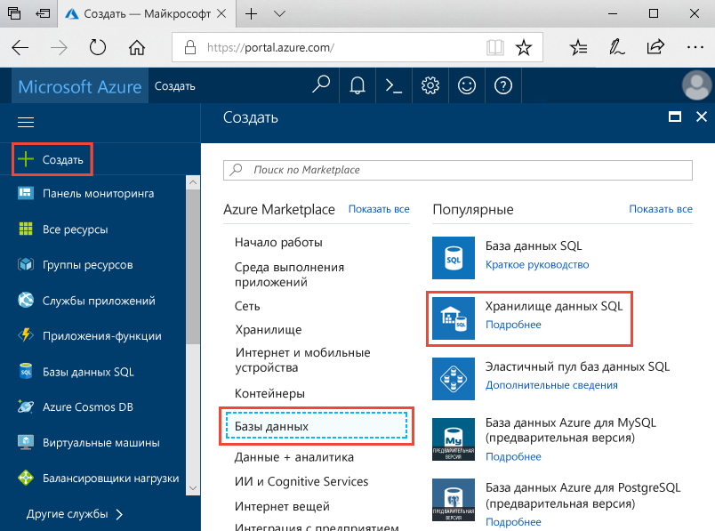
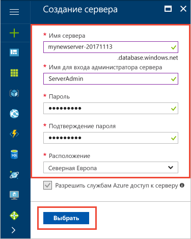
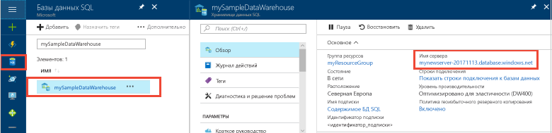
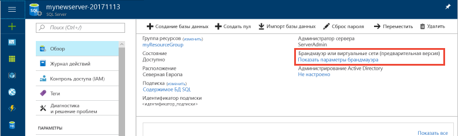
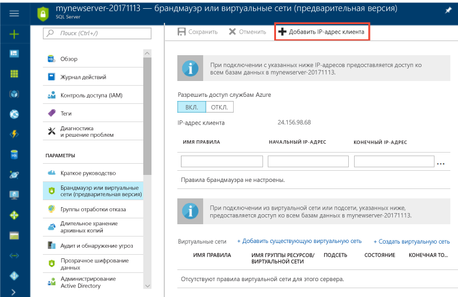

# <a name="tutorial-load-new-york-taxicab-data-to-azure-sql-data-warehouse"></a>Руководство по загрузке данных такси Нью-Йорка в хранилище данных SQL Azure

В этом руководстве PolyBase используется для загрузки данных такси Нью-Йорка из общедоступного большого двоичного объекта Azure в хранилище данных SQL Azure. В рамках этого руководства [портал Azure](https://portal.azure.com) и [SQL Server Management Studio](/sql/ssms/download-sql-server-management-studio-ssms) (SSMS) используются, чтобы выполнить такие действия: 

> [!div class="checklist"]
> * создать хранилище данных на портале Azure;
> * настроить правило брандмауэра на уровне сервера на портале Azure;
> * подключиться к хранилищу данных с помощью SSMS;
> * создать учетную запись пользователя, предназначенную для загрузки данных;
> * создать внешние таблицы для данных в хранилище BLOB-объектов Azure;
> * использовать инструкцию T-SQL CTAS для загрузки данных в хранилище данных;
> * просмотреть ход выполнения загрузки данных;
> * создать статистику для вновь загруженных данных.

Если у вас еще нет подписки Azure, [создайте бесплатную учетную запись Azure](https://azure.microsoft.com/free/), прежде чем начинать работу.

## <a name="before-you-begin"></a>Перед началом работы

Перед началом работы с этим руководством скачайте и установите последнюю версию [SQL Server Management Studio](/sql/ssms/download-sql-server-management-studio-ssms) (SSMS).


## <a name="log-in-to-the-azure-portal"></a>Войдите на портал Azure.

Войдите на [портал Azure](https://portal.azure.com/).

## <a name="create-a-blank-sql-data-warehouse"></a>Создание пустого хранилища данных SQL

Хранилище данных SQL Azure создается с определенным набором [вычислительных ресурсов](memory-and-concurrency-limits.md). База данных создается в пределах [группы ресурсов Azure](../azure-resource-manager/resource-group-overview.md) и [логического сервера SQL Azure](../sql-database/sql-database-features.md). 

Чтобы создать пустое хранилище данных SQL, выполните приведенные ниже действия. 

1. Щелкните **Создать ресурс** в верхнем левом углу окна портала Azure.

2. Выберите **Базы данных** на странице **Создание**, а затем выберите **Хранилище данных SQL** в разделе **Избранные** на странице **Создание**.

    

3. Заполните форму для создания хранилища данных SQL, указав следующие сведения:   

   | Параметр | Рекомендуемое значение | ОПИСАНИЕ | 
   | ------- | --------------- | ----------- | 
   | **Database name** (Имя базы данных) | mySampleDataWarehouse | Допустимые имена баз данных см. в статье об [идентификаторах базы данных](/sql/relational-databases/databases/database-identifiers). | 
   | **Подписка** | Ваша подписка  | Дополнительные сведения о подписках см. [здесь](https://account.windowsazure.com/Subscriptions). |
   | **Группа ресурсов** | myResourceGroup | Допустимые имена групп ресурсов см. в статье о [правилах и ограничениях именования](https://docs.microsoft.com/azure/architecture/best-practices/naming-conventions). |
   | **Выбрать источник** | Пустая база данных | Указывает, что требуется создать пустую базу данных. Обратите внимание, что хранилище данных — это один из типов базы данных.|

    

4. Щелкните **Сервер**, чтобы создать и настроить новый сервер для новой базы данных. Заполните форму для **создания сервера**, указав следующую информацию. 

    | Параметр | Рекомендуемое значение | ОПИСАНИЕ | 
    | ------- | --------------- | ----------- |
    | **Server name** (Имя сервера) | Любое глобально уникальное имя | Допустимые имена серверов см. в статье о [правилах и ограничениях именования](https://docs.microsoft.com/azure/architecture/best-practices/naming-conventions). | 
    | **Имя для входа администратора сервера** | Любое допустимое имя | Допустимые имена входа см. в статье об [идентификаторах базы данных](https://docs.microsoft.com/sql/relational-databases/databases/database-identifiers).|
    | **Пароль** | Любой допустимый пароль | Длина пароля должна составлять минимум 8 символов. Пароль должен содержать символы трех категорий из перечисленных: прописные буквы, строчные буквы, цифры и специальные символы. |
    | **Местоположение.** | Любое допустимое расположение | Дополнительные сведения о регионах Azure см. [здесь](https://azure.microsoft.com/regions/). |

    

5. Нажмите кнопку **Выбрать**.

6. Щелкните **Уровень производительности**, чтобы указать, к какому поколению (1 или 2) относится хранилище данных, а также настроить единицы использования хранилища данных. 

7. В этом руководстве выберите хранилище данных SQL **поколения 1**. По умолчанию ползунок установлен в положение **DW1000c**.  Попробуйте переместить его вверх и вниз, чтобы увидеть, как он работает. 

    

8. Нажмите кнопку **Применить**.
9. На странице хранилища данных SQL выберите **Параметры сортировки** для пустой базы данных. В этом руководстве используйте значение по умолчанию. Дополнительные сведения о параметрах сортировки см. в [этой статье](/sql/t-sql/statements/collations).

11. Заполнив форму базы данных SQL, нажмите кнопку **Создать**, чтобы подготовить базу данных. Подготовка занимает несколько минут. 

    

12. На панели инструментов щелкните **Уведомления**, чтобы отслеживать процесс развертывания.
    
     

## <a name="create-a-server-level-firewall-rule"></a>создадим правило брандмауэра на уровне сервера;

Служба хранилища данных SQL создает брандмауэр уровня сервера, который не позволяет внешним приложениям и инструментам подключаться к серверу или любой базе данных на сервере. Чтобы разрешить это подключение, можно добавить правила брандмауэра, открывающие подключение для определенных IP-адресов.  Выполните приведенные ниже действия, чтобы создать [правило брандмауэра уровня сервера](../sql-database/sql-database-firewall-configure.md) для IP-адреса клиента. 

> [!NOTE]
> Хранилище данных SQL обменивается данными через порт 1433. Если вы пытаетесь подключиться из корпоративной сети, то исходящий трафик через порт 1433 может быть запрещен сетевым брандмауэром. В таком случае вы не сможете подключиться к серверу базы данных SQL Azure, пока ваш ИТ-отдел не откроет порт 1433.
>

1. По завершении развертывания щелкните раздел **Базы данных SQL** в меню слева и выберите **mySampleDatabase** на странице **баз данных SQL**. После этого откроется страница обзора базы данных, где будет указано полное имя сервера (например, **mynewserver-20180430.database.windows.net**) и предоставлены параметры для дальнейшей настройки. 

2. Скопируйте полное имя сервера. Оно понадобится вам при работе с последующими руководствами для подключения к серверу и связанным базам данных. Затем щелкните имя сервера, чтобы открыть параметры сервера.

     

3. Щелкните имя сервера, чтобы открыть параметры сервера.

     

5. Щелкните **Показать параметры брандмауэра**. Откроется страница **параметров брандмауэра** для сервера базы данных SQL. 

     

4. На панели инструментов щелкните **Добавить IP-адрес клиента**, чтобы добавить текущий IP-адрес в новое правило брандмауэра. С использованием правила брандмауэра можно открыть порт 1433 для одного IP-адреса или диапазона IP-адресов.

5. Выберите команду **Сохранить**. Для текущего IP-адреса будет создано правило брандмауэра уровня сервера, с помощью которого можно открыть порт 1433 логического сервера.

6. Нажмите кнопку **ОК**, а затем закройте страницу **Параметры брандмауэра**.

Теперь с помощью этого IP-адреса можно подключиться к серверу SQL и его хранилищам данных. Подключение выполняется из SQL Server Management Studio или другого инструмента на ваше усмотрение. При подключении используйте созданную ранее учетную запись ServerAdmin.  

> [!IMPORTANT]
> По умолчанию доступ через брандмауэр базы данных SQL включен для всех служб Azure. На этой странице щелкните **Откл.**, а затем нажмите кнопку **Сохранить**, чтобы отключить брандмауэр для всех служб Azure.

## <a name="get-the-fully-qualified-server-name"></a>Получение полного имени сервера

Получите полное имя сервера SQL на портале Azure. Это полное имя затем понадобится при подключении к серверу.

1. Войдите на [портал Azure](https://portal.azure.com/).
2. В меню слева выберите **Хранилища данных SQL** и на странице **Хранилища данных SQL** щелкните имя своей базы данных. 
3. На странице портала Azure вашей базы данных в области **Основные компоненты** найдите и скопируйте **имя сервера**. В этом примере полное имя — mynewserver-20180430.database.windows.net. 

      

## <a name="connect-to-the-server-as-server-admin"></a>Подключение к серверу от имени администратора сервера

В этом разделе для подключения к серверу SQL Azure используется [SQL Server Management Studio](/sql/ssms/download-sql-server-management-studio-ssms) (SSMS).

1. Откройте среду SQL Server Management Studio.

2. В диалоговом окне **Подключение к серверу** введите следующие значения.

    | Параметр      | Рекомендуемое значение | ОПИСАНИЕ | 
    | ------------ | --------------- | ----------- | 
    | Тип сервера | Ядро СУБД | Это обязательное значение |
    | имя сервера; | Полное имя сервера | Имя должно быть в таком формате: **mynewserver-20180430.database.windows.net**. |
    | Authentication | проверка подлинности SQL Server | В рамках работы с этим руководством мы настроили только один тип проверки подлинности — проверку подлинности SQL. |
    | Вход | Учетная запись администратора сервера | Это учетная запись, указанная при создании сервера. |
    | Пароль | Пароль учетной записи администратора сервера | Это пароль, указанный при создании сервера. |

    

4. Щелкните **Подключить**. Откроется окно обозревателя объектов в SSMS. 

5. В обозревателе объектов разверните папку **Базы данных**. Затем разверните **Системные базы данных** и **master**, чтобы просмотреть объекты в базе данных master.  Разверните папку **mySampleDatabase**, чтобы просмотреть объекты в новой базе данных.

     

## <a name="create-a-user-for-loading-data"></a>Создание учетной записи пользователя для загрузки данных

Учетная запись администратора сервера предназначена для операций управления и не подходит для выполнения запросов к пользовательским данным. Загрузка данных — это операция с интенсивным использованием памяти. Максимальные ограничения памяти определяются в соответствии с поколением подготовленного хранилища данных SQL, [единицами хранилища данных](what-is-a-data-warehouse-unit-dwu-cdwu.md) и [классом ресурсов](resource-classes-for-workload-management.md). 

Лучше всего создать имя для входа и имя пользователя, предназначенные для загрузки данных. Затем добавьте пользователя загрузки в [класс ресурсов](resource-classes-for-workload-management.md), позволяющий выполнять соответствующее выделение максимальной памяти.

Поскольку вы подключены в качестве администратора сервера, вы можете создавать пользователей и имена для входа. Используйте эти действия для создания имени для входа и пользователя **LoaderRC20**. Затем назначьте пользователя классу ресурсов **staticrc20**. 

1.  В среде SSMS щелкните правой кнопкой мыши папку **master**, чтобы отобразилось раскрывающееся меню. Затем щелкните **Новый запрос**. Откроется окно нового запроса.

    

2. В окне запроса введите следующие команды T-SQL, чтобы создать имя для входа и пользователя LoaderRC20, заменив 'a123STRONGpassword!' на собственный пароль. 

    ```sql
    CREATE LOGIN LoaderRC20 WITH PASSWORD = 'a123STRONGpassword!';
    CREATE USER LoaderRC20 FOR LOGIN LoaderRC20;
    ```

3. Нажмите **Execute (Выполнить)**.

4. Щелкните правой кнопкой мыши **mySampleDataWarehouse** и выберите **Новый запрос**. Откроется окно нового запроса.  

    
 
5. Введите следующие команды T-SQL, чтобы создать пользователя базы данных с именем LoaderRC20 для имени для входа LoaderRC20. Вторая строка предоставляет новому пользователю разрешения на управление (CONTROL) новым хранилищем данных.  Эти разрешения аналогичны назначению пользователя владельцем базы данных. Третья строка добавляет нового пользователя в качестве участника [класса ресурсов](resource-classes-for-workload-management.md) staticrc20.

    ```sql
    CREATE USER LoaderRC20 FOR LOGIN LoaderRC20;
    GRANT CONTROL ON DATABASE::[mySampleDataWarehouse] to LoaderRC20;
    EXEC sp_addrolemember 'staticrc20', 'LoaderRC20';
    ```

6. Нажмите **Execute (Выполнить)**.

## <a name="connect-to-the-server-as-the-loading-user"></a>Подключение к серверу от имени пользователя, выполняющего загрузку

Первый шаг к загрузке данных — это войти в систему как пользователь LoaderRC20.  

1. В обозревателе объектов щелкните раскрывающееся меню **Подключить** и выберите пункт **Ядро СУБД**. Отобразится диалоговое окно **Подключение к серверу**.

    

2. Введите полное имя сервера и в качестве имени для входа укажите **LoaderRC20**.  Введите пароль для LoaderRC20.

3. Щелкните **Подключить**.

4. Когда подключение будет готово, вы увидите в обозревателе объектов два подключения к серверу. Одно подключение — как ServerAdmin, а второе — как MedRCLogin.

    

## <a name="create-external-tables-for-the-sample-data"></a>Создание внешних таблиц для примеров данных

Все готово для начала процесса загрузки данных в новое хранилище данных. В этом руководстве показано, как с помощью внешних таблиц загрузить данные о такси Нью-Йорка из большого двоичного объекта хранилища Azure. Сведения о том, как переместить данные в хранилище BLOB-объектов Azure или загрузить их в хранилище данных SQL непосредственно из источника, см. статью [Загрузка данных в хранилище данных Azure SQL](sql-data-warehouse-overview-load.md).

Выполните следующие сценарии SQL и укажите сведения о данных, которые требуется загрузить. К этим сведениям относится информация о расположении данных, формате содержимого данных и определении таблицы для данных. 

1. В предыдущем разделе вы вошли в хранилище данных как пользователь LoaderRC20. В среде SSMS щелкните правой кнопкой мыши подключение LoaderRC20 и выберите **Новый запрос**.  Откроется окно нового запроса. 

    

2. Сравните окно запроса с предыдущим изображением.  Убедитесь, что окно нового запроса запущено как LoaderRC20 и выполняет запросы к базе данных MySampleDataWarehouse. Используйте это окно запроса для выполнения всех шагов загрузки.

3. Создайте главный ключ для базы данных MySampleDataWarehouse. Главный ключ создается для каждой базы данных только один раз. 

    ```sql
    CREATE MASTER KEY;
    ```

4. Выполните приведенную ниже инструкцию [CREATE EXTERNAL DATA SOURCE](/sql/t-sql/statements/create-external-data-source-transact-sql), чтобы определить расположение большого двоичного объекта Azure. Это и есть расположение внешних данных о такси.  Для выполнения команды, добавленной в окно запроса, выделите команды, которые необходимо выполнить, и нажмите кнопку **Выполнить**.

    ```sql
    CREATE EXTERNAL DATA SOURCE NYTPublic
    WITH
    (
        TYPE = Hadoop,
        LOCATION = 'wasbs://2013@nytaxiblob.blob.core.windows.net/'
    );
    ```

5. Выполните приведенную ниже инструкцию T-SQL [CREATE EXTERNAL FILE FORMAT](/sql/t-sql/statements/create-external-file-format-transact-sql), чтобы указать характеристики и параметры форматирования для внешнего файла данных. Эта инструкция указывает, что внешние данные хранятся в виде текста, а значения разделяются символом вертикальной черты (|). Внешний файл сжимается с помощью Gzip. 

    ```sql
    CREATE EXTERNAL FILE FORMAT uncompressedcsv
    WITH (
        FORMAT_TYPE = DELIMITEDTEXT,
        FORMAT_OPTIONS ( 
            FIELD_TERMINATOR = ',',
            STRING_DELIMITER = '',
            DATE_FORMAT = '',
            USE_TYPE_DEFAULT = False
        )
    );
    CREATE EXTERNAL FILE FORMAT compressedcsv
    WITH ( 
        FORMAT_TYPE = DELIMITEDTEXT,
        FORMAT_OPTIONS ( FIELD_TERMINATOR = '|',
            STRING_DELIMITER = '',
        DATE_FORMAT = '',
            USE_TYPE_DEFAULT = False
        ),
        DATA_COMPRESSION = 'org.apache.hadoop.io.compress.GzipCodec'
    );
    ```

6.  Выполните приведенную ниже инструкцию [CREATE SCHEMA](/sql/t-sql/statements/create-schema-transact-sql), чтобы создать схему для формата внешних файлов. Эта схема предоставляет способ организации внешних таблиц, которые будут созданы.

    ```sql
    CREATE SCHEMA ext;
    ```

7. Создайте внешние таблицы. Определения таблиц хранятся в хранилище данных SQL, но таблицы ссылаются на данные, которые хранятся в хранилище BLOB-объектов Azure. Выполните следующие команды T-SQL, чтобы создать несколько внешних таблиц, все из которых будут указывать на BLOB-объект Azure, определенный нами ранее во внешнем источнике данных.

    ```sql
    CREATE EXTERNAL TABLE [ext].[Date] 
    (
        [DateID] int NOT NULL,
        [Date] datetime NULL,
        [DateBKey] char(10) COLLATE SQL_Latin1_General_CP1_CI_AS NULL,
        [DayOfMonth] varchar(2) COLLATE SQL_Latin1_General_CP1_CI_AS NULL,
        [DaySuffix] varchar(4) COLLATE SQL_Latin1_General_CP1_CI_AS NULL,
        [DayName] varchar(9) COLLATE SQL_Latin1_General_CP1_CI_AS NULL,
        [DayOfWeek] char(1) COLLATE SQL_Latin1_General_CP1_CI_AS NULL,
        [DayOfWeekInMonth] varchar(2) COLLATE SQL_Latin1_General_CP1_CI_AS NULL,
        [DayOfWeekInYear] varchar(2) COLLATE SQL_Latin1_General_CP1_CI_AS NULL,
        [DayOfQuarter] varchar(3) COLLATE SQL_Latin1_General_CP1_CI_AS NULL,
        [DayOfYear] varchar(3) COLLATE SQL_Latin1_General_CP1_CI_AS NULL,
        [WeekOfMonth] varchar(1) COLLATE SQL_Latin1_General_CP1_CI_AS NULL,
        [WeekOfQuarter] varchar(2) COLLATE SQL_Latin1_General_CP1_CI_AS NULL,
        [WeekOfYear] varchar(2) COLLATE SQL_Latin1_General_CP1_CI_AS NULL,
        [Month] varchar(2) COLLATE SQL_Latin1_General_CP1_CI_AS NULL,
        [MonthName] varchar(9) COLLATE SQL_Latin1_General_CP1_CI_AS NULL,
        [MonthOfQuarter] varchar(2) COLLATE SQL_Latin1_General_CP1_CI_AS NULL,
        [Quarter] char(1) COLLATE SQL_Latin1_General_CP1_CI_AS NULL,
        [QuarterName] varchar(9) COLLATE SQL_Latin1_General_CP1_CI_AS NULL,
        [Year] char(4) COLLATE SQL_Latin1_General_CP1_CI_AS NULL,
        [YearName] char(7) COLLATE SQL_Latin1_General_CP1_CI_AS NULL,
        [MonthYear] char(10) COLLATE SQL_Latin1_General_CP1_CI_AS NULL,
        [MMYYYY] char(6) COLLATE SQL_Latin1_General_CP1_CI_AS NULL,
        [FirstDayOfMonth] date NULL,
        [LastDayOfMonth] date NULL,
        [FirstDayOfQuarter] date NULL,
        [LastDayOfQuarter] date NULL,
        [FirstDayOfYear] date NULL,
        [LastDayOfYear] date NULL,
        [IsHolidayUSA] bit NULL,
        [IsWeekday] bit NULL,
        [HolidayUSA] varchar(50) COLLATE SQL_Latin1_General_CP1_CI_AS NULL
    )
    WITH
    (
        LOCATION = 'Date',
        DATA_SOURCE = NYTPublic,
        FILE_FORMAT = uncompressedcsv,
        REJECT_TYPE = value,
        REJECT_VALUE = 0
    ); 
    CREATE EXTERNAL TABLE [ext].[Geography]
    (
        [GeographyID] int NOT NULL,
        [ZipCodeBKey] varchar(10) COLLATE SQL_Latin1_General_CP1_CI_AS NOT NULL,
        [County] varchar(50) COLLATE SQL_Latin1_General_CP1_CI_AS NULL,
        [City] varchar(50) COLLATE SQL_Latin1_General_CP1_CI_AS NULL,
        [State] varchar(50) COLLATE SQL_Latin1_General_CP1_CI_AS NULL,
        [Country] varchar(50) COLLATE SQL_Latin1_General_CP1_CI_AS NULL,
        [ZipCode] varchar(50) COLLATE SQL_Latin1_General_CP1_CI_AS NULL
    )
    WITH
    (
        LOCATION = 'Geography',
        DATA_SOURCE = NYTPublic,
        FILE_FORMAT = uncompressedcsv,
        REJECT_TYPE = value,
        REJECT_VALUE = 0 
    );      
    CREATE EXTERNAL TABLE [ext].[HackneyLicense]
    (
        [HackneyLicenseID] int NOT NULL,
        [HackneyLicenseBKey] varchar(50) COLLATE SQL_Latin1_General_CP1_CI_AS NOT NULL,
        [HackneyLicenseCode] varchar(50) COLLATE SQL_Latin1_General_CP1_CI_AS NULL
    )
    WITH
    (
        LOCATION = 'HackneyLicense',
        DATA_SOURCE = NYTPublic,
        FILE_FORMAT = uncompressedcsv,
        REJECT_TYPE = value,
        REJECT_VALUE = 0
    );
    CREATE EXTERNAL TABLE [ext].[Medallion]
    (
        [MedallionID] int NOT NULL,
        [MedallionBKey] varchar(50) COLLATE SQL_Latin1_General_CP1_CI_AS NOT NULL,
        [MedallionCode] varchar(50) COLLATE SQL_Latin1_General_CP1_CI_AS NULL
    )
    WITH
    (
        LOCATION = 'Medallion',
        DATA_SOURCE = NYTPublic,
        FILE_FORMAT = uncompressedcsv,
        REJECT_TYPE = value,
        REJECT_VALUE = 0
    )
    ;  
    CREATE EXTERNAL TABLE [ext].[Time]
    (
        [TimeID] int NOT NULL,
        [TimeBKey] varchar(8) COLLATE SQL_Latin1_General_CP1_CI_AS NOT NULL,
        [HourNumber] tinyint NOT NULL,
        [MinuteNumber] tinyint NOT NULL,
        [SecondNumber] tinyint NOT NULL,
        [TimeInSecond] int NOT NULL,
        [HourlyBucket] varchar(15) COLLATE SQL_Latin1_General_CP1_CI_AS NOT NULL,
        [DayTimeBucketGroupKey] int NOT NULL,
        [DayTimeBucket] varchar(100) COLLATE SQL_Latin1_General_CP1_CI_AS NOT NULL
    )
    WITH
    (
        LOCATION = 'Time',
        DATA_SOURCE = NYTPublic,
        FILE_FORMAT = uncompressedcsv,
        REJECT_TYPE = value,
        REJECT_VALUE = 0
    );
    CREATE EXTERNAL TABLE [ext].[Trip]
    (
        [DateID] int NOT NULL,
        [MedallionID] int NOT NULL,
        [HackneyLicenseID] int NOT NULL,
        [PickupTimeID] int NOT NULL,
        [DropoffTimeID] int NOT NULL,
        [PickupGeographyID] int NULL,
        [DropoffGeographyID] int NULL,
        [PickupLatitude] float NULL,
        [PickupLongitude] float NULL,
        [PickupLatLong] varchar(50) COLLATE SQL_Latin1_General_CP1_CI_AS NULL,
        [DropoffLatitude] float NULL,
        [DropoffLongitude] float NULL,
        [DropoffLatLong] varchar(50) COLLATE SQL_Latin1_General_CP1_CI_AS NULL,
        [PassengerCount] int NULL,
        [TripDurationSeconds] int NULL,
        [TripDistanceMiles] float NULL,
        [PaymentType] varchar(50) COLLATE SQL_Latin1_General_CP1_CI_AS NULL,
        [FareAmount] money NULL,
        [SurchargeAmount] money NULL,
        [TaxAmount] money NULL,
        [TipAmount] money NULL,
        [TollsAmount] money NULL,
        [TotalAmount] money NULL
    )
    WITH
    (
        LOCATION = 'Trip2013',
        DATA_SOURCE = NYTPublic,
        FILE_FORMAT = compressedcsv,
        REJECT_TYPE = value,
        REJECT_VALUE = 0
    );
    CREATE EXTERNAL TABLE [ext].[Weather]
    (
        [DateID] int NOT NULL,
        [GeographyID] int NOT NULL,
        [PrecipitationInches] float NOT NULL,
        [AvgTemperatureFahrenheit] float NOT NULL
    )
    WITH
    (
        LOCATION = 'Weather',
        DATA_SOURCE = NYTPublic,
        FILE_FORMAT = uncompressedcsv,
        REJECT_TYPE = value,
        REJECT_VALUE = 0
    )
    ;
    ```

8. В обозревателе объектов разверните базу данных mySampleDataWarehouse, чтобы просмотреть список внешних таблиц, которые вы только что создали.

    

## <a name="load-the-data-into-your-data-warehouse"></a>Загрузка данных в хранилище данных

В этом разделе используются внешние таблицы, которые вы только что определили для загрузки примера данных из Azure Storage Blob в хранилище данных SQL.  

> [!NOTE]
> В этом руководстве данные загружаются непосредственно в итоговую таблицу. Как правило, в рабочей среде для загрузки данных в промежуточную таблицу используется команда CREATE TABLE AS SELECT. Если данные расположены в промежуточной таблице, вы можете выполнять все необходимые преобразования. Чтобы добавить данные из промежуточной таблицы в рабочую, используйте выражение INSERT...SELECT. Дополнительные сведения см. в разделе [Вставка данных в рабочую таблицу](guidance-for-loading-data.md#inserting-data-into-a-production-table).
> 

В сценарии используется инструкция T-SQL [CREATE TABLE AS SELECT (CTAS)](/sql/t-sql/statements/create-table-as-select-azure-sql-data-warehouse), чтобы загрузить данные из Azure Storage Blob в новые таблицы в хранилище данных. CTAS создает таблицу на основе результатов инструкции Select. В новой таблице содержатся те же столбцы и типы данных, которые были выведены инструкцией Select. Если инструкция Select выбирает из внешней таблицы, то хранилище данных SQL импортирует данные в реляционную таблицу в хранилище данных. 

1. Выполните следующий сценарий для загрузки данных в новые таблицы в хранилище данных.

    ```sql
    CREATE TABLE [dbo].[Date]
    WITH
    ( 
        DISTRIBUTION = ROUND_ROBIN,
        CLUSTERED COLUMNSTORE INDEX
    )
    AS SELECT * FROM [ext].[Date]
    OPTION (LABEL = 'CTAS : Load [dbo].[Date]')
    ;
    CREATE TABLE [dbo].[Geography]
    WITH
    ( 
        DISTRIBUTION = ROUND_ROBIN,
        CLUSTERED COLUMNSTORE INDEX
    )
    AS
    SELECT * FROM [ext].[Geography]
    OPTION (LABEL = 'CTAS : Load [dbo].[Geography]')
    ;
    CREATE TABLE [dbo].[HackneyLicense]
    WITH
    ( 
        DISTRIBUTION = ROUND_ROBIN,
        CLUSTERED COLUMNSTORE INDEX
    )
    AS SELECT * FROM [ext].[HackneyLicense]
    OPTION (LABEL = 'CTAS : Load [dbo].[HackneyLicense]')
    ;
    CREATE TABLE [dbo].[Medallion]
    WITH
    (
        DISTRIBUTION = ROUND_ROBIN,
        CLUSTERED COLUMNSTORE INDEX
    )
    AS SELECT * FROM [ext].[Medallion]
    OPTION (LABEL = 'CTAS : Load [dbo].[Medallion]')
    ;
    CREATE TABLE [dbo].[Time]
    WITH
    (
        DISTRIBUTION = ROUND_ROBIN,
        CLUSTERED COLUMNSTORE INDEX
    )
    AS SELECT * FROM [ext].[Time]
    OPTION (LABEL = 'CTAS : Load [dbo].[Time]')
    ;
    CREATE TABLE [dbo].[Weather]
    WITH
    ( 
        DISTRIBUTION = ROUND_ROBIN,
        CLUSTERED COLUMNSTORE INDEX
    )
    AS SELECT * FROM [ext].[Weather]
    OPTION (LABEL = 'CTAS : Load [dbo].[Weather]')
    ;
    CREATE TABLE [dbo].[Trip]
    WITH
    (
        DISTRIBUTION = ROUND_ROBIN,
        CLUSTERED COLUMNSTORE INDEX
    )
    AS SELECT * FROM [ext].[Trip]
    OPTION (LABEL = 'CTAS : Load [dbo].[Trip]')
    ;
    ```

2. Просмотрите данные при загрузке. Вы загружаете несколько гигабайт данных и сжимаете их в высокопроизводительные кластеризованные индексы Columnstore. Выполните следующий запрос, использующий динамические административные представления, для отображения состояния загрузки. После запуска запроса сделайте перерыв, пока хранилище данных SQL выполняет объемное задание обработки.

    ```sql
    SELECT
        r.command,
        s.request_id,
        r.status,
        count(distinct input_name) as nbr_files,
        sum(s.bytes_processed)/1024/1024/1024 as gb_processed
    FROM 
        sys.dm_pdw_exec_requests r
        INNER JOIN sys.dm_pdw_dms_external_work s
        ON r.request_id = s.request_id
    WHERE
        r.[label] = 'CTAS : Load [dbo].[Date]' OR
        r.[label] = 'CTAS : Load [dbo].[Geography]' OR
        r.[label] = 'CTAS : Load [dbo].[HackneyLicense]' OR
        r.[label] = 'CTAS : Load [dbo].[Medallion]' OR
        r.[label] = 'CTAS : Load [dbo].[Time]' OR
        r.[label] = 'CTAS : Load [dbo].[Weather]' OR
        r.[label] = 'CTAS : Load [dbo].[Trip]'
    GROUP BY
        r.command,
        s.request_id,
        r.status
    ORDER BY
        nbr_files desc, 
        gb_processed desc;
    ```

3. Просмотрите все запросы в системе.

    ```sql
    SELECT * FROM sys.dm_pdw_exec_requests;
    ```

4. Посмотрите, как данные упорядоченно загружаются в хранилище данных.

    

## <a name="create-statistics-on-newly-loaded-data"></a>Создание статистики для вновь загруженных данных

Хранилище данных SQL не создает и не обновляет статистику автоматически. Поэтому после первой загрузки нужно создать статистику для каждого столбца каждой таблицы, чтобы обеспечить высокую производительность. Также важно обновлять статистику после существенных изменений данных.

Выполните эти команды для создания статистики по столбцам, которые с большой вероятностью будут использоваться в соединениях.

    ```sql
    CREATE STATISTICS [dbo.Date DateID stats] ON dbo.Date (DateID);
    CREATE STATISTICS [dbo.Trip DateID stats] ON dbo.Trip (DateID);
    ```

## <a name="clean-up-resources"></a>Очистка ресурсов

Плата взимается за вычислительные ресурсы и данные, которые загружаются в хранилище данных. По ним выставляется отдельный счет. 

- Если вы хотите сохранить данные в хранилище, то можете приостановить работу вычислительных ресурсов, когда не используете хранилище данных. В случае приостановки работы вычислительных ресурсов плата будет взиматься только за хранение данных. Вы можете возобновить работу вычислительных ресурсов в любой момент, когда готовы приступить к работе с данными.
- Если вы хотите исключить будущие расходы, то можете удалить хранилище данных. 

Выполните следующие действия, чтобы очистить ресурсы по необходимости.

1. Войдите на [портал Azure](https://portal.azure.com) и щелкните хранилище данных.

    

2. Чтобы приостановить работу вычислительных ресурсов, нажмите кнопку **Приостановить**. Если работа хранилища данных приостановлена, то отобразится кнопка **Запуск**.  Чтобы возобновить работу вычислительных ресурсов, нажмите кнопку **Запуск**.

3. Чтобы удалить хранилище данных во избежание дальнейших платежей за вычисления или хранение, нажмите кнопку **Удалить**.

4. Чтобы удалить созданный вами сервер SQL, щелкните **mynewserver-20180430.database.windows.net** на предыдущем изображении, а затем нажмите кнопку **Удалить**.  Будьте внимательны, так как удаление сервера приведет к удалению всех баз данных, назначенных этому серверу.

5. Чтобы удалить группу ресурсов, щелкните **myResourceGroup**, а затем нажмите кнопку **Удалить группу ресурсов**.

## <a name="next-steps"></a>Дополнительная информация 
Из этого руководства вы узнали, как создать хранилище данных, а также как создать пользователя для загрузки данных. Вы создали внешние таблицы для определения структуры данных, хранящихся в Azure Storage Blob, а затем использовали инструкцию PolyBase CREATE TABLE AS SELECT для загрузки данных в хранилище данных. 

Вы выполнили такие действия:
> [!div class="checklist"]
> * создали хранилище данных на портале Azure;
> * настроить правило брандмауэра на уровне сервера на портале Azure;
> * подключились к хранилищу данных с помощью SSMS;
> * создали учетную запись пользователя, предназначенную для загрузки данных;
> * создали внешние таблицы для данных в Azure Storage Blob;
> * использовали инструкцию T-SQL CTAS для загрузки данных в хранилище данных;
> * просмотрели ход выполнения загрузки данных;
> * создали статистику для вновь загруженных данных.

Перейдите к обзору процесса переноса, чтобы узнать больше о переносе существующей базы данных в хранилище данных SQL.

> [!div class="nextstepaction"]
>[Узнать больше о переносе существующей базы данных в хранилище данных SQL](sql-data-warehouse-overview-migrate.md)
