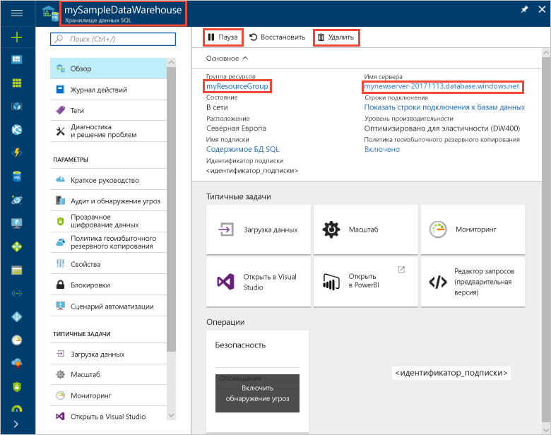

# Краткое руководство. Приостановка и возобновление вычислений в хранилище данных SQL Azure на портале Azure
Используйте портал Azure, чтобы приостановить вычисления в хранилище данных SQL Azure для снижения расходов. [Возобновите работу вычислительных ресурсов](sql-data-warehouse-manage-compute-overview.md), когда будете готовы к использованию хранилища данных.

Если у вас еще нет подписки Azure, создайте [бесплатную](https://azure.microsoft.com/free/) учетную запись Azure, прежде чем начинать работу.

## Выполните вход на портал Azure.

Войдите на [портале Azure](https://portal.azure.com/).

## Перед началом работы

Используйте инструкции из раздела [Создание хранилища данных SQL Azure на портале Azure и отправка запросов к этому хранилищу данных](create-data-warehouse-portal.md) для создания хранилища данных **mySampleDataWarehouse**. 

## Приостановка работы вычислительных ресурсов
Для сокращения затрат можно приостанавливать и возобновлять работу вычислительных ресурсов по требованию. Например, если база данных не будет использоваться ночью и по выходным, ее работу можно приостанавливать на это время и возобновлять днем. Когда база данных приостановлена, оплата за вычислительные ресурсы не взимается. Тем не менее плата за хранение по-прежнему будет взиматься. 

Чтобы приостановить хранилище данных SQL, сделайте следующее.

1. На портале Azure на странице слева щелкните **Базы данных SQL**.
2. На странице **Базы данных SQL** выберите **mySampleDataWarehouse**. Откроется хранилище данных. 
3. На странице **mySampleDataWarehouse** обратите внимание на то, что параметр **Состояние** имеет значение **В сети**.

    

4. Чтобы приостановить хранилище данных, нажмите кнопку **Приостановить**. 
5. Отобразится запрос подтверждения операции. Щелкните **Да**.
6. Подождите несколько секунд, и вы увидите, что значение параметра **Состояние** изменилось на **Приостановка**.

    

7. После завершения операции приостановки хранилище находится в состоянии **Приостановлено** и доступен переключатель **Запустить**.
8. Теперь вычислительные ресурсы для хранилища данных находятся вне сети. Вы не будете платить за вычисления, пока работа службы не будет возобновлена.

    

## Возобновление работы вычислительных ресурсов
Чтобы возобновить работу хранилища данных SQL, сделайте следующее.

1. На портале Azure на странице слева щелкните **Базы данных SQL**.
2. На странице **Базы данных SQL** выберите **mySampleDataWarehouse**. Откроется хранилище данных. 
3. На странице **mySampleDataWarehouse** обратите внимание на то, что параметр **Состояние** имеет значение **Приостановлено**.

    

4. Чтобы возобновить работу хранилища данных, нажмите кнопку **Запустить**. 
5. Отобразится запрос подтверждения запуска. Щелкните **Да**.
6. Обратите внимание на то, что значение параметра **Состояние** изменилось на **Возобновление**.

    

7. После возвращения в сеть хранилище данных находится в состоянии **В сети** и доступен переключатель **Приостановить**.
8. Вычислительные ресурсы для хранилища данных теперь находятся в сети, и вы можете использовать службу. Плата за вычисления будет взиматься.

    

## Очистка ресурсов

Плата взимается за единицы хранилища данных и данные, хранящиеся в хранилище данных. Плата за вычислительные ресурсы и ресурсы хранилища взимается отдельно. 

- Если вы хотите сохранить данные в хранилище, приостановите вычисления.
- Если вы хотите исключить будущие расходы, то можете удалить хранилище данных. 

Выполните следующие действия, чтобы очистить ресурсы по необходимости.

1. Войдите на [портал Azure](https://portal.azure.com) и щелкните хранилище данных.

    

1. Чтобы приостановить работу вычислительных ресурсов, нажмите кнопку **Приостановить**. Если работа хранилища данных приостановлена, вы увидите кнопку **Запуск**.  Чтобы возобновить работу вычислительных ресурсов, нажмите кнопку **Запуск**.

2. Чтобы удалить хранилище данных во избежание дальнейших платежей за вычисления или хранение, нажмите кнопку **Удалить**.

3. Чтобы удалить созданный вами сервер SQL Server, щелкните **mynewserver-20171113.database.windows.net**, а затем щелкните **Удалить**.  Будьте внимательны, так как удаление сервера приведет к удалению всех баз данных, назначенных этому серверу.

4. Чтобы удалить группу ресурсов, щелкните **myResourceGroup**, а затем нажмите кнопку **Удалить группу ресурсов**.

## Дополнительная информация
Вы приостановили и возобновили вычисления для хранилища данных. Чтобы узнать больше о хранилище данных SQL Azure, перейдите к руководству по загрузке данных.

> [!div class="nextstepaction"]
>[Загрузка данных в хранилище данных SQL](load-data-from-azure-blob-storage-using-polybase.md)
