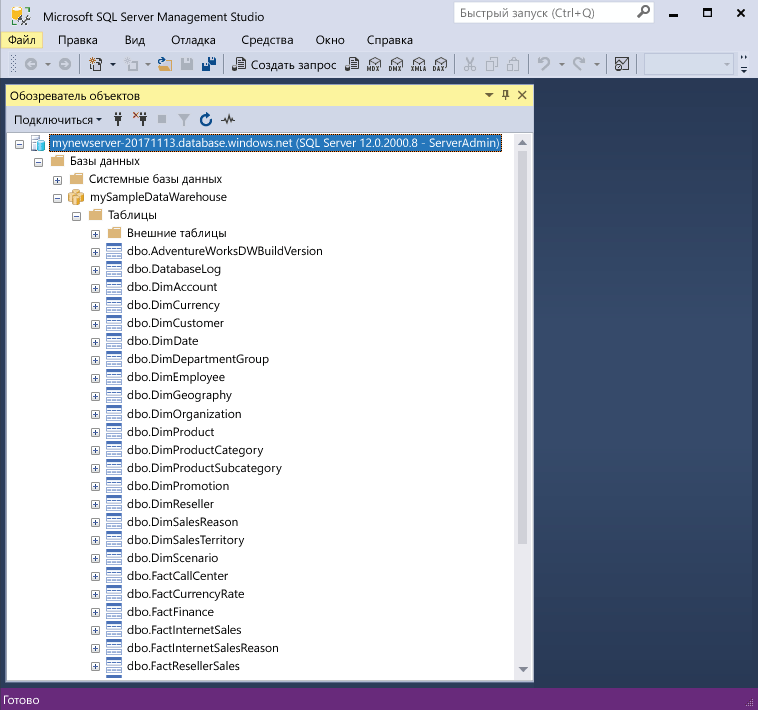

# <a name="quickstart-scale-compute-in-azure-sql-data-warehouse-using-t-sql"></a>Краткое руководство. Масштабирование вычислительных ресурсов в хранилище данных SQL Azure с помощью T-SQL

Масштабируйте вычислительные ресурсы в хранилище данных SQL Azure с помощью T-SQL и SQL Server Management Studio. [Горизонтально масштабируйте вычислительные ресурсы](sql-data-warehouse-manage-compute-overview.md), чтобы повысить производительность, или уменьшайте их масштаб, чтобы сократить затраты. 

Если у вас еще нет подписки Azure, создайте [бесплатную](https://azure.microsoft.com/free/) учетную запись Azure, прежде чем начинать работу.

## <a name="before-you-begin"></a>Перед началом работы

Скачайте и установите последнюю версию [SQL Server Management Studio](/sql/ssms/download-sql-server-management-studio-ssms.md) (SSMS).
 
## <a name="create-a-data-warehouse"></a>Создание хранилища данных

Используйте инструкции из краткого руководства [Создание хранилища данных SQL Azure на портале Azure и отправка запросов к этому хранилищу данных](create-data-warehouse-portal.md), чтобы создать хранилище данных **mySampleDataWarehouse**. Завершите работу с кратким руководством, чтобы вы создали правило брандмауэра и смогли подключиться к хранилищу данных из SQL Server Management Studio.

## <a name="connect-to-the-server-as-server-admin"></a>Подключение к серверу от имени администратора сервера

В этом разделе для подключения к серверу SQL Azure используется [SQL Server Management Studio](/sql/ssms/download-sql-server-management-studio-ssms.md) (SSMS).

1. Откройте среду SQL Server Management Studio.

2. В диалоговом окне **Подключение к серверу** введите следующие значения.

   | Параметр       | Рекомендуемое значение | ОПИСАНИЕ | 
   | ------------ | ------------------ | ------------------------------------------------- | 
   | Тип сервера | Ядро СУБД | Это обязательное значение |
   | имя сервера; | Полное имя сервера | Ниже приведен пример: **mynewserver-20171113.database.windows.net**. |
   | Authentication | проверка подлинности SQL Server | В рамках работы с этим руководством мы настроили только один тип аутентификации — аутентификацию SQL. |
   | Вход | Учетная запись администратора сервера | Это учетная запись, указанная при создании сервера. |
   | Пароль | Пароль учетной записи администратора сервера | Это пароль, указанный при создании сервера. |

    

4. Щелкните **Подключить**. Откроется окно обозревателя объектов в SSMS. 

5. В обозревателе объектов разверните папку **Базы данных**. Затем разверните папку **mySampleDatabase**, чтобы просмотреть объекты в новой базе данных.

     

## <a name="view-service-objective"></a>Просмотр целевого уровня обслуживания
Параметр целевого уровня обслуживания содержит число единиц DWU для хранилища данных. 

Чтобы просмотреть текущее значение DWU для хранилища данных, сделайте следующее:

1. В разделе подключения к серверу **mynewserver-20171113.database.windows.net** разверните узел **Системные базы данных**.
2. Щелкните правой кнопкой мыши **master** и выберите **Создать запрос**. Откроется окно нового запроса.
3. Выполните следующий запрос для выбора из динамического административного представления sys.database_service_objectives. 

    ```sql
    SELECT
        db.name [Database]
    ,   ds.edition [Edition]
    ,   ds.service_objective [Service Objective]
    FROM
        sys.database_service_objectives ds
    JOIN
        sys.databases db ON ds.database_id = db.database_id
    WHERE 
        db.name = 'mySampleDataWarehouse'
    ```

4. В следующих результатах показано, что для хранилища **mySampleDataWarehouse** задан целевой уровень обслуживания DW400. 

    


## <a name="scale-compute"></a>Масштабирование вычислительных ресурсов
В хранилище данных SQL вы можете увеличивать и уменьшать объем вычислительных ресурсов, изменяя число единиц использования хранилища данных (DWU). В статье [Создание хранилища данных SQL Azure на портале Azure и отправка запросов к этому хранилищу данных](create-data-warehouse-portal.md) мы создали хранилище **mySampleDataWarehouse** и инициализировали его со значением 400 DWU. Ниже описаны шаги по изменению числа единиц DWU для **mySampleDataWarehouse**.

Изменить число единиц использования хранилища данных можно так:

1. Щелкните правой кнопкой мыши **master** и выберите **Создать запрос**.
2. Чтобы изменить целевой уровень обслуживания, используйте инструкцию T-SQL [ALTER DATABASE](/sql/t-sql/statements/alter-database-azure-sql-database). Выполните следующий запрос, чтобы изменить значение целевого уровня обслуживания на DW300. 

    ```Sql
    ALTER DATABASE mySampleDataWarehouse
    MODIFY (SERVICE_OBJECTIVE = 'DW300')
    ;
    ```

## <a name="monitor-scale-change-request"></a>Мониторинг запроса на изменение масштаба
Чтобы просмотреть ход выполнения предыдущего запроса на изменение, можно использовать синтаксис T-SQL `WAITFORDELAY` для опроса динамического административного представления sys.dm_operation_status.

Чтобы опросить состояние изменений объекта службы, сделайте следующее

1. Щелкните правой кнопкой мыши **master** и выберите **Создать запрос**.
2. Выполните следующий запрос, чтобы опросить динамическое административное представление sys.dm_operation_status.

    ```sql
    WHILE 
    (
        SELECT TOP 1 state_desc
        FROM sys.dm_operation_status
        WHERE 
            1=1
            AND resource_type_desc = 'Database'
            AND major_resource_id = 'MySampleDataWarehouse'
            AND operation = 'ALTER DATABASE'
        ORDER BY
            start_time DESC
    ) = 'IN_PROGRESS'
    BEGIN
        RAISERROR('Scale operation in progress',0,0) WITH NOWAIT;
        WAITFOR DELAY '00:00:05';
    END
    PRINT 'Complete';
    ```
3. Результат показывает журнал опроса состояния.

    

## <a name="check-data-warehouse-state"></a>Проверка состояния хранилища данных

Если хранилище данных остановлено, вы не сможете подключиться к нему с помощью T-SQL. Чтобы просмотреть текущее состояние хранилища данных, используйте командлет PowerShell. Пример см. в разделе о [проверке состояния хранилища данных с помощью Powershell](quickstart-scale-compute-powershell.md#check-data-warehouse-state). 

## <a name="check-operation-status"></a>Проверка состояния операции

Чтобы получить сведения о разных операциях управления, выполняемых в хранилище данных SQL, отправьте следующий запрос в динамическом административном представлении [sys.dm_operation_status](/sql/relational-databases/system-dynamic-management-views/sys-dm-operation-status-azure-sql-database). Например, это представление возвращает сведения о разных операциях, а также их состояние со значением IN_PROGRESS или COMPLETED.

```sql
SELECT *
FROM
    sys.dm_operation_status
WHERE
    resource_type_desc = 'Database'
AND 
    major_resource_id = 'MySampleDataWarehouse'
```


## <a name="next-steps"></a>Дополнительная информация
Вы узнали, как масштабировать вычислительные ресурсы для хранилища данных. Чтобы узнать больше о хранилище данных SQL Azure, перейдите к руководству по загрузке данных.

> [!div class="nextstepaction"]
>[Загрузка данных в хранилище данных SQL](load-data-from-azure-blob-storage-using-polybase.md)
