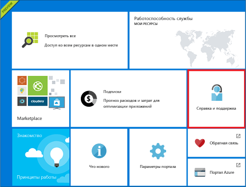
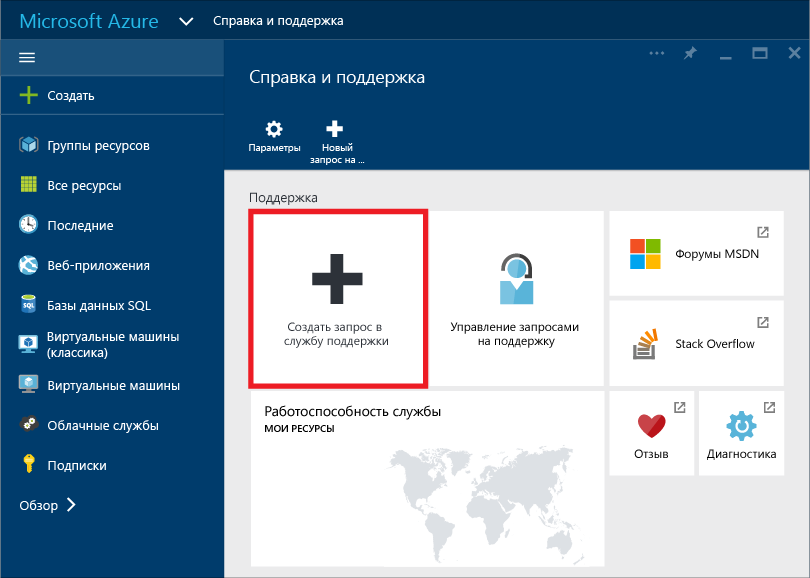
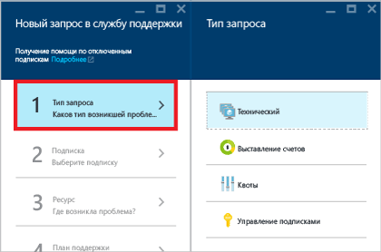
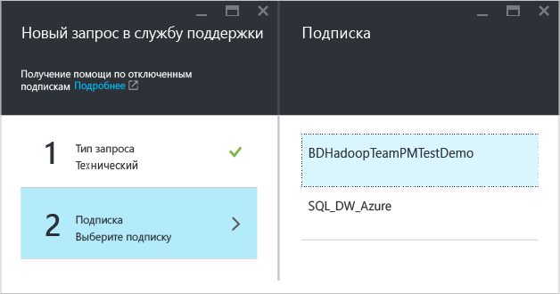
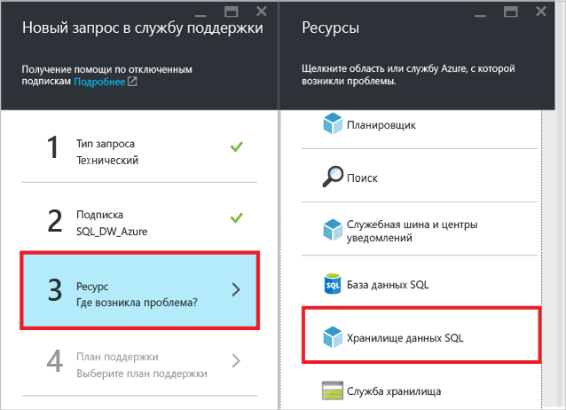
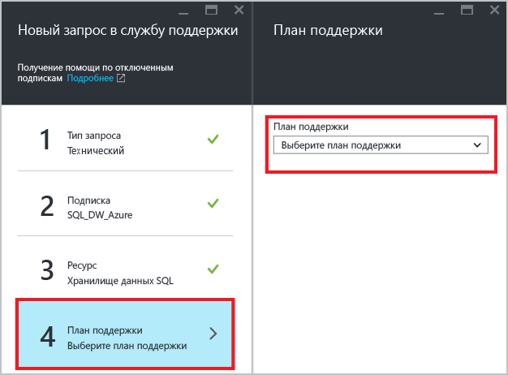
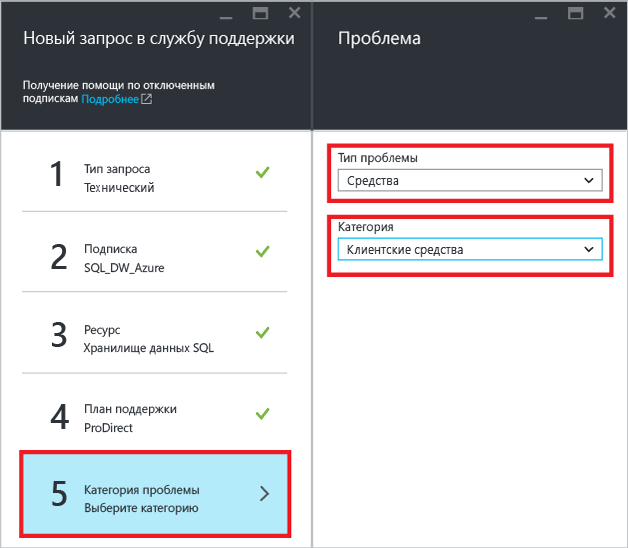
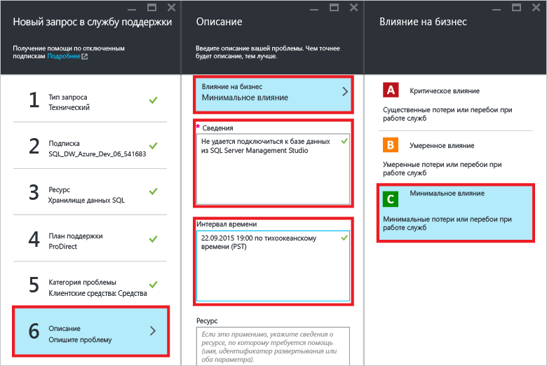
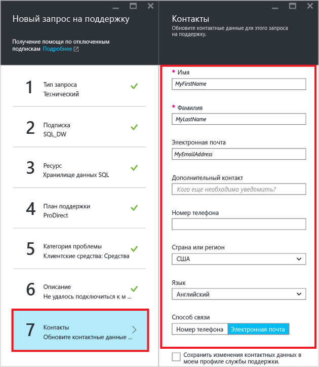
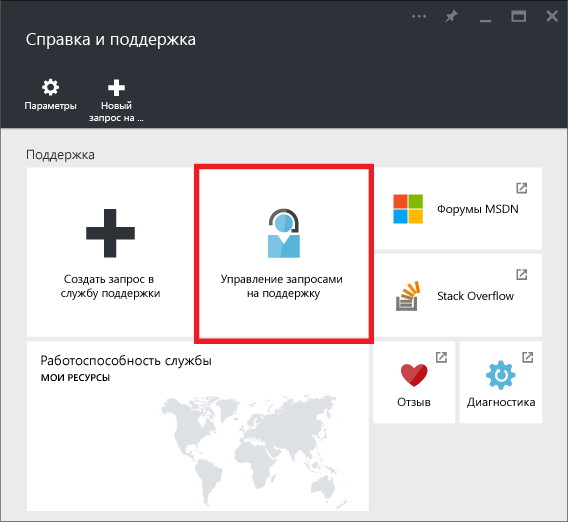

<properties
    pageTitle="Создание запроса в службу поддержки для хранилища данных SQL | Microsoft Azure"
    description="Порядок создания запроса в службу поддержки для хранилища данных SQL Azure"
    services="sql-data-warehouse"
    documentationCenter="NA"
    authors="sahaj08"
    manager="barbkess"
    editor=""/>

<tags
    ms.service="sql-data-warehouse"
    ms.devlang="NA"
    ms.topic="article"
    ms.tgt_pltfrm="NA"
    ms.workload="data-services"
    ms.date="10/05/2015"
    ms.author="sahaj08"/>

# Создание запроса в службу поддержки для хранилища данных SQL
 В этой статье показано, как создать запрос в службу поддержки для хранилища данных SQL.

## Порядок создания запроса в службу поддержки

1. Откройте [портал Azure][]. 
2. На начальном экране щелкните элемент **Справка + поддержка**.

    

3. В колонке «Справка + поддержка» щелкните **Создать запрос на техническую поддержку**.

    

4. Выберите **Тип запроса**.

    

5. Выберите **подписку**, в которой размещена база данных с соответствующей проблемой.

    

6. Выберите **хранилище данных SQL** в качестве ресурса.

    

7. Выберите свой **План поддержки**.

    - Поддержка по выставлению счетов и проблемам, связанным с управлением подпиской, доступна на всех уровнях.
    - Поддержка по замене или ремонту обеспечивается по уровням Developer, Standard, Pro Direct и Premier. Проблемы характера «замена или ремонт» — это возникающие при использовании Azure проблемы, относительно которых имеются обоснованные предположения, что их причиной стала корпорация Майкрософт.
    - Услуги обучения и консультирования разработчиков доступны на уровнях поддержки Professional Direct и Premier.
    - Дополнительные сведения о поддержке Azure, включая области действия, время реагирования, цены и т. д., см. в статье [Планы поддержки Azure][].

    

    При наличии плана поддержки Premier можно также создавать отчеты по неполадкам хранилища данных SQL на [портале Microsoft Premier][].

8. Выберите значения **Тип проблемы** и **Категория**.

    

9. Опишите неполадку и выберите уровень влияния на бизнес.

    

10. Ваши **контактные данные** для этого запроса в службу поддержки будут заполнены предварительно. При необходимости обновите их.

    

11. Щелкните **Создать**, чтобы отправить запрос в службу поддержки.

## Дальнейшие действия
После отправки запроса с вами свяжется представитель службы поддержки Azure. Чтобы проверить состояние запроса и сведения о нем, щелкните **Управление запросами на поддержку** на панели мониторинга.

Кроме того, вы можете взаимодействовать с сообществом хранилища данных SQL с помощью тега azure-sqldw на странице [Переполнение стека][] или на [форуме MSDN, посвященном хранилищу данных SQL Azure][].

<!-- External links -->

[портал Azure]: https://portal.azure.com/
[Планы поддержки Azure]: http://azure.microsoft.com/support/plans/?WT.mc_id=Support_Plan_510979/
[портале Microsoft Premier]: https://premier.microsoft.com/
[Переполнение стека]: http://stackoverflow.com/questions/tagged/azure-sqldw/
[форуме MSDN, посвященном хранилищу данных SQL Azure]: https://social.msdn.microsoft.com/Forums/home?forum=AzureSQLDataWarehouse/

<!---HONumber=Oct15_HO2-->