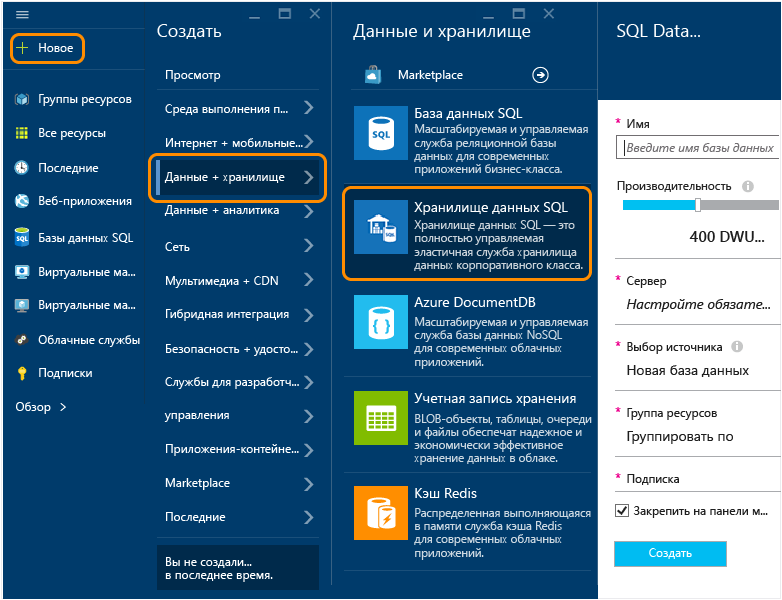
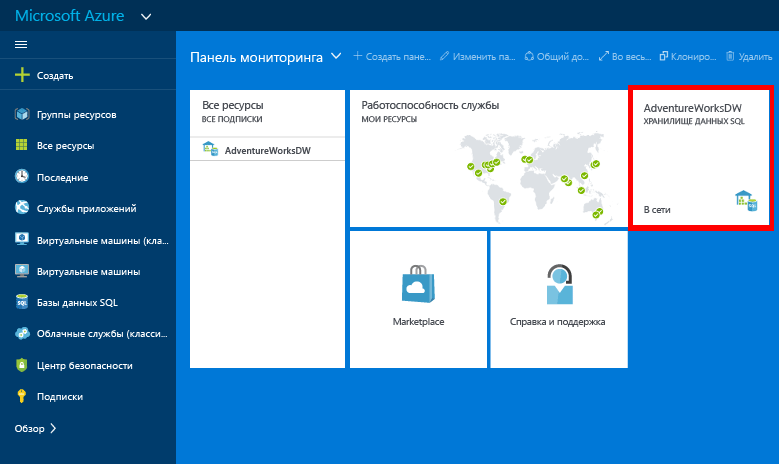

<properties
	pageTitle="Создание базы данных хранилища данных SQL на портале предварительной версии Azure | Microsoft Azure"
	description="Сведения о создании хранилища данных SQL на портале предварительной версии Azure"
	services="sql-data-warehouse"
	documentationCenter="NA"
	authors="lodipalm"
	manager="barbkess"
	editor=""
	tags="azure-sql-data-warehouse"/>
<tags
   ms.service="sql-data-warehouse"
   ms.devlang="NA"
   ms.topic="article"
   ms.tgt_pltfrm="NA"
   ms.workload="data-services"
   ms.date="09/29/2015"
   ms.author="lodipalm;barbkess"/>

# Создание хранилища данных SQL на портале предварительной версии Azure#

В этом руководстве показано, как всего за несколько минут на портале предварительной версии Azure можно создать хранилище данных SQL.

В этом пошаговом руководстве описаны следующие операции:

- Создание новой базы данных хранилища данных SQL
- Создание сервера для базы данных
- Загрузка AdventureWorksDW в новую базу данных

[AZURE.INCLUDE [free-trial-note](../../includes/free-trial-note.md)]

## Вход и поиск хранилища данных SQL

1. Войдите на [портал предварительной версии](https://portal.azure.com).

2. В меню «Концентратор» выберите **Создать** > **Данные+хранилище** > **Хранилище данных SQL**.

	

## Настройка производительности и других основных параметров

На панели **Хранилище данных SQL** заполните следующие поля. **Сервер** и **Источник** настраиваются в следующих разделах.

1. **Имя базы данных**: введите имя базы данных хранилища данных SQL.

2. **Производительность**: производительность, которую будет иметь экземпляр, можно настроить при подготовке к работе. Рекомендуется начать с 400 DWU, так как это позволит получить больше преимуществ MPP, предоставляемых хранилищем данных SQL.
     
    

    > [AZURE.NOTE]Мы измеряем производительность в единицах использования хранилища данных (DWU). При увеличении показателя DWU в хранилище данных SQL увеличивается объем вычислительных ресурсов, доступных для операций базы данных хранилища данных.

	> [AZURE.NOTE]Уровень производительности можно легко и быстро изменить после создания базы данных. Например, если вы не используете базу данных, переместите ползунок влево, чтобы снизить затраты. Или увеличьте производительность, если требуются дополнительные ресурсы. В этом и заключаются преимущества масштабирования хранилища данных SQL.
	

2. **Группа ресурсов**. Сохраните значения по умолчанию. Группы ресурсов — это контейнеры, которые помогают управлять коллекцией ресурсов Azure. Подробнее о [группах ресурсов](../azure-portal/resource-group-portal.md).
3. **Подписка**. Выберите подписку для выставления счетов за эту базу данных.

## Настройка логического сервера

3. Щелкните **Сервер** > **Создать сервер**. При этом создается логический сервер, с которым будет сопоставлена ваша база данных. Если у вас уже есть сервер V12, который требуется использовать, выберите существующий сервер и перейдите к следующему разделу.

    

    >[AZURE.NOTE]Сервер в хранилище данных SQL и Базе данных SQL обеспечивает согласованную настройку облачных баз данных. Хотя в Azure сервер привязан к отдельному центру обработки данных, он является не физическим оборудованием, как в случае с локальным экземпляром SQL Server, а частью программного обеспечения службы. Именно поэтому мы и называем его логическим сервером. Обратите внимание, что в отличие от реальных условий рабочие нагрузки, подразумевающие выполнение баз данных и хранилищ данных на одном сервере, не будут отрицательно влиять друг на друга с точки зрения производительности.

1. Внесите необходимые данные в окне **Новый сервер**.

    Обязательно сохраните имя сервера, имя администратора и пароль. Эти сведения потребуются для входа на сервер. – **Имя сервера**. Введите имя для логического сервера. – **Имя администратора сервера**. Введите имя пользователя для учетной записи администратора сервера. – **Пароль**. Введите пароль администратора сервера. – **Расположение**. Выберите географическое расположение, близкое к вам или другим вашим ресурсам Azure. Это позволит снизить задержки в сети, поскольку все базы данных и ресурсы, относящиеся к логическому серверу, физически будут находиться в одном регионе.

    

1. Нажмите кнопку **ОК**, чтобы сохранить параметры конфигурации сервера.

## Загрузка образца базы данных

1. Выберите **Источник** > **Образец** для инициализации новой базы данных с помощью образца базы данных AdventureWorksDW. 

    

## Завершение создания базы данных

1. Щелкните **Создать**, чтобы создать базу данных хранилища данных SQL. 

1. Теперь нужно просто подождать несколько минут. По завершении вы увидите образец базы данных на своей домашней странице.

    

## Дальнейшие действия

После создания образца базы данных для хранилища данных SQL ознакомьтесь со сведениями об использовании хранилища данных SQL в следующем пошаговом руководстве.

- [Подключение и запросы](./sql-data-warehouse-get-started-connect-query.md).

	> [AZURE.NOTE]Мы хотим улучшить эту статью. Если на вопрос «Помогла ли вам эта статья?» вы выберите «нет», добавьте краткую рекомендацию о том, чего в ней не хватает или как ее улучшить. Заранее спасибо!

<!---HONumber=Oct15_HO1-->