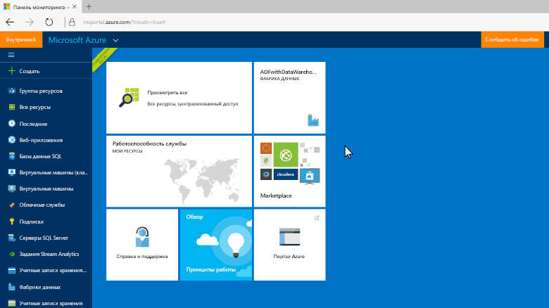
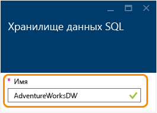
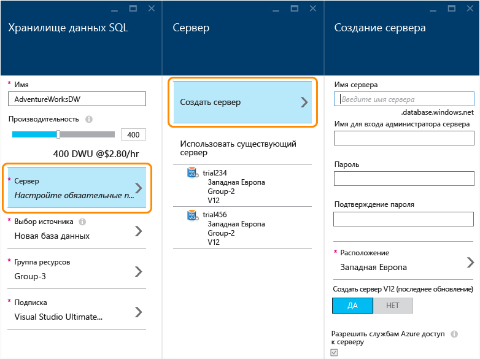
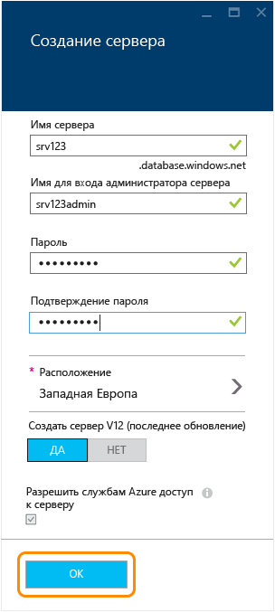
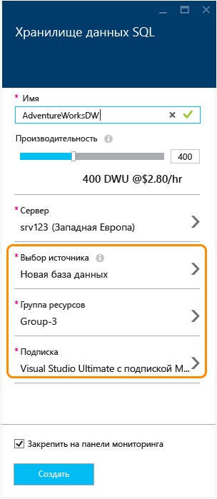
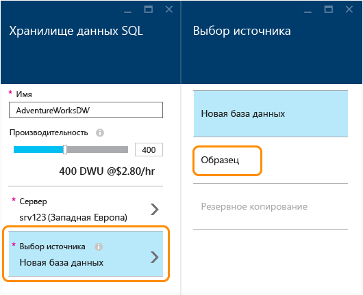
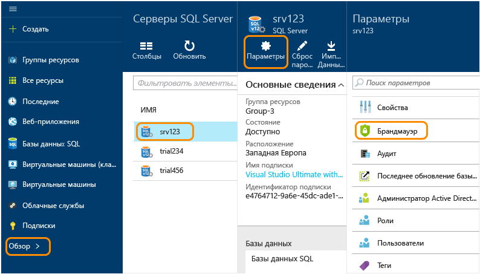
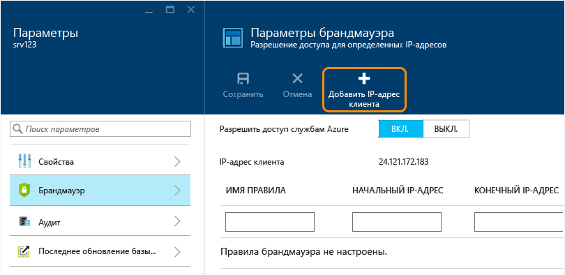
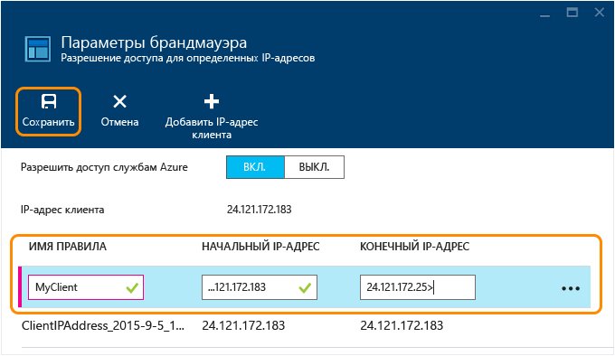

<properties
	pageTitle="Создание базы данных хранилища данных SQL на портале предварительной версии Azure | Microsoft Azure"
	description="Сведения о создании хранилища данных SQL на портале предварительной версии Azure"
	services="sql-data-warehouse"
	documentationCenter="NA"
	authors="barbkess"
	manager="jhubbard"
	editor=""
	tags="azure-sql-data-warehouse"/>
<tags
   ms.service="sql-data-warehouse"
   ms.devlang="NA"
   ms.topic="get-started-article"
   ms.tgt_pltfrm="NA"
   ms.workload="data-services"
   ms.date="10/21/2015"
   ms.author="lodipalm;barbkess"/>

# Создание хранилища данных SQL с помощью портала предварительной версии Azure#

> [AZURE.SELECTOR]
- [Azure preview portal](sql-data-warehouse-get-started-provision.md)
- [TSQL](sql-data-warehouse-get-started-create-database-tsql.md)
- [PowerShell](sql-data-warehouse-get-started-provision-powershell.md)

В этом учебнике показано, как всего за несколько минут можно создать базу данных хранилища данных SQL с помощью портала предварительной версии Azure.

Изучив данный учебник, вы научитесь:

- создание сервера, на котором будет размещаться база данных;
- создание базы данных, содержащей образец базы данных AdventureWorksDW.

[AZURE.INCLUDE [free-trial-note](../../includes/free-trial-note.md)]

## Шаг 1. Вход и начало работы

1. Войдите на [портал предварительной версии Azure](https://portal.azure.com).

2. Выберите пункты **Создать** > **Данные + хранилище** > **Хранилище данных SQL**.

    

1. Введите имя базы данных в колонке хранилища данных SQL. В этом примере мы назовем базу данных AdventureWorksDW.

    

## Шаг 2. Настройка и создание сервера
В базе данных SQL и хранилище данных SQL для каждой базы данных назначается сервер, а для каждого сервера назначается географическое расположение. Сервер называется «логический сервер SQL».

> [AZURE.NOTE]Свойства логического сервера SQL:
  >
  > + Предоставляет согласованный способ настройки нескольких баз данных в пределах одного географического расположения.
  > + Не является физическим оборудованием, как локальный сервер. Он является частью программного обеспечения службы. Поэтому он называется *логическим сервером*.
  > + На нем может размещаться несколько баз данных без последствий для их производительности.
  > + В имени используется слово *сервер* в нижнем регистре. **С**ервер SQL — это логический сервер Azure, а сервер SQL **S**erver — имя локальной базы данных Майкрософт.

1. Щелкните элемент **Сервер** > **Создать сервер**. За использования сервера плата не взимается. Если у вас уже есть логический сервер SQL версии 12, который вы хотите использовать, выберите существующий сервер и перейдите к следующему разделу. 

    

3. Заполните информацию о **новом сервере**.
    
	- **Имя сервера**. Введите имя для логического сервера. Оно уникально для каждого географического расположения.
	- **Имя администратора сервера**. Введите имя пользователя для учетной записи администратора сервера.
	- **Пароль**. Введите пароль администратора сервера. 
	- **Расположение**. Выберите географическое расположение сервера. Чтобы сократить время передачи данных, рекомендуется расположить сервер недалеко от других ресурсов данных, к которым будет получать доступ база данных.
	- **Создать сервер версии 12**. «ДА» — единственный параметр для хранилища данных SQL. 
	- **Разрешить службам Azure доступ к серверу**. Этот флажок всегда установлен для хранилища данных SQL.

    >[AZURE.NOTE]Обязательно сохраните имя сервера, имя администратора сервера и пароль. Эти сведения потребуются для входа на сервер.

1. Нажмите кнопку **ОК**, чтобы сохранить параметры конфигурации логического сервера SQL и вернуться к колонке хранилища данных SQL.

    

## Шаг 3. Настройка и создание базы данных
После выбора логического сервера SQL все готово для завершения создания базы данных.
 
2. В колонке **Хранилище данных SQL** заполните оставшиеся поля. 

    
    
    - **Производительность**. Мы рекомендуем начать с 400 DWU. Можно переместить ползунок влево или вправо, чтобы настроить уровень производительности базы данных. Это можно сделать сейчас или позже, после создания базы данных. 

        > [AZURE.NOTE]Хранилище данных SQL измеряет производительность в единицах использования хранилища данных (DWU). При увеличении показателя DWU в хранилище данных SQL увеличивается объем вычислительных ресурсов, доступных для операций базы данных. При выполнении рабочей нагрузки можно будет увидеть связь между показателем DWU и результатами рабочей нагрузки.
        > 
        > Уровень производительности можно легко и быстро изменить после создания базы данных. Например, если вы не используете базу данных, переместите ползунок влево, чтобы снизить затраты. Или увеличьте производительность, если требуются дополнительные ресурсы. Вы можете приостановить базу данных, чтобы затраты были равны 0. В этом и заключаются преимущества масштабирования хранилища данных SQL.

    - **Выбрать источник**. Выберите элементы **Выбрать источник** > **Образец**. Поскольку в данный момент есть только один образец базы данных, когда вы выбираете элемент «Образец», Azure автоматически устанавливает значение AdventureWorksDW для параметра **Выбор образца**.
  
        

    - **Группа ресурсов** Вы можете сохранить значения по умолчанию. Группы ресурсов — это контейнеры, которые помогают управлять коллекцией ресурсов Azure. Дополнительная информация о [группах ресурсов](../azure-portal/resource-group-portal.md).
    
    - **Подписка** Выберите подписку для выставления счетов за эту базу данных.

1. Нажмите кнопку **Создать**, чтобы создать базу данных хранилища данных SQL.

1. Подождите несколько минут, пока создается база данных. Когда база данных будет готова, вы вернетесь на [портал предварительной версии Azure](https://portal.azure.com). Обратите внимание, что на панели мониторинга появилась база данных хранилища данных SQL.

    

## Шаг 4. Настройка доступа брандмауэра сервера к IP-адресу клиента
Чтобы подключиться к серверу с текущего IP-адреса, необходимо добавить IP-адрес клиента к правилам брандмауэра. На этом шаге показано, как это сделать.

1. Последовательно выберите элементы **Обзор** > **Серверы SQL Server** > выберите нужный сервер > **Параметры** > **Брандмауэр**.

    

4. Нажмите кнопку **Добавить IP-адрес клиента**, чтобы система Azure создала правило для этого IP-адреса клиента. Щелкните **Сохранить**.

	

1. Создайте правило брандмауэра с диапазоном IP-адресов. Это можно сделать сейчас или позже.

	>[AZURE.IMPORTANT]Ваш IP-адрес, скорее всего, будет периодически меняться, и в таких случаях вы не сможете получить доступ к серверу, пока не создадите новое правило брандмауэра. Чтобы обеспечить согласованный доступ, рекомендуется добавить диапазон IP-адресов. Дополнительную информацию см в статье [Настройка параметров брандмауэра](../sql-database/sql-database-configure-firewall-settings.md).

    Чтобы создать правило, введите имя и диапазон IP-адресов и нажмите кнопку **Сохранить**.

    

После настройки брандмауэра можно подключаться с компьютера к базе данных хранилища данных SQL Azure, которую вы только что создали.

## Дальнейшие действия

Теперь, когда создан пример базы данных для хранилища данных SQL, вы можете [подключиться](./sql-data-warehouse-get-started-connect.md) к этой базе данных.

<!---HONumber=Nov15_HO1-->