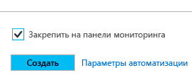
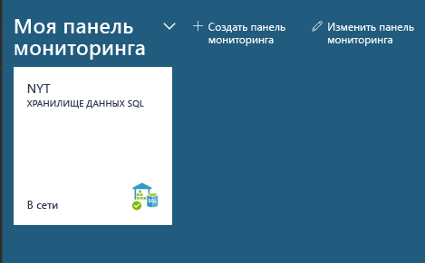
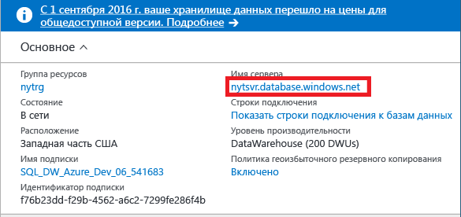
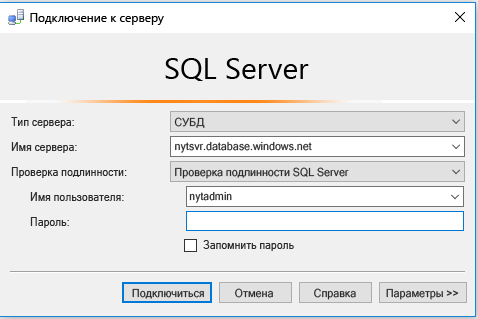
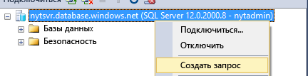
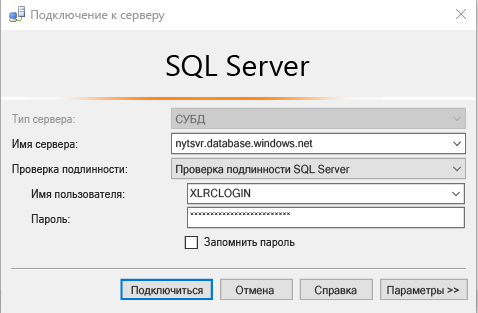
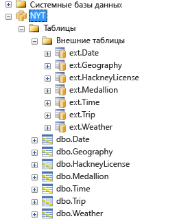
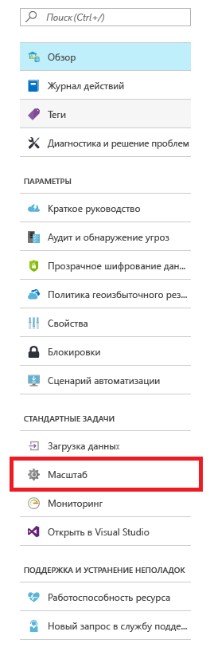
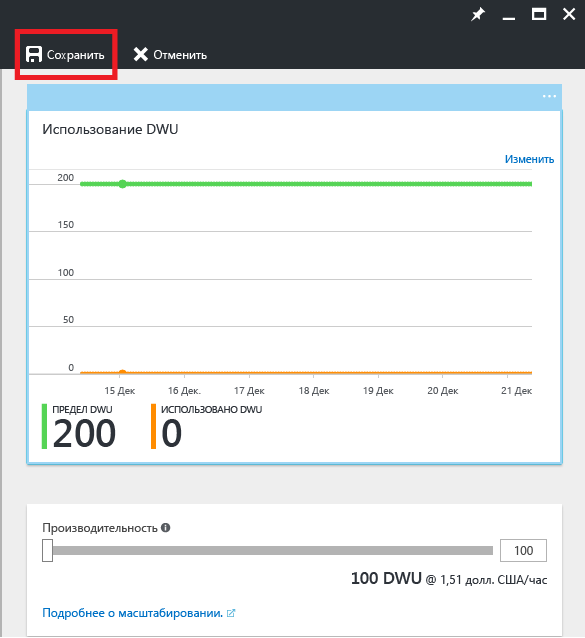

# <a name="get-started-with-sql-data-warehouse"></a>Начало работы с хранилищем данных SQL

Из этого руководства вы узнаете, как подготовить и загрузить данные в хранилище данных SQL Azure, а также получите основные сведения о масштабировании, приостановке и настройке. После завершения работы с документом вы будете уметь использовать запросы и просматривать хранилища данных.

**Предполагаемое время выполнения**. Работа с этим комплексным руководством и примером кода занимает около 30 минут при условии, что все предварительные требования выполнены. 

## <a name="prerequisites"></a>Предварительные требования

В руководстве предполагается, что вы уже знакомы с основными понятиями хранилища данных SQL. Если это не так, рекомендуем прочитать статью [Что такое хранилище данных SQL](sql-data-warehouse-overview-what-is.md). 

### <a name="sign-up-for-microsoft-azure"></a>Зарегистрируйтесь для Microsoft Azure
Если у вас еще нет учетной записи Microsoft Azure, зарегистрируйте ее, чтобы использовать эту службу. Если у вас уже есть учетная запись, этот шаг можно пропустить. 

1. Перейдите на страницу учетной записи [https://azure.microsoft.com/account/](https://azure.microsoft.com/account/).
2. Создайте бесплатную учетную запись Azure или купите платную.
3. Следуйте указаниям на экране.

### <a name="install-appropriate-sql-client-drivers-and-tools"></a>Установка соответствующих клиентских драйверов и средств SQL

Большинство клиентских средств SQL могут подключаться к хранилищу данных SQL с помощью JDBC, ODBC или ADO.NET. Из-за большого количества функций T-SQL, которые поддерживает хранилище данных SQL, не все клиентские приложения полностью совместимы с хранилищем данных SQL.

Если вы работаете с ОС Windows, рекомендуем использовать либо [Visual Studio], либо [SQL Server Management Studio].

[!INCLUDE [Create a new logical server](../../includes/sql-data-warehouse-create-logical-server.md)] 

[!INCLUDE [SQL Database create server](../../includes/sql-database-create-new-server-firewall-portal.md)]

## <a name="create-a-sql-data-warehouse"></a>Создание хранилища данных SQL

Хранилище данных SQL — это специальный тип базы данных, предназначенный для вычислений массовым параллелизмом. База данных распределяется между несколькими узлами и обрабатывает запросы параллельно. У хранилища данных SQL есть управляющий узел, который координирует действия всех узлов. Сами же узлы для управления данными используют базу данных SQL.  

> [!NOTE]
> Создание хранилища данных SQL может привести к дополнительным расходам.  Дополнительные сведения см. на странице [цен на хранилище данных SQL](https://azure.microsoft.com/pricing/details/sql-data-warehouse/).
>

### <a name="create-a-data-warehouse"></a>Создание хранилища данных

1. Войдите на [портал Azure](https://portal.azure.com).
2. Последовательно выберите **Создать** > **Базы данных** > **Хранилище данных SQL**.

     

3. Укажите сведения о развертывании.

    **Имя базы данных**: выберите любое имя. При наличии нескольких хранилищ данных рекомендуется включать в имена такие сведения, как регион и среда, например *mydw-westus-1-test*.

    **Подписка**: ваша подписка Azure.

    **Группа ресурсов**: создайте группу ресурсов или выберите имеющуюся.
    > [!NOTE]
    > Группы ресурсов можно использовать для администрирования ресурсов, например для определения области управления доступом или развертывания по шаблону. Дополнительные сведения о группах ресурсов Azure и рекомендации см. [здесь](https://docs.microsoft.com/azure/azure-resource-manager/resource-group-overview#resource-groups).

    **Источник**: пустая база данных.

    **Сервер**: выберите сервер, созданный в разделе [Предварительные требования].

    **Параметры сортировки**: оставьте параметры сортировки по умолчанию (SQL_Latin1_General_CP1_CI_AS).

    **Выбор уровня производительности**: рекомендуем начать со стандартного значения 400DWU.

4. Установите флажок **Закрепить на панели мониторинга** 

5. Подождите, пока завершится развертывание хранилища данных. Обычно этот процесс занимает несколько минут. Портал уведомит вас, когда хранилище данных будет готово к использованию. 

## <a name="connect-to-sql-data-warehouse"></a>Подключение к хранилищу данных SQL

В этом руководстве для подключения к хранилищу данных используется SQL Server Management Studio (SSMS). Подключиться к хранилищу данных SQL можно через следующие поддерживаемые соединители: ADO.NET, JDBC, ODBC и PHP. Помните, что функциональные возможности средств, не поддерживаемых Майкрософт, могут быть ограничены.


### <a name="get-connection-information"></a>Получение сведений о подключении

Подключение к хранилищу данных SQL выполняется через логический сервер SQL Server, созданный в разделе [Предварительные требования].

1. Выберите хранилище данных на панели мониторинга или найдите его в списке ресурсов.

    

2. Найдите полное имя логического сервера SQL Server.

    

3. Откройте SSMS. С помощью обозревателя объектов подключитесь к этому серверу, используя учетные данные администратора сервера, созданные в разделе [Предварительные требования].

    

Если все сделано правильно, вы должны подключиться к логическому серверу SQL Server. Поскольку вы вошли как администратор сервера, вы можете подключиться к любой базе данных, размещенной на этом сервере, включая базу данных master. 

Существует только одна учетная запись администратора сервера, обладающая наибольшими правами. Следите за тем, чтобы пароль администратора не был известен слишком большому количеству людей в организации. 

Также у вас может быть учетная запись администратора Azure Active Directory. Сведения о ней не входят в объем этой статьи. Если вы хотите узнать больше об использовании аутентификации Azure Active Directory, см. статью [Подключение к Базе данных SQL или хранилищу данных SQL c использованием проверки подлинности Azure Active Directory](https://docs.microsoft.com/azure/sql-database/sql-database-aad-authentication).

Далее мы рассмотрим создание дополнительных пользователей и имен для входа.


## <a name="create-a-database-user"></a>Создание пользователя базы данных

На этом шаге мы создадим учетную запись пользователя, который будет подключаться к хранилищу данных. Также мы покажем, как предоставить этому пользователю возможность выполнять запросы с большим объемом памяти и ресурсов ЦП.

### <a name="notes-about-resource-classes-for-allocating-resources-to-queries"></a>Примечания о классах ресурсов для выделения ресурсов запросам

- В целях защиты данных не следует выполнять запросы к производственным базам данных от имени администратора сервера. Эта учетная запись обладает наибольшими правами, и ее использование для выполнения операций с данными пользователей представляет риск для ваших данных. Кроме того, поскольку учетная запись администратора сервера предназначена для управления, она выполняет операции с выделением только небольшого объема памяти и ресурсов ЦП. 

- В хранилище данных SQL есть предварительно определенные роли базы данных, называемые классами ресурсов. Они используются для выделения пользователям различных объемов памяти, ресурсов ЦП и слотов параллельной обработки. Каждый пользователь может принадлежать к малому, среднему, большому или очень большому классу ресурсов. Класс ресурсов пользователя определяет ресурсы, которыми располагает пользователь для выполнения запросов и операций загрузки.

- Чтобы оптимизировать сжатие данных, пользователю, как правило, требуется загрузка с выделением объемных и очень объемных ресурсов. Дополнительные сведения о классах ресурсов см. [здесь](./sql-data-warehouse-develop-concurrency.md#resource-classes).

### <a name="create-an-account-that-can-control-a-database"></a>Создание учетной записи, позволяющей управлять базой данных

Поскольку вы вошли в качестве администратора сервера, у вас есть разрешения на создание пользователей и имен для входа.

1. Используя SSMS или другой клиент запросов, откройте новый запрос к базе данных **master**.

    

    

2. В окне запроса выполните следующую команду T-SQL, чтобы создать имя для входа MedRCLogin и пользователя с именем LoadingUser. Это имя для входа позволяет подключаться к логическому серверу SQL.

    ```sql
    CREATE LOGIN MedRCLogin WITH PASSWORD = 'a123reallySTRONGpassword!';
    CREATE USER LoadingUser FOR LOGIN MedRCLogin;
    ```

3. Теперь, выполняя запрос к *базе данных хранилища данных SQL*, создайте пользователя базы данных с именем для входа, которое вы создали для доступа к базе данных и выполнения в ней операций.

    ```sql
    CREATE USER LoadingUser FOR LOGIN MedRCLogin;
    ```

4. Предоставьте пользователю базы данных разрешения на управление базой данных с именем NYT. 

    ```sql
    GRANT CONTROL ON DATABASE::[NYT] to LoadingUser;
    ```
    > [!NOTE]
    > Если имя базы данных содержит дефисы, обязательно заключите его в квадратные скобки! 
    >

### <a name="give-the-user-medium-resource-allocations"></a>Выделение для пользователя среднего объема ресурсов

1. Выполните следующую команду T-SQL, чтобы сделать пользователя членом класса средних ресурсов, который называется mediumrc. 

    ```sql
    EXEC sp_addrolemember 'mediumrc', 'LoadingUser';
    ```
    > [!NOTE]
    > Дополнительные сведения о параллелизме и классах ресурсов см. [здесь](sql-data-warehouse-develop-concurrency.md#resource-classes). 
    >

2. Подключитесь к логическому серверу с помощью новых учетных данных.

    


## <a name="load-data-from-azure-blob-storage"></a>Загрузка данных из хранилища BLOB-объектов Azure

Теперь все готово к загрузке данных в хранилище данных. В этом шаге мы покажем, как загрузить данные о такси Нью-Йорка из общедоступного BLOB-объекта хранилища Azure. 

- Распространенный способ загрузки данных в хранилище данных SQL заключается в том, чтобы сначала переместить данные в хранилище BLOB-объектов Azure, а затем загрузить их в хранилище данных. Чтобы упростить понимание процесса загрузки, мы уже разместили данные о такси Нью-Йорка в общедоступном BLOB-объекте хранилища Azure. 

- Сведения о том, как переместить данные в хранилище BLOB-объектов Azure или загрузить их в хранилище данных SQL непосредственно из источника, см. статью [Загрузка данных в хранилище данных Azure SQL](sql-data-warehouse-overview-load.md).


### <a name="define-external-data"></a>Определение внешних данных

1. Создайте главный ключ. Главный ключ создается для каждой базы данных только один раз. 

    ```sql
    CREATE MASTER KEY;
    ```

2. Определите расположение BLOB-объекта Azure, содержащего данные о такси.  

    ```sql
    CREATE EXTERNAL DATA SOURCE NYTPublic
    WITH
    (
        TYPE = Hadoop,
        LOCATION = 'wasbs://2013@nytpublic.blob.core.windows.net/'
    );
    ```

3. Определите форматы внешних файлов.

    С помощью команды ```CREATE EXTERNAL FILE FORMAT``` можно указать формат файлов, содержащих внешние данные. Эти файлы содержат текст, разделенный одним или несколькими символами, которые называются разделителями. В целях демонстрации данные о такси хранятся как в несжатом виде, так и в виде сжатых данных в формате gzip.

    Выполните следующие команды T-SQL, чтобы определить два разных формата: несжатый и сжатый.

    ```sql
    CREATE EXTERNAL FILE FORMAT uncompressedcsv
    WITH (
        FORMAT_TYPE = DELIMITEDTEXT,
        FORMAT_OPTIONS ( 
            FIELD_TERMINATOR = ',',
            STRING_DELIMITER = '',
            DATE_FORMAT = '',
            USE_TYPE_DEFAULT = False
        )
    );

    CREATE EXTERNAL FILE FORMAT compressedcsv
    WITH ( 
        FORMAT_TYPE = DELIMITEDTEXT,
        FORMAT_OPTIONS ( FIELD_TERMINATOR = '|',
            STRING_DELIMITER = '',
        DATE_FORMAT = '',
            USE_TYPE_DEFAULT = False
        ),
        DATA_COMPRESSION = 'org.apache.hadoop.io.compress.GzipCodec'
    );
    ```

4.  Создайте схему для формата внешних файлов. 

    ```sql
    CREATE SCHEMA ext;
    ```
5. Создайте внешние таблицы. Эти таблицы ссылаются на данные, содержащиеся в хранилище BLOB-объектов Azure. Выполните следующие команды T-SQL, чтобы создать несколько внешних таблиц, все из которых будут указывать на BLOB-объект Azure, определенный нами ранее во внешнем источнике данных.

```sql
    CREATE EXTERNAL TABLE [ext].[Date] 
    (
        [DateID] int NOT NULL,
        [Date] datetime NULL,
        [DateBKey] char(10) COLLATE SQL_Latin1_General_CP1_CI_AS NULL,
        [DayOfMonth] varchar(2) COLLATE SQL_Latin1_General_CP1_CI_AS NULL,
        [DaySuffix] varchar(4) COLLATE SQL_Latin1_General_CP1_CI_AS NULL,
        [DayName] varchar(9) COLLATE SQL_Latin1_General_CP1_CI_AS NULL,
        [DayOfWeek] char(1) COLLATE SQL_Latin1_General_CP1_CI_AS NULL,
        [DayOfWeekInMonth] varchar(2) COLLATE SQL_Latin1_General_CP1_CI_AS NULL,
        [DayOfWeekInYear] varchar(2) COLLATE SQL_Latin1_General_CP1_CI_AS NULL,
        [DayOfQuarter] varchar(3) COLLATE SQL_Latin1_General_CP1_CI_AS NULL,
        [DayOfYear] varchar(3) COLLATE SQL_Latin1_General_CP1_CI_AS NULL,
        [WeekOfMonth] varchar(1) COLLATE SQL_Latin1_General_CP1_CI_AS NULL,
        [WeekOfQuarter] varchar(2) COLLATE SQL_Latin1_General_CP1_CI_AS NULL,
        [WeekOfYear] varchar(2) COLLATE SQL_Latin1_General_CP1_CI_AS NULL,
        [Month] varchar(2) COLLATE SQL_Latin1_General_CP1_CI_AS NULL,
        [MonthName] varchar(9) COLLATE SQL_Latin1_General_CP1_CI_AS NULL,
        [MonthOfQuarter] varchar(2) COLLATE SQL_Latin1_General_CP1_CI_AS NULL,
        [Quarter] char(1) COLLATE SQL_Latin1_General_CP1_CI_AS NULL,
        [QuarterName] varchar(9) COLLATE SQL_Latin1_General_CP1_CI_AS NULL,
        [Year] char(4) COLLATE SQL_Latin1_General_CP1_CI_AS NULL,
        [YearName] char(7) COLLATE SQL_Latin1_General_CP1_CI_AS NULL,
        [MonthYear] char(10) COLLATE SQL_Latin1_General_CP1_CI_AS NULL,
        [MMYYYY] char(6) COLLATE SQL_Latin1_General_CP1_CI_AS NULL,
        [FirstDayOfMonth] date NULL,
        [LastDayOfMonth] date NULL,
        [FirstDayOfQuarter] date NULL,
        [LastDayOfQuarter] date NULL,
        [FirstDayOfYear] date NULL,
        [LastDayOfYear] date NULL,
        [IsHolidayUSA] bit NULL,
        [IsWeekday] bit NULL,
        [HolidayUSA] varchar(50) COLLATE SQL_Latin1_General_CP1_CI_AS NULL
    )
    WITH
    (
        LOCATION = 'Date',
        DATA_SOURCE = NYTPublic,
        FILE_FORMAT = uncompressedcsv,
        REJECT_TYPE = value,
        REJECT_VALUE = 0
    );
    
    CREATE EXTERNAL TABLE [ext].[Geography]
    (
        [GeographyID] int NOT NULL,
        [ZipCodeBKey] varchar(10) COLLATE SQL_Latin1_General_CP1_CI_AS NOT NULL,
        [County] varchar(50) COLLATE SQL_Latin1_General_CP1_CI_AS NULL,
        [City] varchar(50) COLLATE SQL_Latin1_General_CP1_CI_AS NULL,
        [State] varchar(50) COLLATE SQL_Latin1_General_CP1_CI_AS NULL,
        [Country] varchar(50) COLLATE SQL_Latin1_General_CP1_CI_AS NULL,
        [ZipCode] varchar(50) COLLATE SQL_Latin1_General_CP1_CI_AS NULL
    )
    WITH
    (
        LOCATION = 'Geography',
        DATA_SOURCE = NYTPublic,
        FILE_FORMAT = uncompressedcsv,
        REJECT_TYPE = value,
        REJECT_VALUE = 0 
    );
        
    
    CREATE EXTERNAL TABLE [ext].[HackneyLicense]
    (
        [HackneyLicenseID] int NOT NULL,
        [HackneyLicenseBKey] varchar(50) COLLATE SQL_Latin1_General_CP1_CI_AS NOT NULL,
        [HackneyLicenseCode] varchar(50) COLLATE SQL_Latin1_General_CP1_CI_AS NULL
    )
    WITH
    (
        LOCATION = 'HackneyLicense',
        DATA_SOURCE = NYTPublic,
        FILE_FORMAT = uncompressedcsv,
        REJECT_TYPE = value,
        REJECT_VALUE = 0
    )
    ;
        
    
    CREATE EXTERNAL TABLE [ext].[Medallion]
    (
        [MedallionID] int NOT NULL,
        [MedallionBKey] varchar(50) COLLATE SQL_Latin1_General_CP1_CI_AS NOT NULL,
        [MedallionCode] varchar(50) COLLATE SQL_Latin1_General_CP1_CI_AS NULL
    )
    WITH
    (
        LOCATION = 'Medallion',
        DATA_SOURCE = NYTPublic,
        FILE_FORMAT = uncompressedcsv,
        REJECT_TYPE = value,
        REJECT_VALUE = 0
    )
    ;
        
    CREATE EXTERNAL TABLE [ext].[Time]
    (
        [TimeID] int NOT NULL,
        [TimeBKey] varchar(8) COLLATE SQL_Latin1_General_CP1_CI_AS NOT NULL,
        [HourNumber] tinyint NOT NULL,
        [MinuteNumber] tinyint NOT NULL,
        [SecondNumber] tinyint NOT NULL,
        [TimeInSecond] int NOT NULL,
        [HourlyBucket] varchar(15) COLLATE SQL_Latin1_General_CP1_CI_AS NOT NULL,
        [DayTimeBucketGroupKey] int NOT NULL,
        [DayTimeBucket] varchar(100) COLLATE SQL_Latin1_General_CP1_CI_AS NOT NULL
    )
    WITH
    (
        LOCATION = 'Time',
        DATA_SOURCE = NYTPublic,
        FILE_FORMAT = uncompressedcsv,
        REJECT_TYPE = value,
        REJECT_VALUE = 0
    )
    ;
    
    
    CREATE EXTERNAL TABLE [ext].[Trip]
    (
        [DateID] int NOT NULL,
        [MedallionID] int NOT NULL,
        [HackneyLicenseID] int NOT NULL,
        [PickupTimeID] int NOT NULL,
        [DropoffTimeID] int NOT NULL,
        [PickupGeographyID] int NULL,
        [DropoffGeographyID] int NULL,
        [PickupLatitude] float NULL,
        [PickupLongitude] float NULL,
        [PickupLatLong] varchar(50) COLLATE SQL_Latin1_General_CP1_CI_AS NULL,
        [DropoffLatitude] float NULL,
        [DropoffLongitude] float NULL,
        [DropoffLatLong] varchar(50) COLLATE SQL_Latin1_General_CP1_CI_AS NULL,
        [PassengerCount] int NULL,
        [TripDurationSeconds] int NULL,
        [TripDistanceMiles] float NULL,
        [PaymentType] varchar(50) COLLATE SQL_Latin1_General_CP1_CI_AS NULL,
        [FareAmount] money NULL,
        [SurchargeAmount] money NULL,
        [TaxAmount] money NULL,
        [TipAmount] money NULL,
        [TollsAmount] money NULL,
        [TotalAmount] money NULL
    )
    WITH
    (
        LOCATION = 'Trip2013',
        DATA_SOURCE = NYTPublic,
        FILE_FORMAT = compressedcsv,
        REJECT_TYPE = value,
        REJECT_VALUE = 0
    )
    ;
    
    CREATE EXTERNAL TABLE [ext].[Weather]
    (
        [DateID] int NOT NULL,
        [GeographyID] int NOT NULL,
        [PrecipitationInches] float NOT NULL,
        [AvgTemperatureFahrenheit] float NOT NULL
    )
    WITH
    (
        LOCATION = 'Weather2013',
        DATA_SOURCE = NYTPublic,
        FILE_FORMAT = uncompressedcsv,
        REJECT_TYPE = value,
        REJECT_VALUE = 0
    )
    ;
```

### <a name="import-the-data-from-azure-blob-storage"></a>Импорт данных из хранилища BLOB-объектов Azure

Хранилище данных SQL поддерживает ключевую инструкцию CREATE TABLE AS SELECT (CTAS). Эта инструкция создает таблицу на основе результатов инструкции Select. В новой таблице содержатся те же столбцы и типы данных, которые были выведены инструкцией Select.  Это элегантный способ импорта данных из хранилища BLOB-объектов Azure в хранилище данных SQL.

1. Запустите этот скрипт для импорта данных.

    ```sql
    CREATE TABLE [dbo].[Date]
    WITH
    ( 
        DISTRIBUTION = ROUND_ROBIN,
        CLUSTERED COLUMNSTORE INDEX
    )
    AS SELECT * FROM [ext].[Date]
    OPTION (LABEL = 'CTAS : Load [dbo].[Date]')
    ;
    
    CREATE TABLE [dbo].[Geography]
    WITH
    ( 
        DISTRIBUTION = ROUND_ROBIN,
        CLUSTERED COLUMNSTORE INDEX
    )
    AS
    SELECT * FROM [ext].[Geography]
    OPTION (LABEL = 'CTAS : Load [dbo].[Geography]')
    ;
    
    CREATE TABLE [dbo].[HackneyLicense]
    WITH
    ( 
        DISTRIBUTION = ROUND_ROBIN,
        CLUSTERED COLUMNSTORE INDEX
    )
    AS SELECT * FROM [ext].[HackneyLicense]
    OPTION (LABEL = 'CTAS : Load [dbo].[HackneyLicense]')
    ;
    
    CREATE TABLE [dbo].[Medallion]
    WITH
    (
        DISTRIBUTION = ROUND_ROBIN,
        CLUSTERED COLUMNSTORE INDEX
    )
    AS SELECT * FROM [ext].[Medallion]
    OPTION (LABEL = 'CTAS : Load [dbo].[Medallion]')
    ;
    
    CREATE TABLE [dbo].[Time]
    WITH
    (
        DISTRIBUTION = ROUND_ROBIN,
        CLUSTERED COLUMNSTORE INDEX
    )
    AS SELECT * FROM [ext].[Time]
    OPTION (LABEL = 'CTAS : Load [dbo].[Time]')
    ;
    
    CREATE TABLE [dbo].[Weather]
    WITH
    ( 
        DISTRIBUTION = ROUND_ROBIN,
        CLUSTERED COLUMNSTORE INDEX
    )
    AS SELECT * FROM [ext].[Weather]
    OPTION (LABEL = 'CTAS : Load [dbo].[Weather]')
    ;
    
    CREATE TABLE [dbo].[Trip]
    WITH
    (
        DISTRIBUTION = ROUND_ROBIN,
        CLUSTERED COLUMNSTORE INDEX
    )
    AS SELECT * FROM [ext].[Trip]
    OPTION (LABEL = 'CTAS : Load [dbo].[Trip]')
    ;
    ```

2. Просмотрите данные при загрузке.

   Вы загружаете несколько гигабайт данных и сжимаете их в высокопроизводительные кластеризованные индексы Columnstore. Выполните следующий запрос, использующий динамические административные представления, для отображения состояния загрузки. После запуска запроса сделайте перерыв, пока хранилище данных SQL выполняет объемное задание обработки.
    
    ```sql
    SELECT
        r.command,
        s.request_id,
        r.status,
        count(distinct input_name) as nbr_files,
        sum(s.bytes_processed)/1024/1024/1024 as gb_processed
    FROM 
        sys.dm_pdw_exec_requests r
        INNER JOIN sys.dm_pdw_dms_external_work s
        ON r.request_id = s.request_id
    WHERE
        r.[label] = 'CTAS : Load [dbo].[Date]' OR
        r.[label] = 'CTAS : Load [dbo].[Geography]' OR
        r.[label] = 'CTAS : Load [dbo].[HackneyLicense]' OR
        r.[label] = 'CTAS : Load [dbo].[Medallion]' OR
        r.[label] = 'CTAS : Load [dbo].[Time]' OR
        r.[label] = 'CTAS : Load [dbo].[Weather]' OR
        r.[label] = 'CTAS : Load [dbo].[Trip]'
    GROUP BY
        r.command,
        s.request_id,
        r.status
    ORDER BY
        nbr_files desc, 
        gb_processed desc;
    ```

3. Просмотрите все запросы в системе.

    ```sql
    SELECT * FROM sys.dm_pdw_exec_requests;
    ```

4. Посмотрите, как данные упорядоченно загружаются в хранилище данных SQL Azure.

    


## <a name="improve-query-performance"></a>Повышение производительности запросов

Существует несколько способов повышения производительности запросов и обеспечения высокоскоростной производительности, заложенной в хранилище данных SQL.  

### <a name="see-the-effect-of-scaling-on-query-performance"></a>Влияние масштабирования на производительность запросов 

Один из способов повышения производительности запросов заключается в масштабировании ресурсов путем изменения уровня обслуживания DWU для хранилища данных. Каждый уровень обслуживания стоит дороже, но вы можете выполнить обратное масштабирование или приостановить ресурсы в любое время. 

На этом шаге сравнивается производительность при двух различных настройках DWU.

Сначала давайте уменьшим масштаб до 100 DWU, чтобы получить представление о производительности одного вычислительного узла.

1. Перейдите на портал и выберите хранилище данных SQL.

2. Выберите пункт "Масштаб" в колонке "Хранилище данных SQL". 

    

3. Уменьшите производительность 100 DWU и нажмите кнопку "Сохранить".

    

4. Подождите завершения операции масштабирования.

    > [!NOTE]
    > При изменении масштаба запросы не выполняются. Процедура масштабирования **прерывает** выполняющиеся запросы. Вы можете перезапустить их после завершения операции.
    >
    
5. Выполните операцию сканирования данных о поездках, выбрав первый миллион записей для всех столбцов. Если вы хотите побыстрее перейти к следующему шагу, выберите меньшее число строк. Запишите время, затраченное на выполнение этой операции.

    ```sql
    SELECT TOP(1000000) * FROM dbo.[Trip]
    ```
6. Выполните масштабирование хранилища данных обратно до 400 DWU. Помните, что каждые 100 DWU — это дополнительный вычислительный узел в хранилище данных SQL Azure.

7. Выполните запрос повторно. Вы заметите существенную разницу. 

    > [!NOTE]
    > Так как запрос возвращает большой объем данных, вы можете столкнуться с низкой пропускной способностью компьютера с выполняющейся средой SSMS. Это может привести к тому, что вы вообще не заметите повышения производительности.

> [!NOTE]
> Хранилище данных SQL использует массовую параллельную обработку. При сканировании и выполнении аналитических функций в миллионах строк с помощью запросов используется реальная мощность хранилища данных SQL Azure.
>

### <a name="see-the-effect-of-statistics-on-query-performance"></a>Влияние статистики на производительность запросов

1. Выполните запрос, который объединит таблицу дат с таблицей поездок.

    ```sql
    SELECT TOP (1000000) 
        dt.[DayOfWeek],
        tr.[MedallionID],
        tr.[HackneyLicenseID],
        tr.[PickupTimeID],
        tr.[DropoffTimeID],
        tr.[PickupGeographyID],
        tr.[DropoffGeographyID],
        tr.[PickupLatitude],
        tr.[PickupLongitude],
        tr.[PickupLatLong],
        tr.[DropoffLatitude],
        tr.[DropoffLongitude],
        tr.[DropoffLatLong],
        tr.[PassengerCount],
        tr.[TripDurationSeconds],
        tr.[TripDistanceMiles],
        tr.[PaymentType],
        tr.[FareAmount],
        tr.[SurchargeAmount],
        tr.[TaxAmount],
        tr.[TipAmount],
        tr.[TollsAmount],
        tr.[TotalAmount]
    FROM [dbo].[Trip] as tr
        JOIN dbo.[Date] as dt
        ON  tr.DateID = dt.DateID
    ```

    Выполнение этого запроса занимает некоторое время, так как прежде чем выполнить соединение, хранилище данных SQL распределяет данные. Соединениям не нужно распределять данные, если они предназначены для объединения данных тем же образом, которым происходит их распределение. Для этого вопроса следует ознакомиться с более подробной информацией. 

2. Статистика имеет значение. 
3. Используйте следующий оператор для создания статистики по столбцам соединения.

    ```sql
    CREATE STATISTICS [dbo.Date DateID stats] ON dbo.Date (DateID);
    CREATE STATISTICS [dbo.Trip DateID stats] ON dbo.Trip (DateID);
    ```

    > [!NOTE]
    > Хранилище данных SQL не управляет статистикой автоматически. Статистика важна для производительности запросов, поэтому мы настоятельно рекомендуем создавать и обновлять статистику.
    > 
    > **Статистику рекомендуется вести в столбцах, которые являются частью объединения, используются в предложении WHERE или GROUP BY**.
    >

3. Снова выполните запрос из раздела "Предварительные требования" и понаблюдайте за различиями в производительности. Хотя различия в производительности запроса не будут столь значительными, как при масштабировании, вы должны заметить ускорение. 

## <a name="next-steps"></a>Дальнейшие действия

Теперь можно выполнить запрос и изучить данные. Ознакомьтесь с нашими советами и рекомендациями.

Если изучения данных на сегодня достаточно, не забудьте приостановить экземпляр хранилища. В рабочей среде вы можете добиться огромной экономии, приостанавливая и масштабируя хранилище в соответствии с потребностями своего бизнеса.


## <a name="useful-readings"></a>Полезные ссылки

[Управление параллелизмом и рабочей нагрузкой в хранилище данных SQL][]

[Рекомендации по использованию хранилища данных SQL Azure][]

[Мониторинг рабочей нагрузки с помощью динамических административных представлений][]

[Top 10 Best Practices for Building a Large Scale Relational Data Warehouse][] (10 лучших рекомендаций по созданию реляционного хранилища данных большого объема)

[Migrating data to Azure SQL Data Warehouse in practice][] (Перенос данных в хранилище данных SQL Azure на практике)

[Управление параллелизмом и рабочей нагрузкой в хранилище данных SQL]: sql-data-warehouse-develop-concurrency.md#changing-user-resource-class-example
[Рекомендации по использованию хранилища данных SQL Azure]: sql-data-warehouse-best-practices.md#hash-distribute-large-tables
[Мониторинг рабочей нагрузки с помощью динамических административных представлений]: sql-data-warehouse-manage-monitor.md
[Top 10 Best Practices for Building a Large Scale Relational Data Warehouse]: https://blogs.msdn.microsoft.com/sqlcat/2013/09/16/top-10-best-practices-for-building-a-large-scale-relational-data-warehouse/ (10 лучших рекомендаций по созданию реляционного хранилища данных большого объема)
[Migrating data to Azure SQL Data Warehouse in practice]: https://blogs.msdn.microsoft.com/sqlcat/2016/08/18/migrating-data-to-azure-sql-data-warehouse-in-practice/ (Перенос данных в хранилище данных SQL Azure на практике)


[!INCLUDE [Additional Resources](../../includes/sql-data-warehouse-article-footer.md)]

<!-- Internal Links -->
[Предварительные требования]: sql-data-warehouse-get-started-tutorial.md#prerequisites

<!--Other Web references-->
[Visual Studio]: https://www.visualstudio.com/
[SQL Server Management Studio]: https://msdn.microsoft.com/en-us/library/mt238290.aspx

