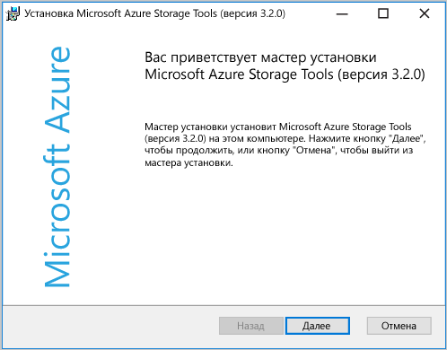
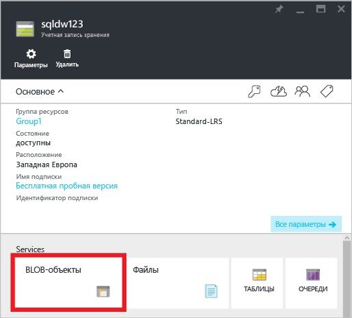
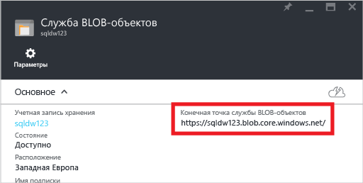
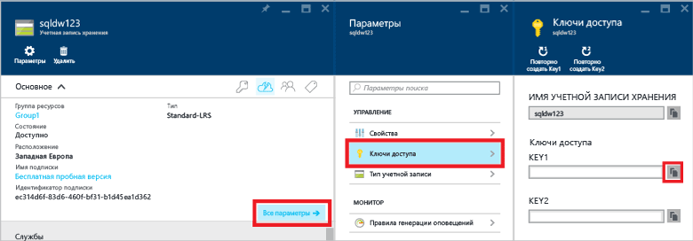
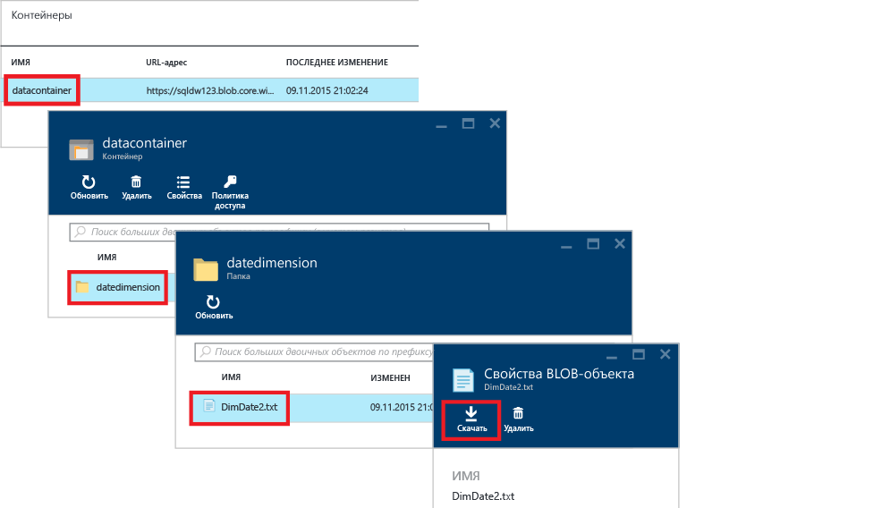
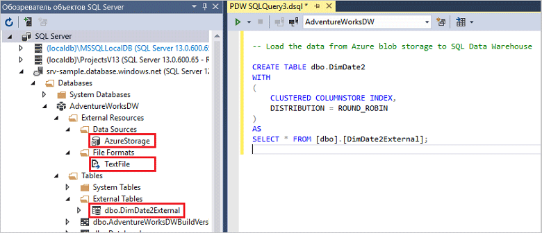

# <a name="load-data-with-polybase-in-sql-data-warehouse"></a>Загрузка данных в хранилище данных SQL с помощью PolyBase
> [!div class="op_single_selector"]
> * [SSIS](sql-data-warehouse-load-from-sql-server-with-integration-services.md)
> * [PolyBase;](sql-data-warehouse-load-from-sql-server-with-polybase.md)
> * [bcp](sql-data-warehouse-load-from-sql-server-with-bcp.md)
> 
> 

В этом руководстве показано, как загрузить данные в хранилище данных SQL с помощью AzCopy и PolyBase. Изучив руководство, вы будете знать:

* как использовать AzCopy для копирования данных в хранилище больших двоичных объектов;
* как создавать объекты базы данных для определения данных;
* как выполнять запросы T-SQL для загрузки данных.

> [!VIDEO https://channel9.msdn.com/Blogs/Azure/Loading-data-with-PolyBase-in-Azure-SQL-Data-Warehouse/player]
> 
> 

## <a name="prerequisites"></a>предварительным требованиям
Для выполнения этих действий необходимо иметь следующее.

* База данных хранилища данных SQL.
* Учетная запись хранилища Azure типа Standard-LRS (локально избыточное хранилище уровня «Стандартный»), Standard-GRS (геоизбыточное хранилище уровня «Стандартный») или Standard-RAGRS (геоизбыточное хранилище с доступом для чтения уровня «Стандартный»).
* Служебная программа командной строки AzCopy. Скачайте и установите [последнюю версию AzCopy][latest version of AzCopy], которая входит в состав средств службы хранилища Microsoft Azure.
  
    

## <a name="step-1-add-sample-data-to-azure-blob-storage"></a>Шаг 1. Добавление данных в хранилище больших двоичных объектов Azure
Чтобы загрузить данные, нам нужно сначала поместить демонстрационные данные в хранилище BLOB-объектов Azure. На этом шаге мы заполним демонстрационными данными большой двоичный объект хранилища Azure. Затем с помощью PolyBase мы загрузим эти данные в базу данных хранилища данных SQL.

### <a name="a-prepare-a-sample-text-file"></a>О. Подготовка примера текстового файла
Создайте пример текстового файла следующим образом.

1. Откройте Блокнот и скопируйте следующие строки данных в новый файл. Сохраните файл в локальный каталог с именем %temp%\DimDate2.txt.

```
20150301,1,3
20150501,2,4
20151001,4,2
20150201,1,3
20151201,4,2
20150801,3,1
20150601,2,4
20151101,4,2
20150401,2,4
20150701,3,1
20150901,3,1
20150101,1,3
```

### <a name="b-find-your-blob-service-endpoint"></a>B. Поиск адреса конечной точки службы BLOB-объектов
Найдите конечную точку службы BLOB-объектов следующим образом.

1. На портале Azure выберите **Обзор** > **Учетные записи хранения**.
2. Щелкните учетную запись хранения, которую хотите использовать.
3. В колонке учетной записи хранения выберите «BLOB-объекты».
   
    
4. Сохраните URL-адрес конечной точки службы BLOB-объектов.
   
    

### <a name="c-find-your-azure-storage-key"></a>C. Поиск ключа к хранилищу данных Azure
Найдите ключ к хранилищу данных Azure следующим образом.

1. На портале Azure выберите **Обзор** > **Учетные записи хранения**.
2. Щелкните учетную запись хранения, которую вы хотите использовать.
3. Выберите **Все параметры** > **Ключи доступа**.
4. Скопируйте один из ключей доступа в буфер обмена.
   
    

### <a name="d-copy-the-sample-file-to-azure-blob-storage"></a>D. Копирование примера файла в хранилище BLOB-объектов Azure
Скопируйте сохраненные данные в хранилище BLOB-объектов Azure следующим образом.

1. Откройте командную строку и перейдите в каталог, в котором установлена программа AzCopy. Эта команда выполняет переход в каталог установки, который по умолчанию используется на 64-разрядной версии Windows.
   
    ```
    cd /d "%ProgramFiles(x86)%\Microsoft SDKs\Azure\AzCopy"
    ```
2. Выполните следующую команду, чтобы передать файл: Укажите URL-адрес конечной точки службы BLOB-объектов вместо <blob service endpoint URL> и ключ учетной записи хранения Azure вместо <azure_storage_account_key>.
   
    ```
    .\AzCopy.exe /Source:C:\Temp\ /Dest:<blob service endpoint URL> /datacontainer/datedimension/ /DestKey:<azure_storage_account_key> /Pattern:DimDate2.txt
    ```

См. также статью [Приступая к работе со служебной программой командной строки AzCopy][latest version of AzCopy].

### <a name="e-explore-your-blob-storage-container"></a>E. Просмотр содержимого контейнера хранилища BLOB-объектов
Проверьте загрузку файла в хранилище BLOB-объектов следующим образом.

1. Вернитесь к колонке службы BLOB-объектов.
2. В разделе «Контейнеры» дважды щелкните **datacontainer**.
3. Щелкните папку **datedimension**, где хранятся ваши данные, и найдите там загруженный файл **DimDate2.txt**.
4. Чтобы просмотреть его свойства, щелкните **DimDate2.txt**.
5. Обратите внимание, что в колонке свойств BLOB-объекта есть возможность загрузки и удаления файла.
   
    

## <a name="step-2-create-an-external-table-for-the-sample-data"></a>Шаг 2. Создание внешней таблицы для демонстрационных данных
В этом разделе мы создадим внешнюю таблицу, которая определяет демонстрационные данные.

PolyBase использует внешние таблицы для доступа к данным в хранилище BLOB-объектов. Поскольку данные хранятся не в хранилище данных SQL, PolyBase выполняет проверку подлинности для доступа к внешним данным с помощью учетных данных, заданных для базы данных.

На этом шаге нашего примера мы выполним несколько инструкций Transact-SQL для создания внешней таблицы.

* [Create Master Key (Transact-SQL)][Create Master Key (Transact-SQL)]: шифрование секрета учетных данных, заданных для базы данных.
* [Create Database Scoped Credential (Transact-SQL)][Create Database Scoped Credential (Transact-SQL)]: предоставление сведений для аутентификации учетной записи хранения Azure.
* [Create External Data Source (Transact-SQL)][Create External Data Source (Transact-SQL)]: определение расположения хранилища BLOB-объектов Azure.
* [Create External File Format (Transact-SQL)][Create External File Format (Transact-SQL)]: определение формата данных.
* [Create External Table (Transact-SQL)][Create External Table (Transact-SQL)]: определение таблицы и расположения данных.

Выполните этот запрос к вашей базе данных хранилища данных SQL. В схеме dbo будет создана внешняя таблица с именем DimDate2External, которая указывает на файл с демонстрационными данными DimDate2.txt в хранилище BLOB-объектов Azure.

```sql
-- A: Create a master key.
-- Only necessary if one does not already exist.
-- Required to encrypt the credential secret in the next step.

CREATE MASTER KEY;


-- B: Create a database scoped credential
-- IDENTITY: Provide any string, it is not used for authentication to Azure storage.
-- SECRET: Provide your Azure storage account key.


CREATE DATABASE SCOPED CREDENTIAL AzureStorageCredential
WITH
    IDENTITY = 'user',
    SECRET = '<azure_storage_account_key>'
;


-- C: Create an external data source
-- TYPE: HADOOP - PolyBase uses Hadoop APIs to access data in Azure blob storage.
-- LOCATION: Provide Azure storage account name and blob container name.
-- CREDENTIAL: Provide the credential created in the previous step.

CREATE EXTERNAL DATA SOURCE AzureStorage
WITH (
    TYPE = HADOOP,
    LOCATION = 'wasbs://<blob_container_name>@<azure_storage_account_name>.blob.core.windows.net',
    CREDENTIAL = AzureStorageCredential
);


-- D: Create an external file format
-- FORMAT_TYPE: Type of file format in Azure storage (supported: DELIMITEDTEXT, RCFILE, ORC, PARQUET).
-- FORMAT_OPTIONS: Specify field terminator, string delimiter, date format etc. for delimited text files.
-- Specify DATA_COMPRESSION method if data is compressed.

CREATE EXTERNAL FILE FORMAT TextFile
WITH (
    FORMAT_TYPE = DelimitedText,
    FORMAT_OPTIONS (FIELD_TERMINATOR = ',')
);


-- E: Create the external table
-- Specify column names and data types. This needs to match the data in the sample file.
-- LOCATION: Specify path to file or directory that contains the data (relative to the blob container).
-- To point to all files under the blob container, use LOCATION='.'

CREATE EXTERNAL TABLE dbo.DimDate2External (
    DateId INT NOT NULL,
    CalendarQuarter TINYINT NOT NULL,
    FiscalQuarter TINYINT NOT NULL
)
WITH (
    LOCATION='/datedimension/',
    DATA_SOURCE=AzureStorage,
    FILE_FORMAT=TextFile
);


-- Run a query on the external table

SELECT count(*) FROM dbo.DimDate2External;

```


В обозревателе объектов SQL Server в Visual Studio можно просмотреть формат внешнего файла, внешний источник данных и таблицу DimDate2External.



## <a name="step-3-load-data-into-sql-data-warehouse"></a>Шаг 3. Загрузка данных в хранилище данных SQL
После создания внешней таблицы вы можете загрузить данные в новую таблицу или вставить в уже существующую.

* Чтобы загрузить данные в новую таблицу, выполните инструкцию [CREATE TABLE AS SELECT (Transact-SQL)][CREATE TABLE AS SELECT (Transact-SQL)]. В новую таблицу будут включены столбцы с именами, указанными в запросе. Типы данных столбцов будут соответствовать типам данных в определении внешней таблицы.
* Чтобы загрузить данные в существующую таблицу, выполните инструкцию [INSERT...SELECT (Transact-SQL)][INSERT...SELECT (Transact-SQL)].

```sql
-- Load the data from Azure blob storage to SQL Data Warehouse

CREATE TABLE dbo.DimDate2
WITH
(   
    CLUSTERED COLUMNSTORE INDEX,
    DISTRIBUTION = ROUND_ROBIN
)
AS
SELECT * FROM [dbo].[DimDate2External];
```

## <a name="step-4-create-statistics-on-your-newly-loaded-data"></a>Шаг 4. Создание статистики для только что загруженных данных
Хранилище данных SQL не создает и не обновляет статистику автоматически. Поэтому после первой загрузки нужно создать статистику для каждого столбца каждой таблицы, чтобы обеспечить высокую производительность. Также важно обновлять статистику после существенных изменений данных.

Этот пример создает статистику по отдельным столбцам для новой таблицы DimDate2.

```sql
CREATE STATISTICS [DateId] on [DimDate2] ([DateId]);
CREATE STATISTICS [CalendarQuarter] on [DimDate2] ([CalendarQuarter]);
CREATE STATISTICS [FiscalQuarter] on [DimDate2] ([FiscalQuarter]);
```

Дополнительные сведения см. в статье [Управление статистикой таблиц в хранилище данных SQL][Statistics].  

## <a name="next-steps"></a>Дополнительная информация
При разработке решений на основе PolyBase будет полезно изучить [руководство по PolyBase][PolyBase guide].

<!--Image references-->


<!--Article references-->
[PolyBase in SQL Data Warehouse Tutorial]: ./sql-data-warehouse-get-started-load-with-polybase.md
[Load data with bcp]: ./sql-data-warehouse-load-with-bcp.md
[Statistics]: ./sql-data-warehouse-tables-statistics.md
[PolyBase guide]: ./sql-data-warehouse-load-polybase-guide.md
[latest version of AzCopy]:../storage/common/storage-use-azcopy.md

<!--External references-->
[supported source/sink]: https://msdn.microsoft.com/library/dn894007.aspx
[copy activity]: https://msdn.microsoft.com/library/dn835035.aspx
[SQL Server destination adapter]: https://msdn.microsoft.com/library/ms141095.aspx
[SSIS]: https://msdn.microsoft.com/library/ms141026.aspx


[CREATE EXTERNAL DATA SOURCE (Transact-SQL)]:https://msdn.microsoft.com/library/dn935022.aspx
[CREATE EXTERNAL FILE FORMAT (Transact-SQL)]:https://msdn.microsoft.com/library/dn935026.aspx
[CREATE EXTERNAL TABLE (Transact-SQL)]:https://msdn.microsoft.com/library/dn935021.aspx

[DROP EXTERNAL DATA SOURCE (Transact-SQL)]:https://msdn.microsoft.com/library/mt146367.aspx
[DROP EXTERNAL FILE FORMAT (Transact-SQL)]:https://msdn.microsoft.com/library/mt146379.aspx
[DROP EXTERNAL TABLE (Transact-SQL)]:https://msdn.microsoft.com/library/mt130698.aspx

[CREATE TABLE AS SELECT (Transact-SQL)]:https://msdn.microsoft.com/library/mt204041.aspx
[INSERT...SELECT (Transact-SQL)]:https://msdn.microsoft.com/library/ms174335.aspx
[CREATE MASTER KEY (Transact-SQL)]:https://msdn.microsoft.com/library/ms174382.aspx
[CREATE CREDENTIAL (Transact-SQL)]:https://msdn.microsoft.com/library/ms189522.aspx
[CREATE DATABASE SCOPED CREDENTIAL (Transact-SQL)]:https://msdn.microsoft.com/library/mt270260.aspx
[DROP CREDENTIAL (Transact-SQL)]:https://msdn.microsoft.com/library/ms189450.aspx
