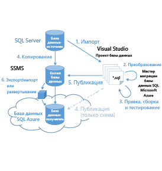
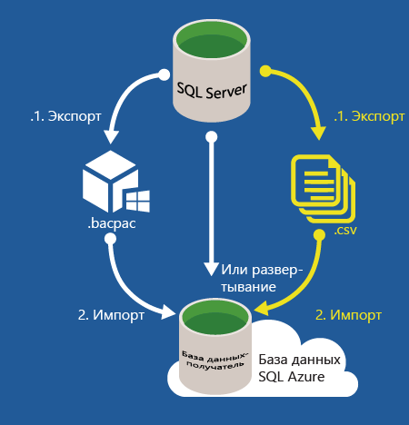

<properties
   pageTitle="Миграция базы данных SQL Server в базу данных SQL | Microsoft Azure"
   description="Узнайте, как выполнить миграцию локальной базы данных SQL Server в базу данных SQL Azure в облаке. Используйте средства миграции баз данных для проверки совместимости перед миграцией базы данных."
   keywords="миграция базы данных, миграция базы данных SQL Server, средства миграции базы данных, миграция базы данных, миграция базы данных SQL"
   services="sql-database"
   documentationCenter=""
   authors="carlrabeler"
   manager="jhubbard"
   editor=""/>

<tags
   ms.service="sql-database"
   ms.devlang="NA"
   ms.topic="article"
   ms.tgt_pltfrm="NA"
   ms.workload="data-management"
   ms.date="05/31/2016"
   ms.author="carlrab"/>

# Миграция базы данных SQL Server в базу данных SQL в облаке

Из этой статьи вы узнаете, как перенести локальную базу данных SQL Server 2005 или более поздней версии в Базу данных SQL Azure. В процессе миграции базы данных выполняется перенос схемы и данных из базы данных SQL Server в текущей среде в базу данных SQL при условии, что существующая база данных удовлетворяет критериям совместимости. Начиная с [Базы данных SQL версии 12](sql-database-v12-whats-new.md), осталось очень мало проблем совместимости, не связанных с операциями уровня сервера и операциями между базами данных. Базы данных и приложения, опирающиеся на [частично или полностью неподдерживаемые функции](sql-database-transact-sql-information.md), потребуют небольшой доработки для устранения этих несовместимостей перед миграцией базы данных SQL Server.

Для миграции выполните следующие действия:

- **Тестирование на совместимость**: сначала необходимо проверить совместимость базы данных с [базой данных SQL версии 12](sql-database-v12-whats-new.md). 
- **Устранение проблем совместимости, если таковые имеются**: если проверка не пройдена, необходимо устранить ошибки проверки.  
- **Выполнение миграции**: после исправления ошибок совместимости можно выполнить миграцию одним или несколькими способами. 

SQL Server предоставляет несколько методов для решения каждой из этих задач. В этой статье будет представлен обзор методов, доступных для решения каждой задачи. Действия и методы показаны на следующей схеме.

  
  
 > [AZURE.NOTE] Информацию о переносе в Базу данных SQL Azure баз данных, отличных от SQL Server, в том числе Microsoft Access, Sybase, MySQL Oracle и DB2, см. в статье [Помощник по миграции SQL Server](http://blogs.msdn.com/b/ssma/).

## Средства миграции баз данных проверяют совместимость базы данных SQL Server с базой данных SQL.

Чтобы проверить отсутствие проблем совместимости базы данных SQL перед началом процесса миграции, используйте один из следующих методов.

> [AZURE.SELECTOR]
- [SSDT](sql-database-cloud-migrate-fix-compatibility-issues-ssdt.md)
- [SqlPackage](sql-database-cloud-migrate-determine-compatibility-sqlpackage.md)
- [SSMS](sql-database-cloud-migrate-determine-compatibility-ssms.md)
- [Помощник по обновлению](http://www.microsoft.com/download/details.aspx?id=48119)
- [SAMW](sql-database-cloud-migrate-fix-compatibility-issues.md)

- [SQL Server Data Tools для Visual Studio (SSDT)](sql-database-cloud-migrate-fix-compatibility-issues-ssdt.md). SSDT использует последние правила совместимости для обнаружения несовместимости с базой данных SQL версии 12. Если обнаружены проблемы с совместимостью, их можно исправить прямо в этом инструменте. Это рекомендуемый метод для проверки и устранения проблем совместимости базы данных SQL версии 12. 
- [SqlPackage](sql-database-cloud-migrate-determine-compatibility-sqlpackage.md). SqlPackage — это программа командной строки, которая проверит наличие проблем совместимости и при их обнаружении составит отчет с их описанием. При использовании этого средства убедитесь, что используется самая последняя версия правил совместимости. При обнаружении ошибок необходимо использовать другое средство для устранения обнаруженных проблем с совместимостью — рекомендуется использовать SSDT.  
- [Мастер экспорта данных уровня приложения в SQL Server Management Studio](sql-database-cloud-migrate-determine-compatibility-ssms.md). Этот мастер отобразит обнаруженные ошибки на экране. Если ошибок не обнаружено, можно выполнить миграцию в базу данных SQL. При обнаружении ошибок необходимо использовать другое средство для устранения обнаруженных проблем с совместимостью — рекомендуется использовать SSDT.
- [Предварительная версия помощника по обновлению Microsoft SQL Server 2016](http://www.microsoft.com/download/details.aspx?id=48119). Этот изолированный инструмент, который сейчас находится на этапе предварительной версии, обнаружит несовместимости с базой данных SQL версии 12 и сформирует отчет о них. Это средство еще не содержит самых последних правил совместимости. Если ошибок не обнаружено, можно выполнить миграцию в базу данных SQL. При обнаружении ошибок необходимо использовать другое средство для устранения обнаруженных проблем с совместимостью — рекомендуется использовать SSDT. 
- [Мастер миграции SQL Azure (SAMW)](sql-database-cloud-migrate-fix-compatibility-issues.md). SAMW — это инструмент codeplex, который использует правила совместимости базы данных SQL Azure версии 11 для обнаружения несовместимости базы данных SQL Azure версии 12. При обнаружении проблем совместимости некоторые проблемы можно устранить прямо в этом инструменте. Это средство может найти несовместимости, которые не требуется устранять. Но это первое средство для помощи в миграции баз данных SQL, которое было выпущено, и оно получает обширную поддержку со стороны сообщества SQL Server. Кроме того, прямо из него можно выполнить миграцию. 

## Устранение проблем совместимости при миграции базы данных

При обнаружении проблем совместимости необходимо устранить их перед выполнением миграции базы данных SQL Server. Существует широкий спектр проблем совместимости, которые могут возникнуть в зависимости от версии исходной базы данных SQL Server и сложности базы данных, для которой выполняется миграция. Чем более старой является версия исходной базы данных SQL Server, тем больше потенциальных проблем несовместимости может возникнуть. Воспользуйтесь поиском в Интернете, а также следующими ресурсами:

- [Функции базы данных SQL Server, которые не поддерживаются в базе данных SQL Azure](sql-database-transact-sql-information.md)
- [Неподдерживаемые функции ядра СУБД в SQL Server 2016](https://msdn.microsoft.com/library/ms144262%28v=sql.130%29)
- [Неподдерживаемые функции ядра СУБД в SQL Server 2014](https://msdn.microsoft.com/library/ms144262%28v=sql.120%29)
- [Неподдерживаемые функции ядра СУБД в SQL Server 2012](https://msdn.microsoft.com/library/ms144262%28v=sql.110%29)
- [Неподдерживаемые функции ядра СУБД в SQL Server 2008 R2](https://msdn.microsoft.com/library/ms144262%28v=sql.105%29)
- [Неподдерживаемые функции ядра СУБД в SQL Server 2005](https://msdn.microsoft.com/library/ms144262%28v=sql.90%29)

В дополнение к поиску в Интернете и этим ресурсам большую помощь в устранении проблемы несовместимости могут оказать [форумы MSDN сообщества SQL Server](https://social.msdn.microsoft.com/Forums/sqlserver/home?category=sqlserver) и сайт [StackOverflow](http://stackoverflow.com/).

Для устранения обнаруженных проблем используйте одно из следующих средств миграции баз данных:

> [AZURE.SELECTOR]
- [SSDT](sql-database-cloud-migrate-fix-compatibility-issues-ssdt.md)
- [SSMS](sql-database-cloud-migrate-fix-compatibility-issues-ssms.md)
- [SAMW](sql-database-cloud-migrate-fix-compatibility-issues.md)

- Используйте [SQL Server Data Tools для Visual Studio (SSDT)](sql-database-cloud-migrate-fix-compatibility-issues-ssdt.md). Для применения SSDT можно импортировать схему базы данных в SQL Server Data Tools для Visual Studion (SSDT), создать проект для развертывания базы данных SQL версии 12, устранить все проблемы совместимости, обнаруженные в SSDT, и затем синхронизировать изменения с исходной базой данных (или ее копией). Это рекомендуемый метод для проверки и устранения проблем совместимости базы данных SQL версии 12. По следующей ссылке доступно [пошаговое руководство по SSDT](sql-database-cloud-migrate-fix-compatibility-issues-ssdt.md).
- Используйте [SQL Server Management Studio (SSMS)](sql-database-cloud-migrate-fix-compatibility-issues-ssms.md). Чтобы использовать SSMS, исправьте ошибки, обнаруженные с помощью другого инструмента, выполняя команды Transact-SQL. Этот метод предназначен прежде всего для опытных пользователей и подразумевает изменение схемы базы данных непосредственно в исходной базе данных. 
- Используйте [мастер миграции SQL Azure (SAMW)](sql-database-cloud-migrate-fix-compatibility-issues.md). Чтобы использовать SAMW, необходимо создать сценарий Transact-SQL из исходной базы данных, которая затем преобразуется мастером (если это возможно) так, чтобы ее схема была совместимой с базой данных SQL версии 12. После окончания процесса SAMW может подключиться к базе данных SQL версии 12 для выполнения скрипта. Это средство также будет анализировать файлы трассировки, чтобы определить проблемы совместимости. Сценарии могут создаваться только со схемой или могут содержать данные в формате BCP.

## Перенос совместимой базы данных SQL Server в Базу данных SQL

Корпорация Майкрософт предоставляет несколько методов переноса совместимой базы данных SQL Server для различных сценариев. Выбор способа зависит от допустимости простоев, размера и сложности базы данных SQL Server и вашего подключения к облаку Microsoft Azure.

> [AZURE.SELECTOR]
- [Мастер миграции SSMS](sql-database-cloud-migrate-compatible-using-ssms-migration-wizard.md)
- [Экспорт в BACPAC-файл](sql-database-cloud-migrate-compatible-export-bacpac-ssms.md)
- [Импорт из BACPAC-файла](sql-database-cloud-migrate-compatible-import-bacpac-ssms.md)
- [Репликация транзакций](sql-database-cloud-migrate-compatible-using-transactional-replication.md)

Первый вопрос, который нужно задать для выбора метода переноса, — можно ли вывести базу данных из рабочего режима на время переноса. Миграция базы данных при наличии активных транзакций может привести к несогласованности баз данных и повреждению базы данных. Существует множество методов замораживания базы данных — от запрета подключения клиента до создания [моментального снимка базы данных](https://msdn.microsoft.com/library/ms175876.aspx).

Для переноса с минимальным временем простоя используйте [репликацию транзакций SQL Server](sql-database-cloud-migrate-compatible-using-transactional-replication.md), если база данных соответствует требованиям для репликации транзакций. Если вы можете позволить себе некоторое время простоя или выполняете тестовую миграцию рабочей базы данных для последующей полноценной миграции, воспользуйтесь одним из следующих трех методов.

- [Мастер миграции SSMS](sql-database-cloud-migrate-compatible-using-ssms-migration-wizard.md). Для переноса малых и средних совместимых баз данных SQL Server 2005 или более поздних версий достаточно запустить [мастер по развертыванию базы данных в Базе данных Microsoft Azure](sql-database-cloud-migrate-compatible-using-ssms-migration-wizard.md) в среде SQL Server Management Studio.
- [Экспорт в файл BACPAC](sql-database-cloud-migrate-compatible-export-bacpac-ssms.md) и последующий [Импорт из файла BACPAC](sql-database-cloud-migrate-compatible-import-bacpac-ssms.md). При наличии проблем подключения (отсутствие подключения, низкая пропускная способность или проблемы с тайм-аутом), а также для средних и больших баз данных используйте файл [BACPAC](https://msdn.microsoft.com/library/ee210546.aspx#Anchor_4). При выборе этого метода схема и данные базы данных SQL Server экспортируются в файл BACPAC, а затем файл BACPAC импортируется в Базу данных SQL с использованием мастера экспорта приложений уровня данных в SQL Server Management Studio или программы командной строки [SqlPackage](https://msdn.microsoft.com/library/hh550080.aspx).
- Совместное использование BACPAC и BCP. Используйте файл [BACPAC](https://msdn.microsoft.com/library/ee210546.aspx#Anchor_4) и [BCP](https://msdn.microsoft.com/library/ms162802.aspx) для больших баз данных для достижения более высокого уровня параллельной обработки с целью увеличения производительности, пусть и за счет увеличения сложности. С помощью этого метода выполните перенос схемы и данных отдельно.
 - [Экспортируйте только схему в файл BACPAC](sql-database-cloud-migrate-compatible-export-bacpac-ssms.md).
 - [Импортируйте только схему из файла BACPAC](sql-database-cloud-migrate-compatible-import-bacpac-ssms.md) в Базу данных SQL.
 - Используйте [BCP](https://msdn.microsoft.com/library/ms162802.aspx) для извлечения данных в плоские файлы и затем выполните [параллельную загрузку](https://technet.microsoft.com/library/dd425070.aspx) этих файлов в Базу данных SQL Azure.

	 

## Дальнейшие действия

- [Помощник по обновлению Microsoft SQL Server 2016 (предварительная версия)](http://www.microsoft.com/download/details.aspx?id=48119)
- [Последняя версия SSDT](https://msdn.microsoft.com/library/mt204009.aspx)
- [Последняя версия SQL Server Management Studio](https://msdn.microsoft.com/library/mt238290.aspx)

##Подробнее

- [База данных SQL версии 12](sql-database-v12-whats-new.md). [Частично или полностью неподдерживаемые функции Transact-SQL](sql-database-transact-sql-information.md).
- [Migrate non-SQL Server databases using SQL Server Migration Assistant](http://blogs.msdn.com/b/ssma/) (Миграция баз данных не на основе SQL Server с помощью помощника по миграции SQL Server).

<!---HONumber=AcomDC_0601_2016-->