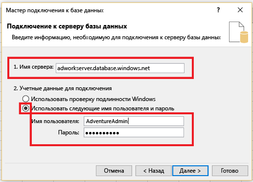
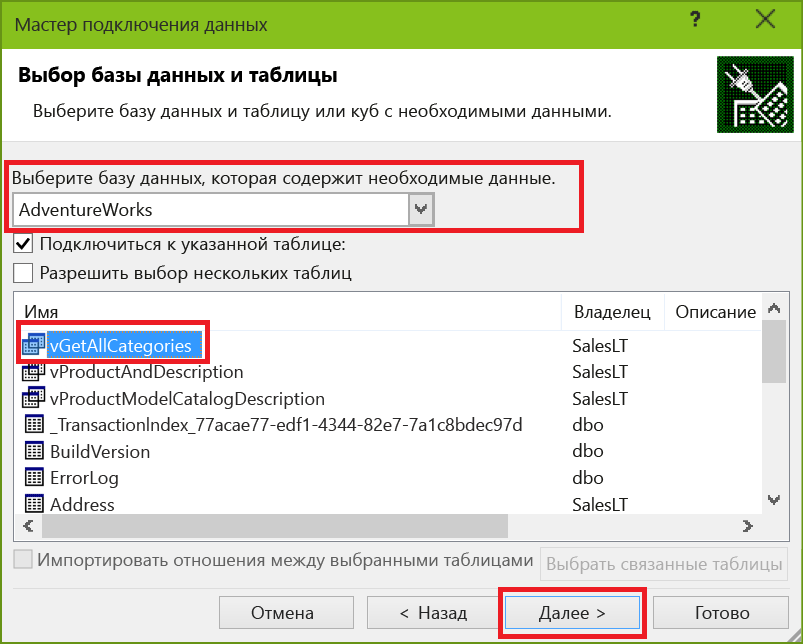
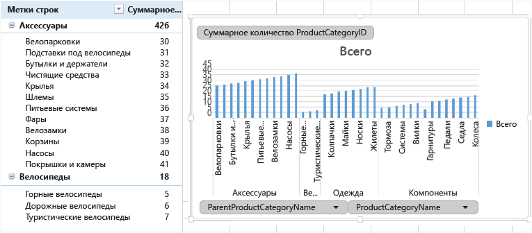

# Подключение Excel к базе данных SQL Azure и создание отчета

Подключите Excel к базе данных SQL в облаке для импорта данных, а также создания таблиц и диаграмм на основе значений в базе данных. Работая с этим руководством, вы установите подключение между Excel и таблицей базы данных, сохраните файл, в котором хранятся данные и сведения о соединении для Excel, а затем создадите сводную диаграмму на основе значений базы данных.

Чтобы начать работу, вам понадобится база данных SQL в Azure. Если база данных отсутствует, чтобы настроить ее с помощью демонстрационных данных, см. статью [Руководство по базам данных SQL: создание базы данных SQL за несколько минут с помощью портала Azure](sql-database-get-started-portal.md). Следуя инструкциям в этой статье, вы импортируете демонстрационные данные в Excel, но те же действия можно выполнять и с собственными данными.

Вам также понадобится копия Excel. В этой статье используется [Microsoft Excel 2016](https://products.office.com/).

## Подключение Excel к базе данных SQL и загрузка данных
1. Чтобы подключить Excel к базе данных SQL, откройте программу Excel, а затем создайте новую книгу или откройте существующую.
2. В строке меню в верхней части страницы выберите вкладку **Данные**, нажмите кнопку **Получить данные**, выберите пункт "Из Azure", а затем — пункт **Из базы данных SQL Azure**. 
   
   
   
   Откроется мастер подключения данных.
3. В диалоговом окне **Подключение к серверу баз данных** введите **имя сервера** базы данных SQL, к которому нужно подключиться, в формате <*имя_сервера*>**.database.windows.net**. Пример: **msftestserver.database.windows.net**. При необходимости введите имя базы данных. Нажмите кнопку **ОК**, чтобы открыть окно учетных данных. 

   

1. В диалоговом окне **База данных SQL Server** выберите слева пункт **База данных**, а затем введите **имя пользователя** и **пароль** для сервера базы данных SQL, к которому нужно подключиться. Нажмите кнопку **Подключиться**, чтобы открыть **навигатор**. 

  
   
  > [!TIP]
  > В зависимости от сетевой среды, возможно, вам не удастся подключиться или соединение будет разорвано, если сервер базы данных SQL не разрешает трафик с IP-адреса клиента. Перейдите на [портал Azure](https://portal.azure.com/), щелкните "Серверы SQL Server", выберите свой сервер, в разделе "Параметры" щелкните "Брандмауэр" и добавьте IP-адрес клиента. Дополнительные сведения см. в статье [Настройка правила брандмауэра уровня сервера базы данных SQL Azure с помощью портала Azure](sql-database-configure-firewall-settings.md).
   
   
5. В **навигаторе** выберите в списке нужную базу данных, выберите нужные таблицы или представления (мы выбрали **vGetAllCategories**), а затем нажмите кнопку **Загрузить**, чтобы перенести данные из базы данных SQL Azure в электронную таблицу Excel.
   
    
   

## Импорт данных в Excel и создание сводной диаграммы
Теперь, когда вы установили подключение, вы можете загрузить данные несколькими способами. Например, ниже описывается создание сводной диаграммы на основе данных из базы данных SQL. 

1. Выполните действия из предыдущего раздела, но на этот раз не нажимайте кнопку **Загрузить**, а выберите пункт **Загрузить в** из раскрывающегося списка **Загрузить**.
2. Затем выберите способ представления данных в книге. Мы выбрали режим **Сводная диаграмма**. Кроме того, можно создать **новый лист** или **добавить эти сведения в модель данных**. Дополнительные сведения о моделях данных см. в статье [Создание модели данных в Excel](https://support.office.com/article/Create-a-Data-Model-in-Excel-87E7A54C-87DC-488E-9410-5C75DBCB0F7B). 
   
    
   
    Лист теперь содержит пустую сводную таблицу и диаграмму.
2. В разделе **Поля сводной таблицы**установите все флажки для полей, которые требуется просмотреть.
   
    

> [!TIP]
> Если нужно подключить другие книги и листы Excel к базе данных, на вкладке **Данные** нажмите кнопку **Последние источники**, чтобы открыть диалоговое окно **Последние источники**. Выберите в списке ранее созданное подключение и нажмите кнопку **Открыть**.
> 
 
## Создание постоянного подключения с помощью файла ODC
Чтобы сохранить сведения о подключении, можно создать файл ODC. После этого подключение можно будет выбирать в диалоговом окне **Существующие подключения**. 

1. В строке меню в верхней части страницы выберите вкладку **Данные** и нажмите кнопку **Существующие подключения**, чтобы открыть диалоговое окно **Существующие подключения**. 
    1. Нажмите кнопку **Найти другие**, чтобы открыть диалоговое окно **Выбор источника данных**.   
    2. Выберите файл **+Новое подключение к SQL-серверу.odc** и нажмите кнопку **Открыть**, чтобы запустить **мастер подключения к данным**.

    

2. В **мастере подключения к данным** введите имя сервера и учетные данные для базы данных SQL. Щелкните **Далее**. 
    1. В раскрывающемся списке выберите нужную базу данных. 
    2. Выберите нужную таблицу или представление. Мы выбрали vGetAllCategories.
    3. Щелкните **Далее**. 

     

3. На следующем экране мастера подключения к данным выберите расположение файла, **имя файла** и **понятное имя**. Вы также можете сохранить пароль в файле, но это может сделать данные уязвимыми для несанкционированного доступа. По завершении нажмите кнопку **Готово**. 

    

4. Выберите способ импорта данных. Мы выбрали создание сводной таблицы. Кроме того, можно изменить свойства подключения, нажав кнопку **Свойства**. По окончании нажмите кнопку **ОК**. Если вы не сохранили пароль в файле, вам будет предложено ввести учетные данные. 

    

5. Проверьте, сохранилось ли новое подключение. Для этого на вкладке **Данные** нажмите кнопку **Существующие подключения**. 

    

## Дополнительная информация
* Узнайте, как [подключаться к базе данных SQL с помощью SQL Server Management Studio](sql-database-connect-query-ssms.md) для выполнения сложных запросов и анализа.
* Узнайте о преимуществах использования [пулов эластичных БД](sql-database-elastic-pool.md).
* Узнайте, как [создавать веб-приложения, которые подключаются к базе данных SQL в серверной части](../app-service/app-service-web-tutorial-dotnet-sqldatabase.md).

