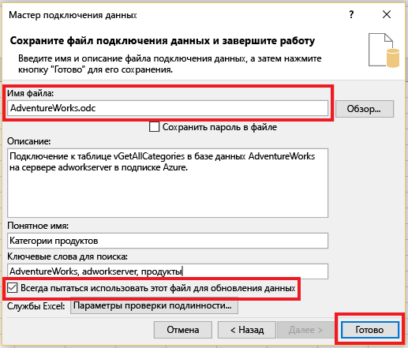
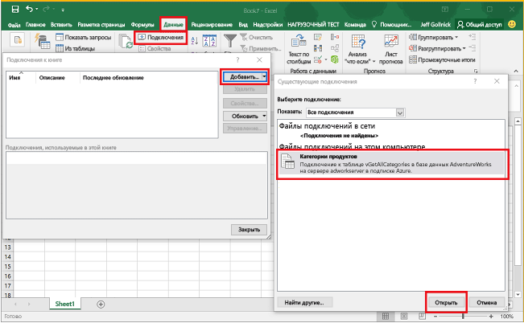

<properties
	pageTitle="Подключение Excel к базе данных SQL | Microsoft Azure"
	description="Узнайте, как подключить Microsoft Excel к базе данных SQL Azure в облаке. Импортируйте данные в Excel для создания отчетов и просмотра данных."
	services="sql-database"
	keywords="подключение excel к sql, импорт данных в excel"
	documentationCenter=""
	authors="joseidz"
	manager="jhubbard"
	editor=""/>

<tags
	ms.service="sql-database"
	ms.workload="data-management"
	ms.tgt_pltfrm="na"
	ms.devlang="na"
	ms.topic="get-started-article"
	ms.date="07/05/2016"
	ms.author="joseidz"/>

# Руководство по базам данных SQL: подключение Excel к базе данных SQL Azure и создание отчетов

> [AZURE.SELECTOR]
- [Visual Studio](sql-database-connect-query.md)
- [SSMS](sql-database-connect-query-ssms.md)
- [Excel](sql-database-connect-excel.md)

Узнайте о том, как подключить Excel к базе данных SQL в облаке для импорта данных, а также создания таблиц и диаграмм на основе значений в базе данных. Работая с этим руководством, вы установите подключение между Excel и таблицей базы данных, сохраните файл, в котором хранятся данные и сведения о соединении для Excel, а затем создадите сводную диаграмму на основе значений базы данных.

Чтобы начать работу, вам понадобится база данных SQL в Azure. Если у вас нет базы данных, см. статью [Создание первой базы данных SQL](sql-database-get-started.md), чтобы настроить базу данных с демонстрационными данными и запустить ее в течение нескольких минут. Следуя инструкциям из этой статьи, вы импортируете демонстрационные данные в Excel, но те же действия можно выполнять и с собственными данными.

Вам также понадобится копия Excel. В этой статье используется [Microsoft Excel 2016](https://products.office.com/ru-RU/).

## Подключение Excel к базе данных SQL и создание ODC-файла

1.	Чтобы подключить Excel к базе данных SQL, откройте программу Excel, а затем создайте новую книгу или откройте существующую.

2.	В строке меню в верхней части страницы последовательно щелкните элементы **Данные**, **Из других источников** и **С сервера SQL Server**.

	

	Откроется мастер подключения данных.

3.	В диалоговом окне **Подключение к серверу базы данных** введите **имя сервера** базы данных SQL, к которому нужно подключиться, в формате <*имя\_сервера*>**.database.windows.net**. Например, **adworkserver.database.windows.net**.

4.	В разделе **Учетные данные для входа** щелкните **Использовать следующие имя пользователя и пароль**, введите **имя пользователя** и **пароль**, которые вы задали для сервера базы данных SQL во время его создания, и нажмите кнопку **Далее**.

    

	> [AZURE.TIP] В зависимости от сетевой среды, возможно, вам не удастся подключиться или соединение будет разорвано, если сервер базы данных SQL не разрешает трафик с IP-адреса клиента. Перейдите на [портал Azure](https://portal.azure.com/), щелкните серверы SQL Server, в разделе настроек щелкните брандмауэр и добавьте IP-адрес клиента. Подробные сведения см. в статье [Настройка параметров брандмауэра для базы данных SQL](sql-database-configure-firewall-settings.md).

5. В диалоговом окне **Выбор базы данных и таблицы** выберите в списке базу данных, с которой вы планируете работать, и щелкните нужные таблицы или представления (мы выбрали **vGetAllCategories**), а затем нажмите кнопку **Далее**.

	

    Откроется диалоговое окно **Сохранение файла подключения данных и завершение**, где вы можете предоставить сведения о файле подключения (*.odc) базы данных Microsoft Office, который использует программа Excel. Можно оставить значения по умолчанию или выбрать свои параметры.

6. Вы можете оставить значения по умолчанию, но обратите внимание на **имя файла**. Поля **Описание**, **Понятное имя**, и **Ключевые слова для поиска** помогут вам и другим пользователям не только запомнить объект, к которому вы подключаетесь, но и найти это подключение. Щелкните **Всегда пытаться использовать этот файл для обновления данных**, если вы хотите сохранить сведения о подключении в ODC-файле, чтобы его можно было обновить после подключения. Затем нажмите кнопку **Готово**.

    

    Откроется диалоговое окно **Импорт данных**.

## Импорт данных в Excel и создание сводной диаграммы
Теперь, когда вы установили подключение, а также создали файл с данными и сведениями о подключении, можно приступать к импорту данных.

1. В диалоговом окне **Импорт данных** выберите нужный вариант представления данных на листе и нажмите кнопку **ОК**. Мы выбрали **сводную диаграмму**. Вы также можете создать **новый лист** или **добавить эти данные в модель данных**. Дополнительные сведения о моделях данных см. в статье [Создание модели данных в Excel](https://support.office.com/article/Create-a-Data-Model-in-Excel-87E7A54C-87DC-488E-9410-5C75DBCB0F7B). Щелкните **Свойства**, чтобы просмотреть сведения об ODC-файле, созданном на предыдущем шаге, и выбрать параметры для обновления данных.

	

    Лист теперь содержит пустую сводную таблицу и диаграмму.

8. В разделе **Поля сводной таблицы** установите все флажки для полей, которые требуется просмотреть.

	

> [AZURE.TIP] Если вы хотите подключить к базе данных другие книги и листы Excel, последовательно щелкните **Данные**, **Подключения**, **Добавить**, выберите в списке созданное подключение и нажмите кнопку **Открыть**. 

## Дальнейшие действия

- Узнайте, как [подключаться к базе данных SQL с помощью SQL Server Management Studio](sql-database-connect-query-ssms.md) для выполнения сложных запросов и анализа.
- Узнайте о преимуществах использования [пулов эластичных БД](sql-database-elastic-pool.md).
- Узнайте, как [создавать веб-приложения, которые подключаются к базе данных SQL в серверной части](../app-service-web/web-sites-dotnet-deploy-aspnet-mvc-app-membership-oauth-sql-database.md).

<!---HONumber=AcomDC_0706_2016--->