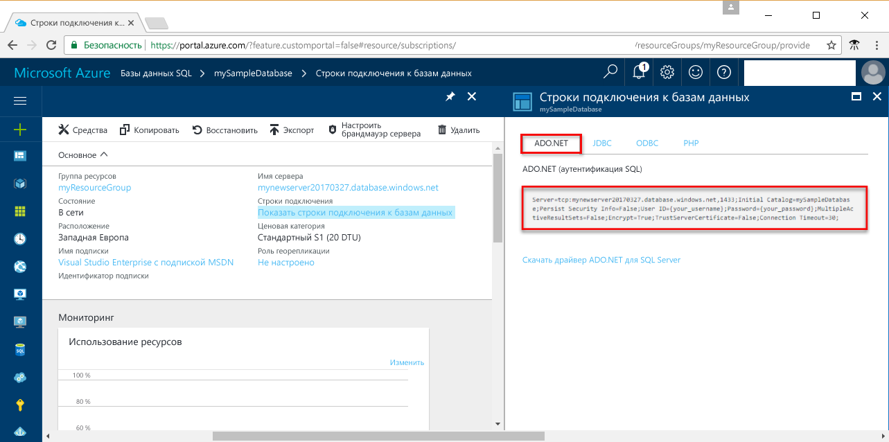

# <a name="use-net-c-with-visual-studio-to-connect-and-query-an-azure-sql-database"></a>Использование .NET (C#) с Visual Studio для подключения и создания запросов к базе данных SQL Azure

В этом кратком руководстве показано, как использовать платформу [.NET Framework](https://www.microsoft.com/net/) для создания программы C# с помощью Visual Studio для подключения к базе данных SQL Azure, а затем с помощью инструкций Transact-SQL выполнить запрос данных.

## <a name="prerequisites"></a>предварительным требованиям

Ниже указаны требования для работы с этим кратким руководством.

[!INCLUDE [prerequisites-create-db](../../includes/sql-database-connect-query-prerequisites-create-db-includes.md)]

- [Правило брандмауэра уровня сервера](sql-database-get-started-portal.md#create-a-server-level-firewall-rule) для общедоступного IP-адреса компьютера, на котором выполняются действия из этого краткого руководства.

- Убедитесь, что установлен [Visual Studio Community 2017, Visual Studio Professional 2017 или Visual Studio Enterprise 2017](https://www.visualstudio.com/downloads/).

## <a name="sql-server-connection-information"></a>Сведения о подключении SQL Server

[!INCLUDE [prerequisites-server-connection-info](../../includes/sql-database-connect-query-prerequisites-server-connection-info-includes.md)]

#### <a name="for-adonet"></a>Для ADO.NET

1. Щелкните **Показать строки подключения к базам данных**.

2. Просмотрите полную строку подключения **ADO.NET**.

    

> [!IMPORTANT]
> Необходимо настроить правила брандмауэра для общедоступного IP-адреса компьютера, на котором выполняются действия из этого руководства. Если вы используете другой компьютер или имеете другой общедоступный IP-адрес, создайте [правила брандмауэра на уровне сервера с помощью портала Azure](sql-database-get-started-portal.md#create-a-server-level-firewall-rule). 
>
  
## <a name="create-a-new-visual-studio-project"></a>Создание проекта Visual Studio

1. В Visual Studio выберите **Файл**, **Создать**, **Проект**. 
2. Откройте диалоговое окно **Создать проект** и разверните **Visual C#**.
3. Выберите **Консольное приложение** и введите *sqltest* для имени проекта.
4. Нажмите кнопку **ОК**, чтобы создать и открыть проект в Visual Studio.
4. В обозревателе решений щелкните правой кнопкой мыши **sqltest** и щелкните **Управление пакетами NuGet**. 
5. Щелкните **Обзор**, выполните поиск по запросу ```System.Data.SqlClient``` и выберите его по завершении поиска.
6. На странице **System.Data.SqlClient** щелкните **Установить**.
7. После завершения установки просмотрите изменения, а затем нажмите кнопку **ОК**, чтобы закрыть окно **предварительного просмотра**. 
8. Если откроется окно **Прием условий лицензионного соглашения**, щелкните **Я принимаю**.

## <a name="insert-code-to-query-sql-database"></a>Вставка кода для отправки запроса к базе данных SQL
1. Перейдите к (или откройте при необходимости) **Program.cs**.

2. Замените содержимое **Program.cs** следующим кодом и добавьте соответствующие значения для сервера, базы данных, пользователя и пароля.

```csharp
using System;
using System.Data.SqlClient;
using System.Text;

namespace sqltest
{
    class Program
    {
        static void Main(string[] args)
        {
            try 
            { 
                SqlConnectionStringBuilder builder = new SqlConnectionStringBuilder();
                builder.DataSource = "your_server.database.windows.net"; 
                builder.UserID = "your_user";            
                builder.Password = "your_password";     
                builder.InitialCatalog = "your_database";

                using (SqlConnection connection = new SqlConnection(builder.ConnectionString))
                {
                    Console.WriteLine("\nQuery data example:");
                    Console.WriteLine("=========================================\n");
                    
                    connection.Open();       
                    StringBuilder sb = new StringBuilder();
                    sb.Append("SELECT TOP 20 pc.Name as CategoryName, p.name as ProductName ");
                    sb.Append("FROM [SalesLT].[ProductCategory] pc ");
                    sb.Append("JOIN [SalesLT].[Product] p ");
                    sb.Append("ON pc.productcategoryid = p.productcategoryid;");
                    String sql = sb.ToString();

                    using (SqlCommand command = new SqlCommand(sql, connection))
                    {
                        using (SqlDataReader reader = command.ExecuteReader())
                        {
                            while (reader.Read())
                            {
                                Console.WriteLine("{0} {1}", reader.GetString(0), reader.GetString(1));
                            }
                        }
                    }                    
                }
            }
            catch (SqlException e)
            {
                Console.WriteLine(e.ToString());
            }
            Console.ReadLine();
        }
    }
}
```

## <a name="run-the-code"></a>Выполнение кода

1. Нажмите клавишу **F5** для запуска приложения.
2. Убедитесь, что возвращены первые 20 строк, а затем закройте окно приложения.

## <a name="next-steps"></a>Дополнительная информация

- Узнайте, как [подключиться и отправить запрос к базе данных SQL Azure с помощью .NET Core](sql-database-connect-query-dotnet-core.md) в Windows, Linux и Mac OS.  
- См. дополнительные сведения о [начале работы с .NET Core в Windows, Linux и Mac OS с помощью командной строки](/dotnet/core/tutorials/using-with-xplat-cli).
- Узнайте, как спроектировать первую базу данных SQL с помощью [SSMS](sql-database-design-first-database.md) или [.NET](sql-database-design-first-database-csharp.md).
- Дополнительные сведения о .NET см. в [этой документации](https://docs.microsoft.com/dotnet/).
- [Пример логики повтора: отказоустойчивое подключение к SQL с помощью ADO.NET][step-4-connect-resiliently-to-sql-with-ado-net-a78n]


<!-- Link references. -->

[step-4-connect-resiliently-to-sql-with-ado-net-a78n]: https://docs.microsoft.com/sql/connect/ado-net/step-4-connect-resiliently-to-sql-with-ado-net

