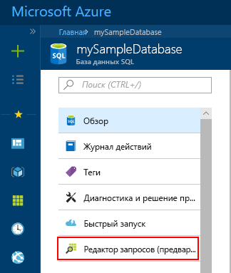
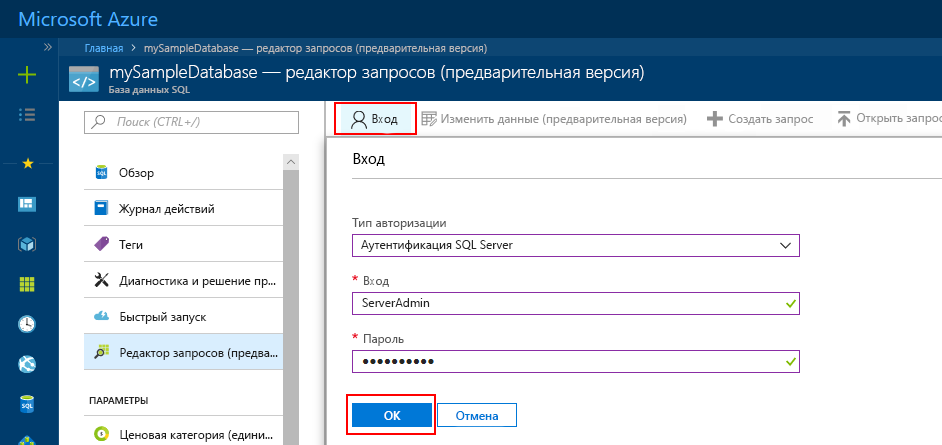
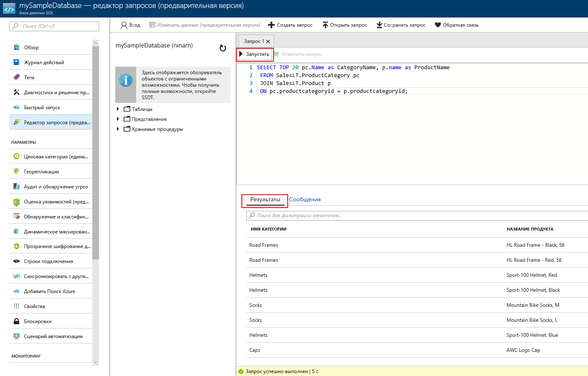

# <a name="azure-portal-use-the-sql-query-editor-to-connect-and-query-data"></a>Портал Azure. Использование редактора SQL-запросов для подключения к данным и их запроса

Редактор SQL-запросов представляет собой браузерное средство запроса, которое обеспечивает эффективный и простой способ выполнения запросов SQL в базе данных SQL Azure или хранилище данных SQL Azure без необходимости покидать портал Azure. В этом кратком руководстве показано, как использовать редактор запросов для подключения к базе данных SQL, а затем с помощью инструкций Transact-SQL выполнить запрос, вставку, обновление и удаление данных в базе данных.

## <a name="prerequisites"></a>предварительным требованиям

Начальной точкой в руководстве являются ресурсы, созданные в одном из этих кратких руководств:

[!INCLUDE [prerequisites-create-db](../../includes/sql-database-connect-query-prerequisites-create-db-includes.md)]

> [!NOTE]
> В параметрах брандмауэра SQL Server задайте для параметра "Разрешить доступ к службам Azure" значение "Вкл". Таким образом вы предоставите редактору SQL-запросов доступ к базам и хранилищам данных.

## <a name="log-in-to-the-azure-portal"></a>Войдите на портал Azure.

Войдите на [портал Azure](https://portal.azure.com/).


## <a name="connect-using-sql-authentication"></a>Подключение с помощью аутентификации SQL

1. В левой области меню щелкните **Базы данных SQL**, а затем выберите базу данных для запроса.

2. На странице базы данных SQL своей базы данных найдите и выберите **Редактор запросов (предварительная версия)** в левом меню.

    

3. Щелкните **Вход** и при появлении запроса выберите **Проверка подлинности SQL Server**, а затем укажите учетные данные и пароль администратора сервера, указанные при создании базы данных.

    

4. Нажмите кнопку **ОК**, чтобы выполнить вход.


## <a name="connect-using-azure-ad"></a>Подключение с помощью Azure AD

Настройка администратора Active Directory позволит использовать единое удостоверение для входа на портал Azure и в базу данных SQL. Выполните шаги ниже, чтобы настроить администратора Active Directory для созданного сервера SQL Server.

> [!NOTE]
> Учетные записи электронной почты (например, outlook.com, hotmail.com, live.com, gmail.com, yahoo.com) пока не поддерживаются как учетные записи администраторов Active Directory. Выберите пользователя, который изначально был создан в Azure Active Directory или же был интегрирован в каталог Azure AD.

1. В левой области меню выберите **Серверы SQL Server**, а затем в списке серверов выберите свой сервер SQL Server.

2. Выберите параметр **Администратор Active Directory** в меню параметров SQL Server.

3. В колонке администратора Active Directory нажмите кнопку **Задать администратора**, а затем выберите пользователя или группу, которой будет назначена роль администратора Active Directory.

    

4. В верхней области колонки администратора Active Directory нажмите кнопку **Сохранить**, чтобы задать администратора.

Перейдите к базе данных SQL для запроса и в левом меню выберите **Обозреватель данных (предварительная версия)**. Откроется страница обозревателя данных, и будет автоматически установлено подключение к базе данных.


## <a name="run-query-using-query-editor"></a>Выполнение запроса с помощью редактора запросов

После того как вы пройдете аутентификацию, в области редактора запросов введите запрос ниже, чтобы запросить первые 20 продуктов по категории.

```sql
 SELECT TOP 20 pc.Name as CategoryName, p.name as ProductName
 FROM SalesLT.ProductCategory pc
 JOIN SalesLT.Product p
 ON pc.productcategoryid = p.productcategoryid;
```

Щелкните **Выполнить** и просмотрите результаты запроса в области **Результаты**.



## <a name="insert-data-using-query-editor"></a>Вставка данных с помощью редактора запросов

Используйте указанный ниже код, чтобы вставить новый продукт в таблицу SalesLT.Product с помощью инструкции [INSERT](https://msdn.microsoft.com/library/ms174335.aspx) Transact-SQL.

1. В окне запроса замените предыдущий запрос следующим содержимым:

   ```sql
   INSERT INTO [SalesLT].[Product]
           ( [Name]
           , [ProductNumber]
           , [Color]
           , [ProductCategoryID]
           , [StandardCost]
           , [ListPrice]
           , [SellStartDate]
           )
     VALUES
           ('myNewProduct'
           ,123456789
           ,'NewColor'
           ,1
           ,100
           ,100
           ,GETDATE() );
   ```

2. На панели инструментов щелкните **Выполнить**, чтобы вставить новую строку в таблице Product.

## <a name="update-data-using-query-editor"></a>Обновление данных с помощью редактора запросов

Используйте следующий код, чтобы обновить новый продукт, добавленный ранее, с помощью инструкции [UPDATE](https://msdn.microsoft.com/library/ms177523.aspx) Transact-SQL.

1. В окне запроса замените предыдущий запрос следующим содержимым:

   ```sql
   UPDATE [SalesLT].[Product]
   SET [ListPrice] = 125
   WHERE Name = 'myNewProduct';
   ```

2. На панели инструментов щелкните **Выполнить**, чтобы обновить указанную строку в таблице Product.

## <a name="delete-data-using-query-editor"></a>Удаление данных с помощью редактора запросов

Используйте следующий код, чтобы удалить новый продукт, добавленный ранее, с помощью инструкции [DELETE](https://msdn.microsoft.com/library/ms189835.aspx) Transact-SQL.

1. В окне запроса замените предыдущий запрос следующим содержимым:

   ```sql
   DELETE FROM [SalesLT].[Product]
   WHERE Name = 'myNewProduct';
   ```

2. На панели инструментов щелкните **Выполнить**, чтобы удалить указанную строку в таблице Product.


## <a name="query-editor-considerations"></a>Рекомендации по работе с редактором запросов

Ознакомьтесь с рекомендациями по работе с редактором запросов:

1. В параметрах брандмауэра Azure SQL Server задайте для параметра "Разрешить доступ к службам Azure" значение "Вкл". Таким образом вы предоставите редактору SQL-запросов доступ к базам данных SQL и хранилищам данных.

2. Если сервер SQL Server находится в виртуальной сети, редактор запросов нельзя использовать для создания запросов к базе данных на этом сервере.

3. Если нажать клавишу F5, страница редактора запросов обновится, а текущий выполняемый запрос будет закрыт. Используйте кнопку "Выполнить" на панели инструментов, чтобы выполнить запросы.

4. Редактор запросов не поддерживает подключение к базе данных master.

5. Время ожидания для выполнения запроса составляет 5 минут.

6. Если для учетных записей включена двухфакторная проверка подлинности, вы не сможете выполнить вход от имени администратора Azure Active Directory.

7. Учетные записи электронной почты (например, outlook.com, hotmail.com, live.com, gmail.com, yahoo.com) пока не поддерживаются как учетные записи администраторов Active Directory. Выберите пользователя, который изначально был создан в Azure Active Directory или же был интегрирован в каталог Azure AD.

8. Редактор запросов поддерживает только цилиндрическую проекцию для типов данных geography.

9. Поддержка IntelliSense для таблиц и представлений баз данных отсутствует. Однако редактор поддерживает автозаполнение имен, введенных ранее.


## <a name="next-steps"></a>Дополнительная информация

- Чтобы узнать о поддержке Transact-SQL в базах данных SQL Azure, ознакомьтесь со статьей [Отличия Transact-SQL базы данных SQL Azure](sql-database-transact-sql-information.md).
