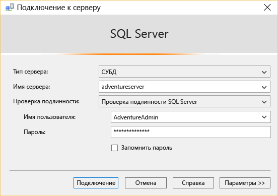

<properties
	pageTitle="Подключение к базе данных SQL с помощью SSMS | Microsoft Azure"
	description="Узнайте, как подключиться к базе данных SQL Azure с помощью SQL Server Management Studio (SSMS). Затем выполните пробный запрос с помощью Transact-SQL (T-SQL)."
	metaCanonical=""
	keywords="подключение к базе данных sql, sql server management studio"
	services="sql-database"
	documentationCenter=""
	authors="stevestein"
	manager="jeffreyg"
	editor="" />

<tags
	ms.service="sql-database"
	ms.workload="data-management"
	ms.tgt_pltfrm="na"
	ms.devlang="na"
	ms.topic="get-started-article"
	ms.date="10/09/2015"
	ms.author="sstein" />

# Подключение к базе данных SQL с помощью SQL Server Management Studio и выполнение пробного запроса T-SQL

> [AZURE.SELECTOR]
- [C#](sql-database-connect-query.md)
- [SSMS](sql-database-connect-query-ssms.md)
- [Excel](sql-database-connect-excel.md)

В этой статье показано, как подключиться к базе данных Azure с помощью SQL Server Management Studio (SSMS) и выполнить простой запрос, используя инструкции Transact-SQL (T-SQL).

Для начала вам нужна база данных SQL в Azure. Создайте базу данных согласно инструкциям в статье [Приступая к работе с базой данных SQL Microsoft Azure](sql-database-get-started.md). В приведенных здесь примерах используются примеры баз данных AdventureWorks, созданные по инструкциям в этой статье; та же процедура (до выполнения запроса) применяется для создания любой базы данных SQL.

## Установка и запуск среды SQL Server Management Studio (SSMS)

При работе с базой данных SQL используйте последнюю версию SSMS. Соответствующие инструкции см. в статье [Загрузка SQL Server Management Studio](https://msdn.microsoft.com/library/mt238290.aspx). В последней версии SSMS автоматически выдает сообщение, если доступно новое обновление.

## Запуск SSMS и подключение к серверу баз данных SQL

1. Введите в поле поиска Windows текст "Microsoft SQL Server Management Studio" и выберите классическое приложение, чтобы запустить SSMS.
2. В диалоговом окне **Подключение к серверу** в поле **Имя сервера** введите имя сервера, на котором находится ваша база данных SQL, в формате *&lt;имя\_сервера>*.**database.windows.net**.
3. В списке **Проверка подлинности** выберите **Проверка подлинности SQL Server**.
4. Введите **учетные данные** и **пароль**, установленные при создании сервера, и нажмите кнопку **Подключить**, чтобы подключиться к базе данных SQL.

	

### При сбое подключения к базе данных SQL

Наиболее распространенной причиной сбоев подключения являются ошибки в имени сервера, имени пользователя или пароле, а также запрет на подключение со стороны сервера, связанный с проблемами безопасности. Убедитесь, что параметры брандмауэра сервера разрешают подключения с IP-адреса локального компьютера и IP-адреса, используемого клиентом SSMS. Иногда они отличаются.

Если подключение завершилось ошибкой из-за настроек брандмауэра, запросите последнюю версию SSMS создать правила брандмауэра для вас. Чтобы загрузить SSMS, см. статью [Загрузка SSMS](https://msdn.microsoft.com/library/mt238290.aspx). Если вы используете более раннюю версию, в сообщении об ошибке отобразится IP-адрес и вам нужно будет добавить этот IP-адрес в правило брандмауэра для сервера. Дополнительные сведения см. в статье [Настройка параметров брандмауэра базы данных SQL Azure](sql-database-configure-firewall-settings.md).

## Запуск образцов запросов

После подключения к базе данных SQL можно выполнить пробный запрос. Если вы не создали базу данных AdventureWorks при изучении статьи [Приступая к работе с базой данных SQL Microsoft Azure](sql-database-get-started.md), этот запрос работать не будет. Для получения дополнительных сведений переходите сразу к разделу "Дальнейшие действия".

1. В **обозревателе объектов** перейдите к базе данных **AdventureWorks**.
2. Щелкните правой кнопкой мыши базу данных и выберите **Создать запрос**.

	

3. В окне запроса скопируйте и вставьте следующий код.

		SELECT
		CustomerId
		,Title
		,FirstName
		,LastName
		,CompanyName
		FROM SalesLT.Customer;

4. Нажмите кнопку **Выполнить**. На следующем снимке экрана показан успешный запрос.

	

## Дальнейшие действия

Инструкции T-SQL можно использовать для создания баз данных в Azure и управления ими таким же образом, как и в SQL Server. Если вы знаете, как использовать T-SQL в SQL Server, ознакомьтесь с отличиями, приведенными в статье [Сведения об инструкциях Transact-SQL базы данных SQL Azure](sql-database-transact-sql-information.md).

Если вы не знакомы с T-SQL, см. [Руководство по написанию инструкций Transact-SQL](https://msdn.microsoft.com/library/ms365303.aspx) и [Справочник по Transact-SQL (ядро СУБД)](https://msdn.microsoft.com/library/bb510741.aspx).

<!---HONumber=Nov15_HO4-->