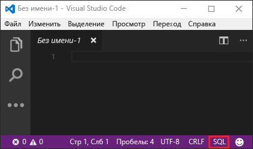
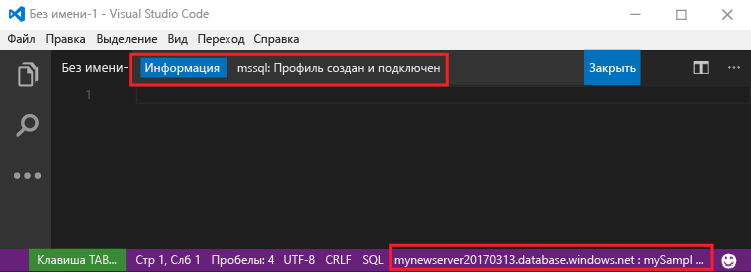
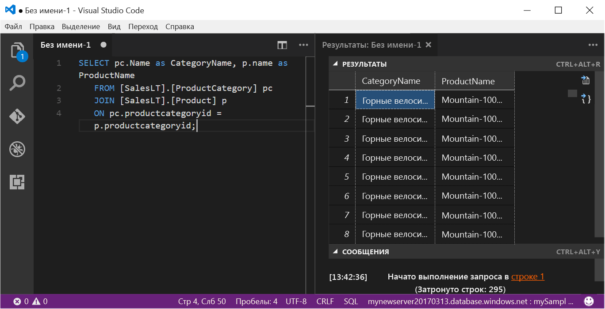

# <a name="azure-sql-database-use-visual-studio-code-to-connect-and-query-data"></a>База данных SQL Azure: подключение и запрос данных с помощью Visual Studio Code

[Visual Studio Code](https://code.visualstudio.com/docs) — это графический редактор кода для Linux, macOS и Windows, поддерживающий различные расширения, включая [расширение mssql](https://aka.ms/mssql-marketplace), для выполнения запросов к Microsoft SQL Server, базе данных SQL Azure и хранилищу данных SQL. В этом кратком руководстве показано, как, используя Visual Studio Code, подключиться к базе данных SQL Azure, а затем с помощью инструкций Transact-SQL выполнить запрос, вставку, обновление и удаление данных в базе данных.

## <a name="prerequisites"></a>предварительным требованиям

Начальной точкой в руководстве являются ресурсы, созданные в одном из этих кратких руководств:

[!INCLUDE [prerequisites-create-db](../../includes/sql-database-connect-query-prerequisites-create-db-includes.md)]

#### <a name="install-vs-code"></a>Установка VS Code

Сначала установите последнюю версию[Visual Studio Code](https://code.visualstudio.com/Download) и загрузите [расширение mssql](https://aka.ms/mssql-marketplace). Руководство по установке расширения mssql см. в разделе [об установке VS Code](https://docs.microsoft.com/sql/linux/sql-server-linux-develop-use-vscode#install-vs-code) и на странице [расширения mssql для Visual Studio Code](https://marketplace.visualstudio.com/items?itemName=ms-mssql.mssql). 

## <a name="configure-vs-code"></a>Настройка кода VS 

### <a name="mac-os"></a>**Mac OS**
Для macOS необходимо установить OpenSSL. Это предварительное требование для платформы .NET Core, используемой для расширения mssql. Откройте терминал и введите следующие команды для установки **brew** и **OpenSSL**. 

```bash
ruby -e "$(curl -fsSL https://raw.githubusercontent.com/Homebrew/install/master/install)"
brew update
brew install openssl
mkdir -p /usr/local/lib
ln -s /usr/local/opt/openssl/lib/libcrypto.1.0.0.dylib /usr/local/lib/
ln -s /usr/local/opt/openssl/lib/libssl.1.0.0.dylib /usr/local/lib/
```

### <a name="linux-ubuntu"></a>**Linux (Ubuntu)**

Специальная настройка не требуется.

### <a name="windows"></a>**Windows**

Специальная настройка не требуется.

## <a name="sql-server-connection-information"></a>Сведения о подключении SQL Server

Получите сведения о подключении, необходимые для подключения к базе данных SQL Azure. Вам понадобится следующее: полное имя сервера, имя базы данных и сведения для входа.

[!INCLUDE [prerequisites-server-connection-info](../../includes/sql-database-connect-query-prerequisites-server-connection-info-includes.md)]

## <a name="set-language-mode-to-sql"></a>Выбор режима языка SQL

В Visual Studio Code укажите для режима языка значение **SQL**, чтобы активировать команды mssql и T-SQL IntelliSense.

1. Откройте новое окно Visual Studio Code. 

2. В правом нижнем углу строки состояния щелкните **Обычный текст**.
3. В открывшемся раскрывающемся меню **Выберите языковой режим** введите **SQL** и нажмите клавишу **ВВОД**, чтобы установить языковой режим SQL. 

   

## <a name="connect-to-your-database"></a>Подключение к базе данных

С помощью Visual Studio Code подключитесь к серверу базы данных SQL Azure.

> [!IMPORTANT]
> Прежде чем продолжить, приготовьте сервер, базу данных и учетные данные. Если при вводе данных профиля подключения переключиться с Visual Studio Code, понадобится начать создание профиля подключения заново.
>

1. В VS Code нажмите клавиши **CTRL+SHIFT+P** (или **F1**), чтобы открыть палитру команд.

2. Введите **sqlcon** и нажмите клавишу **ВВОД**.

3. Нажмите клавишу **ВВОД**, чтобы выбрать **Create Connection Profile** (Создать профиль подключения). Для экземпляра SQL Server будет создан профиль подключения.

4. Следуйте инструкциям на экране, чтобы указать свойства для нового профиля подключения. Укажите все значения и нажмите клавишу **ВВОД** для продолжения. 

   | Параметр       | Рекомендуемое значение | ОПИСАНИЕ |
   | ------------ | ------------------ | ------------------------------------------------- | 
   | **Имя сервера | Полное имя сервера | Имя должно быть примерно таким: **mynewserver20170313.database.windows.net**. |
   | **Database name** (Имя базы данных) | mySampleDatabase | Имя базы данных, к которой устанавливается подключение. |
   | **Аутентификация** | Имя для входа в SQL| В рамках работы с этим руководством мы настроили только один тип проверки подлинности — проверку подлинности SQL. |
   | **Имя пользователя** | Учетная запись администратора сервера | Это учетная запись, указанная при создании сервера. |
   | **Password (SQL Login)** (Пароль для входа в SQL) | Пароль учетной записи администратора сервера | Это пароль, указанный при создании сервера. |
   | **Save Password?** (Сохранить пароль?) | "Да" или "Нет" | Выберите "Да", если вы не хотите вводить пароль каждый раз. |
   | **Укажите имя для этого профиля** | Имя профиля, например **mySampleDatabase**. | Сохраненное имя профиля повышает скорость подключения при последующих входах. | 

5. Нажмите клавишу **ESC**, чтобы закрыть сообщение с информацией о том, что профиль создан и подключен.

6. Проверьте состояние подключения в строке состояния.

   

## <a name="query-data"></a>Запрос данных

Используйте следующий код, чтобы запросить 20 основных продуктов из категории с помощью инструкции [SELECT](https://msdn.microsoft.com/library/ms189499.aspx) Transact-SQL.

1. В окне **редактора** введите в пустое окно запроса следующий запрос:

   ```sql
   SELECT pc.Name as CategoryName, p.name as ProductName
   FROM [SalesLT].[ProductCategory] pc
   JOIN [SalesLT].[Product] p
   ON pc.productcategoryid = p.productcategoryid;
   ```

2. Нажмите клавиши **CTRL+SHIFT+E**, чтобы получить данные из таблиц Product и ProductCategory.

    

## <a name="insert-data"></a>Добавление данных

Используйте указанный ниже код, чтобы вставить новый продукт в таблицу SalesLT.Product с помощью инструкции [INSERT](https://msdn.microsoft.com/library/ms174335.aspx) Transact-SQL.

1. В окне **редактора** удалите предыдущий запрос и введите следующий:

   ```sql
   INSERT INTO [SalesLT].[Product]
           ( [Name]
           , [ProductNumber]
           , [Color]
           , [ProductCategoryID]
           , [StandardCost]
           , [ListPrice]
           , [SellStartDate]
           )
     VALUES
           ('myNewProduct'
           ,123456789
           ,'NewColor'
           ,1
           ,100
           ,100
           ,GETDATE() );
   ```

2. Нажмите клавиши **CTRL+SHIFT+E**, чтобы вставить новую строку в таблицу Product.

## <a name="update-data"></a>Обновление данных

Используйте следующий код, чтобы обновить новый продукт, добавленный ранее, с помощью инструкции [UPDATE](https://msdn.microsoft.com/library/ms177523.aspx) Transact-SQL.

1.  В окне **редактора** удалите предыдущий запрос и введите следующий:

   ```sql
   UPDATE [SalesLT].[Product]
   SET [ListPrice] = 125
   WHERE Name = 'myNewProduct';
   ```

2. Нажмите клавиши **CTRL+SHIFT+E**, чтобы обновить указанную строку в таблице Product.

## <a name="delete-data"></a>Удаление данных

Используйте следующий код, чтобы удалить новый продукт, добавленный ранее, с помощью инструкции [DELETE](https://docs.microsoft.com/sql/t-sql/statements/delete-transact-sql) Transact-SQL.

1. В окне **редактора** удалите предыдущий запрос и введите следующий:

   ```sql
   DELETE FROM [SalesLT].[Product]
   WHERE Name = 'myNewProduct';
   ```

2. Нажмите клавиши **CTRL+SHIFT+E**, чтобы удалить указанную строку из таблицы Product.

## <a name="next-steps"></a>Дополнительная информация

- Дополнительные сведения о подключении к базе данных SQL с помощью SQL Server Management Studio и выполнении запроса к ней см. [здесь](sql-database-connect-query-ssms.md).
- Чтобы подключиться и выполнять запросы при помощи портала Azure, прочитайте статью [Портал Azure. Использование редактора SQL-запросов для подключения к данным и их запроса](sql-database-connect-query-portal.md).
- Статью из журнала MSDN, посвященную использованию кода Visual Studio, можно просмотреть в записи блога о [создании базы данных IDE с помощью расширения MSSQL](https://msdn.microsoft.com/magazine/mt809115).
