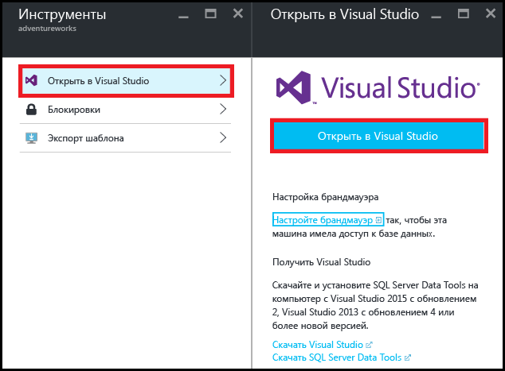
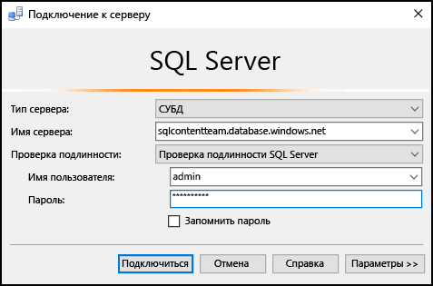
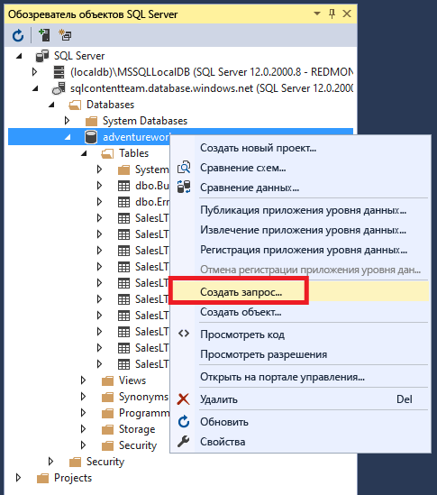
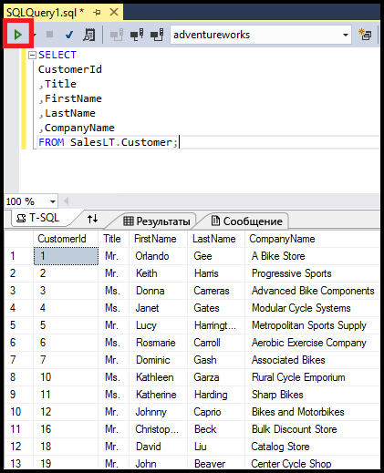

<properties
	pageTitle="Подключение к базе данных SQL с помощью запроса C# | Microsoft Azure"
	description="Написание программы на C# для отправки запроса к базе данных SQL и подключения к ней. Сведения об IP адресах, строках подключения, безопасном входе и бесплатной версии Visual Studio."
	services="sql-database"
	keywords="запрос c# к базе данных, запрос c#, подключение к базе данных, SQL C#"
	documentationCenter=""
	authors="stevestein"
	manager="jhubbard"
	editor=""/>

<tags
	ms.service="sql-database"
	ms.workload="data-management"
	ms.tgt_pltfrm="na"
	ms.devlang="dotnet"
	ms.topic="get-started-article"
	ms.date="08/17/2016"
	ms.author="stevestein"/>

# Подключение к базе данных SQL с помощью Visual Studio

> [AZURE.SELECTOR]
- [Visual Studio](sql-database-connect-query.md)
- [SSMS](sql-database-connect-query-ssms.md)
- [Excel](sql-database-connect-excel.md)

Узнайте, как подключиться к базе данных SQL Azure в Visual Studio.

## Предварительные требования

Обязательные требования для подключения к базе данных SQL с помощью Visual Studio:

- База данных SQL для подключения. В нашем примере используется пример базы данных **AdventureWorks**. Получить пример базы данных AdventureWorks можно [здесь](sql-database-get-started.md).

- Visual Studio 2013 с обновлением 4 или более поздняя версия. Майкрософт предлагает *бесплатную* версию Visual Studio Community.
 - [Загрузка Visual Studio Community](http://www.visualstudio.com/products/visual-studio-community-vs)
 - [Дополнительные варианты бесплатного использования Visual Studio](http://www.visualstudio.com/products/free-developer-offers-vs.aspx)

## Открытие Visual Studio с портала Azure

1. Войдите на [портал Azure](https://portal.azure.com/).

2. Щелкните **Другие службы** > **Базы данных SQL**.
3. Откройте колонку базы данных **AdventureWorks** и щелкните базу данных *AdventureWorks*.

6. В верхней части колонки базы данных щелкните **Инструменты**.

	

7. Щелкните **Открыть в Visual Studio** (если вам нужно установить Visual Studio, щелкните ссылку для скачивания):

	

8. Откроется Visual Studio с окном **подключения к серверу** с предустановленными параметрами для подключения к серверу и базе данных, выбранным на портале. (Щелкните **Параметры**, чтобы проверить, что вы подключаетесь к нужной базе данных.) Введите пароль администратора сервера и нажмите кнопку **Подключиться**.

	

8. Если правило брандмауэра не настроено для IP-адреса компьютера, вы получите сообщение *Не удается подключиться*. См. статью [Настройка правила брандмауэра уровня сервера базы данных SQL Azure с помощью портала Azure](sql-database-configure-firewall-settings.md).

9. После успешного подключения к базе данных откроется окно **обозревателя объектов SQL Server**.

	

## Запуск пробного запроса

Подключившись к базе данных, можно приступать к выполнению простого запроса.

2. Щелкните правой кнопкой мыши базу данных и выберите **Создать запрос**.

	

3. В окне запроса скопируйте и вставьте следующий код.

		SELECT
		CustomerId
		,Title
		,FirstName
		,LastName
		,CompanyName
		FROM SalesLT.Customer;

4. Чтобы запустить запрос, нажмите кнопку **Выполнить**.

	

## Дальнейшие действия

- Открытие баз данных SQL в Visual Studio осуществляется с помощью SQL Server Data Tools. Дополнительные сведения см. в статье [SQL Server Data Tools](https://msdn.microsoft.com/library/hh272686.aspx).
- Чтобы подключиться к базе данных SQL программно, см. статью [Подключение к базе данных SQL с помощью .NET (C#)](sql-database-develop-dotnet-simple.md).

<!---HONumber=AcomDC_0824_2016--->