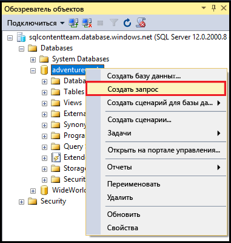
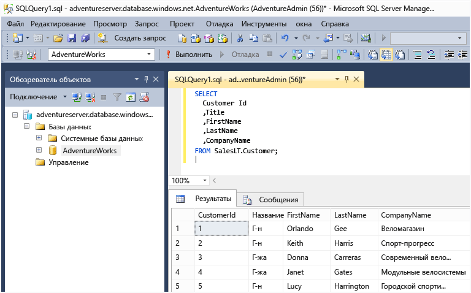

.<properties
	pageTitle="Подключение к базе данных SQL с помощью запроса C# | Microsoft Azure"
	description="Написание программы на C# для отправки запроса к базе данных SQL и подключения к ней. Сведения об IP адресах, строках подключения, безопасном входе и бесплатной версии Visual Studio."
	services="sql-database"
	keywords="запрос c# к базе данных, запрос c#, подключение к базе данных, SQL C#"
	documentationCenter=""
	authors="MightyPen"
	manager="jhubbard"
	editor=""/>

.<tags
	ms.service="sql-database"
	ms.workload="data-management"
	ms.tgt_pltfrm="na"
	ms.devlang="dotnet"
	ms.topic="get-started-article"
	ms.date="08/17/2016"
	ms.author="annemill"/>

# Подключение к базе данных SQL с помощью Visual Studio

> [AZURE.SELECTOR]
- [Visual Studio](sql-database-connect-query.md)
- [SSMS](sql-database-connect-query-ssms.md)
- [Excel](sql-database-connect-excel.md)

Узнайте, как подключиться к базе данных SQL Azure с помощью Visual Studio.

## Предварительные требования

Обязательные требования для подключения к базе данных SQL с помощью Visual Studio перечислены ниже.

- Учетная запись и подписка Azure. Вы можете зарегистрироваться, чтобы получить [бесплатную пробную версию](https://azure.microsoft.com/pricing/free-trial/).

- Демонстрационная база данных **AdventureWorksLT** в службе базы данных SQL Azure.
 - Быстрое [создание демонстрационной базы данных](sql-database-get-started.md).

- Visual Studio 2013 с обновлением 4 или более поздняя версия. Майкрософт предлагает *бесплатную* версию Visual Studio Community.
 - [Загрузка Visual Studio Community](http://www.visualstudio.com/products/visual-studio-community-vs)
 - [Дополнительные варианты бесплатного использования Visual Studio](http://www.visualstudio.com/products/free-developer-offers-vs.aspx)
 - Кроме того, [далее](#InstallVSForFree) в этом разделе описывается установка Visual Studio с помощью [портала Azure](https://portal.azure.com/).

&nbsp;

## Шаг 1. Установка бесплатной версии Visual Studio Community

Установить Visual Studio можно следующим образом.

- Установите бесплатную версию Visual Studio Community. Для этого откройте в браузере страницу с продуктами Visual Studio, на которой представлены ссылки для скачивания бесплатных и других версий.
- С помощью [портала Azure](https://portal.azure.com/) перейдите на страницу загрузки, как описано ниже.

### Установка Visual Studio с помощью портала Azure

1. Войдите на [портал Azure](https://portal.azure.com/) по адресу http://portal.azure.com/.

2. Последовательно выберите **Просмотреть все* > **Базы данных SQL****. Откроется колонка для поиска баз данных.

3. В верхней части страницы в текстовом поле фильтра начните вводить имя базы данных **AdventureWorksLT**.

4. Когда появится строка с нужной базой данных для установки на сервер, щелкните ее. Откроется колонка этой базы данных.

5. Для удобства щелкните элемент управления "Свернуть" на каждой из предыдущих колонок.

6. В верхней части колонки базы данных нажмите кнопку **Открыть в Visual Studio**. Откроется новая колонка Visual Studio с ссылками на расположения установки Visual Studio.

	![Кнопка "Открыть в Visual Studio"][20-OpenInVisualStudioButton]

7. Щелкните ссылку **Community (бесплатно)** (ссылка может отличаться). Откроется новая веб-страница.

8. Используйте ссылки на открытой веб-странице, чтобы установить Visual Studio.

9. После установки Visual Studio в колонке **Открытие в Visual Studio** нажмите кнопку **Открыть в Visual Studio**. Откроется среда Visual Studio.

10. В Visual Studio откроется диалоговое окно, в котором можно заполнить поля строки подключения.
 - Выберите пункт **Проверка подлинности SQL Server** (не **Проверка подлинности Windows**).
 - Не забудьте указать свою базу данных **AdventureWorksLT** (в диалоговом окне **Параметры** > **Свойства соединения**).

11. В **обозревателе объектов SQL Server** разверните узел своей базы данных.

## Шаг 2. Запуск образцов запросов

Установив подключение к логическому серверу, можно подключиться к базе данных и выполнить образец запроса.

1. В **обозревателе объектов** перейдите к базе данных на сервере, на доступ к которой у вас есть разрешение (скажем, к примеру базы данных **AdventureWorks**).
2. Щелкните правой кнопкой мыши базу данных и выберите **Создать запрос**.

	.

3. В окне запроса скопируйте и вставьте следующий код.

		SELECT
		CustomerId
		,Title
		,FirstName
		,LastName
		,CompanyName
		FROM SalesLT.Customer;

4. Нажмите кнопку **Выполнить**. На следующем снимке экрана показан успешный запрос.

	.

## Дальнейшие действия

[Подключение к базе данных SQL с помощью .NET (C#)](sql-database-develop-dotnet-simple.md)

.<!-- Image references. -->

[20-OpenInVisualStudioButton]: ./media/sql-database-connect-query/connqry-free-vs-e.png

<!---HONumber=AcomDC_0817_2016-->