# <a name="azure-ad-authentication-access-and-database-level-firewall-rules"></a>Аутентификация, доступ и правила брандмауэра уровня базы данных в Azure AD
Из этого руководства вы узнаете, как предоставлять доступ к серверам и базам данных SQL Azure, а также настраивать для них разрешения, применяя в SQL Server Management Studio аутентификацию Azure Active Directory, имена для входа, пользователей и роли баз данных. Вы научитесь выполнять следующие задачи:

- Просматривать разрешения пользователя в базе данных master и пользовательских базах данных.
- Создавать имена для входа и пользователей на основе проверки подлинности Azure Active Directory.
- Предоставлять пользователям разрешения на уровне сервера и базы данных.
- Входить в пользовательскую базу данных без прав администратора.
- Создавать правила брандмауэра на уровне базы данных для пользователей базы данных.
- Создавать правила брандмауэра на уровне сервера для администраторов сервера.

**Оценка времени.** Для работы с этим руководством требуется около 45 минут (при условии, что предварительные требования уже выполнены).

## <a name="prerequisites"></a>Предварительные требования

* **Учетная запись Azure.** Вам понадобится учетная запись Azure. Вы можете [создать бесплатную учетную запись Azure](https://azure.microsoft.com/free/) или [активировать преимущества для подписчиков Visual Studio](https://azure.microsoft.com/pricing/member-offers/msdn-benefits/). 

* **Разрешения на создание в Azure.** У вас должна быть возможность подключиться к порталу Azure с помощью учетной записи, которой назначена роль владельца или участника подписки. Дополнительные сведения об управлении доступом на основе ролей (RBAC) см. в статье [Начало работы с управлением доступом на портале Azure](../active-directory/role-based-access-control-what-is.md).

* **SQL Server Management Studio.** Скачать и установить последнюю версию среды SQL Server Management Studio (SSMS) можно в статье [Скачивание SQL Server Management Studio (SSMS)](https://msdn.microsoft.com/library/mt238290.aspx). При подключении к базе данных SQL Azure всегда используйте последнюю версию SSMS, так как постоянно выпускаются новые возможности.

* **Базовый сервер и базы данных.** Для установки и настройки сервера и двух баз данных, используемых в данном руководстве, нажмите кнопку **Развертывание в Azure**. При нажатии кнопки открывается колонка **Deploy from a template** (Развертывание из шаблона). Создайте группу ресурсов и предоставьте **пароль для входа администратора** для создаваемого сервера.

   [](https://portal.azure.com/#create/Microsoft.Template/uri/https%3A%2F%2Fsqldbtutorial.blob.core.windows.net%2Ftemplates%2Fsqldbgetstarted.json)

   > [!NOTE]
   > Ознакомление со связанным руководством по аутентификации SQL Server ([Руководство по базам данных SQL: аутентификация, доступ и правила брандмауэра уровня базы данных в SQL Server](sql-database-control-access-sql-authentication-get-started.md)) не является обязательным. Однако в упомянутом руководстве описаны понятия, которые здесь не повторяются. Процедуры из этого руководства, связанные с брандмауэрами уровня сервера и базы данных, не обязательно выполнять, если вы их выполнили во время работы со связанным руководством на тех же компьютерах (и с того же IP-адреса). Также при создании снимков экрана в этом руководстве предполагается, что вы ознакомились со связанным руководством. 
   >

* Вы создали и заполнили каталог Azure Active Directory. Дополнительные сведения см. в статьях [Интеграция локальных удостоверений с Azure Active Directory](../active-directory/active-directory-aadconnect.md), [Добавление имени личного домена в Azure Active Directory](../active-directory/active-directory-add-domain.md), [Microsoft Azure now supports federation with Windows Server Active Directory](https://azure.microsoft.com/blog/2012/11/28/windows-azure-now-supports-federation-with-windows-server-active-directory/) (Microsoft Azure теперь поддерживает федерацию с Windows Server Active Directory), [Управление каталогом Azure AD](https://msdn.microsoft.com/library/azure/hh967611.aspx), [Azure Active Directory Cmdlets](https://msdn.microsoft.com/library/azure/jj151815.aspx) (Командлеты для Azure Active Directory) и [Порты и протоколы, необходимые для гибридной идентификации](../active-directory/active-directory-aadconnect-ports.md).

> [!NOTE]
> Это руководство поможет вам освоить содержание следующих статей: [Контроль доступа к базе данных SQL Azure](sql-database-control-access.md), [Предоставление доступа к базе данных и управление им](sql-database-manage-logins.md), [Субъекты (компонент Database Engine)](https://msdn.microsoft.com/library/ms181127.aspx), [Роли уровня базы данных](https://msdn.microsoft.com/library/ms189121.aspx), [Обзор правил брандмауэра базы данных SQL Azure](sql-database-firewall-configure.md) и [Подключение к базе данных SQL или хранилищу данных SQL c использованием проверки подлинности Azure Active Directory](sql-database-aad-authentication.md). 
>  

## <a name="sign-in-to-the-azure-portal-using-your-azure-account"></a>Вход на портал Azure с помощью учетной записи Azure
Используя [существующую подписку](https://account.windowsazure.com/Home/Index), выполните следующие действия, чтобы подключиться к порталу Azure.

1. Откройте любой браузер и подключитесь к [порталу Azure](https://portal.azure.com/).
2. Выполните вход на [портал Azure](https://portal.azure.com/).
3. На странице **входа** введите учетные данные своей подписки.
   
   


<a name="create-logical-server-bk"></a>

## <a name="provision-an-azure-active-directory-admin-for-your-sql-logical-server"></a>Подготовка администратора Azure Active Directory для логического сервера SQL

В этом разделе руководства вы просмотрите сведения о конфигурации безопасности для логического сервера на портале Azure.

1. Откройте колонку **SQL Server** логического сервера и просмотрите сведения на странице **Обзор**. Обратите внимание, что администратор Azure Active Directory не настроен.

   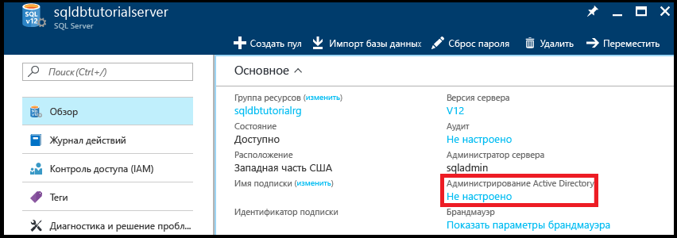

2. Щелкните **Не настроено** на панели **Основные компоненты**, чтобы открыть колонку **администратора Active Directory**.

   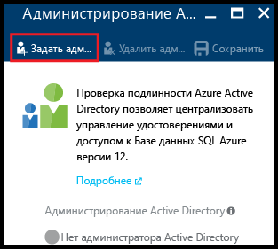

3. Щелкните **Задать администратора**, чтобы открыть колонку **Добавление администратора**, а затем выберите учетную запись пользователя или группы Active Directory в качестве администратора Active Directory для вашего сервера.

   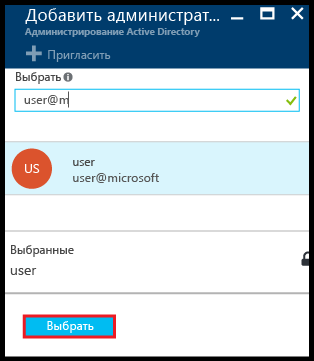

4. Нажмите кнопку **Выбрать**, а затем щелкните **Сохранить**.

   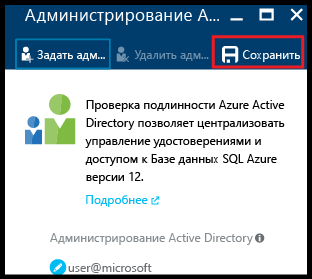

> [!NOTE]
> Сведения о подключении для этого сервера см. в статье [Создание и администрирование серверов баз данных SQL Azure с помощью портала Azure](sql-database-manage-servers-portal.md). В этой серии руководств используется полное имя сервера sqldbtutorialserver.database.windows.net.
>

## <a name="connect-to-sql-server-using-sql-server-management-studio-ssms"></a>Подключение к SQL Server с помощью SQL Server Management Studio (SSMS)

1. Сведения о том, как скачать и установить последнюю версию SSMS, см. в статье [Скачивание SQL Server Management Studio (SSMS)](https://msdn.microsoft.com/library/mt238290.aspx). Когда новая версия становится доступной для скачивания, последняя версия SSMS выдает соответствующий запрос. Это позволяет всегда пользоваться обновленным ПО.

2. После установки введите в поле поиска Windows текст **Microsoft SQL Server Management Studio** и нажмите клавишу **ВВОД**, чтобы запустить приложение SSMS.

   

3. В диалоговом окне **Подключение к серверу** выберите один из методов проверки подлинности Active Directory и укажите сведения для проверки подлинности. Сведения о выборе метода см. в статьях [Подключение к базе данных SQL или хранилищу данных SQL c использованием проверки подлинности Azure Active Directory](sql-database-aad-authentication.md) и [Поддержка SSMS в Azure AD MFA для базы данных SQL и хранилища данных SQL](sql-database-ssms-mfa-authentication.md).

   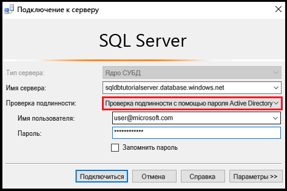

4. Введите необходимые данные, чтобы подключиться к серверу SQL Server с использованием проверки подлинности SQL Server и учетной записи администратора сервера.

5. Щелкните **Подключить**.

   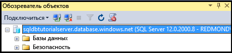

## <a name="view-the-server-admin-account-and-its-permissions"></a>Просмотр учетной записи администратора и разрешений сервера 
В этом разделе руководства вы просмотрите сведения об учетной записи и разрешениях администратора сервера в базе данных master и пользовательской базе данных.

1. В обозревателе объектов последовательно разверните элементы **Базы данных**, **Системные базы данных** и **master**, затем разверните элементы **Безопасность** и **Пользователи**. Обратите внимание, что учетная запись пользователя создана в базе данных master для администратора Active Directory. Также обратите внимание, что для учетной записи администратора Active Directory не создано имя для входа.

   

   > [!NOTE]
   > Сведения о других учетных записях, которые отображаются, см. в статье о [субъектах](https://msdn.microsoft.com/library/ms181127.aspx).
   >

2. В обозревателе объектов щелкните правой кнопкой мыши **master** и выберите пункт **Создать запрос**. Откроется окно запроса, подключенное к базе данных master.
3. В окне запроса выполните следующий запрос, чтобы получить сведения о пользователе, выполняющем запрос. Обратите внимание, что в качестве учетной записи пользователя, выполняющего этот запрос, возвращается user@microsoft.com. Позднее, когда мы запросим пользователя базы данных, результат будет другим.

   ```
   SELECT USER;
   ```

   

4. В окне запроса выполните следующий запрос, чтобы получить сведения о разрешениях администратора Active Directory. Обратите внимание, что учетная запись администратора Active Directory имеет разрешения на подключение к базе данных master, создание пользователей и имен для входа, выбор сведений из таблицы sys.sql_logins и добавление пользователей к ролям базы данных dbmanager и dbcreator. Эти разрешения дополняют разрешения, предоставленные роли public, от которой все пользователи наследуют разрешения (например, разрешения на выбор сведений из определенных таблиц). Дополнительные сведения см. в статье о [разрешениях](https://msdn.microsoft.com/library/ms191291.aspx).

   ```
   SELECT prm.permission_name
      , prm.class_desc
      , prm.state_desc
      , p2.name as 'Database role'
      , p3.name as 'Additional database role' 
   FROM sys.database_principals p
   JOIN sys.database_permissions prm
      ON p.principal_id = prm.grantee_principal_id
      LEFT JOIN sys.database_principals p2
      ON prm.major_id = p2.principal_id
      LEFT JOIN sys.database_role_members r
      ON p.principal_id = r.member_principal_id
      LEFT JOIN sys.database_principals p3
      ON r.role_principal_id = p3.principal_id
   WHERE p.name = 'user@microsoft.com';
   ```

   

6. В обозревателе объектов последовательно разверните элементы **blankdb**, **Безопасность**, а затем — элемент **Пользователи**. Обратите внимание, что в этой базе данных нет учетной записи пользователя с именем user@microsoft.com.

   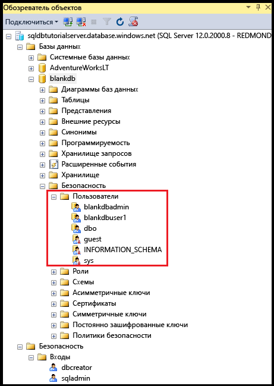

7. В обозревателе объектов щелкните правой кнопкой мыши элемент **blankdb** и выберите пункт **Создать запрос**.

8. В окне запроса выполните следующий запрос, чтобы получить сведения о пользователе, выполняющем запрос. Обратите внимание, что в качестве учетной записи пользователя, выполняющего этот запрос, возвращается dbo. По умолчанию имя для входа администратора сервера сопоставляется с учетной записью пользователя dbo в каждой базе данных.

   ```
   SELECT USER;
   ```

   

9. В окне запроса выполните следующий запрос, чтобы получить сведения о разрешениях пользователя dbo. Обратите внимание, что пользователь dbo является участником роли public и участником фиксированной роли базы данных db_owner. Дополнительные сведения см. в статье [Роли уровня базы данных](https://msdn.microsoft.com/library/ms189121.aspx).

   ```
   SELECT prm.permission_name
      , prm.class_desc
      , prm.state_desc
      , p2.name as 'Database role'
      , p3.name as 'Additional database role' 
   FROM sys.database_principals AS p
   JOIN sys.database_permissions AS prm
      ON p.principal_id = prm.grantee_principal_id
      LEFT JOIN sys.database_principals AS p2
      ON prm.major_id = p2.principal_id
      LEFT JOIN sys.database_role_members r
      ON p.principal_id = r.member_principal_id
      LEFT JOIN sys.database_principals AS p3
      ON r.role_principal_id = p3.principal_id
   WHERE p.name = 'dbo';
   ```

   

10. При необходимости повторите предыдущие три шага для пользовательской базы данных AdventureWorksLT.

## <a name="create-a-new-user-in-the-adventureworkslt-database-with-select-permissions"></a>Создание нового пользователя в базе данных AdventureWorksLT с разрешениями SELECT

В этом разделе руководства вы создадите учетную запись пользователя в базе данных AdventureWorksLT на основе имени субъекта пользователя Azure AD или отображаемого имени группы Azure AD, проверите разрешения этого пользователя в качестве участника роли public, предоставите ему разрешения SELECT и еще раз проверите разрешения этого пользователя.

> [!NOTE]
> Пользователи уровня базы данных ([автономные пользователи](https://msdn.microsoft.com/library/ff929188.aspx)) увеличивают портативность базы данных. Эта возможность рассматривается в следующих руководствах.
>

1. В обозревателе объектов щелкните правой кнопкой мыши **AdventureWorksLT** и выберите пункт **Создать запрос**. Откроется окно запроса, подключенное к базе данных AdventureWorksLT.
2. Выполните следующую инструкцию, чтобы создать учетную запись пользователя в базе данных AdventureWorksLT для пользователя в домене Microsoft aaduser1.

   ```
   CREATE USER [aaduser1@microsoft.com]
   FROM EXTERNAL PROVIDER;
   ```
   

3. В окне запроса выполните следующий запрос, чтобы получить сведения о разрешениях пользователя user1. Обратите внимание, что пользователь user1 имеет только разрешения, унаследованные от роли public.

   ```
   SELECT prm.permission_name
      , prm.class_desc
      , prm.state_desc
      , p2.name as 'Database role'
      , p3.name as 'Additional database role' 
   FROM sys.database_principals AS p
   JOIN sys.database_permissions AS prm
      ON p.principal_id = prm.grantee_principal_id
      LEFT JOIN sys.database_principals AS p2
      ON prm.major_id = p2.principal_id
      LEFT JOIN sys.database_role_members r
      ON p.principal_id = r.member_principal_id
      LEFT JOIN sys.database_principals AS p3
      ON r.role_principal_id = p3.principal_id
   WHERE p.name = 'aaduser1@microsoft.com';
   ```

   

4. Выполните следующие запросы, чтобы от имени пользователя user1 выполнить запрос к таблице в базе данных AdventureWorksLT.

   ```
   EXECUTE AS USER = 'aaduser1@microsoft.com';  
   SELECT * FROM [SalesLT].[ProductCategory];
   REVERT;
   ```

   

5. Выполните следующую инструкцию, чтобы предоставить пользователю user1 разрешения SELECT для таблицы ProductCategory в схеме SalesLT.

   ```
   GRANT SELECT ON OBJECT::[SalesLT].[ProductCategory] to [aaduser1@microsoft.com];
   ```

   

6. Выполните следующие запросы, чтобы от имени пользователя user1 выполнить запрос к таблице в базе данных AdventureWorksLT.

   ```
   EXECUTE AS USER = 'aaduser1@microsoft.com';  
   SELECT * FROM [SalesLT].[ProductCategory];
   REVERT;
   ```

   

## <a name="create-a-database-level-firewall-rule-for-adventureworkslt-database-users"></a>Создание правила брандмауэра уровня базы данных для пользователей базы данных AdventureWorksLT

> [!NOTE]
> Вам не нужно выполнять эту процедуру, если вы выполнили ее на этом же компьютере и с этого же IP-адреса во время работы со связанным руководством по аутентификации SQL Server ([Руководство по базам данных SQL: аутентификация, доступ и правила брандмауэра уровня базы данных в SQL Server](sql-database-control-access-sql-authentication-get-started.md)).
>

В этом разделе руководства вы попробуете войти на компьютер с другого IP-адреса, используя новую учетную запись пользователя, создадите правило брандмауэра уровня базы данных от имени администратора сервера, а затем успешно войдете на компьютер с использованием этого нового правила брандмауэра уровня базы данных. 

> [!NOTE]
> [Правила брандмауэра уровня базы данных](sql-database-firewall-configure.md) увеличивают портативность базы данных. Эта возможность рассматривается в последующих руководствах.
>

1. На другом компьютере, для которого еще не создано правило брандмауэра уровня сервера, откройте SQL Server Management Studio.

   > [!IMPORTANT]
   > Всегда используйте последнюю версию SSMS, которую можно скачать на странице [Скачивание SQL Server Management Studio (SSMS)](https://msdn.microsoft.com/library/mt238290.aspx). 
   >

2. В окне **Подключение к серверу** введите имя сервера и сведения для проверки подлинности, чтобы подключиться к серверу, используя проверку подлинности SQL Server с помощью учетной записи aaduser1@microsoft.com. 
    
   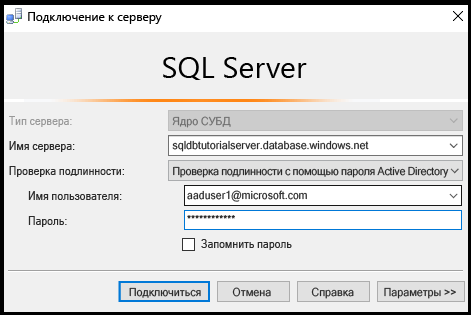

3. Щелкните **Параметры**, чтобы указать базу данных, к которой требуется подключиться, а затем введите **AdventureWorksLT** в раскрывающемся списке **Подключение к базе данных** на вкладке **Свойства подключения**.
   
   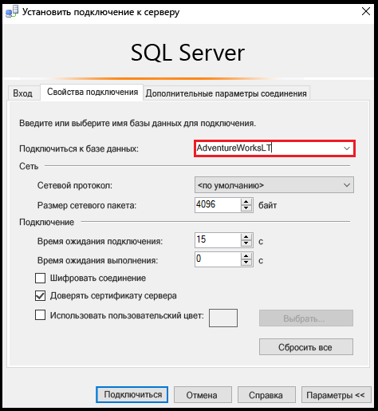

4. Щелкните **Подключить**. Откроется диалоговое окно с информацией о том, что на компьютере, с которого вы пытаетесь подключиться к базе данных SQL, нет правила брандмауэра, которое предоставляет доступ к базе данных. В зависимости от действий, которые вы ранее выполнили с брандмауэрами, появится один из двух вариантов этого окна, но обычно появляется первое окно.

   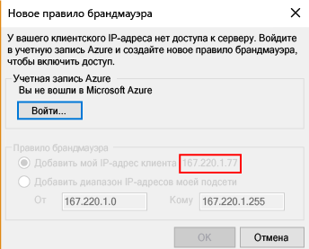

   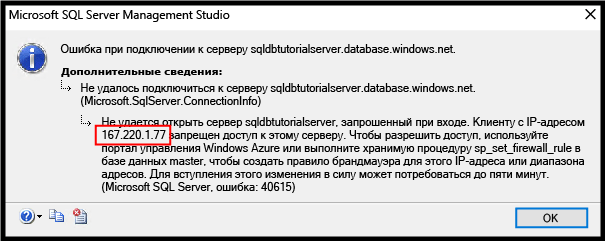

   > [!NOTE]
   > Новейшие версии SSMS включают возможность разрешать владельцам и участникам подписки входить в Microsoft Azure и создавать правило брандмауэра на уровне сервера.
   > 

4. Скопируйте IP-адрес клиента из этого диалогового окна для использования на шаге 7.
5. Нажмите кнопку **Отменить**, но не закрывайте диалоговое окно **Подключение к серверу**.
6. Переключитесь на компьютер, для которого уже создано правило брандмауэра уровня сервера, и подключитесь к серверу с помощью учетной записи администратора сервера.
7. После подключения к базе данных AdventureWorksLT от имени администратора сервера выполните следующую инструкцию в новом окне запроса, чтобы создать брандмауэр уровня базы данных. Для этого выполните процедуру [sp_set_database_firewall_rule](https://msdn.microsoft.com/library/dn270010.aspx), используя IP-адрес из шага 4:

   ```
   EXEC sp_set_database_firewall_rule @name = N'AdventureWorksLTFirewallRule', 
     @start_ip_address = 'x.x.x.x', @end_ip_address = 'x.x.x.x';
   ```

   

8. Снова вернитесь на предыдущий компьютер и нажмите кнопку **Подключиться** в диалоговом окне **Подключение к серверу**, чтобы подключиться к базе данных AdventureWorksLT как пользователь aaduser1. 

9. В обозревателе объектов разверните элементы **Базы данных**, **AdventureWorksLT** и **Таблицы**. Обратите внимание, что user1 имеет разрешение на просмотр только одной таблицы — **SalesLT.ProductCategory**. 

10. В обозревателе объектов щелкните правой кнопкой мыши **SalesLT.ProductCategory** и выберите пункт **Выбрать первые 1000 строк**.   

## <a name="next-steps"></a>Дальнейшие действия
- Общие сведения о доступе к базе данных SQL и управлении ею см. в статье [Контроль доступа к базе данных SQL Azure](sql-database-control-access.md).
- Общие сведения об именах для входа, пользователях и ролях базы данных в базе данных SQL см. в статье [Предоставление доступа к базе данных и управление им](sql-database-manage-logins.md).
- Дополнительные сведения о субъектах базы данных см. в [этой статье](https://msdn.microsoft.com/library/ms181127.aspx).
- Дополнительные сведения о ролях баз данных см. в статье [Роли уровня базы данных](https://msdn.microsoft.com/library/ms189121.aspx).
- Дополнительные сведения о правилах брандмауэра см. в статье [Обзор правил брандмауэра базы данных SQL Azure](sql-database-firewall-configure.md).


