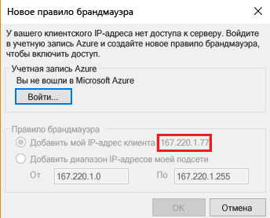
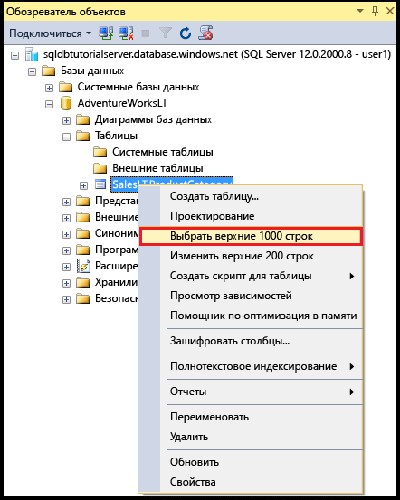
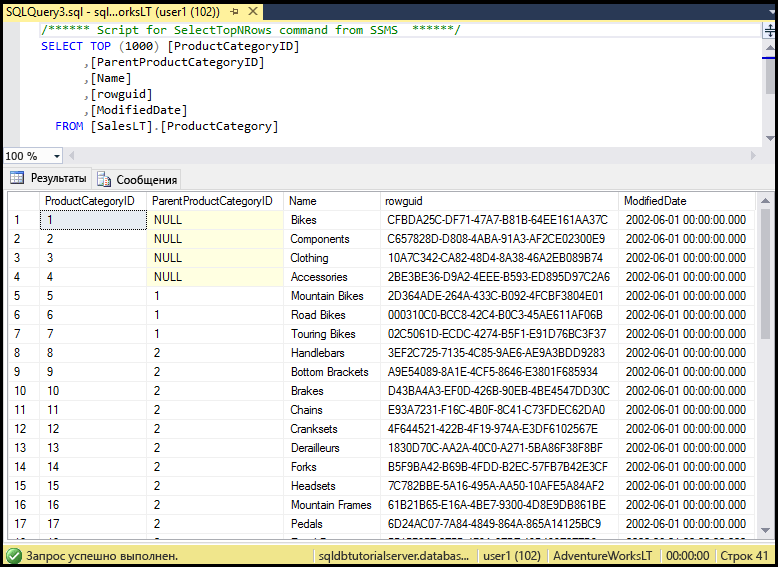

# <a name="sql-database-tutorial-sql-server-authentication-access-and-database-level-firewall-rules"></a>Руководство по базам данных SQL: аутентификация, доступ и правила брандмауэра уровня базы данных в SQL Server
Из этого руководства вы узнаете, как предоставлять доступ к серверам и базам данных SQL Azure, а также настраивать для них разрешения, используя в SQL Server Management Studio проверку подлинности SQL Server, имена для входа, пользователей и роли баз данных. Вы научитесь выполнять следующие задачи:

- Просматривать разрешения пользователя в базе данных master и пользовательских базах данных.
- Создавать имена для входа и пользователей на основе проверки подлинности SQL Server.
- Предоставлять пользователям разрешения на уровне сервера и базы данных.
- Входить в пользовательскую базу данных без прав администратора.
- Создавать правила брандмауэра на уровне базы данных для пользователей базы данных.
- Создавать правила брандмауэра на уровне сервера для администраторов сервера.

**Оценка времени.** Для работы с этим руководством требуется около 45 минут (при условии, что предварительные требования уже выполнены).

## <a name="prerequisites"></a>Предварительные требования

* Вам понадобится учетная запись Azure. Вы можете [создать бесплатную учетную запись Azure](/pricing/free-trial/?WT.mc_id=A261C142F) или [активировать преимущества для подписчиков Visual Studio](/pricing/member-offers/msdn-benefits-details/?WT.mc_id=A261C142F). 

* У вас должна быть возможность подключиться к порталу Azure с помощью учетной записи, которой назначена роль владельца или участника подписки. Дополнительные сведения об управлении доступом на основе ролей (RBAC) см. в статье [Начало работы с управлением доступом на портале Azure](../active-directory/role-based-access-control-what-is.md).

* Вы изучили руководство [по началу работы с серверами баз данных SQL Azure, базами данных и правилами брандмауэра с использованием портала Azure, SQL Server Management Studio](sql-database-get-started.md) или [PowerShell](sql-database-get-started-powershell.md). Если это не так, прежде чем продолжить, изучите руководство по предварительным требованиям или выполните скрипт PowerShell, приведенный в конце версии этого руководства для [PowerShell](sql-database-get-started-powershell.md).

> [!NOTE]
> Это руководство поможет вам освоить содержание следующих статей: [Контроль доступа к базе данных SQL Azure](sql-database-control-access.md), [Предоставление доступа к базе данных и управление им](sql-database-manage-logins.md), [Субъекты (компонент Database Engine)](https://msdn.microsoft.com/library/ms181127.aspx), [Роли уровня базы данных](https://msdn.microsoft.com/library/ms189121.aspx) и [Обзор правил брандмауэра базы данных SQL Azure](sql-database-firewall-configure.md).
>  

## <a name="sign-in-to-the-azure-portal-using-your-azure-account"></a>Вход на портал Azure с помощью учетной записи Azure
Используя [существующую подписку](https://account.windowsazure.com/Home/Index), выполните следующие действия, чтобы подключиться к порталу Azure.

1. Откройте любой браузер и подключитесь к [порталу Azure](https://portal.azure.com/).
2. Выполните вход на [портал Azure](https://portal.azure.com/).
3. На странице **входа** введите учетные данные своей подписки.
   
   


<a name="create-logical-server-bk"></a>

## <a name="view-information-about-the-security-configuration-for-your-logical-server"></a>Просмотр сведений о конфигурации безопасности для логического сервера

В этом разделе руководства вы просмотрите сведения о конфигурации безопасности для логического сервера на портале Azure.

1. Откройте колонку **SQL Server** логического сервера и просмотрите сведения на странице **Обзор**.

   

2. Запишите имя учетной записи администратора логического сервера. Если вы не помните пароль, нажмите кнопку **Сбросить пароль**, чтобы установить новый пароль.

> [!NOTE]
> Чтобы просмотреть сведения о подключении для этого сервера, см. инструкции по [просмотру и обновлению параметров сервера](sql-database-view-update-server-settings.md). В этой серии руководств используется полное имя сервера sqldbtutorialserver.database.windows.net.
>

## <a name="connect-to-sql-server-using-sql-server-management-studio-ssms"></a>Подключение к SQL Server с помощью SQL Server Management Studio (SSMS)

1. Сведения о том, как скачать и установить последнюю версию SSMS, см. в статье [Скачивание SQL Server Management Studio (SSMS)](https://msdn.microsoft.com/library/mt238290.aspx). Когда новая версия становится доступной для скачивания, последняя версия SSMS выдает соответствующий запрос. Это позволяет всегда пользоваться обновленным ПО.

2. После установки введите в поле поиска Windows текст **Microsoft SQL Server Management Studio** и нажмите клавишу **ВВОД**, чтобы запустить приложение SSMS.

   

3. В диалоговом окне **Подключение к серверу** введите данные, необходимые для подключения к серверу SQL Server с использованием проверки подлинности SQL Server и учетной записи администратора сервера.

   

4. Щелкните **Подключить**.

   

## <a name="view-the-server-admin-account-and-its-permissions"></a>Просмотр учетной записи администратора и разрешений сервера 
В этом разделе руководства вы просмотрите сведения об учетной записи и разрешениях администратора сервера в базе данных master и пользовательской базе данных.

1. В обозревателе объектов разверните элемент **Безопасность**, а затем — **Имена входа**, чтобы просмотреть существующие имена входа для сервера базы данных SQL Azure. Обратите внимание, что имя входа для учетной записи администратора указывается во время подготовки. В этой серии руководств используется имя для входа sqladmin.

   

2. В обозревателе объектов последовательно разверните элементы **Базы данных**, **Системные базы данных** и **master**, затем разверните элементы **Безопасность** и **Пользователи**. Обратите внимание, что имя учетной записи для входа администратора сервера, созданной в базе данных master, совпадает с именем для входа sqladmin (имена не должны совпадать, но это лучший способ избежать путаницы).

   

   > [!NOTE]
   > Сведения о других учетных записях, которые отображаются, см. в статье о [субъектах](https://msdn.microsoft.com/library/ms181127.aspx).
   >

3. В обозревателе объектов щелкните правой кнопкой мыши **master** и выберите пункт **Создать запрос**. Откроется окно запроса, подключенное к базе данных master.
4. В окне запроса выполните следующий запрос, чтобы получить сведения о пользователе, выполняющем запрос. Обратите внимание, что в качестве учетной записи пользователя, выполняющего этот запрос, возвращается sqladmin. Позднее, когда мы запросим пользователя базы данных, результат будет другим.

   ```
   SELECT USER;
   ```

   

5. В окне запроса выполните следующий запрос, чтобы получить сведения о разрешениях пользователя sqladmin. Обратите внимание, что учетная запись sqladmin имеет разрешения на подключение к базе данных master, создание пользователей и имен для входа, выбор сведений из таблицы sys.sql_logins и добавление пользователей к ролям базы данных dbmanager и dbcreator. Эти разрешения дополняют разрешения, предоставленные роли public, от которой все пользователи наследуют разрешения (например, разрешения на выбор сведений из определенных таблиц). Дополнительные сведения см. в статье о [разрешениях](https://msdn.microsoft.com/library/ms191291.aspx).

   ```
   SELECT prm.permission_name
      , prm.class_desc
      , prm.state_desc
      , p2.name as 'Database role'
      , p3.name as 'Additional database role' 
   FROM sys.database_principals p
   JOIN sys.database_permissions prm
      ON p.principal_id = prm.grantee_principal_id
      LEFT JOIN sys.database_principals p2
      ON prm.major_id = p2.principal_id
      LEFT JOIN sys.database_role_members r
      ON p.principal_id = r.member_principal_id
      LEFT JOIN sys.database_principals p3
      ON r.role_principal_id = p3.principal_id
   WHERE p.name = 'sqladmin';
   ```

   

6. В обозревателе объектов последовательно разверните элементы **blankdb**, **Безопасность**, а затем — элемент **Пользователи**. Обратите внимание, что в этой базе данных нет учетной записи пользователя с именем sqladmin.

   

7. В обозревателе объектов щелкните правой кнопкой мыши элемент **blankdb** и выберите пункт **Создать запрос**.

8. В окне запроса выполните следующий запрос, чтобы получить сведения о пользователе, выполняющем запрос. Обратите внимание, что в качестве учетной записи пользователя, выполняющего этот запрос, возвращается dbo. По умолчанию имя для входа администратора сервера сопоставляется с учетной записью пользователя dbo в каждой базе данных.

   ```
   SELECT USER;
   ```

   

9. В окне запроса выполните следующий запрос, чтобы получить сведения о разрешениях пользователя dbo. Обратите внимание, что пользователь dbo является участником роли public и участником фиксированной роли базы данных db_owner. Дополнительные сведения см. в статье [Роли уровня базы данных](https://msdn.microsoft.com/library/ms189121.aspx).

   ```
   SELECT prm.permission_name
      , prm.class_desc
      , prm.state_desc
      , p2.name as 'Database role'
      , p3.name as 'Additional database role' 
   FROM sys.database_principals AS p
   JOIN sys.database_permissions AS prm
      ON p.principal_id = prm.grantee_principal_id
      LEFT JOIN sys.database_principals AS p2
      ON prm.major_id = p2.principal_id
      LEFT JOIN sys.database_role_members r
      ON p.principal_id = r.member_principal_id
      LEFT JOIN sys.database_principals AS p3
      ON r.role_principal_id = p3.principal_id
   WHERE p.name = 'dbo';
   ```

   

10. При необходимости повторите предыдущие три шага для пользовательской базы данных AdventureWorksLT.

## <a name="create-a-new-user-in-the-adventureworkslt-database-with-select-permissions"></a>Создание нового пользователя в базе данных AdventureWorksLT с разрешениями SELECT

В этом разделе руководства вы создадите учетную запись пользователя в базе данных AdventureWorksLT, проверите разрешения этого пользователя в качестве участника роли public, предоставите ему разрешения SELECT и еще раз проверите разрешения этого пользователя.

> [!NOTE]
> Пользователи уровня базы данных ([автономные пользователи](https://msdn.microsoft.com/library/ff929188.aspx)) увеличивают портативность базы данных. Эта возможность рассматривается в следующих руководствах.
>

1. В обозревателе объектов щелкните правой кнопкой мыши **AdventureWorksLT** и выберите пункт **Создать запрос**. Откроется окно запроса, подключенное к базе данных AdventureWorksLT.
2. Выполните следующую инструкцию, чтобы создать пользователя с именем пользователя user1 в базе данных AdventureWorksLT.

   ```
   CREATE USER user1
   WITH PASSWORD = 'p@ssw0rd';
   ```
   

3. В окне запроса выполните следующий запрос, чтобы получить сведения о разрешениях пользователя user1. Обратите внимание, что пользователь user1 имеет только разрешения, унаследованные от роли public.

   ```
   SELECT prm.permission_name
      , prm.class_desc
      , prm.state_desc
      , p2.name as 'Database role'
      , p3.name as 'Additional database role' 
   FROM sys.database_principals AS p
   JOIN sys.database_permissions AS prm
      ON p.principal_id = prm.grantee_principal_id
      LEFT JOIN sys.database_principals AS p2
      ON prm.major_id = p2.principal_id
      LEFT JOIN sys.database_role_members r
      ON p.principal_id = r.member_principal_id
      LEFT JOIN sys.database_principals AS p3
      ON r.role_principal_id = p3.principal_id
   WHERE p.name = 'user1';
   ```

   

4. Выполните следующие запросы, чтобы от имени пользователя user1 выполнить запрос к таблице в базе данных AdventureWorksLT.

   ```
   EXECUTE AS USER = 'user1';  
   SELECT * FROM [SalesLT].[ProductCategory];
   REVERT;
   ```

   

5. Выполните следующую инструкцию, чтобы предоставить пользователю user1 разрешения SELECT для таблицы ProductCategory в схеме SalesLT.

   ```
   GRANT SELECT ON OBJECT::[SalesLT].[ProductCategory] to user1;
   ```

   

6. Выполните следующие запросы, чтобы от имени пользователя user1 выполнить запрос к таблице в базе данных AdventureWorksLT.

   ```
   EXECUTE AS USER = 'user1';  
   SELECT * FROM [SalesLT].[ProductCategory];
   REVERT;
   ```

   

## <a name="create-a-database-level-firewall-rule-for-an-adventureworkslt-database-user"></a>Создание правила брандмауэра уровня базы данных для пользователя базы данных AdventureWorksLT

В этом разделе руководства вы зарегистрируете попытки входа на компьютер с другого IP-адреса, создадите правило брандмауэра уровня базы данных от имени администратора сервера, а затем войдете на компьютер с использованием этого нового правила брандмауэра уровня базы данных. 

> [!NOTE]
> [Правила брандмауэра уровня базы данных](sql-database-firewall-configure.md) увеличивают портативность базы данных. Эта возможность рассматривается в последующих руководствах.
>

1. На другом компьютере, для которого еще не создано правило брандмауэра уровня сервера, откройте SQL Server Management Studio.

   > [!IMPORTANT]
   > Всегда используйте последнюю версию SSMS, которую можно скачать на странице [Скачивание SQL Server Management Studio (SSMS)](https://msdn.microsoft.com/library/mt238290.aspx). 
   >

2. В окне **Подключение к серверу** введите имя сервера и сведения для проверки подлинности, чтобы подключиться к серверу, используя проверку подлинности SQL Server с помощью учетной записи user1. 
    
   

3. Щелкните **Параметры**, чтобы указать базу данных, к которой требуется подключиться, а затем введите **AdventureWorksLT** в раскрывающемся списке **Подключение к базе данных** на вкладке **Свойства подключения**.
   
   

4. Щелкните **Подключить**. Откроется диалоговое окно с информацией о том, что на компьютере, с которого вы пытаетесь подключиться к базе данных SQL, нет правила брандмауэра, которое предоставляет доступ к базе данных. В зависимости от действий, которые вы ранее выполнили с брандмауэрами, появится один из двух вариантов этого окна, но обычно появляется первое окно.

   

   

   > [!NOTE]
   > Новейшие версии SSMS включают возможность разрешать владельцам и участникам подписки входить в Microsoft Azure и создавать правило брандмауэра на уровне сервера.
   > 

4. Скопируйте IP-адрес клиента из этого диалогового окна для использования на шаге 7.
5. Нажмите кнопку **Отменить**, но не закрывайте диалоговое окно **Подключение к серверу**.
6. Переключитесь на компьютер, для которого уже создано правило брандмауэра уровня сервера, и подключитесь к серверу с помощью учетной записи администратора сервера.
7. После подключения к базе данных AdventureWorksLT от имени администратора сервера выполните следующую инструкцию в новом окне запроса, чтобы создать брандмауэр уровня базы данных. Для этого выполните процедуру [sp_set_database_firewall_rule](https://msdn.microsoft.com/library/dn270010.aspx), используя IP-адрес из шага 4:

   ```
   EXEC sp_set_database_firewall_rule @name = N'AdventureWorksLTFirewallRule', 
     @start_ip_address = 'x.x.x.x', @end_ip_address = 'x.x.x.x';
   ```

   

8. Снова вернитесь на предыдущий компьютер и нажмите кнопку **Подключиться** в диалоговом окне **Подключение к серверу**, чтобы подключиться к базе данных AdventureWorksLT как пользователь user1. 

   

9. В обозревателе объектов разверните элементы **Базы данных**, **AdventureWorksLT** и **Таблицы**. Обратите внимание, что user1 имеет разрешение на просмотр только одной таблицы — **SalesLT.ProductCategory**. 

   

10. В обозревателе объектов щелкните правой кнопкой мыши **SalesLT.ProductCategory** и выберите пункт **Выбрать первые 1000 строк**.   

   

   

## <a name="create-a-new-user-in-the-blankdb-database-with-dbowner-database-role-permissions-and-a-database-level-firewall-rule"></a>Создание нового пользователя в базе данных blankdb с разрешениями роли базы данных db_owner и правила брандмауэра уровня базы данных

В этом разделе руководства вы создадите пользователя в базе данных blankdb с разрешениями роли базы данных db_owner и создадите брандмауэр уровня базы данных для этой базы данных с помощью учетной записи администратора сервера. 

1. Переключитесь на компьютер, который подключен к базе данных SQL, с помощью учетной записи администратора сервера.
2. Откройте окно запроса, подключенное к базе данных blankdb, и выполните следующую инструкцию, чтобы создать пользователя с именем blankdbadmin в базе данных blankdb.

   ```
   CREATE USER blankdbadmin
   WITH PASSWORD = 'p@ssw0rd';
   ```

3. В том же окне запроса выполните следующую инструкцию, чтобы добавить пользователя blankdbadmin к роли базы данных db_owner. Теперь этот пользователь может выполнять все действия, необходимые для управления базой данных blankdb.

   ```
   ALTER ROLE db_owner ADD MEMBER blankdbadmin; 
   ```

4. В том же окне запроса выполните следующую инструкцию, чтобы создать брандмауэр уровня базы данных. Для этого выполните процедуру [sp_set_database_firewall_rule](https://msdn.microsoft.com/library/dn270010.aspx), используя IP-адрес из шага 4 предыдущей процедуры или диапазон IP-адресов для пользователей этой базы данных.

   ```
   EXEC sp_set_database_firewall_rule @name = N'blankdbFirewallRule', 
     @start_ip_address = 'x.x.x.x', @end_ip_address = 'x.x.x.x';
   ```

5. Переключитесь на компьютер, для которого вы создали правило брандмауэра уровня базы данных, и подключитесь к базе данных blankdb с помощью учетной записи blankdbadmin.
6. Откройте окно запроса к базе данных blankdb и выполните следующую инструкцию, чтобы создать пользователя с именем blankdbuser1 в базе данных blankdb.

   ```
   CREATE USER blankdbuser1
   WITH PASSWORD = 'p@ssw0rd';
   ```
 
7. Если это необходимо для вашей среды обучения, создайте дополнительное правило брандмауэра уровня базы данных для этого пользователя. 

## <a name="create-a-new-login-and-user-in-the-master-database-with-dbmanager-permissions-and-create-a-server-level-firewall-rule"></a>Создание нового имени для входа и пользователя в базе данных master с разрешениями dbmanager и создание правила брандмауэра уровня сервера

В этом разделе руководства вы создадите имя для входа и пользователя в базе данных master с разрешениями на создание новых пользовательских баз данных и управление ими. Также вы создадите дополнительное правило брандмауэра на уровне сервера с помощью инструкции Transact-SQL [sp_set_firewall_rule](https://msdn.microsoft.com/library/dn270017.aspx).

> [!NOTE]
> Владельцу учетной записи администратора сервера необходимо создать имена для входа в базе данных master, а также учетную запись пользователя из имени для входа, чтобы делегировать разрешения на создание базы данных другому пользователю. Но создание имен для входа и пользователей из имен для входа снижает портативность среды. Последствия этого снижения, в том числе способы предупреждения и обработки в рамках планирования аварийного восстановления, рассматриваются в последующих руководствах.
>

1. Переключитесь на компьютер, который подключен к базе данных SQL, с помощью учетной записи администратора сервера.
2. Откройте окно запроса, подключенное к базе данных master, и выполните следующую инструкцию, чтобы создать пользователя с именем dbcreator в базе данных master.

   ```
   CREATE LOGIN dbcreator
   WITH PASSWORD = 'p@ssw0rd';
   ```

3. В том же окне запроса выполните следующую инструкцию: 

   ```
   CREATE USER dbcreator
   FROM LOGIN dbcreator;
   ```

3. В том же окне запроса выполните следующий запрос, чтобы добавить пользователя dbcreator к роли базы данных dbmanager. Этот пользователь теперь может создавать базы данных и управлять ими.

   ```
   ALTER ROLE dbmanager ADD MEMBER dbcreator; 
   ```

4. В том же окне запроса выполните следующий запрос для создания брандмауэра уровня сервера. Выполните процедуру [sp_set_database_firewall_rule](https://msdn.microsoft.com/library/dn270010.aspx), используя IP-адрес для своей среды:

   ```
   EXEC sp_set_firewall_rule @name = N'dbcreatorFirewallRule', 
     @start_ip_address = 'x.x.x.x', @end_ip_address = 'x.x.x.x';
   ```

5. Переключитесь на компьютер, для которого вы создали правило брандмауэра уровня сервера, и подключитесь к базе данных master с помощью учетной записи пользователя dbcreator.
6. Откройте окно запроса к базе данных master и выполните следующий запрос, чтобы создать базу данных с именем foo.

   ```
   CREATE DATABASE FOO (EDITION = 'basic');
   ```
 7. При необходимости удалите эту базу данных, чтобы сэкономить деньги, используя следующую инструкцию:

   ```
   DROP DATABASE FOO;
   ```

## <a name="complete-script"></a>Полный скрипт

Чтобы создать имена для входа и пользователей, добавить их к ролям, предоставить им разрешения, создать правила брандмауэра на уровне базы данных и создать правила брандмауэра на уровне сервера, выполните следующие инструкции в соответствующих базах данных на сервере.

### <a name="master-database"></a>База данных master
Выполните эти инструкции в базе данных master, используя учетную запись администратора сервера, добавив соответствующие IP-адреса или диапазон IP-адресов.

```
CREATE LOGIN dbcreator WITH PASSWORD = 'p@ssw0rd';
CREATE USER dbcreator FROM LOGIN dbcreator;
ALTER ROLE dbmanager ADD MEMBER dbcreator;
EXEC sp_set_firewall_rule @name = N'dbcreatorFirewallRule', 
     @start_ip_address = 'x.x.x.x', @end_ip_address = 'x.x.x.x';
```

### <a name="adventureworkslt-database"></a>База данных AdventureWorksLT
Выполните эти инструкции в базе данных AdventureWorksLT, используя учетную запись администратора сервера, добавив соответствующие IP-адреса или диапазон IP-адресов.

```
CREATE USER user1 WITH PASSWORD = 'p@ssw0rd';
GRANT SELECT ON OBJECT::[SalesLT].[ProductCategory] to user1;
EXEC sp_set_database_firewall_rule @name = N'AdventureWorksLTFirewallRule', 
     @start_ip_address = 'x.x.x.x', @end_ip_address = 'x.x.x.x';
```

### <a name="blankdb-database"></a>База данных blankdb
Выполните эти инструкции в базе данных blankdb, используя учетную запись администратора сервера, добавив соответствующие IP-адреса или диапазон IP-адресов.

```
CREATE USER blankdbadmin
   WITH PASSWORD = 'p@ssw0rd';
ALTER ROLE db_owner ADD MEMBER blankdbadmin;
EXEC sp_set_database_firewall_rule @name = N'blankdbFirewallRule', 
     @start_ip_address = 'x.x.x.x', @end_ip_address = 'x.x.x.x';
CREATE USER blankdbuser1
   WITH PASSWORD = 'p@ssw0rd';
```

## <a name="next-steps"></a>Дальнейшие действия
- Общие сведения о доступе к базе данных SQL и управлении ею см. в статье [Контроль доступа к базе данных SQL Azure](sql-database-control-access.md).
- Общие сведения об именах для входа, пользователях и ролях базы данных в базе данных SQL см. в статье [Предоставление доступа к базе данных и управление им](sql-database-manage-logins.md).
- Дополнительные сведения о субъектах базы данных см. в [этой статье](https://msdn.microsoft.com/library/ms181127.aspx).
- Дополнительные сведения о ролях баз данных см. в статье [Роли уровня базы данных](https://msdn.microsoft.com/library/ms189121.aspx).
- Дополнительные сведения о правилах брандмауэра см. в статье [Обзор правил брандмауэра базы данных SQL Azure](sql-database-firewall-configure.md).
- Сведения об использовании проверки подлинности Azure Active Directory см. в статье [Руководство по базе данных SQL: проверка подлинности AAD, имена для входа и учетные записи пользователей, роли базы данных, разрешения, правила брандмауэра на уровне сервера и правила брандмауэра на уровне базы данных](sql-database-control-access-sql-authentication-get-started.md).


<!--HONumber=Feb17_HO1-->


