# <a name="sql-server-authentication-access-and-database-level-firewall-rules"></a>аутентификация, доступ и правила брандмауэра уровня базы данных в SQL Server

Из этого учебника вы узнаете, как предоставлять доступ к серверам и базам данных SQL Azure, а также и настраивать для них разрешения, используя в SQL Server Management Studio аутентификацию SQL Server, имена для входа, пользователей и роли баз данных. Завершив работу, вы научитесь:

- Создавать имена для входа и пользователей на основе проверки подлинности SQL Server.
- назначать роли пользователям и предоставлять разрешения ролям;
- использовать T-SQL для создания правила брандмауэра уровня базы данных и уровня сервера; 
- подключаться от имени пользователя к определенной базе данных с помощью среды SSMS;
- Просматривать разрешения пользователя в базе данных master и пользовательских базах данных.

**Оценка времени.** Для работы с этим руководством требуется около 45 минут (при условии, что предварительные требования уже выполнены).

> [!NOTE]
> Это руководство поможет вам освоить содержание следующих статей: [Контроль доступа к базе данных SQL Azure](sql-database-control-access.md), [Предоставление доступа к базе данных и управление им](sql-database-manage-logins.md), [Субъекты (компонент Database Engine)](https://msdn.microsoft.com/library/ms181127.aspx), [Роли уровня базы данных](https://msdn.microsoft.com/library/ms189121.aspx) и [Обзор правил брандмауэра базы данных SQL Azure](sql-database-firewall-configure.md). Cведения об аутентификации Azure Active Directory см. в статье [Руководство по базам данных SQL: доступ с аутентификацией Azure AD и правила брандмауэра уровня базы данных](sql-database-control-access-aad-authentication-get-started.md).
>  

## <a name="prerequisites"></a>Предварительные требования

* **Учетная запись Azure.** Вам понадобится учетная запись Azure. Вы можете [создать бесплатную учетную запись Azure](https://azure.microsoft.com/free/) или [активировать преимущества для подписчиков Visual Studio](https://azure.microsoft.com/pricing/member-offers/msdn-benefits/). 

* **Разрешения на создание в Azure.** У вас должна быть возможность подключиться к порталу Azure с помощью учетной записи, которой назначена роль владельца или участника подписки. Дополнительные сведения об управлении доступом на основе ролей (RBAC) см. в статье [Начало работы с управлением доступом на портале Azure](../active-directory/role-based-access-control-what-is.md).

* **SQL Server Management Studio.** Скачать и установить последнюю версию среды SQL Server Management Studio (SSMS) можно в статье [Скачивание SQL Server Management Studio (SSMS)](https://msdn.microsoft.com/library/mt238290.aspx). При подключении к базе данных SQL Azure всегда используйте последнюю версию SSMS, так как постоянно выпускаются новые возможности.

* **Базовый сервер и базы данных**. Для установки и настройки сервера и двух баз данных, используемых в данном руководстве, нажмите кнопку **Развертывание в Azure**. При нажатии кнопки открывается колонка **Deploy from a template** (Развертывание из шаблона). Создайте группу ресурсов и предоставьте **пароль для входа администратора** для создаваемого сервера.

   [](https://portal.azure.com/#create/Microsoft.Template/uri/https%3A%2F%2Fsqldbtutorial.blob.core.windows.net%2Ftemplates%2Fsqldbgetstarted.json)


## <a name="sign-in-to-the-azure-portal-using-your-azure-account"></a>Вход на портал Azure с помощью учетной записи Azure
В этом разделе показано, как подключиться к порталу Azure с помощью учетной записи Azure](https://account.windowsazure.com/Home/Index).

1. Откройте любой браузер и подключитесь к [порталу Azure](https://portal.azure.com/).
2. Выполните вход на [портал Azure](https://portal.azure.com/).
3. На странице **входа** введите учетные данные своей подписки.
   
   


<a name="create-logical-server-bk"></a>

## <a name="view-logical-server-security-information-in-the-azure-portal"></a>Просмотр сведений о безопасности логического сервера на портале Azure

Здесь показано, как просмотреть сведения о конфигурации безопасности для логического сервера на портале Azure.

1. Откройте колонку **SQL Server** сервера и просмотрите сведения на странице **Обзор**.

   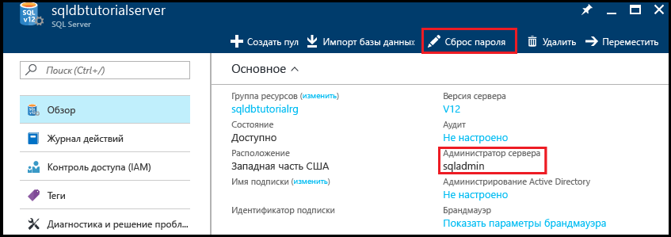

2. Запишите имя администратора логического сервера. 

3. Если вы не помните пароль, нажмите кнопку **Сбросить пароль**, чтобы установить новый пароль.

4. Если необходимо получить сведения о подключении для этого сервера, щелкните **Свойства**.

## <a name="view-server-admin-permissions-using-ssms"></a>Просмотр разрешений администратора сервера с помощью SSMS

В этом разделе показано, как просмотреть сведения об учетной записи и разрешениях администратора сервера в базе данных master и пользовательской базе данных.

1. Откройте SQL Server Management Studio и подключитесь к серверу в качестве администратора сервера, используя проверку подлинности SQL Server и учетную запись администратора сервера.

   

2. Щелкните **Подключить**.

   

3. В обозревателе объектов разверните узел **Безопасность**, а затем — **Имена для входа**, чтобы просмотреть существующие для сервера имена для входа. На новом сервере есть только имя для входа для учетной записи администратора сервера.

   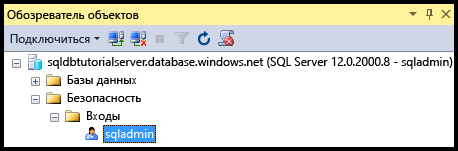

4. В обозревателе объектов разверните узлы **Базы данных**, **Системные базы данных**, **master**, **Безопасность** и **Пользователи**, чтобы просмотреть учетную запись пользователя, созданную для имени для входа администратора сервера в этой базе данных.

   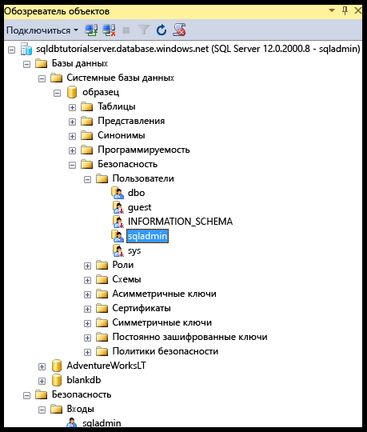

   > [!NOTE]
   > Сведения о других учетных записях, которые отображаются в узле "Пользователи", см. в статье о [субъектах](https://msdn.microsoft.com/library/ms181127.aspx).
   >

5. В обозревателе объектов щелкните правой кнопкой мыши **master** и выберите пункт **Создать запрос**. Откроется окно запроса, подключенное к базе данных master.
6. В окне запроса выполните следующий запрос, чтобы получить сведения о пользователе, выполняющем запрос. 

   ```
   SELECT USER;
   ```

   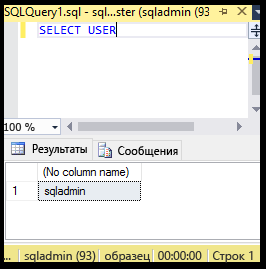

7. В окне запроса выполните следующий запрос, чтобы получить сведения о разрешениях пользователя sqladmin в базе данных **master**. 

   ```
   SELECT prm.permission_name
      , prm.class_desc
      , prm.state_desc
      , p2.name as 'Database role'
      , p3.name as 'Additional database role' 
   FROM sys.database_principals p
   JOIN sys.database_permissions prm
      ON p.principal_id = prm.grantee_principal_id
      LEFT JOIN sys.database_principals p2
      ON prm.major_id = p2.principal_id
      LEFT JOIN sys.database_role_members r
      ON p.principal_id = r.member_principal_id
      LEFT JOIN sys.database_principals p3
      ON r.role_principal_id = p3.principal_id
   WHERE p.name = 'sqladmin';
   ```

   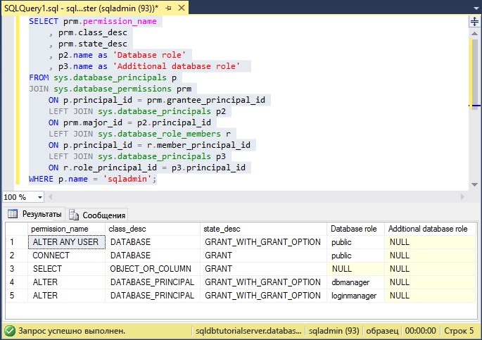

   >[!NOTE]
   > Администратор сервера имеет разрешения на подключение к базе данных master, создание пользователей и имен для входа, выбор сведений из таблицы sys.sql_logins и добавление пользователей к ролям базы данных dbmanager и dbcreator. Эти разрешения дополняют разрешения, предоставленные роли public, от которой все пользователи наследуют разрешения (например, разрешения на выбор сведений из определенных таблиц). Дополнительные сведения см. в статье о [разрешениях](https://msdn.microsoft.com/library/ms191291.aspx).
   >

8. В обозревателе объектов разверните узлы **blankdb**, **Безопасность** и **Пользователи**, чтобы просмотреть учетную запись пользователя, созданную для имени для входа администратора сервера в этой базе данных (и в каждой пользовательской базе данных).

   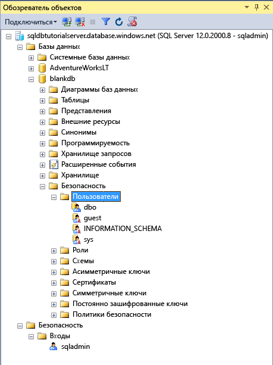

9. В обозревателе объектов щелкните правой кнопкой мыши элемент **blankdb** и выберите пункт **Создать запрос**.

10. В окне запроса выполните следующий запрос, чтобы получить сведения о пользователе, выполняющем запрос.

   ```
   SELECT USER;
   ```

   

11. В окне запроса выполните следующий запрос, чтобы получить сведения о разрешениях пользователя dbo. 

   ```
   SELECT prm.permission_name
      , prm.class_desc
      , prm.state_desc
      , p2.name as 'Database role'
      , p3.name as 'Additional database role' 
   FROM sys.database_principals AS p
   JOIN sys.database_permissions AS prm
      ON p.principal_id = prm.grantee_principal_id
      LEFT JOIN sys.database_principals AS p2
      ON prm.major_id = p2.principal_id
      LEFT JOIN sys.database_role_members r
      ON p.principal_id = r.member_principal_id
      LEFT JOIN sys.database_principals AS p3
      ON r.role_principal_id = p3.principal_id
   WHERE p.name = 'dbo';
   ```

   

   > [!NOTE]
   > Пользователь dbo является участником роли public и участником фиксированной роли базы данных db_owner. Дополнительные сведения см. в статье [Роли уровня базы данных](https://msdn.microsoft.com/library/ms189121.aspx).
   >

## <a name="create-a-new-user-with-select-permissions"></a>Создание нового пользователя с разрешениями SELECT

В этом разделе показано, как создать пользователя уровня базы данных, протестировать разрешения по умолчанию нового пользователя (через роль public), предоставить пользователю разрешения **SELECT** и просмотреть эти измененные разрешения.

> [!NOTE]
> Пользователи уровня базы данных также называются [автономными пользователями](https://msdn.microsoft.com/library/ff929188.aspx) и повышают переносимость базы данных. Дополнительные сведения о преимуществах переносимости см. в статье [Настройка безопасности Базы данных SQL Azure и управление ею для геовосстановления или отработки отказа](sql-database-geo-replication-security-config.md).
>

1. В обозревателе объектов щелкните правой кнопкой мыши элемент **sqldbtutorialdb** и выберите пункт **Создать запрос**.
2. Выполните следующую инструкцию в этом окне запроса, чтобы создать пользователя с именем пользователя **user1** в базе данных sqldbtutorialdb.

   ```
   CREATE USER user1
   WITH PASSWORD = 'p@ssw0rd';
   ```
   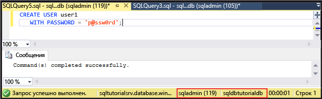

3. В окне запроса выполните следующий запрос, чтобы получить сведения о разрешениях пользователя user1.

   ```
   SELECT prm.permission_name
      , prm.class_desc
      , prm.state_desc
      , p2.name as 'Database role'
      , p3.name as 'Additional database role' 
   FROM sys.database_principals AS p
   JOIN sys.database_permissions AS prm
      ON p.principal_id = prm.grantee_principal_id
      LEFT JOIN sys.database_principals AS p2
      ON prm.major_id = p2.principal_id
      LEFT JOIN sys.database_role_members r
      ON p.principal_id = r.member_principal_id
      LEFT JOIN sys.database_principals AS p3
      ON r.role_principal_id = p3.principal_id
   WHERE p.name = 'user1';
   ```

   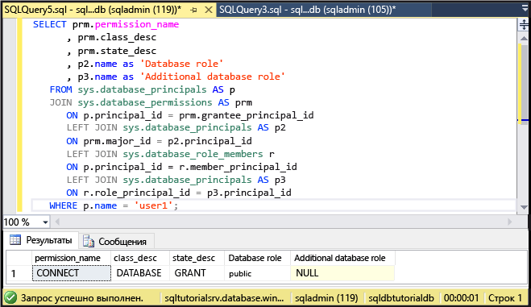

   > [!NOTE]
   > Новый пользователь в базе данных имеет только разрешения, унаследованные от роли public.
   >

4. Выполните следующие запросы с помощью инструкции **EXECUTE AS USER**, чтобы отправить запрос к таблице SalesLT.ProductCategory в базе данных sqldbtutorialdb от имени пользователя **user1** с разрешениями, унаследованными от роли public.

   ```
   EXECUTE AS USER = 'user1';  
   SELECT * FROM [SalesLT].[ProductCategory];
   REVERT;
   ```

   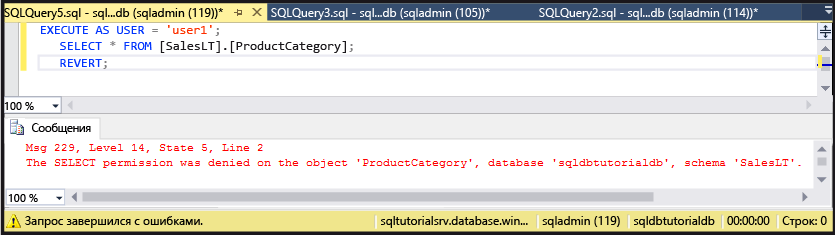

   > [!NOTE]
   > По умолчанию роль public не предоставляет разрешения **SELECT** на объекты пользователя.
   >

5. Выполните следующую инструкцию, чтобы предоставить пользователю **user1** разрешения **SELECT** для таблицы SalesLT.ProductCategory.

   ```
   GRANT SELECT ON OBJECT::[SalesLT].[ProductCategory] to user1;
   ```

   

6. Выполните следующие запросы, чтобы отправить запрос к таблице SalesLT.ProductCategory в базе данных sqldbtutorialdb от имени пользователя **user1**.

   ```
   EXECUTE AS USER = 'user1';  
   SELECT * FROM [SalesLT].[ProductCategory];
   REVERT;
   ```

   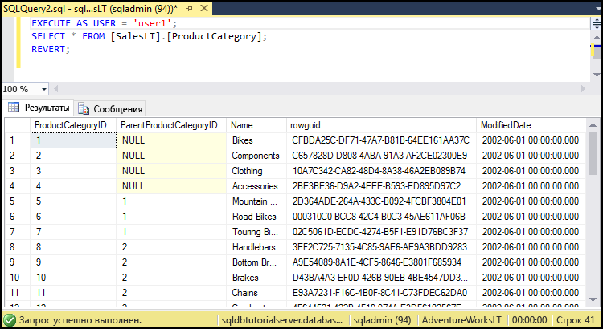

## <a name="create-a-database-level-firewall-rule-using-t-sql"></a>Создание правила брандмауэра уровня базы данных с помощью T-SQL

В этом разделе показано, как создать правило брандмауэра уровня базы данных с помощью системной хранимой процедуры [sp_set_database_firewall_rule](https://msdn.microsoft.com/library/dn270010.aspx). Правило брандмауэра уровня базы данных позволяет администратору сервера разрешить пользователям доступ только к конкретным базам данных через брандмауэр базы данных SQL Azure.

> [!NOTE]
> [Правила брандмауэра уровня базы данных](sql-database-firewall-configure.md) повышают переносимость базы данных. Дополнительные сведения о преимуществах переносимости см. в статье [Настройка безопасности Базы данных SQL Azure и управление ею для геовосстановления или отработки отказа](sql-database-geo-replication-security-config.md).
>

> [!IMPORTANT]
> Чтобы протестировать правило брандмауэра уровня базы данных, подключитесь с другого компьютера (или удалите правило брандмауэра уровня сервера на портале Azure).
>

1. На компьютере, для которого еще не создано правило брандмауэра уровня сервера, откройте SQL Server Management Studio.

2. В окне **Подключение к серверу** введите имя сервера и сведения для проверки подлинности, чтобы подключиться к серверу, используя проверку подлинности SQL Server с помощью учетной записи **user1**. 
    
   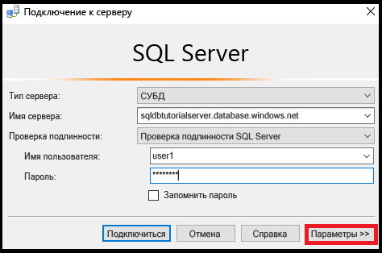

3. Щелкните **Параметры**, чтобы указать базу данных, к которой требуется подключиться, а затем введите **sqldbtutorialdb** в раскрывающемся списке **Подключение к базе данных** на вкладке **Свойства подключения**.
   
   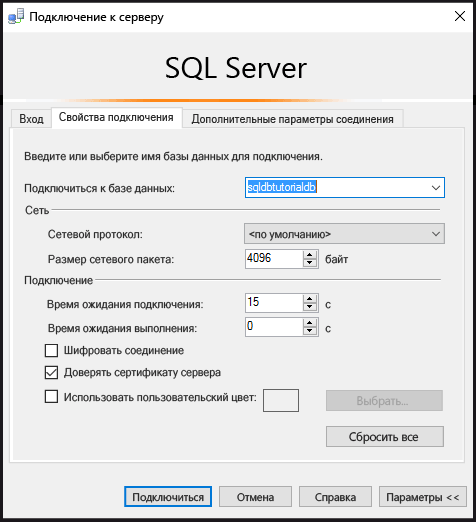

4. Щелкните **Подключить**. 

   Откроется диалоговое окно с информацией о том, что на компьютере, с которого вы пытаетесь подключиться к базе данных SQL, нет правила брандмауэра, которое предоставляет доступ к базе данных. 

   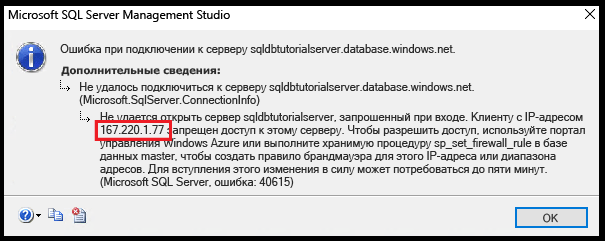


5. Скопируйте IP-адрес клиента из этого диалогового окна для использования на шаге 8.
6. Нажмите кнопку **ОК**, чтобы закрыть диалоговое окно ошибки, но не закрывайте диалоговое окно **Подключение к серверу**.
7. Переключитесь на компьютер, для которого уже создано правило брандмауэра уровня сервера. 
8. Подключитесь к базе данных sqldbtutorialdb в SSMS с помощью учетной записи администратора сервера и выполните следующую инструкцию для создания правила брандмауэра уровня базы данных с использованием IP-адреса (или диапазона адресов), указанного на шаге 5.  

   ```
   EXEC sp_set_database_firewall_rule @name = N'sqldbtutorialdbFirewallRule', 
     @start_ip_address = 'x.x.x.x', @end_ip_address = 'x.x.x.x';
   ```

   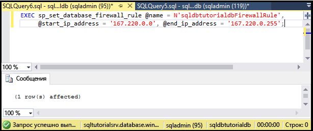

9. Снова вернитесь на предыдущий компьютер и нажмите кнопку **Подключиться** в диалоговом окне **Подключение к серверу**, чтобы подключиться к базе данных sqldbtutorialdb как пользователь user1. 

   > [!NOTE]
   > Созданное правило брандмауэра уровня базы данных станет активным примерно через 5 минут.
   >

10. Когда будет установлено подключение, разверните узел **Базы данных** в обозревателе объектов. Обратите внимание, что **user1** может просматривать только базу данных **sqldbtutorialdb**.

   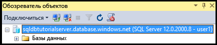

11. Разверните **sqldbtutorialdb**, а затем — **Таблицы**. Обратите внимание, что user1 имеет разрешение на просмотр только одной таблицы — **SalesLT.ProductCategory**. 

   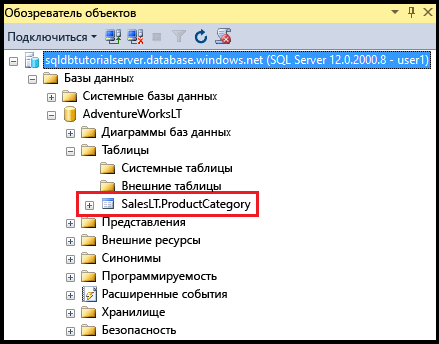

## <a name="create-a-new-user-as-dbowner-and-a-database-level-firewall-rule"></a>Создание нового пользователя с ролью db_owner и правила брандмауэра уровня базы данных

Здесь показано, как создать пользователя в другой базе данных с разрешениями роли базы данных db_owner и создать брандмауэр уровня базы данных для этой базы данных. Этот новый пользователь, участник роли **db_owner**, сможет подключаться и администрировать только одну базу данных.

1. Переключитесь на компьютер, который подключен к базе данных SQL, с помощью учетной записи администратора сервера.
2. Откройте окно запроса, подключенное к базе данных **blankdb**, и выполните следующую инструкцию, чтобы создать пользователя с именем blankdbadmin в базе данных blankdb.

   ```
   CREATE USER blankdbadmin
   WITH PASSWORD = 'p@ssw0rd';
   ```

3. В том же окне запроса выполните следующую инструкцию, чтобы добавить пользователя blankdbadmin к роли базы данных db_owner. Теперь этот пользователь может выполнять все действия, необходимые для управления базой данных blankdb.

   ```
   ALTER ROLE db_owner ADD MEMBER blankdbadmin; 
   ```

4. В том же окне запроса выполните следующую инструкцию, чтобы создать брандмауэр уровня базы данных. Для этого выполните процедуру [sp_set_database_firewall_rule](https://msdn.microsoft.com/library/dn270010.aspx), используя IP-адрес из шага 4 предыдущей процедуры или диапазон IP-адресов для пользователей этой базы данных.

   ```
   EXEC sp_set_database_firewall_rule @name = N'blankdbFirewallRule', 
     @start_ip_address = 'x.x.x.x', @end_ip_address = 'x.x.x.x';
   ```

5. Переключитесь на компьютер, для которого вы создали правило брандмауэра уровня базы данных, и подключитесь к базе данных blankdb с помощью учетной записи blankdbadmin.
6. Откройте окно запроса к базе данных blankdb и выполните следующую инструкцию, чтобы создать пользователя с именем blankdbuser1 в базе данных blankdb.

   ```
   CREATE USER blankdbuser1
   WITH PASSWORD = 'p@ssw0rd';
   ```
 
7. Если это необходимо для вашей среды обучения, создайте дополнительное правило брандмауэра уровня базы данных для этого пользователя. Тем не менее если вы создали правило брандмауэра уровня базы данных с использованием диапазона IP-адресов, это может не потребоваться.

## <a name="grant-dbmanager-permissions-and-create-a-server-level-firewall-rule"></a>Предоставление разрешений dbmanager и создание правила брандмауэра уровня сервера

В этом разделе показано, как создать имя для входа и пользователя в базе данных master с разрешениями на создание новых пользовательских баз данных и управление ими. Вы также узнаете, как создать дополнительное правило брандмауэра уровня сервера с помощью инструкции Transact-SQL и процедуры [sp_set_firewall_rule](https://msdn.microsoft.com/library/dn270017.aspx). 

> [!IMPORTANT]
>Первое правило брандмауэра уровня сервера всегда нужно создавать в Azure (на портале Azure, с помощью PowerShell или REST API).
>

> [!IMPORTANT]
> Администратору сервера необходимо создать имена для входа в базе данных master, а также учетную запись пользователя из имени для входа, чтобы делегировать разрешения на создание базы данных другому пользователю. Тем не менее создание имен для входа с последующим созданием из них пользователей снижает переносимость среды.
>

1. Переключитесь на компьютер, который подключен к базе данных SQL, с помощью учетной записи администратора сервера.
2. Откройте окно запроса, подключенное к базе данных master, и выполните следующую инструкцию, чтобы создать пользователя с именем dbcreator в базе данных master.

   ```
   CREATE LOGIN dbcreator
   WITH PASSWORD = 'p@ssw0rd';
   ```

3. В том же окне запроса выполните следующую инструкцию: 

   ```
   CREATE USER dbcreator
   FROM LOGIN dbcreator;
   ```

3. В том же окне запроса выполните следующий запрос, чтобы добавить пользователя dbcreator к роли базы данных dbmanager. Этот пользователь теперь может создавать базы данных и управлять ими.

   ```
   ALTER ROLE dbmanager ADD MEMBER dbcreator; 
   ```

4. В том же окне запроса выполните следующий запрос для создания брандмауэра уровня сервера. Выполните процедуру [sp_set_firewall_rule](https://msdn.microsoft.com/library/dn270017.aspx), используя IP-адрес для своей среды:

   ```
   EXEC sp_set_firewall_rule @name = N'dbcreatorFirewallRule', 
     @start_ip_address = 'x.x.x.x', @end_ip_address = 'x.x.x.x';
   ```

5. Переключитесь на компьютер, для которого вы создали правило брандмауэра уровня сервера, и подключитесь к базе данных master с помощью учетной записи пользователя dbcreator.
6. Откройте окно запроса к базе данных master и выполните следующий запрос, чтобы создать базу данных с именем foo.

   ```
   CREATE DATABASE FOO (EDITION = 'basic');
   ```
 7. При необходимости удалите эту базу данных, чтобы сэкономить деньги, используя следующую инструкцию:

   ```
   DROP DATABASE FOO;
   ```

## <a name="complete-script"></a>Полный скрипт

Чтобы создать имена для входа и пользователей, добавить их к ролям, предоставить им разрешения, создать правила брандмауэра на уровне базы данных и создать правила брандмауэра на уровне сервера, выполните следующие инструкции в соответствующих базах данных на сервере.

### <a name="master-database"></a>База данных master
Выполните эти инструкции в базе данных master, используя учетную запись администратора сервера, добавив соответствующие IP-адреса или диапазон IP-адресов.

```
CREATE LOGIN dbcreator WITH PASSWORD = 'p@ssw0rd';
CREATE USER dbcreator FROM LOGIN dbcreator;
ALTER ROLE dbmanager ADD MEMBER dbcreator;
EXEC sp_set_firewall_rule @name = N'dbcreatorFirewallRule', 
     @start_ip_address = 'x.x.x.x', @end_ip_address = 'x.x.x.x';
```

### <a name="sqldbtutorialdb-database"></a>база данных sqldbtutorialdb
Выполните эти инструкции в базе данных sqldbtutorialdb, используя учетную запись администратора сервера, добавив соответствующие IP-адреса или диапазон IP-адресов.

```
CREATE USER user1 WITH PASSWORD = 'p@ssw0rd';
GRANT SELECT ON OBJECT::[SalesLT].[ProductCategory] to user1;
EXEC sp_set_database_firewall_rule @name = N'sqldbtutorialdbFirewallRule', 
     @start_ip_address = 'x.x.x.x', @end_ip_address = 'x.x.x.x';
```

### <a name="blankdb-database"></a>База данных blankdb
Выполните эти инструкции в базе данных blankdb, используя учетную запись администратора сервера, добавив соответствующие IP-адреса или диапазон IP-адресов.

```
CREATE USER blankdbadmin
   WITH PASSWORD = 'p@ssw0rd';
ALTER ROLE db_owner ADD MEMBER blankdbadmin;
EXEC sp_set_database_firewall_rule @name = N'blankdbFirewallRule', 
     @start_ip_address = 'x.x.x.x', @end_ip_address = 'x.x.x.x';
CREATE USER blankdbuser1
   WITH PASSWORD = 'p@ssw0rd';
```

## <a name="next-steps"></a>Дальнейшие действия
- Общие сведения о доступе к базе данных SQL и управлении ею см. в статье [Контроль доступа к базе данных SQL Azure](sql-database-control-access.md).
- Общие сведения об именах для входа, пользователях и ролях базы данных в базе данных SQL см. в статье [Предоставление доступа к базе данных и управление им](sql-database-manage-logins.md).
- Дополнительные сведения о субъектах базы данных см. в [этой статье](https://msdn.microsoft.com/library/ms181127.aspx).
- Дополнительные сведения о ролях баз данных см. в статье [Роли уровня базы данных](https://msdn.microsoft.com/library/ms189121.aspx).
- Дополнительные сведения о правилах брандмауэра см. в статье [Обзор правил брандмауэра базы данных SQL Azure](sql-database-firewall-configure.md).
- Сведения об использовании аутентификации Azure Active Directory см. в статье [Руководство по базам данных SQL: доступ с аутентификацией Azure AD и правила брандмауэра уровня базы данных](sql-database-control-access-aad-authentication-get-started.md).


