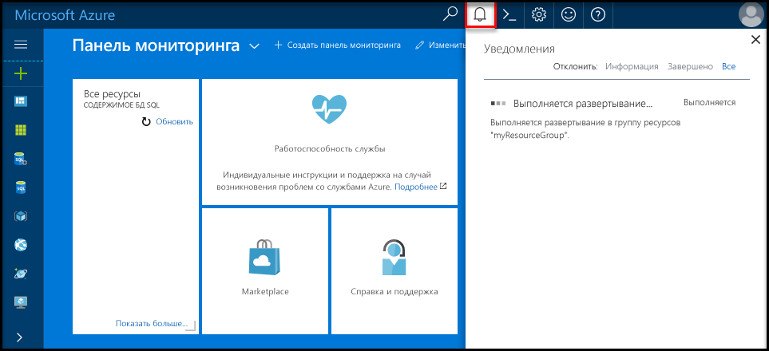
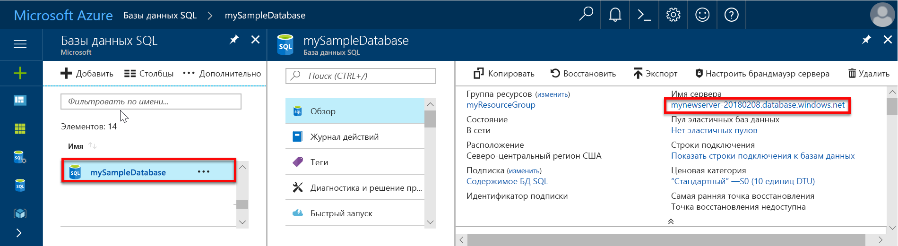
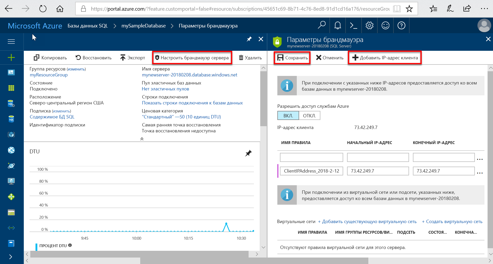
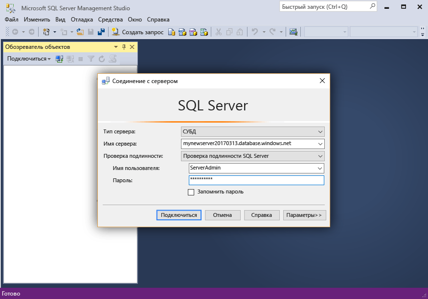
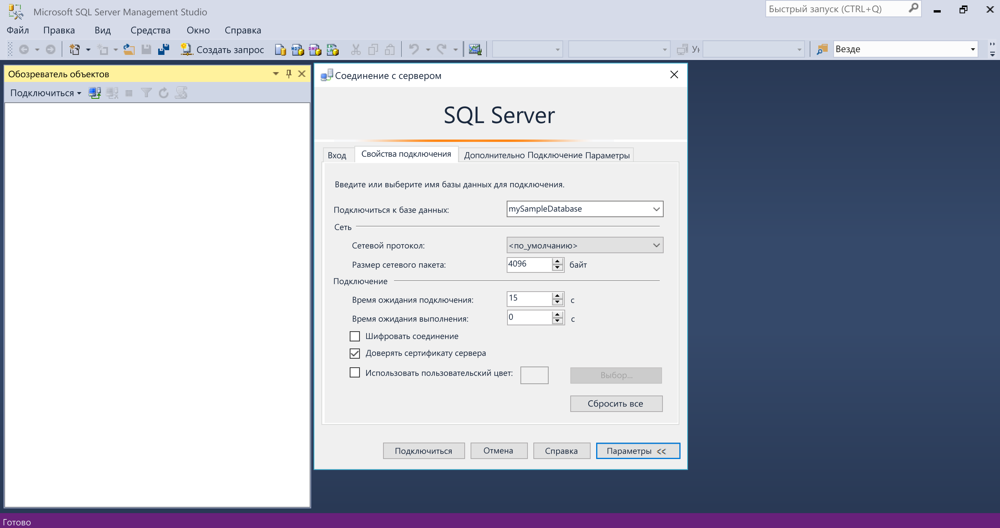
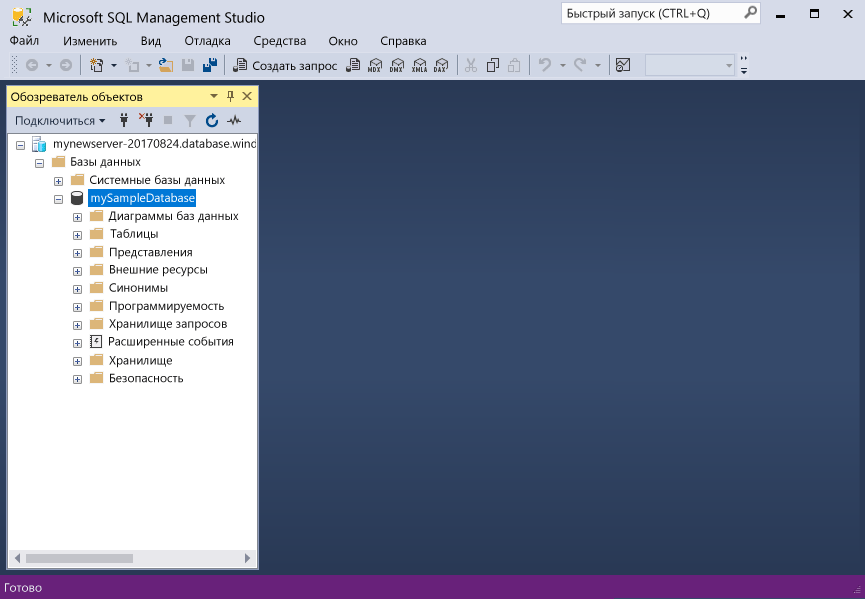

# <a name="design-your-first-azure-sql-database-using-ssms"></a>Разработка первой базы данных SQL Azure с использованием SSMS

База данных SQL Azure — это реляционная база данных как услуга (DBaaS) в Microsoft Cloud (Azure). В рамках этого руководства вы узнаете, как с помощью портала Azure и [SQL Server Management Studio](https://msdn.microsoft.com/library/ms174173.aspx) выполнять такие действия: 

> [!div class="checklist"]
> * создать базу данных на портале Azure;
> * настроить правило брандмауэра на уровне сервера на портале Azure;
> * Подключение к базе данных с помощью SQL Server Management Studio.
> * создать таблицы с помощью SSMS;
> * выполнить массовую загрузку данных с помощью BCP;
> * запросить эти данные с помощью SSMS;
> * восстановить базу данных до предыдущего [восстановления до точки во времени](sql-database-recovery-using-backups.md#point-in-time-restore) на портале Azure.

Если у вас еще нет подписки Azure, [создайте бесплатную учетную запись Azure](https://azure.microsoft.com/free/), прежде чем начинать работу.

## <a name="prerequisites"></a>предварительным требованиям

Для работы с этим руководством вам потребуются:
- Последняя версия [SQL Server Management Studio](https://msdn.microsoft.com/library/ms174173.aspx) (SSMS).
- Последняя версия [BCP и SQLCMD](https://www.microsoft.com/download/details.aspx?id=36433).

## <a name="log-in-to-the-azure-portal"></a>Войдите на портал Azure.

Войдите на [портал Azure](https://portal.azure.com/).

## <a name="create-a-blank-sql-database"></a>Создание пустой базы данных SQL

База данных Azure SQL создается с определенным набором [вычислительных ресурсов и ресурсов хранения](sql-database-service-tiers.md). База данных создается в пределах [группы ресурсов Azure](../azure-resource-manager/resource-group-overview.md) и [логического сервера базы данных SQL Azure](sql-database-features.md). 

Чтобы создать пустую базу данных SQL, выполните приведенные ниже действия. 

1. Щелкните **Создать ресурс** в верхнем левом углу окна портала Azure.

2. Выберите **Базы данных** на странице **Создание** и щелкните **Создать** в разделе **База данных SQL** на странице **Создание**.

   

3. Заполните форму базы данных SQL, указав следующую информацию, как показано на предыдущем рисунке.   

   | Параметр       | Рекомендуемое значение | ОПИСАНИЕ | 
   | ------------ | ------------------ | ------------------------------------------------- | 
   | **Database name** (Имя базы данных) | mySampleDatabase | Допустимые имена баз данных см. в статье об [идентификаторах базы данных](https://docs.microsoft.com/sql/relational-databases/databases/database-identifiers). | 
   | **Подписка** | Ваша подписка  | Дополнительные сведения о подписках см. [здесь](https://account.windowsazure.com/Subscriptions). |
   | **Группа ресурсов** | myResourceGroup | Допустимые имена групп ресурсов см. в статье о [правилах и ограничениях именования](https://docs.microsoft.com/azure/architecture/best-practices/naming-conventions). |
   | **Выбрать источник** | Пустая база данных | Указывает, что должна быть создана пустая база данных. |

4. Щелкните **Сервер**, чтобы создать и настроить новый сервер для новой базы данных. Заполните форму для **создания сервера**, указав следующую информацию. 

   | Параметр       | Рекомендуемое значение | ОПИСАНИЕ | 
   | ------------ | ------------------ | ------------------------------------------------- | 
   | **Server name** (Имя сервера) | Любое глобально уникальное имя | Допустимые имена серверов см. в статье о [правилах и ограничениях именования](https://docs.microsoft.com/azure/architecture/best-practices/naming-conventions). | 
   | **Имя для входа администратора сервера** | Любое допустимое имя | Допустимые имена входа см. в статье об [идентификаторах базы данных](https://docs.microsoft.com/sql/relational-databases/databases/database-identifiers).|
   | **Пароль** | Любой допустимый пароль | Длина пароля должна составлять минимум 8 символов. Пароль должен содержать символы трех категорий из перечисленных: прописные буквы, строчные буквы, цифры и специальные символы. |
   | **Местоположение.** | Любое допустимое расположение | Дополнительные сведения о регионах Azure см. [здесь](https://azure.microsoft.com/regions/). |

   

5. Нажмите кнопку **Выбрать**.

6. Щелкните **Ценовая категория**, чтобы указать уровень службы, число DTU или виртуальных ядер и объем хранилища. Изучите доступные ресурсы для каждого уровня служб (число DTU или виртуальных ядер и объем хранилища). 

7. Для работы с этим руководством выберите уровень служб **Стандартный**, а затем с помощью ползунка выберите **100 DTU (S3)** и **400** ГБ хранилища.

   

8. Примите условия использования предварительной версии, чтобы использовать **дополнительное хранилище**. 

   > [!IMPORTANT]
   > \* Размеры хранилища, превышающие включенный объем, доступны в предварительной версии. За их использование взимается дополнительная плата. Подробнее об этом можно узнать в статье [Стоимость использования Базы данных SQL](https://azure.microsoft.com/pricing/details/sql-database/). 
   >
   >\* На уровне "Премиум" хранилище объемом свыше 1 ТБ сейчас доступно в следующих регионах: Виргиния (для обслуживания государственных организаций США), восточная Австралия, восточная Канада, восточная часть США 2, восточная Япония, Западная Европа, западная часть Соединенного Королевства, западная часть США, западная Япония, Республика Корея, Северная Европа, северо-центральный регион США, центральная Германия, центральная Канада, центральная Франция, центральная часть США, центральный регион, юго-восточная Австралия, Юго-Восточная Азия, юго-центральный регион США, южная Бразилия и южная часть Соединенного Королевства. См. [текущие ограничения для баз данных P11–P15](sql-database-dtu-resource-limits.md#single-database-limitations-of-p11-and-p15-when-the-maximum-size-greater-than-1-tb).  
   > 

9. Выбрав уровень сервера, число DTU и объем хранилища, нажмите кнопку **Применить**.  

10. Укажите **параметры сортировки** для пустой базы данных. В этом руководстве используйте значение по умолчанию. Дополнительные сведения о параметрах сортировки см. в [этой статье](https://docs.microsoft.com/sql/t-sql/statements/collations).

11. Заполнив форму базы данных SQL, нажмите кнопку **Создать**, чтобы подготовить базу данных. Подготовка занимает несколько минут. 

12. На панели инструментов щелкните **Уведомления**, чтобы отслеживать процесс развертывания.
    
     

## <a name="create-a-server-level-firewall-rule"></a>создадим правило брандмауэра на уровне сервера;

Служба базы данных SQL создает брандмауэр уровня сервера, который не позволяет внешним приложениям и средствам подключаться к серверу или любой базе данных на сервере, если не создано правило брандмауэра, открывающее брандмауэр для определенных IP-адресов. Выполните следующие действия, чтобы создать [правило брандмауэра уровня сервера базы данных SQL](sql-database-firewall-configure.md) для IP-адреса вашего клиента и разрешить внешнее подключение через брандмауэр базы данных SQL только с вашего IP-адреса. 

> [!NOTE]
> База данных SQL обменивается данными через порт 1433. Если вы пытаетесь подключиться из корпоративной сети, исходящий трафик через порт 1433 может быть запрещен сетевым брандмауэром. В таком случае вы не сможете подключиться к серверу базы данных SQL Azure, пока ваш ИТ-отдел не откроет порт 1433.
>

1. По завершении развертывания щелкните раздел **Базы данных SQL** в меню слева и выберите **mySampleDatabase** на странице **баз данных SQL**. После этого откроется страница обзора базы данных, где будет указано полное имя сервера (например, **mynewserver-20170824.database.windows.net**) и предоставлены параметры для дальнейшей настройки. 

2. Скопируйте полное имя сервера. Оно понадобится вам при работе с последующими краткими руководствами для подключения к серверу и связанным базам данных. 

    

3. Щелкните **Настройка брандмауэра для сервера** на панели инструментов. Откроется страница **параметров брандмауэра** для сервера базы данных SQL. 

    

4. На панели инструментов щелкните **Добавить IP-адрес клиента**, чтобы добавить текущий IP-адрес в новое правило брандмауэра. С использованием правила брандмауэра можно открыть порт 1433 для одного IP-адреса или диапазона IP-адресов.

5. Выберите команду **Сохранить**. Для текущего IP-адреса будет создано правило брандмауэра уровня сервера, с помощью которого можно открыть порт 1433 логического сервера.

6. Нажмите кнопку **ОК**, а затем закройте страницу **Параметры брандмауэра**.

Теперь можно подключиться с этого IP-адреса к серверу базы данных SQL и его базам данных с помощью SQL Server Management Studio или другого средства по своему усмотрению, используя учетную запись администратора сервера, созданную ранее.

> [!IMPORTANT]
> По умолчанию доступ через брандмауэр базы данных SQL включен для всех служб Azure. На этой странице щелкните **Откл.**, чтобы отключить доступ для всех служб Azure.

## <a name="sql-server-connection-information"></a>Сведения о подключении SQL Server

Получите полное имя сервера для сервера базы данных SQL Azure на портале Azure. Используйте полное имя сервера, чтобы подключиться к серверу с помощью SQL Server Management Studio.

1. Войдите на [портал Azure](https://portal.azure.com/).
2. В меню слева выберите **Базы данных SQL** и на странице **Базы данных SQL** щелкните имя своей базы данных. 
3. На странице портала Azure вашей базы данных в области **Основные компоненты** найдите и скопируйте **имя сервера**.

   

## <a name="connect-to-the-database-with-ssms"></a>Подключение к базе данных с помощью SQL Server Management Studio.

Используйте [SQL Server Management Studio](https://docs.microsoft.com/sql/ssms/sql-server-management-studio-ssms) для подключения к серверу базы данных SQL Azure.

1. Откройте среду SQL Server Management Studio.

2. В диалоговом окне **Подключение к серверу** введите следующие значения.

   | Параметр       | Рекомендуемое значение | ОПИСАНИЕ | 
   | ------------ | ------------------ | ------------------------------------------------- | 
   | Тип сервера | Ядро СУБД | Это обязательное значение |
   | имя сервера; | Полное имя сервера | Имя должно быть в таком формате: **mynewserver20170824.database.windows.net**. |
   | Authentication | проверка подлинности SQL Server | В рамках работы с этим руководством мы настроили только один тип проверки подлинности — проверку подлинности SQL. |
   | Вход | Учетная запись администратора сервера | Это учетная запись, указанная при создании сервера. |
   | Пароль | Пароль учетной записи администратора сервера | Это пароль, указанный при создании сервера. |

   

3. Щелкните **Параметры** в диалоговом окне **Подключение к серверу**. В разделе **Подключение к базе данных** введите **mySampleDatabase**, чтобы подключиться к этой базе данных.

     

4. Щелкните **Подключить**. Откроется окно обозревателя объектов в SSMS. 

5. В обозревателе объектов разверните **базы данных**, затем выберите **mySampleDatabase**, чтобы просмотреть объекты в образце базы данных.

     

## <a name="create-tables-in-the-database"></a>Создание таблиц в базе данных 

Создайте схему базы данных с четырьмя таблицами, моделирующими систему управления студентами для университетов, с помощью [Transact-SQL](https://docs.microsoft.com/sql/t-sql/language-reference):

- Person
- Курс
- Студент
- Актив, моделирующий систему управления студентами для университетов

На приведенной ниже схеме показано, как эти таблицы связаны друг с другом. Некоторые из этих таблиц ссылаются на столбцы в других таблицах. Например, таблица Student ссылается на столбец **PersonId** таблицы **Person**. Изучите схему, чтобы понять, как таблицы в этом руководстве связаны друг с другом. Подробные сведения о создании эффективных таблиц баз данных см. в [этой статье](https://msdn.microsoft.com/library/cc505842.aspx). Дополнительные сведения о выборе типов данных см. в [этой статье](https://docs.microsoft.com/sql/t-sql/data-types/data-types-transact-sql).

> [!NOTE]
> Для создания и проектирования таблиц можно также использовать [конструктор таблиц в SQL Server Management Studio](https://msdn.microsoft.com/library/hh272695.aspx). 


1. В обозревателе объектов щелкните правой кнопкой мыши **mySampleDatabase** и выберите пункт **Новый запрос**. Откроется пустое окно запроса, подключенное к базе данных.

2. Чтобы создать в базе данных четыре таблицы, в окне запроса выполните следующий запрос: 

   ```sql 
   -- Create Person table

   CREATE TABLE Person
   (
   PersonId   INT IDENTITY PRIMARY KEY,
   FirstName   NVARCHAR(128) NOT NULL,
   MiddelInitial NVARCHAR(10),
   LastName   NVARCHAR(128) NOT NULL,
   DateOfBirth   DATE NOT NULL
   )
   
   -- Create Student table
 
   CREATE TABLE Student
   (
   StudentId INT IDENTITY PRIMARY KEY,
   PersonId  INT REFERENCES Person (PersonId),
   Email   NVARCHAR(256)
   )
   
   -- Create Course table
 
   CREATE TABLE Course
   (
   CourseId  INT IDENTITY PRIMARY KEY,
   Name   NVARCHAR(50) NOT NULL,
   Teacher   NVARCHAR(256) NOT NULL
   ) 

   -- Create Credit table
 
   CREATE TABLE Credit
   (
   StudentId   INT REFERENCES Student (StudentId),
   CourseId   INT REFERENCES Course (CourseId),
   Grade   DECIMAL(5,2) CHECK (Grade <= 100.00),
   Attempt   TINYINT,
   CONSTRAINT  [UQ_studentgrades] UNIQUE CLUSTERED
   (
   StudentId, CourseId, Grade, Attempt
   )
   )
   ```

   

3. В обозревателе объектов SQL Server Management Studio разверните узел tables, чтобы просмотреть созданные таблицы.

   

## <a name="load-data-into-the-tables"></a>Загрузка данных в таблицу

1. В папке скачиваний создайте папку с именем **SampleTableData** для хранения примеров данных базы данных. 

2. Щелкните правой кнопкой мыши приведенные ниже ссылки и сохраните их в папку **SampleTableData**. 

   - [SampleCourseData](https://sqldbtutorial.blob.core.windows.net/tutorials/SampleCourseData)
   - [SamplePersonData](https://sqldbtutorial.blob.core.windows.net/tutorials/SamplePersonData)
   - [SampleStudentData](https://sqldbtutorial.blob.core.windows.net/tutorials/SampleStudentData)
   - [SampleCreditData](https://sqldbtutorial.blob.core.windows.net/tutorials/SampleCreditData)

3. Откройте окно командной строки и перейдите в папку SampleTableData.

4. Выполните приведенную ниже команду, которая вставляет пример данных в таблицы.Укажите значения **ServerName**, **DatabaseName**, **UserName** и **Password**, соответствующие вашей среде.
  
   ```bcp
   bcp Course in SampleCourseData -S <ServerName>.database.windows.net -d <DatabaseName> -U <Username> -P <password> -q -c -t ","
   bcp Person in SamplePersonData -S <ServerName>.database.windows.net -d <DatabaseName> -U <Username> -P <password> -q -c -t ","
   bcp Student in SampleStudentData -S <ServerName>.database.windows.net -d <DatabaseName> -U <Username> -P <password> -q -c -t ","
   bcp Credit in SampleCreditData -S <ServerName>.database.windows.net -d <DatabaseName> -U <Username> -P <password> -q -c -t ","
   ```

Итак, вы загрузили пример данных в созданные ранее таблицы.

## <a name="query-data"></a>Запрос данных

Чтобы извлечь сведения из таблиц базы данных, выполните приведенные ниже запросы. Дополнительные сведения о создании запросов SQL см. в [этой статье](https://technet.microsoft.com/library/bb264565.aspx). Первый запрос объединяет четыре таблицы для поиска всех студентов, посещающих занятия у преподавателя Dominick Pope и оценки которых выше, чем у 75 % учащихся в этом классе. Второй запрос объединяет четыре таблицы и находит все курсы, на которые когда-либо записывался Noe Coleman.

1. В окне запроса SQL Server Management Studio выполните следующий запрос:

   ```sql 
   -- Find the students taught by Dominick Pope who have a grade higher than 75%

   SELECT  person.FirstName,
   person.LastName,
   course.Name,
   credit.Grade
   FROM  Person AS person
   INNER JOIN Student AS student ON person.PersonId = student.PersonId
   INNER JOIN Credit AS credit ON student.StudentId = credit.StudentId
   INNER JOIN Course AS course ON credit.CourseId = course.courseId
   WHERE course.Teacher = 'Dominick Pope' 
   AND Grade > 75
   ```

2. В окне запроса SQL Server Management Studio выполните следующий запрос:

   ```sql
   -- Find all the courses in which Noe Coleman has ever enrolled

   SELECT  course.Name,
   course.Teacher,
   credit.Grade
   FROM  Course AS course
   INNER JOIN Credit AS credit ON credit.CourseId = course.CourseId
   INNER JOIN Student AS student ON student.StudentId = credit.StudentId
   INNER JOIN Person AS person ON person.PersonId = student.PersonId
   WHERE person.FirstName = 'Noe'
   AND person.LastName = 'Coleman'
   ```

## <a name="restore-a-database-to-a-previous-point-in-time"></a>Восстановление базы данных до предыдущей точки во времени

Представьте, что вы случайно удалили таблицу. Восстановить ее будет не просто. База данных SQL Azure позволяет вернуться в любой момент времени в течение последних 35 дней и восстановить данные на определенный момент времени в новой базе данных. С помощью этой базы данных можно восстановить удаленные данные. Ниже приведены действия по восстановлению базы данных до точки во времени, когда были созданы таблицы.

1. На странице "База данных SQL" на панели инструментов щелкните **Восстановить**. Откроется страница **Восстановление**.

   

2. Заполните форму **Восстановление**, указав следующие сведения.
    * Имя базы данных. Укажите имя базы данных. 
    * Момент времени. Выберите вкладку **Момент времени** в форме восстановления. 
    * Точка восстановления. Выберите время до того момента, когда была изменена база данных.
    * Целевой сервер. Это значение нельзя изменить при восстановлении базы данных. 
    * Пул эластичных баз данных. Выберите вариант **Нет**.  
    * Ценовая категория. Выберите **20 DTU** и хранилище объемом **40 ГБ**.

   

3. Чтобы [восстановить базу данных до точки во времени](sql-database-recovery-using-backups.md#point-in-time-restore) перед добавлением таблиц, нажмите кнопку **OК**. Восстановление базы данных до другой точки во времени создает копию базы данных на том же сервере, где расположена исходная база данных, с состоянием на момент указанной точки во времени (в пределах срока хранения, установленного для вашего [уровня обслуживания](sql-database-service-tiers.md)).

## <a name="next-steps"></a>Дополнительная информация 
Из этого руководства вы узнали об основных задачах базы данных, таких как создание базы данных и таблиц, загрузка и запрос данных, а также восстановление базы данных до предшествующей точки во времени. Вы научились выполнять следующие задачи:
> [!div class="checklist"]
> * Создание базы данных
> * Настройка правила брандмауэра.
> * Подключение к базе данных с помощью [SQL Server Management Studio](https://msdn.microsoft.com/library/ms174173.aspx) (SSMS).
> * создание таблиц.
> * Массовая загрузка данных.
> * Запрос данных.
> * Восстановление базы данных на более ранний момент времени с использованием возможности [восстановления до точки во времени](sql-database-recovery-using-backups.md#point-in-time-restore) базы данных SQL.

Дополнительные сведения о проектировании базы данных с помощью Visual Studio и C# см. в следующем руководстве.

> [!div class="nextstepaction"]
>[Проектирование базы данных SQL Azure и подключение к ней с помощью C# и ADO.NET](sql-database-design-first-database-csharp.md)
