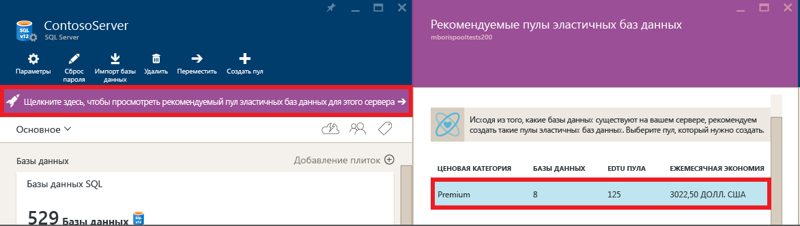
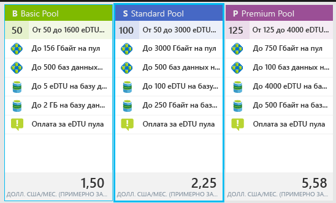
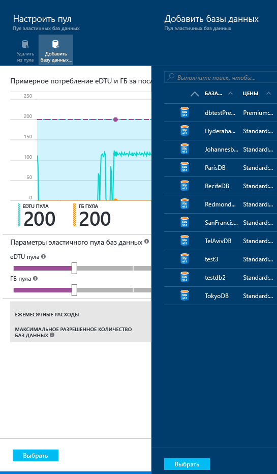
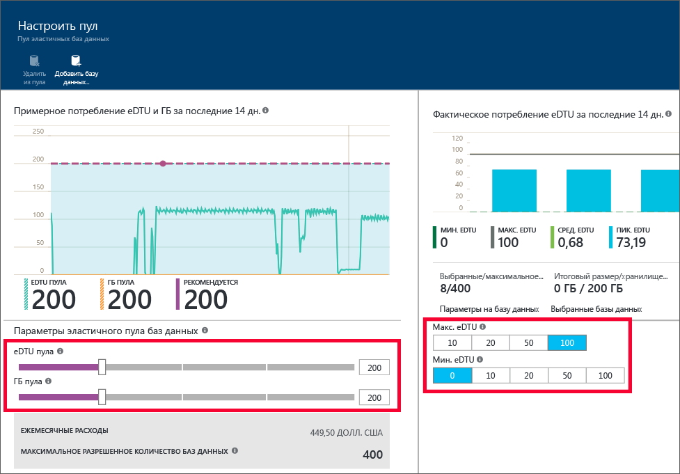

<properties
	pageTitle="Создание пула эластичных баз данных на портале Azure | Microsoft Azure"
	description="Добавление масштабируемого пула эластичных баз данных в конфигурацию баз данных SQL для упрощения администрирования и распределения ресурсов между несколькими базами данных."
	keywords="эластичная база данных, конфигурация базы данных"
	services="sql-database"
	documentationCenter=""
	authors="ninarn"
	manager="jhubbard"
	editor=""/>

<tags
	ms.service="sql-database"
	ms.devlang="NA"
	ms.date="07/20/2016"
	ms.author="ninarn"
	ms.workload="data-management"
	ms.topic="get-started-article"
	ms.tgt_pltfrm="NA"/>

# Создание пула эластичных баз данных на портале Azure

> [AZURE.SELECTOR]
- [Портал Azure](sql-database-elastic-pool-create-portal.md)
- [PowerShell](sql-database-elastic-pool-create-powershell.md)
- [C#](sql-database-elastic-pool-create-csharp.md)

В этой статье описано создание масштабируемого [пула эластичных баз данных](sql-database-elastic-pool.md) с помощью [портала Azure](https://portal.azure.com/). Пул можно создать двумя способами. Если вы знаете требуемые настройки пула, вы можете создать его с нуля, или же можно следовать рекомендациям службы. База данных SQL автоматически предоставляет интеллектуальные рекомендации по настройке пула, если это экономически выгодно для вас с учетом последних данных телеметрии об использовании базы данных.

На сервер можно добавить несколько пулов, но в один и тот же пул нельзя добавлять базы данных с разных серверов. Чтобы создать пул, требуется по крайней мере одна база данных на сервере версии 12. Если ее нет, см. статью [о создании первой базы данных SQL Azure](sql-database-get-started.md). Вы можете создать пул с одной базой данных, но экономически выгодными являются только пулы с несколькими базами данных. См. статью [Вопросы цены и производительности для пула эластичных баз данных](sql-database-elastic-pool-guidance.md).

> [AZURE.NOTE] Пулы эластичных БД общедоступны во всех регионах Azure, кроме западной Индии, где сейчас доступна только предварительная версия. Общедоступные пулы эластичных БД появятся в этом регионе в самое ближайшее время.

## Шаг 1. Создание пула

В этой статье объясняется, как создать пул в колонке существующего **сервера** на портале. Это самый простой способ перемещения существующих баз данных в пул.

> [AZURE.NOTE] Даже если у вас нет сервера, вы также можете создать пул в колонке **Пулы эластичных БД SQL**. (Для этого под списком в левой части портала последовательно выберите **Обзор** **>** **Пулы эластичных БД SQL**). Чтобы создать сервер во время рабочего процесса подготовки пула, в колонке **Пулы эластичных БД SQL** щелкните **Добавить** и следуйте инструкциям.

1. На [портале Azure](http://portal.azure.com/) под списком в левой части последовательно выберите **Обзор** **>** **Серверы SQL Server**, а затем щелкните сервер, содержащий базы данных, которые нужно добавить в пул.
2. Щелкните **Создать пул**.

    

    **-ИЛИ-**

    Возможно, вы увидите сообщение о наличии рекомендуемых пулов эластичных баз данных для сервера (только версии 12). Щелкните сообщение, чтобы просмотреть рекомендуемые пулы в зависимости от телеметрии использования базы данных за прошедший период, и выберите уровень, чтобы увидеть подробности и настроить пул. В разделе [Общие сведения о рекомендациях для пула](#understand-pool-recommendations) далее в этой статье объясняется, как создаются рекомендации.

    

    Появится колонка **Пул эластичных баз данных **, в которой можно настроить пул. Если вы выбрали **Создать пул** на предыдущем шаге, в разделе **Ценовая категория** портал выберет **пул Standard**, а также уникальное **имя** и конфигурацию по умолчанию для пула. Если вы выберете рекомендуемый пул, рекомендуемый уровень и конфигурация пула также будут выбраны, но вы сможете их изменить.

    

3. Укажите имя для пула эластичных БД или оставьте значение по умолчанию.

## Шаг 2. Выбор ценовой категории

Ценовая категория пула определяет функции, которые будут доступны для эластичных баз данных в пуле, максимальное количество единиц eDTU (eDTU MAX) и объем хранилища (в гигабайтах) для каждой базы данных. Дополнительные сведения см. в статье "Уровни служб".

Чтобы изменить ценовую категорию для пула, щелкните **Ценовая категория**, укажите нужную категорию и нажмите кнопку **Выбрать**.

> [AZURE.IMPORTANT] Если вы выбрали ценовую категорию и подтвердили изменения нажатием кнопки **ОК** на последнем шаге, изменить ценовую категорию пула будет невозможно. Чтобы изменить ценовую категорию для существующего пула эластичных баз данных, создайте пул эластичных баз данных в нужной ценовой категории и перенесите эластичные базы данных в этот пул.

## Шаг 3. Настройка пула

Задав ценовую категорию, щелкните "Настроить пул" (для пула, в который добавлены базы данных) и укажите значения eDTU и объема хранилища (в ГБ) для пула, а также максимальное и минимальное значение eDTU для эластичных баз данных в пуле.

1. Щелкните **Настроить пул**.
2. Выберите базы данных, которые нужно добавить в пул. Этот шаг является необязательным при создании пула. Базы данных можно добавить после создания пула. Чтобы добавить базы данных, щелкните **Добавить базу данных**, выберите базы данных, которые требуется добавить, и нажмите кнопку **Выбрать**.

    

    Если базы данных, с которыми вы работаете, содержат достаточно данных телеметрии об использовании за прошедший период, обновления графика **Estimated eDTU and GB usage** (Примерный объем использования eDTU и ГБ) и линейчатой диаграммы **Actual eDTU usage** (Фактический объем использования eDTU) помогут вам выбрать нужную конфигурацию. Кроме того, служба может предоставить вам рекомендации, которые помогут выбрать правильный размер пула. См. раздел [Динамические рекомендации](#dynamic-recommendations).

3. Используя элементы управления на странице **Настройка пула**, изучите параметры и настройте пул. Дополнительные сведения об ограничениях для каждого уровня обслуживания см. в разделе [eDTU и размеры хранилища для эластичных баз данных и пулов эластичных баз данных](sql-database-elastic-pool.md#edtu-and-storage-limits-for-elastic-pools-and-elastic-databases). Подробные рекомендации по выбору правильного размера пула см. в статье [Когда следует использовать пул эластичных баз данных?](sql-database-elastic-pool-guidance.md) Дополнительные сведения о параметрах пула см. в разделе [Свойства эластичного пула баз данных](sql-database-elastic-pool.md#elastic-database-pool-properties).

	

4. После изменения параметров щелкните **Выбрать** в колонке **Настройка пула**.
5. Нажмите кнопку **ОК**, чтобы создать пул.

## Общие сведения о рекомендациях для пула

Служба базы данных SQL оценивает историю использования и рекомендует один или несколько пулов, если этот вариант экономичнее, чем отдельные базы данных. Для предоставления каждой рекомендации используется уникальное подмножество баз данных на сервере, которое лучше всего подходит для формирования пула.

Рекомендация для пула включает следующие аспекты:

- ценовая категория для пула ("Базовый", "Стандартный" или "Премиум");
- соответствующее количество **единиц eDTU пула** (также называемое максимальным количеством единиц eDTU для одного пула);
- **максимальное** и **минимальное количество единиц eDTU** для каждой базы данных;
- список рекомендуемых баз данных для пула.

При составлении рекомендаций для пула служба учитывает данные телеметрии за последние 30 дней. Чтобы база данных рассматривалась для включения в пул эластичных баз данных, она должна существовать не менее 7 дней. Базы данных, которые уже находятся в пуле эластичных баз данных, не рассматриваются в качестве кандидатов для рекомендуемого добавления в пул.

Служба оценивает потребность в ресурсах и экономичность перемещения каждой отдельной базы данных на каждом уровне службы в пулы того же уровня. Например, все базы данных Standard на сервере оцениваются на предмет возможности их добавления в пул эластичных баз данных уровня Standard. Это означает, что служба не предоставляет кросс-уровневые рекомендации, такие как перемещение базы данных Standard в пул Premium.

### Динамические рекомендации

Когда базы данных будут добавлены в пул, на основе сведений об использовании выбранных баз данных будут динамически создаваться рекомендации. Эти рекомендации будут отображены в диаграмме использования (со значениями eDTU и ГБ), а также на баннере рекомендации в верхней части колонки **Настройка пула**. Эти рекомендации помогут создать пул, оптимизированный для конкретных баз данных.

## Дополнительные ресурсы

- [Monitor, manage, and size an elastic database pool with the Azure portal (Мониторинг и изменение размера пула эластичных баз данных и управление им с помощью портала Azure)](sql-database-elastic-pool-manage-portal.md)
- [Monitor and manage an elastic database pool (PowerShell) (Мониторинг пула эластичных баз данных и управление им с помощью PowerShell)](sql-database-elastic-pool-manage-powershell.md)
- [Создание базы данных SQL и управление ею с помощью C#](sql-database-elastic-pool-manage-csharp.md)
- [Общие сведения о возможностях эластичных баз данных](sql-database-elastic-scale-introduction.md)

<!---HONumber=AcomDC_0928_2016-->