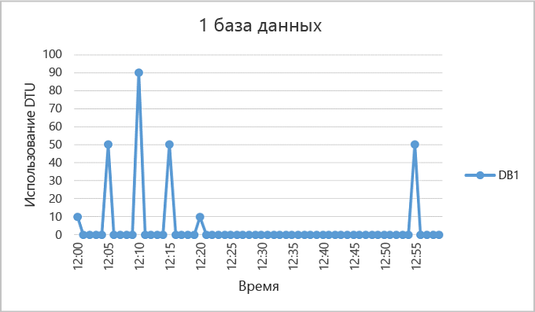
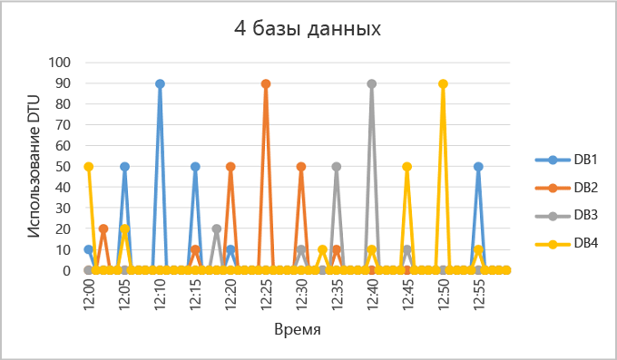
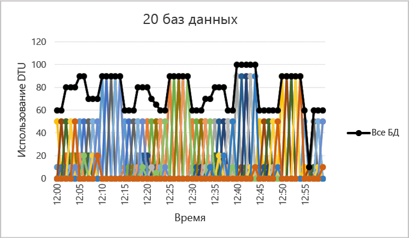

<properties
	pageTitle="Когда следует использовать пул эластичных баз данных?"
	description="Эластичный пул баз данных — это набор доступных ресурсов, совместно используемых группой эластичных баз данных. В этом документе представлены рекомендации, которые помогут оценить целесообразность использования пула эластичных баз данных для группы баз данных."
	services="sql-database"
	documentationCenter=""
	authors="stevestein"
	manager="jhubbard"
	editor=""/>

<tags
	ms.service="sql-database"
	ms.devlang="NA"
	ms.date="08/08/2016"
	ms.author="sstein"
	ms.workload="data-management"
	ms.topic="article"
	ms.tgt_pltfrm="NA"/>

# Когда следует использовать пул эластичных баз данных?
Оцените, является ли использование пула эластичных баз данных экономически эффективным, учитывая закономерности использования и ценовые различия между пулом эластичных баз данных и отдельными базами данных. Чтобы определить текущий размер пула, необходимый для существующего набора баз данных SQL, также предоставляются дополнительные рекомендации.

- Общие сведения о пулах см. в разделе [Пулы эластичных баз данных SQL](sql-database-elastic-pool.md).

> [AZURE.NOTE] Пулы эластичных БД общедоступны во всех регионах Azure, кроме северо-центрального региона США и западной Индии, в которых сейчас доступна только предварительная версия. Общедоступная версия появится в этих регионах в ближайшее время.

## Пулы эластичных баз данных

Разработчики SaaS создают приложения на основе уровней данных большого размера, состоящих из нескольких баз данных. Обычно для каждого клиента подготавливается одна база данных. Но нередко разные клиенты по-разному и непредсказуемо используют приложения, в связи с этим трудно спрогнозировать требования к ресурсам каждого отдельного пользователя базы данных. Поэтому разработчик может заложить избыточные ресурсы с сохранением разумных расходов, чтобы обеспечить подходящую пропускную способность и время отклика для всех баз данных. Разработчик также может сэкономить средства и подвергнуть риску производительность для своих клиентов. Дополнительные сведения о конструктивных шаблонах для приложений SaaS, использующих пулы эластичных БД, см. в статье [Design Patterns for Multi-tenant SaaS Applications with Azure SQL Database](sql-database-design-patterns-multi-tenancy-saas-applications.md) (Конструктивные шаблоны для мультитенантных приложений SaaS с использованием базы данных Azure SQL Database).

Пулы эластичных БД в базе данных SQL Azure позволяют разработчикам SaaS оптимизировать соотношение цены и производительности для группы баз данных с назначенным бюджетом и при этом обеспечить эластичность производительности для каждой базы данных. Пулы позволяют разработчикам покупать единицы транзакций эластичных баз данных (eDTU) для пула, который совместно используется несколькими базами данных, чтобы обеспечить работу отдельных баз данных в непрогнозируемые периоды использования. Требование к DTU для пула определяется совокупным использованием его баз данных. Количество единиц eDTU, доступных для пула, определяется бюджетом разработчика. Благодаря пулам разработчики могут легко обосновать влияние бюджета на производительность их пула и наоборот. Разработчик просто добавляет базы данных в пул, задает минимальное и максимальное число eDTU для баз данных и затем задает значение eDTU для пула на основе своего бюджета. С помощью пулов разработчик может легко перевести качество своих услуг с уровня небольшой новой компании на уровень состоявшегося бизнеса с возможностями роста.
## Когда следует использовать пул

Пулы хорошо подходят для большого числа баз данных с конкретными закономерностями использования. Для заданной базы данных эта закономерность характеризуется низким средним использованием с относительно редкими пиками использования.

Чем больше баз данных можно добавить в пул, тем больше экономия. Но в зависимости от закономерности использования приложения можно сэкономить средства при наличии всего двух баз данных уровня S3.

Следующие разделы помогут вам понять, как оценить преимущества использования пула для конкретного набора баз данных. В примерах используются пулы уровня Стандартный, однако эти же принципы применимы к пулам уровней Базовый и Премиум.

### Оценка закономерностей использования баз данных

На следующем рисунке показан пример базы данных, которая большую часть времени находится в режиме ожидания, но также у нее периодически возникают пики активности. Такая закономерность использования хорошо подходит для пула:

   

Для периода времени в пять минут, показанного на рисунке выше, пики базы данных DB1 достигают 90 DTU, но общее среднее использование составляет менее 5 DTU. Для запуска этой рабочей нагрузки в одной базе данных требуется уровень производительности S3, но при этом большая часть ресурсов останется неиспользуемой в периоды низкой активности.

Пул позволяет разделить эти незадействованные единицы DTU между несколькими базами данных, тем самым сокращая общее количество необходимых единиц DTU и уменьшая расходы.

На основе предыдущего примера предположим, что существуют дополнительные базы данных с закономерностями использования, схожими с закономерностью использования базы данных DB1. На следующих двух рисунках показано использование четырех и двадцати баз данных на одной диаграмме, чтобы продемонстрировать, что их использование не пересекается во времени:

   

   

Совокупное использование DTU для всех 20 баз данных показано черной линией на рисунке выше. На рисунке видно, что совокупное использование DTU никогда не превышает 100 DTU, и показано, что 20 баз данных могут совместно использовать 100 eDTU в этом периоде времени. Это приводит к 20-кратному сокращению количества единиц DTU и 13-кратному снижению цены по сравнению с размещением каждой базы данных на уровнях производительности S3 для отдельных баз данных.

Этот пример является идеальным по следующим причинам.

- Существует большая разница между пиковым использованием и средним использованием для каждой базы данных.
- Пиковое использование для каждой базы данных возникает в разное время.
- Единицы eDTU совместно используются большим числом баз данных.

Цена пула зависит от количества eDTU в пуле. Хотя цена единицы eDTU для пула в 1,5 раза выше цены единицы DTU для отдельной базы данных, **единицы eDTU пула могут совместно использовать множество баз данных, поэтому во многих случаях требуется меньшее общее количество единиц eDTU**. Эти различия в цене и совместное использование единиц eDTU является основой возможности экономии, которую может предоставить пул.

Следующие практические правила в отношении количества баз данных и их использования помогут гарантировать, что стоимость использования пула будет ниже по сравнению со стоимостью уровней производительности для отдельных баз данных.

### Минимальное число баз данных

Если сумма DTU уровней производительности для одной базы данных превышает 1,5 единицы eDTU, необходимых для пула, использовать эластичный пул будет более экономично. Доступные размеры см. в разделе [eDTU и размеры хранилища для эластичных баз данных и пулов эластичных баз данных](sql-database-elastic-pool.md#edtu-and-storage-limits-for-elastic-pools-and-elastic-databases).

***Пример*** . Чтобы использование пула было более экономичным, чем использование уровней производительности для отдельных баз данных, требуется не менее двух баз данных уровня S3 или не менее 15 баз данных уровня S0 для пула со 100 единицами eDTU.

### Максимальное число баз данных с одновременными пиками

Из-за совместного использования единиц eDTU не все базы данных в пуле могут одновременно использовать предельные значения единиц eDTU, которые доступны при использовании уровней производительности для отдельных баз данных. Чем меньше баз данных с одновременными пиками, тем меньше значение для единиц eDTU, которое можно задавать, и тем более экономичным становится пул. Как правило, в пуле должно быть не более 2/3 (или 67 %) от всего числа баз данных с одновременным пиком до предельных значений единиц eDTU.

***Пример*** . Чтобы сократить затраты для трех баз данных уровня S3 в пуле с 200 единицами eDTU, одновременно испытывать пиковые нагрузки должны не более двух баз данных в пуле. В противном случае, если пиковую нагрузку одновременно испытывают более двух из этих четырех баз данных уровня S3, размер пула необходимо увеличить, так чтобы количество единиц eDTU было больше 200. И если размер пула увеличится до значения единиц eDTU более 200, потребуется добавить больше баз данных S3, чтобы цена была ниже, чем у уровней производительности для отдельных баз данных.

Обратите внимание, что в данном примере не учитывается использование других баз данных в пуле. Если все базы данных используются в любой заданной временной точке, тогда одновременно испытывать пиковую нагрузку могут менее 2/3 (или 67 %) от числа баз данных.

### Использование единиц DTU на одну базу данных

Большая разница между пиковым и средним использованием базы данных указывает на продолжительные периоды низкого уровня использования и короткие периоды высокого уровня использования. Эта закономерность использования идеально подходит для совместного использования ресурсов несколькими базами данных. Следует рассматривать помещение базы данных в пул, если ее загрузка пикового использования в 1,5 раза больше загрузки среднего использования.

***Пример*** . База данных уровня S3 с пиковым использованием 100 единиц DTU и средним использованием 67 единиц DTU или менее хорошо подходит для совместного использования единиц eDTU в пуле. Кроме того, база данных уровня S1 с пиковым использованием 20 единиц DTU и средним использованием 13 единиц DTU или менее хорошо подходит для пула.

## Изменение размера пула эластичных БД

Наилучший размер пула зависит от совокупного количества единиц eDTU и ресурсов хранения, необходимых для всех баз данных в пуле. Для этого необходимо определить наибольшую из следующих двух величин:

* Максимальное число единиц DTU, используемых всеми базами данных в пуле.
* Максимальное число байтов памяти, используемых всеми базами данных в пуле.

Доступные размеры см. в разделе [eDTU и размеры хранилища для эластичных баз данных и пулов эластичных баз данных](sql-database-elastic-pool.md#edtu-and-storage-limits-for-elastic-pools-and-elastic-databases).

База данных SQL автоматически оценивает историю использования ресурсов баз данных на существующем сервере баз данных SQL и рекомендует подходящую конфигурацию пула в портале Azure. В дополнение к рекомендациям существуют встроенные возможности по оценке использования единиц eDTU для пользовательских групп баз данных на сервере. Это позволяет выполнить анализ "что если", интерактивно добавляя базы данных в пул и удаляя их, а также получить аналитические данные об использовании ресурсов и изменить размер перед выполнением изменений на практике. Инструкции см. в разделе [Мониторинг, управление и размер пула эластичных БД](sql-database-elastic-pool-manage-portal.md).

Более гибкие расчеты использования ресурсов, которые позволяют выполнять нерегламентированную оценку размера для серверов с версией ниже 12, а также расчеты размеров для баз данных на различных серверах см. в статье [Сценарий PowerShell для идентификации баз данных, подходящих для пула эластичных баз данных](sql-database-elastic-pool-database-assessment-powershell.md).

| Функция | Взаимодействие с порталом|	Сценарий PowerShell|
|:---------------|:----------|:----------|
| Степень детализации данных | 15 секунд | 15 секунд
| Учет различий в цене между пулом и уровнями производительности для отдельных баз данных.| Да| Нет
| Возможность настройки списка проанализированных баз данных.| Да| Да
| Возможность настройки периода времени, используемого в анализе.| Нет| Да
| Возможность настройки списка баз данных, проанализированных на различных серверах.| Нет| Да
| Возможность настройки списка баз данных, проанализированных на серверах версии 11.| Нет| Да

В случаях, когда невозможно использовать инструменты, вы сможете оценить экономность пула по сравнению с отдельными базами данных, выполнив следующие пошаговые инструкции:

1.	Оцените количество единиц eDTU, необходимых для пула, следующим образом:

    Макс. (<*общее количество баз данных* X *среднее использование единиц DTU на базу данных*>,   
    <*количество баз данных с одновременными пиками* X *пиковое использование единиц DTU на базу данных*)

2.	Оцените пространство хранилища, необходимое для пула, сложив количество байтов, необходимых для всех баз данных в пуле. Затем определите размер пула eDTU, который предоставляет этот объем хранилища. Ограничения хранилища пула по размеру пула в eDTU см. в разделе [eDTU и размеры хранилища для эластичных баз данных и пулов эластичных баз данных](sql-database-elastic-pool.md#edtu-and-storage-limits-for-elastic-pools-and-elastic-databases).
3.	Выберите максимальную из оценок количества единиц eDTU, полученных на шаге 1 и шаге 2.
4.	Загляните на [страницу цен для баз данных SQL](https://azure.microsoft.com/pricing/details/sql-database/) и найдите наименьшее количество единиц eDTU для пула, которое будет больше оценки, полученной на шаге 3.
5.	Сравните стоимость пула из шага 5 со стоимостью использования подходящих уровней производительности отдельных баз данных.

## Сводка

Не все отдельные базы данных являются оптимальными кандидатами на включение в пулы. Базы данных, которые характеризуются низким средним уровнем использования и относительно редкими пиками использования, прекрасно подходят для включения в пул. Закономерности использования приложений являются динамическими, поэтому используйте информацию и инструменты, описанные в данной статье для первоначальной оценки, которая поможет понять, является ли пул подходящим вариантом для некоторых или всех баз данных. В этой статье представлены лишь начальные данные, которые помогут решить, подходит ли вам пул эластичных баз данных. Помните, что следует постоянно отслеживать историю использования и выполнять переоценку уровней производительности всех ваших баз данных. Не забывайте, что можно легко перемещать базы данных в пул эластичных БД и из него, и, если у вас очень много баз данных, можно иметь несколько пулов различного размера, между которыми можно разделить свои базы данных.

## Дальнейшие действия

- [Создание пула эластичных баз данных](sql-database-elastic-pool-create-portal.md)
- [Мониторинг, управление и размер пула эластичных баз данных](sql-database-elastic-pool-manage-portal.md)
- [Параметры и производительность баз данных SQL: возможности разных уровней службы](sql-database-service-tiers.md)
- [Сценарий PowerShell для идентификации баз данных, подходящих для пула эластичных баз данных](sql-database-elastic-pool-database-assessment-powershell.md)

<!---HONumber=AcomDC_0921_2016-->